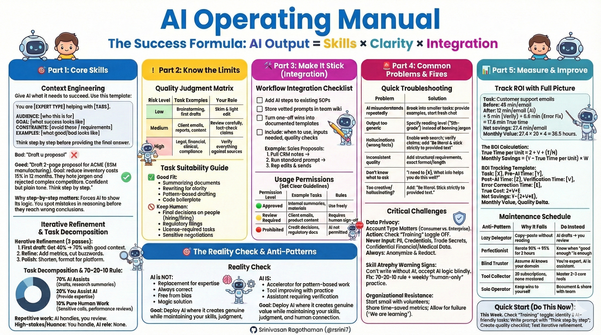

# AI Operating Manual

**The Success Formula:** AI Output = Skills × Clarity × Integration

---

## 🎯 What You Need to Know in 120 Seconds

**𝗔𝗜 𝗢𝗽𝗲𝗿𝗮𝘁𝗶𝗻𝗴 𝗠𝗮𝗻𝘂𝗮𝗹: 𝗧𝗵𝗲 𝗘𝗻𝘁𝗲𝗿𝗽𝗿𝗶𝘀𝗲 𝗟𝗲𝘃𝗲𝗿𝗮𝗴𝗲 𝗙𝗿𝗮𝗺𝗲𝘄𝗼𝗿𝗸**
How do organizations scale AI output without collapsing under technical debt or skill atrophy?

━━━━━━━━━━━━━━━━━━━━

⚡ **𝗧𝗵𝗲 𝗣𝗿𝗼𝗯𝗹𝗲𝗺: The Productivity-Quality Gap**
Most teams treat AI as a "magic box," leading to generic, hallucination-prone outputs that fail in production. This "lazy delegation" results in a **𝟱𝟬%+ failure rate** for complex tasks and risks trapping companies in a cycle of high-volume, low-value content that costs **$𝟭𝟬𝟬𝗸𝘀+ in manual remediation** and brand damage.

━━━━━━━━━━━━━━━━━━━━

📈 **𝗧𝗵𝗲 𝗦𝗼𝗹𝘂𝘁𝗶𝗼𝗻: The AI Success Formula**
The **𝗔𝗜 𝗢𝗽𝗲𝗿𝗮𝘁𝗶𝗻𝗴 𝗠𝗮𝗻𝘂𝗮𝗹** is a structured methodology to maximize **𝗔𝗜 𝗢𝘂𝘁𝗽𝘂𝘁** by balancing technical skills, instruction clarity, and workflow integration.

* **Context Engineering** → Eliminates ambiguity through structured expertise-based prompting
* **Iterative Refinement** → Moves quality from `𝟰𝟬%` (first draft) to `𝟳𝟬%+` (production-ready)
* **Task Decomposition** → Optimizes resource allocation between human and machine agents

━━━━━━━━━━━━━━━━━━━━

🔧 **𝗖𝗼𝗿𝗲 𝗔𝗿𝗰𝗵𝗶𝘁𝗲𝗰𝘁𝘂𝗿𝗲: The 70-20-10 Stack**
1️⃣ **AI-Led Layer (70%)**: Pattern-based automation for `drafts`, `summaries`, and `boilerplate`.
2️⃣ **Hybrid Layer (20%)**: Domain expert intervention to provide context the AI lacks.
3️⃣ **Human-Only Layer (10%)**: High-stakes judgment, sensitive negotiations, and `empathy-driven` calls.

━━━━━━━━━━━━━━━━━━━━

🛒 **𝗖𝗼𝗿𝗲 𝗙𝗲𝗮𝘁𝘂𝗿𝗲𝘀: Workflow & Capabilities**
Standardizing the interface between human intent and machine execution.

1. **Context Template** (`Chain-of-Thought`) → Forces AI to show its logic; surface reasoning errors before final output.
2. **Quality Judgment Matrix** (`Risk-Leveling`) → Adjusts review intensity based on task impact (Low/Medium/High).
3. **ROI Tracker** (`True-Cost-Analysis`) → Calculates net savings by subtracting `verification` and `correction` time.
4. **Usage Permissions** (`Green/Yellow/Red`) → Defines clear safety boundaries for internal vs. regulated data.

━━━━━━━━━━━━━━━━━━━━

🛡️ **𝗕𝗲𝗻𝗲𝗳𝗶𝘁𝘀: Security, Performance & Trust**
Moving beyond simple efficiency to systemic organizational resilience.

* **Risk Mitigation**: The `Account-Type Audit` ensures PII and trade secrets stay out of training sets, protecting long-term **𝗜𝗣 𝘃𝗮𝗹𝘂𝗲**.
* **Skill Preservation**: Intentional "human-only" practice cycles prevent **𝗦𝗸𝗶𝗹𝗹 𝗔𝘁𝗿𝗼𝗽𝗵𝘆**, ensuring the team remains the expert, not the assistant.
* **Economic Clarity**: Including `verification time` in ROI formulas stops "false efficiency" where AI speed is offset by manual cleanup costs.
* **Architectural Logic**: `Chain-of-Thought` prompting creates an audit trail of how decisions were reached, increasing **𝗧𝗿𝘂𝘀𝘁** in automated workflows.

━━━━━━━━━━━━━━━━━━━━

⚖️ **𝗦𝘁𝗿𝗮𝘁𝗲𝗴𝗶𝗰 𝗩𝗲𝗿𝗱𝗶𝗰𝘁: Efficiency vs. Expertise**

The manual highlights a critical strategic trade-off: **Vertical Skill Deepening** vs. **Horizontal AI Scaling**.

**Full-Stack Human Expertise**

* Strength: High-trust, non-replicable judgment in "Red Zone" tasks.
* Risk: Becoming a bottleneck in high-volume markets.
* Best for: Legal, clinical, and complex strategy leads.

**AI-Augmented Scaling**

* Strength: Radical reduction in cost-per-unit for pattern-based work.
* Risk: Execution risk if the "Training" toggle or PII sanitation fails.
* Best for: Sales, support, and developer platforms.

**Watch**: **The Error-to-Verification Ratio**. If the time spent fact-checking AI (`V`) exceeds the time saved drafting (`Y-Z`), the workflow is a net loss. Success is determined by the stability of the **𝗔𝗜 𝗦𝘂𝗰𝗰𝗲𝘀𝘀 𝗙𝗼𝗿𝗺𝘂𝗹𝗮** over quarterly production cycles.

━━━━━━━━━━━━━━━━━━━━

**𝗧𝗟;𝗗𝗥**

* **Chain-of-Thought is Mandatory** → Seeing the "why" is the only way to trust the "what."
* **Privacy is a Configuration** → Check your `Training` toggle; data security starts at the settings menu.
* **Track the "True Cost"** → If you aren't measuring verification time, you aren't measuring ROI.

**Will the next generation of industry leaders be those who use AI the most, or those who know exactly when to turn it off?**

👤 **Srinivasan Ragothaman (@rsrini7)**



---


---

## 🎯 Part 1: Core Skills

### Context Engineering
Give AI what it needs to succeed. Use this template:

```
You are [EXPERT TYPE] helping with [TASK].

AUDIENCE: [who this is for]
GOAL: [what success looks like]  
CONSTRAINTS: [avoid these / requirements]
EXAMPLES: [what good/bad looks like]

Think step by step before providing the final answer.
```

**Bad:** "Draft a proposal"  
**Good:** "Draft 2-page proposal for ACME ($5M manufacturing). Goal: reduce inventory costs 15% in 12 months. They hate jargon and rejected complex competitors. Confident but plain tone. Think step by step."

**Why step-by-step matters:** Forces AI to show its logic. You spot mistakes in reasoning before they reach wrong conclusions.

### Iterative Refinement
Treat AI like a junior colleague—work in passes:

1. **First draft:** Get 40% → 70% with good context
2. **Refine:** "Too generic. Add 2 metrics, cut buzzwords, tighten intro to 3 sentences"
3. **Polish:** "Shorten to 400 words, LinkedIn-ready"

**After each interaction:** What worked? What's missing? What will I specify upfront next time?

### Task Decomposition
Split work into: **you do** | **AI does** | **you verify**

**Repetitive, pattern-based work:**
- AI handles: drafts, summaries, variants, boilerplate
- You handle: review and edits

**High-stakes judgment, politics, nuance:**
- You handle: decisions, strategy, sensitive calls
- AI role: None

**Remaining tasks:**
- AI drafts
- You review and decide

**The 70-20-10 Rule:**
- 70%: AI assists you (standard drafting, research summaries)
- 20%: You assist AI (provide domain expertise it lacks)
- 10%: Pure human work (performance reviews for struggling employees, sensitive negotiations, empathy-requiring conversations)

---

## ⚠️ Part 2: Know the Limits

### Quality Judgment Matrix

| Risk Level | Task Examples | Your Role |
|------------|---------------|-----------|
| **Low** | Brainstorming, subject lines, first drafts | Skim & light edit |
| **Medium** | Client emails, reports, content | Review carefully, fact-check claims |
| **High** | Legal, financial, clinical, compliance | Verify everything against sources |

### Task Suitability Guide

**✅ Good Fit:**
- Summarizing documents
- Rewriting for clarity  
- Generating variations
- Pattern-based drafting
- Code boilerplate

**⚠️ Requires Expert Review:**
- Novel interpretations
- Complex diagnoses
- New risk models
- High-impact strategy

**🚫 Keep Human:**
- Final decisions on people (hiring, firing, promotions)
- Regulatory filings
- Anything requiring legal/medical license
- Sensitive negotiations
- Performance reviews for struggling employees

---

## 🛠️ Part 3: Make It Stick (Integration)

### Workflow Integration Checklist

- [ ] Add AI steps to existing SOPs
- [ ] Store vetted prompts in team wiki
- [ ] Turn one-off wins into documented templates
- [ ] Include: when to use, what inputs needed, quality checks

**Example: Sales Proposals**
1. Pull CRM notes → 2. Run standard prompt → 3. Rep edits & sends

### Usage Permissions (Set Clear Guidelines)

| Permission Level | Example Tasks | Rules |
|------|---------------|-------|
| 🟢 **Approved** | Internal summaries, training materials | Use freely |
| 🟡 **Review Required** | Client emails, product content | Requires human sign-off |
| 🔴 **Prohibited** | Credit decisions, regulatory docs | AI not permitted |

---

## 🚨 Part 4: Common Problems & Fixes

### Quick Troubleshooting

| Problem | Solution |
|---------|----------|
| **AI misunderstands repeatedly** | Break into smaller tasks; provide good/bad examples; start fresh chat |
| **Output too generic** | Specify exact reading level: "Write for 5th-grade reading level" instead of "Don't use jargon" |
| **Hallucinations (wrong facts)** | Enable web search; verify all claims; add "Be literal and stick strictly to the provided text" |
| **Inconsistent quality** | Add structural requirements; specify exact format/length |
| **Don't know what to ask** | "I need to [X]. What info helps you do this well?" |
| **AI ignores instructions** | Put critical constraints FIRST; rephrase "don't do X" as "do Y exactly" |
| **Conversation too long** | Start fresh with summary; use artifacts for key info |
| **Output too creative** | Add: "Be literal. Stick strictly to provided text. Minimize interpretation." |

### Critical Challenges

**Data Privacy:**

**Account Type Matters:**
- **Consumer accounts:** Data you enter may be used to train future models
- **Enterprise accounts:** Check with your organization's IT policy

**Action Required:**
- Check if your "Training" toggle is OFF (found in account settings)
- This prevents your conversations from being used in model training

**Never Input (Any Account Type):**
- ❌ Customer PII (names, emails, addresses, phone numbers)
- ❌ Passwords, API keys, credentials
- ❌ Proprietary algorithms or trade secrets
- ❌ Confidential financial data
- ❌ Medical records or protected health information
- ❌ Non-public legal matters

**Always:**
- ✅ Anonymize data before input
- ✅ Redact sensitive information
- ✅ Check company policy before using AI for work tasks

**Skill Atrophy Warning Signs:**
- Can't write without AI
- Accept AI logic without understanding
- Stopped thinking things through yourself

**Fix:** 70-20-10 rule + weekly "human-only" practice on important content

**Organizational Resistance:**
- Start with volunteers on painful tasks
- Share time-saved metrics publicly
- Make it safe to fail: "We expect to learn what doesn't work"

---

## 📊 Part 5: Measure & Improve

### Track ROI with Full Picture

```
Task: Customer support emails
Before: 45 min/email
After: 12 min/email (AI draft)
Verification time: 5 min/email (fact-checking)
Errors found: 1 every 5 emails (3 min to fix)
True time per email: 12 + 5 + 0.6 = 17.6 min

Net savings: 45 - 17.6 = 27.4 min/email
Frequency: 20/week
Monthly value: 27.4 × 20 × 4 = 2,192 minutes = 36.5 hours
```

**ROI Tracking Template:**
```
Task: [X]
Pre-AI time: [Y hours]
Post-AI time: [Z hours]
Verification time: [V hours]
Error correction time: [E hours]
True cost: Z + V + E
Net savings: Y - (Z + V + E)
Frequency: [W times per month]
Monthly value: Net savings × W
Quality delta: [Better/Same/Worse + explanation]
```

### Maintenance Schedule

**Weekly:** Review one trusted output for errors; save one good prompt; share one learning

**Monthly:** Audit subscriptions; calculate time saved; do one task "human-only"

**Quarterly:** Update team guidelines; measure ROI; evaluate new tools

---

## ❌ Don't Do This (Anti-Patterns)

| Anti-Pattern | Why It Fails | Do Instead |
|--------------|--------------|------------|
| **Lazy Delegator** | Copy-paste without reading | AI drafts → you review |
| **Perfectionist** | Iterate 90% → 95% for 2 hours | Know when "good enough" is enough |
| **Blind Truster** | Assume AI knows your domain | You're expert. AI is assistant. |
| **Tool Collector** | 20 subscriptions, none mastered | Master 2-3 core tools |
| **Solo Operator** | Keep wins to yourself | Document & share with team |

---

## ✅ Quick Start (Do This Now)

### This Week
1. Check your "Training" toggle (turn OFF if you handle sensitive data)
2. Identify 3 AI-friendly recurring tasks
3. Write one strong context prompt with "Think step by step"
4. Create quality checklist for one high-stakes task
5. Test iterative refinement on real work

### This Month
1. Document one successful workflow
2. Map your tasks: AI-friendly / AI-assisted / Human-only
3. Calculate true ROI (including verification time)
4. Share one learning publicly

### This Quarter
1. Integrate AI into 3 team SOPs
2. Create usage permissions for your domain
3. Measure time saved and quality gains
4. Review error rates and adjust verification processes

---

## 🔍 Troubleshooting Steps

**When AI isn't working:**

**Problem: Unclear instructions?**
→ Use better context template with "Think step by step"

**Problem: Wrong task for AI?**
→ Check Task Suitability Guide

**Problem: Generic output?**
→ Specify reading level instead of banning jargon

**Problem: Can't verify?**
→ Build quality checklist with verification time budget

**Problem: Privacy risk?**
→ Check Training toggle; sanitize inputs; never input PII

**Problem: Team won't adopt?**
→ Show wins; start small with volunteers

**Problem: Can't prove value?**
→ Track full metrics (time + verification + error correction)

**Problem: Too creative/hallucinating?**
→ Add: "Be literal. Stick strictly to provided text."

---

## 🎯 The Reality Check

**AI is NOT:**
- Replacement for domain expertise
- Always correct (verify critical claims)
- Substitute for human judgment on high-stakes decisions
- Free from bias
- Magic solution to poor processes (garbage in, garbage out)
- Suitable for every task

**AI IS:**
- Accelerator for pattern-based work
- Best when guided by clear human judgment
- Tool that improves with practice and structure
- Most valuable when integrated into workflows
- Assistant that requires verification

**Goal:** Deploy AI where it creates genuine value while maintaining skills, judgment, and human connection that AI cannot replicate.

**Remember:** Track the full cost (drafting + verification + error correction). The goal is net time savings with maintained quality, not maximum AI use.