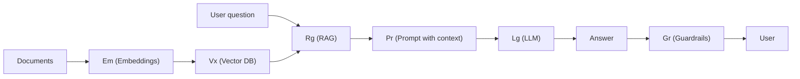
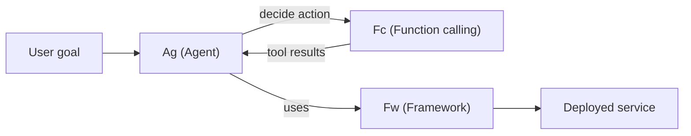
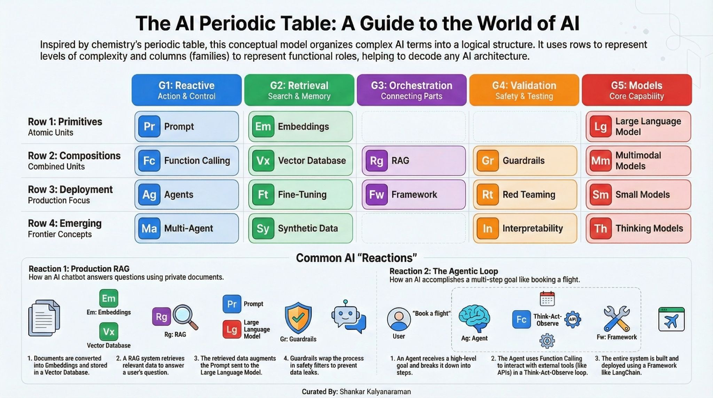

# AI Periodic Table

## 1. Core Idea

The **AI periodic table** is a conceptual map that arranges AI building blocks (prompts, embeddings, RAG, agents, etc.) into rows and columns, similar to chemistry’s periodic table.[2][1]
Rows capture maturity or stage in the lifecycle (from basic building blocks to emerging ideas), while columns group elements by their role in an AI system (reactive, retrieval, orchestration, validation, models).[1][2]

## 2. Axes: Rows and Columns

### 2.1 Rows – Lifecycle / Maturity

There are four rows, from most basic to most advanced:[2][1]

- **Row 1 – Primitives**  
  Fundamental, atomic concepts that cannot be decomposed much further (Prompts, Embeddings, LLMs).[1][2]
- **Row 2 – Compositions**  
  Combinations of primitives into useful patterns (Function calling, Vector DBs, RAG, Guardrails, Multimodal models).[2][1]
- **Row 3 – Deployment**  
  Elements focused on putting systems into production (Agents, Fine‑tuning, Frameworks, Red teaming, Small models).[1][2]
- **Row 4 – Emerging**  
  Fast‑moving, not yet standardized concepts (Multi‑agent systems, Synthetic data, Interpretability, Thinking models).[2][1]

### 2.2 Columns – Functional Families

There are five functional **families** (groups):[1][2]

- **G1 – Reactive**  
  Things that “do” or act: prompts, function calls, agents, multi‑agent systems.[2][1]
- **G2 – Retrieval**  
  Things that store or adapt knowledge: embeddings, vector DBs, fine‑tuning, synthetic data.[1][2]
- **G3 – Orchestration**  
  Glue that coordinates components: RAG, frameworks; the emerging orchestration slot is intentionally left open.[2][1]
- **G4 – Validation**  
  Safety and robustness: guardrails, red teaming, interpretability.[1][2]
- **G5 – Models**  
  Core model capabilities: base LLMs, multimodal models, small models, thinking models.[2][1]

***

## 3. Elements by Family and Row

### 3.1 Reactive Family (G1)

These elements control or execute behavior and grow from simple control to high autonomy.[1][2]

- **Pr (Prompt) – Row 1, Primitive**  
  Natural‑language instructions given to a model; extremely **reactive** (changing a word can change the output).[1]
- **Fc (Function calling) – Row 2, Composition**  
  Lets an LLM call tools/APIs (e.g., weather API) before answering, connecting language to actions.[1]
- **Ag (Agent) – Row 3, Deployment**  
  Uses a think–act–observe loop: plans, calls tools (often via function calling), inspects results, repeats until a goal is reached.[1]
- **Ma (Multi‑agent) – Row 4, Emerging**  
  Multiple agents collaborating, debating, and specializing (e.g., researcher, writer, critic working together).[1]

**Conceptual progression:** prompt → function call → agent → multi‑agent (control → action → autonomy → collective autonomy).[2][1]

***

### 3.2 Retrieval Family (G2)

These elements handle **memory** and information access at different stages and time scales.[2][1]

- **Em (Embeddings) – Row 1, Primitive**  
  Numeric vectors representing meaning; similar texts get similar vectors, enabling semantic search.[1]
- **Vx (Vector DB) – Row 2, Composition**  
  Database optimized for storing and searching millions of embeddings efficiently.[1]
- **Ft (Fine‑tuning) – Row 3, Deployment**  
  Adjusts a base model using domain data; encodes knowledge directly into model weights (long‑term memory).[1]
- **Sy (Synthetic data) – Row 4, Emerging**  
  AI‑generated training data to overcome limited real examples; increasingly important as real data saturates.[1]

**Three memory time scales:**[2][1]
- Embeddings: short‑term semantic encoding.  
- Vector DB: external searchable memory.  
- Fine‑tuning: baked‑in parametric memory.

***

### 3.3 Orchestration Family (G3)

These elements connect multiple components into workflows.[2][1]

- **Rg (RAG – Retrieval Augmented Generation) – Row 2, Composition**  
  Retrieves context via embeddings + vector DB, augments the prompt, then calls the LLM; grounds answers in external data.[1]
- **Fw (Framework) – Row 3, Deployment**  
  Libraries/platforms (e.g., LangChain‑like tools) used to build, connect, and deploy AI systems and agentic workflows.[1]
- **(Gap) – Row 4, Emerging**  
  The video intentionally leaves the “emerging orchestration” slot open, suggesting no clear next‑generation orchestration paradigm yet.[1]

**Key insight:** Orchestration has no primitive; it only appears when multiple elements are combined.[1]

***

### 3.4 Validation Family (G4)

Validation focuses on safety, robustness, and understanding model behavior.[2][1]

- **Gr (Guardrails) – Row 2, Composition**  
  Runtime filters, schema validation, and policy checks that block unsafe or nonsensical outputs.[1]
- **Rt (Red teaming) – Row 3, Deployment**  
  Adversarial testing to probe jailbreaks, prompt injection, data exfiltration, and other vulnerabilities.[1]
- **In (Interpretability) – Row 4, Emerging**  
  Techniques to understand why models behave as they do, often by inspecting internal neurons and circuits; tied to frontier safety.[1]

**Theme:** from basic output filtering to systematic attack testing to deep understanding of internal mechanisms.[1]

***

### 3.5 Models Family (G5)

These are the **noble gases** of the table: relatively stable capabilities everything else reacts around.[2][1]

- **Lg (Large language model) – Row 1, Primitive**  
  General‑purpose text models (ChatGPT, Claude, IBM Granite, etc.).[1]
- **Mm (Multimodal model) – Row 2, Composition**  
  Models that understand text + images + audio (and sometimes video).[1]
- **Sm (Small model) – Row 3, Deployment**  
  Distilled/specialized models that are cheaper and faster, often able to run on edge devices like phones.[1]
- **Th (Thinking model) – Row 4, Emerging**  
  Models that allocate extra test‑time compute to reasoning (e.g., built‑in chain‑of‑thought, test‑time scaling) and tend to be the most capable.[1]

**Design trade‑off:** choose between big general models, smaller specialized ones, or more computationally intensive “thinking” models.[2][1]

***

## 4. Example “Reactions” (System Patterns)

The power of the table is in **predicting reactions**: how elements combine into real systems.[2][1]

### 4.1 Production RAG Chatbot

A typical “chat with my company docs” system uses:[1]

- **Em** – Embed the documents.  
- **Vx** – Store embeddings in a vector DB.  
- **Rg** – Use RAG to query the vector DB for relevant chunks.  
- **Pr** – Build a prompt that includes the user question + retrieved chunks.  
- **Lg** – Call the LLM to generate an answer grounded in the retrieved context.  
- **Gr** – Wrap the pipeline in guardrails to prevent leakage or harmful outputs.  

This corresponds to a reaction:

### 4.2 Agentic Loop

An agent that books a flight under constraints (e.g., “Tokyo next month under 800 USD”) uses:[1]

- **Ag** – Takes the user goal and decomposes it into steps.  
- **Fc** – Calls external tools (flight APIs, calendar, payments).  
- **Ag ↔ Fc loop** – Think → act → observe → repeat.  
- **Fw** – Framework that hosts and wires the agent loop into a production workflow.  

Agentic reaction:

***

## 5. How to Use This Table in Practice

### 5.1 For Understanding Architectures

When facing a new AI product or feature, you can ask:[2][1]

- Which **row** does it sit in (primitive, composition, deployment, emerging)?  
- Which **family** (reactive, retrieval, orchestration, validation, models)?  
- Which elements are **missing** (e.g., no guardrails, no validation, no retrieval)?

This reveals whether the system is over‑engineered, under‑secured, or using more model complexity than needed.[2][1]

### 5.2 For Designing Systems

When designing an AI solution:

- Start with **Pr + Lg** for simple use‑cases.[1]
- Add **Em + Vx + Rg** if you need your own data (RAG).[1]
- Introduce **Gr + Rt + In** as safety and complexity grow.[1]
- Consider **Ag/Ma + Fw** for complex, multi‑step or multi‑tool workflows.[1]
- Choose between **Lg, Sm, Th** depending on latency, cost, and reasoning needs.[2][1]

This AI periodic table becomes a compact mental model to reason about almost any LLM/RAG/agent architecture and to see how it might evolve.[2][1]

# 𝗧𝗵𝗲 𝗔𝗜 𝗣𝗲𝗿𝗶𝗼𝗱𝗶𝗰 𝗧𝗮𝗯𝗹𝗲: 𝗔 𝗙𝗿𝗮𝗺𝗲𝘄𝗼𝗿𝗸 𝗧𝗵𝗮𝘁 𝗠𝗮𝗸𝗲𝘀 𝗦𝗲𝗻𝘀𝗲 𝗼𝗳 𝗔𝗜
## RAG. Embeddings. Agents. Guardrails. Fine-tuning.

---
### **𝗪𝗵𝗮𝘁 𝗶𝘀 𝘁𝗵𝗲 𝗔𝗜 𝗣𝗲𝗿𝗶𝗼𝗱𝗶𝗰 𝗧𝗮𝗯𝗹𝗲?**
A conceptual model inspired by chemistry's periodic table.

  → 𝗥𝗼𝘄𝘀: Levels of complexity

  → 𝗖𝗼𝗹𝘂𝗺𝗻𝘀: Functional roles (families)

Think: Elements that combine to form AI "compounds."

---

### **𝗧𝗵𝗲 𝟱 𝗚𝗿𝗼𝘂𝗽𝘀 (𝗙𝘂𝗻𝗰𝘁𝗶𝗼𝗻𝗮𝗹 𝗥𝗼𝗹𝗲𝘀)**
🟠 𝗚𝟭: 𝗥𝗲𝗮𝗰𝘁𝗶𝘃𝗲 — Prompt → Function Calling → Agents → Multi-Agent

🟢 𝗚𝟮: 𝗥𝗲𝘁𝗿𝗶𝗲𝘃𝗮𝗹 — Embeddings → Vector DB → Fine-Tuning → Synthetic Data

🔵 𝗚𝟯: 𝗢𝗿𝗰𝗵𝗲𝘀𝘁𝗿𝗮𝘁𝗶𝗼𝗻 — RAG → Framework

🟣 𝗚𝟰: 𝗩𝗮𝗹𝗶𝗱𝗮𝘁𝗶𝗼𝗻 — Guardrails → Red Teaming → Interpretability

🔴 𝗚𝟱: 𝗠𝗼𝗱𝗲𝗹𝘀 — LLM → Multimodal → Small Models → Thinking Models

---
### **𝗧𝗵𝗲 𝟰 𝗥𝗼𝘄𝘀 (𝗖𝗼𝗺𝗽𝗹𝗲𝘅𝗶𝘁𝘆 𝗟𝗲𝘃𝗲𝗹𝘀)**
𝗣𝗿𝗶𝗺𝗶𝘁𝗶𝘃𝗲𝘀 — Atomic units (Prompt, Embeddings, LLM)

𝗖𝗼𝗺𝗽𝗼𝘀𝗶𝘁𝗶𝗼𝗻𝘀 — Combined units (Function Calling, RAG)

𝗗𝗲𝗽𝗹𝗼𝘆𝗺𝗲𝗻𝘁 — Production focus (Agents, Frameworks)

𝗘𝗺𝗲𝗿𝗴𝗶𝗻𝗴 — Frontier concepts (Multi-Agent, Thinking Models)

---
### **𝗔𝗜 "𝗥𝗲𝗮𝗰𝘁𝗶𝗼𝗻𝘀" — 𝗛𝗼𝘄 𝗘𝗹𝗲𝗺𝗲𝗻𝘁𝘀 𝗖𝗼𝗺𝗯𝗶𝗻𝗲**

⚗️ 𝗥𝗲𝗮𝗰𝘁𝗶𝗼𝗻 𝟭: 𝗣𝗿𝗼𝗱𝘂𝗰𝘁𝗶𝗼𝗻 𝗥𝗔𝗚

  1️⃣ Documents → Embeddings → Vector DB

  2️⃣ RAG retrieves relevant data 

  3️⃣ Prompt + context → LLM → Guardrails

𝗥𝗲𝘀𝘂𝗹𝘁: Safe, accurate answers from your data.

⚗️ 𝗥𝗲𝗮𝗰𝘁𝗶𝗼𝗻 𝟮: 𝗧𝗵𝗲 𝗔𝗴𝗲𝗻𝘁𝗶𝗰 𝗟𝗼𝗼𝗽

  1️⃣ User goal → Agent breaks it into steps 

  2️⃣ Function Calling (Think-Act-Observe loop) 

  3️⃣ Framework orchestrates the system

𝗥𝗲𝘀𝘂𝗹𝘁: AI that takes action, not just answers.

---

### **𝗪𝗵𝘆 𝗧𝗵𝗶𝘀 𝗠𝗮𝘁𝘁𝗲𝗿𝘀**
✅ Executives: Understand what your AI teams build 

✅ Developers: See where tech fits in the stack 

✅ Everyone: Demystifies AI without oversimplifying

The best frameworks reveal relationships.

𝗔𝗴𝗲𝗻𝘁𝘀 + 𝗙𝘂𝗻𝗰𝘁𝗶𝗼𝗻 𝗖𝗮𝗹𝗹𝗶𝗻𝗴 = Same column. Same problem, different scales. 

𝗚𝘂𝗮𝗿𝗱𝗿𝗮𝗶𝗹𝘀 + 𝗥𝗲𝗱 𝗧𝗲𝗮𝗺𝗶𝗻𝗴 = Safety is a family, not one thing.

---

### **𝗧𝗵𝗲 𝗕𝗶𝗴 𝗜𝗻𝘀𝗶𝗴𝗵𝘁**
AI isn't one technology—it's elements that combine predictably.
Chemistry gave us a language for matter. This gives us a language for AI.

Ref: [𝗔𝗜 𝗣𝗲𝗿𝗶𝗼𝗱𝗶𝗰 𝗧𝗮𝗯𝗹𝗲: 𝗔 𝗙𝗿𝗮𝗺𝗲𝘄𝗼𝗿𝗸 𝗧𝗵𝗮𝘁 𝗠𝗮𝗸𝗲𝘀 𝗦𝗲𝗻𝘀𝗲 𝗼𝗳 𝗔𝗜](https://www.linkedin.com/posts/shankar-kalyanraman-416a50b_aiperiodictable-ai-rag-activity-7415050184369295360-6SYH?utm_source=share&utm_medium=member_desktop&rcm=ACoAAAJHgyIBiM_O_DtMoyZmXFNWC5_UqBqneBI)

[1](https://www.youtube.com/watch?v=ESBMgZHzfG0)
[2](https://www.startuphub.ai/ai-news/ai-video/2026/the-ai-periodic-table-mapping-llms-to-core-elements/)
[3](https://www.youtube.com/@IBMTechnology/videos)
[4](https://www.youtube.com/watch?v=qYNweeDHiyU)
[5](https://www.youtube.com/playlist?list=PLOspHqNVtKADfxkuDuHduUkDExBpEt3DF)
[6](https://x.com/Lanszhang/status/2008266253291450879)
[7](https://community.ibm.com/community/user/discussion/inside-the-ai-tech-stack-layers-components-and-emerging-trends)
[8](https://www.youtube.com/watch?v=Ng4pjFhH37s)
[9](https://www.linkedin.com/posts/shashankojha07_ai-periodic-table-explained-mapping-llms-activity-7414202379904065536-Wh88)
[10](https://www.ibm.com/solutions/artificial-intelligence)
[11](https://www.facebook.com/ashok.singh.374837/videos/an-ai-video-of-cutting-different-elements-of-the-periodic-table-ai-aivideogenera/735532072460001/)
[12](https://www.youtube.com/watch?v=CNKGgOphAPM)
[13](https://www.redbooks.ibm.com/redpapers/pdfs/redp5556.pdf)
[14](https://www.youtube.com/watch?v=CJFt-2mP1bE)
[15](https://www.youtube.com/watch?v=tr5Fapv80Cw)
[16](https://www.ibm.com/solutions/ai-models)
[17](https://www.youtube.com/watch?v=OEGCt9o-Onw)
[18](https://www.youtube.com/watch?v=QevLQCMI8As)
[19](https://www.ibm.com/think/artificial-intelligence)
[20](https://www.youtube.com/watch?v=itBc7nwAK5o)