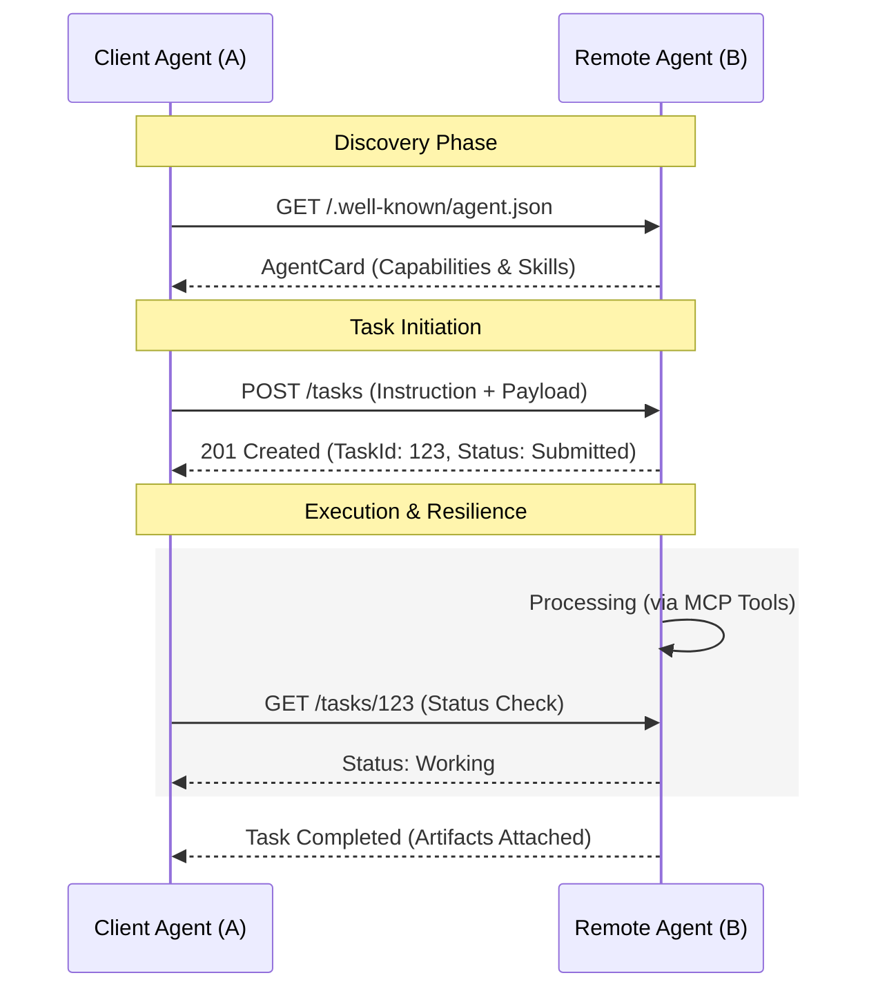

# The Modern Agentic Stack: An Architectural Reference for the Internet of Agents (IoA)

The Internet of Agents (IoA) is a decentralized ecosystem where autonomous agents discover, collaborate, and exchange results using open protocols—analogous to how services communicate on today’s internet.

As AI transitions from standalone chatbots to autonomous systems, a new architectural stack has emerged. This stack distinguishes between an agent's internal capability (how it uses a tool) and its external collaboration (how it works with others).

## The Three Planes of Communication

1. **Inter-Agent Plane (A2A)**: The Horizontal layer. Enables discovery, negotiation, and task delegation between independent agents across different platforms or organizations.

2. **Agent-Tool Plane (MCP)**: The Vertical layer. Connects an agent's reasoning core (LLM) to its local or remote tools, data, and resources.

3. **Infrastructure & Identity Plane (e.g., Cisco agntcy; ACP concepts incorporated)**: The Foundation layer. Provides cryptographically verifiable identities, security, and observability. Note: “agntcy” refers to Cisco’s identity and infrastructure framework under the Linux Foundation; ACP concepts from IBM have been merged into A2A for secure agent interactions.

The diagram below illustrates how MCP (vertical) and A2A (horizontal) compose into a single agentic system.

## Who Interacts with Each Plane?

- **Application Developers**: Mostly MCP (tools, data, workflows).
- **Agent Builders**: A2A (delegation, orchestration, collaboration).
- **Platform / Security Teams**: Identity & Infrastructure (agntcy, trust, observability).

This mapping clarifies adoption paths for different roles, enhancing clarity in building and deploying agentic systems.

## 1. Internal Capability: Model Context Protocol (MCP)

**Primary Role**: Standardizing the "Vertical" connection between agents and their environment.

MCP, initially open-sourced by Anthropic on November 25, 2024, solves the $N \times M$ integration problem—where previously, every model needed a custom connector for every tool. It turns tools into "plug-and-play" resources for any compliant agent, acting as a universal standard for AI-tool interactions adopted or supported across ecosystems involving OpenAI, Google, Microsoft, and AWS.

### Technical Primitives

- **Resources**: Read-only data sources (e.g., local files, API logs) that provide context.
- **Tools**: Executable functions with JSON schemas that the LLM can invoke.
- **Prompts**: Reusable templates that guide the model on how to interact with specific tools.
- **Sampling**: Allows the Server to request the Client (the LLM) to process data, enabling bidirectional intelligence.

### Transport Mechanisms

- **stdio**: High-performance, local process communication (ideal for CLI tools and local files).
- **HTTP/SSE**: Server-Sent Events for remote tools, allowing real-time context updates without polling.

### Protocol Boundaries: What MCP Does NOT Do

To maintain a clean architecture, MCP intentionally avoids:

- Managing agent discovery or delegation.
- Defining trust or identity across organizations.
- Coordinating multi-agent workflows.

## 2. External Collaboration: Agent-to-Agent (A2A) Protocol

**Primary Role**: Standardizing the "Horizontal" connection between peer agents.

A2A, initially introduced by Google in April 2025 and transferred to the Linux Foundation on June 23, 2025, allows agents to be Opaque Services. An agent built in LangGraph can "hire" an agent built in CrewAI or AutoGen without needing to understand its internal prompts or code. It complements MCP by focusing on agent-agent communication, enabling secure interoperability across frameworks, with support from over 100 companies including AWS, Cisco, Microsoft, Salesforce, SAP, and ServiceNow.

### The Collaborative Lifecycle

1. **Discovery**: Agents find each other via the Agent Card—a standard JSON file hosted at /.well-known/agent.json.
2. **Negotiation**: The client agent verifies if the remote agent possesses the required Skills.
3. **Task Management**: Unlike synchronous APIs, A2A is built around a stateful Task Object (Submitted → Working → Completed).
4. **Artifacts**: Results are returned as structured artifacts, allowing for complex multimodal data exchange.

### Concrete Multi-Agent Scenario Example

Consider a supply chain optimization task:

1. A planning agent (using MCP to access inventory data) identifies a shortage.
2. It discovers and negotiates with a procurement agent via A2A.
3. The procurement agent delegates sub-tasks (e.g., vendor negotiation) to specialized agents.
4. Artifacts (e.g., purchase orders) are exchanged asynchronously, with resilience to interruptions.

This illustrates how A2A enables cross-framework collaboration in real-world applications. For instance, India's NSO has launched an MCP server for official statistics, enabling AI agents to access datasets like PLFS and CPI via A2A-integrated systems.

## Design Insight: Control vs Autonomy

MCP optimizes control (what an agent is allowed to do).  
A2A optimizes autonomy (what an agent can decide to delegate).

This distinction addresses organizational concerns around governance and flexibility in agentic systems.

## 3. Comparative Analysis: MCP vs. A2A

| Feature | Model Context Protocol (MCP) | Agent-to-Agent (A2A) |
|---------|------------------------------|----------------------|
| Primary Direction | Vertical (Downward to tools) | Horizontal (Peer-to-peer) |
| Relationship | Client/Server (Client initiates) | Peer/Peer (Delegation & Negotiation) |
| Focus | Function calling & context retrieval | Collaboration & shared workflows |
| State | Mostly stateless (context-heavy) | Stateful (Task lifecycle management) |
| Discovery | Explicit configuration | Dynamic (/.well-known/agent.json) |

**Key Distinction**: MCP alone enables powerful single-agent systems, but it breaks down when tasks span organizational boundaries. A2A fills this gap by standardizing collaboration without requiring central orchestration.

Traditional REST APIs assume synchronous, stateless calls between tightly coupled services. Agent collaboration requires asynchronous execution, negotiation, partial failure handling, and evolving capabilities—none of which map cleanly to REST endpoints.

**An agent reasons locally, invokes tools via MCP, delegates work via A2A, and relies on the identity plane for trust, security, and observability—without any single protocol owning the entire lifecycle.**

## 4. Enterprise-Grade Considerations

### Security, Trust, and Identity

- **Verifiable Identity**: Through frameworks like Cisco agntcy, agents use cryptographic credentials to prove who they are before a task is accepted.
- **Encryption**: A2A communication is designed to be authenticated and encrypted (e.g., using MLS) to protect sensitive enterprise data.
- **Scoped Permissions**: While A2A handles the "contract" between agents, MCP ensures the agent only interacts with authorized local tools and data.

### Failure & Resilience

Unlike traditional synchronous APIs, A2A tasks are designed for long-running processes. If a network disruption occurs, the Task Object persists. Tasks can be retried, resumed, or delegated to a different agent without breaking the entire upstream workflow.

### Protocol Boundaries: What A2A Does NOT Do

To maintain a clean architecture, A2A intentionally avoids:

- Standardizing Internals: It does not dictate how an agent "thinks" (prompts, memory, or reasoning loops).
- Replacing Tool Invocation: It delegates the actual "doing" (database queries, API calls) to MCP.
- Vendor Lock-in: It does not require a specific vendor or centralized cloud to function.

## 5. Architectural Shift: The "With A2A" Difference

| Without A2A (The Old Way) | With A2A (The Standardized Way) |
|---------------------------|---------------------------------|
| Hard-coded APIs: Custom code for every integration. | Dynamic Discovery: Agents find specialists on the fly. |
| Tight Coupling: If one agent changes, the other breaks. | Loose Coupling: Agents interact via standardized "Skills." |
| Synchronous Bottlenecks: Requests time out. | Asynchronous Tasks: Built for long-running workflows. |
| Closed Silos: Agents only work within one platform. | Open Ecosystem: Cross-org, cross-framework collaboration. |

## Implementation Resources

- **Official A2A SDK**: pip install a2a-sdk
- **A2A Documentation**: a2aproject.github.io/A2A/latest/
- **A2A Samples**: github.com/a2aproject/A2A
- **MCP Documentation**: modelcontextprotocol.io
- **agntcy Framework**: github.com/agntcy
- **IoA Framework**: github.com/OpenBMB/IoA

## Absolutely — here’s a **clean, neutral References section** that fits the content and tone of your article. You can drop this in as-is.

---

## References

### Internet of Agents (IoA)

* OpenBMB – Internet of Agents (IoA): [https://github.com/OpenBMB/IoA](https://github.com/OpenBMB/IoA)

### Model Context Protocol (MCP)

* Model Context Protocol – Official Documentation: [https://modelcontextprotocol.io](https://modelcontextprotocol.io)
* Anthropic – Introducing the Model Context Protocol (Nov 2024): [https://www.anthropic.com/news/model-context-protocol](https://www.anthropic.com/news/model-context-protocol)
* MCP Specification (GitHub): [https://github.com/modelcontextprotocol/specification](https://github.com/modelcontextprotocol/specification)

### Agent-to-Agent (A2A) Protocol

* A2A Protocol – Official Documentation: [https://a2aproject.github.io/A2A/latest/](https://a2aproject.github.io/A2A/latest/)
* Google – Introducing Agent-to-Agent (A2A) Protocol (April 2025): [https://developers.googleblog.com/en/introducing-agent-to-agent-a2a/](https://developers.googleblog.com/en/introducing-agent-to-agent-a2a/)
* A2A Project (Linux Foundation): [https://github.com/a2aproject/A2A](https://github.com/a2aproject/A2A)

### Identity, Trust, and Infrastructure

* Cisco agntcy Framework: [https://github.com/agntcy](https://github.com/agntcy)
* Linux Foundation – agntcy Project Overview: [https://www.linuxfoundation.org/projects/agntcy](https://www.linuxfoundation.org/projects/agntcy)
* IBM – Agent Communication Protocol (ACP) Overview: [https://research.ibm.com/blog/agent-communication-protocol](https://research.ibm.com/blog/agent-communication-protocol)

### Related Standards & Concepts

* JSON-RPC 2.0 Specification: [https://www.jsonrpc.org/specification](https://www.jsonrpc.org/specification)
* RFC 8615 – `/.well-known/` URI Standard: [https://datatracker.ietf.org/doc/html/rfc8615](https://datatracker.ietf.org/doc/html/rfc8615)
* Messaging Layer Security (MLS) Protocol: [https://datatracker.ietf.org/doc/html/rfc9420](https://datatracker.ietf.org/doc/html/rfc9420)

### Tooling & Frameworks Mentioned

* LangGraph: [https://github.com/langchain-ai/langgraph](https://github.com/langchain-ai/langgraph)
* CrewAI: [https://github.com/joaomdmoura/crewai](https://github.com/joaomdmoura/crewai)
* AutoGen (Microsoft): [https://github.com/microsoft/autogen](https://github.com/microsoft/autogen)

Authored by: Srinivasan Ragothaman (@rsrini7)