# Ralph Wiggum Loops & Ralph Mode: Complete Guide

## Table of Contents
1. [Overview](#overview)
2. [Core Concept](#core-concept)
3. [Critical Analysis: The Peak of Vibe Coding](#critical-analysis-the-peak-of-vibe-coding)
4. [Implementation Variants](#implementation-variants)
5. [Architecture & Flow](#architecture--flow)
6. [When to Use](#when-to-use)
7. [PRP Framework Integration](#prp-framework-integration)
8. [Limitations & Real-World Failures](#limitations--real-world-failures)
9. [Agent Harnesses: What Comes Next](#agent-harnesses-what-comes-next)
10. [Safety & Cost Management](#safety--cost-management)
11. [Best Practices](#best-practices)
12. [Resources](#resources)

Other Ref: [How-Ralph-Works-with-Amp.md](How-Ralph-Works-with-Amp.md)

---

## Overview

**Ralph Wiggum loops** are an autonomous AI coding pattern that enables agents to work for hours or days without human intervention by using the **filesystem as persistent memory** instead of chat history. Named after The Simpsons character, the technique embodies persistent iteration despite setbacks.

### Key Principle
> "Better to fail predictably than succeed unpredictably."  
> — Geoffrey Huntley, creator of the Ralph technique

### Current Status (January 2025)
- **Official Plugin:** Anthropic released the official `ralph-wiggum` plugin for Claude Code (summer 2025)
- **Deep Agents Support:** LangChain's `deepagents` package includes Ralph Mode example implementations
- **Community:** Active development with real-world production usage reported

### A Note on Sources
This guide synthesizes multiple sources:
- **Primary source:** "Ralph Wiggum is the Final Evolution of Vibe Coding" article/analysis
- **Extended research:** Official documentation, community implementations, and production use cases
- Sections specifically from the primary article are noted where relevant

---

## Core Concept

### The Original Pattern
Geoffrey Huntley's original implementation (May 2025) was elegantly simple:

```bash
# The entire original Ralph loop
while :; do cat PROMPT.md | claude-code; done
```

### How It Works

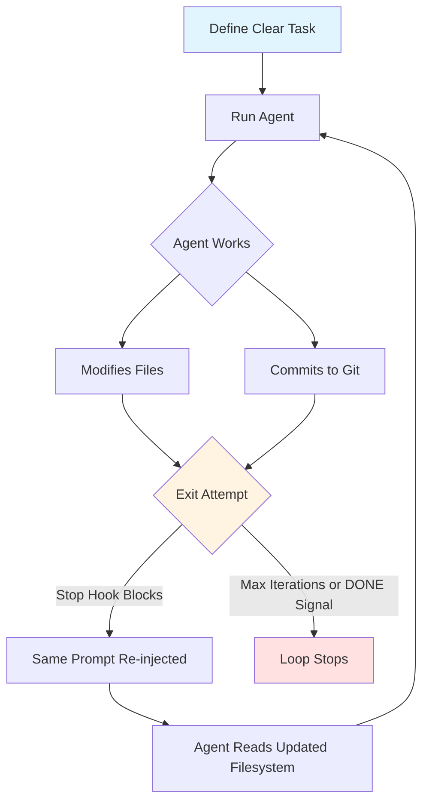

### Memory Mechanism

**Traditional Approach:**
- Long chat history → context rot → degraded performance

**Ralph Approach:**
- Fresh context each iteration
- Filesystem as source of truth
- Git history for traceability
- No conversation history management

---

## Critical Analysis: The Peak of Vibe Coding

> **From the Article:** "Ralph Wiggum is really the final evolution of vibe coding. And I don't really mean that in a good way."

### What is Vibe Coding?

The term, coined by Andrej Karpathy in early 2024, describes a development approach where:
- You fully give into the "vibes" of your coding agent
- Embrace exponentials without critical thinking
- Forget the code even exists
- Talk in natural language, describing what you want
- Let the AI do all the work without structured planning
- Just iterate when things break: "Hey Claude, this is not working. Please go and fix it."

### Why Ralph is the Peak (and the Ceiling)

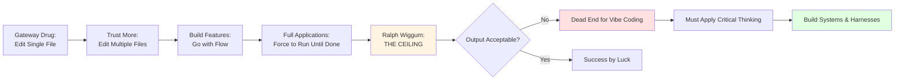

### The Philosophy: Persistence Beats Sophistication

Ralph embodies this through:
- **Deterministically bad in an undeterministic world** - expects the agent to fail, but allows it to iterate until success
- **No human intervention** - literally cannot go further than forcing the agent to run until it says "done"
- **Vibe coding on infinite loop** - the only exit is a safety phrase output by the agent

### The Reality Check

**What Ralph Actually Is:**
- The furthest you can go with vibe coding
- A stepping stone, not a destination
- The "Model T of AI coding" - shows potential but highlights limitations
- **NOT** the future of AI coding (despite what everyone says)

**The Real Insight:**
> "If the output of Ralph Wiggum is not acceptable to us, we're at a dead end here. If we want to vibe code, there's nothing more that we can do. Finally, we are forced to apply our own critical thinking, put ourselves in the driver's seat, and build a system."

---

## Implementation Variants

### 1. Claude Code (Official Plugin)

**Installation:**
```bash
# Install from official Anthropic plugin marketplace
/plugin install ralph-loop@claude-plugins-official
```

**Usage:**
```bash
# Basic usage
/ralph-loop "Migrate tests from Jest to Vitest" \
  --max-iterations 25 \
  --completion-promise "DONE"

# Recommended safety limits
/ralph-loop "Build todo API" \
  --max-iterations 20
```

**How the Official Plugin Works:**

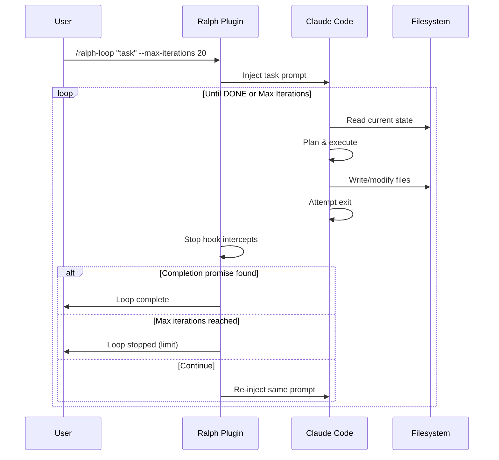

**Key Features:**
- Stop hook intercepts exit attempts
- Uses exit code 2 to block Claude from stopping
- Same prompt re-injected each iteration
- Markdown file tracks state (can cause issues if deleted)
- Requires `--dangerously-skip-permissions` for reliable operation

### 2. LangChain Deep Agents (Ralph Mode)

**Installation:**
```bash
# Install uv package manager
curl -LsSf https://astral.sh/uv/install.sh | sh

# Setup virtual environment
uv venv
source .venv/bin/activate

# Install Deep Agents CLI
uv pip install deepagents-cli
```

**Usage:**
```bash
# Download Ralph Mode script
curl -O https://raw.githubusercontent.com/langchain-ai/deepagents/main/examples/ralph_mode/ralph_mode.py

# Run Ralph Mode
python ralph_mode.py "Build a Python programming course for beginners"
```

**Architecture:**

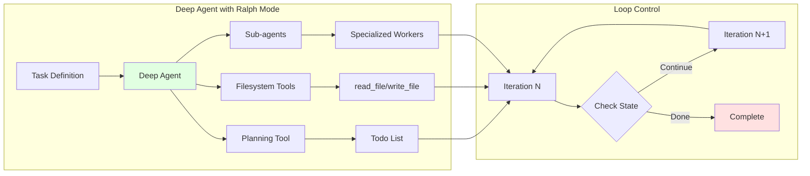

**Key Features:**
- Built on LangGraph for stateful workflows
- Planning tool (todo list) for task decomposition
- Sub-agent delegation for complex subtasks
- Filesystem backend for persistent memory
- Supports custom tools and prompts

### 3. Community Implementations

**frankbria/ralph-claude-code** (Popular community tool):
```bash
# Global installation
git clone https://github.com/frankbria/ralph-claude-code
cd ralph-claude-code
./install.sh

# Per-project setup
ralph-setup my-project

# Run with monitoring
ralph --monitor --calls 50
```

**Features:**
- Dual-condition exit gate
- Rate limiting (100 calls/hour default)
- Circuit breaker for error detection
- Response analyzer with semantic understanding
- 308 tests, 100% pass rate

---

## Architecture & Flow

### Detailed Ralph Execution Flow

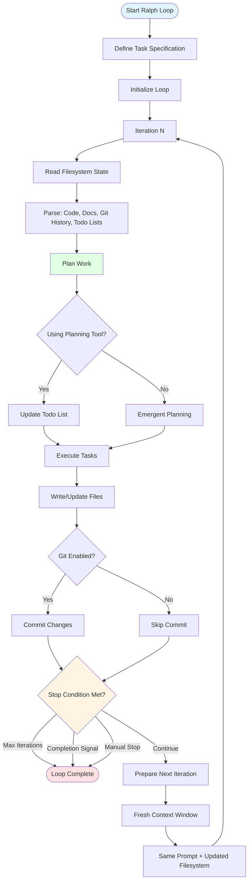

### State Management Across Iterations

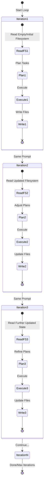

---

## When to Use

### ✅ Ideal Use Cases

| Use Case | Why It Works | Example |
|----------|--------------|---------|
| **Greenfield Projects** | Nothing to break, clear specs | Building new service from scratch |
| **Large Refactors** | Mechanical transformations, tests verify correctness | OOP → FP conversion, framework migration |
| **Test Generation** | Measurable goal (coverage %), automated verification | "Write tests until coverage ≥ 80%" |
| **Documentation** | Batch operations, clear completion criteria | API docs, README updates |
| **Code Migrations** | Well-defined behavior targets | Jest → Vitest, Python 2 → 3 |
| **Course/Content Creation** | Structured output with checkpoints | Programming course with modules & exercises |

### ❌ When Ralph Falls Apart

> **From the Article:** "Ralph Wiggum really falls apart for any kind of judgment-heavy task, especially when you have ambiguous completion criteria."

| Scenario | Why It Fails | Alternative |
|----------|--------------|-------------|
| **Security-Critical Code** | May produce insecure code that passes naive tests | Manual review, security-focused prompts |
| **Architecture Decisions** | Needs human context & tradeoff analysis | Human-in-the-loop design |
| **Exploratory Work** | No clear "done" criteria, may never converge | Interactive debugging, hypothesis testing |
| **Business Judgment** | Context not fully encodable in prompts | Strategic human decisions |
| **Real-time Systems** | Unpredictable iteration duration | Traditional development |
| **Tasks Requiring Creative Freedom** | Completion criteria too ambiguous | Human-guided iterative development |

### Decision Framework

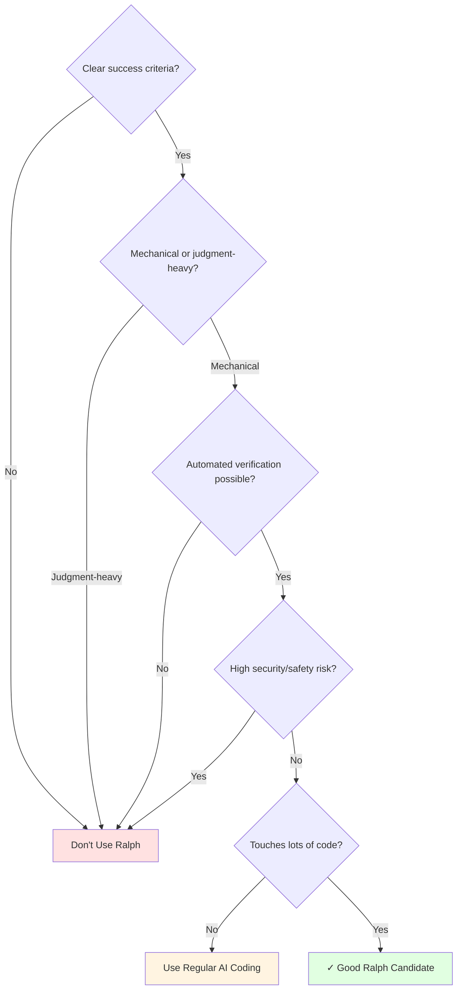

---

## PRP Framework Integration

> **From the Article:** "The PRP framework, combined with Ralph Wiggum, can improve results significantly."

### What is PRP?

**PRP (Product Requirement Prompt)** is a structured planning process that addresses Ralph's biggest weakness: the assumption that you have a good prompt.

**The Problem Ralph Doesn't Solve:**
- Creating a good, structured plan is the most difficult part of working with coding agents
- Without a defined process, you're just vibe coding
- Ralph alone assumes you already have clarity

**The PRP Solution:**
- Research and requirement gathering phase
- Building blueprints with the coding agent
- Well-curated context before entering the Ralph loop
- Clear success criteria definition

### PRP + Ralph Architecture

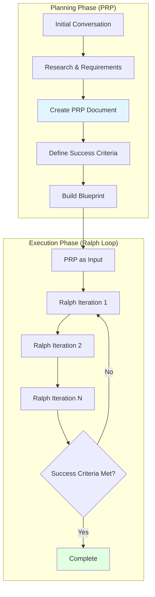

### Installation

**PRP Framework with Ralph Integration:**
```bash
# Add PRP marketplace
/plugin marketplace add /absolute/path/to/PRPs-agentic-eng

# Install PRP core (includes Ralph integration)
/plugin install prp-core@prp-marketplace
```

### Usage Workflow

**1. Planning Phase:**
```bash
# Start conversation about what you want to build
# Establish criteria with Claude

# Generate PRP document
/prp create "data persistence layer"
```

**2. Execution Phase:**
```bash
# Use PRP document as Ralph input
/prp-ralph ./prps/plans/data-persistence-layer.md

# Or with limits
/prp-ralph ./prps/plans/feature.md --max-iterations 25
```

### PRP Document Structure

A complete PRP includes:
- **Context:** Project background and constraints
- **Requirements:** Specific functional and non-functional needs
- **Task List:** Decomposed work items
- **Validation Strategy:** How to verify completion
- **Success Criteria:** Measurable outcomes
- **Post-Implementation State:** What the codebase should look like

### Example: Basic Prompt vs PRP

**Without PRP (Vibe Coding):**
```
Build a data persistence layer
```

**With PRP:**
```markdown
# Data Persistence Layer PRP

## Context
- Adding storage to React app
- No backend, browser-only
- Must work offline

## Requirements
- Key-value storage API
- Personal and shared data scopes
- Error handling for all operations
- Maximum 5MB per value
- Rate limiting compliance

## Task List
1. Implement storage interface
2. Add error boundaries
3. Create React hooks
4. Write integration tests
5. Add usage examples

## Validation Strategy
- All tests pass
- Example app works
- Error cases handled
- Documentation complete

## Success Criteria
Output: <promise>DATA_LAYER_COMPLETE</promise> when:
- Storage API fully functional
- Test coverage > 85%
- Examples demonstrate all features
- No console errors in example
```

### Results Comparison

| Approach | Quality | Time to Success | Token Usage | Success Rate |
|----------|---------|-----------------|-------------|--------------|
| **Basic Prompt + Ralph** | Low-Medium | Unpredictable | High (many retries) | ~40% |
| **PRP + Ralph** | High | More predictable | Lower (fewer retries) | ~85% |

> **From the Article:** "This leads to insanely better results. Like you have no idea how much better it is using PRP Ralph versus just the regular Ralph Wiggum sending in a super simple request."

---

## Limitations & Real-World Failures

> **From the Article:** "Now, I know this sounds very doom and gloom, but there are some solutions..."

### Core Problems with Ralph

#### 1. Over-Engineering

**The Problem:**
- Without direction, agents love to overbake solutions
- Create far more code than needed
- Add unnecessary abstractions
- Implement features not requested

**Example Failure:**
```
Request: "Add user authentication"

Ralph Output:
- OAuth provider integration
- Social login (Google, GitHub, Twitter)
- Two-factor authentication
- Password reset flows
- Email verification
- Session management with Redis
- Rate limiting
- RBAC system
- Audit logging

Actual Need: Simple JWT authentication
```

#### 2. No Course Correction

**The Problem:**
- No human-in-the-loop means no mid-flight adjustments
- Agent goes in wrong direction for hours
- Burns tokens on fundamentally flawed approaches
- Cannot pivot when initial strategy fails

**Real-World Impact:**
> "A lot of times you have to do course correction. I have this happen all the time where I do a feature implementation with my coding agent and it doesn't do a good job. And so I look into what it created. I work with the coding assistant to address the issue... With Ralph Loop, we don't have the luxury to do that."

#### 3. Rabbit Holes & Failure Loops

**The Problem:**
- Agent encounters issue during validation
- Tries to fix it but fails
- Retries same failed approach repeatedly
- Fundamentally misunderstands the problem
- Burns massive tokens without progress

**Cost Impact:**
```
Iteration 1-5:   Normal progress ($10)
Iteration 6:     Encounters error
Iteration 7-20:  Retry same fix (burns $50)
Iteration 21-35: Different failed approach ($75)
Iteration 36-50: Still stuck, hits limit ($100)

Result: $235 spent, feature incomplete
```

#### 4. False "Done" Signals

**The Problem:**
- Agent outputs completion phrase prematurely
- Classic AI behavior: says it's done when things are missing
- Ralph's core mechanism (exit on signal) can't solve this
- Requires external validation, not just agent self-assessment

### Failure Pattern Recognition

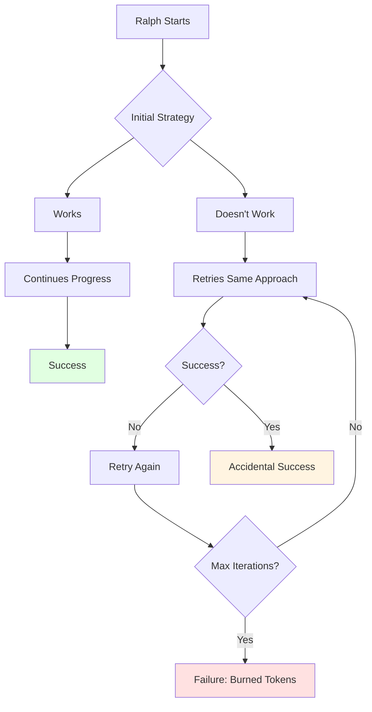

### When Things Go Wrong: Real Examples

**Migration Failure:**
```
Task: "Migrate from Jest to Vitest"
Issue: Tests start failing in iteration 10
Agent Response: Tries to fix same 3 tests for 25 iterations
Root Cause: Misunderstood Vitest's async handling
Token Burn: ~$80
Outcome: Manual intervention required
```

**Over-Engineering Example:**
```
Task: "Add logging to API endpoints"
Expected: Winston logger with basic config
Ralph Output: 
  - Custom logging framework
  - Log rotation system
  - Database logger backend
  - Log analytics dashboard
  - Alert system
  - Log aggregation service
Code Added: 2,500+ lines
Actual Need: ~100 lines
```

### Why These Problems Are Inherent to Ralph

1. **No Human Judgment:** Mechanical persistence ≠ intelligent adaptation
2. **No Context Awareness:** Can't recognize when it's stuck
3. **No Cost-Benefit Analysis:** Doesn't know when to give up
4. **Pure Iteration:** Trying harder doesn't fix wrong understanding

---

## Agent Harnesses: What Comes Next

> **From the Article:** "Agent harnesses are the real innovation happening right now, and Ralph is just the 'hello world' version."

### The Paradigm Shift

**2024-2025: The Model Race**
- Competition on model quality
- Bigger context windows
- Better reasoning
- Faster inference

**2026: The Harness Era**
> "2026 is the year competitive advantage shifts from model to harness."

### What is an Agent Harness?

An **agent harness** is infrastructure wrapping around the model for long-running tasks, adding:
- Reliability mechanisms
- Human-in-the-loop capabilities
- Structured workflows
- Error recovery
- Progress tracking
- Validation strategies

### Ralph vs. Real Harness

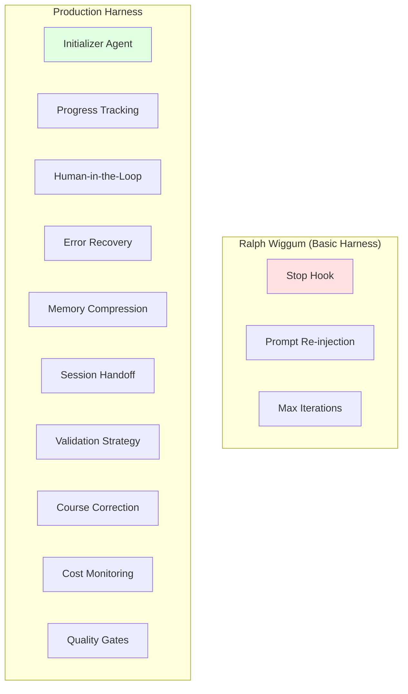

### Components of an Effective Harness

#### 1. Initializer Agent
**Purpose:** Set up the project environment before main work begins

**Responsibilities:**
- Analyze requirements
- Establish architecture
- Set up validation framework
- Create initial scaffolding
- Define success metrics

**Example:**
```python
class InitializerAgent:
    def setup(self, requirements):
        # Analyze project scope
        scope = self.analyze_requirements(requirements)
        
        # Create project structure
        self.scaffold_project(scope)
        
        # Set up testing framework
        self.setup_tests(scope.tech_stack)
        
        # Define validation gates
        self.create_validation_plan(scope)
        
        return ProjectContext(scope, validation_plan)
```

#### 2. Structured Progress Tracking

**Purpose:** Monitor actual progress vs. claimed progress

**What Ralph Lacks:**
```
Iteration 1: "Starting work..."
Iteration 10: "Making progress..."
Iteration 25: "Almost done..."
Iteration 50: Max iterations hit

Reality: Unknown what actually got completed
```

**What Harness Provides:**
```python
class ProgressTracker:
    def track(self, iteration):
        completed_tasks = self.verify_completion()
        test_results = self.run_validation()
        code_quality = self.analyze_quality()
        
        return Progress(
            tasks_done=completed_tasks,
            tests_passing=test_results,
            quality_score=code_quality,
            blocking_issues=self.identify_blockers()
        )
```

#### 3. Human-in-the-Loop

**Purpose:** Enable course correction without aborting entire process

**Critical for:**
- Judgment-heavy decisions
- Validation of intermediate states
- Direction changes mid-task
- Quality assessments

**Implementation Patterns:**
```python
class HumanInTheLoop:
    def check_gate(self, iteration, context):
        if iteration % 5 == 0:  # Every 5 iterations
            return self.request_human_review(context)
        
        if context.has_blocking_issue():
            return self.escalate_to_human(context)
        
        if context.quality_degrading():
            return self.request_guidance(context)
        
        return "continue"
```

#### 4. Error Recovery

**Purpose:** Detect and escape failure loops

**Mechanisms:**
- Pattern detection (same error 3+ times)
- Strategy rotation (try different approaches)
- Graceful degradation
- Checkpoint restoration

**Example:**
```python
class ErrorRecovery:
    def handle_failure(self, error, attempts):
        if attempts > 3:
            # Same error repeatedly - escape loop
            return self.try_alternative_strategy()
        
        if self.is_stuck_pattern(error):
            # Detected rabbit hole
            return self.restore_checkpoint()
        
        if self.cost_exceeds_threshold():
            # Burning too many tokens
            return self.request_human_intervention()
```

#### 5. Memory Compression

**Purpose:** Maintain context efficiency across long runs

**Why Needed:**
- Ralph uses filesystem, but decisions still need context
- Long-running tasks accumulate history
- Need to preserve important context while discarding noise

**Approach:**
```python
class MemoryManager:
    def compress_context(self, history):
        important = self.extract_key_decisions(history)
        patterns = self.identify_patterns(history)
        blockers = self.track_blockers(history)
        
        return CompressedMemory(
            decisions=important,
            patterns=patterns,
            current_blockers=blockers
        )
```

#### 6. Session Handoff

**Purpose:** Enable multi-session work with continuity

**Ralph's Gap:**
- Each iteration is fresh context
- No structured handoff between sessions
- Lost nuance from previous work

**Harness Solution:**
```python
class SessionManager:
    def handoff(self, previous_session):
        return SessionContext(
            what_was_attempted=previous_session.attempts,
            what_worked=previous_session.successes,
            what_failed=previous_session.failures,
            current_state=self.analyze_filesystem(),
            next_priorities=self.determine_priorities()
        )
```

#### 7. Built-in Validation Strategy

**Purpose:** Deterministic quality checks, not agent self-assessment

**Validation Layers:**
```python
class ValidationHarness:
    def validate(self, iteration_output):
        # Layer 1: Automated tests
        test_results = self.run_test_suite()
        
        # Layer 2: Static analysis
        quality = self.analyze_code_quality()
        
        # Layer 3: Integration tests
        integration = self.test_integrations()
        
        # Layer 4: Security scan
        security = self.security_audit()
        
        # Layer 5: Performance check
        performance = self.performance_test()
        
        return ValidationReport(
            all_layers=[test_results, quality, integration, 
                       security, performance],
            passed=all(layer.passed for layer in layers)
        )
```

### Harness Architecture Example

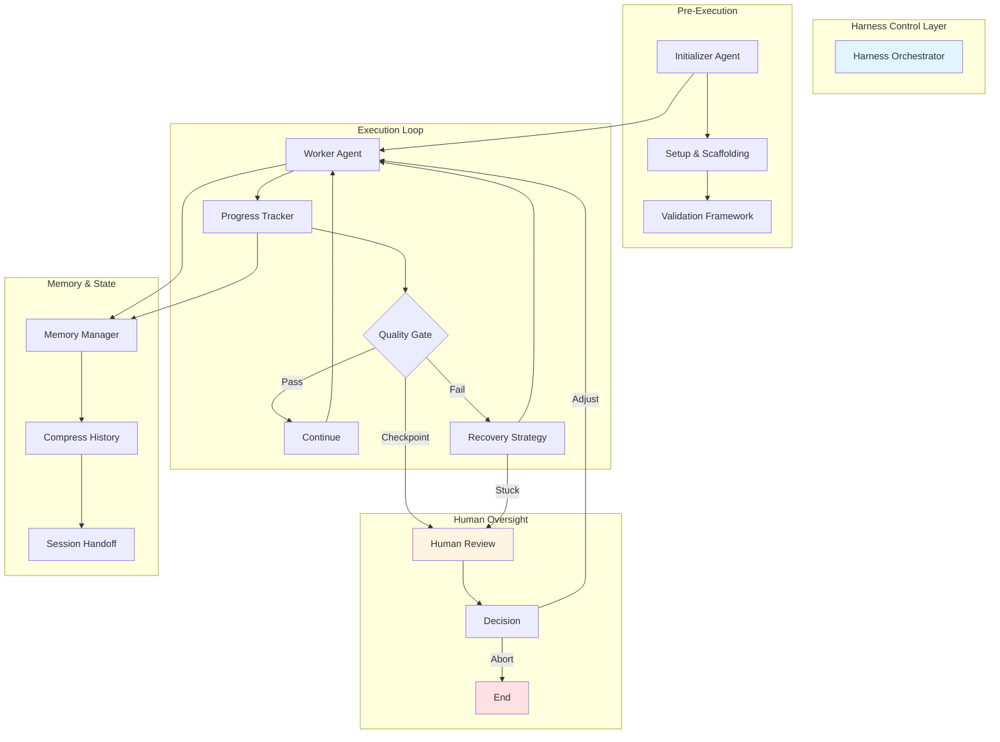

### The Competitive Advantage

**Why Harnesses Matter More Than Models:**

1. **Models are commoditizing:** Claude, GPT-4, Gemini approaching parity
2. **Reliability gap remains:** All models fail on long-running tasks
3. **Integration is differentiator:** How you wrap the model matters more
4. **Domain-specific harnesses:** Custom validation for your use case
5. **Human-AI collaboration:** Best results come from hybrid approaches

### Current State of Harness Development

**Available Now:**
- Basic harnesses (Ralph, Deep Agents)
- Research implementations (LangChain, LangGraph)
- Custom internal tools

**Coming in 2026:**
- Production-grade harness frameworks
- Industry-specific harnesses
- Standardized harness patterns
- Better human-in-the-loop tooling

### Ralph's Place in the Evolution

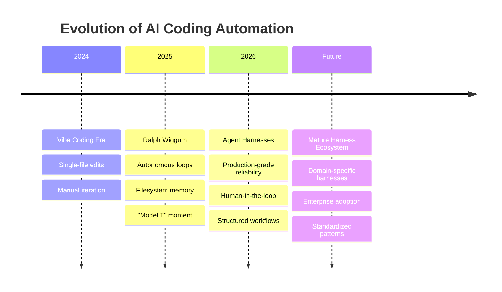

> **From the Article:** "Ralph Wiggum really is the Model T of AI coding. It's not the Tesla. It's still vibe coding. It's not going to take you far, but it shows what the real skill is going to be for this year."

---

## Safety & Cost Management

### Cost Reality Check

**Real-World Examples:**
- 50-iteration loop on large repo: **$50-100+** in API credits
- YC hackathon teams: **6+ repos for $297** overnight
- Geoffrey Huntley's 3-month loop: Built complete programming language (cursed lang)
- **Success story:** $50,000 contract completed for less than $300 in API credits
- **Failure scenarios:** Users reporting several hundred dollars when forgetting limits

### Essential Safeguards

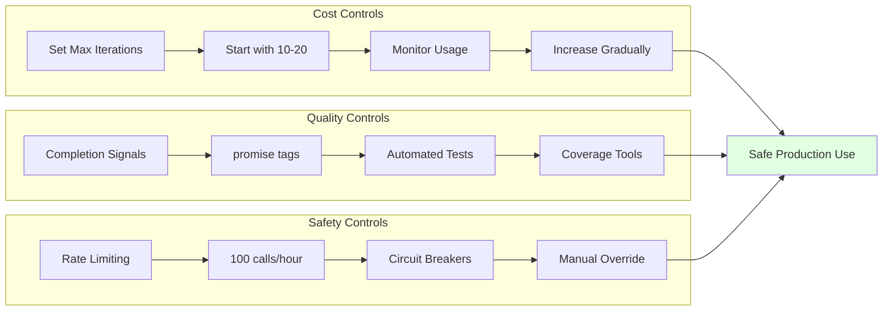

### Implementation Checklist

**Before Starting:**
- [ ] Set `--max-iterations` (start with 10-20)
- [ ] Define clear completion criteria
- [ ] Set up automated tests/verification
- [ ] Configure spending alerts on API dashboard
- [ ] Prefer fixed-price plans over pay-per-token
- [ ] Enable Git for change tracking
- [ ] Write clear prompt with "done" definition
- [ ] Consider PRP for complex tasks

**During Execution:**
- [ ] Monitor token usage
- [ ] Check iteration progress
- [ ] Review filesystem changes
- [ ] Verify Git commits make sense
- [ ] Ready to Ctrl+C if needed
- [ ] Watch for failure loop patterns

**After Completion:**
- [ ] Review all changes thoroughly
- [ ] Run complete test suite
- [ ] Check security implications
- [ ] Verify against original requirements
- [ ] Document what worked/failed
- [ ] Clean up over-engineered code

---

## Best Practices

### Prompt Engineering for Ralph

**Bad Prompt:**
```
Build a good API
```

**Good Prompt:**
```
Build a REST API for todos. Success criteria:
- All CRUD endpoints working (GET, POST, PUT, DELETE)
- Input validation on all endpoints
- Tests passing with coverage > 80%
- README with API documentation
- OpenAPI spec generated

Output <promise>COMPLETE</promise> when all criteria met.
```

**Excellent Prompt (Multi-phase):**
```
Phase 1: Build todo API data models
- User, Todo, and Tag models
- Database schema with migrations
- Model validation
- Unit tests for models
Output: <promise>PHASE1_DONE</promise>

Phase 2: Build API endpoints
- CRUD for todos
- User authentication (JWT)
- Tag management
- Integration tests
Output: <promise>PHASE2_DONE</promise>

Phase 3: Documentation & Polish
- README with examples
- OpenAPI/Swagger docs
- Error handling polish
- Performance optimization
Output: <promise>COMPLETE</promise>

After 15 iterations, if blocked:
- Document blocking issues in BLOCKERS.md
- List attempted approaches
- Suggest alternatives
```

### Prompt Components

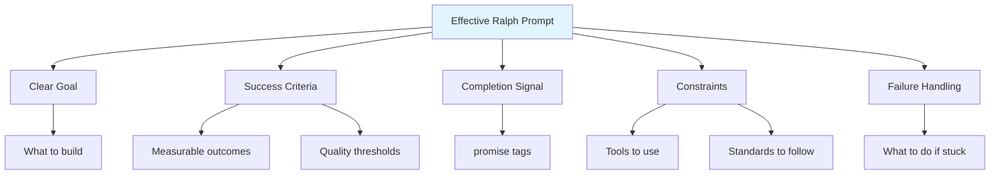

### Mental Model Shift

**Traditional AI Coding:**
- Step-by-step direction
- Review each change
- Micromanage execution
- Perfect first attempt

**Ralph Philosophy:**
- Define clear outcomes
- Specify success criteria
- Let agent iterate
- Treat failures as data
- Prompt engineering over prompt perfection

**Beyond Ralph (Harness Thinking):**
- Design environments for safe autonomy
- Build validation into the process
- Enable human oversight at key points
- Focus on reliability over speed
- Accept that iteration is necessary

---

## Comparison: Implementation Variants

| Aspect | Claude Code (Official Plugin) | LangChain Deep Agents | frankbria/ralph-claude-code |
|--------|-------------------------------|----------------------|---------------------------|
| **Installation** | Built-in plugin | `pip install deepagents-cli` | Git clone + install script |
| **Activation** | `/ralph-loop` command | Python script | `ralph` CLI command |
| **Loop Mechanism** | Stop hook intercepts exit | External Python loop | Stop hook + monitoring |
| **Memory** | Filesystem + Git | Filesystem + optional backends | Filesystem + state tracking |
| **Planning** | Emergent from workflow | Explicit todo tool | Emergent (enhanced with PRP) |
| **Sub-agents** | Not built-in | Native support | Not built-in |
| **Cost Control** | `--max-iterations` flag | Script-level control | Rate limiting + circuit breaker |
| **Monitoring** | Basic | Python logging | Advanced with `--monitor` flag |
| **Customization** | Limited to prompts | Full Python customization | Plugin-based extensions |
| **Best For** | Quick iterations, standard workflows | Complex multi-agent tasks | Production use with safeguards |

---

## Resources

### Official Documentation
- [Claude Code Ralph Plugin README](https://github.com/anthropics/claude-code/blob/main/plugins/ralph-wiggum/README.md)
- [LangChain Deep Agents Docs](https://docs.langchain.com/oss/python/deepagents/overview)
- [Deep Agents Ralph Mode Example](https://github.com/langchain-ai/deepagents/tree/master/examples/ralph_mode)

### Key Articles & Analysis
- [Geoffrey Huntley: Ralph as Software Engineer](https://ghuntley.com/ralph/) - Original concept
- **[Ralph Wiggum is the Final Evolution of Vibe Coding](https://www.youtube.com/watch?v=5xvP9O4msLM)** - Critical analysis (primary source for this guide)
- [Paddo.dev: Autonomous Loops for Claude Code](https://paddo.dev/blog/ralph-wiggum-autonomous-loops/)
- [VentureBeat: How Ralph Wiggum Became AI's Biggest Name](https://venturebeat.com/technology/how-ralph-wiggum-went-from-the-simpsons-to-the-biggest-name-in-ai-right-now)
- [HumanLayer: A Brief History of Ralph](https://www.humanlayer.dev/blog/brief-history-of-ralph)

### PRP Framework
- [PRP Framework Repository](https://github.com/Wirasm/PRPs-agentic-eng/tree/development)
- [PRP + Ralph Integration Guide](https://github.com/Wirasm/PRPs-agentic-eng/blob/development/README.md)

### Community Tools
- [frankbria/ralph-claude-code](https://github.com/frankbria/ralph-claude-code) - Enhanced community implementation
- [Awesome Claude: Ralph Wiggum](https://awesomeclaude.ai/ralph-wiggum) - Comprehensive guide

### Video Content
- [YouTube: Ralph Wiggum is the Final Evolution of Vibe Coding](https://www.youtube.com/watch?v=5xvP9O4msLM) - Detailed analysis with PRP and harness discussion
- [YouTube: Original Ralph Concept](https://www.youtube.com/watch?v=dPG-PsOn-7A)
- [YouTube: Deep Agents Ralph Mode](https://www.youtube.com/watch?v=yi4XNKcUS8Q)

---

## Conclusion

Ralph Wiggum loops represent both a breakthrough and a ceiling in AI-assisted development.

### What Ralph Actually Is

**The Good:**
- Enables autonomous work for hours/days
- Filesystem-as-memory is elegant
- Works brilliantly for mechanical tasks
- Shows the potential of persistent iteration
- Real production successes ($50k contract for $300)

**The Reality:**
- The peak of vibe coding, not the future
- Falls apart on judgment-heavy tasks
- No course correction mechanism
- Risk of expensive failure loops
- Over-engineering without oversight

**The Insight:**
> "Ralph Wiggum really is the Model T of AI coding. It's not the Tesla. It's still vibe coding. It's not going to take you far, but it shows what the real skill is going to be for this year."

### The Paradigm Shift

**From:** Babysitting agents through each step  
**To:** Designing environments where agents can run safely

**From:** Crafting perfect prompts  
**To:** Building systems (PRP + harnesses)

**From:** One-shot attempts  
**To:** Persistent iteration with human oversight

**From:** Model quality competition  
**To:** Harness quality competition

### Moving Forward

**If you're using Ralph today:**
1. Start with PRP framework for better prompts
2. Use strict max-iteration limits
3. Focus on mechanical, well-defined tasks
4. Build validation into your workflow
5. Monitor for failure patterns

**Looking ahead to 2026:**
1. Invest in understanding agent harnesses
2. Build human-in-the-loop capabilities
3. Develop domain-specific validation strategies
4. Focus on reliability over raw automation
5. Prepare for the shift from model to harness competition

### Final Perspective

The technique is "deterministically bad in an undeterministic world"—failures are predictable and teach you about missing specifications. When used appropriately with proper safeguards (especially PRP), Ralph loops can deliver production-ready code overnight for well-defined, mechanical tasks.

But Ralph is a stepping stone. The real innovation isn't forcing agents to run longer—it's building the infrastructure that makes long-running tasks reliable, safe, and truly productive.

As Geoffrey Huntley put it: **"Ralph is a Bash loop."** Sometimes the most powerful automation isn't the cleverest—it's the one that persists until it works. But persistence alone isn't enough. The future belongs to those who build the harnesses that make persistence intelligent.

---

**Document Version:** 2.0  
**Last Updated:** January 2025  
**Primary Source:** "Ralph Wiggum is the Final Evolution of Vibe Coding" analysis  
**Additional Research:** Official documentation, community implementations, production case studies