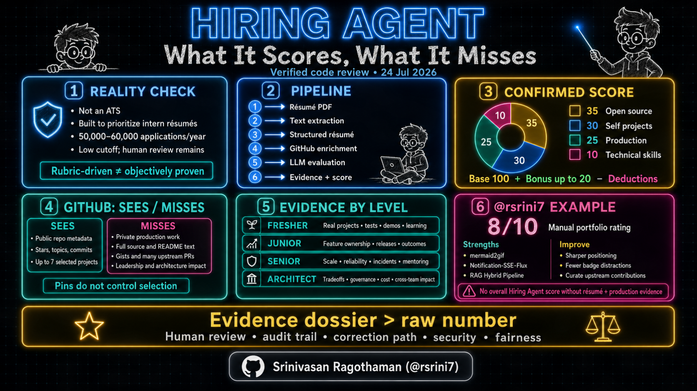
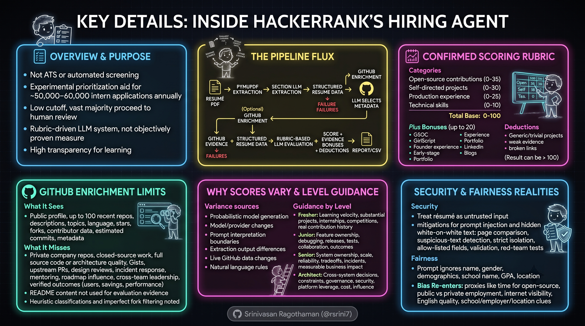
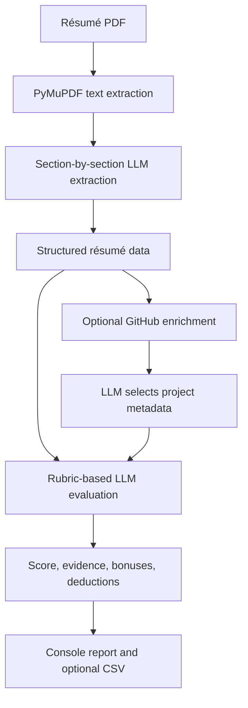
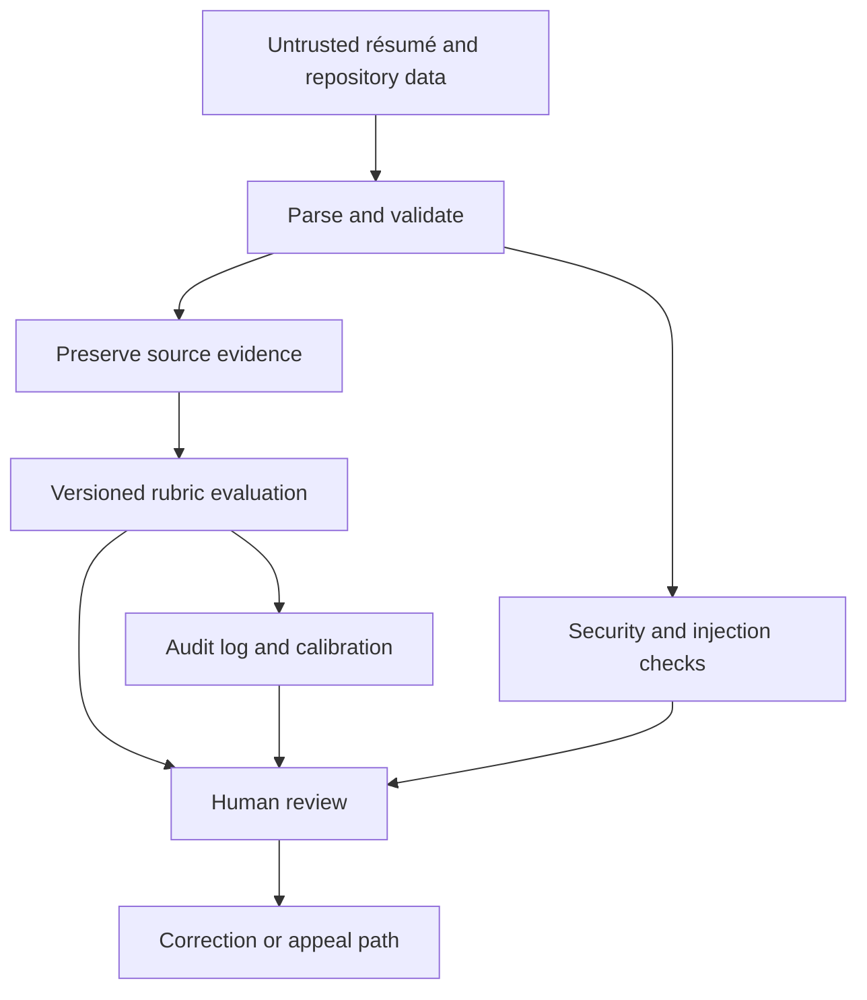
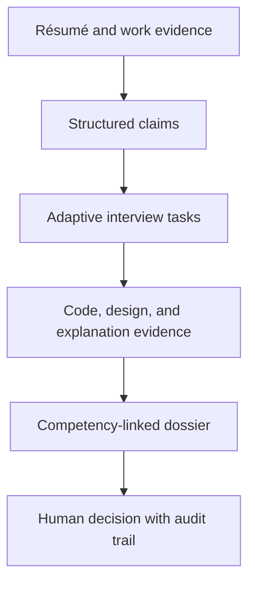

# Inside HackerRank’s Hiring Agent

## What the code scores, what it misses, and how candidates at every level should respond

HackerRank’s open-source [Hiring Agent](https://github.com/interviewstreet/hiring-agent) is a useful case study in LLM-assisted recruiting. It converts a résumé PDF into structured data, optionally enriches it with public GitHub metadata, and asks a language model to apply a written scoring rubric.

It is important to describe the project precisely:

- It is **not an applicant-tracking system (ATS)**.
- HackerRank says it is **not used to screen every open role** and is **not a HackerRank customer product**.
- It was built to help prioritize which résumés humans should read first among roughly **50,000–60,000 annual intern applications**.
- The repository describes a **low cutoff** intended to remove only the weakest submissions; it says the vast majority proceed to human review.
- It is a rubric-driven LLM system, not an objectively proven measure of candidate quality.

Those statements are documented by the project itself. This review uses repository snapshot [`83ebcf3`](https://github.com/interviewstreet/hiring-agent/tree/83ebcf3), reviewed on **24 July 2026**. Repository behavior can change after that date.

---

---

## Executive verdict

The project is transparent enough to teach from: its extraction stages, prompts, data models, and scoring orchestration are visible. The scoring weights and GitHub-selection rules are confirmable in the source.

The important caveat is that a written rubric is not the same as deterministic or validated assessment. Several rules exist primarily as prompt instructions, some implementation details diverge from the documentation, and GitHub-derived evidence is much less complete than a human reviewer may assume.

The safest interpretation is:

> Hiring Agent is an experimental prioritization aid that produces an evidence-linked score. It should not be treated as a complete, stable, or role-neutral hiring decision system.

---

## What the pipeline actually does

The diagram intentionally uses no fixed fill, border, or text colors. Mermaid can therefore inherit the host renderer’s light or dark theme.

### 1. PDF extraction

[`pymupdf_rag.py`](https://github.com/interviewstreet/hiring-agent/blob/83ebcf3/pymupdf_rag.py) converts the PDF to Markdown-like text. This is the first failure boundary. Multi-column layouts, text boxes, unusual reading order, scanned pages, icons used as text, and decorative graphics can cause relevant evidence to be lost or scrambled.

No downstream model can score information it never receives.

### 2. Structured résumé extraction

[`pdf.py`](https://github.com/interviewstreet/hiring-agent/blob/83ebcf3/pdf.py) separately extracts:

- basics;
- work experience;
- education;
- skills;
- projects; and
- awards.

Each section is converted into structured output. Failed extraction is retried once. A persistent failure can stop processing unless an empty result is valid for that section.

This separation is good engineering: parsing and judging are different tasks. It also creates an inspection opportunity—teams can compare the source PDF, extracted text, and structured résumé before scoring.

### 3. GitHub enrichment

If a GitHub profile is available, [`github.py`](https://github.com/interviewstreet/hiring-agent/blob/83ebcf3/github.py) fetches the user profile and up to 100 repositories, sorted by recent update. For each repository, it requests contributor information and builds metadata for project selection.

The selection prompt asks for exactly seven unique projects when at least seven qualify, otherwise all qualifying projects. It treats **four authored commits** as a hard eligibility threshold and prioritizes stronger contribution depth, adoption, technical complexity, impact, documentation, community activity, modern technology, and originality.

### 4. Evaluation

[`evaluator.py`](https://github.com/interviewstreet/hiring-agent/blob/83ebcf3/evaluator.py) sends the résumé and GitHub evidence to the model with the evaluation rubric. The response is constrained by Pydantic models in [`models.py`](https://github.com/interviewstreet/hiring-agent/blob/83ebcf3/models.py).

### 5. Score orchestration

[`score.py`](https://github.com/interviewstreet/hiring-agent/blob/83ebcf3/score.py) adds category scores and bonuses, subtracts deductions, prints the result, and can append results to CSV in development mode.

---

## The confirmed scoring rubric

The exact weights are published in [`resume_evaluation_criteria.jinja`](https://github.com/interviewstreet/hiring-agent/blob/83ebcf3/prompts/templates/resume_evaluation_criteria.jinja):

| Category | Range | What the rubric looks for |
|---|---:|---|
| Open-source contributions | 0–35 | Meaningful contributions to other projects, contribution depth, impact, and adoption |
| Self-directed projects | 0–30 | Originality, complexity, completeness, technical choices, and usefulness |
| Production experience | 0–25 | Work that reached real users, ownership, scale, outcomes, and engineering responsibility |
| Technical skills | 0–10 | Breadth, depth, and evidence that listed skills were actually applied |
| Base score | **0–100** | Sum of the four categories |
| Bonus | **0–20** | Selected programs, founder or early-stage experience, portfolio, LinkedIn, and technical writing |
| Deductions | Variable | Generic or trivial projects, weak evidence, and missing or broken links |

The result is therefore not strictly a “score out of 100.” It is a 100-point base, plus up to 20 bonus points, minus deductions.

Examples of prompt-defined bonuses include:

- Google Summer of Code: +5;
- GirlScript Summer of Code: +3;
- founder experience: +3 to +5;
- early-stage engineering: +2 to +3;
- portfolio website: +2;
- LinkedIn: +1; and
- technical blogs: +1 to +3.

These are the project’s chosen rules, not universal evidence that those experiences predict job performance.

---

## What is verified, qualified, or unsupported

| Claim | Review result | Correct interpretation |
|---|---|---|
| PDF → structured data → GitHub enrichment → evaluation → report/CSV | Confirmed | Directly represented in the code and README |
| Four base categories with 35/30/25/10 weights | Confirmed | Published in the evaluation template |
| Seven-project GitHub selection and four-commit threshold | Confirmed as prompt instructions | The prompt states the rules; application code does not fully re-enforce every rule after model output |
| Bonus points and deductions | Confirmed | Base score can be adjusted above or below 100 |
| 50,000–60,000 intern applications annually | Confirmed as HackerRank’s own statement | Context for why the tool was built, not an independently audited volume |
| Low cutoff with most applicants reaching human review | Confirmed as HackerRank’s own description | Not evidence that every deployment or later version uses the same cutoff |
| Same résumé can receive different scores | Confirmed as a documented experiment | The README links a 100-run variance study and cites examples including 90, 74, 88, and 83 |
| Runs locally with Ollama or with Gemini | Confirmed with qualifications | Local model inference is possible; GitHub enrichment still requires network access unless omitted or cached |
| “Fully offline” end to end | Not generally correct | A local model can be offline, but live GitHub API enrichment cannot |
| The system is objectively fair | Not established | The prompt excludes protected or proxy attributes, but no prompt can by itself prove fairness |
| GitHub pinning controls which seven repos are scored | Unsupported | The implementation fetches repositories through the API; it does not read the profile’s pinned-repository layout |
| Detailed repository README text is evaluated | Not supported by current `github.py` | The agent passes repository metadata, not full source code or README contents |
| It is a general-purpose senior or architect evaluator | Unsupported | The published rubric is strongly oriented toward intern and early-career signals |

The earlier version of this article marked the exact weights, score variance, and application volume as unconfirmed. The current repository now documents or exposes all three, so those warnings were removed.

---

## GitHub enrichment: what it sees and what it misses

The implementation collects useful signals, but its field of view is narrow.

### It can see

- public profile metadata;
- public repositories returned for the user;
- repository descriptions, topics, language, stars, forks, and update metadata;
- contributor data available through the API;
- estimated authored-commit counts; and
- the repository metadata selected by the LLM.

### It does not reliably see

- private-company repositories;
- work performed in closed-source systems;
- the full source code or architecture quality of every repository;
- the contents of repository READMEs as evaluation evidence;
- GitHub Gists;
- all upstream pull requests merged into repositories the candidate does not own;
- design reviews, incident response, mentoring, roadmap influence, or cross-team leadership; or
- whether claimed users, savings, latency improvements, or business outcomes are independently verified.

This matters most for experienced candidates. A senior engineer or architect may have excellent production impact and little public code. A GitHub-heavy rubric can systematically underrepresent that profile.

### Implementation details architects should notice

1. **Repository classification is heuristic.** A repository is labeled `open_source` when its contributor count is greater than one; otherwise it is labeled `self_project`. Multi-author personal work is not necessarily open-source contribution, and a one-author public library may still be legitimate open source.

2. **Fork filtering is imperfect.** The code excludes a fork when that fork’s own `forks_count` is below five. That is not equivalent to checking the upstream project’s adoption and can hide genuine contributions made through a personal fork.

3. **Prompt rules are not hard validation.** The prompt requires at least four authored commits, but post-response validation mainly deduplicates repository names. A model can still return an item that violates the written threshold.

4. **The selector does not inspect implementation quality.** Metadata can suggest relevance; it cannot prove code quality, test quality, security, architecture, or whether the candidate authored the important parts.

5. **API cost grows with repository count.** The implementation makes contributor requests per repository. GitHub documents limits of 60 requests per hour for unauthenticated REST use and typically 5,000 per hour for authenticated users. Profiles with many repositories can exhaust unauthenticated limits. See [GitHub’s REST API rate-limit documentation](https://docs.github.com/en/rest/using-the-rest-api/rate-limits-for-the-rest-api).

6. **Technical-blog scoring is not wired through the CLI path.** `score.py` contains a blog-data conversion hook, but the current `main()` path does not fetch or pass blog content to evaluation. A rubric rule can exist without having usable evidence.

7. **Schema enforcement is partial.** Structured output guarantees the expected shape, but category-specific maximums are not all encoded as hard schema constraints. Some bounds remain dependent on the prompt and later orchestration.

8. **The displayed denominator can be confusing.** Bonuses can raise the result above the 100-point base even when output still visually resembles an “out of 100” score.

9. **The reviewed snapshot contains configuration drift.** The README names `gemma3:4b` as the local default, while [`providers.json`](https://github.com/interviewstreet/hiring-agent/blob/83ebcf3/providers.json) names `gemma4:latest`. At the same snapshot, [`prompt.py`](https://github.com/interviewstreet/hiring-agent/blob/83ebcf3/prompt.py) imports configuration values that are not defined in the checked-in [`config.py`](https://github.com/interviewstreet/hiring-agent/blob/83ebcf3/config.py). Treat the repository as an evolving example and test a clean checkout before relying on it.

---

## Why the score can vary

The project README acknowledges a 100-run experiment in which identical input produced materially different scores.

Likely sources of variance include:

- probabilistic model generation;
- model and provider changes;
- prompt interpretation at category boundaries;
- differences in extraction output;
- live GitHub data changing between runs; and
- rules expressed in natural language rather than deterministic code.

Structured output makes the response parseable; it does not make the judgment deterministic.

For a production assessment system, record at least:

- model and provider;
- prompt and rubric version;
- temperature and all generation parameters;
- source-document hash;
- extracted-data hash;
- GitHub snapshot time;
- full evidence supplied to the model; and
- final human decision and reason.

Repeated evaluation should be used for calibration research, not to “reroll” a candidate until a preferred number appears.

---

## Guidance by experience level

The same résumé advice is not appropriate for everyone. The evidence expected from a fresher should differ from the evidence expected from an architect.

| Level | Evidence to foreground | Good examples | Common mistake |
|---|---|---|---|
| Fresher / student | Learning velocity, substantial projects, internships, competitions, and real contribution history | “Built and deployed X; wrote Y tests; handled Z records; contributed PR #123” | Listing many tools or cloned tutorials without showing personal decisions |
| Junior engineer | Feature ownership, debugging, releases, tests, collaboration, and early production outcomes | “Owned service endpoint; reduced error rate; added dashboards; shipped with two teams” | Describing team responsibilities without identifying personal contribution |
| Senior engineer | System ownership, scale, reliability, tradeoffs, incidents, mentoring, and measurable business impact | “Led migration; cut p95 latency; defined rollback; coached four engineers; reduced support load” | Relying on public GitHub to represent years of private production work |
| Architect / principal | Cross-system decisions, constraints, governance, security, platform leverage, cost, and organizational influence | “Standardized event model across 12 services; documented ADRs; reduced cloud cost; introduced SLO and threat-model practice” | Presenting only technology breadth without decision rationale or outcomes |

### Freshers

Focus on two or three projects that are complete enough to inspect. Show your own commits, tests, a working demo if practical, and one paragraph explaining the problem and the hard decision you made.

Use a simple, selectable-text résumé. Make education, internships, projects, skills, links, and dates easy to extract. Do not manufacture “production” claims for a classroom project.

### Junior engineers

Move beyond “used React” or “worked on APIs.” Identify the feature you owned, how it was tested, how it was released, and what improved after release.

For open-source work, link the pull request or issue—not only your fork. This helps a human reviewer and compensates for cases the current repository-enumeration logic may miss.

### Senior engineers

Production evidence should dominate: scale, availability, migrations, incidents, operational ownership, security, cost, and leadership. Public hobby repositories are supporting evidence, not a substitute for your work history.

Quantify results only when you can explain the measurement. “Reduced p95 latency from 420 ms to 170 ms under the same load test” is stronger than “improved performance by 60%.”

### Architects and principal engineers

Explain why a system changed, which constraints mattered, which alternatives were rejected, how risk was managed, and how the decision improved multiple teams or products.

Useful artifacts include sanitized architecture decision records, threat models, migration plans, reliability targets, platform adoption figures, and before/after cost or delivery metrics. The Hiring Agent rubric does not directly capture much of this, so an architect should not treat its raw score as a meaningful seniority assessment.

---

## A worked example: GitHub profile `rsrini7`

This section is a manual review of [`github.com/rsrini7`](https://github.com/rsrini7) as it appeared on 24 July 2026. It is **not** output from Hiring Agent: no résumé was supplied, the project was not run, and no production-experience evidence was available.

### Snapshot

The public profile showed approximately:

- 82 repositories;
- 76 followers;
- 454 following;
- about 1,100 starred repositories; and
- 323 public Gists.

These values are volatile profile metadata, not measures of engineering ability.

### Strongest visible evidence

| Repository | Public evidence | Assessment |
|---|---|---|
| [`mermaid2gif`](https://github.com/rsrini7/mermaid2gif) | 38 stars, 8 forks, about 67 commits; LangGraph, LiteLLM, Playwright, and FFmpeg | Strong flagship: original problem, multi-stage architecture, documentation, tests, and external interest |
| [`Notification-SSE-Flux`](https://github.com/rsrini7/Notification-SSE-Flux) | About 651 commits; SSE, Kafka, Geode/GemFire, OpenTelemetry, Kubernetes, React, and JVM technologies | Strong technical depth and systems breadth; the project narrative should make the real use case and maintained path easier to scan |
| [`RAG-Hybrid-Inference-Pipeline`](https://github.com/rsrini7/RAG-Hybrid-Inference-Pipeline) | About 34 commits; DSPy, BM25, Chroma, CrossEncoder, LLM, LitServe, and Streamlit | Relevant agentic-AI evidence with a coherent retrieval pipeline |
| [`godiff`](https://github.com/rsrini7/godiff) | Fork with about 59 commits and enhancements for CSV key comparison | Potential open-source evidence, but a linked upstream PR, accepted change, or adoption proof would make personal impact clearer |
| [`multi-api-proxy`](https://github.com/rsrini7/multi-api-proxy) | Java/Spring proof of concept exposing JSON:API and GraphQL | Demonstrates exploration, but “POC” positioning and limited visible impact make it weaker than the flagship projects |
| [`Learnings`](https://github.com/rsrini7/Learnings) | Large knowledge repository with hundreds of commits | Valuable learning discipline; less direct evidence of original production engineering |
| [`ESP8266-Alexa-GoogleHomeDevice`](https://github.com/rsrini7/ESP8266-Alexa-GoogleHomeDevice) | One visible commit at the snapshot | Too little authored history for Hiring Agent’s four-commit threshold |

There is also externally visible contribution evidence—for example, a [SlideDeck AI commit crediting Srini with OpenRouter support](https://huggingface.co/spaces/barunsaha/slide-deck-ai/commit/bbdb01e754ae946b37a74656eed26684abd0bed9). The current Hiring Agent may not discover such evidence reliably because it starts from repositories associated with the GitHub account and applies fork filtering.

### Manual portfolio rating: 8/10

This is a human portfolio-presentation rating, not a hiring score.

| Dimension | Rating | Reason |
|---|---|---|
| Technical depth | Strong | Real-time systems, JVM, observability, AI pipelines, browser automation, and media processing are visible |
| Original project evidence | Strong | `mermaid2gif` is a clear flagship with traction and a coherent product story |
| Contribution evidence | Moderate | Some evidence exists, but upstream PRs and accepted impact are not curated prominently |
| Focus and scanability | Moderate | The long technology-badge wall and mixed-quality pinned set dilute the senior technical narrative |
| Production impact | Not rateable from GitHub | Employment or repository activity alone does not prove what reached users or what outcomes resulted |

### Illustrative mapping to the Hiring Agent rubric

Only two categories can be estimated with any confidence from the public profile.

| Category | Defensible illustrative range | Why it remains uncertain |
|---|---:|---|
| Self-directed projects | 24–28 / 30 | Several complex, sustained projects are public; full authorship, user impact, and deployment evidence still require verification |
| Technical skills | 9–10 / 10 | Broad, applied technology evidence is visible across repositories |
| Open source | 5–12 / 35 | A fork and external contribution are visible, but accepted upstream impact is not curated and the tool may miss it |
| Production experience | Not scoreable | A résumé with work scope, users, scale, ownership, and outcomes is required |
| Bonus and deductions | Not scoreable | The relevant résumé fields and link checks were not provided |

An overall score would be fabricated because the largest missing category—production experience—cannot be inferred responsibly from a public profile.

### Highest-value improvements for `rsrini7`

1. **Sharpen the positioning statement.** Lead with a concise identity such as “Senior platform engineer building real-time JVM systems and agentic-AI tooling,” then support it with three proof points.

2. **Reduce the badge wall.** Keep a short set of technologies central to the intended role. A long inventory signals breadth but makes expertise harder to identify.

3. **Use the six pinned slots as a human-review portfolio.** Keep `mermaid2gif`, `Notification-SSE-Flux`, `RAG-Hybrid-Inference-Pipeline`, and `godiff` if its upstream contribution is documented. Replace the one-commit ESP8266 repository and consider replacing the POC with stronger maintained or accepted-contribution evidence.

4. **Add evidence blocks to flagship READMEs.** Include problem, users, personal role, architecture, tradeoffs, tests, deployment, current status, and measured outcomes. This helps humans even though the current Hiring Agent does not ingest full README text.

5. **Curate upstream work.** Create a short “Selected contributions” section linking directly to merged pull requests, issues, reviews, or releases. Do not make reviewers reconstruct contribution history from forks.

6. **Separate experiments from maintained systems.** Label each repository as active, stable, archived, learning, or proof of concept.

7. **Do not optimize only for this agent.** GitHub pins and rich READMEs improve human review, but the current tool selects from API metadata and may ignore both the pinned layout and README contents.

---

## Security, fairness, and governance

Résumé and repository content must be treated as untrusted input.

### Prompt injection and hidden text

PDFs can contain white-on-white text, tiny text, off-page objects, misleading links, or instructions intended for the model rather than the recruiter. The project README itself links research on invisible-text manipulation.

Mitigations should include rendered-page comparison, suspicious-text-layer detection, strict separation of evidence from instructions, allow-listed structured fields, link validation, and red-team tests.

### Fairness

The evaluation prompt says to ignore name, gender, demographics, school name, GPA, and location. That is a useful instruction, but it is not a fairness audit.

Bias can re-enter through proxies such as:

- access to time for unpaid open-source work;
- public versus private employment;
- internet visibility and network size;
- English-language writing quality;
- school, employer, project-domain, or location clues that survive extraction; and
- GitHub participation patterns unrelated to job performance.

A defensible system needs outcome testing across relevant groups, calibration against role-specific human judgments, documented error analysis, and a correction or appeal route.

### Privacy and regulation

Combining a résumé with public GitHub data creates a new candidate profile even when the source repositories are public. A production system needs a lawful basis, purpose limitation, retention rules, access controls, deletion handling, and clear candidate notice.

In the European Union, AI systems used for recruitment or selection are listed as high-risk under the [EU AI Act, Annex III](https://eur-lex.europa.eu/eli/reg/2024/1689/oj/eng). The applicable duties extend beyond adding a human to the final step; they include risk management, data governance, logging, documentation, human oversight, accuracy, robustness, and cybersecurity.

---

## What a production-grade design should add

| Concern | Minimum control |
|---|---|
| Extraction errors | Side-by-side PDF, extracted text, and structured-data review |
| Reproducibility | Immutable input snapshots, versioned prompts, model identifiers, and parameter logging |
| Score variance | Calibration sets, repeated-run studies, confidence bands, and human adjudication |
| Prompt injection | Content isolation, hidden-text detection, schema allow-listing, and adversarial testing |
| GitHub incompleteness | Candidate-supplied contribution links and a “not observable” state instead of zero |
| Role mismatch | Job-specific, level-specific rubrics validated against actual work outcomes |
| Fairness | Independent subgroup testing, proxy analysis, drift monitoring, and appeals |
| Privacy | Notice, lawful basis, minimization, retention, access, correction, and deletion controls |
| Auditability | Evidence attached to every score and a traceable final human decision |
| Operational reliability | Rate-limit handling, retries, caching, timeouts, and provider-failure modes |

The key design principle is to distinguish:

- **zero evidence**, meaning the system looked and found none;
- **missing evidence**, meaning the system could not observe it; and
- **negative evidence**, meaning the available facts count against the candidate.

Collapsing all three into a zero score creates avoidable unfairness.

---

## Where hiring systems are likely to move

The repository notes that HackerRank has since developed an AI interviewer called Chakra. That does not make the following a confirmed product roadmap.

A defensible direction is an evidence dossier rather than a single autonomous score:

The most useful systems will likely:

- ask follow-up questions tied to a candidate’s actual work;
- evaluate produced artifacts, tests, and design reasoning rather than keyword presence;
- show the evidence and uncertainty behind each competency judgment;
- let candidates correct extraction errors or missing context; and
- support human decisions without pretending that one number represents the whole candidate.

Avoid date-bound claims such as “this will happen in two to three years.” They are predictions, not verifiable facts.

---

## Final takeaway

For freshers and juniors, Hiring Agent rewards concrete project evidence, sustained contribution, clear links, and parser-friendly résumés. For seniors, production ownership and outcomes matter more than repository volume. For architects, system decisions, cross-team leverage, security, reliability, cost, and governance must be evaluated through a different, level-appropriate rubric.

The repository is valuable because it exposes how an LLM hiring pipeline can be assembled. Its transparency also reveals why such a score should remain one input to careful human review—not a substitute for it.

---

## Primary sources

- [Hiring Agent repository and README](https://github.com/interviewstreet/hiring-agent)
- [Evaluation rubric](https://github.com/interviewstreet/hiring-agent/blob/83ebcf3/prompts/templates/resume_evaluation_criteria.jinja)
- [GitHub project-selection prompt](https://github.com/interviewstreet/hiring-agent/blob/83ebcf3/prompts/templates/github_project_selection.jinja)
- [GitHub enrichment implementation](https://github.com/interviewstreet/hiring-agent/blob/83ebcf3/github.py)
- [Evaluation implementation](https://github.com/interviewstreet/hiring-agent/blob/83ebcf3/evaluator.py)
- [Scoring orchestration](https://github.com/interviewstreet/hiring-agent/blob/83ebcf3/score.py)
- [Structured data models](https://github.com/interviewstreet/hiring-agent/blob/83ebcf3/models.py)
- [GitHub REST API rate limits](https://docs.github.com/en/rest/using-the-rest-api/rate-limits-for-the-rest-api)
- [EU AI Act](https://eur-lex.europa.eu/eli/reg/2024/1689/oj/eng)
- [`rsrini7` GitHub profile](https://github.com/rsrini7)

---

## Related

- [Autonomous AI Agents: Why This Moment Matters](Autonomous-AI-Agents.md) — Complementary analysis of autonomous agent systems and their governance implications.
- [AI Coding Loops](../development/AI-Coding-Loops.md) — Iterative development patterns relevant to building and evaluating LLM-assisted hiring pipelines.
- [Spec Driven Development Frameworks](../development/Spec-Driven-Development-Frameworks.md) — Spec-first approach applicable to designing structured hiring rubrics and evaluation criteria.
- [AI PMRoles](../development/AI-PMRoles.md) — PM role boundaries in AI systems relevant to hiring-agent governance and human-in-the-loop design.
- [Agent Skills vs Agents](../skills/Agent-Skills-vs-Agents.md.md) — Skills vs Agents comparison relevant to understanding Hiring Agent's skill-based evaluation approach.
