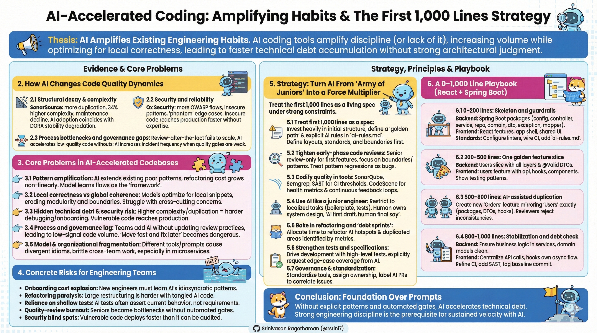

# AI Accelerated Development Playbook

## 1. Thesis: AI Amplifies Existing Engineering Habits

AI coding tools do not replace engineering discipline; they **amplify** whatever discipline (or lack of it) already exists. SonarSource’s analysis of AI‑accelerated codebases shows that technical debt now accumulates faster because LLMs increase volume while optimizing for local correctness rather than global design. Ox Security similarly finds AI‑generated code to be “highly functional but systematically lacking in architectural judgment”, making it behave like an “army of juniors” that needs strong supervision. [sonarsource](https://www.sonarsource.com/blog/the-inevitable-rise-of-poor-code-quality-in-ai-accelerated-codebases/)

Empirical work on AI‑generated programs reports higher cyclomatic complexity, more duplication, and a greater incidence of security issues compared with human‑written code, especially when suggestions are accepted with minimal review. Yet teams that pair strong code‑health practices with AI see no statistically significant drop in maintainability, indicating that governance and early design choices largely determine the outcome. [codescene](https://codescene.com)

***

## 2. Evidence: How AI Changes Code Quality Dynamics

### 2.1 Structural decay and complexity

SonarSource documents a “structural decay” pattern: AI tools increase lines of code, duplication, and cyclomatic complexity, resulting in a measurable decline of maintainability across large codebases. Their data shows that copy‑pasted lines in 2024 exceeded refactored lines for the first time, coinciding with a sharp rise in AI adoption and DORA stability degradation. [sonarsource](https://www.sonarsource.com/blog/the-inevitable-rise-of-poor-code-quality-in-ai-accelerated-codebases/)

Academic measurements on AI‑generated solutions report roughly one‑third higher complexity and more than double the duplication compared with human implementations, directly increasing maintenance effort. Tools like CodeScene link low “code health” to up to 15× more defects and significantly slower delivery in areas with concentrated technical debt. [codescene](https://codescene.com/)

### 2.2 Security and reliability

Studies of AI‑generated samples reveal materially higher rates of OWASP‑class vulnerabilities and insecure patterns when code is generated and deployed without security expertise. Ox Security’s “Army of Juniors” report highlights recurring anti‑patterns such as duplicated buggy logic, environment‑blind code that fails in production, and over‑engineered “phantom” edge‑case paths that degrade performance. [infoq](https://www.infoq.com/news/2025/11/ai-code-technical-debt/)

### 2.3 Process bottlenecks and governance gaps

Organizations often bolt AI onto existing workflows without adapting code review, security, or ownership models. SonarSource and others argue that manual review cannot scale to match AI output velocities, turning traditional review‑after‑the‑fact into a bottleneck and enabling an exponential accumulation of unmanaged issues. CodeScene and CodeAnt show that without automated quality gates, AI accelerates the rate at which low‑quality code is merged, increasing incident frequency and slowing future development. [sonarsource](https://www.sonarsource.com/blog/seven-indicators-your-codebase-is-unmanageable/)

At the same time, CodeScene data suggests that when experienced engineers keep code health in check through continuous metrics and refactoring, AI‑assisted code can be as maintainable as non‑assisted code, underscoring that tools and senior oversight are the determining factors. [codescene](https://codescene.io/docs/developer-tools/mcp/codescene-mcp-server.html)

***

## 3. Core Problems in AI‑Accelerated Codebases

### 3.1 Pattern amplification, not design

LLMs are pattern amplifiers: they remix and extend whatever patterns exist in the repo rather than designing architecture from first principles. If the first 1,000 lines have weak layering, inconsistent naming, or leaky boundaries, the model learns those as the “framework” and reproduces them relentlessly. The cost of later refactoring grows non‑linearly because the flawed pattern is now spread across many features. [arxiv](https://arxiv.org/html/2506.17833v1)

### 3.2 Local correctness vs global coherence

Research on AI‑generated solutions shows that models optimize for snippets that “work here” rather than for cohesive, system‑level design. They excel at localized implementation but struggle with cross‑cutting concerns and multi‑module changes, which often leads to erosion of boundaries, increased coupling, and subtle architectural drift as the system grows. [arxiv](https://arxiv.org/html/2506.17833v1)

### 3.3 Hidden technical debt and security risk

Measured increases in complexity and duplication translate into harder debugging, slower onboarding, and more fragile releases. Security studies indicate that AI‑generated code can have more exploitable patterns per unit of time delivered, particularly when non‑experts ship code without robust static analysis or security reviews. [thesesjournal](https://thesesjournal.com/index.php/1/article/view/1810)

### 3.4 Process and governance lag behind speed

Teams frequently introduce AI assistants without evolving their code review, coding standards, and ownership structures, so AI quietly increases the volume of low‑signal or unsafe code. In this context, “move fast and fix later” becomes dangerous: by the time teams decide to fix, the surface area is orders of magnitude larger. [cerfacs](https://cerfacs.fr/coop/hpcsoftware-codemetrics-kpis)

### 3.5 Model and organizational fragmentation

Ox Security and others describe “model versioning chaos” and organizational fragmentation: different groups use different assistants and prompting styles, resulting in divergent idioms and frameworks within the same codebase. This increases integration cost and makes cross‑team work brittle, especially in microservices and large monorepos. [linkedin](https://www.linkedin.com/posts/codedevza-ai_ai-technicaldebt-softwarearchitecture-activity-7397891622010605568-Z53F)

***

## 4. Concrete Risks for Engineering Teams

- **Onboarding cost explosion.** New engineers must understand not only the domain but also the idiosyncratic patterns and workarounds produced by AI, often under‑documented and inconsistent. [gocodeo](https://www.gocodeo.com/post/comparing-ai-code-generation-tools-on-maintainability-and-readability)
- **Refactoring paralysis.** Case studies of AI‑heavy projects report that large‑scale restructuring is harder than fresh implementation; AI‑generated code is often tangled and duplicated, making safe change expensive. [gocodeo](https://www.gocodeo.com/post/comparing-ai-code-generation-tools-on-maintainability-and-readability)
- **Reliance on shallow tests.** LLM‑generated tests frequently assert current behaviour rather than business requirements, giving a false impression of safety while cementing flawed designs. [softwareseni](https://www.softwareseni.com/testing-and-debugging-ai-generated-code-systematic-strategies-that-work/)
- **Quality‑review burnout.** Senior engineers become bottlenecks when every AI‑authored PR demands deep review in the absence of strong automated gates. [codeant](https://www.codeant.ai/blogs/automated-code-quality-analysis-reduces-technical-debt)
- **Security blind spots.** With AI output outpacing human review and many non‑experts deploying code, vulnerable systems reach production faster than organizations can audit them. [prnewswire](https://www.prnewswire.com/news-releases/ox-report-ai-generated-code-violates-engineering-best-practices-undermining-software-security-at-scale-302592642.html)

***

## 5. Strategy: Turn AI From “Army of Juniors” Into a Force Multiplier

The emerging consensus from SonarSource, CodeScene, Ox Security, and others is that AI coding can be safe and highly productive if we treat it as implementation support under strong architectural and quality constraints. The key is to treat the *first 1,000 lines of code* as a living specification that encodes structure, standards, and AI usage rules. [codescene](https://codescene.com)

### 5.1 Principle 1 – Treat the first 1,000 lines as a spec

- **Invest heavily in initial structure.** Define clear directory layout, domain boundaries, error‑handling strategy, naming conventions, and response schemas before asking AI to generate real features. [koder](https://koder.ai/blog/prompting-patterns-cleaner-architecture-fewer-rewrites)
- **Document the “golden path.”** Provide a README, architecture notes, and at least one fully polished feature slice that shows ideal usage of layers, DTOs, tests, and error handling. [baeldung](https://www.baeldung.com/spring-boot-clean-architecture)
- **Explicit rules for AI agents.** Maintain `ai-rules.md` (or equivalent tool config) that states coding style, dependency rules (e.g., “no domain code depends on infra”), and forbidden patterns. [blog.jetbrains](https://blog.jetbrains.com/idea/2025/05/coding-guidelines-for-your-ai-agents/)

### 5.2 Principle 2 – Tighten early‑phase code reviews

- Make first features **review‑only by senior engineers**; nothing merges until the architectural pattern is agreed. [dev](https://dev.to/rakbro/ai-code-review-what-to-look-for-in-the-age-of-copilots-2g02)
- Focus reviews on boundaries, dependency direction, naming, and error strategy—not just correctness.  
- Treat pattern regressions as bugs: if a PR introduces a new style or layer, either normalize it or explicitly evolve the pattern and update docs and rules.  

### 5.3 Principle 3 – Codify quality in tools, not just culture

- **Static analysis and security.** Integrate tools such as SonarQube, Semgrep, and SAST scanners into CI; enforce thresholds on complexity, duplication, code smells, and critical vulnerabilities. [sonarsource](https://www.sonarsource.com/blog/ai-code-assurance-sonar/)
- **Code health metrics.** Use tools like CodeScene to identify hotspots where AI‑generated code concentrates complexity, and to link refactoring to defect reduction and throughput. [codescene](https://codescene.com/)
- **Continuous feedback loops.** Use IDE and MCP integrations to surface maintainability issues in real time and even auto‑refactor problematic AI suggestions before they reach the repo. [codescene](https://codescene.com/product/integrations/ide-extensions/ai-refactoring)

### 5.4 Principle 4 – Use AI like a junior engineer, not an architect

- Restrict AI to localized tasks: boilerplate, adapters, migrations, tests, and small refactors. [swairm](https://swairm.io/blog/best-practices-ai-pair-programming)
- Keep system design, module boundaries, and cross‑cutting concerns under human control; large‑scale architectural changes should be human‑led with AI assisting implementation. [forbes](https://www.forbes.com/councils/forbestechcouncil/2026/02/11/how-to-leverage-ai-coding-tools-without-sacrificing-code-quality/)
- Adopt “AI first draft, human final say”: no AI‑generated code should merge without human comprehension and ownership.  

### 5.5 Principle 5 – Bake in refactoring and “debt sprints”

- Allocate explicit time each sprint to refactor AI‑heavy areas identified by code‑health metrics and incident history. [pixelmojo](https://www.pixelmojo.io/blogs/vibe-coding-technical-debt-crisis-2026-2027)
- Prioritize high‑complexity services, duplicated utilities, and modules with repeated bugs; use AI as a refactoring assistant but validate changes with tests and reviews. [codescene](https://codescene.com/product/integrations/ide-extensions/ai-refactoring)

### 5.6 Principle 6 – Strengthen tests and specifications

- Drive development through **high‑level tests and specs**: define behaviours and invariants first, then ask AI to implement code that satisfies them. [softwareseni](https://www.softwareseni.com/testing-and-debugging-ai-generated-code-systematic-strategies-that-work/)
- Instruct AI explicitly to generate edge‑case and negative tests, and review test quality carefully on critical paths to avoid superficial coverage. [arxiv](https://arxiv.org/html/2506.17833v1)

### 5.7 Principle 7 – Governance and standardization

- Standardize on a small set of AI tools and versions, with documented usage patterns, supported tasks, and banned usage. [infoq](https://www.infoq.com/news/2025/11/ai-code-technical-debt/)
- Assign clear ownership for critical subsystems; owners are accountable for AI‑introduced changes in their areas.  
- Label AI‑assisted PRs and correlate defects or hotspots with AI involvement to refine policies over time. [codescene](https://codescene.io/docs/developer-tools/mcp/codescene-mcp-server.html)

***

## 6. A 0–1,000 Line Playbook (React + Spring Boot)

Below is a concrete implementation of these principles for a React + Spring Boot stack, designed so AI agents extend patterns rather than inventing them. It mirrors best‑practice guidance for clean architecture in Spring and feature‑oriented React apps. [learncodewithdurgesh](https://learncodewithdurgesh.com/tutorials/spring-boot-tutorials/spring-boot-folder-and-package-architecture)

### 6.1 0–200 lines: Skeleton and guardrails

**Root structure** [symflower](https://symflower.com/en/company/blog/2024/spring-boot-folder-structure/)

- `backend/` – Spring Boot service  
- `frontend/` – React app  
- `docs/` – ADRs, architecture, API contracts  

**Spring Boot packages (`backend/src/main/java/com/example/app`)** [baeldung](https://www.baeldung.com/spring-boot-clean-architecture)

- `config/` – configuration and security  
- `controller/` – REST controllers  
- `service/` – use‑case services (interfaces + implementations)  
- `repository/` – Spring Data interfaces  
- `domain/` – entities and domain models  
- `dto/` – request/response DTOs  
- `exception/` – custom exceptions + `GlobalExceptionHandler`  
- `mapper/` – mapping between domain and DTOs  

**React structure (`frontend/src`)** [github](https://github.com/gergelyszerovay/aibd-coding-guidelines)

- `app/` – app shell and routing  
- `features/` – per‑feature folders (`users/`, `orders/`, …)  
- `shared/` – reusable UI, hooks, and HTTP client  

**Standards and automation** [nx](https://nx.dev/blog/practical-guide-effective-ai-coding)

- Configure formatters/linters (`.editorconfig`, ESLint, Prettier, Checkstyle/Spotless) in both projects.  
- Wire CI to run lint, tests, type checking, and basic security scans on every push.  
- Introduce `ai-rules.md` documenting: constructor injection only, controllers return `ResponseEntity`, no `fetch` in React components, feature‑based layout only.  

### 6.2 200–500 lines: One golden feature slice

**Backend “Users” slice** [learncodewithdurgesh](https://learncodewithdurgesh.com/tutorials/spring-boot-tutorials/spring-boot-folder-and-package-architecture)

- `domain/User.java` – entity or domain model.  
- `repository/UserRepository.java` – Spring Data interface.  
- `dto/UserDto.java`, `dto/CreateUserRequest.java`.  
- `service/UserService.java` + `UserServiceImpl.java`.  
- `controller/UserController.java` – `/api/users` CRUD with validation and pagination.  
- `exception/UserNotFoundException.java` + mapping in `GlobalExceptionHandler`.  

Patterns: validate via `@Valid` DTOs, map via `UserMapper`, return consistent response envelopes. [blog.jetbrains](https://blog.jetbrains.com/idea/2025/05/coding-guidelines-for-your-ai-agents/)

**Frontend “users” feature** [nipafx](https://nipafx.dev/java-react-folders/)

- `features/users/api/usersApi.ts` – typed API calls using shared `httpClient`.  
- `features/users/hooks/useUsers.ts` – encapsulates loading/error state.  
- `features/users/components/UsersTable.tsx` and `UserForm.tsx` – presentational only.  
- Route `/users` wired in `app/routes.tsx`.  

Add at least one Spring slice test for `UserController` and a React test for `UsersTable` to demonstrate testing patterns. [github](https://github.com/gergelyszerovay/aibd-coding-guidelines)

### 6.3 500–800 lines: AI‑assisted duplication, tightly constrained

For a new `orders` feature:  

- Backend prompt: *“Create an `Order` feature identical in structure to `User`: same packages, DTO approach, mapper, exception handling, and pagination; use constructor injection and our `ResponseEntity` wrapper; do not introduce new frameworks or annotations.”* [baeldung](https://www.baeldung.com/spring-boot-clean-architecture)
- Frontend prompt: *“Under `features/orders`, mirror `features/users` exactly: `ordersApi.ts`, `useOrders.ts`, `OrdersTable.tsx`, `OrderForm.tsx` with the same loading/error patterns and testing style.”* [graphite](https://graphite.com/guides/ai-pair-programming-best-practices)

Human reviewers reject any new folder or naming style, inline SQL in controllers, direct `fetch` in components, or inconsistent DTO schemas. [symflower](https://symflower.com/en/company/blog/2024/spring-boot-folder-structure/)

### 6.4 800–1,000 lines: Stabilization and debt check

**Backend checks** [learncodewithdurgesh](https://learncodewithdurgesh.com/tutorials/spring-boot-tutorials/spring-boot-folder-and-package-architecture)

- No business logic in controllers or repositories; services own use‑case logic.  
- Domain models free from web concerns; JPA annotations are the only framework leakage.  
- `GlobalExceptionHandler` returns consistent error payloads.  
- Complexity and duplication scans run via SonarQube or similar; refactor any “god” methods or classes.  

**Frontend checks** [nipafx](https://nipafx.dev/java-react-folders/)

- All HTTP calls centralized in `api/` or `shared/httpClient`.  
- Hooks own async control flow; components remain declarative.  
- Layout and widgets reused from `shared/`, not duplicated across features.  

Refine CI to enforce quality thresholds and add a minimal SAST profile for Spring and React security issues. Tag this commit as your baseline (e.g., `v0.1-initial-architecture`) and treat later deviations as explicit architectural decisions. [sonarsource](https://www.sonarsource.com/blog/ai-code-assurance-sonar/)

***

## 7. Conclusion: Foundation Over Prompts

The emerging reality is that AI coding tools create an unprecedented opportunity to accelerate delivery—but only if the underlying engineering discipline is strong. Data from SonarSource, Ox Security, CodeScene, and others shows that without explicit patterns, guardrails, and automated quality enforcement, AI mainly accelerates technical debt. By contrast, teams that deliberately shape the first 1,000 lines of code, codify standards in tools, and treat AI as a junior implementer achieve sustained velocity without sacrificing maintainability. [sonarsource](https://www.sonarsource.com/blog/the-inevitable-rise-of-poor-code-quality-in-ai-accelerated-codebases/)

**Related:**
- [Spec-Driven-Development-Frameworks](Spec-Driven-Development-Frameworks.md) — formalizes the playbook's 'first 1,000 lines as a spec' principle into SDD, OpenSpec, Spec Kit, and BMAD workflows.
- [AI-Assisted-Development](AI-Assisted-Development.md) — UACF AGENTS.md plus Claude Skills directly implement the 'ai-rules.md' and 'codify standards in tools' guidance here.
- [Agent-Skills](../skills/Agent-Skills.md) — Anthropic's Skills standard is the natural packaging mechanism for the playbook's vetted prompts and review checklists.
