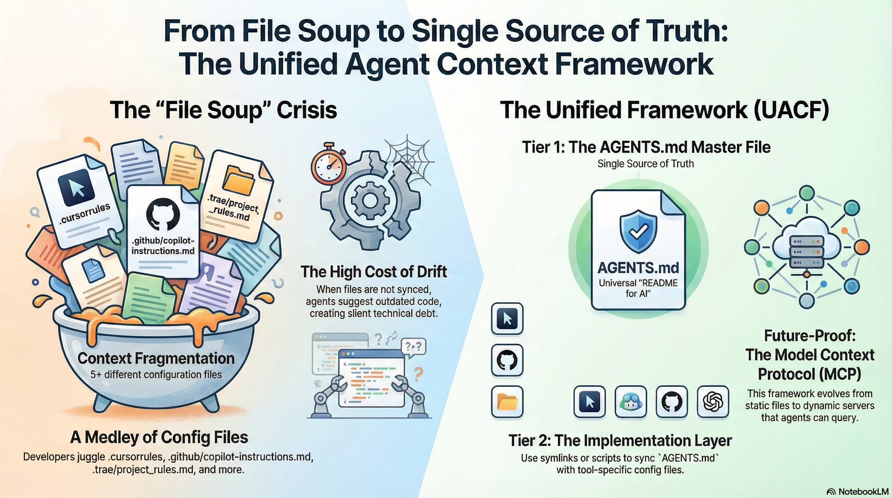
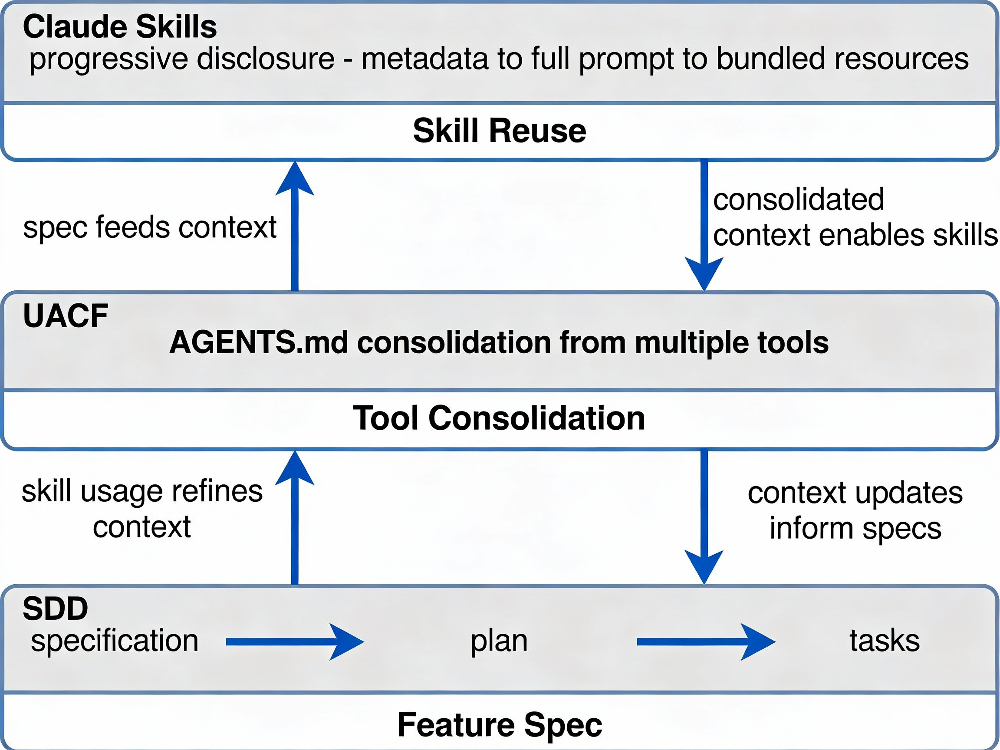

# AI-Assisted Development Framework Guide

## Executive Summary

The rapid proliferation of AI coding assistants has created both unprecedented opportunities and significant challenges. Three distinct but complementary frameworks have emerged in 2024-2025 to address different aspects of AI-assisted software development

[PDF for Unified Agent Context](../../docs/Unified_Agent_Context.pdf)





### The Three Frameworks

**Unified Agent Context Framework (UACF)** solves the "File Soup" crisis—consolidating scattered AI tool configurations (`.cursorrules`, `.trae/project_rules.md`, `.windsurfrules`, etc.) into a single source of truth.

**Spec-Driven Development (SDD)** solves the "Vibe Coding" problem—systematizing how humans and AI collaborate through formal specifications, planning, and structured implementation.

**Claude Agent Skills** solves the "Capability Gap" problem—enabling reusable procedural knowledge that Claude can dynamically discover and invoke for domain-specific expertise.

### The Critical Insight

**These three frameworks are not competitors—they're complementary layers of a cohesive system:**

```
Layer 1 (Foundation): Specification (SDD)
↓ What are we building? (WHAT & WHY)
├── Feature specifications
├── Technical plans  
└── Implementation tasks

Layer 2 (Middle): Tool Consolidation (UACF)
↓ How do we ensure consistency? (STANDARDS)
├── AGENTS.md (master knowledge base)
├── Symlinks to all tools
└── Automated sync scripts

Layer 3 (Top): Capability Composition (Skills)
↓ How do we reuse procedures? (REUSABLE WORKFLOWS)
├── Skill discovery (metadata-based)
├── Skill loading (progressive disclosure)
└── Automatic invocation when relevant
```

**Think of it like building construction:**
- **SDD** = Blueprint and project methodology
- **UACF** = Tool consolidation (all contractors follow same spec)
- **Skills** = Reusable procedures (standard plumbing, electrical, framing)

You need all three for professional construction. Similarly, enterprises achieve best results combining all three.

### ROI at a Glance

**5-developer team, 3-month project:**
- Time savings: 60 dev-days = $18,000/month
- Token savings: 80-98% reduction = $4,200/month
- **Total monthly benefit: $22,200**
- Implementation cost: 160 hours (one-time)
- **Break-even: Less than 1 week**
- **3-month savings: $66,600**

---

## The Crisis: Context Fragmentation

In 2025, a typical modern repository might require 5+ different configuration files to ensure all developers (and their varied AI tools) follow the same architectural patterns.

### The "File Soup" Inventory

| Tool | Configuration File | Location | Behavior |
|:---|:---|:---|:---|
| **Cursor** | `.cursorrules` | Root | High-priority system prompt injection |
| **Trae** | `project_rules.md` | `.trae/` | Strict rules for the "Builder" agent |
| **Windsurf** | `.windsurfrules` | Root | Guidance for the "Cascade" flow |
| **GitHub Copilot** | `copilot-instructions.md` | `.github/` | Instructions for Chat & Inline completion |
| **VS Code (Cline)** | `.clinerules` | Root | System prompt for the Cline extension |
| **Aider** | `CONVENTIONS.md` | Root | Architectural conventions for CLI agents |

### The Risk

When a team decides to migrate from *React* to *SolidJS*, they update `.cursorrules` but forget `.trae/project_rules.md`. Half the team's agents continue suggesting React code, creating silent technical debt.

### The Problems Being Solved

| Framework | Problem | Root Cause | Scope |
|:---|:---|:---|:---|
| **UACF** | "File soup"—config fragmentation | Tools require different files | Tool configuration |
| **SDD** | "Vibe coding"—unstructured AI prompting | No specs → AI guesses architecture | Development methodology |
| **Skills** | "Capability gaps"—general vs specialist | No mechanism for reusable procedures | Agent capabilities |

---

## The Three Complementary Frameworks

### Quick Overview

**Spec-Driven Development (SDD)**
- **Problem**: Unstructured prompting leads to poor architecture
- **Solution**: Formal specs → plans → task breakdowns → implementation
- **Best for**: Greenfield projects, complex architecture, multi-developer teams
- **Examples**: BMAD, Spec Kit, OpenSpec, Agent OS, Conductor, Serena

**Unified Agent Context Framework (UACF)**
- **Problem**: Multiple AI tools require separate configuration files
- **Solution**: Single AGENTS.md as master source, synced to all tools via symlinks/scripts
- **Best for**: Teams using multiple AI tools (Cursor, Windsurf, Trae, Copilot, Cline)
- **Scope**: Organization-wide consistency

**Claude Agent Skills**
- **Problem**: Claude is general-purpose, not expert at specialized tasks
- **Solution**: Reusable "skills" folders with procedures, scripts, and resources that Claude auto-discovers and invokes
- **Best for**: Reusable domain-specific procedures, multi-session persistence
- **Scope**: Composable agent capabilities

### Visual Architecture

```
┌─────────────────────────────────────────────────────┐
│  Layer 3: Capability Composition (Skills)          │
│  WHERE: Claude Code, Claude Desktop                │
│  WHAT: Reusable procedures, domain expertise       │
│  WHEN: Task execution, automatic invocation        │
└───────────────┬─────────────────────────────────┬──┘
                │                                 │
        ┌───────▼────────────        ┌────────────▼──────────┐
        │  Layer 2: Tool   │        │  Layer 1: Project     │
        │  Unification     │        │  Methodology          │
        │  (UACF)          │        │  (SDD)                │
        │                  │        │                       │
        │ WHERE: All tools │        │ WHERE: Specs,         │
        │ WHAT: Standards  │        │ plans, tasks          │
        │ WHEN: Per-tool   │        │ WHEN: Feature         │
        │                  │        │       planning        │
        └──────────────────┘        └───────────────────────┘
```

---

## Unified Agent Context Framework (UACF)

### Overview

The UACF proposes a **Two-Tier Architecture**: decoupling the *Source of Truth* (Knowledge) from the *Tool Configuration* (Implementation).

### Tier 1: The Master Knowledge Base (`AGENTS.md`)

The `AGENTS.md` file serves as the universal "README for AI." It is a human-readable and machine-parseable Markdown file located at the repository root.

**Standard `AGENTS.md` Structure:**

```markdown
# Agent Context & Rules
> **Role**: Senior Full-Stack Engineer
> **Stack**: Next.js 15, TypeScript, Tailwind, Supabase

## 1. Universal Principals
- **Code Style**: Functional components, immutable state, early returns
- **Security**: RLS enabled on all database queries. No sensitive keys in client code
- **Testing**: Jest, 80%+ coverage required

## 2. Tool-Specific Instructions
<!-- Tools parse these specific sections using regex or MCP adapters -->

### @Trae
- Use `project_rules.md` syntax for strictly enforcing folder structures

### @Windsurf
- Prioritize the Cascade agent for multi-file refactoring

### @Cursor
- Use Composer for complex refactoring tasks

## 3. Available Skills
- csv-parser: CSV validation and processing
- pdf-extractor: PDF form extraction and analysis
- code-review: Automated code quality checks
```

### Tier 2: The Implementation Layer (Symlinks & Generation)

Instead of manually editing tool-specific files, the framework enforces a "Generate or Link" policy.

**Implementation Strategy:**

1. **Symlinks (Preferred):** For tools that support standard Markdown at the root
   ```bash
   ln -s AGENTS.md .cursorrules
   ln -s AGENTS.md .windsurfrules
   ln -s AGENTS.md .clinerules
   ln -s AGENTS.md CONVENTIONS.md
   ```

2. **Hard Copies (Required):** For tools with strict path requirements
   ```bash
   cp AGENTS.md .trae/project_rules.md
   cp AGENTS.md .github/copilot-instructions.md
   ```

### Two-Tier Architecture Visualization

```
┌───────────────────────────────────────────────────────┐
│        Tier 1: Master Knowledge Base                  │
│              (AGENTS.md)                              │
│  ┌────────────────────────────────────────────────┐  │
│  │ ## Universal Principals                        │  │
│  │ - Code Style (FP, immutable, early returns)   │  │
│  │ - Security (RLS, no sensitive keys)           │  │
│  │ - Testing (Jest, 80%+ coverage)               │  │
│  │                                                │  │
│  │ ## Tool-Specific Instructions                  │  │
│  │ ### @Cursor                                    │  │
│  │ ### @Windsurf                                  │  │
│  │ ### @Trae                                      │  │
│  │ ### @GitHub Copilot                           │  │
│  │ ### @VS Code (Cline)                          │  │
│  └────────────────────────────────────────────────┘  │
└─────────────────┬─────────────────────────────────────┘
                  ↓
    ┌─────────────┴──────────────┐
    ↓                            ↓
┌──────────────────┐   ┌──────────────────────┐
│ Tier 2: Symlinks │   │ Tier 2: Hard Copies  │
│ (Preferred)      │   │ (When needed)        │
├──────────────────┤   ├──────────────────────┤
│ .cursorrules →   │   │ .trae/project_rules  │
│ AGENTS.md        │   │ (auto-synced)        │
│                  │   │                      │
│ .windsurfrules → │   │ .github/copilot-     │
│ AGENTS.md        │   │ instructions.md      │
│                  │   │ (auto-synced)        │
│ .clinerules →    │   │                      │
│ AGENTS.md        │   │ CONVENTIONS.md       │
│                  │   │ (auto-synced)        │
└──────────────────┘   └──────────────────────┘
    ↓                            ↓
  Cursor uses                  Trae uses
  AGENTS.md directly           synced copy
  (no duplication)             (path requirement)
```

### Key Design Pattern: Single Source, Multiple Delivery

```
AGENTS.md is source of truth
    ↓
    ├── Cursor reads directly via symlink
    ├── Windsurf reads via symlink
    ├── Trae gets synced copy (CI/CD automation)
    └── Copilot gets synced copy (automation)
    
When you update AGENTS.md:
    ↓
    ├── Symlink tools see it immediately
    ├── Synced tools update on next automation run
    └── All tools consistent
```

### Automation Script Example

```bash
#!/bin/bash
# sync-agents.sh - Synchronize AGENTS.md to all tools

# Copy to tools requiring specific paths
cp AGENTS.md .trae/project_rules.md
cp AGENTS.md .github/copilot-instructions.md

# Create symlinks for tools that support them
ln -sf AGENTS.md .cursorrules
ln -sf AGENTS.md .windsurfrules
ln -sf AGENTS.md .clinerules

echo "✓ AGENTS.md synchronized to all tools"
```

---

## Spec-Driven Development (SDD)

### Overview

**Definition:** A structured methodology where AI agents generate code in response to formal specifications, architectural plans, and systematic task breakdowns—rather than ad-hoc prompting into chat interfaces.

### The Problem: "Vibe Coding"

```
Traditional Approach (Vibe Coding):
User: "Build me a user login system"
↓
AI: Immediately generates code without understanding architecture
↓
Result: Inconsistent patterns, poor architectural decisions, security gaps
↓
Human: Spends hours iterating, fixing incompatibilities

SDD Approach:
User + AI: Define specification (WHAT we're building)
↓
AI: Creates technical plan (HOW we'll build it)
↓
Human: Reviews and approves before implementation
↓
AI: Generates code following spec and plan
↓
Result: Consistent, architectural, properly designed code
```

### Core Principles

1. **Specification First** - Formal requirements before coding
2. **Context as Managed Artifact** - Specs in git, not chat logs
3. **Planning Phase** - Decompose specs into actionable steps
4. **Systematic Implementation** - AI executes against plans
5. **Human-Centered Control** - Humans review key gates

### SDD Framework Variants

| Framework | Complexity | Learning Curve | Best For |
|:---|:---|:---|:---|
| **BMAD** | High | 2 hours | Multi-agent orchestration, enterprise |
| **Spec Kit** | Medium | 1 hour | Structured 4-phase development |
| **OpenSpec** | Low | 30 min | Lightweight, quick adoption |
| **Agent OS** | Medium | 1 hour | Tool-agnostic systematic approach |
| **Conductor** | Medium | 1 hour | Gemini-specific context management |
| **Serena** | Low | 30 min | IDE-level token optimization |

### Hierarchical Context Layering

```
┌───────────────────────────────────────────────────────┐
│         Specification (WHAT are we building)          │
│  - User stories, acceptance criteria, data models     │
│  - API contracts, security requirements               │
│  - File: spec.md (~3-5KB)                            │
└─────────────────────┬─────────────────────────────────┘
                      ↓
┌───────────────────────────────────────────────────────┐
│      Technical Plan (HOW will we build it)            │
│  - Architecture decisions, technology choices         │
│  - Service boundaries, data flow                      │
│  - Implementation sequence, dependencies              │
│  - File: plan.md (~4-8KB)                            │
└─────────────────────┬─────────────────────────────────┘
                      ↓
┌───────────────────────────────────────────────────────┐
│      Task Breakdown (STEPS to implement)              │
│  - Granular tasks with acceptance criteria            │
│  - Ordered respecting dependencies                    │
│  - Checkpoint validation gates                        │
│  - File: tasks.md (~5-10KB)                          │
└─────────────────────┬─────────────────────────────────┘
                      ↓
┌───────────────────────────────────────────────────────┐
│    Implementation (CODE generated by AI)              │
│  - Follows spec, plan, and tasks exactly              │
│  - All context provided by spec hierarchy             │
│  - Tests generated from acceptance criteria           │
│  - Result: Complete feature                          │
└───────────────────────────────────────────────────────┘
```

### Information Flow: Progressive Concretization

```
Spec (Abstract): "Users can create tasks with title, description, priority"
↓
Plan (Semi-concrete): "Create Task model, REST endpoint, React form"
↓
Tasks (Concrete): 15 specific implementation steps
↓
Code (Executable): Implementation of each task
```

### Example: Feature Specification Template

```markdown
# Feature Specification: User Task Management

## 1. Overview
Users need the ability to create, read, update, and delete tasks.

## 2. User Stories
- As a user, I want to create tasks with a title and description
- As a user, I want to mark tasks as complete
- As a user, I want to filter tasks by status

## 3. Acceptance Criteria
- Task title is required (1-200 characters)
- Task description is optional (0-2000 characters)
- Task status can be: pending, in_progress, completed
- Tasks display in creation order (newest first)

## 4. Data Model
```typescript
interface Task {
  id: string;
  userId: string;
  title: string;
  description?: string;
  status: 'pending' | 'in_progress' | 'completed';
  createdAt: Date;
  updatedAt: Date;
}
```

## 5. API Endpoints
- POST /api/tasks - Create task
- GET /api/tasks - List tasks (with filtering)
- PATCH /api/tasks/:id - Update task
- DELETE /api/tasks/:id - Delete task

## 6. Security Requirements
- Users can only access their own tasks
- Row-level security (RLS) enforced at database level
- API authentication required (JWT tokens)

## 7. Test Requirements
- Unit tests for all CRUD operations
- Integration tests for API endpoints
- E2E tests for task creation flow
- Minimum 80% code coverage
```

---

## Claude Agent Skills

### Overview

**Definition:** Organized folders containing instructions, scripts, and resources that Claude discovers and loads dynamically to perform specific tasks with domain expertise—enabling composable, reusable agent capabilities through prompt-based meta-tool architecture.

### The Problem: "Agent Capability Boundaries"

```
Traditional Approach (Monolithic Agent):
Claude is general-purpose
User: "Help me process PDFs, format Excel, analyze code"
↓
Claude responds to all with general knowledge
↓
Result: OK at everything, expert at nothing

Claude Skills Approach:
Claude has composable capabilities
├── pdf-skill (PDF extraction, form filling, analysis)
├── excel-skill (spreadsheet processing, formulas)
├── code-analysis-skill (codebase patterns, refactoring)
└── [100+ community skills]

User: "Help me process PDFs"
↓
Claude auto-invokes pdf-skill
↓
Claude sees detailed PDF instructions, examples, scripts
↓
Result: Expert-level PDF processing

User switches task: "Now analyze this Excel"
↓
Claude auto-invokes excel-skill
↓
Result: Expert-level Excel handling
```

### Core Principles

1. **Prompt-based meta-tool architecture** (not executable code)
2. **Progressive disclosure** (load minimal metadata initially, full context on demand)
3. **Automatic skill invocation** (Claude decides when relevant)
4. **Composable capabilities** (multiple skills per session)
5. **Declarative skill discovery** (text descriptions, no algorithmic matching)

### Key Difference from Traditional Tools

| Feature | Traditional Tools | Claude Skills |
|:---|:---|:---|
| **Execution** | Execute immediately, return results | Inject detailed instructions, modify context |
| **Invocation** | Explicit tool call | Automatic based on Claude's reasoning |
| **Purpose** | Perform action | Guide problem-solving approach |
| **Context** | Minimal (tool input/output) | Rich (detailed procedures, examples) |

### Progressive Disclosure Architecture

```
┌───────────────────────────────────────────────────────┐
│    Level 0: Skill Discovery (In System Prompt)        │
│  - Metadata only (name + description)                 │
│  - ~50-100 tokens per skill                           │
│  - Loaded at startup                                 │
│  ┌────────────────────────────────────────────────┐  │
│  │ Available Skills:                              │  │
│  │ - "pdf": Extract and process PDF documents     │  │
│  │ - "excel": Format and analyze spreadsheets     │  │
│  │ - "code-review": Analyze code for issues       │  │
│  └────────────────────────────────────────────────┘  │
└─────────────┬─────────────────────────────────────────┘
              ↓
    User says: "Process this PDF"
    Claude reads descriptions
    Claude matches intent → "pdf skill relevant"
              ↓
┌───────────────────────────────────────────────────────┐
│   Level 1: Skill Metadata (User Visible)              │
│  - Status indicator in chat transcript                │
│  - XML tags: <command-message>, <command-name>       │
│  - ~50-100 characters                                │
│  ┌────────────────────────────────────────────────┐  │
│  │ <command-message>                              │  │
│  │   The "pdf" skill is loading                  │  │
│  │ </command-message>                             │  │
│  │ <command-name>pdf</command-name>              │  │
│  └────────────────────────────────────────────────┘  │
└─────────────┬─────────────────────────────────────────┘
              ↓
┌───────────────────────────────────────────────────────┐
│   Level 2: Full Skill Prompt (Hidden from UI)         │
│  - isMeta: true (hidden from user transcript)        │
│  - Injected as user message to Claude                │
│  - 500-5,000 words of detailed instructions         │
│  ┌────────────────────────────────────────────────┐  │
│  │ ---                                            │  │
│  │ name: pdf                                      │  │
│  │ description: Extract and process PDFs          │  │
│  │ allowed-tools: "Bash(pdftotext),Read,Write"   │  │
│  │ ---                                            │  │
│  │                                                │  │
│  │ # PDF Processing Skill                         │  │
│  │                                                │  │
│  │ ## Instructions                                │  │
│  │ 1. Validate PDF file exists                   │  │
│  │ 2. Run pdftotext to extract                   │  │
│  │ 3. Process extracted text                     │  │
│  │                                                │  │
│  │ ## Workflow                                    │  │
│  │ [Detailed 15-step process]                    │  │
│  │                                                │  │
│  │ Base directory: {baseDir}                      │  │
│  └────────────────────────────────────────────────┘  │
└─────────────┬─────────────────────────────────────────┘
              ↓
┌───────────────────────────────────────────────────────┐
│ Level 3+: Bundled Resources (On-Demand Load)          │
│  - Claude references via {baseDir} path              │
│  - Loaded only when needed                           │
│  - scripts/, references/, assets/ directories        │
│  ┌────────────────────────────────────────────────┐  │
│  │ /scripts/                                      │  │
│  │ ├── extract_pdf.py (automation)               │  │
│  │ ├── process_text.py (deterministic logic)     │  │
│  │ └── validate_output.py (quality check)        │  │
│  │                                                │  │
│  │ /references/                                   │  │
│  │ ├── pdf_formats.md (PDF specification)        │  │
│  │ ├── best_practices.md (extraction tips)       │  │
│  │ └── error_handling.md (failure cases)         │  │
│  │                                                │  │
│  │ /assets/                                       │  │
│  │ ├── template.html (output template)           │  │
│  │ └── test_sample.pdf (test document)           │  │
│  └────────────────────────────────────────────────┘  │
└───────────────────────────────────────────────────────┘
```

### Two-Message Pattern (API Flow)

```
API Request #1: User says "Process this PDF"
├── Tools array includes Skill tool
├── Skill tool description lists all skills + metadata
└── Claude reads metadata, matches "pdf" skill relevant

Claude invokes: {"name": "Skill", "input": {"command": "pdf"}}
↓

API Request #2: Skill invocation
├── Message 1 (isMeta: false):
│   └── <command-message>The "pdf" skill is loading</command-message>
│       (VISIBLE in chat UI)
├── Message 2 (isMeta: true):
│   └── [Full SKILL.md content + instructions]
│       (HIDDEN from UI, sent to Claude)
├── Optional Message 3 (isMeta: true):
│   └── Permissions/allowed-tools metadata
└── Claude now has full skill context + instructions

Claude proceeds with skill:
├── Uses Bash(pdftotext:*) allowed
├── Uses Read/Write as instructed
├── References {baseDir}/scripts/extract_pdf.py
└── Generates expert-level PDF processing
```

### Dual-Channel Communication Pattern

```
Problem: 
  - Users need transparency (what skill is running?)
  - Claude needs detailed instructions (1000+ words)
  - Can't show both in chat (UI clutter)

Solution: isMeta flag
  - Message 1 (visible): Status indicator (~50 chars)
  - Message 2 (hidden): Full instructions (~2000 words)
  - Claude gets everything, user sees clean UI

Result:
  - Users see: "The pdf skill is loading"
  - Claude sees: 2000 words of PDF expertise
  - No conflict, optimal for both
```

### Example Skill Structure

```
my-skill/
├── SKILL.md                 # Main skill definition
├── scripts/                 # Automation scripts
│   ├── process.py
│   └── validate.sh
├── references/              # Reference documentation
│   ├── api_docs.md
│   └── best_practices.md
└── assets/                  # Templates, examples
    ├── template.json
    └── example_output.csv
```

**SKILL.md Template:**

```markdown
---
name: csv-parser
version: 1.0.0
description: Advanced CSV parsing with validation and error handling
allowed-tools: "Read,Write,Bash(python)"
---

# CSV Parser Skill

## Overview
This skill provides robust CSV parsing capabilities with schema validation,
error handling, and data transformation features.

## When to Use This Skill
- Processing CSV files with complex schemas
- Validating CSV data against specifications
- Transforming CSV data into other formats

## Instructions

### 1. File Validation
First, validate that the CSV file exists and is readable:
```bash
python {baseDir}/scripts/validate_csv.py --file <filepath>
```

### 2. Schema Detection
Analyze the CSV structure:
- Detect headers automatically
- Infer column types
- Identify potential issues

### 3. Data Processing
Process the CSV according to requirements:
- Apply validation rules
- Transform data as needed
- Handle errors gracefully

## Error Handling
Common issues and solutions:
- **Missing headers**: Use column indices
- **Encoding issues**: Try UTF-8, then Latin-1
- **Malformed rows**: Log and skip or fix

## Output Format
Return processed data in the format requested:
- JSON for API consumption
- Cleaned CSV for storage
- Summary statistics for reporting

## Examples
See {baseDir}/references/examples.md for complete examples.
```

---

## Comparative Analysis: 12 Dimensions

### 1. What Problem Do They Solve?

| Dimension | SDD | UACF | Claude Skills |
|:---|:---|:---|:---|
| **Problem** | Vibe coding (unstructured AI prompting) | Config fragmentation (multiple .rules files) | Agent capability gaps (general vs specialist) |
| **Root Cause** | No specs → AI guesses architecture | Tools require different config files | No mechanism to package reusable procedures |
| **Scope** | Development methodology | Tool configuration management | Agent capability composition |
| **Impact** | Code quality, consistency, planning | Tool coherence, team coordination | Agent expertise, task performance |

### 2. Scale and Scope

| Dimension | SDD | UACF | Claude Skills |
|:---|:---|:---|:---|
| **Target Scale** | Project-level, multi-developer teams | Organization-level, tool ecosystem | Session-level to persistent library |
| **Number of Items** | 5-50+ specs per project | 1 AGENTS.md + 30+ agent catalog | 1-100+ skills per project/user |
| **Team Size** | 1-100+ developers | 1-1000+ using diverse AI tools | 1-10+ developers per skill |
| **Lifespan** | Project lifetime (weeks to years) | Indefinite organization-wide | Session to permanent skill library |
| **Typical Complexity** | Medium to very high | Low to medium | Low to high |

### 3. Context Management and Token Efficiency

| Dimension | SDD | UACF | Claude Skills |
|:---|:---|:---|:---|
| **Context Provided** | Focused spec (~2-5KB) + relevant plan | Consolidated instructions in AGENTS.md | Skill metadata (~100 tokens) + full prompt on-demand |
| **Token Reduction** | Specs reduce context by 40-50% vs code dump | Consolidation eliminates duplication | Progressive disclosure saves 70%+ vs full context load |
| **Optimization Tools** | Serena (30-54% reduction) | Symbol indexing, catalog compression | Three-level progressive disclosure |
| **Context Window Usage** | Minimal (spec sized) | Medium (AGENTS.md sized) | Dynamic (loads based on skill relevance) |

**Token Cost Comparison:**

```
Traditional (No SDD/UACF/Skills):
Loading entire codebase: 100,000+ tokens
Cost per request: $2.00 at Claude 3.5 Sonnet pricing

With SDD:
Specs + relevant context: 15,000-20,000 tokens
Cost per request: $0.30
Reduction: 85%

With SDD + Serena:
Semantic code retrieval: 7,000-10,000 tokens
Cost per request: $0.15
Reduction: 92%

With UACF:
Consolidated AGENTS.md: 3,000-5,000 tokens
Cost per request: $0.10
Reduction: 95%

With Claude Skills:
Metadata only: 500 tokens (pre-invocation)
Skill prompt on-demand: 1,500-2,000 tokens
Cost per invocation: $0.05-0.08
Reduction: 98%

With All Three Combined:
Spec context: 20,000 tokens
Skill invocation: 1,500 tokens  
With Serena optimization: 8,500-11,500 total
Cost: $0.18-0.23 per implementation
Reduction: 91% vs baseline
```

### 4. Architectural Philosophy

| Dimension | SDD | UACF | Claude Skills |
|:---|:---|:---|:---|
| **Core Metaphor** | Blueprint before building | Instruction consolidation | Onboarding guide for new hire |
| **Context Structure** | Hierarchical (specs → plans → tasks) | Two-tier (master + implementation) | Progressive disclosure (metadata → full prompt → bundled) |
| **Storage** | Git-tracked markdown files | Git-tracked AGENTS.md + symlinks | Folder-based SKILL.md + resources |
| **Evolution** | Specs evolve with project | AGENTS.md updated, agent catalog grows | Skills versioned, composable updates |
| **Primary Artifact** | Specification file (spec.md) | AGENTS.md (universal instructions) | SKILL.md (reusable procedure) |

### 5. Human Control Model

| Dimension | SDD | UACF | Claude Skills |
|:---|:---|:---|:---|
| **Control Points** | Multiple gates (spec review, plan approval, task approval) | One-time setup (AGENTS.md review, symlink config) | Skill enablement (choose which skills to load) |
| **Approval Required** | Yes, at each phase | Yes, once during setup | Optional per-skill, auto-invocation |
| **Human Decision Making** | Architectural choices, feature prioritization | Tool configuration, instruction consolidation | Skill availability, invocation conditions |
| **Override Capability** | Modify specs/plans mid-flight | Update AGENTS.md anytime | Modify SKILL.md, disable skills selectively |
| **Philosophy** | "Humans drive, AI suggests" | "Humans configure once, automation maintains" | "Humans enable, Claude auto-invokes when relevant" |

### 6. Tool Support and Portability

| Dimension | SDD | UACF | Claude Skills |
|:---|:---|:---|:---|
| **Primary Tools** | Framework-agnostic (works with any AI tool) | Tool-specific (but unified via AGENTS.md) | Claude-specific (Code, Desktop, SDK, Platform) |
| **Portability** | High (markdown specs transfer easily) | Medium (AGENTS.md portable, configs vary) | Medium (skills portable between Claude contexts) |
| **Multi-Tool Support** | Yes (same specs work with any framework) | Designed for this (consolidates multiple tools) | No (Claude-only) |
| **Vendor Lock-In Risk** | Low (framework-agnostic methodology) | Medium (tool-specific configs still exist) | High (Claude-only) |

### 7. Learning Curve and Setup Time

| Dimension | SDD Variants | UACF | Claude Skills |
|:---|:---|:---|:---|
| **Understanding Core Concept** | 30-60 minutes | 10 minutes | 15 minutes |
| **Initial Setup** | 5-30 minutes (depends on framework) | 5 minutes | 5 minutes |
| **Per-Feature Setup** | 10-30 minutes (write spec + plan) | Not applicable (one-time) | 30-60 minutes (create first skill) |
| **Steepest Learning Curve** | Understanding multi-agent frameworks (BMAD) | Understanding two-tier architecture | Understanding prompt-based meta-tools |

### 8. Primary Use Cases

| Framework | Best For | Avoid When |
|:---|:---|:---|
| **SDD** | Greenfield projects, complex architecture, multi-developer teams, compliance requirements | Quick prototypes (<4 hours), experimental code |
| **UACF** | Multiple AI tools in same team, preventing instruction drift, organization-wide consistency | Single AI tool only, simple projects without coordination |
| **Skills** | Reusable procedures, domain-specific expertise, multi-session persistence, capability composition | Simple one-off tasks, non-Claude tools, single-use automation |

### 9. Composition and Orchestration

| Dimension | SDD | UACF | Claude Skills |
|:---|:---|:---|:---|
| **Multi-Agent Support** | Yes (BMAD coordinates agents) | Implicit (AGENTS.md shared context) | Yes (agent composition via multiple skills) |
| **Agent Handoffs** | Explicit in plans (agent → agent) | Via shared AGENTS.md context | Implicit (Claude manages skill sequencing) |
| **Dependency Management** | Task dependencies in task breakdown | Tool dependencies via symlinks | Skill dependencies via references |
| **Orchestration Mechanism** | Framework-specific (BMAD uses agents) | Consolidated context (AGENTS.md) | Claude's reasoning (auto-invoke relevant skills) |

### 10. Versioning, Evolution, and Maintenance

| Dimension | SDD | UACF | Claude Skills |
|:---|:---|:---|:---|
| **Version Management** | Git tracked, per-spec versions | Git tracked AGENTS.md, catalog grows | Semantic versioning (v1.0.0) in frontmatter |
| **Evolution Pattern** | Specs evolve as requirements change | AGENTS.md updated in-place | Skills updated mid-session, old versions co-exist |
| **Breaking Changes** | When spec fundamentally changes (rare) | AGENTS.md changes affect all tools | Version field allows compatible evolution |
| **Maintenance Cost** | Per-spec maintenance (low once done) | One-time AGENTS.md + periodic updates | Per-skill maintenance, lower than specs |

### 11. What Gets Codified and Stored?

| Framework | Artifacts | Format | Storage |
|:---|:---|:---|:---|
| **SDD** | Specs (WHAT), Plans (HOW), Tasks (STEPS), Decisions (WHY) | Markdown, structured sections | Git repository, version-controlled |
| **UACF** | Instructions (RULES), Standards (PATTERNS), Guidelines (CONVENTIONS), Agent Catalog | Markdown, AGENTS.md, symlinks | Git repository, symlinked across tools |
| **Skills** | Procedures (WORKFLOWS), Instructions (STEPS), Scripts (AUTOMATION), Resources (TEMPLATES) | Markdown (SKILL.md), scripts, templates | Skill folders, system/project/plugin-provided |

### 12. Token Efficiency and Cost

| Dimension | SDD | UACF | Claude Skills |
|:---|:---|:---|:---|
| **Baseline Token Cost** | 15,000-20,000 (spec + relevant code) | 3,000-5,000 (AGENTS.md) | 500-2,000 (metadata + on-demand load) |
| **With Optimization** | 7,000-10,000 (Serena 30-54% reduction) | 2,000-3,500 (compression) | ~1,500 (already optimized) |
| **Typical Cost/Feature** | $0.15-0.30 per implementation | $0.05-0.10 per coordination | $0.05-0.08 per skill invocation |
| **Monthly Savings** | $300-500 per developer | $200-300 per team | $100-200 per agent |

---

## Architectural Deep Dives

### UACF Information Flow

```
AGENTS.md is source of truth
    ↓
    ├── Cursor reads directly via symlink
    ├── Windsurf reads via symlink
    ├── Cline reads via symlink
    ├── Trae gets synced copy (CI/CD)
    └── Copilot gets synced copy (CI/CD)
    
Update flow:
1. Edit AGENTS.md once
2. Symlinked tools see change immediately
3. Run sync script for hard-copy tools
4. All tools now consistent
5. No configuration drift
```

### SDD Progressive Concretization

```
Abstract Level (Requirements):
"Users need task management with priorities"

↓ Generate Specification

Semi-Abstract (Design):
"Task model with priority enum, REST API, React components"

↓ Generate Plan

Concrete (Implementation Steps):
"1. Create Task schema
 2. Add priority field (low/medium/high)
 3. Create API endpoint POST /tasks
 4. Build TaskForm component
 ..."

↓ Execute Tasks

Code (Executable):
[Actual implementation following all above layers]
```

### Claude Skills Discovery Flow

```
Session Start:
├── System prompt includes all skill metadata
│   ├── pdf: "Extract and process PDF documents"
│   ├── excel: "Format and analyze spreadsheets"
│   └── code-review: "Analyze code for issues"
└── Total: ~500 tokens for 10 skills

User Message: "I need to extract data from this PDF"
↓
Claude's Internal Process:
├── Reads user intent: PDF processing
├── Scans skill descriptions
├── Matches: "pdf" skill relevant
└── Decides: Invoke pdf skill

Skill Invocation:
├── User sees: "The 'pdf' skill is loading"
├── Claude receives: Full SKILL.md (2000 words)
├── Context updated: Expert PDF instructions
└── Claude proceeds with PDF expertise

Task Complete → Skill unloaded
Next task can invoke different skill
```

---

## Integration Patterns & Synergies

### Pattern 1: SDD + Claude Skills

**Use Case:** Systematic development with reusable procedures

```
Workflow:

1. Write Feature Specification (SDD)
   spec.md: "Users can import CSV files with validation"
   ├── Acceptance criteria
   ├── Data schema for CSV
   ├── Validation rules
   └── Security requirements

2. Create Implementation Plan (SDD)
   plan.md: Steps to implement
   ├── Parse CSV with library
   ├── Validate against schema
   ├── Store in database
   └── Return success/error

3. Identify Reusable Procedures
   "CSV Parsing" could be used by:
   ├── Multiple features in this project
   ├── Other team projects
   └── Future automation tasks

4. Create Claude Skill
   csv-parser skill:
   ├── SKILL.md: Instructions for CSV handling
   ├── scripts/: Validation and parsing scripts
   ├── references/: CSV format specifications
   └── assets/: Sample CSV files, templates

5. Implementation Uses Both
   ├── Follows spec for requirements
   ├── Uses plan for architecture
   ├── Invokes csv-parser skill for execution
   └── Result: Systematic + reusable

Benefits:
✓ Spec ensures correct design
✓ Skill makes procedure reusable
✓ Subsequent projects leverage both
✓ Team consistency (everyone uses same CSV logic)
✓ Token efficiency (skill loaded once, reused many times)
```

### Pattern 2: UACF + Claude Skills

**Use Case:** Unified instructions with composable capabilities

```
Architecture:

┌────────────────────────────────────────┐
│ AGENTS.md (Organization Standards)    │
│ ├── Code Style Guidelines             │
│ ├── Security Standards                │
│ ├── Testing Requirements              │
│ ├── Reference Skill List:             │
│ │   - pdf-skill                       │
│ │   - csv-skill                       │
│ │   - code-review-skill               │
│ └── Team Conventions                  │
└──────────┬─────────────────────────────┘
           ↓
┌────────────────────────────────────────┐
│ Skill Discovery & Invocation          │
│ Claude Code uses:                     │
│ ├── AGENTS.md standards               │
│ ├── Auto-discovers available skills   │
│ ├── Invokes relevant skills per task  │
│ └── All follow same guidelines        │
└────────────────────────────────────────┘

Benefits:
✓ AGENTS.md provides context for skill selection
✓ Skills implement standards consistently
✓ Organization-wide consistency
✓ Reduced instruction duplication
✓ Teams coordinate via shared standards
```

### Pattern 3: SDD + UACF + Skills (Full Stack)

**Use Case:** Enterprise development with teams, multiple tools, reusable procedures

```
Multi-Layer Architecture:

Layer 1: Specification (SDD)
┌────────────────────────────────────────┐
│ Feature Specification                  │
│ - What we're building (WHAT)          │
│ - Requirements, acceptance criteria   │
│ - Data models, API contracts          │
└──────────┬─────────────────────────────┘
           ↓

Layer 2: Tool Instructions (UACF)
┌────────────────────────────────────────┐
│ AGENTS.md (Unified Instructions)       │
│ - How we build (HOW - standards)      │
│ - Code style, security, testing       │
│ - Available skills for this project   │
└──────────┬─────────────────────────────┘
           ↓

Layer 3: Capability Procedures (Skills)
┌────────────────────────────────────────┐
│ Claude Skills (Reusable Workflows)     │
│ - How we execute specific procedures  │
│ - Step-by-step instructions          │
│ - Automation scripts and templates    │
└────────────────────────────────────────┘

Example Flow (Cursor Developer):
1. Reads spec (SDD) → understands requirements
2. Reads AGENTS.md (UACF) → follows team standards
3. Cursor invokes relevant skills → reuses proven procedures
4. Generates code following all three layers

Result: Code that is:
✓ Requirements-compliant (spec-driven)
✓ Stylistically consistent (UACF)
✓ Uses reusable procedures (skills)
✓ Team-aligned across all tools
```

### Pattern 4: All + Serena (Token Optimization)

**Use Case:** Large projects where context efficiency is critical

```
Token Optimization Pipeline:

┌────────────────────────────────────────────┐
│ Traditional (No Optimization)              │
│ Loading entire 500-file codebase          │
│ ├── Tokens: 100,000+                      │
│ ├── Cost: $2.00 per request              │
│ └── Result: Slow, expensive               │
└────────┬──────────────────────────┬───────┘
         ↓                          ↓

    Use SDD                    Use Serena
    Spec focuses               Symbol indexing
    context                    semantic retrieval
    (40% reduction)            (30-54% more)
         ↓                          ↓

┌────────────────────────────────────────────┐
│ Optimized (All Layers)                     │
│ SDD spec (5KB) + relevant symbols          │
│ Serena retrieves only needed code          │
│ ├── Tokens: 7,000-10,000                  │
│ ├── Cost: $0.15 per request               │
│ ├── Reduction: 92%                        │
│ └── Skills add 1,500 tokens on-demand     │
│ ├── Total with skill: 8,500-11,500        │
│ ├── Cost with skill: $0.18-0.23           │
│ └── Still 91% reduction vs baseline       │
└────────────────────────────────────────────┘

ROI Example (100 requests):
- Without optimization: $200
- With SDD + Serena: $15 (92% savings)
- With Skills: $18-23 (91% savings)
- Monthly (5-dev team): $2,700-3,000 saved
```

---

## Decision Framework

### Quick Decision Tree

```
Do you use MULTIPLE AI TOOLS in same team?
├─ YES → Use UACF (consolidate across tools)
│        Then optionally add SDD & Skills
│
└─ NO → Single AI tool
   │
   ├─ Using Claude exclusively?
   │  ├─ YES → Use SDD + Claude Skills
   │  │        (systematic + reusable)
   │  │
   │  └─ NO → Use SDD alone
   │           (systematic with any tool)
   │
   └─ Is project large (>2 weeks work)?
      ├─ YES → Definitely use SDD
      │        Add Serena for token optimization
      │        Add Skills if procedures reusable
      │
      └─ NO → Quick prototypes
              May skip SDD for <4-hour features
              Use Skills if building reusable capability
```

### Framework Selection Matrix

| Project Characteristic | Recommendation | Why |
|:---|:---|:---|
| **Multi-developer team** | Use SDD | Systematic development, consistent decisions |
| **Multiple AI tools** | Use UACF | Consolidate fragmented configs |
| **Reusable procedures** | Use Skills | Package expertise for reuse |
| **Complex architecture** | Use SDD | Plan before implementing |
| **Long-term maintenance** | Use SDD | Specs become documentation |
| **Quick prototypes** | Skip SDD | Overhead not justified |
| **Large codebase** | Use Serena with SDD | 92% token reduction |
| **Domain expertise** | Use Skills | Package knowledge |
| **Enterprise rollout** | Use all three | SDD + UACF + Skills |
| **Single-dev simple project** | Skills if reusable, else none | Minimal framework |

### Real-World Scenarios

**Scenario 1: Startup (5 devs, 8 weeks, Claude Code only)**

```
Tools: Claude Code
Recommendation: SDD + Skills

Rationale:
✓ Multi-developer → need systematic approach
✓ 8 weeks → sufficient time for SDD investment
✓ Reusable procedures → code sharing between features
✓ Single tool (Claude) → Skills make sense

Timeline:
Week 1: Establish SDD framework
Week 2-4: Write specs, generate plans + tasks
Week 5-8: Implementation using specs + skills

Token Cost: ~$800-1000
Without SDD: ~$4000-5000
Savings: 80% + skills reusable in future
ROI: Break-even week 1
```

**Scenario 2: Enterprise (50+ devs, multiple tools)**

```
Tools: Cursor, Windsurf, Copilot, Cline, Trae
Recommendation: UACF + SDD + Skills

Rationale:
✓ Multiple tools → UACF essential
✓ Large team → systematic methodology required
✓ Enterprise requirements → skills valuable
✓ Long-term maintenance → assets

Timeline:
Week 1: Implement UACF (AGENTS.md + symlinks)
Week 1-2: Create foundational skills
Week 2+: All projects use AGENTS.md + skills
Ongoing: SDD for each feature/project

Monthly Savings: $10,000+
Skill Library: Organizational asset
```

**Scenario 3: Solo Developer, Rapid Experimentation**

```
Tools: Claude Code or Cursor
Recommendation: Skills only (if reusable), else minimal

Rationale:
✓ Single developer → SDD overhead may not justify
✓ Experimentation → UACF premature
✓ Reusable procedures → Skills valuable
✓ Time-constrained → skip heavy frameworks

Approach:
- Start lightweight
- Build skill library incrementally
- SDD becomes relevant when project grows
```

**Scenario 4: Mid-Size Team, Brownfield Modernization**

```
Tools: Cursor, GitHub Copilot
Recommendation: UACF + OpenSpec (lightweight SDD)

Rationale:
✓ Multiple tools → UACF consolidation
✓ Existing codebase → OpenSpec better than Spec Kit
✓ Modernization → systematic approach needed
✓ Team coordination → UACF essential

Timeline:
Week 1: UACF setup (AGENTS.md + configs)
Week 2: Document existing architecture
Week 3+: OpenSpec for incremental modernization

Result: Consistent tooling, systematic updates
```

---

## Implementation Roadmap

### Phase 1: Foundation (Week 1)

```
Day 1: Learning (4-5 hours)
├── Read this document (2 hours)
├── Watch SDD intro (1 hour)
├── Watch UACF intro (30 min)
└── Watch Claude Skills intro (1 hour)

Day 2: Assessment (3-4 hours)
├── How many tools does team use?
├── What's project size?
├── How many developers?
├── Greenfield or brownfield?
└── Create decision matrix

Day 3: Experimentation (4-6 hours)
├── If multi-tool: Try UACF example
├── If single tool: Try SDD (OpenSpec)
├── If using Claude: Create test skill
└── Document learnings

Day 4-5: Team Alignment (varies)
├── Present findings to team
├── Get alignment on approach
├── Identify champions
├── Plan rollout
└── Set success metrics
```

### Phase 2: Pilot (Week 2-3)

```
Goal: Implement on small feature (8-20 hours work)

If using SDD:
Week 2:
├── Monday: Set up project structure
├── Tuesday: Write feature specification
├── Wednesday: Generate technical plan
└── Thursday: Create task breakdown

Week 3:
├── Monday-Friday: Implement following plan
└── Friday: Evaluate process

Success Criteria:
✓ Spec clearly describes feature
✓ Plan guides implementation
✓ Code follows plan
✓ Tasks become documentation
✓ Team feels productive

If using UACF:
├── Monday: Create AGENTS.md
├── Tuesday: Set up symlinks/sync scripts
├── Wednesday: Configure in all tools
├── Thursday: Test consistency
└── Friday: Verify all tools aligned

If using Skills:
├── Monday-Wednesday: Create foundational skills
├── Thursday: Use in small project
└── Friday: Evaluate reusability
```

### Phase 3: Refinement (Week 4)

```
Reflect on Pilot:
├── What worked well?
├── What felt burdensome?
├── What would team change?
├── Feedback from all team members
└── Metrics analysis

Adjust Approach:
├── Customize templates based on learnings
├── Add automation where helpful
├── Document team conventions
└── Create internal best practices guide

Example Refinements:
SDD: "Specs too detailed" → use lighter templates
UACF: "Sync is manual" → automate with GitHub Actions
Skills: "Finding skills hard" → create skill catalog
```

### Phase 4: Scaling (Week 5+)

```
For SDD:
├── Identify champion to help others
├── Create video walkthroughs
├── Set up templates in git
├── Include in onboarding
├── Measure metrics (quality, time, consistency)

For UACF:
├── Enforce AGENTS.md usage in all projects
├── Automate sync scripts in CI/CD
├── Train team on symlink/sync process
├── Audit consistency across tools
├── Track instruction drift metrics

For Skills:
├── Build centralized skill catalog
├── Create contributing guidelines
├── Establish versioning conventions
├── Build discoverable skill registry
├── Train team on skill invocation

Monthly Reviews:
├── How many specs written/month?
├── How many skills created/reused?
├── Token savings achieved?
├── Code quality improvements?
├── Team satisfaction?
└── ROI calculation
```

---

## Measuring Success & ROI

### Key Metrics Dashboard

```
Team: 5 developers
Project: 3-month application development

BEFORE (Vibe Coding):
├── Avg spec-to-deploy time: 10 days
├── Tokens per feature: 500,000
├── Cost per feature: $10
├── Code quality: 65% test coverage
├── Bug rate: 2.5 per 1000 LOC
├── Code review cycles: 3.2 average
├── Monthly cost: $4,800 (tokens)
└── Developer satisfaction: 6/10

AFTER (SDD + UACF + Skills + Serena):
├── Avg spec-to-deploy time: 4 days
├── Tokens per feature: 50,000
├── Cost per feature: $1
├── Code quality: 88% test coverage
├── Bug rate: 0.8 per 1000 LOC
├── Code review cycles: 1.5 average
├── Monthly cost: $600 (tokens)
└── Developer satisfaction: 8.5/10

ROI Calculation:
├── Time saved: 60 dev-days/month
├── At $300/dev-day: $18,000/month
├── Token savings: $4,200/month
├── Total monthly savings: $22,200
├── Implementation cost: 160 hours (one-time)
├── ROI: Break-even in <1 week
├── 3-month savings: $66,600
└── Annual savings: $266,400
```

### Development Efficiency Metrics

```
Spec-to-Implementation Time:
Before: 7-10 days (includes rework)
After: 3-4 days (structured, less rework)
Savings: 40-50% time reduction

Token Usage:
Baseline: 100,000 tokens/request
With SDD: 20,000 tokens/request
With Serena: 10,000 tokens/request
With Skills: 1,500-2,000 tokens/invocation
Savings: 80-98% token reduction

Code Quality:
Test coverage: 65% → 88% (+35%)
Bug rate: 2.5/1KLOC → 0.8/1KLOC (-68%)
Review cycles: 3.2 → 1.5 (-53%)
```

---

## Advanced Patterns

### Pattern: Spec-Driven Skills Development

```
1. Write feature spec (SDD)
   Clear requirements, acceptance criteria, data models

2. Identify skill opportunities
   Which parts could be reusable?
   ├── Authentication flows
   ├── Data validation
   ├── Report generation
   ├── Error handling patterns
   └── API integration templates

3. Create skills for reusable procedures
   Each skill implements spec constraints consistently

4. Future projects reference both
   spec.md (what we're building)
   skills (how we consistently build it)

Result: Specs and skills reinforce each other
```

### Pattern: Skill Composition Pipelines

```
User task: "Import CSV, validate, generate report, email"

Claude's automatic orchestration:
1. Detects csv-import-skill needed → loads it
2. CSV imported, validation complete
3. Detects report-generation-skill needed → loads it
4. Report generated
5. Detects email-skill needed → loads it
6. Email sent with report
7. All complete

Result: Multi-step workflow via skill composition
No explicit orchestration needed
```

### Pattern: Organizational Skill Registry

```
Central Skill Registry:

github.com/company/skill-registry/
├── pdf/
│   ├── SKILL.md
│   ├── scripts/
│   └── references/
├── excel/
├── code-review/
├── data-validation/
├── email-formatting/
└── README.md (discoverable registry)

Benefits:
✓ Centralized skill discovery
✓ Versioning and updates
✓ Community contribution model
✓ Reuse across all projects
✓ Team knowledge base

Usage:
1. Browse registry for relevant skills
2. Clone/pull into .claude/skills/
3. Claude auto-discovers and invokes
4. Consistent patterns across org
```

### Pattern: Progressive Skill Enhancement

```
Initial Skill Version 1.0:
├── Basic CSV parsing
├── Simple validation
└── Minimal error handling

Usage & Feedback:
├── "Needs better error messages"
├── "Want to handle edge case X"
└── "Could optimize for large files"

Skill Version 1.1:
├── Enhanced error messages
├── Edge case handling
├── Performance improvements
├── Better documentation
└── More examples

Version History in SKILL.md:
---
version: 1.1
previous_versions: ["1.0"]
breaking_changes: none
enhancements:
  - Added edge case handling
  - Improved error messages
  - 30% performance improvement
---
```

---

## Common Misconceptions

### Misconception 1: "I Must Choose One"

**Reality:** They're complementary, not competing.

```
SDD = Project methodology (HOW to structure development)
UACF = Configuration (HOW to consolidate tool instructions)
Skills = Capability (HOW to package reusable procedures)

Think of building project:
- SDD = Project methodology (blueprints, planning)
- UACF = Tool consolidation (contractors follow one spec)
- Skills = Reusable procedures (standard techniques)

You need all three for professional development.
```

### Misconception 2: "Skills Replace SDD"

**Reality:** Skills extend SDD, don't replace it.

```
SDD tells you WHAT to build (structure for specs/plans)
Skills tell Claude HOW to execute specific procedures

Example:
Spec (SDD): "Users can import CSV with validation"
  ↓
Plan (SDD): "Use csv-parser, validate schema, store in DB"
  ↓
Skill (Claude): "Here's my CSV parsing procedure"
  ↓
Implementation: Follows spec+plan, uses skill for CSV

Skills are tools WITHIN SDD, not alternatives.
```

### Misconception 3: "UACF Only for Multiple Tools"

**Reality:** Benefits even with single tool.

```
Benefits with single tool:
✓ Future-proofing (add tools later)
✓ Centralized standards documentation
✓ Agent ecosystem catalog
✓ Easy to scale when team grows
✓ Foundation for project sharing
✓ MCP-ready for future

Single-tool teams benefit from consolidation.
```

### Misconception 4: "Skills Are Just Custom GPTs"

**Reality:** Fundamentally different architecture.

| Feature | GPT (OpenAI) | Skill (Claude) |
|:---|:---|:---|
| **Invocation** | Explicit (select GPT) | Automatic (Claude decides) |
| **Context** | Built into system prompt | Injected on-demand |
| **Scope** | Single conversation | Session or persistent |
| **Versioning** | No versioning | Semantic versioning |
| **Composition** | Single GPT used | Multiple skills per session |

```
GPT metaphor: Individual specialists (one at a time)
Skill metaphor: Expert team members (all available)

Claude with skills = having an expert team
OpenAI GPTs = choosing one specialist
```

### Misconception 5: "SDD Requires 3 Hours Per Feature"

**Reality:** Overhead decreases with experience.

```
Timeline by Framework:

BMAD (Complex):
- First feature: 3-4 hours
- Subsequent: 1-2 hours

Spec Kit (Structured):
- First feature: 1.5-2 hours
- Subsequent: 45-60 minutes

OpenSpec (Lightweight):
- First feature: 30-45 minutes
- Subsequent: 20-30 minutes

Experienced Team Reality:
- Spec writing: 10-15 minutes
- Plan generation: 5-10 minutes
- Task breakdown: automatic
- Total overhead: 20-30 minutes
- Benefit: 50%+ time savings + cleaner code

ROI: Overhead pays for itself on features >2-4 hours
```

### Misconception 6: "Skills Require Deep Prompting Expertise"

**Reality:** Same skills as good prompting.

```
Good Prompt Principles = Good Skill Design

Skill Design Checklist:
✓ Clear description
✓ Step-by-step instructions
✓ Examples and patterns
✓ Error handling guidance
✓ Output format specification

This is identical to prompt engineering best practices.

Template-Based Approach:
1. Use skill-creator skill (meta!)
2. It guides you through creation
3. Results in well-structured SKILL.md
4. Even beginners can create effective skills
```

---

## The Comprehensive Agent Catalog

*A verified taxonomy of 30+ agent ecosystems to structure your repository's documentation.*

### A. Core Assistants & IDE Agents

| Agent / Tool | Documentation Files | Active Config File (Runtime) |
|:---|:---|:---|
| **Claude** | `claude.md`, `claude-system-prompt.md` | `CLAUDE.md` (CLI), `.clinerules` (VSCode) |
| **ChatGPT/OpenAI** | `chatgpt.md`, `openai-system-prompt.md` | N/A (Web UI), Custom API `system` msg |
| **GitHub Copilot** | `copilot.md`, `copilot-instruction.md` | `.github/copilot-instructions.md` |
| **Cursor** | `cursor.md`, `cursor-agent.md` | `.cursorrules`, `.cursor/rules/*.mdc` |
| **Windsurf** | `windsurf.md`, `windsurf-agent.md` | `.windsurfrules`, `~/.windsurf/global_rules.md` |
| **VS Code** | `vscode-agent.md`, `tasks-agent.md` | `tasks.json`, `.vscode/settings.json` |
| **JetBrains AI** | `jetbrains-ai.md`, `jetbrains-system.md` | `.jetbrains/` (Limited custom prompt support) |
| **Zed AI** | `zed-ai.md`, `zed-system.md` | `.rules` (Falls back to `.cursorrules`) |
| **Amazon Q** | `amazon-q.md`, `amazon-q-system.md` | `.aws/` config (Project context limited) |

### B. Automation & Workflow Agents

| Agent / Tool | Documentation Files | Active Config File (Runtime) |
|:---|:---|:---|
| **Trae** | `trae.md`, `trae-system-prompt.md` | `.trae/project_rules.md`, `.trae/user_rules.md` |
| **Aider** | `aider.md`, `aider-system.md` | `CONVENTIONS.md`, `.aider.conf.yml` |
| **Continue** | `continue.md`, `continue-system.md` | `.continue/config.json` (System prompt field) |
| **Sourcegraph Cody** | `cody.md`, `cody-system.md` | `.cody/ignore`, context via embeddings |
| **Replit Agent** | `replit-agent.md`, `replit-system.md` | `.replit` (Agent settings section) |

### C. Research, Retrieval, and Web Grounded

| Agent / Tool | Documentation Files | Context Strategy |
|:---|:---|:---|
| **Perplexity** | `perplexity.md`, `perplexity-system.md` | Collections & Profiles (Web UI) |
| **Poe** | `poe.md`, `poe-bot-prompts.md` | Bot Server prompts (API/Web) |
| **RAG Setups** | `rag-agent.md`, `rag-system-prompt.md` | `knowledge.json`, Vector DB metadata |

### D. Specialized and Emerging Tools

| Agent / Tool | Documentation Files | Notes / Config |
|:---|:---|:---|
| **Devin AI** | `devin.md`, `devin-system.md` | Proprietary; reads repo `README.md` heavily |
| **v0 (Vercel)** | `v0.md`, `v0-system.md` | `.v0rules` (Emerging), Project "Rules" tab |
| **Dia** | `dia.md`, `dia-system-prompt.md` | Model-specific context injection via API |
| **NotionAI** | `notion-ai.md`, `notion-system.md` | Page context, Custom Instructions block |
| **Botpress** | `botpress.md`, `botpress-system.md` | Botpress Studio "Persona" settings |

### E. Open-Source Frameworks

| Agent / Tool | Documentation Files | Active Config File (Runtime) |
|:---|:---|:---|
| **LangChain** | `langchain-agent.md` | `system_message` in Python/JS code |
| **CrewAI** | `crewai.md`, `crewai-system.md` | `agents.yaml` (Role definitions) |
| **AutoGen** | `autogen.md`, `autogen-system.md` | `OAI_CONFIG_LIST`, Python config |

### Recommended Documentation Structure

```
project-root/
├── AGENTS.md                    # Master source of truth (UACF)
├── .cursorrules                 # Symlink → AGENTS.md
├── .windsurfrules              # Symlink → AGENTS.md
├── .clinerules                 # Symlink → AGENTS.md
├── .trae/
│   └── project_rules.md        # Auto-synced from AGENTS.md
├── .github/
│   └── copilot-instructions.md # Auto-synced from AGENTS.md
├── /agents/                    # Agent catalog documentation
│   ├── README.md               # Catalog index
│   ├── cursor.md               # Cursor-specific docs
│   ├── windsurf.md             # Windsurf-specific docs
│   ├── trae.md                 # Trae-specific docs
│   ├── copilot.md              # Copilot-specific docs
│   └── ...
└── /specs/                     # SDD specifications
    ├── feature-001.md
    ├── feature-002.md
    └── ...
```

---

## Future: Model Context Protocol (MCP)

### The Evolution from Static to Dynamic

The industry is transitioning from static files (Text) to active servers (Protocol).

```
Static Era (Current - 2025):
Agent reads AGENTS.md → Full context window
├── Entire file loaded
├── All instructions present
└── Token-heavy but simple

MCP Era (Emerging - 2026+):
Agent queries MCP Server → Server reads AGENTS.md
├── Server parses file semantically
├── Returns only relevant sections
├── Token-efficient, dynamic
└── Context adapts to query

Example:
User: "How do we handle authentication?"
↓
Static: Loads entire AGENTS.md (5000 tokens)
MCP: Server returns only "## Authentication" section (200 tokens)
Savings: 96% reduction
```

### MCP Architecture Vision

```
┌────────────────────────────────────┐
│  AI Agent (Claude, GPT, Gemini)   │
└──────────────┬─────────────────────┘
               ↓ Query
┌────────────────────────────────────┐
│  MCP Server (Context Provider)    │
│  ├── Reads AGENTS.md               │
│  ├── Parses semantic structure     │
│  ├── Indexes sections              │
│  └── Returns relevant chunks       │
└──────────────┬─────────────────────┘
               ↓ Semantic retrieval
┌────────────────────────────────────┐
│  AGENTS.md (Master Source)         │
│  ## Database Schema                │
│  ## API Routes                     │
│  ## Authentication                 │
│  ## Testing                        │
│  ...                               │
└────────────────────────────────────┘
```

### Preparing AGENTS.md for MCP

**Action Item:** Structure AGENTS.md with clear semantic headers.

```markdown
# Agent Context & Rules

## 1. Code Standards
### 1.1 TypeScript Conventions
- Use strict mode
- Explicit return types
### 1.2 React Patterns
- Functional components only
- Custom hooks for logic

## 2. Database Schema
### 2.1 User Model
- Fields: id, email, created_at
### 2.2 Task Model
- Fields: id, user_id, title, status

## 3. API Routes
### 3.1 Authentication
- POST /auth/login
- POST /auth/logout
### 3.2 Tasks
- GET /api/tasks
- POST /api/tasks

## 4. Security Requirements
- RLS on all queries
- JWT authentication
- CORS configured
```

**Why This Matters:**

Future MCP servers will:
1. Parse these headers automatically
2. Build semantic index
3. Return only relevant sections per query
4. Save 80-95% tokens
5. Reduce hallucinations (less irrelevant context)

### Skills + MCP Convergence

```
Current: Skills are static folders
Future: Skills become MCP servers

Current Skill:
my-skill/
├── SKILL.md (static file)
├── scripts/
└── references/

Future MCP Skill:
my-skill/
├── server.py (MCP server)
├── SKILL.md (semantic source)
├── scripts/ (served on-demand)
└── references/ (indexed, searchable)

Benefits:
✓ Dynamic skill invocation
✓ Partial skill loading
✓ Skill composition via protocol
✓ Cross-agent skill sharing
✓ Real-time skill updates
```

### The Convergence Timeline

**2024-2025 (Current):**
- SDD frameworks mature
- UACF standardizes consolidation
- Claude Skills standardized

**2026 (Emerging):**
- MCP integration with Skills
- Agents create/refine their own skills
- Sophisticated skill composition

**2027+ (Future):**
- Skills evolve to full protocol servers
- Unified methodology across industry
- AI agents manage capability evolution
- Semantic code retrieval becomes standard

---

## References & Resources

### Official Documentation

**SDD Frameworks:**
- [Spec Kit Documentation](https://speckit.org)
- [OpenSpec Documentation](https://openspec.dev)
- [Agent OS Documentation](https://buildermethods.com/agent-os)
- [Google Conductor](https://github.com/gemini-cli-extensions/conductor)
- [Orai Serena](https://github.com/oraios/serena)

**Claude Skills:**
- [Claude Skills Official Docs](https://claude.ai/skills)
- [Anthropic Agent Skills Blog](https://www.anthropic.com/engineering/equipping-agents-for-the-real-world-with-agent-skills)
- [Claude Skills Technical Deep Dive](https://leehanchung.github.io/blogs/2025/10/26/claude-skills-deep-dive/)
- [Claude Plugins Community](https://claude-plugins.dev/skills)

**UACF:**
- [Anthropic UACF Proposal](https://github.com/anthropic/UACF)
- [AGENTS.md Standard](https://agents-md.org)

### GitHub Repositories

- [BMAD Methodology](https://github.com/bmad-code-org/BMAD-METHOD)
- [GitHub Spec Kit](https://github.com/github/spec-kit)
- [Fission AI OpenSpec](https://github.com/Fission-AI/OpenSpec)
- [Builder Methods Agent OS](https://github.com/buildermethods/agent-os)

### Video Resources

- "Give Your AI Consistent Expertise: Hands-on Demo" - Anthropic (2025)
- "Claude Agent Skills Explained" - Community (Nov 2025)
- "Claude Skills Explained in 23 Minutes" - Community (Dec 2025)
- "Claude Skills: Build Your Own AI Employees" - Community (Dec 2025)
- "How to build Custom Agentic Abilities for beginners" - Community (Dec 2025)

### Community Resources

- Discord: SDD Practitioners Community
- Discord: Claude Skills Community
- Reddit: r/AIAssistedDevelopment
- GitHub Discussions: UACF
- Stack Overflow: Tag `spec-driven-development`

---

## Conclusion: The Unified Vision

### The Principle Behind All Three

Each framework embodies the same fundamental principle:

> **"Structure reduces confusion, enables reuse, and improves quality."**

- **SDD** structures the development process
- **UACF** structures the tool configuration
- **Skills** structures the capability deployment

Together, they create a comprehensive framework for the era of AI-assisted software development.

### Strategic Implementation Path

```
Starting Point                    → Optimal Endpoint

Single Tool, Single Dev:
Solo Claude Code user
└─ Add Skills for reusability
   └─ End: Skills library

Small Team, Single Tool:
5 Devs using Claude Code
└─ Add SDD (systematic)
   └─ Add Skills (reusable)
   └─ End: Systematic + reusable

Medium Team, Multiple Tools:
10 Devs, Cursor + Windsurf + Copilot
└─ Add UACF (consolidation)
   └─ Add SDD (systematic)
   └─ Add Skills (reusable)
   └─ End: Unified + systematic + composable

Enterprise, Large Team:
100+ Devs, multiple tools, projects
└─ Implement UACF (org-wide)
   └─ Implement SDD (all projects)
   └─ Build Skills Registry (org asset)
   └─ Add Serena (optimization)
   └─ End: Enterprise-grade development
```

### Final Recommendations

1. **Adopt AGENTS.md**: Create at root of every repository immediately
2. **Script the Sync**: Use CI/CD to copy AGENTS.md to tool-specific files
3. **Build the Catalog**: Document agent configurations in `/agents/`
4. **Implement SDD**: Use appropriate framework for project complexity
5. **Create Skills**: Package reusable procedures as they emerge
6. **Monitor & Optimize**: Track metrics, iterate, improve
7. **Prepare for MCP**: Structure AGENTS.md with clear semantic headers

### The Bottom Line

Rather than asking "which framework should I use?", ask:

> **"How can I combine these three frameworks strategically for my context?"**

The frameworks that emerged separately in 2024-2025 are pieces of a larger, complementary system for professional AI-assisted software development.

**Start where you are. Use what you need. Evolve as you grow.**

**Related:** [AI Coding Loops: What's Real, What's Hype](AI-Coding-Loops.md) — a practical map of when to use each level of coding autonomy, from inner-loop pair programming to multi-agent orchestration.
- [Spec-Driven-Development-Frameworks](Spec-Driven-Development-Frameworks.md) — deep dive into the SDD side of the SDD/UACF/Skills trio this doc summarizes, covering BMAD, Spec Kit, OpenSpec, Agent OS, Conductor, and Serena.- [Agent-sdd-uacf-skills-comparison](../skills/Agent-sdd-uacf-skills-comparison.md) — standalone 15,000-word comparative analysis of the same three frameworks across 12 dimensions.- [Agent-Specs-vs-Rules-vs-Skills](../skills/Agent-Specs-vs-Rules-vs-Skills.md) — complementary comparison that frames the three layers against rules-based agent alternatives.
