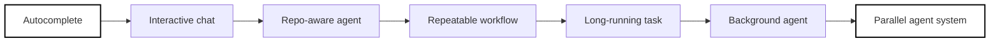
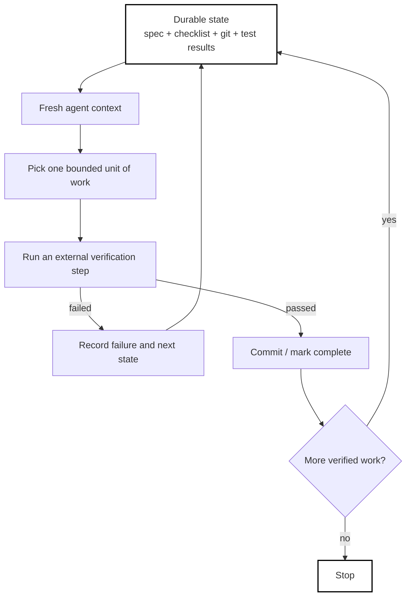
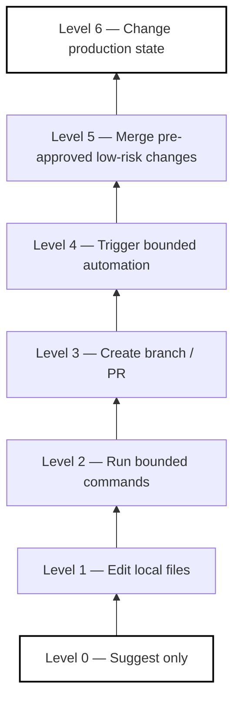

# AI Coding Loops: What's Real, What's Hype

*A practical guide to how much autonomy actually makes sense — and when.*

> **Updated for the 2026 reality:** coding agents can now work locally, in isolated cloud environments, across pull requests, and in parallel. The hard problem is no longer merely *“can the model write code?”* It is *“can the surrounding system keep the work correct, bounded, reviewable, and useful?”*

---

## The one idea that matters

AI coding has moved through several overlapping stages:

**autocomplete → chat → repo-aware agent → repeatable workflow → long-running task → background agent → parallel agent system**



Every step increases leverage. It also increases the amount of work that can go wrong before a human notices.

That is why the most useful question is not:

> *“What is the most advanced agent setup I can build?”*

It is:

> **What is the smallest amount of autonomy that reliably solves this problem?**

A senior engineer does not use Kubernetes for a shell script. The same principle should apply to AI coding. Do not build a fleet of agents when one well-instructed agent, a good test suite, and a human reviewer are enough.

---

## First, separate four problems that are often mixed together

When an AI coding setup feels unreliable, people often respond with a longer prompt. That works only when the prompt was actually the problem.

| Layer | What it controls | Typical failure | Better fix | Concrete example |
|---|---|---|---|---|
| **Prompt engineering** | What you are asking for | The agent solves the wrong problem | Clarify outcome and constraints | “Fix the timeout” becomes “Find why SSE connections drop after 60 seconds; preserve the public API; add a regression test.” |
| **Context engineering** | What the agent can see | It lacks a critical fact or sees too much noise | Curate relevant files, docs, history, logs | Give the agent the WebFlux config, proxy timeout config, failing logs, and architecture note — not the entire company wiki. |
| **Harness engineering** | What surrounds the model | The same bad behavior repeats | Add tests, tools, isolation, policies, hooks, CI | A forbidden dependency is rejected automatically instead of being mentioned in every prompt. |
| **Loop engineering** | How work repeats without you | You manually keep saying “continue” | Persist state and automate the next bounded step | Re-run a fresh agent on the next failing migration item until the verified checklist is empty. |

Anthropic's context-engineering guidance makes the same broader point: context is finite and should be curated rather than maximized.[1] OpenAI's 2026 account of building an agent-first codebase similarly emphasizes making the repository itself legible to agents through durable documentation and structure.[9]

### A useful diagnostic

```text
Agent misunderstood the task        → prompt problem
Agent did not know an important fact → context problem
Agent repeats a detectable mistake   → harness problem
You keep manually saying “next”      → loop problem
Many independent tasks are queued    → orchestration may help
```

Do not jump to the last line before fixing the first four.

---

# The Five Loops

These are not five maturity levels where everyone should eventually reach Level 5. They are different operating modes for different kinds of work.

---

## 1. Inner Loop — the pair programmer

```text
ask → inspect → edit → run → observe → adjust
```

You stay in the loop. The agent can inspect the repository, edit files, run commands, and explain what it found, but the task is still being shaped interactively.

### Best for

- ambiguous bugs;
- architecture decisions;
- unfamiliar code;
- exploratory refactoring;
- features whose requirements are still changing.

### Real-world example

You are debugging an intermittent Spring WebFlux SSE disconnect.

A useful inner loop might be:

1. ask the agent to trace the request path;
2. inspect the load balancer, ingress, application, and client timeout settings;
3. reproduce the disconnect locally or in a lower environment;
4. change one thing;
5. run a targeted test;
6. inspect the result together.

This is a poor candidate for full autonomy at the beginning because the real problem may be architectural, environmental, or even outside the repository.

### Where people misuse it

They keep one conversation alive for hours or days and assume the agent has perfect memory of every earlier decision.

Long conversations can accumulate stale assumptions, compressed context, abandoned plans, and contradictory instructions. The exact point at which quality degrades is **model-, task-, and harness-dependent**; there is no universal “100k or 150k token cliff.” The practical lesson is simpler:

> **Do not treat a conversation transcript as your system of record.**

Put important decisions in the repository, issue, spec, plan, test, or progress file.

### Rule

> **Start here. Do not automate a workflow you do not yet understand manually.**

---

## 2. Ralph Loop — fresh context, durable work state

The Ralph pattern, popularized by Geoffrey Huntley, is deliberately simple: repeatedly give an agent a bounded goal, let it work, preserve the work externally, and start again with fresh context.[5]

Anthropic later shipped a Ralph Wiggum plugin in the Claude Code repository, which is useful evidence that the pattern moved from community technique into mainstream agent tooling.[4]

The important idea is not the Bash loop itself:

> **The conversation is disposable. The work state is durable.**



### Real-world example: framework migration

Imagine a service with 70 usages of a deprecated API.

A good loop does **not** say:

> “Upgrade the whole application. Keep trying until done.”

A better setup is:

```text
Goal: eliminate deprecated API X without changing externally observable behavior.

Durable state:
- migration-plan.md
- list of remaining usages
- git history
- build/test output

One iteration:
1. select one coherent module;
2. migrate it;
3. compile;
4. run affected tests;
5. record what changed;
6. commit only if verification passes;
7. exit.
```

The next agent does not need the previous agent's entire conversation. It needs the repository, the migration contract, and the latest verified state.

### Good fits

- repetitive dependency migrations;
- converting test suites one package at a time;
- eliminating a deprecated API;
- fixing a sequence of mechanically detectable failures;
- applying a well-specified change across many independent files.

Anthropic's long-running-agent work uses a closely related principle: agents perform bounded pieces of work while durable artifacts carry state across sessions.[2][3]

### Bad fits

- “improve the architecture”;
- “make the UX better”;
- “keep refactoring until the code is clean”;
- “optimize performance” without a benchmark and target;
- any task where success is mostly subjective.

### The biggest trap

A completion string such as:

```text
<promise>DONE</promise>
```

is not evidence of completion. It is evidence that the model emitted a string.

**Real completion evidence is external:**

- tests pass;
- the build succeeds;
- the API compatibility check passes;
- the benchmark reaches the target;
- the security scanner is clean;
- a human accepts a subjective result.

### Practical tool reality

A Ralph-style workflow can be assembled from several current tools:

- Anthropic's Ralph Wiggum plugin for Claude Code;[4]
- GitHub Spec Kit for durable specifications and structured implementation plans;[6]
- Git worktrees for isolated parallel branches;
- CI, build tools, test runners, and static analysis as the real completion oracle.

The tool is optional. **Durable state plus external verification is the pattern.**

---

## 3. Software Machine — issue in, reviewed change out

This is the workflow many people actually mean when they say “background coding agent.”

```text
issue / task
    ↓
isolated environment
    ↓
agent plans and edits
    ↓
build + tests + lint + security checks
    ↓
branch / pull request
    ↓
human review
```

By 2026 this is no longer hypothetical. GitHub's Copilot cloud agent can take on work in a cloud environment and produce changes for review; the product evolved beyond the original “coding agent” pull-request-only framing.[7] OpenAI Codex likewise runs coding tasks in isolated environments and supports parallel work.[8]

### Real-world example: routine maintenance issue

A team creates an issue:

> Upgrade library `X` to the approved version. Do not change public APIs. Update tests and documentation. Run the service test suite. Open a PR with risks and rollback notes.

This is a much better background-agent task than:

> Redesign our authorization architecture.

Why? The maintenance task has:

- a defined scope;
- a small blast radius;
- an observable diff;
- testable completion;
- a natural review boundary.

### Best for

- dependency updates;
- small bug fixes with reproduction tests;
- mechanical documentation updates;
- adding missing tests around known behavior;
- low-risk refactors with clear invariants;
- routine issue-to-PR work.

### What changes organizationally

The bottleneck moves.

Before:

```text
not enough implementation capacity
```

After:

```text
too much generated work to understand, review, integrate, and own
```

So “number of PRs created” is a weak success metric.

Better metrics include:

- accepted and merged change rate;
- time-to-review;
- reviewer effort;
- escaped defects;
- rollback rate;
- rework after merge;
- percentage of agent work that is discarded.

### Hard truth

> **Generating code faster does not automatically make the engineering system faster.**

You can create a local maximum — more patches — while making the organization slower through review debt.

---

## 4. System / Orchestration Loop — parallelize only what is actually separable

“Multi-agent” is often discussed as though five agents must be better than one. In practice, parallelism helps only when the work graph allows it.

There are two different ideas here.

### A. Multi-agent orchestration — real and increasingly practical

Break a large goal into independent work items, give agents isolated workspaces, persist task state, and integrate results deliberately.

Current examples include:

- Codex workflows that run multiple agents in parallel;[8]
- Claude Code subagents and worktree isolation;[15]
- Gas Town, which coordinates multiple coding agents while persisting work state;[12]
- Anthropic's large-scale experiment using 16 agents and nearly 2,000 sessions to build a Rust-based C compiler capable of compiling Linux across multiple architectures.[13]

That last example is impressive — and also a warning. Anthropic reports roughly **$20,000 in API cost** for the experiment.[13] Multi-agent scale can buy capability, but it can also buy enormous coordination and compute cost.

### Real-world example: compatibility matrix

Suppose you maintain an SDK across:

- Java 17, 21, and 25;
- three database versions;
- Linux and Windows;
- multiple framework versions.

Parallel agents can independently:

1. run the same upgrade against different compatibility targets;
2. collect failures;
3. propose target-specific fixes;
4. hand results to an integration agent or human.

This is naturally parallel.

By contrast, asking six agents to independently redesign the same shared domain model can create merge conflicts, duplicated reasoning, and incompatible assumptions.

### B. Self-improving meta-systems — promising, but much easier to fake

This is the idea that an agent studies its own failures and automatically rewrites prompts, tools, or harness rules.

That can work only when the feedback signal is meaningful.

```text
bad eval → bad optimization
weak proxy metric → sophisticated gaming of the proxy
```

Anthropic's agent-evaluation guidance explicitly treats the model and harness together as the system being evaluated.[14] That is the right mental model: do not “self-improve” a prompt against a toy metric and assume the production system improved.

### The orchestration rule

> **Parallelize independent work, not uncertainty.**

A ten-agent dashboard can still be coordination theater.

---

## 5. Oversight Loop — autonomy is a permission design problem

The last loop is not another agent. It is the mechanism by which humans decide what the agent may do without asking.



The mistake is to treat this as a maturity ladder that must always move upward.

A mature organization may intentionally keep some work at Level 2 forever.

### Real-world example

Consider these two automations:

**A. Update generated API documentation**

- isolated branch;
- deterministic generator;
- snapshot diff;
- no runtime behavior change.

This may eventually be safe to auto-merge.

**B. Modify production IAM policies**

- high blast radius;
- security-sensitive;
- potentially irreversible consequences.

Even a more capable model does not make the second task equivalent to the first.

### What should increase with autonomy

| More agent freedom | Requires more... |
|---|---|
| More commands | sandboxing and allow/deny policies |
| Longer runs | durable state and checkpoints |
| More parallelism | ownership and integration discipline |
| More write access | auditability and rollback |
| More production access | explicit approval and blast-radius controls |

Claude Code's hooks, subagents/worktrees, and dev-container guidance are examples of the surrounding control surface becoming as important as the model itself.[15][16][17]

> **Capability should not silently become permission.**

---

# A practical real-world map

Use the smallest loop that fits the work.

| Task | Recommended mode | Why |
|---|---|---|
| Understand an unfamiliar code path | Inner loop | High uncertainty; human questions matter |
| Diagnose a production-only bug | Inner loop + tools | Evidence is fragmented and environment-specific |
| Replace a deprecated API across 80 files | Ralph-style loop | Repetitive, stateful, mechanically verifiable |
| Upgrade a low-risk dependency | Software machine | Clear issue-to-PR boundary |
| Add tests for a known bug | Software machine | Strong completion oracle |
| Run a compatibility matrix | Parallel agents | Work is naturally separable |
| Redesign a core domain model | Human-led inner loop | Ambiguity and long-term trade-offs dominate |
| Reformat 2,000 files | Script first, agent second | Deterministic automation beats probabilistic automation |
| Tune latency | Inner loop until benchmark is trustworthy, then bounded loop | The oracle must exist before autonomy |
| Change production security policy | Human approval even if an agent prepares the change | High blast radius |

The most overlooked row is this one:

> **If a normal script can solve the problem deterministically, use the script.**

An LLM loop is not automatically an upgrade over ordinary software.

---

# The strategic shift: from prompt craft to environment design

The most important evolution in AI coding is not that prompts stopped mattering. It is that the prompt is becoming one component in a larger execution system.

A production-quality coding environment for agents increasingly includes:

```text
Repository instructions      AGENTS.md / CLAUDE.md / project docs
Task contract                issue / spec / acceptance criteria
Context sources              code, docs, logs, architecture decisions
Execution environment        local shell / devcontainer / cloud sandbox
Tools                        build, test, browser, database, MCP, APIs
Policy                       allowed commands, secrets rules, network access
Verification                 unit, integration, contract, lint, security, benchmarks
Durable state                git, plan files, task tracker, checkpoints
Observability                logs, traces, cost, tool calls, failure history
Human boundary               review, approval, merge, production access
```

This is why **harness engineering** has become such an important term. OpenAI describes the harness as the surrounding system that lets the model inspect, act, and verify; Anthropic likewise evaluates the model and harness as a combined agent system.[10][14]

The model matters enormously. But a stronger model inside a weak environment can still produce unreliable engineering.

---

# Verification engineering is becoming more valuable than generation

When code generation becomes cheap, the scarce capability shifts toward deciding whether the generated change is actually good.

That requires better oracles.

### Weak oracle

```text
The agent says the task is complete.
```

### Better oracle

```text
The test suite passes.
```

### Stronger oracle

```text
The regression test fails before the fix and passes after it.
The public contract is unchanged.
The relevant integration tests pass.
The performance budget is met.
The diff is within the allowed scope.
```

The strongest coding loop is usually not the one with the cleverest prompt.

> **It is the one with the best independent way to detect wrong work.**

---

# What real productivity evidence says: there is no universal speedup number

AI coding discussions often use a single productivity percentage as though it applies to every engineer and every task. Real evidence is messier.

A Google randomized controlled trial on a complex enterprise task estimated roughly a **21% reduction in task time**, while explicitly warning that results may not generalize to all tools and settings.[20]

A 2025 METR randomized study of experienced open-source developers working in repositories they already knew found that then-current AI tools made participants **19% slower** in that setting. METR now labels those early-2025 results as outdated for current model capability, but the study remains useful because it showed how easily perceived speedup and measured speedup can diverge.[19]

By early 2026, a separate METR survey of 349 technical workers found large **self-reported** gains in the value of work produced with AI, while also warning readers to be skeptical of the exact magnitude.[18]

The practical conclusion is not “AI is fast” or “AI is slow.” It is:

> **AI changes the economics differently depending on task shape, developer familiarity, verification cost, parallelism, and the quality of the harness.**

For your team, measure:

```text
lead time
+ review time
+ rework
+ defects
+ operational incidents
+ human attention consumed
```

Do not measure only how quickly the agent produced a diff.

---

# Before You Build a Loop, Ask

1. **Does this happen often enough to be worth automating?**
2. **Is the outcome actually clear, or am I automating ambiguity?**
3. **Can wrong output be detected independently?**
4. **Is the verifier harder to fool than the task is to complete?**
5. **Can the agent finish a bounded unit end-to-end?**
6. **Does progress survive outside the conversation?**
7. **Is the environment isolated enough for the permissions granted?**
8. **Can I stop, inspect, and roll back the work?**
9. **Will parallelism reduce elapsed time, or only create integration work?**
10. **Does the economics still work after review and rework are counted?**

If the answer to the verification, state, or containment questions is “no,” adding a longer loop usually makes the system worse.

---

# Where This Is Actually Heading

## 1. The repository becomes part of the agent interface

Architectural decisions hidden in Slack, tribal knowledge, or one person's head are invisible to an agent — and often to new engineers too.

Agent-friendly repositories will increasingly make important knowledge discoverable through:

- concise instructions;
- architecture decision records;
- executable tests;
- reproducible environments;
- clear module boundaries;
- machine-checkable policies.

OpenAI's harness-engineering experience explicitly describes optimizing a repository for agent legibility in much the same way teams optimize it for new engineers.[9]

**Human implication:** making a codebase easier for agents often forces the organization to clean up knowledge that humans were also struggling to find.

---

## 2. The harness becomes a competitive engineering asset

The same frontier model can perform very differently depending on:

- available tools;
- repository instructions;
- sandbox quality;
- feedback speed;
- test quality;
- state persistence;
- permissions;
- observability.

That means companies may gain more from improving their internal software delivery environment than from constantly switching models.

**Human implication:** platform engineering, developer experience, testing, and documentation become more strategically important — not less.

---

## 3. Human work moves upward, but not completely out

Routine implementation can increasingly move into background execution.

Human attention shifts toward:

- deciding what should be built;
- defining invariants and acceptance criteria;
- architecture and trade-offs;
- reviewing unexpected behavior;
- handling exceptions;
- deciding risk and permissions;
- owning the result after deployment.

The engineer's job is not simply becoming “write prompts.” A better description is:

> **design the work, design the evidence, and decide the boundary of delegation.**

---

## 4. Multi-agent systems remain selective

Anthropic's 16-agent compiler experiment shows that large-scale agent collaboration can achieve things a single short session cannot.[13]

But the cost and orchestration burden also show why this will not be the default for every ticket.

For most everyday engineering tasks:

> **one capable agent + good context + strong tools + strong verification**

will beat:

> **many weakly coordinated agents generating overlapping work.**

The winning system is not the one with the most agents.

It is the one that needs the **least coordination to produce verified useful change**.

---

## 5. Autonomy will become more policy-driven

The long-term direction is not simply “agents get full access.”

It is more likely:

```text
low-risk task  → broad automatic permission
medium-risk    → bounded tools + mandatory checks
high-risk      → agent prepares, human approves
critical-risk  → strong separation of duties
```

As managed-agent infrastructure matures, the separation between the model's reasoning and the execution environment becomes more explicit.[11]

**Human implication:** the future of agentic coding looks as much like security engineering and workflow design as it does like prompting.

---

# The practical maturity path

Do not begin with multi-agent orchestration.

A healthier evolution is:

```text
1. Use an agent interactively.
2. Notice repeated instructions.
3. Move durable rules into the repository.
4. Add deterministic verification.
5. Automate one bounded repeatable task.
6. Run it in isolation.
7. Measure review and failure cost.
8. Only then add longer-running or parallel execution.
```

This path matters because every stage exposes what the next stage needs.

You discover the prompt by doing the task.
You discover the context by seeing what was missing.
You discover the harness by seeing repeated failures.
You discover the loop only after the workflow becomes stable.

---

# The Takeaway

AI coding is moving from:

> *“Help me write this code.”*

Toward:

> *“Here is the outcome, the environment, the evidence required, the durable state, and the boundary within which you may work.”*

That is a real shift.

But the hype cycle encourages people to solve every problem with the newest abstraction.

Use the simpler diagnosis:

```text
Unclear request       → improve the prompt
Missing knowledge      → improve the context
Repeated mistakes      → improve the harness
Repeated manual work   → add a bounded loop
Independent queued work→ consider parallel agents
Growing autonomy       → strengthen isolation, policy, evidence, and oversight
Deterministic problem  → use ordinary software instead
```

**Do not maximize autonomy. Maximize reliable leverage.**

The best system is not the one that runs the longest without a human.

It is the one that produces the most **verified, useful change** with the least wasted human attention and the smallest acceptable risk.

---

# See also

Related guides in this repository:

- [Ralph Wiggum Loops & Ralph Mode](../frameworks/Ralph-Wiggum-Loops-%26-Ralph-Mode.md) — the original filesystem-as-memory loop pattern and its evolution into official Claude Code tooling.
- [AI Assisted Development Framework Guide](AI-Assisted-Development.md) — how SDD, UACF, and Claude Skills fit together for professional AI-assisted development.
- [Spec-Driven Development Frameworks](Spec-Driven-Development-Frameworks.md) — durable specifications, task contracts, and systematic planning for agent workflows.
- [Claude Code Review](../../LLMs/models/anthropic/Claude-Code-Review.md) — Anthropic's multi-agent code review feature and how it fits into the verification loop.

---

# References and further reading

1. Anthropic — [Effective context engineering for AI agents](https://www.anthropic.com/engineering/effective-context-engineering-for-ai-agents)
2. Anthropic — [Effective harnesses for long-running agents](https://www.anthropic.com/engineering/effective-harnesses-for-long-running-agents)
3. Anthropic — [Harness design for long-running application development](https://www.anthropic.com/engineering/harness-design-long-running-apps)
4. Anthropic / Claude Code — [Ralph Wiggum plugin](https://github.com/anthropics/claude-code/blob/main/plugins/ralph-wiggum/README.md)
5. Geoffrey Huntley — [Ralph Wiggum as a software engineer](https://ghuntley.com/ralph/)
6. GitHub — [Spec Kit](https://github.com/github/spec-kit)
7. GitHub — [Research, plan, and code with Copilot cloud agent](https://github.blog/changelog/2026-04-01-research-plan-and-code-with-copilot-cloud-agent/)
8. OpenAI — [Introducing Codex](https://openai.com/index/introducing-codex/)
9. OpenAI — [Harness engineering: leveraging Codex in an agent-first world](https://openai.com/index/harness-engineering/)
10. OpenAI — [Unrolling the Codex agent loop](https://openai.com/index/unrolling-the-codex-agent-loop/)
11. Anthropic — [Scaling Managed Agents: Decoupling the brain from the hands](https://www.anthropic.com/engineering/managed-agents)
12. Gas Town — [Multi-agent workspace manager](https://github.com/gastownhall/gastown)
13. Anthropic — [Building a C compiler with a team of parallel Claudes](https://www.anthropic.com/engineering/building-c-compiler)
14. Anthropic — [Demystifying evals for AI agents](https://www.anthropic.com/engineering/demystifying-evals-for-ai-agents)
15. Anthropic — [Claude Code subagents and worktree isolation](https://docs.anthropic.com/en/docs/claude-code/sub-agents)
16. Anthropic — [Claude Code hooks](https://docs.anthropic.com/en/docs/claude-code/hooks)
17. Anthropic — [Claude Code development containers](https://docs.anthropic.com/en/docs/claude-code/devcontainer)
18. METR — [Measuring the Self-Reported Impact of Early-2026 AI on Technical Worker Productivity](https://metr.org/blog/2026-05-11-ai-usage-survey/)
19. METR — [Measuring the Impact of Early-2025 AI on Experienced Open-Source Developer Productivity](https://metr.org/blog/2025-07-10-early-2025-ai-experienced-os-dev-study/)
20. Google researchers — [How much does AI impact development speed? An enterprise-based randomized controlled trial](https://arxiv.org/abs/2410.12944)

---

*Reference note: product capabilities and naming evolve quickly. The conceptual framework in this guide is intentionally tool-independent; the linked products are examples of how the patterns are being implemented as of July 2026.*

**Related:**
- [AI-Native-Development-2026-Specs-Context-Harnesses](AI-Native-Development-2026-Specs-Context-Harnesses.md) — deep dive into the harness architecture and context engineering patterns that enable these coding loops.
- [AI-Operating-Manual](AI-Operating-Manual.md) — practical context engineering, iterative refinement, and ROI tracking with verification time as the foundations for working loops.
- [Agent-Skills](../skills/Agent-Skills.md) — Skills as the reusable-procedure layer that pairs with the durable-state and harness principles argued for here.
