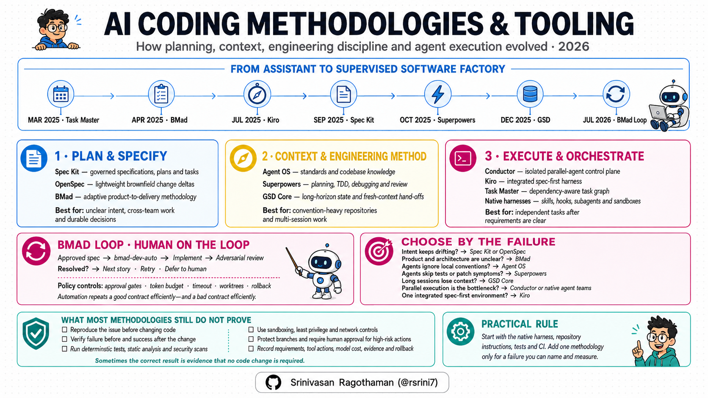
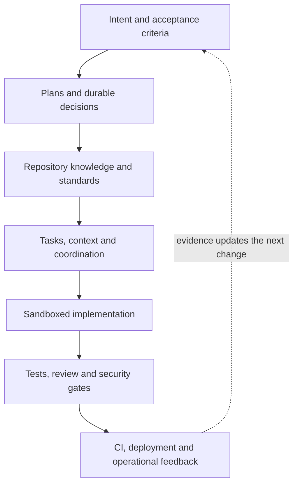
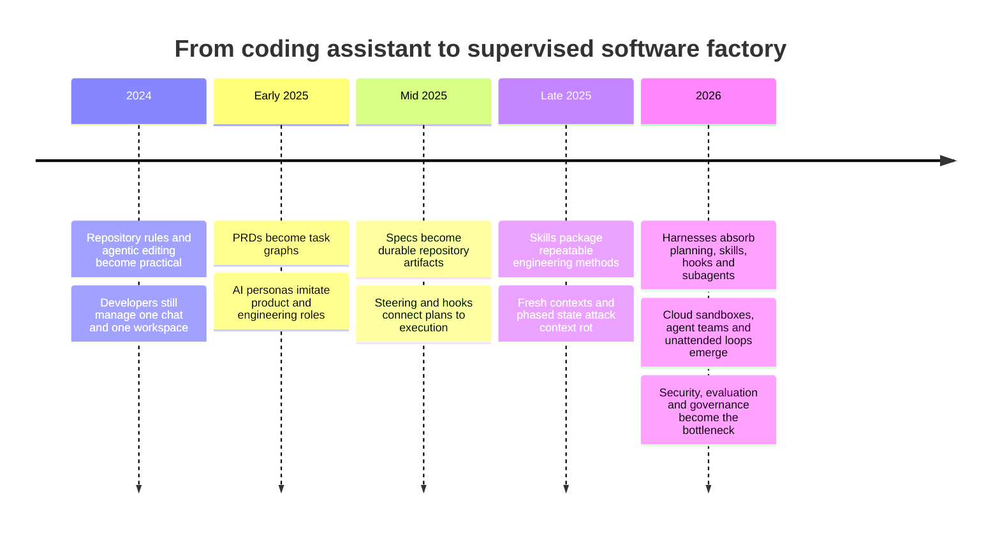
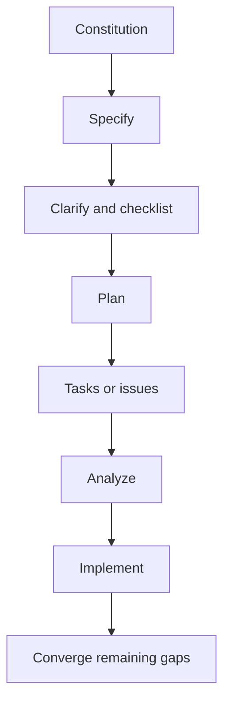
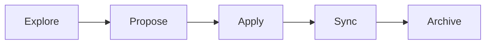
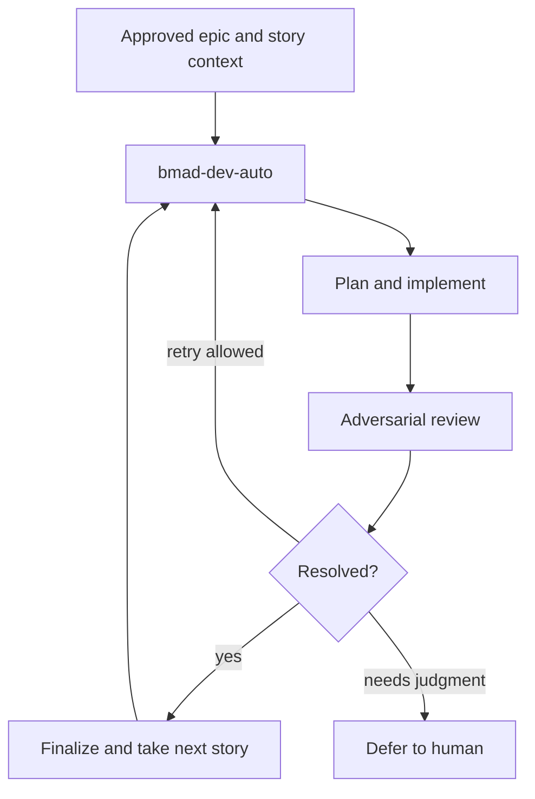
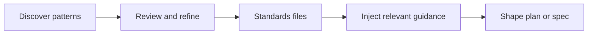
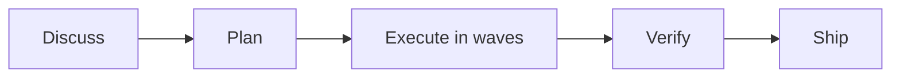
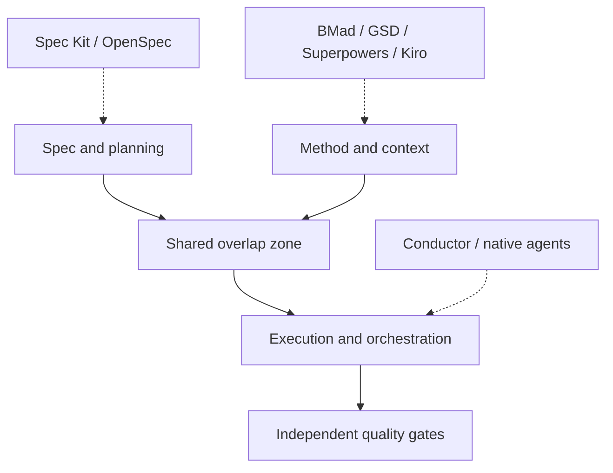

# AI Coding Frameworks in 2026: What Actually Matters

*A practical field guide to Spec Kit, OpenSpec, BMad, Agent OS, Superpowers, GSD Core, Conductor, Kiro, Task Master—and the increasingly capable agent harnesses underneath them.*

> **Research snapshot:** 4 August 2026. This market changes weekly. Versions, integrations and repository counts below are a dated snapshot; the architectural distinctions are more durable.

---

## The short answer

There is no single winner because these products no longer belong to one clean category.

- **GitHub Spec Kit** is the strongest mainstream, portable **specification toolkit**.
- **OpenSpec** is the cleaner default for **incremental brownfield change** with less ceremony.
- **BMad** is the broadest **end-to-end development method**, now more adaptive than its old “AI agile team” reputation suggests.
- **Agent OS** is primarily a **standards and codebase-knowledge layer**.
- **Superpowers** is the most visible **engineering-methodology and skills layer**, but it also overlaps with planning.
- **GSD Core** is a **long-horizon context and phase-management system**. The famous original repository is archived; active development moved.
- **Conductor** is an **agent execution control plane**, not a requirements framework—and it is no longer merely a local macOS worktree app.
- **Kiro** is a useful example of a **spec-first harness** where specs, steering, hooks, permissions and execution are native to one product.
- **Task Master** is a narrower **task graph and decomposition layer**.

The bigger story is that the underlying harnesses—Codex, Claude Code, GitHub Copilot, Kiro, Cursor, Gemini and others—are absorbing plan mode, persistent instructions, skills, hooks, subagents, agent teams, sandboxes and cloud execution. A third-party framework now has to add more than a folder of prompts to remain valuable.

My practical conclusion is simple:

> Start with the native harness, repository instructions, tests and CI. Add one framework only for a failure you can name and measure.

---

## 1. The problem is larger than “vibe coding”

The original generation of AI coding workflows focused on one failure: the agent started coding before developer and agent agreed on the requirement.

That still matters, but production use exposes a longer chain of failure:

| Failure | What it looks like in real work | Layer that should address it |
|---|---|---|
| **Intent loss** | The solution is polished but solves the wrong problem | Requirements and acceptance criteria |
| **Design drift** | Code no longer matches the approved architecture | Spec-to-plan traceability |
| **Context loss** | A long session forgets constraints or repeats work | Durable state and fresh-context hand-offs |
| **Convention drift** | The agent ignores local patterns and team standards | Repository instructions and standards |
| **Execution sloppiness** | It skips reproduction, tests, review or root-cause analysis | Engineering method and deterministic gates |
| **Coordination failure** | Parallel agents edit overlapping areas or create merge debt | Task ownership and orchestration |
| **False confidence** | Visible tests pass, but the actual behaviour is wrong | Independent verification and evaluation |
| **Unsafe autonomy** | A tool, hook or untrusted instruction causes harmful action | Permissions, sandboxing and supply-chain controls |
| **No operational evidence** | Nobody can explain cost, failures, interventions or rollback | Observability and governance |

This is why a flat feature table is misleading. The more useful picture is a stack.

The frameworks in this article cover different slices of that loop. None covers it all equally well.

---

## 2. The landscape at a glance

| Tool | What it is today | Primary job | Natural fit | Main caution |
|---|---|---|---|---|
| **[GitHub Spec Kit](https://github.com/github/spec-kit)** | Portable SDD toolkit with commands, skills, extensions, presets and bundles | Turn intent into governed specs, plans and tasks | Larger or governed features; teams wanting explicit artifacts | More ceremony and generated Markdown to review |
| **[OpenSpec](https://github.com/Fission-AI/OpenSpec)** | Lightweight, tool-agnostic change-spec workflow | Describe, apply, sync and archive deltas | Existing codebases and frequent incremental changes | A delta is only as safe as the understood baseline |
| **[BMad](https://github.com/bmad-code-org/BMAD-METHOD)** | Adaptive end-to-end delivery method with optional specialist modules | Clarify, plan, build, review and learn | Complex initiatives needing guided product, architecture and test perspectives | Broad surface area, installation and workflow learning |
| **[Agent OS](https://buildermethods.com/agent-os)** | Standards discovery, injection and spec shaping | Preserve local conventions and product context | Mature or legacy codebases with strong house style | Standards can document existing inconsistency unless curated |
| **[Superpowers](https://github.com/obra/superpowers)** | Composable agent skills forming a software-development method | Brainstorm, plan, use TDD, debug and review systematically | Developers wanting stronger execution discipline | Overlaps with spec tools; rigid TDD is not universal |
| **[GSD Core](https://github.com/open-gsd/gsd-core)** | Phase-based context-engineering and SDD system | Keep long work coherent across fresh subagent contexts | Multi-session or long-horizon work | Active lineage changed; still a substantial workflow layer |
| **[Conductor](https://www.conductor.build/)** | Local/cloud control plane for multiple first-party coding agents | Run isolated agents in parallel and review their work | Teams with several independent, well-shaped tasks | Parallelism multiplies cost and merge/review load |
| **[Kiro](https://kiro.dev/docs/specs/)** | Spec-first commercial coding harness | Keep requirements, design, tasks, steering and hooks together | Teams wanting one integrated environment | More platform coupling than portable Markdown toolkits |
| **[Task Master](https://github.com/eyaltoledano/claude-task-master)** | AI task manager exposed through CLI/MCP | Convert a PRD into dependency-aware tasks | Work that mainly needs decomposition and tracking | Not a complete quality or governance system; restrictive Commons Clause |

Two terms are worth separating:

- A **framework or method** shapes how work is described and performed.
- A **harness** is the execution environment that reads the repository, calls tools, edits files, runs commands, manages context and asks for approval.

Spec Kit can run *inside* Codex or Claude Code. Conductor can run several first-party agents. Kiro bundles the framework-like and harness-like layers. Comparing all three as if they were interchangeable products creates bad conclusions.

---

## 3. How we got here: the simple history

None of these projects invented specifications, agile planning, TDD, code review or parallel development. Software teams have used those ideas for decades. The new contribution was packaging them so an AI coding agent could repeatedly follow them inside a repository and across context windows.

The methodology evolved in five understandable steps:

### 3.1 Who created what, and when

Dates below mean the first public project or announcement I could verify—not the date an underlying engineering idea was invented.

| First public period | Tool | Created by | Original idea in simple terms | How it progressed |
|---|---|---|---|---|
| **March 2025** | **Task Master** | Eyal Toledano; the current project also prominently credits Ralph Ecom | “Give the agent a PRD and turn it into ordered, dependency-aware tasks.” | Grew from a Claude/Cursor task manager into a multi-tool CLI/MCP task layer with several model providers. |
| **6 April 2025** | **BMad v1** | [Brian “BMad” Madison](https://www.bmadcode.com/about/) | “Let specialist AI personas—PM, architect, developer—produce the artifacts an agile team would need.” | Moved through separated templates, orchestration, CLI installation and scale-adaptive workflows; v6 now offers Full Method, Quick Dev and BMad Loop. |
| **Mid-2025** | **Agent OS** | [Brian Casel / Builder Methods](https://buildermethods.com/agent-os) | “Give agents a repeatable product plan, spec process and team standards.” | v3 removed its own implementation orchestration and narrowed around standards discovery/injection plus spec shaping because harnesses had absorbed the rest. |
| **Mid-2025 experiments; 2025 launch** | **Conductor** | [Charlie Holtz and Jackson de Campos](https://www.ycombinator.com/companies/conductor), originally Melty Labs | “Stop cloning repositories by hand; give every coding agent an isolated workspace and one review UI.” | Expanded from a macOS parallel runner into multiplayer, API-driven cloud sandboxes running several first-party agent products. |
| **14 July 2025** | **Kiro** | AWS; announced by product lead Nikhil Swaminathan and Deepak Singh | “Put specs and hooks inside the IDE so prototypes can become maintainable systems.” | Expanded one spec-first harness across IDE, CLI and Web, with steering, skills, permissions and parallel tasks. |
| **2 September 2025** | **GitHub Spec Kit** | GitHub; introduced publicly by Den Delimarsky | “Make the specification the durable source of truth that drives plan, tasks and code.” | Added 30+ integrations, skills mode, quality commands, brownfield guidance, extensions, presets and role bundles. |
| **Late 2025** | **OpenSpec** | [Tabish Bidiwale / Fission AI](https://www.ycombinator.com/launches/Pdc-openspec-the-spec-framework-for-coding-agents) | “Treat requirement changes like pull requests: propose a delta, implement it, then merge it into living specs.” | Added richer exploration, synchronization, stores, customization and 30+ assistant integrations while retaining the lighter delta model. |
| **9 October 2025** | **Superpowers** | [Jesse Vincent (`obra`)](https://blog.fsck.com/2025/10/09/superpowers/) | “Turn one developer’s disciplined agent workflow into reusable, automatically triggered skills.” | Spread from Claude Code into many harness/plugin systems and matured into a complete planning, TDD, debugging and review method. |
| **14 December 2025** | **GSD** | TÂCHES | “Fight context rot by moving research, planning and execution into fresh contexts with written hand-offs.” | Grew extremely quickly, then the original repository was archived on 26 June 2026; the community-maintained line continues as Open GSD’s GSD Core. |
| **3 July 2026 in BMad v6.10** | **BMad Loop integration** | [Paul “pinkyD” Bean](https://github.com/bmad-code-org/bmad-loop), integrated with the BMad community | “Run the same spec → implement → adversarial-review cycle unattended, pausing only at configured gates.” | Replaced the experimental BMad Automator path and became an optional module driven by `bmad-dev-auto`. |

This order reveals why the products feel different. They are responses to successive bottlenecks:

1. **The agent needs work broken down** → Task Master.
2. **The agent needs product and architecture context** → early BMad and Agent OS.
3. **The team needs a durable contract, not chat history** → Kiro, Spec Kit and OpenSpec.
4. **The agent needs an engineering method** → Superpowers.
5. **Long work needs controlled context and hand-offs** → GSD.
6. **One good agent is not enough throughput** → Conductor, agent teams and cloud agents.
7. **Humans cannot watch every iteration** → BMad Loop and other unattended execution loops.
8. **Autonomy creates new risk** → sandboxing, evals, budgets, audit and human-on-the-loop governance.

### 3.2 The BMad progression in plain English

BMad has changed more visibly than most projects in this list, so reading an old v3 or v4 article can create the wrong picture of v6.

| Generation | Mental model | What improved | What still hurt |
|---|---|---|---|
| **v1 (April 2025)** | Several hard-coded agile personas produce planning documents | Made role separation and context-rich artifacts concrete | Rigid, difficult to customize and awkward outside greenfield work |
| **v2–v3** | Separate templates plus a unifying orchestrator | Easier reuse and a clearer journey across analyst, PM, architect and developer work | Manual hand-offs and a growing web of files/commands |
| **v4–v5** | Installable framework and ecosystem | Better IDE integration, modularity and broader use cases | Reputation for heavy ceremony and an intimidating number of agents/workflows |
| **v6** | One scale-adaptive method with optional specialist modules | Small work can use Quick Dev; complex work can use full planning; established repositories are first-class | Users still need to understand which path and modules own the work |
| **BMad Loop** | A supervised software production loop | Unattended story execution, adversarial review, retry/budget policy and configurable gates | Requires excellent specs, secure permissions and trust in the verification layer |

The evolution is therefore not “more and more agents.” It is:

> personas → reusable workflows → adaptive method → policy-controlled autonomous loop.

---

## 4. What changed materially in 2026

The first version of this article had the right instinct—separate the layers—but several product descriptions aged quickly.

### 4.1 Native harness capability is now the baseline

Modern harnesses already provide many primitives once supplied by community frameworks:

| Capability | Native examples in 2026 | What a framework must add now |
|---|---|---|
| Persistent repository guidance | Codex `AGENTS.md`, Claude `CLAUDE.md`, Kiro steering | Discovery, governance, scoping and maintainability |
| Reusable workflows | Open [Agent Skills](https://developers.openai.com/codex/build-skills), Claude skills, Copilot skills | A distinctive, tested method—not just prompt packaging |
| Planning | Plan modes and approval gates | Better elicitation, traceability and change control |
| Isolated reasoning | [Codex subagents](https://developers.openai.com/codex/agent-configuration/subagents), Claude subagents | Reliable hand-offs and measurable task boundaries |
| Multi-agent work | Claude agent teams, Codex parallel workflows, cloud agents | Ownership, conflict control and review ergonomics |
| Deterministic automation | Claude hooks, Kiro hooks, Copilot hooks, CI actions | Safe policies and auditable integration |
| Sandboxed execution | Codex sandboxes, Copilot ephemeral environments, Conductor microVMs | Least privilege, reproducibility and environment fidelity |

[Claude Code’s extension model](https://docs.anthropic.com/en/docs/claude-code/features-overview) now explicitly includes persistent context, skills, code intelligence, MCP, subagents, agent teams, hooks and plugins. Codex provides layered [`AGENTS.md`](https://developers.openai.com/codex/agent-configuration/agents-md), skills and subagents. GitHub’s cloud agent can research, plan, change a branch and work in an ephemeral GitHub Actions-powered environment. These are platform capabilities, not niche add-ons.

### 4.2 Skills are becoming portable executable methodology

Markdown instruction files are evolving into packages containing instructions, resources and scripts. The open Agent Skills convention is now supported across multiple ecosystems, including [GitHub Copilot](https://docs.github.com/en/copilot/concepts/agents/about-agent-skills) and Codex.

That is good for portability, but it changes the trust model. A skill is closer to a dependency than a blog post: it can influence tool use and may contain executable scripts. GitHub explicitly warns that third-party skills are not verified and can contain hidden instructions, prompt injection or malicious scripts. Review and pin them like code, not prose.

### 4.3 The market is converging on artifacts plus execution

Spec Kit added skills mode, extensions, presets, bundles, issue conversion and convergence checks. OpenSpec added a richer explore/propose/apply/sync/archive loop and beta stores. BMad added adaptive paths, established-codebase support and optional unattended loops. Kiro made specs, steering, hooks and parallel task execution native.

The old boundary—“frameworks plan, harnesses code”—is disappearing.

---

## 5. Deep dive: what each tool actually does

### 5.1 GitHub Spec Kit: the portable specification system

Spec Kit remains the clearest answer when a team wants specifications to be visible, reviewable and versioned in the repository. Its current official workflow includes more than the familiar four-step sequence.

The official project lists 30+ coding-agent integrations and supports slash commands or skills depending on the harness. It now also has community **extensions**, **presets** and **bundles**, so organisations can package role-specific or regulated workflows rather than forking the base templates.

The earlier “greenfield only” label is no longer fair. The project explicitly documents iterative enhancement and brownfield modernization. Still, its mental model is most comfortable when the team is willing to maintain a visible specification set.

**Where it wins**

- Strong artifact chain: principles → requirements → plan → tasks → implementation.
- Useful review points for architecture, security and compliance.
- Broad portability across harnesses.
- Good fit for cross-service changes where multiple teams need the same agreed intent.

**Where it can hurt**

- Markdown volume can become ceremony without improving decisions.
- Generated checklists are not evidence that requirements are correct.
- The spec, tests and code can diverge unless CI or a convergence practice detects it.
- Small maintenance work may not justify the full flow.

**Verdict:** the default serious SDD toolkit, but scale the process to the risk of the change.

### 5.2 OpenSpec: a change request for behaviour

OpenSpec’s strongest idea is the **delta**. A change gets its own proposal, specs, design and tasks; after implementation, the delta is synchronized and archived into the system’s durable specification set.

Its current quick path is:

This is more natural for an existing codebase than repeatedly restating the whole product. The project is also tool-agnostic, supports 30+ assistants and documents brownfield adoption directly. Version 1.7.0 was released on 29 July 2026, illustrating how quickly the product is evolving.

**Where it wins**

- Low ceremony for frequent, bounded changes.
- Requirements changes can be reviewed much like code changes.
- Artifacts can be edited out of sequence; the workflow is intentionally fluid.
- Less likely than a full-project specification to overwhelm routine work.

**Where it can hurt**

- A delta assumes the unchanged system is understood correctly.
- Poor codebase documentation can turn “lightweight” into “missing context.”
- Teams need a rule for conflicts between archived specs, runtime behaviour and tests.
- OpenSpec collects anonymous command/version telemetry by default, though it documents opt-out controls; enterprises should evaluate this with their normal tooling policy.

**Verdict:** the best general starting point for brownfield teams that genuinely want a spec layer but do not want a mini-SDLC for every ticket.

### 5.3 BMad v6: no longer just an AI org chart

The old shorthand for BMad was “19 agents pretending to be an agile team.” That describes its roots more than its current product.

The current BMad documentation emphasizes a **right-sized delivery path**: clear changes can go toward implementation quickly; larger initiatives can add product, architecture, UX and testing perspectives. It explicitly supports new and established codebases. Optional modules include BMad Builder, Creative Intelligence, Test Architect and BMad Loop.

Version 6.10.0, released 3 July 2026, added `bmad-loop`, an opt-in unattended development-loop orchestrator with adversarial review and deferred-work sweeps. That is a meaningful evolution from simulated roles toward executable delivery orchestration.

#### Full Method, Quick Dev and BMad Loop are different trust modes

Brian Madison’s current explanation is helpful: these are not simply “slow, medium and fast.” The real choice is how much planning uncertainty remains and where the human sits during execution.

| Flow | Use it when | Human role | What happens |
|---|---|---|---|
| **Full Method** | The product or architecture shape is still uncertain | **Human in every major planning/story loop** | PRD, architecture, epics and stories are developed before implementation; stories are reviewed as they progress |
| **Quick Dev** | The change is understood and a full artifact chain would cost more than the code | **Human approves the spec when risk warrants it** | One developer-agent flow plans, implements and runs adversarial review with fewer manual hand-offs |
| **BMad Loop** | Specs are strong enough for unattended story execution | **Human on the loop** | An external orchestrator repeatedly calls `bmad-dev-auto`, watches state, enforces policy and surfaces deferred decisions |

BMad Loop, created by community contributor Paul “pinkyD” Bean and integrated as an optional BMad module, is the supervisor around the unattended skill. Its policy can control gate mode, retry and timeout limits, token budget, worktree isolation, rollback and notifications. The documented gate modes range from no stop within an epic, to a pause per epic, to approval for every story spec.

That makes it closer to a policy-controlled software production line than a bigger prompt. It also explains the danger: the loop should not be asked to decide an unscoped product question. Automation can repeat a good contract efficiently; it can also repeat a bad contract efficiently.

At the 4 July 2026 project write-up, BMad Loop was still pre-1.0, used `tmux` as its execution backend and required WSL rather than native Windows. Treat its configuration and releases as moving interfaces, and keep branch protection plus external CI outside the loop.

**Where it wins**

- Broadest guided journey from ambiguous idea through reviewed implementation.
- Specialized perspectives are useful when the developer is also playing product owner and architect.
- Adaptive depth reduces, but does not remove, the old ceremony problem.
- Test Architect and adversarial review go beyond basic task generation.

**Where it can hurt**

- It spans so many layers that interaction with other frameworks can become confusing.
- Teams must learn which workflows and modules are required, optional or overlapping.
- More agent roles do not automatically create independent judgment; they can share the same blind spots.
- Unattended loops raise the standard for sandboxing, branch protection and review evidence.

**Verdict:** choose BMad when you want a coherent method across product, architecture, implementation and review—not merely because you want multiple personas.

### 5.4 Agent OS v3: preserve the reasoning behind the code

Agent OS made one of the smartest strategic pivots in this category. [Version 3](https://buildermethods.com/agent-os/migration), released in January 2026, stopped rebuilding features that harnesses already handle well. It now concentrates on discovering and injecting codebase standards, shaping specs and preserving product context.

That makes it especially relevant to legacy systems where the important knowledge is not “use camelCase.” It is “this service owns entitlement state,” “we never retry this operation,” or “this Oracle table is authoritative even though another cache is faster.”

**Where it wins**

- Captures conventions that code scanning alone may misinterpret.
- Complements native plan mode and portable spec tools.
- Helps make tacit architecture decisions explicit.
- Markdown output remains usable outside its Claude-first experience.

**Where it can hurt**

- Discovery can fossilize accidental patterns or technical debt as a “standard.”
- Standards need owners, scope, examples and expiry/review rules.
- Injection improves context; it does not prove compliance.

**Verdict:** valuable when a team’s unwritten rules are the real source of delivery risk. Human curation is the product, not the generated file.

### 5.5 Superpowers: engineering discipline packaged as skills

Superpowers is not merely a TDD add-on. Its official workflow starts with clarification and design, proceeds through an implementation plan, then uses worktrees, test-driven development, subagent execution, review, debugging and branch completion.

It currently documents installation across Claude Code, Codex App/CLI, Cursor, Gemini CLI, GitHub Copilot CLI, OpenCode and several other harnesses. That distribution—and its enormous repository popularity—makes it the most visible example of methodology delivered through portable skills.

**Where it wins**

- Turns good intentions such as “test first” and “review every task” into repeatable agent behaviour.
- Fresh-context reviewers can catch errors the implementing context rationalized away.
- Root-cause debugging and small-task execution reduce random patching.
- It can improve a native harness without imposing a separate project-management system.

**Where it can hurt**

- It overlaps with spec elicitation and planning in Spec Kit, OpenSpec, BMad and GSD.
- Strict red/green TDD is awkward for exploratory UI, data migration, infrastructure and legacy code with weak test seams.
- An agent following a method perfectly can still encode the wrong acceptance criteria.
- Auto-triggered skills require trust, version control and evaluation.

**Verdict:** an excellent execution discipline layer, provided the team adapts the method to the work and resolves overlap with its chosen spec system.

### 5.6 GSD Core: context engineering with a changed lineage

This needs a precise correction. The original [`gsd-build/get-shit-done`](https://github.com/gsd-build/get-shit-done) repository—with 64.8k stars at this snapshot—was archived on 26 June 2026. Its README directs users to [`open-gsd/gsd-core`](https://github.com/open-gsd/gsd-core), which is now the active project.

GSD Core’s current phase loop is:

Heavy research, planning and execution run in fresh-context subagents. Durable artifacts such as `STATE.md` and `CONTEXT.md` carry decisions between sessions. The active project supports multiple runtimes and reports a current 1.7.0 line.

**Where it wins**

- Explicitly treats context as a finite engineering resource.
- Durable state and phase boundaries support multi-session work.
- Verification and shipping are now first-class steps, not an afterthought.
- Parallel waves provide structure beyond “open several terminals.”

**Where it can hurt**

- Project migration means star counts, package names, documentation and trust history must not be conflated.
- Phase artifacts themselves can become stale or internally inconsistent.
- Parallel execution can still create shared-build, database and merge contention.
- Fresh context avoids bloat but can also omit nuance from earlier exploration.

**Verdict:** a strong fit for long-horizon work, but evaluate the maintained repository and its supply chain—not the archived project’s popularity.

### 5.7 Conductor: from local worktrees to a cloud control plane

Conductor used to be described accurately as a macOS UI for parallel Claude Code and Codex worktrees. That description is now incomplete.

As of version 0.78.0 on 30 July 2026, Conductor advertises:

- isolated cloud microVM sandboxes with repositories and dependencies pre-installed;
- multiplayer workspaces and real-time collaboration;
- desktop, mobile and API access;
- first-party Claude Code, Codex, Cursor and OpenCode agents under the hood;
- local and cloud execution paths.

**Where it wins**

- A strong visual and operational layer over multiple agent sessions.
- Isolation makes parallel work safer than sharing one working tree.
- Useful for comparing alternative implementations or delegating independent backlog items.
- Cloud environments reduce local setup and long-running laptop dependence.

**Where it can hurt**

- Parallelism is valuable only after tasks have clean ownership boundaries.
- More agents create more diffs, test runs, cost and human review demand.
- Separate workspaces do not solve semantic conflicts between features.
- Cloud execution changes data residency, credentials and network-policy questions.

**Verdict:** add orchestration after task quality becomes the bottleneck. It cannot rescue vague requirements or weak verification.

### 5.8 Kiro: what happens when spec-driven development becomes native

Kiro matters here because it shows where the category is going. Its current documentation exposes specs across IDE, CLI and Web, with feature specs, bug-fix specs, quick specs and parallel task execution. A normal feature spec contains `requirements.md`, `design.md` and `tasks.md`. Steering, hooks, skills, MCP and permissions live in the same environment.

**Where it wins**

- Less glue between specification, execution and automation.
- Bug-fix specs make reproduction and regression prevention explicit.
- Steering and hooks connect written intent to agent behaviour.
- Integrated parallel task execution reduces third-party orchestration needs.

**Where it can hurt**

- Portability is weaker than a tool-agnostic workflow designed around generic Markdown conventions.
- An integrated product can hide coupling between its formats and execution engine.
- Teams still need independent CI, security and operational evidence.

**Verdict:** attractive if the team wants an all-in-one spec-first harness. Less attractive if cross-harness portability is a hard requirement.

### 5.9 Task Master: useful decomposition without pretending to be an SDLC

Task Master remains narrower and easier to classify: it turns product requirements into a dependency-aware task graph and exposes the workflow through CLI/MCP and multiple editors or agents.

That is useful when planning exists but execution gets lost in a flat checklist. It does not replace acceptance tests, architectural decisions, review or deployment controls.

Its repository uses **MIT with Commons Clause**: source is available and normal use/modification is allowed, but offering Task Master itself as a hosted service or competing product is restricted. That distinction matters for enterprise reuse.

---

## 6. A comparison that reflects reality

| Dimension | Spec Kit | OpenSpec | BMad | Agent OS | Superpowers | GSD Core | Conductor | Kiro |
|---|---|---|---|---|---|---|---|---|
| **Primary layer** | Spec/governance | Change spec | End-to-end method | Standards/context | Engineering method | Context/phase delivery | Execution control plane | Integrated harness |
| **Best change shape** | Medium-large governed feature | Small-medium incremental change | Ambiguous or complex initiative | Any change in convention-heavy repo | Implementation needing discipline | Long multi-phase work | Several independent tasks | Feature or bug inside Kiro |
| **Brownfield fit** | Good, now documented | Excellent | Good, explicitly supported | Excellent | Good | Good via onboarding | Neutral | Good |
| **Durable artifacts** | Constitution, spec, plan, tasks | Proposal, delta specs, design, tasks, archive | Product/architecture/story/test artifacts | Standards, product and shaped specs | Designs, plans, commits and reviews | State, context, roadmap, plans | Workspaces, branches and diffs | Requirements, design, tasks, steering |
| **Execution included** | Yes, through host agent | Yes, through host agent | Yes | Relies on host agent | Yes, through skills/subagents | Yes, phased and parallel | Yes, runs first-party agents | Yes, native |
| **Deterministic quality gate** | Checklist/analyze, but CI still needed | Workflow checks, but CI still needed | Review/test modules, but CI still needed | No | TDD/review method, but CI still needed | Verify phase, but CI still needed | No inherent quality method | Hooks plus external CI |
| **Portability** | High | High | High-medium | Medium-high | High, harness-specific installs | High-medium | Agent-portable, platform-hosted | Lower |
| **Ceremony** | Medium-high | Low-medium | Adaptive, potentially high | Low-medium | Medium | Medium-high | Operational rather than documentary | Medium |
| **Open-source license** | MIT | MIT | MIT | MIT | MIT | MIT | Commercial product | Commercial product |

The most important row is the one absent from most product comparisons: **deterministic quality gate**. Every tool still needs real tests, static analysis, security scanning, build reproduction and human accountability around high-risk changes.

---

## 7. Where the tools genuinely overlap

The earlier advice to “pick one tool per layer” was directionally useful but too clean for the current market.

- **Spec Kit and OpenSpec** overlap heavily. Use one source of truth for a given change.
- **BMad and GSD Core** both manage planning, state, execution and verification. Combining them is usually redundant.
- **Superpowers** overlaps with spec elicitation, planning, worktrees, subagents and review. It is not automatically orthogonal to every spec framework.
- **Agent OS** composes more cleanly, but its spec-shaping features can still duplicate elicitation questions.
- **Conductor** is mostly orthogonal, yet GSD, BMad, Kiro and native harnesses already offer forms of parallelism.
- **Kiro** bundles several layers; adding a second full workflow may create two competing task and spec systems.

A stack is defensible only when each component has a named responsibility and one artifact owner.

### A simple compatibility contract

Before combining products, write down:

1. Which file is authoritative for requirements?
2. Which system owns task status?
3. Who may spawn parallel work?
4. Which process defines “done”?
5. Which tests and scans are mandatory outside the agent?
6. Which hooks, skills and MCP servers may execute code or access secrets?
7. How is cost, model choice and run history recorded?

If two tools answer the same question, the stack is probably too complicated.

---

## 8. The missing layer: proving the work is correct

Most frameworks are good at generating artifacts and encouraging good behaviour. Neither is proof.

A 2026 study, [FixedBench](https://arxiv.org/abs/2605.07769), tested whether coding agents would recognize 200 already-resolved issues where no code change was required. Across tested models and harnesses, agents still proposed undesirable code changes in **35% to 65%** of cases. Explicitly asking them to reproduce the problem helped, but also created new false-abstention behaviour on partially fixed issues.

That finding exposes a gap in nearly every workflow: agents are rewarded for producing a diff. Sometimes the correct output is evidence that no change is required.

The verification layer should therefore require evidence, not confidence:

| Claim | Minimum useful evidence |
|---|---|
| “The bug exists” | Reproduction on the pre-change revision |
| “The fix works” | The same reproduction fails before and passes after |
| “No regression” | Relevant unit, integration and contract tests |
| “The architecture is preserved” | Dependency/fitness rules or explicit review evidence |
| “Performance is acceptable” | Baseline and post-change measurement under a defined workload |
| “The change is secure” | SAST, dependency/secret scans and threat-relevant review |
| “No code change is needed” | Reproduction plus inspected version/history evidence |
| “The spec is complete” | Acceptance examples, edge cases and stakeholder approval—not word count |

Long-horizon benchmarks are also becoming harder because isolated bug-fix scores no longer represent product evolution. [SWE-EVO](https://arxiv.org/abs/2512.18470), for example, focuses on multi-file software evolution and preservation of existing behaviour. The practical lesson is to build a small internal evaluation set from your own recurring changes rather than choosing a framework by GitHub stars or a model by one public benchmark.

---

## 9. The other missing layer: security and operational control

Agent frameworks change the threat model because prompts can call tools, hooks can execute commands and parallel workers can hold credentials.

The 2026 [OWASP Top 10 for Agentic Applications](https://genai.owasp.org/resource/owasp-top-10-for-agentic-applications-for-2026/) highlights risks including prompt injection, tool misuse and data leakage. These are directly relevant to coding agents reading issues, dependency documentation, web pages, generated files and third-party skills.

Minimum production controls should include:

- **Least privilege:** separate read, write, network, secret and deployment authority.
- **Sandboxing:** run untrusted implementation and tests in a disposable environment.
- **Network allowlists:** prevent arbitrary exfiltration from agent sessions.
- **Human approval for irreversible actions:** production deploys, schema destruction, secret rotation and external communication.
- **Pinned and reviewed extensions:** skills, plugins, hooks, MCP servers and templates are supply-chain inputs.
- **Protected branches and mandatory CI:** an agent-authored commit receives no special trust.
- **Traceability:** record requirement, agent/harness, model, approvals, tool actions, test evidence and final reviewer.
- **Budget and loop limits:** autonomous retries require time, token and action ceilings.

Codex documents [sandbox, approval and network controls](https://developers.openai.com/codex/agent-approvals-security); Claude Code documents [permission and prompt-injection protections](https://docs.anthropic.com/en/docs/claude-code/security); GitHub documents both [cloud-agent risks](https://docs.github.com/en/copilot/concepts/agents/cloud-agent/risks-and-mitigations) and a default outbound firewall. A workflow framework should sit inside these controls, not replace them.

---

## 10. Who is actually leading?

Repository stars are a popularity signal, not enterprise adoption, successful delivery or code quality. With that warning, the 4 August 2026 public snapshot is still useful:

| Project | Public GitHub signal | What the signal does—and does not—say |
|---|---:|---|
| [Superpowers](https://github.com/obra/superpowers) | 266.2k stars / 23.8k forks | Extraordinary developer interest in skills-based engineering discipline; not proof of active production use |
| [GitHub Spec Kit](https://github.com/github/spec-kit) | 125.3k / 11.2k | Strongest portable SDD brand and vendor distribution |
| [OpenSpec](https://github.com/Fission-AI/OpenSpec) | 63.8k / 4.4k | Major momentum for lightweight, tool-agnostic change specs |
| [BMad](https://github.com/bmad-code-org/BMAD-METHOD) | 51.5k / 5.9k | Large community for a broad end-to-end method |
| [Task Master](https://github.com/eyaltoledano/claude-task-master) | 27.9k / 2.6k | Durable demand for decomposition and task graphs |
| [GSD Core](https://github.com/open-gsd/gsd-core) | 7.7k / 535 | Active successor; do not add the archived repository’s 64.8k stars as if they belong to one maintained project |
| [Agent OS](https://github.com/buildermethods/agent-os) | 5.2k / 813 | Smaller community, but a strategically important pivot toward standards |

There are four different kinds of leadership:

- **Portable spec layer:** Spec Kit leads in reach; OpenSpec is the strongest lightweight challenger.
- **Skills/methodology:** Superpowers leads public developer attention.
- **Full-process method:** BMad has the broadest integrated open method.
- **Distribution:** Native harness vendors are the real structural winners because plan, skills, subagents, hooks and cloud execution arrive with the product.

So, no framework “dominates AI coding.” The category itself is being compressed by harness capability.

---

## 11. Practical selection guide

### Use native capabilities only when

- the change fits comfortably in one session;
- the repository already has strong tests and clear instructions;
- one developer owns the change end to end;
- the cost of misunderstanding is low and reversible.

Start with `AGENTS.md`/`CLAUDE.md`/steering, plan approval, a small task list and CI. A framework is not mandatory maturity.

### Add OpenSpec when

- most work is incremental brownfield change;
- chat history is a poor requirements record;
- the team wants lightweight reviewable deltas;
- Spec Kit feels disproportionate to routine features.

### Add Spec Kit when

- work crosses services, teams or compliance boundaries;
- acceptance criteria and architectural constraints need a visible chain;
- team-specific presets and bundles are valuable;
- the feature is large enough to justify explicit quality gates.

### Choose BMad when

- the idea itself needs product and architecture discovery;
- one person needs several specialist perspectives;
- a coherent end-to-end method is preferable to composing multiple tools;
- the team will invest in learning and tailoring it.

### Add Agent OS when

- the codebase has important unwritten conventions;
- legacy architecture is easy for an agent to misread;
- the same standards must shape multiple tools and projects;
- humans will review and own the discovered standards.

### Add Superpowers when

- the agent jumps to code, skips tests or patches symptoms;
- task-level review and fresh-context execution would help;
- the team accepts the method’s planning/TDD assumptions or will tailor them;
- there is no competing execution methodology already in charge.

### Choose GSD Core when

- work spans many phases or sessions;
- context degradation is observable;
- phase state, hand-offs and parallel waves matter;
- the team has reviewed the active project’s packages and permissions.

### Add Conductor when

- several tasks are truly independent;
- reviewing agents is the bottleneck, not explaining the work;
- branches, sandboxes and merge ownership are already clear;
- cloud execution fits the organisation’s security policy.

### Choose Kiro when

- the team prefers one spec-first environment over a portable toolchain;
- native specs, steering, hooks and execution are more valuable than cross-harness freedom;
- product coupling is acceptable.

---

## 12. Sensible stacks—not maximal stacks

| Situation | Recommended starting stack | Why |
|---|---|---|
| **Solo developer, mature repository** | Native harness + repository instructions + CI; add OpenSpec only for non-trivial changes | Lowest coordination tax |
| **Enterprise brownfield microservices** | Native harness + curated standards + OpenSpec for routine deltas; Spec Kit for cross-service initiatives + contract/integration tests | Different change sizes need different ceremony, but one spec owner per change |
| **Regulated or high-impact delivery** | Spec Kit or BMad + protected CI + traceability + security review + human approval | Artifacts matter, but independent gates create evidence |
| **Long-running greenfield build** | GSD Core *or* BMad + deterministic tests and budget limits | Context/state management without stacking two full methods |
| **High-throughput parallel backlog** | One spec source + Conductor or native agent teams + ownership map + merge queue | Parallelism after decomposition |
| **Strong TDD engineering culture** | One light spec source + Superpowers + existing CI | Method reinforces an established practice |
| **Team committed to Kiro** | Kiro specs + steering + hooks + external CI/security | Use the integrated platform before adding duplicate frameworks |

For a complex Java/Spring/Quarkus platform, the hard part is rarely generating more tasks. It is preserving cross-service contracts, data ownership, non-functional requirements, rollout/rollback behaviour and operational evidence. Whichever framework is selected, encode those as executable contract tests, architecture fitness functions, migration checks and observability acceptance criteria.

---

## 13. A 30-day evaluation before standardising

Do not compare frameworks using a demo project. Use three representative repository tasks:

1. a small, well-understood bug;
2. a medium brownfield feature crossing several files;
3. a risky change involving compatibility, migration or performance.

Measure the complete system, not just generation speed:

| Measure | What to record |
|---|---|
| **Time to accepted change** | Human clarification + agent execution + review + rework |
| **First-pass correctness** | Acceptance tests passed before reviewer fixes |
| **Change precision** | Unrelated files, unnecessary abstractions and avoidable churn |
| **Review burden** | Human minutes and number of correction cycles |
| **Context durability** | Constraints retained across sessions and workers |
| **Cost** | Model usage, parallel runs and failed attempts |
| **Security interventions** | Approval requests, blocked network/tool actions, secret exposure |
| **Recovery** | Ability to resume, reproduce, roll back and explain failure |
| **Artifact value** | Whether specs and plans remain useful after merge |

Run the same tasks with the native harness baseline. If a framework does not measurably improve correctness, review time, recoverability or governance, it has added ritual rather than capability.

---

## 14. Final view

The most durable idea in spec-driven development is not a particular command or template. It is the separation of four truths:

1. **Intent truth:** what outcome and constraints humans approved.
2. **Implementation truth:** what the code actually does.
3. **Verification truth:** what independent tests and checks demonstrate.
4. **Operational truth:** what happens after the change meets real traffic, data and failure.

Frameworks mostly improve the first and help organise the second. Mature engineering still has to build the third and observe the fourth.

That is also the likely future of this market. Generic prompt bundles will be absorbed by harnesses. The products that remain valuable will provide at least one of these:

- domain-specific, versioned and testable workflows;
- reliable context and state across long-running work;
- secure multi-agent orchestration;
- measurable verification and governance;
- strong team-level knowledge management;
- portability across models and harnesses without losing semantics.

The winning workflow will not be the one with the most agents, Markdown or stars. It will be the smallest system that repeatedly turns intent into evidence-backed software without losing human control.

---

## Primary sources

All product claims were rechecked against first-party documentation or repositories on 4 August 2026.

- [GitHub Spec Kit repository and current command/reference surface](https://github.com/github/spec-kit)
- [GitHub’s 2 September 2025 Spec Kit introduction](https://github.blog/ai-and-ml/generative-ai/spec-driven-development-with-ai-get-started-with-a-new-open-source-toolkit/)
- [OpenSpec repository and documentation](https://github.com/Fission-AI/OpenSpec)
- [OpenSpec releases](https://github.com/Fission-AI/OpenSpec/releases)
- [OpenSpec founder and backstory](https://www.ycombinator.com/launches/Pdc-openspec-the-spec-framework-for-coding-agents)
- [BMad repository and module map](https://github.com/bmad-code-org/BMAD-METHOD)
- [BMad version history and April 2025 origin](https://github.com/bmad-code-org/BMAD-METHOD/blob/main/CHANGELOG.md)
- [BMad v6.10.0 release notes](https://github.com/bmad-code-org/BMAD-METHOD/releases/tag/v6.10.0)
- [BMad’s Full Method, Quick Dev and BMad Loop comparison](https://www.bmadcode.com/bmad-method-has-three-flows-now-heres-what-actually-changes-between-them/)
- [BMad Loop repository](https://github.com/bmad-code-org/bmad-loop)
- [Agent OS v3 migration and scope change](https://buildermethods.com/agent-os/migration)
- [Superpowers repository, workflow and supported harnesses](https://github.com/obra/superpowers)
- [Jesse Vincent’s October 2025 Superpowers launch post](https://blog.fsck.com/2025/10/09/superpowers/)
- [Archived original GSD repository](https://github.com/gsd-build/get-shit-done)
- [Active GSD Core repository](https://github.com/open-gsd/gsd-core)
- [Conductor product and July 2026 capability update](https://www.conductor.build/)
- [Conductor founders and original product history](https://www.ycombinator.com/companies/conductor)
- [Kiro’s 14 July 2025 introduction](https://kiro.dev/blog/introducing-kiro/)
- [Kiro specs documentation](https://kiro.dev/docs/specs/)
- [Kiro steering documentation](https://kiro.dev/docs/steering/)
- [Kiro hooks documentation](https://kiro.dev/docs/hooks/)
- [Task Master repository and license summary](https://github.com/eyaltoledano/claude-task-master)
- [Early Task Master issue history from March 2025](https://github.com/eyaltoledano/claude-task-master/issues/30)
- [Codex skills](https://developers.openai.com/codex/build-skills), [subagents](https://developers.openai.com/codex/agent-configuration/subagents), [`AGENTS.md`](https://developers.openai.com/codex/agent-configuration/agents-md) and [security controls](https://developers.openai.com/codex/agent-approvals-security)
- [Claude Code extension model](https://docs.anthropic.com/en/docs/claude-code/features-overview) and [security model](https://docs.anthropic.com/en/docs/claude-code/security)
- [GitHub Copilot cloud agent](https://docs.github.com/en/copilot/concepts/agents/cloud-agent/about-cloud-agent), [skills warning](https://docs.github.com/en/copilot/how-tos/copilot-on-github/customize-copilot/customize-cloud-agent/add-skills) and [risk mitigations](https://docs.github.com/en/copilot/concepts/agents/cloud-agent/risks-and-mitigations)
- [OWASP Top 10 for Agentic Applications 2026](https://genai.owasp.org/resource/owasp-top-10-for-agentic-applications-for-2026/)
- [FixedBench: Coding Agents Don’t Know When to Act](https://arxiv.org/abs/2605.07769)
- [SWE-EVO: Benchmarking Coding Agents in Long-Horizon Software Evolution](https://arxiv.org/abs/2512.18470)

---

**Related:**
- [AI-Native-Development-2026-Specs-Context-Harnesses](AI-Native-Development-2026-Specs-Context-Harnesses.md) — extends this framework comparison into context engineering, harnesses, verification, and Agent Experience.
- [Spec-Driven-Development-Frameworks](Spec-Driven-Development-Frameworks.md) — deeper treatment of the specification-driven frameworks compared here.
- [AI-Coding-Loops](AI-Coding-Loops.md) — practical guidance for matching coding-agent workflows to task complexity and autonomy.
- [Agent-Specs-vs-Rules-vs-Skills](../skills/Agent-Specs-vs-Rules-vs-Skills.md) — explains how specifications, repository rules, and reusable skills fit together.
