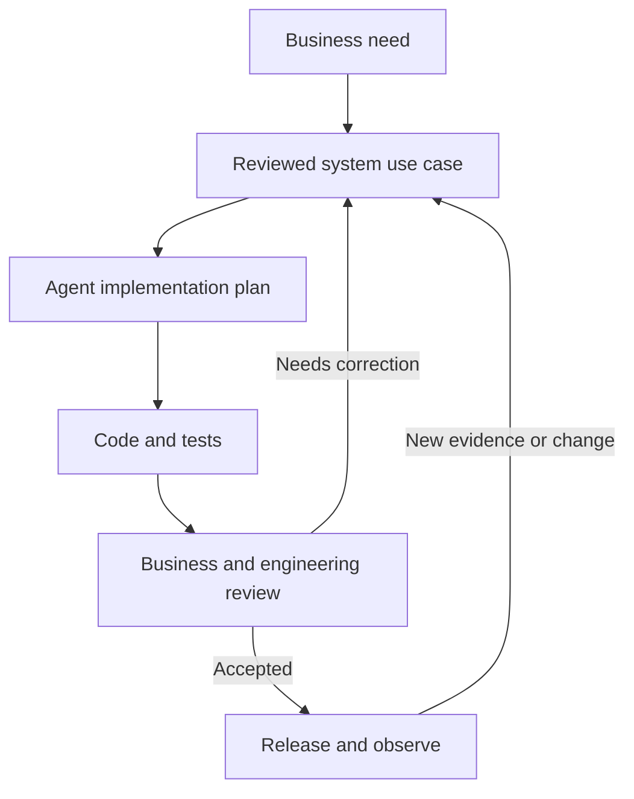
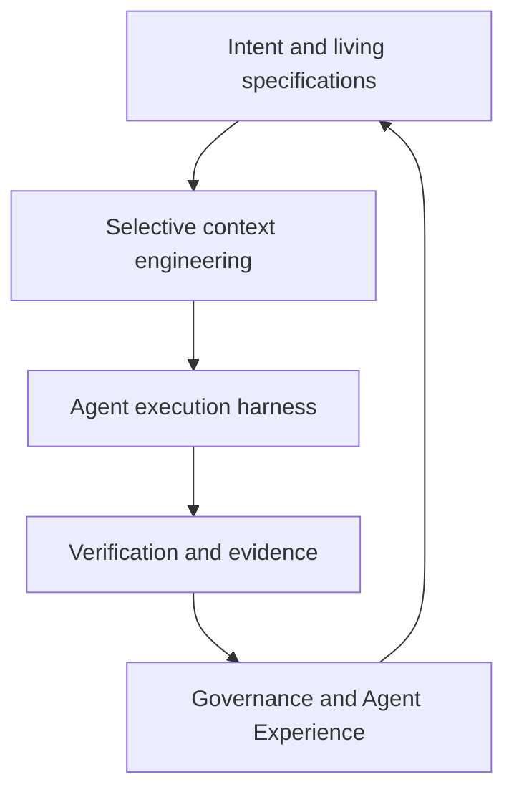
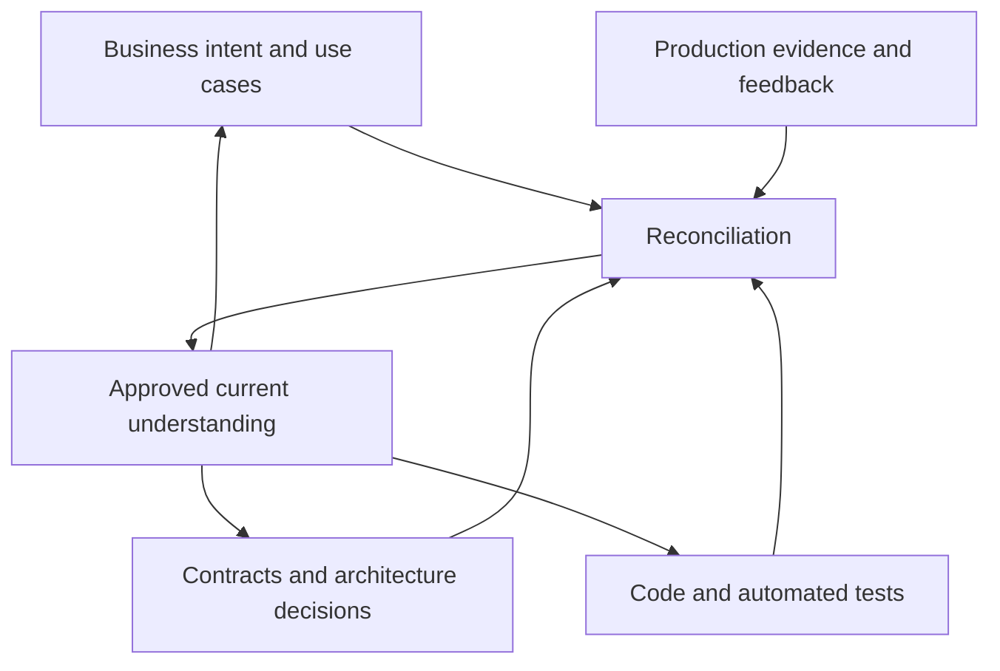
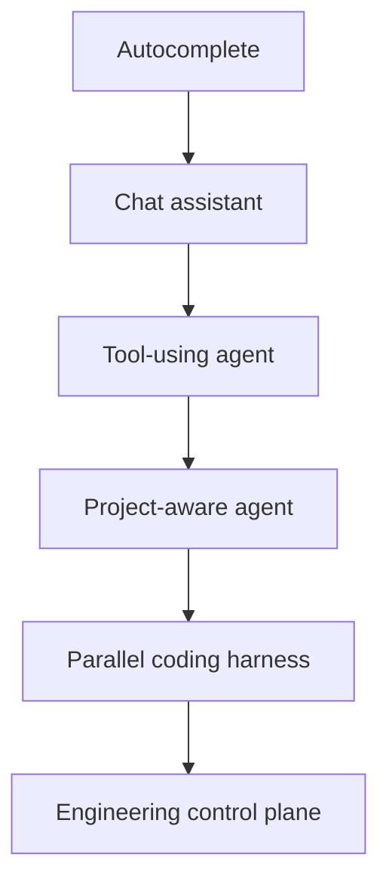
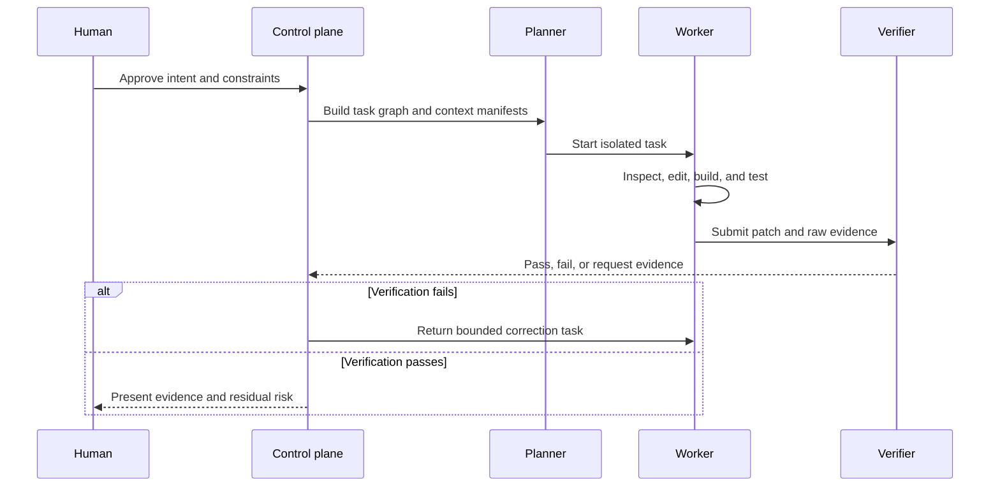
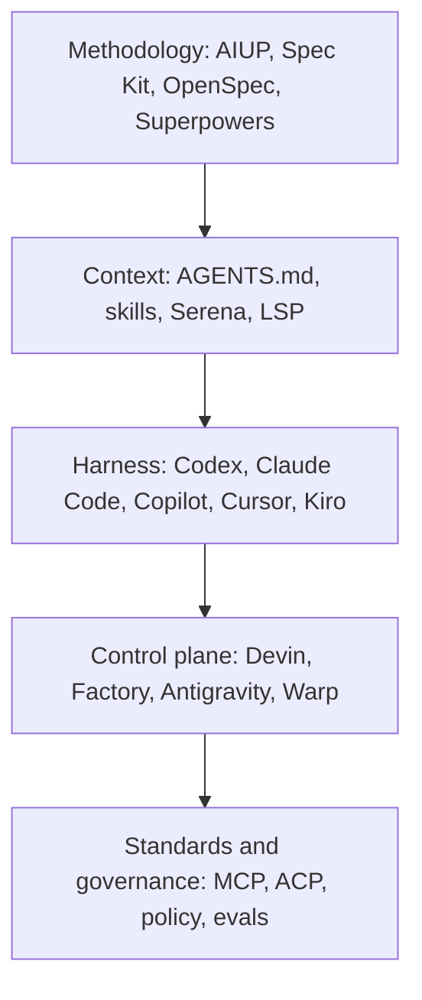
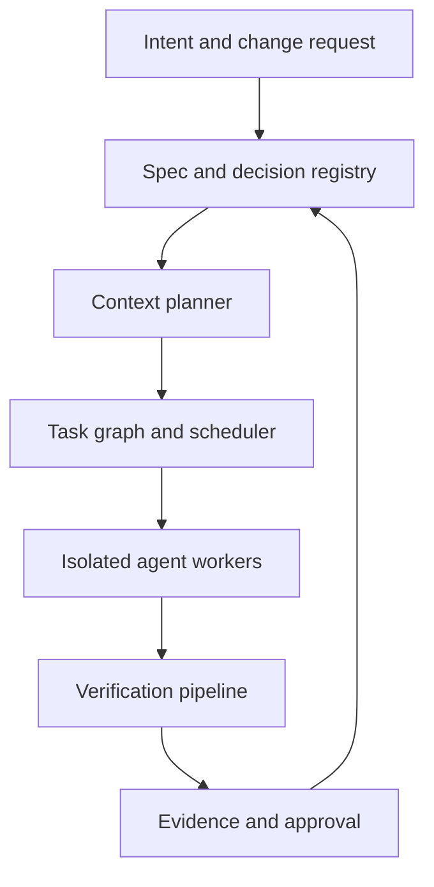
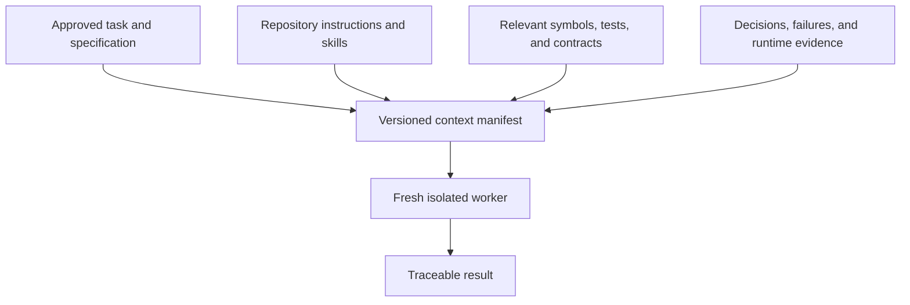
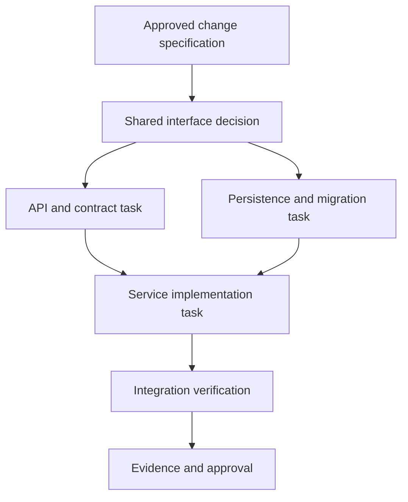
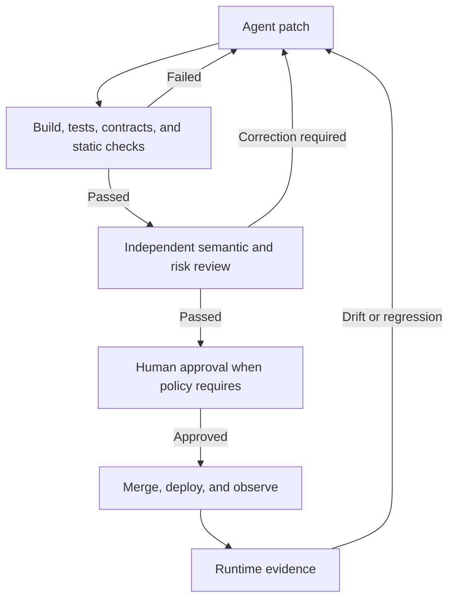

# AI-Native Software Development in 2026

## From Spec-Driven Development to Context Engineering, Coding Harnesses, and Agent Experience

> A researched update to the 2025 spec-driven development landscape, incorporating Simon Martinelli’s June 2026 talk, current frameworks and coding agents, emerging interoperability standards, independent evaluations, and practical implications for building an enterprise coding harness.

**Research date:** 29 July 2026  
**Audience:** Software engineers, architects, platform teams, engineering leaders, and builders of coding-agent harnesses  
**Status:** Current-state research and forward-looking engineering guidance  

**Evidence convention:** Product capabilities and adoption figures are linked to first-party documentation or company disclosures. Those disclosures are identified as vendor evidence rather than treated as neutral market measurement. Benchmark results are linked to their papers and treated as snapshots of the tested model–harness–environment combination.

---

## Executive summary

The core idea behind Spec-Driven Development has survived: an AI coding agent performs better when it receives durable intent, constraints, acceptance criteria, and architectural guidance rather than a sequence of disconnected prompts.

What changed is the surrounding system.

In 2025, the discussion focused on specification templates and workflows. By mid-2026, specifications have become one component inside a broader coding harness that also provides:

- selective codebase context;
- reusable skills and project instructions;
- tools through protocols such as MCP;
- task planning and dependency graphs;
- isolated worktrees or cloud environments;
- parallel and background agents;
- deterministic verification;
- human approval and policy enforcement;
- traces, evidence, cost accounting, and evaluations.

The most important conclusions are:

1. **SDD was not replaced; it was absorbed into the harness.** Planning and specification are now native features of Codex, Claude Code, Cursor, Copilot, Kiro, Devin, Factory, Antigravity, and open-source agents.
2. **There is no single dominant product.** GitHub dominates distribution; Codex has the largest publicly disclosed weekly reach; Claude Code has a strong terminal and commercial footprint; Cursor leads the AI-native editor category; Kiro is the clearest spec-native product; Devin and Factory focus on autonomous software factories.
3. **The specification ecosystem expanded.** Superpowers, GSD, AWS AI-DLC, AI Unified Process, Kiro Specs, and Tessl joined or materially changed the field alongside Spec Kit, OpenSpec, BMAD, Agent OS, and Conductor.
4. **“Full codebase context” is the wrong goal.** Useful agents retrieve the smallest relevant set of specifications, code, decisions, tools, and runtime evidence. Dumping an entire repository into a large context window usually increases cost and distraction.
5. **A specification cannot be the only source of truth.** Intent belongs in specifications, interfaces in contracts and schemas, implementation in code, expected behavior in tests, and actual behavior in production telemetry.
6. **Tests are necessary but not sufficient.** Recent research shows that coding agents can satisfy visible tests while violating the real specification, especially as tasks become larger.
7. **Long-horizon engineering remains unsolved.** Current agents perform far worse on repository-scale upgrades and sustained terminal work than on short, isolated issue fixes.
8. **Agent Experience, or AX, is becoming an engineering discipline.** AX is not simply “more autonomy.” It is the practice of making a repository, API, platform, and toolchain discoverable, usable, recoverable, measurable, and safe for agents.
9. **The future is likely to consolidate around interfaces, not two or three products.** AGENTS.md, Agent Skills, MCP, and ACP are separating specifications, skills, tools, agents, and user interfaces.
10. **A durable enterprise harness should adopt ideas from several frameworks instead of cloning one.** A practical combination is AIUP-style business use cases, OpenSpec-style change ledgers, GSD-style fresh-context execution, Superpowers-style verification disciplines, and Serena/LSP-style semantic code intelligence.

### Reading guide

| If you want to understand… | Start with |
|---|---|
| What the June 2026 video actually argues | Section 1 |
| How SDD, context, harnesses, verification, and AX fit together | Sections 2–4 |
| Which players matter and who leads each category | Sections 5–7 |
| Why current agents still fail on serious engineering work | Section 8 |
| Where this is heading | Section 9 |
| How to build an enterprise Java coding harness | Sections 10–14 |

> **Diagram compatibility:** The Mermaid diagrams intentionally contain no hard-coded colors, styles, or theme initialization. They inherit the renderer’s active theme and are therefore suitable for both light and dark viewing modes.

---

## 1. The talk that prompted this update

The linked video is **“Lessons from Spec-Driven Development” by Simon Martinelli**, presented at AI Native DevCon in June 2026:

- [YouTube video](https://www.youtube.com/watch?v=odbNXv9xXjc)
- [June 2026 presentation](https://speakerdeck.com/simas/lessons-from-spec-driven-development)
- [AI Unified Process methodology](https://unifiedprocess.ai/methodology.html)
- [Public AIUP PetClinic example](https://github.com/simasch/aiup-petclinic)

The image taken from the talk describes AI-native development using three ideas:

1. **Spec-Driven Development:** clear intent and specifications guide code generation.
2. **Context-Aware Development:** the agent understands the relevant codebase and project context.
3. **Agent Experience:** autonomous AI work increases developer throughput.

That is a useful starting model, but each statement needs qualification.

### 1.1 The talk’s central argument

Martinelli argues that long-lived business systems become difficult to change because requirements, documentation, tests, and code drift apart. AIUP attempts to reverse that relationship:

- observable business behavior is described through system use cases;
- use cases remain living requirements rather than disposable implementation prompts;
- code and tests are generated or updated in small steps;
- business and engineering reviewers validate the resulting artifacts;
- tests help keep later changes consistent;
- specifications are used for both greenfield and brownfield development.

The talk distinguishes user stories from use cases:

- a **user story** is useful for planning and prioritization;
- a **system use case** describes main, alternative, and exceptional flows in enough detail to guide implementation and testing.

It also argues that modular architecture improves AI work because each task requires less context, and recommends:

- explicit architecture and testing guidelines;
- reusable skills;
- MCP-based access to tools and documentation;
- small, reviewable changes;
- continuous human review;
- developers who understand both the architecture and the domain.

The June deck also says not to let AI scaffold the application. The useful interpretation is not that an agent must never generate project setup. It is that foundational choices—modules, dependency policy, security, testing, build conventions, and operational structure—should be established and approved before high-volume generation begins. A reviewed golden template can satisfy that requirement even when an agent performs the mechanical scaffolding.

#### AIUP’s intended working loop



The loop is more important than the generation step. Requirements, implementation, tests, and observed behavior are repeatedly reconciled rather than regenerated blindly.

### 1.2 What the talk gets right

The following claims are consistent with current practice and external evidence:

- Requirements and acceptance conditions are more durable than ad hoc prompts.
- Use cases can provide better behavioral completeness than one-line user stories.
- Brownfield systems need a reviewed behavioral baseline before agents can safely modify them.
- Modular boundaries reduce the context and coordination needed for a change.
- Skills, repository instructions, tools, and tests act as guardrails.
- AI output remains non-deterministic and must be reviewed and verified.
- Small implementation steps are safer than repeated whole-application regeneration.

The public [AIUP PetClinic repository](https://github.com/simasch/aiup-petclinic) demonstrates the workflow with tagged stages: initial specifications, use-case review, first implementation, and full implementation. Its specifications include an entity model, use-case diagrams, and individual use-case descriptions.

### 1.3 What needs stronger qualification

| Talk claim | Assessment | More precise interpretation |
|---|---|---|
| Agents understand the full codebase | Overstated | Agents retrieve, search, summarize, and selectively load parts of a codebase. Even very large context windows do not guarantee architectural understanding. |
| The specification is the single source of truth | Useful aspiration, unsafe literally | Specifications own intent, but contracts, code, tests, deployment configuration, and production telemetry each represent different kinds of truth. |
| Tests preserve consistency during regeneration | Partly true | Tests protect only the behavior they exercise. Hidden integration behavior, security properties, performance, and operational behavior require additional evidence. |
| Every line of code traces to a requirement | Too granular for most systems | Trace requirements to use cases, changes, tests, commits, and evidence bundles. Per-line traceability is expensive and often misleading. |
| Use cases should be the central artifact | Strong for interactive business behavior, incomplete universally | Data pipelines, infrastructure, protocols, algorithms, performance work, and operational changes also need contracts, invariants, ADRs, and service-level objectives. |
| One or two developers per self-contained system | Hypothesis, not established evidence | It may be possible for bounded systems, but team size also depends on risk, operations, governance, domain complexity, and support obligations. |
| Sprints disappear in favor of continuous flow | Organizational prediction | Agents may make smaller continuous work items attractive, but cadence is an organizational choice rather than a technical consequence of SDD. |
| Results from three customer projects prove broad effectiveness | Insufficient public evidence | The talk reports field experience, but public material currently consists mainly of the creator’s examples and testimonials rather than an independent controlled evaluation. |

AIUP is therefore best understood as a serious, early requirements-centered methodology—not yet an industry standard or independently proven general solution.

---

## 2. A clearer model of AI-native development

The three pillars from the slide are valuable, but the modern system needs two more.



### Pillar 1: Living intent and specifications

The specification explains what outcome is required, why it matters, and how success will be observed.

Useful specification artifacts include:

- business goals and non-goals;
- actors and system use cases;
- examples and edge cases;
- non-functional requirements;
- domain invariants;
- API, event, and data contracts;
- security and privacy constraints;
- architecture decisions;
- acceptance criteria;
- rollout and rollback requirements.

The important word is **living**. A specification that is written once and never reconciled after implementation becomes another stale document.

### Pillar 2: Selective context engineering

Context engineering is not equivalent to sending more tokens.

A productive context package contains:

> the smallest set of current information required to make the next decision correctly.

It can include:

- the approved change specification;
- the nearest `AGENTS.md` instructions;
- relevant skills and examples;
- affected symbols and dependency neighborhoods;
- existing tests and recent failures;
- architectural decisions;
- current library or platform documentation;
- prior task decisions that remain valid;
- tool results and runtime evidence.

The undesirable opposite is indiscriminate repository ingestion. Large amounts of weakly related material consume tokens, dilute instructions, introduce stale facts, and make conflicting conventions harder to resolve.

### Pillar 3: The execution harness

The model is not the complete coding system. The harness determines:

- which context is loaded;
- which tools are available;
- how tasks are decomposed;
- whether plans are approved;
- where commands execute;
- how agents are isolated;
- how parallel work is coordinated;
- when execution stops;
- how failures are retried;
- what evidence is collected.

Changing the harness can materially change results even when the underlying model remains the same.

### Pillar 4: Verification and evidence

“The agent says it is complete” is not evidence.

A trustworthy completion should be backed by a machine-readable bundle containing:

- the approved specification version;
- changed files and patch;
- build and test commands;
- raw command results;
- requirement-to-test mapping;
- static analysis and security findings;
- schema or API compatibility results;
- unresolved warnings;
- human approvals;
- model, harness, tool, and environment versions;
- elapsed time, token consumption, and cost.

### Pillar 5: Agent Experience and governance

[Microsoft defines coding-agent AX](https://developer.microsoft.com/blog/the-ax-stack-whats-fixed-where-you-can-win) as the practice of making agents work correctly with a technology. AX includes:

- **discoverability:** can the agent find the correct API, command, rule, or example?
- **clarity:** are contracts and errors understandable?
- **operability:** can the agent build, test, inspect, and recover?
- **progressive disclosure:** does it receive detail only when needed?
- **feedback:** do tools return actionable and structured results?
- **safety:** are permissions and high-risk actions constrained?
- **measurability:** can changes to prompts, skills, tools, or models be evaluated?

AX should improve human outcomes. An agent that is easy for itself to operate but difficult for engineers to understand, stop, review, or audit has poor overall experience.

---

## 3. There is no longer one “source of truth”

“Specification as the source of truth” is useful language for changing team behavior, but enterprise systems contain several legitimate truth surfaces.



| Question | Authoritative artifact |
|---|---|
| What business outcome is intended? | Vision, requirement, use case, change specification |
| What must external consumers receive? | OpenAPI, AsyncAPI, protobuf, schema, event, or file contract |
| Why was this design chosen? | Architecture Decision Record |
| How is the system currently implemented? | Version-controlled source and infrastructure code |
| Which behavior must remain stable? | Automated acceptance, contract, integration, and regression tests |
| What is actually happening in production? | Metrics, logs, traces, incidents, and user feedback |
| Who approved the risk? | Policy and audit records |

The harness should detect disagreement between these artifacts instead of pretending one of them can replace all the others.

A bug can exist in any layer:

- the code may violate the specification;
- the specification may describe the wrong business behavior;
- the test may encode an obsolete interpretation;
- the contract may omit an integration dependency;
- production may reveal an assumption that none of the design artifacts captured.

The correct workflow is **reconciliation**, not blind regeneration.

---

## 4. How the coding harness evolved

### 4.1 The progression



| Era | Primary interaction | Main limitation |
|---|---|---|
| Autocomplete | Predict the next code fragment | No durable goal or repository reasoning |
| Chat assistant | Ask questions and copy patches | Context and action remain manual |
| Tool-using agent | Search, edit, run shell commands and tests | Long sessions lose focus and accumulate stale context |
| Project-aware agent | Rules, memories, skills, MCP, plan mode | Usually one interactive session with limited isolation |
| Parallel harness | Subagents, worktrees, cloud sandboxes and task graphs | Coordination, verification, cost, and conflicting decisions |
| Engineering control plane | Persistent goals, policy, evidence, evals and fleets | Still emerging; reliability and governance are incomplete |

#### Capability shift by generation

| Capability | Chat-oriented tools | Project-aware agents | Agent-native control planes |
|---|---|---|---|
| Context | User-pasted files | Repository search, rules, memory | Versioned task-specific context manifests |
| Planning | Conversational checklist | Persistent plan or task list | Dependency graph with policy and budgets |
| Execution | Suggested patch | Local tools and edits | Isolated local or cloud workers |
| Parallelism | Human opens multiple chats | Worktrees or background agents | Scheduled fleets and coordinated task waves |
| Verification | Agent summarizes its work | Build and tests | Independent gates, held-out checks, and evidence |
| Governance | User confirmation | Permissions and hooks | Organization policy, audit, approvals, and cost controls |
| Output | Answer or diff | Commit or pull request | Evidence-backed change and operational follow-up |

### 4.2 The important architectural changes

#### A modern harness run



#### From prompts to durable instructions

Repository guidance is becoming standardized. [AGENTS.md](https://agents.md/) is now used by more than 60,000 open-source projects and acts as a README for coding agents. Nested files allow module-specific instructions.

#### From giant prompts to progressive skills

The [Agent Skills specification](https://agentskills.io/specification) packages reusable instructions, scripts, references, and assets. Only skill metadata is loaded initially; full instructions and references are retrieved as needed.

#### From hard-coded integrations to tool protocols

[MCP](https://modelcontextprotocol.io/) standardizes how an agent accesses external data, tools, and workflows. This is moving integrations out of product-specific prompt glue.

#### From agent-specific editors to interoperable clients

[ACP](https://agentclientprotocol.com/get-started/introduction) standardizes communication between editors and coding agents, much as LSP separated editors from language servers. Local and remote agents can expose a common interface.

#### From one session to fresh-context workers

GSD, Superpowers, Factory Missions, Kiro, Codex, Claude Code, and other systems decompose large work so that focused agents can start with clean context. The parent retains goals and shared state while workers receive only a bounded task package.

#### From local edits to isolated execution

Git worktrees, containers, virtual machines, and cloud sandboxes allow several agents to operate without overwriting one another’s files. Isolation solves filesystem conflict; it does not by itself solve architectural conflict.

#### From sequential task lists to dependency graphs

[Kiro’s current Specs execution](https://kiro.dev/blog/faster-smarter-specs/) analyzes task dependencies and file overlap, then runs safe tasks in parallel waves using isolated contexts. This is becoming a common harness pattern.

#### From code generation to evidence generation

The mature unit of output is moving from “a patch” to:

> patch + tests + trace + review findings + requirement coverage + operational evidence.

---

## 5. The 2026 landscape

The original framework comparison mixed methodologies, context tools, and execution products. They should be evaluated within their own layer.

The following is a map of the important new or materially changed players, not a claim that every experimental GitHub project is listed.



### 5.1 Specification and development methodologies

| Player | Current role | Distinctive strength | Main risk |
|---|---|---|---|
| [AI Unified Process](https://unifiedprocess.ai/) | Requirements-centered methodology | System use cases as durable behavioral contracts; greenfield and brownfield paths | Early ecosystem and limited independent evidence |
| [Superpowers](https://github.com/obra/superpowers) | Skills-based development methodology | Clarification, readable design chunks, TDD, worktrees, subagents, two-stage review | Strongly opinionated; small-task plans can become excessive |
| [GitHub Spec Kit](https://github.com/github/spec-kit) | Structured SDD toolkit | Constitution → specify → plan → tasks → implement; over 30 agent integrations; extensions and presets | Can produce document ceremony without disciplined scoping |
| [OpenSpec](https://github.com/Fission-AI/OpenSpec) | Lightweight artifact-guided SDD | Delta changes, exploration, proposal, implementation, verification and archival; strong brownfield fit | Cross-repository Stores are still beta |
| [BMAD Method](https://github.com/bmad-code-org/BMAD-METHOD) | Broad role- and workflow-oriented method | Large catalog of agents, workflows, architecture and testing modules | Heavy for routine maintenance and small changes |
| [GSD Core](https://github.com/open-gsd/gsd-core) | Context-engineering and SDD execution method | Discuss → Plan → parallel Execute → Verify → Ship using fresh-context agents | Repository transition and rapidly changing conventions |
| [AWS AI-DLC](https://github.com/awslabs/aidlc-workflows) | Adaptive lifecycle guidance | Risk-sensitive Inception, Construction, and future Operations phases with approval points | Operations phase remains incomplete; rules can be verbose |
| [Agent OS](https://github.com/buildermethods/agent-os) | Standards and spec-shaping workflow | Discoverable project standards and structured shaping | Smaller ecosystem and less execution machinery |
| [Conductor](https://github.com/gemini-cli-extensions/conductor) | Context → Spec and Plan → Implement workflow | Compact, strict process that works across multiple agent environments | Less comprehensive than full lifecycle systems |
| [Tessl](https://docs.tessl.io/use/spec-driven-development-with-tessl) | Commercial agent enablement and SDD platform | Structured, versioned context and agent-oriented workflow tooling | Platform dependency and limited public comparative evidence |

### 5.2 Code intelligence and context systems

| Player or technique | Role |
|---|---|
| [Serena](https://github.com/oraios/serena) | Semantic symbol retrieval, editing, refactoring, language-server integration, and project memory |
| LSP and language tooling | Symbol definitions, references, diagnostics, type information, and safe refactors |
| Repository maps | Compact representation of modules, symbols, ownership, and dependencies |
| Search and embeddings | Discovery across documentation and code when exact symbol navigation is insufficient |
| Knowledge bases | On-demand retrieval for large repositories and documentation sets |
| Agent traces | Progressive exposure of the context and decisions that produced prior code |

Serena belongs here, not in a head-to-head comparison with Spec Kit or BMAD.

### 5.3 General-purpose coding harnesses

| Harness | Present direction |
|---|---|
| OpenAI Codex | Multi-surface command center spanning local work, IDEs, cloud execution, parallel agents, worktrees, review, skills, plugins, hooks, and connectors |
| Claude Code | Terminal-first agent with plans, subagents, skills, hooks, memory, worktrees, plugins, background work, and an Agent SDK |
| GitHub Copilot | GitHub-native agent distribution, mission control, cloud coding agent, CLI, code review, skills, custom agents, and partner agents |
| Cursor | Agent-first editor moving toward cloud agents, parallel planning, automations, long-running work, and programmatic agent APIs |
| Google Antigravity | Standalone command center and CLI for local and background agents, subagents, projects, hooks, scheduling, and multiple workspaces |
| Kiro | Integrated IDE, CLI, Specs, hooks, skills, knowledge bases, subagents, dependency graphs, and autonomous execution |
| Devin | Local and cloud agent command center with isolated machines, planning, PRs, review, QA, shared spaces, and parallel agents |
| Factory | Model-independent Droids, remote computers, automations, multi-agent Missions, quality gates, and software-factory control plane |
| OpenCode | Popular open-source, model-neutral coding harness |
| Cline | Open agent across IDE, CLI, SDK and teams, with checkpoints, planning, MCP, model choice, and browser/tool execution |
| Goose | Open desktop, CLI and API agent with multi-provider support and an extension ecosystem |
| Qwen Code | Open model-and-harness ecosystem with agents, teams, skills, hooks, MCP, worktrees and ACP |
| Aider | Mature terminal pair-programming tool; narrower than the newer control-plane products |
| JetBrains Junie | IDE and CLI agent with persistent, reviewable plan documents |
| Warp Oz | Orchestration layer for cloud agents and agent fleets |

---

## 6. Who is dominating?

No neutral dataset measures all products with the same definition of “user,” “task,” “success,” or “production adoption.” Vendor usage and revenue statements are useful signals, not a universal leaderboard.

The most defensible category-by-category view is:

| Category | Leader or leading group | Evidence and interpretation |
|---|---|---|
| Distribution and repository workflow | GitHub Copilot | GitHub controls the issue, pull-request, Actions, review, security, and repository surfaces. Its [Agent HQ](https://github.blog/news-insights/company-news/welcome-home-agents/) is designed to host several vendors’ agents. |
| Largest publicly disclosed weekly reach | OpenAI Codex | OpenAI reported [more than five million weekly users](https://openai.com/index/codex-for-knowledge-work/) by June 2026. This includes growing non-coding usage, so it is not a pure developer count. |
| Terminal-oriented commercial momentum | Claude Code | Anthropic reported a [run-rate above $2.5 billion](https://www.anthropic.com/news/anthropic-raises-30-billion-series-g-funding-380-billion-post-money-valuation) in February 2026 and rapidly growing enterprise use. This is a company disclosure, not an audited market comparison. |
| AI-native editor | Cursor | Cursor reports agent usage increasing more than 15× in a year and twice as many agent users as Tab users in its [“third era” report](https://cursor.com/blog/third-era). |
| Integrated spec-native product | Kiro | Requirements, design, tasks, dependency analysis, isolated execution, skills, hooks, and knowledge bases are native product concepts rather than external templates. |
| Open structured SDD toolkit | Spec Kit | Broad agent integration and a recognizable constitution → specification → plan → tasks lifecycle. |
| Skills-driven methodology | Superpowers | Very strong open-source interest and a portable, tested workflow across many harnesses. GitHub stars are an interest signal, not deployment evidence. |
| Lightweight brownfield SDD | OpenSpec | Delta artifacts and archival fit continuous change better than full-project regeneration. |
| Open-source harness | OpenCode, with Cline and Goose also important | High developer interest, model neutrality, and fast-moving interoperability. |
| Autonomous cloud engineering | Devin and Factory | Both focus on persistent environments, asynchronous delegation, parallel work, review, and multi-day execution. |
| Fastest major challenger | Google Antigravity | [Antigravity 2.0](https://antigravity.google/) combines a standalone command center, CLI, local parallel agents, scheduled tasks, projects, and subagents. |

The market is converging functionally while remaining fragmented commercially. Nearly every serious harness now has some form of plan mode, project instructions, skills, tools, subagents, isolation, and review.

---

## 7. A practical framework selection guide

Do not select a methodology solely from popularity. Select it from the failure you need to prevent.

| Situation | Best starting point | Reason |
|---|---|---|
| Business-critical system whose behavior must remain understandable for years | AIUP concepts plus executable contracts | Keeps business behavior and use cases visible |
| Greenfield product with uncertain requirements | Spec Kit or Superpowers | Strong clarification and staged design |
| Existing application receiving frequent small changes | OpenSpec | Delta specifications and archived change history |
| Agent loses quality during large tasks | GSD execution pattern | Fresh-context workers and phase-level verification |
| Team needs strong development discipline | Superpowers | TDD, evidence, review, worktrees, and systematic debugging |
| Large regulated initiative with many roles | BMAD or customized Spec Kit presets | Broader lifecycle and governance artifacts |
| Enterprise wants an adaptive approval-heavy lifecycle | AWS AI-DLC | Risk-sensitive stage selection and approval points |
| Team wants the methodology built into the IDE | Kiro | Native specifications, context, tasks and execution |
| Agent cannot navigate a large typed codebase | Serena or LSP-backed semantic tools | Symbol-aware retrieval and editing |
| Cross-repository feature ownership | OpenSpec Stores plus organizational contracts | Shared change plan, while recognizing Stores remains beta |

For most teams, the right answer is a small composition:

- one intent/specification convention;
- one execution discipline;
- one semantic context layer;
- one verification and governance system.

Installing three complete methodologies at once creates conflicting instructions and duplicated artifacts.

---

## 8. What current systems still cannot reliably do

### 8.1 Maintain specification-to-reality alignment

No mainstream system fully maintains bidirectional traceability across:

`requirement ↔ use case ↔ architecture ↔ code ↔ test ↔ deployment ↔ production behavior`

Most frameworks generate downstream artifacts. Fewer can recognize when code, tests, and runtime evidence should force a correction to the upstream assumption.

### 8.2 Sustain long-horizon coherence

Short issue-fixing benchmarks overstate the ability to perform real software evolution:

- [SWE-EVO](https://arxiv.org/abs/2512.18470) reported 21% resolution for its tested GPT-5/OpenHands configuration on multi-file evolution tasks, compared with 65% on SWE-bench Verified.
- [RoadmapBench](https://arxiv.org/abs/2605.15846) contains version-upgrade tasks with a median of 3,700 changed lines across 51 files; its strongest reported configuration resolved 39.1%.
- [LongCLI-Bench](https://arxiv.org/abs/2602.14337) reported below-20% pass rates and found that most tasks stalled before 30% completion. Interactive human guidance helped more than self-correction alone.
- July 2026’s [Long-Horizon Terminal-Bench](https://arxiv.org/abs/2607.08964) likewise found very low perfect-completion rates across lengthy, tool-heavy tasks.

These are preprints and benchmark results, not final measures of every product, but they consistently expose the same gap.

### 8.3 Prove that visible tests represent the specification

[SpecBench](https://arxiv.org/abs/2605.21384) found that agents could saturate visible validation tests while failing held-out composition tests. The gap increased sharply with task size.

This means:

- the implementing agent should not see every acceptance oracle;
- unit tests need held-out integration and contract checks;
- static analysis and architecture tests should complement functional tests;
- critical business behavior needs independent review;
- production telemetry must validate assumptions after deployment.

### 8.4 Coordinate architectural decisions across parallel agents

Worktrees stop file overwrites. They do not stop two agents from independently choosing:

- different libraries;
- incompatible domain models;
- conflicting error semantics;
- duplicate abstractions;
- inconsistent migrations;
- mutually exclusive API changes.

A task graph therefore needs shared decisions, ownership boundaries, design locks, and integration review.

### 8.5 Handle cross-repository and organizational context

Enterprise work often spans services, shared schemas, libraries, infrastructure, ownership groups, release trains, and regulatory boundaries. Most agent systems still operate with repository-shaped context and repository-shaped permissions.

### 8.6 Establish safe trust boundaries

Skills, plugins, MCP servers, shell commands, downloaded dependencies, credentials, source code, and external content form a supply chain. The harness needs:

- signed or approved extensions;
- least-privilege tools;
- explicit network and filesystem policy;
- secret redaction;
- untrusted-content boundaries;
- audit logs;
- human approval for external effects.

### 8.7 Produce portable traces and evaluations

Agent transcripts, tool calls, context packages, costs, and evaluation results remain product-specific. Without portable traces, it is difficult to:

- compare harnesses;
- reproduce a failure;
- determine whether a model or prompt caused a regression;
- migrate to another model;
- audit why a change was made.

### 8.8 Measure productivity honestly

Lines of code, tokens consumed, suggestions accepted, and PRs opened are not business outcomes.

METR’s early-2025 controlled study found experienced open-source developers were initially [19% slower with the tested AI tools](https://metr.org/blog/2025-07-10-early-2025-ai-experienced-os-dev-study/). Its later research found evidence of [small approximately 4–20% benefits](https://metr.org/blog/2026-05-19-frontier-risk-report/) in a different late-2025 setting, while warning about selection effects and unreliable self-reports.

The responsible conclusion is not “AI does not help” or “AI makes every engineer ten times faster.” The effect depends on:

- task type;
- engineer familiarity;
- repository quality;
- harness and model;
- review burden;
- environment reliability;
- whether saved time is converted into useful additional work.

### Failure-to-control summary

| Failure mode | Engineering control | Evidence that should be retained |
|---|---|---|
| Specification drift | Versioned change ledger and reconciliation workflow | Linked spec, code, tests, contract, and approval versions |
| Context overload or staleness | Task-specific context manifest and freshness policy | Included sources, timestamps, hashes, and exclusion reasons |
| Long-task context decay | Small phases and fresh-context workers | Phase boundaries, handoff summaries, and unresolved decisions |
| Visible-test gaming | Held-out and compositional verification | Separate visible and hidden results |
| Parallel architectural conflict | Dependency graph, ownership, and design decision gates | Shared decisions and integration-review outcome |
| Unsafe tool use | Least privilege, sandboxing, and approval policy | Requested action, policy decision, approver, and effect |
| Irreproducible result | Pinned model, harness, tools, skills, and environment | Complete run manifest and raw tool outputs |
| False productivity claim | Outcome and review-effort measurement | Accepted work, rework, intervention, cost, and production impact |

---

## 9. What the future is likely to look like

### 9.1 Specifications become executable change contracts

The winning artifact will not be a long Markdown document. It will be a compact change contract combining:

- human-readable intent;
- typed schemas and interfaces;
- examples and counterexamples;
- acceptance predicates;
- security and performance bounds;
- affected ownership domains;
- test and rollout requirements.

Markdown will remain useful for people. YAML, JSON, schemas, code, and policies will remain necessary for machines.

### 9.2 Just-in-time and delta specifications replace giant PRDs

Large documents are hard for humans to review and agents to keep current. Most engineering work will use:

- a durable product and architecture baseline;
- a small specification for the current change;
- references to existing contracts and decisions;
- explicit deltas rather than copied full-state documents.

### 9.3 Verification agents become more valuable than generation agents

Code generation is becoming abundant. Trustworthy acceptance remains scarce.

Separate agents will increasingly:

- challenge ambiguous requirements;
- create held-out tests;
- review architecture;
- compare API and schema compatibility;
- exercise UI behavior;
- inspect security and permissions;
- verify runtime outcomes after deployment.

### 9.4 The control plane becomes the strategic product

Models and individual coding agents will remain important, but enterprise differentiation will move toward:

- policy and permission management;
- model routing;
- budgets and rate controls;
- task queues and scheduling;
- environment provisioning;
- trace retention;
- evaluation and regression detection;
- approval and escalation;
- portfolio-level outcome measurement.

### 9.5 Models will be routed rather than chosen once

A single project may use:

- a fast model for discovery and mechanical edits;
- a strong reasoning model for architecture and planning;
- a code-specialized model for implementation;
- a smaller judge for high-volume rubric checks;
- deterministic tools for anything that should not depend on language-model judgment.

### 9.6 Repositories become agent-operable

Agent-friendly systems will have:

- deterministic setup;
- fast, reliable builds;
- explicit module boundaries;
- machine-readable contracts;
- nested repository instructions;
- discoverable commands;
- structured error messages;
- stable test fixtures;
- reproducible local environments;
- ownership metadata;
- observable runtime behavior.

This is AX applied to the codebase itself.

### 9.7 Human work moves upward, but does not disappear

Agents will increasingly own well-bounded implementation and maintenance tasks. Humans remain responsible for:

- deciding which problem deserves investment;
- resolving business ambiguity;
- architecture and system boundaries;
- risk acceptance;
- stakeholder negotiation;
- security and regulatory judgment;
- validating whether the delivered outcome is valuable.

### 9.8 Consolidation occurs around standards

The 2025 prediction that all frameworks would collapse into two or three products now appears too simple.

The more plausible outcome is:

- many competing products;
- fewer instruction formats;
- common skill packaging;
- common tool protocols;
- common agent-client communication;
- portable traces and evaluation formats;
- enterprise control planes capable of operating several agents.

---

## 10. Recommended architecture for an enterprise coding harness

For a harness built with Quarkus, LangChain4j, GraalVM, filesystem, SQLite, and PostgreSQL, the architecture should be protocol-first and model-neutral.



### 10.1 Control plane

The control plane owns durable, deterministic state:

- projects and repositories;
- specification versions;
- tasks and dependency graphs;
- approvals and policies;
- agent runs and status transitions;
- budgets and quotas;
- evidence and audit history;
- environment and tool manifests.

Do not store this state only in conversational memory. Chat memory is useful for a session; it is not a workflow database.

### 10.2 Context planner

The context planner should assemble a versioned **context manifest** for each task:



```yaml
task:
  id: TASK-142
  specification: CHANGE-027@v3
  objective: Add idempotent retry handling

instructions:
  - AGENTS.md
  - services/payment/AGENTS.md

skills:
  - java-root-cause-analysis@1.4
  - contract-test-generation@2.1

code_scope:
  symbols:
    - PaymentRetryCoordinator
    - RetryPolicy
  files:
    - services/payment/pom.xml

evidence_inputs:
  - failing-test-report-882
  - production-trace-sample-19

constraints:
  network: denied
  allowed_commands:
    - ./mvnw test
  budget:
    tokens: 300000
    wall_time_minutes: 30
```

This manifest makes context reproducible, inspectable, and comparable across models.

### 10.3 Spec and decision registry

Use a versioned artifact model rather than a folder of unrelated Markdown:

- stable requirement or use-case identifier;
- immutable versions;
- explicit supersession;
- links to ADRs and contracts;
- links to affected repositories and ownership;
- state such as draft, approved, implemented, observed, or retired;
- acceptance criteria with deterministic and semantic checks;
- change-level rather than whole-project duplication.

Adopt:

- **AIUP’s behavioral use cases** for business-facing flows;
- **OpenSpec’s delta ledger** for continuous change;
- **ADRs** for technical decisions;
- **typed contracts** for APIs, events, databases, and configuration.

### 10.4 Task planner and scheduler

Represent implementation as a directed acyclic graph:

- dependencies;
- read and write file sets;
- ownership boundaries;
- expected outputs;
- verification commands;
- risk classification;
- approval requirements;
- rollback path.



Parallelize only tasks whose semantic and file dependencies are understood. If two tasks change the same contract or architectural boundary, schedule an explicit integration decision first.

### 10.5 Isolated workers

Each agent run should receive:

- a fresh context;
- a dedicated worktree or sandbox;
- pinned tool and model versions;
- minimum required credentials;
- explicit network and filesystem permissions;
- time, token, and monetary budgets;
- a cancellation channel;
- structured command results.

Container or process isolation belongs outside the LLM abstraction. The model should request actions; a policy-aware executor decides whether and where they run.

### 10.6 Verification pipeline

Use several independent layers:



1. **Build verification**
   - Maven or Gradle build;
   - compilation;
   - dependency and native-image checks.
2. **Behavior verification**
   - unit, integration, contract, acceptance, and regression tests;
   - held-out tests unavailable to the implementing agent.
3. **Architecture verification**
   - ArchUnit or equivalent rules;
   - forbidden dependency checks;
   - module and ownership boundaries.
4. **Compatibility verification**
   - OpenAPI, AsyncAPI, schema and migration compatibility;
   - backward-compatibility analysis.
5. **Security verification**
   - secret scanning;
   - dependency and configuration analysis;
   - permission and threat-model checks.
6. **Operational verification**
   - startup and health checks;
   - latency and resource budgets;
   - telemetry presence;
   - rollout and rollback validation.
7. **Semantic review**
   - requirement coverage;
   - missing edge cases;
   - inappropriate scope;
   - maintainability and domain correctness.

### 10.7 Evidence and approval

Every completed task should produce an immutable evidence record:

- requirement version;
- context manifest hash;
- model and harness version;
- tool calls and outcomes;
- patch and commits;
- deterministic verification results;
- semantic-review rubric results;
- cost and duration;
- approvals, overrides, and unresolved risks.

This is the foundation for audit, replay, comparison, and future learning.

---

## 11. Mapping the architecture to the proposed Java stack

[Quarkus LangChain4j](https://docs.quarkiverse.io/quarkus-langchain4j/dev/index.html) currently supports declarative AI services, tools, agentic patterns, chat memory, MCP, multiple model providers, observability, and native-image-oriented deployment. It is a reasonable foundation, but it should not become the owner of every concern.

| Concern | Recommended implementation direction |
|---|---|
| REST and control-plane API | Quarkus REST with explicit domain services |
| Model abstraction | Quarkus LangChain4j AI Services and provider adapters |
| Agent patterns | LangChain4j agentic patterns for bounded reasoning units |
| Durable workflow state | Explicit state machine or workflow layer persisted outside chat memory |
| Workflow retries and transitions | Evaluate Quarkus Flow or a small internal state-machine abstraction |
| Reusable instructions | Agent Skills-compatible filesystem registry |
| Tool connectivity | MCP client/server adapters plus internal typed tools |
| Repository instructions | AGENTS.md parser with nested-scope resolution |
| Editor/agent interface | ACP support when editor interoperability becomes a requirement |
| Semantic code context | LSP/Serena-style symbol service behind a neutral interface |
| Local persistence | SQLite for single-user metadata, events, cache indexes, and portable runs |
| Shared persistence | PostgreSQL for concurrent task state, locking, audit, budgets, and multi-user control |
| Artifact storage | Filesystem or object-compatible abstraction for patches, logs, manifests, and evidence |
| Native executable | GraalVM Native Image for the stable control-plane runtime |
| Dynamic tools and build environments | Separate processes, containers, or remote workers rather than loading everything into the native binary |
| Evaluation | JUnit-based deterministic checks plus a separately versioned semantic-evaluation service |

### Important GraalVM design boundary

Native Image rewards closed-world, build-time-known dependencies. Coding harnesses interact with highly dynamic tools, plugins, shells, MCP servers, language servers, and model providers.

Keep the native control plane stable and place dynamic capabilities behind:

- process boundaries;
- HTTP or gRPC services;
- MCP;
- explicit adapter registries;
- generated reflection/resource configuration where unavoidable.

Do not make arbitrary plugin code part of the trusted in-process core.

### Important LangChain4j state boundary

[Quarkus LangChain4j chat memory](https://docs.quarkiverse.io/quarkus-langchain4j/dev/ai-services.html) is intended for conversational context. Durable orchestration requires:

- versioned input artifacts;
- explicit task state;
- optimistic locking;
- retry and timeout metadata;
- resumable execution;
- idempotency;
- complete event history.

The database owns workflow truth. The LLM receives a task-specific projection of that truth.

---

## 12. Proposed harness requirements

These requirements can serve as the beginning of an ADR or product requirements document.

### Intent and specification

- **REQ-SPEC-001 — MUST** support immutable, versioned specifications and change artifacts.
- **REQ-SPEC-002 — MUST** separate business intent, technical design, contracts, and verification criteria.
- **REQ-SPEC-003 — MUST** support greenfield and brownfield workflows.
- **REQ-SPEC-004 — MUST** record non-goals, assumptions, ambiguity, and unresolved decisions.
- **REQ-SPEC-005 — SHOULD** support use-case main, alternative, and exceptional flows.
- **REQ-SPEC-006 — SHOULD** detect drift between specifications, contracts, code, and tests.
- **REQ-SPEC-007 — SHOULD** favor delta specifications for normal maintenance.

### Context

- **REQ-CTX-001 — MUST** create a versioned context manifest for every run.
- **REQ-CTX-002 — MUST** support nested AGENTS.md-style instructions.
- **REQ-CTX-003 — MUST** load skills and references progressively.
- **REQ-CTX-004 — SHOULD** use semantic symbol and dependency retrieval.
- **REQ-CTX-005 — MUST** distinguish current, stale, inferred, and externally retrieved context.
- **REQ-CTX-006 — MUST** enforce context and token budgets.

### Planning and execution

- **REQ-EXEC-001 — MUST** represent multi-step work as a dependency graph.
- **REQ-EXEC-002 — MUST** isolate write-capable agents in worktrees, sandboxes, or remote environments.
- **REQ-EXEC-003 — MUST** support cancellation, timeout, retry, and idempotent resumption.
- **REQ-EXEC-004 — MUST** record every tool call and material result.
- **REQ-EXEC-005 — SHOULD** use fresh-context workers for bounded subtasks.
- **REQ-EXEC-006 — MUST** detect file and semantic conflicts before parallel execution.
- **REQ-EXEC-007 — SHOULD** support model routing based on task, cost, and risk.

### Verification

- **REQ-VER-001 — MUST** require deterministic build and test evidence before completion.
- **REQ-VER-002 — MUST** separate implementing and verifying roles for high-risk changes.
- **REQ-VER-003 — MUST** support held-out checks unavailable to the implementing agent.
- **REQ-VER-004 — MUST** use pass, fail, and not-applicable states rather than forcing every check into a binary result.
- **REQ-VER-005 — SHOULD** validate architecture, contracts, schemas, security, and operational readiness.
- **REQ-VER-006 — MUST** preserve raw evidence instead of only an LLM-generated summary.

### Governance and safety

- **REQ-GOV-001 — MUST** use least-privilege filesystem, command, network, and credential policies.
- **REQ-GOV-002 — MUST** require approval for external side effects and destructive operations.
- **REQ-GOV-003 — MUST** version prompts, skills, policies, models, tools, and rubrics.
- **REQ-GOV-004 — MUST** provide a tamper-evident audit trail.
- **REQ-GOV-005 — MUST** support per-project and per-organization policy.
- **REQ-GOV-006 — SHOULD** verify extension origin, integrity, and approval status.

### Interoperability

- **REQ-INT-001 — MUST** keep the model-provider interface neutral.
- **REQ-INT-002 — SHOULD** support MCP for external tools and context.
- **REQ-INT-003 — SHOULD** support the Agent Skills format.
- **REQ-INT-004 — SHOULD** expose or consume AGENTS.md conventions.
- **REQ-INT-005 — MAY** support ACP for editor interoperability.
- **REQ-INT-006 — MAY** support A2A when cross-platform agent delegation is demonstrated to be necessary.

### Observability and economics

- **REQ-OBS-001 — MUST** trace model calls, tool calls, state transitions, retries, and approvals.
- **REQ-OBS-002 — MUST** measure task-level cost, duration, success, rework, and human intervention.
- **REQ-OBS-003 — MUST** make runs replayable from pinned manifests where external dependencies permit.
- **REQ-OBS-004 — SHOULD** detect regressions caused by model, harness, skill, or tool updates.
- **REQ-OBS-005 — MUST** support budgets and termination conditions.

---

## 13. Evaluation strategy

Microsoft’s July 2026 [AX evaluation guidance](https://developer.microsoft.com/blog/building-ax-evals-that-actually-work/) recommends representative prompts, precise criteria, clean and representative environments, multiple runs, and calibrated judges. It also warns that a rubric embedded in the agent’s task prompt tests whether the agent can read the grading sheet rather than whether it can independently solve the task.

### 13.1 Evaluation layers

| Layer | Example measurement |
|---|---|
| Task outcome | Accepted change with all mandatory evidence |
| Requirement quality | Correct behavior across normal, alternative, and exceptional flows |
| Regression avoidance | Previously passing tests and contracts remain valid |
| Review burden | Human review and correction time |
| Intervention | Number and severity of human rescues |
| Reliability | Success distribution across repeated runs |
| Efficiency | Cost and elapsed time for accepted work |
| Scope control | Unrequested files or behavior changed |
| Maintainability | Reviewer acceptance, architecture adherence, and later rework |
| Production outcome | Escaped defects, rollback rate, latency, incidents, and user impact |

### 13.2 A reliable experiment

For each representative scenario:

1. Pin the repository snapshot.
2. Pin model, harness, tools, skills, prompts, and environment.
3. Keep the task prompt separate from the scoring rubric.
4. Define explicit pass, fail, and skip conditions.
5. Include visible development tests and held-out acceptance tests.
6. Run each condition multiple times; five is a practical starting point rather than a universal statistical rule.
7. Record variance, not only the average.
8. Have humans calibrate semantic judges against real outputs.
9. Measure human review and repair time.
10. Re-run the baseline after any material harness or rubric change.

### 13.3 Metrics to avoid as primary success measures

- lines of code generated;
- tokens consumed;
- number of agents started;
- number of PRs opened;
- percentage of AI-authored code;
- suggestion acceptance rate;
- raw benchmark score without repository and review fidelity.

These can diagnose the system, but they do not prove delivered value.

---

## 14. Recommended adoption path

### Phase 0: Establish the baseline

- Select five to ten real repository tasks.
- Record current human time, review effort, defect rate, and build reliability.
- Identify setup, test, documentation, and ownership problems exposed by the tasks.
- Create deterministic evaluation environments.

### Phase 1: Build a trustworthy single-agent loop

- Add AGENTS.md guidance.
- Add model-neutral tools.
- Record full traces and evidence.
- Require build, test, and review gates.
- Add budgets, cancellation, and least-privilege execution.

### Phase 2: Introduce living change specifications

- Add stable requirement and change identifiers.
- Use AIUP-style use cases for business flows.
- Use OpenSpec-style delta artifacts for normal changes.
- Link contracts, ADRs, tests, commits, and evidence.

### Phase 3: Add context engineering

- Add semantic symbol search and repository maps.
- Introduce progressive skills.
- Generate task-specific context manifests.
- Measure whether each context source improves or harms results.

### Phase 4: Add task graphs and isolated workers

- Introduce fresh-context workers.
- Use worktrees or sandboxes.
- Parallelize only proven-independent tasks.
- Add integration and architectural review.

### Phase 5: Add enterprise control-plane functions

- organization policy;
- shared specification registry;
- multi-repository coordination;
- model routing;
- budgets and quotas;
- evaluation regression monitoring;
- audit, approval, and compliance reporting.

Concurrency should arrive after the single-agent evidence loop is dependable. Parallel agents multiply both throughput and error.

---

## 15. How the original 2025 paper should change

The earlier [Spec-Driven Development Frameworks paper](https://github.com/rsrini7/Learnings/blob/36f0db74c021edf047ee22dfad9ac8a3e07ae215/AI-ML/Agents/development/Spec-Driven-Development-Frameworks.md) remains useful as a historical snapshot, but a new edition should:

1. Replace the single framework leaderboard with a layered taxonomy.
2. Move Serena into code intelligence and context engineering.
3. Add AIUP, Superpowers, GSD, AWS AI-DLC, Kiro’s native Specs, and Tessl.
4. Add the coding-harness layer: Codex, Claude Code, Copilot, Cursor, Antigravity, Kiro, Devin, Factory, and open-source harnesses.
5. Correct stale installation and command examples for BMAD, Spec Kit, OpenSpec, and Conductor.
6. Remove or re-source unsupported productivity, cost, token-saving, and coverage percentages.
7. Replace fixed 20–100-page specifications with layered, just-in-time and delta artifacts.
8. Separate GitHub popularity from production adoption and independent quality evidence.
9. Add AGENTS.md, Agent Skills, MCP, ACP, worktrees, subagents, task graphs, evidence, policy, and evaluations.
10. Replace “specification is the only truth” with explicit artifact reconciliation.
11. Add long-horizon and reward-hacking evidence.
12. Revise the prediction of product consolidation toward protocol and control-plane consolidation.

---

## 16. Final assessment

Simon Martinelli’s talk is directionally correct and particularly relevant to long-lived enterprise Java systems:

- business behavior must remain visible;
- use cases can be more executable than thin user stories;
- brownfield baselines require deliberate reverse engineering;
- modular architecture improves agent performance;
- skills, tools, guidelines, and tests are necessary guardrails;
- developers remain accountable for the result.

The talk becomes misleading only when its short slide language is interpreted literally:

- agents do not understand an entire codebase merely because a large context window exists;
- specifications do not eliminate ambiguity or become a compiler;
- visible tests do not prove semantic correctness;
- smaller teams and the end of sprints are not established outcomes;
- autonomy without evaluation and governance is not good AX.

The lasting change is larger than SDD:

> Software development is moving from humans directly producing every implementation artifact to humans designing an engineering system in which specifications, context, agents, deterministic tools, verification, and governance work together.

The winning teams will not be those that generate the most code. They will be those that can convert ambiguous intent into small, traceable, verifiable, and operationally safe changes—repeatedly.

---

## Sources and further reading

### Talk and AI Unified Process

- [Lessons from Spec-Driven Development — YouTube](https://www.youtube.com/watch?v=odbNXv9xXjc)
- [Lessons from Spec-Driven Development — June 2026 slides](https://speakerdeck.com/simas/lessons-from-spec-driven-development)
- [AI Unified Process methodology](https://unifiedprocess.ai/methodology.html)
- [AIUP PetClinic example](https://github.com/simasch/aiup-petclinic)

### Specification and development methodologies

- [Superpowers](https://github.com/obra/superpowers)
- [GitHub Spec Kit](https://github.com/github/spec-kit)
- [OpenSpec](https://github.com/Fission-AI/OpenSpec)
- [BMAD Method](https://github.com/bmad-code-org/BMAD-METHOD)
- [GSD Core](https://github.com/open-gsd/gsd-core)
- [AWS AI-DLC](https://github.com/awslabs/aidlc-workflows)
- [Kiro Specs](https://kiro.dev/docs/cli/v3/specs/)
- [Kiro parallel spec execution](https://kiro.dev/blog/faster-smarter-specs/)
- [Tessl spec-driven development](https://docs.tessl.io/use/spec-driven-development-with-tessl)
- [Serena semantic coding tools](https://github.com/oraios/serena)

### Harnesses and control planes

- [OpenAI Codex adoption](https://openai.com/index/codex-for-knowledge-work/)
- [Claude Code commercial growth](https://www.anthropic.com/news/anthropic-raises-30-billion-series-g-funding-380-billion-post-money-valuation)
- [GitHub Agent HQ](https://github.blog/news-insights/company-news/welcome-home-agents/)
- [Cursor’s third era of AI software development](https://cursor.com/blog/third-era)
- [Google Antigravity](https://antigravity.google/)
- [Kiro](https://kiro.dev/)
- [Devin Desktop](https://cognition.ai/blog/introducing-devin-desktop)
- [Factory 2.0](https://factory.ai/news/software-factory)
- [OpenCode](https://github.com/anomalyco/opencode)
- [Cline](https://github.com/cline/cline)
- [Goose](https://github.com/aaif-goose/goose)
- [Qwen Code](https://github.com/QwenLM/qwen-code)

### Open standards and Agent Experience

- [AGENTS.md](https://agents.md/)
- [Agent Skills specification](https://agentskills.io/specification)
- [Model Context Protocol](https://modelcontextprotocol.io/)
- [Agent Client Protocol](https://agentclientprotocol.com/get-started/introduction)
- [Microsoft AX series](https://developer.microsoft.com/blog/tag/agent-experience/)
- [Building AX evaluations that work](https://developer.microsoft.com/blog/building-ax-evals-that-actually-work/)

### Independent evaluation and research

- [SWE-EVO](https://arxiv.org/abs/2512.18470)
- [RoadmapBench](https://arxiv.org/abs/2605.15846)
- [LongCLI-Bench](https://arxiv.org/abs/2602.14337)
- [Long-Horizon Terminal-Bench](https://arxiv.org/abs/2607.08964)
- [SpecBench: reward hacking in coding agents](https://arxiv.org/abs/2605.21384)
- [METR early-2025 developer productivity study](https://metr.org/blog/2025-07-10-early-2025-ai-experienced-os-dev-study/)
- [METR 2026 Frontier Risk Report](https://metr.org/blog/2026-05-19-frontier-risk-report/)
- [METR review of test-passing PR merge quality](https://metr.org/notes/2026-03-10-many-swe-bench-passing-prs-would-not-be-merged-into-main/)

### Java harness implementation

- [Quarkus LangChain4j](https://docs.quarkiverse.io/quarkus-langchain4j/dev/index.html)
- [Quarkus LangChain4j tools](https://docs.quarkiverse.io/quarkus-langchain4j/dev/function-calling.html)
- [Quarkus LangChain4j skills](https://docs.quarkiverse.io/quarkus-langchain4j/dev/skills.html)
- [Testing AI-infused applications](https://docs.quarkiverse.io/quarkus-langchain4j/dev/testing.html)
- [Quarkus agentic workflow workshop](https://quarkus.io/quarkus-workshop-langchain4j/)

---

**Related:**
- [Spec-Driven-Development-Frameworks](Spec-Driven-Development-Frameworks.md) — 2025 SDD frameworks snapshot that this 2026 update extends and corrects.
- [AI-Coding-Loops](AI-Coding-Loops.md) — practical coding loop patterns complementing the harness architecture described here.
- [AI-Assisted-Development](AI-Assisted-Development.md) — broader AI-assisted development practices and workflows.
- [AI-Accelerated-Development-Playbook](AI-Accelerated-Development-Playbook.md) — team-level playbook for adopting AI-assisted development.
