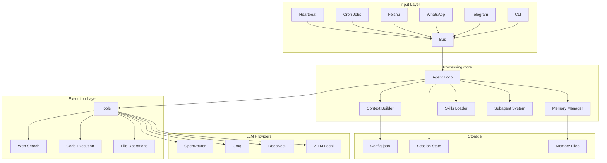
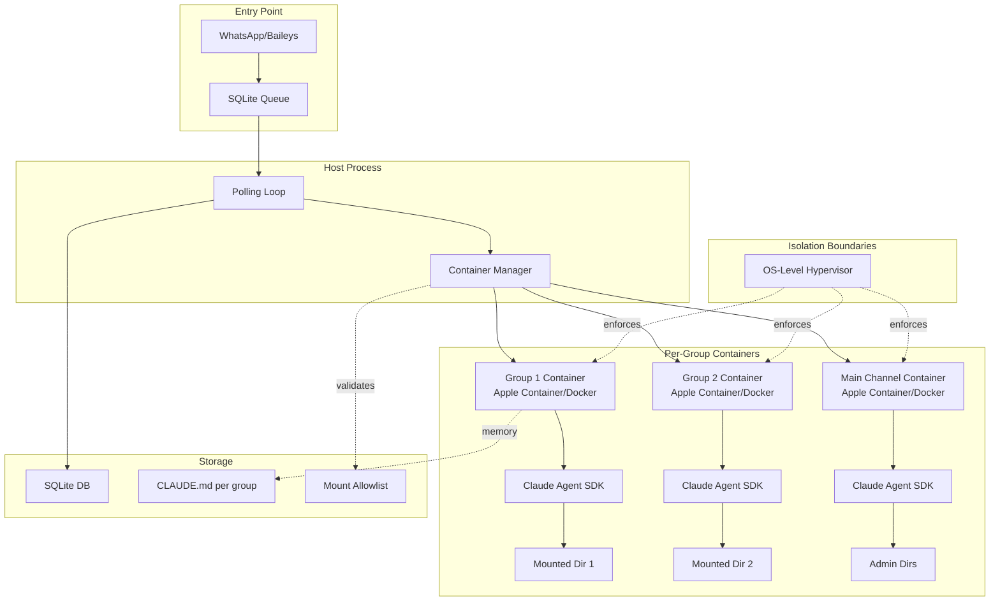
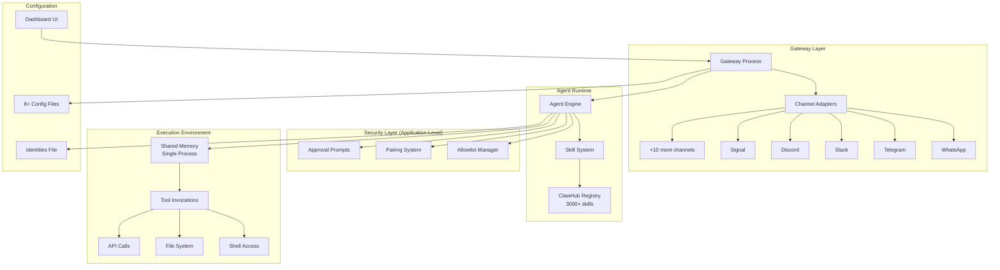
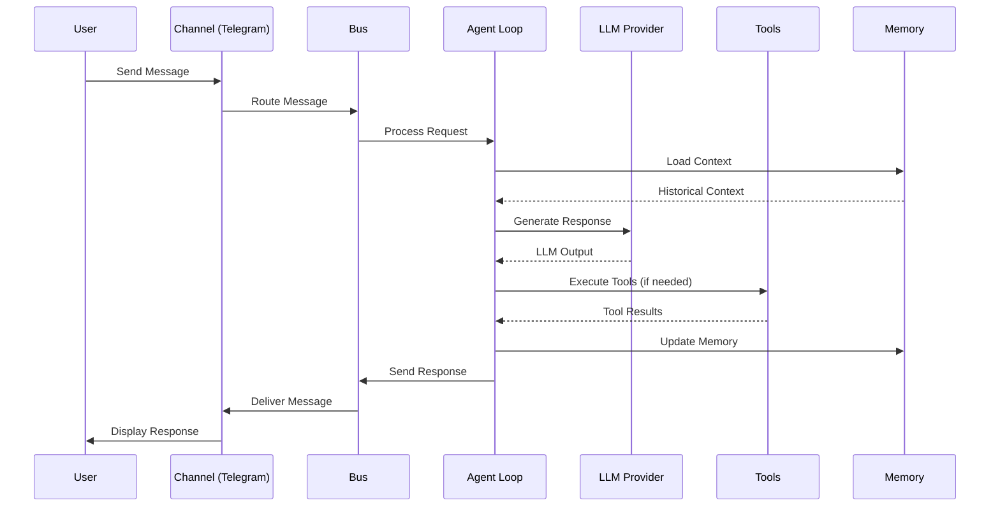
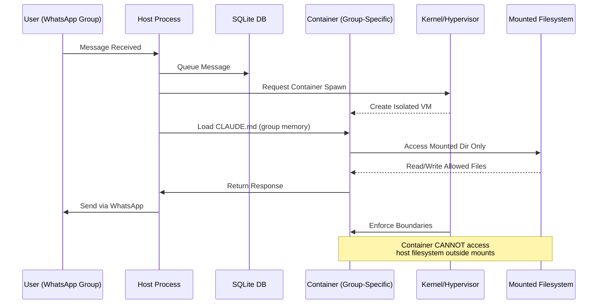
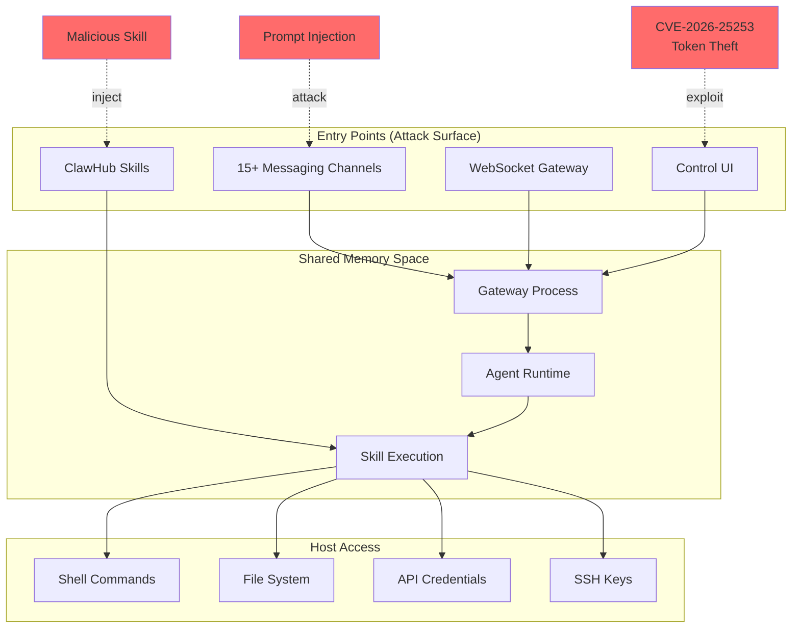

# NanoBot vs NanoClaw vs OpenClaw: Technical Analysis & Security Comparison
**Created:** February 6, 2026

---
## Executive Summary
This document provides a comprehensive technical analysis of NanoBot and OpenClaw (formerly Clawdbot/Moltbot), two AI assistant frameworks with fundamentally different architectural philosophies. Based on verified sources from February 2026, this analysis covers:
- **NanoBot**: Ultra-lightweight (~4,000 LOC), research-focused AI assistant from HKUDS
- **NanoClaw**: Security-hardened fork (~500 LOC core) using container isolation
- **OpenClaw**: Full-featured platform (~170k GitHub stars, ~430k+ LOC)
---
## 1. Project Overview (Verified Feb 2026)
### NanoBot (HKUDS)
- **GitHub**: `HKUDS/nanobot`
- **Stars**: 9.3k
- **Forks**: 1.2k
- **Launch Date**: February 2, 2026
- **Latest Version**: v0.1.3.post4 (Feb 4, 2026)
- **Code Size**: ~4,000 lines of Python (99% smaller than OpenClaw)
- **License**: MIT
- **Philosophy**: Research-ready, minimal, educational
### NanoClaw (Security Fork)
- **GitHub**: `gavrielc/nanoclaw`
- **Stars**: 5.4k
- **Forks**: 581
- **Launch Date**: ~February 2, 2026
- **Latest Release**: None published
- **Code Size**: ~500 lines TypeScript core
- **License**: MIT
- **Philosophy**: Security-first through OS-level container isolation
### OpenClaw
- **GitHub**: `openclaw/openclaw`
- **Stars**: 170k
- **Forks**: 27.3k
- **Code Size**: ~430,000 lines
- **History**:
  - Nov 2025: Launched as "Clawdbot"
  - Jan 27, 2026: Renamed to "Moltbot" (trademark issues)
  - Jan 30, 2026: Renamed to "OpenClaw"
- **License**: MIT
- **Philosophy**: Feature-complete personal AI assistant
---
## 2. Architecture Comparison
### 2.1 Core Architecture
#### NanoBot Architecture

#### NanoClaw Architecture

#### OpenClaw Architecture

### 2.2 Component Breakdown
| Component | NanoBot | NanoClaw | OpenClaw |
|-----------|---------|----------|----------|
| **Core LOC** | ~4,000 | ~500 | ~430,000 |
| **Dependencies** | Minimal (~10-15) | <10 | 45+ |
| **Modules** | ~10 core | 4 files | 52+ |
| **Channels** | 3 (Telegram/WhatsApp/Feishu) | 1 (WhatsApp, extensible) | 15+ out-of-box |
| **Config Files** | 1 (config.json) | 0 (code-based) | 8+ |
| **Skill System** | Built-in skills folder | Claude Code skills | ClawHub (3000+ skills) |
| **Database** | File-based | SQLite | Complex state management |
| **Process Model** | Single Python | Single Node.js | Single Node.js |
| **Isolation** | Process-level | Container per group | Shared memory |
---
## 3. Security Analysis
### 3.1 OpenClaw Security Issues (Verified)
#### CVE-2026-25253: One-Click RCE
- **CVSS Score**: 8.8 (High)
- **Disclosed**: February 2, 2026
- **Patched**: v2026.1.29 (Jan 30, 2026)
- **Discoverer**: DepthFirst (Mav Levin)
**Attack Vector:**
1. Victim clicks malicious link with crafted `gatewayUrl` parameter
2. Control UI auto-connects to attacker's WebSocket without validation
3. Stored auth token sent to attacker server
4. Cross-Site WebSocket Hijacking (CSWSH) bypasses localhost restrictions
5. Attacker disables sandboxing and approval prompts via API
6. Remote code execution achieved
**Impact:**
- Full gateway compromise
- Access to all stored credentials
- Arbitrary code execution on host
- Data exfiltration
#### Additional Security Concerns
**Supply Chain Risks:**
- **341-900+ malicious skills** identified in ClawHub (Feb 2026 reports from Koi Security, Bitdefender)
- Skill ecosystem attack surface: 20%+ malicious rate reported
- No mandatory skill review process
- Backdoor injection trivial (documented by Jamieson O'Reilly)
**Command Injection Vulnerabilities:**
- CVE-2026-24763 and CVE-2026-25157: Two high-impact command injection CVEs (Feb 2-3, 2026)
- Details: OS command injection in SSH handling and other areas
**Cost/DoS Issues:**
- Heartbeat inefficiency: $20 API costs overnight for simple time checks
- 120k tokens sent per 30-min cron job in documented case
- Potential $750/month for basic reminders
**Application-Level Security:**
- All protection via allowlists, pairing codes, approval prompts
- Shared memory architecture (single process)
- Security controls bypassable via API once compromised
**Other Risks:**
- Data leakage across sessions and channels
- Prompt injection vulnerabilities (70% success rate in tests)
- Plaintext credential exposure
### 3.2 NanoBot/NanoClaw Security Model
#### NanoBot Security Features
✅ **Minimal Attack Surface**: 99% less code than OpenClaw
✅ **No External Skill Registry**: All skills in core repository
✅ **Single Config File**: Reduced misconfiguration risk
✅ **Transparent Code**: Auditable in ~1 hour for developers
✅ **Local LLM Support**: Privacy via vLLM
✅ **Channel Allowlists**: Permissioned access (e.g., `allowFrom` in Telegram)
#### NanoClaw Security Enhancements
✅ **OS-Level Isolation**: Apple Container (macOS) or Docker containers
✅ **Per-Group Sandboxing**: Each chat group = separate container + filesystem
✅ **Hypervisor Enforcement**: Security at kernel level, not app level
✅ **Mount Allowlist**: External directory validation with symlink attack prevention
✅ **No Shared Memory**: Containers isolated from host and each other
✅ **Filesystem Boundaries**: Agents see only explicitly mounted directories
**Security Comparison:**
| Security Feature | OpenClaw | NanoBot | NanoClaw |
|-----------------|----------|---------|----------|
| **Isolation Level** | Application | Process | OS/Hypervisor |
| **Attack Surface** | 430k LOC, 52 modules | 4k LOC, 10 modules | 500 LOC core |
| **Skill Validation** | ClawHub (unvetted) | Core only | Claude Code (manual) |
| **Container Support** | Optional (Docker) | No | Required (Apple/Docker) |
| **Credential Storage** | Plaintext in config | Config.json | Code-based |
| **Bypass Resistance** | Low (API-based) | Medium | High (kernel-level) |
---
## 4. Setup & Deployment
### 4.1 NanoBot Setup
```bash
# Prerequisites: Python 3.8+, pip
# 1. Clone repository
git clone https://github.com/HKUDS/nanobot.git
cd nanobot
# 2. Install from source
pip install -e . --break-system-packages
# 3. Configure
# Edit ~/.nanobot/config.json
{
  "llm": {
    "provider": "openrouter",
    "model": "anthropic/claude-sonnet-4-5",
    "apiKey": "YOUR_API_KEY"
  },
  "channels": {
    "telegram": {
      "enabled": true,
      "token": "YOUR_BOT_TOKEN",
      "allowFrom": ["YOUR_USER_ID"]
    }
  },
  "webSearch": {
    "provider": "brave",
    "apiKey": "YOUR_BRAVE_API_KEY"
  }
}
# 4. Run
nanobot
# 5. Add cron jobs (optional)
nanobot cron add --name "daily" --message "Good morning!" --cron "0 9 * * *"
nanobot cron list
```
**Supported Providers:**
- OpenRouter
- Groq
- DeepSeek
- vLLM (local)
- Minimax
### 4.2 NanoClaw Setup
```bash
# Prerequisites: macOS Tahoe (26+) or Linux with Docker, Node.js 18+
# 1. Clone repository
git clone https://github.com/gavrielc/nanoclaw.git
cd nanoclaw
# 2. Use Claude Code for setup
claude
# Then run: /setup
# Claude Code handles:
# - Dependency installation
# - Authentication configuration
# - Container runtime setup
# - Service configuration
```
**Container Requirements:**
- **macOS**: Apple Container (native to macOS Tahoe/26+)
- **Linux**: Docker Desktop
**Key Commands (via Claude Code):**
- `/add-telegram` - Add Telegram channel
- `/add-gmail` - Add Gmail integration
- `/debug` - Troubleshoot issues
- `/clear` - Compact conversation context
### 4.3 OpenClaw Setup
```bash
# Prerequisites: Node.js 22+, npm/pnpm
# 1. Install via npm (stable channel)
npm install -g openclaw@latest
openclaw onboard --install-daemon
# OR: Build from source
git clone https://github.com/openclaw/openclaw.git
cd openclaw
pnpm install
pnpm ui:build
pnpm build
pnpm openclaw onboard --install-daemon
# 2. Configure channels
openclaw pairing approve <channel> <code>
# 3. Manage
openclaw gateway --port 18789 --verbose
openclaw agent --message "Hello" --thinking high
openclaw doctor # Security audit
# 4. Update
openclaw update --channel stable|beta|dev
```
**Daemon Installation:**
- **macOS**: launchd user service
- **Linux**: systemd user service
**Security Hardening (Recommended):**
```bash
# Use openclaw-ansible for VPS deployments
# Includes: Tailscale VPN, UFW firewall, Docker isolation
```
---
## 5. Use Case Matrix
| Use Case | NanoBot | NanoClaw | OpenClaw |
|----------|---------|----------|----------|
| **Research/Education** | ✅ Ideal | ⚠️ Overkill | ❌ Too complex |
| **Personal Assistant** | ✅ Good | ⚠️ Limited features | ✅ Feature-rich |
| **Multi-Platform Messaging** | ⚠️ 3 channels | ❌ WhatsApp only | ✅ 15+ channels |
| **Security-Critical** | ⚠️ Moderate | ✅ Best-in-class | ❌ High risk |
| **Low Resource** | ✅ Fast startup | ✅ Minimal footprint | ❌ Heavy |
| **Customization** | ✅ Easy to modify | ✅ Claude Code skills | ⚠️ Complex codebase |
| **Skill Ecosystem** | ❌ Core only | ❌ Manual skills | ✅ 3000+ skills |
| **Cost Efficiency** | ✅ Cron optimization | ✅ Minimal API calls | ⚠️ Potential $100s/mo |
| **Enterprise** | ❌ Not suitable | ❌ Not suitable | ⚠️ Compliance issues |
---
## 6. Performance Metrics
### Startup Time
- **NanoBot**: <5 seconds (Python)
- **NanoClaw**: <3 seconds (Node.js, no UI)
- **OpenClaw**: 10-20 seconds (full gateway + UI)
### Memory Footprint
- **NanoBot**: ~100-200 MB
- **NanoClaw**: ~50-100 MB per container
- **OpenClaw**: ~500 MB - 1 GB (with all channels)
### API Token Efficiency
- **NanoBot**: Optimized context management
- **NanoClaw**: Minimal context per group
- **OpenClaw**: Documented inefficiencies (120k tokens for time checks)
---
## 7. Decision Matrix for Architects
### Choose NanoBot if:
- ✅ You want a **learning/research** platform
- ✅ You need **transparency** (full codebase review in 1-2 hours)
- ✅ You prefer **Python** ecosystem
- ✅ You want **multi-channel** (Telegram/WhatsApp/Feishu) out-of-box
- ✅ You need **local LLM** support (vLLM)
- ✅ You value **rapid iteration** and customization
### Choose NanoClaw if:
- ✅ **Security is paramount** (financial, legal, sensitive data)
- ✅ You run on **macOS Tahoe+** (Apple Container native)
- ✅ You want **kernel-level isolation** per chat group
- ✅ You're comfortable with **Claude Code** for feature additions
- ✅ You prefer **minimal dependencies** (<10)
- ✅ You need **auditable codebase** (500 LOC core)
### Choose OpenClaw if:
- ✅ You need **15+ messaging platforms** immediately
- ✅ You want **3000+ community skills** (ClawHub)
- ✅ You accept **security trade-offs** for features
- ✅ You have **dedicated security team** to monitor
- ✅ You're willing to pay **$100-500+/month** in API costs
- ✅ You need **rich ecosystem** and community support
### Avoid OpenClaw if:
- ❌ You handle **sensitive credentials** or data
- ❌ You lack **security expertise** to audit skills
- ❌ You're on a **tight budget** (API costs can spike)
- ❌ You cannot **regularly update** for security patches
- ❌ You're in a **regulated industry** (finance, healthcare)
---
## 8. Security Best Practices
### For Any AI Assistant Deployment:
1. **Network Isolation**
   - Run on isolated VLANs or VPNs (e.g., Tailscale)
   - Disable public SSH
   - Use firewall rules (UFW on Linux)
2. **Credential Management**
   - Rotate API keys monthly
   - Use environment variables, not plaintext config
   - Monitor token usage for anomalies
3. **Container Best Practices** (NanoClaw)
   - Mount only necessary directories
   - Use read-only mounts where possible
   - Validate mount allowlist regularly
4. **Skill/Extension Vetting** (OpenClaw)
   - Audit all ClawHub skills before installation
   - Monitor `~/.openclaw/skills/` for changes
   - Use `openclaw doctor` for security checks
5. **Monitoring**
   - Log all agent actions
   - Alert on unexpected API spikes
   - Review conversation history for anomalies
6. **Least Privilege**
   - Run as non-root user
   - Limit filesystem access
   - Disable unnecessary channels
---
## 9. Mermaid Diagrams: Data Flow
### NanoBot Data Flow

### NanoClaw Isolation Flow

### OpenClaw Attack Surface

---
## 10. Cost Analysis (Monthly API Estimates)
| Scenario | NanoBot | NanoClaw | OpenClaw |
|----------|---------|----------|----------|
| **Minimal Use** (10 msgs/day) | $5-10 | $3-7 | $10-20 |
| **Moderate Use** (50 msgs/day) | $20-40 | $15-30 | $50-100 |
| **Heavy Use** (200 msgs/day) | $80-150 | $60-100 | $200-400 |
| **With Inefficient Cron** | +$10-30 | +$5-15 | +$100-750 |
| **Skill Ecosystem Overhead** | None | None | +$50-200 |
**Cost Optimization Tips:**
- Use local models (vLLM with NanoBot)
- Minimize cron job context (NanoClaw's per-group memory helps)
- Monitor token usage with provider dashboards
- Use cheaper models (e.g., DeepSeek) for routine tasks
---
## 11. Migration Paths
### From OpenClaw → NanoBot
1. Export conversation history (manual)
2. Audit installed skills → identify needed functionality
3. Replicate core skills in NanoBot's skills folder
4. Migrate channel configs (Telegram, WhatsApp)
5. Test thoroughly before shutdown
### From OpenClaw → NanoClaw
1. **Security-critical migrations only**
2. Accept loss of multi-channel support (WhatsApp only initially)
3. Use Claude Code to add essential features via `/add-*` commands
4. Migrate per-chat contexts to per-group containers
5. Validate mount allowlists for sensitive directories
### From NanoBot → OpenClaw
**Not recommended** due to security risks. If required:
1. Freeze NanoBot instance
2. Install OpenClaw with minimal channels
3. Enable Docker sandboxing
4. Use `openclaw doctor` for security audit
5. Manually approve all skills before installation
---
## 12. Future Roadmap (Based on Feb 2026 Activity)
### NanoBot (HKUDS)
- Docker support (v0.1.3.post4 added)
- More LLM providers (DeepSeek added Feb 5)
- Enhanced scheduling (improved in latest release)
- Community contributions (162 issues, 78 PRs as of Feb 6)
- Voice transcription, multi-modal support, long-term memory, improved reasoning, expanded integrations (Discord, Slack, email, calendar)
### NanoClaw
- Linux/Docker port (via Claude Code skills)
- Additional channels (Telegram, Gmail via skills)
- Improved IPC-MCP tools
- Community-driven skill library (manual curation)
### OpenClaw
- Security patches (3 CVEs in 3 days, Feb 2-4)
- ClawHub moderation (response to 341 malicious skills)
- Cost optimization (heartbeat efficiency)
- Enterprise compliance features (TBD)
---
## 13. Conclusion
### Summary Table
| Criterion | Winner |
|-----------|--------|
| **Security** | NanoClaw (OS-level isolation) |
| **Simplicity** | NanoClaw (500 LOC) |
| **Features** | OpenClaw (3000+ skills, 15+ channels) |
| **Research/Education** | NanoBot (4k LOC, transparent) |
| **Cost Efficiency** | NanoClaw (minimal context overhead) |
| **Ecosystem** | OpenClaw (ClawHub, community) |
| **Enterprise Readiness** | None (all require hardening) |
### Key Takeaways
1. **NanoBot**: Best for developers who want to **learn** AI agent internals, customize heavily, and maintain full control with minimal dependencies.
2. **NanoClaw**: Best for **security-conscious** users who prioritize trust and isolation over feature breadth. Ideal for handling sensitive data.
3. **OpenClaw**: Best for **power users** who need extensive integrations immediately and have the security expertise to monitor and harden the deployment.
### The Fundamental Trade-Off
> **Complexity vs. Trust**: OpenClaw offers a "batteries-included" experience with 52 modules and 3000+ skills, but this convenience introduces significant security risks. NanoBot/NanoClaw demonstrate that 99% of the code can be eliminated while retaining core functionality—at the cost of ecosystem convenience.
### Recommendations for Developers
- **Prototype/Learn**: Start with NanoBot
- **Production (Sensitive)**: Use NanoClaw with extensive testing
- **Production (Feature-rich)**: Use OpenClaw only with:
  - Dedicated security team
  - Regular audits of installed skills
  - Container sandboxing enabled
  - Network isolation (VPN)
  - Automated token usage monitoring
---
## 14. References
### Primary Sources (Verified Feb 6, 2026)
- NanoBot GitHub: https://github.com/HKUDS/nanobot (9.3k stars)
- NanoClaw GitHub: https://github.com/gavrielc/nanoclaw (5.4k stars)
- OpenClaw GitHub: https://github.com/openclaw/openclaw (170k stars)
- NVD CVE-2026-25253: https://nvd.nist.gov/vuln/detail/CVE-2026-25253
- DepthFirst Disclosure: https://depthfirst.com/post/1-click-rce-to-steal-your-moltbot-data-and-keys
### Security Research
- Koi Security: 341 malicious ClawHub skills (Feb 2026)
- Jamieson O'Reilly: ClawHub backdoor analysis
- The Register: OpenClaw security coverage
- SecurityWeek: CVE-2026-25253 disclosure
### Technical Analyses
- NanoClaw DeepWiki: https://deepwiki.com/gavrielc/nanoclaw
- Sudheer Singh: "500 Lines vs. 50 Modules" (fumics.in)
- superprompt.com: "Best OpenClaw Alternatives 2026"

**Related:**
- [OpenClaw(Moltbot-or-Clawdbot)-Security-Analysis-Jan-2026](../openclaw/OpenClaw%28Moltbot-or-Clawdbot%29-Security-Analysis-Jan-2026.md) — Full CVE-2026-25253 write-up and threat forecast for the OpenClaw column in the security table.
- [OpenClaw(Moltbot-or-Clawdbot)-Architecture](../openclaw/OpenClaw%28Moltbot-or-Clawdbot%29-Architecture.md) — Architecture details behind OpenClaw's shared-memory, single-process model critiqued in the comparison.
- [Securing-OpenClaw-Setup](../openclaw/Securing-OpenClaw-Setup.md) — Hardened VPS + Tailscale setup that directly mitigates the OpenClaw deployment risks listed in Section 3.
- [AI-Coding-Loops](../development/AI-Coding-Loops.md) — Autonomy-loop framework that explains when NanoBot/NanoClaw/OpenClaw's design trade-offs actually matter in practice.
