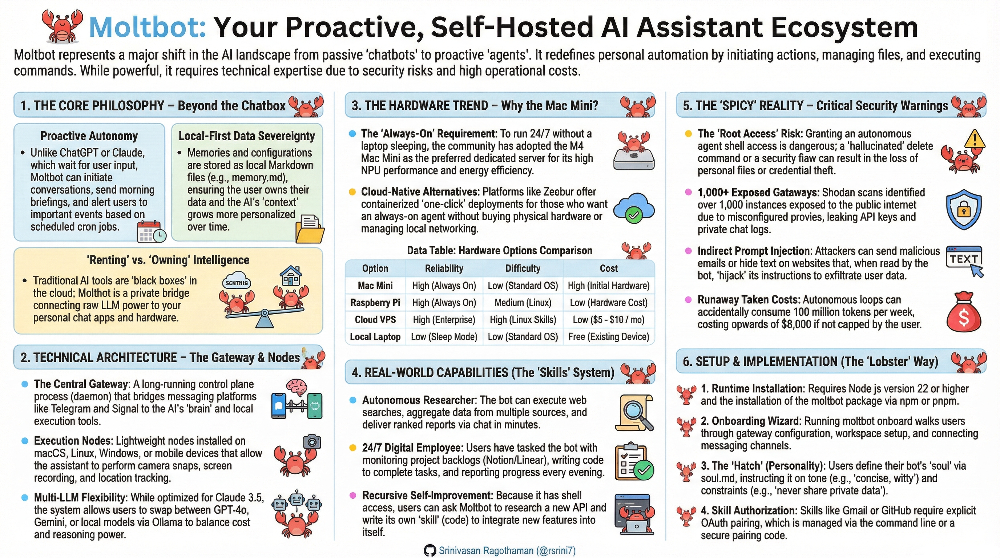
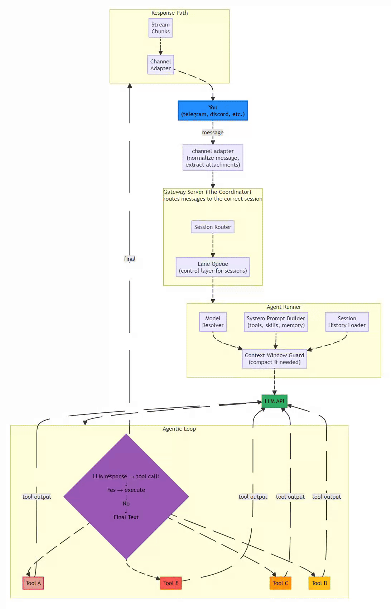

# OpenClaw (formerly Moltbot / Clawdbot) Architecture

> *“Moltbot is a deterministic, local-first agent runtime that prioritizes explainability and user control over unchecked autonomy.”*

**Further Read on Security Aspects**: 
- OpenClaw(Moltbot-or-Clawdbot) Security Analysis Jan-2026 -Security-Analysis-Jan-2026.md)

---

## Overview
OpenClaw previously known as Moltbot, Clawdbot, is a self-hosted AI agent designed to operate as a personal assistant across various messaging platforms. It emphasizes simplicity, determinism, and user empowerment, allowing seamless integration into daily workflows. Unlike cloud-based chatbots that require users to initiate interactions, Moltbot can be proactive, persistent in memory, and capable of executing real-world actions through tools. This architecture enables it to function as an always-available companion, handling tasks from research to automation while running on affordable hardware like a $5/month VPS.

The OpenClaw project (an open-source AI agent) underwent multiple rebrands in early 2026 due to trademark issues and strategic decisions. Anthropic prompted the initial shift from Clawdbot (with its "Clawd" mascot) to Moltbot over similarity to "Claude." [laravel-news](https://laravel-news.com/clawdbot-rebrands-to-moltbot-after-trademark-request-from-anthropic)

## Rebrand Timeline
- **Clawdbot to Moltbot (Jan 26-27, 2026)**: Anthropic's legal team flagged trademark confusion; creator Peter Steinberger embraced "Moltbot" as a lobster-themed metaphor for growth (lobsters molt shells). [forbes](https://www.forbes.com/sites/ronschmelzer/2026/01/27/viral-ai-sidekick-clawdbot-changes-name-to-moltbot-and-sheds-its-old-skin/)
- **Moltbot to OpenClaw (Jan 30, 2026)**: Just days later, the team rebranded again for a "permanent, serious identity" aimed at enterprise adoption, avoiding further disruptions like scammer hijacks of old handles. [forbes](https://www.forbes.com/sites/ronschmelzer/2026/01/30/moltbot-molts-again-and-becomes-openclaw-pushback-and-concerns-grow/)

## Why "OpenClaw"?
It retains the "Claw" nod to the lobster mascot and original Clawdbot heritage while prefixing "Open" to highlight its open-source nature, signaling transparency and community focus for long-term stability. This avoids playful but risky names like Moltbot, positioning it better amid growing security/privacy concerns. [sterlites](https://sterlites.com/blog/moltbot-local-first-ai-agents-guide-2026)

Key Benefits:
- **Proactive Assistance**: Schedules briefings, reminders, and alerts without user prompting.
- **Persistent Memory**: Retains context across sessions for consistent, personalized interactions.
- **Extensibility**: Modular design supports custom skills for web browsing, email management, and more.
- **Privacy-Focused**: Runs locally or on user-controlled servers, minimizing data exposure.

## Core Technology
- **TypeScript CLI Application**: Chosen for strong type safety in tool schemas, precise async control, and seamless multi-channel integration (unlike Python's runtime ambiguities or web apps' overhead).
- **Local Execution**: Runs as a daemon on user hardware or VPS, exposing a gateway server for channels like Telegram, WhatsApp, Slack, Discord, Signal, and even iMessage.
- **LLM Integration**: Calls APIs from providers like Claude, GPT, or local models, with fallback mechanisms for reliability.
- **Tool Execution**: Performs actions locally, including shell commands, file operations, and browser automation.

## High-Level Components
Moltbot's design revolves around four interconnected components for robust, maintainable operation:

- **Gateway**: Acts as the front door, handling inbound/outbound messages, authentication, and scheduling (e.g., cron jobs for proactive features).
- **Agent**: The core intelligence layer that interprets intents, plans actions, and orchestrates executions using dynamic prompts.
- **Skills**: Modular extensions enabling specialized capabilities, such as web research, email integration, or custom automations. Skills are discoverable via repositories like ClawdHub.
- **Memory**: A persistent storage system ensuring long-term context retention without automatic decay.

## Architecture Flow

The flow ensures serialized, deterministic processing to maintain explainability:

1. **Channel Adapter**  
   - Normalizes incoming messages and attachments from diverse platforms, ensuring consistent input for the agent.

2. **Gateway Server (The Coordinator)**  
   - Routes messages to appropriate sessions.  
   - Employs a **lane-based command queue** for serialization, avoiding async complexities.  
   - Defaults to serial execution; parallel processing is opt-in only for verified safe scenarios.  
   - Mitigates race conditions and ensures clear, non-interleaved logs.

3. **Agent Runner**  
   - Selects the optimal LLM model and API key, with intelligent fallback.  
   - Dynamically constructs system prompts incorporating tools, skills, memory, and session history.  
   - Includes a Context Window Guard to compact or summarize overflowing contexts, preserving efficiency.

4. **LLM API Call**  
   - Streams responses from abstracted providers (e.g., Claude, OpenAI, local models).  
   - Supports extended reasoning modes for complex tasks.

5. **Agentic Loop**  
   - Executes tool calls locally and appends results to the conversation.  
   - Iterates until a final response or maximum turns (≈20) is reached.  
   - Manages advanced capabilities like computer use and skill integration.

6. **Response Path**  
   - Delivers outputs back through the originating channel.  
   - Persists sessions in JSONL format for easy inspection and recovery.

## Memory System

Moltbot employs a transparent, user-editable memory approach to foster trust:

**Two-Tier Structure:**
- **Session Transcripts**: Stored as JSONL files for chronological conversation logs.
- **Memory Files**: Markdown-based in `MEMORY.md` or a dedicated `memory/` folder for key insights and preferences.

**Search Mechanism:**
- **Hybrid Retrieval**: Combines vector search (via SQLite embeddings) for semantic matches with keyword search (FTS5) for precision.
- Captures both conceptual similarities and exact terms.

**Key Characteristics:**
- **Simplicity First**: No automated merging, compression, or decay—old memories hold equal weight to new ones.
- **User Control**: Agents write memories using standard file tools; users can edit or delete directly.
- **Scalability**: File-based storage allows easy inspection and reversion (e.g., via Git integration for version control).

This design optimizes for debuggability and reversibility, turning potential complexity into a user-centric feature.

## Computer Use Capabilities

Moltbot provides powerful, controlled access to system resources:

**Execution Tools:**
- **Shell Commands**: Via `exec` tool, supporting sandboxed (Docker), host, or remote environments.
- **Filesystem Operations**: Read, write, and edit files with fine-grained permissions.
- **Browser Automation**: Playwright-based with semantic snapshots for efficient interaction.
- **Process Management**: Run background commands, monitor, and terminate processes.

**Safety Measures:**
- **Allowlist System**: Prompts for user approval (once, always, or deny) on new commands/tools.
- **Pre-Approved Safe Commands**: Includes utilities like `jq`, `grep`, `cut`, `sort`—blocks risky patterns (e.g., substitutions, redirections, chaining, subshells).
- **Proactive Guardrails**: Hard limits on loops and executions prevent unintended escalation.

**Browser: Semantic Snapshots**
- Utilizes text-based ARIA accessibility trees instead of screenshots.
- Represents elements with references, e.g., `button "Sign In" [ref=1]`.
- **Advantages**: Reduces size (50 KB vs. 5 MB), lowers token costs, enables non-visual browsing, and improves accessibility.

## Comparison to Other AI Assistants

| Feature                  | Moltbot                  | Siri/Google Assistant    | ChatGPT/Claude           |
|--------------------------|--------------------------|--------------------------|--------------------------|
| **Hosting**              | Self-hosted (local/VPS)  | Cloud-only               | Cloud-only               |
| **Proactivity**          | Yes (schedules/briefings)| Limited (reminders only) | No (reactive only)       |
| **Memory Persistence**   | Full, editable files     | Session-based, forgets   | Subscription-dependent   |
| **Tool Integration**     | Modular skills, browser  | Limited APIs             | Plugins (web-only)       |
| **Privacy**              | User-controlled data     | Vendor access            | Vendor access            |
| **Customization**        | Open-source, editable    | Minimal                  | Prompt-based only        |
| **Cost**                 | VPS (~$5/mo) + API usage | Free (with data trade)   | Subscription ($20+/mo)   |

This table highlights Moltbot's edge in autonomy and control, making it ideal for power users and developers.

## Key Design Philosophy
- **Serial by Default, Parallel Explicitly**: Prioritizes determinism to avoid race conditions in side-effect-heavy systems.
- **Simplicity Over Complexity**: Focuses on explainable, maintainable code—e.g., lane queues over async spaghetti.
- **User Autonomy**: Grants as much access as the user permits, with transparent mechanisms for oversight and intervention.

## What Enterprise Reviewers Will Challenge (and How to Answer)

Anticipating scrutiny in professional evaluations:

### ❓ “Why not Python?”
**Answer:**  
> TypeScript provides stronger type contracts for tool schemas, superior async execution control, and streamlined multi-channel integration without runtime ambiguities.  

This ensures reliability in agentic environments.

### ❓ “Why not event-driven async?”
**Answer:**  
> Agentic systems thrive on side effects; determinism outperforms raw throughput. Parallelism is opt-in only after safety validation.  

A mature stance for mission-critical applications.

### ❓ “Isn’t the memory system too primitive?”
**Answer:**  
> Intentionally so—memory remains user-owned, inspectable, and reversible. We prioritize trust and debuggability over opaque "intelligence."  

Transforms critique into a strength.

### ❓ “What prevents runaway automation?”
**Answer:**  
> Enforced turn limits, allowlisted tools, user approvals, and serial execution ensure no silent privilege escalation.  

Robust and defensible safeguards.

## References

https://x.com/hesamation/status/2017038553058857413

https://www.mmntm.net/articles/building-clawdbot

**Related:**- [OpenClaw-Whitepaper](OpenClaw-Whitepaper.md) — Broader executive white paper covering OpenClaw's rise, creator biography, security incidents, and economics beyond this doc's pure-architecture scope.- [OpenClaw(Moltbot-or-Clawdbot)-Security-Analysis-Jan-2026](OpenClaw(Moltbot-or-Clawdbot)-Security-Analysis-Jan-2026.md) — Detailed vulnerability catalog (gateway auth bypass, prompt injection, Node.js CVEs) covering the risks introduced by the gateway, memory, and tool layers described here.- [claw-ecosystem](claw-ecosystem.md) — Compares OpenClaw's TypeScript/serial/lane-queue design against alternative agents' process, container, and WASM isolation strategies.- [nanobot-architecture-deep-dive](../nanobot/nanobot-architecture-deep-dive.md) — NanoBot runtime architecture (~3,500 LOC Python) that contrasts OpenClaw's 430k LOC shared-memory daemon with a minimal audit-friendly alternative.
