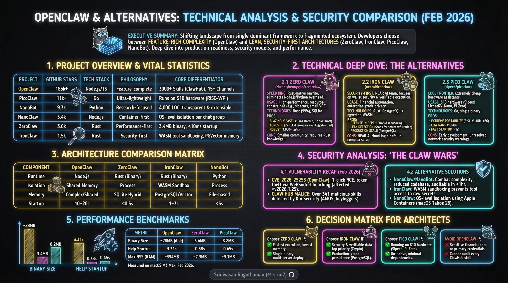
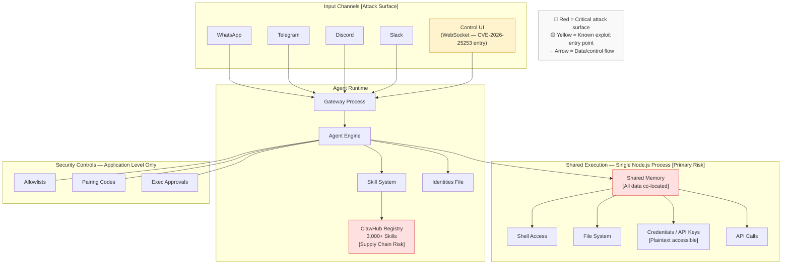
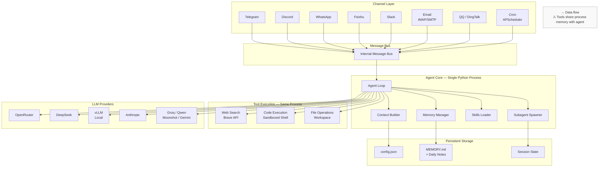
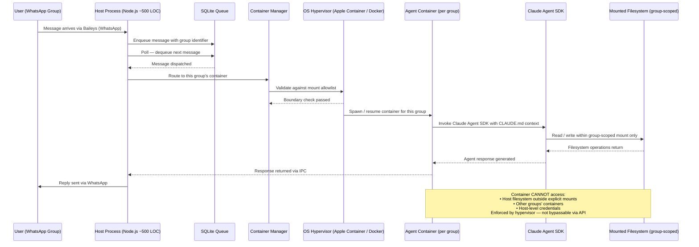
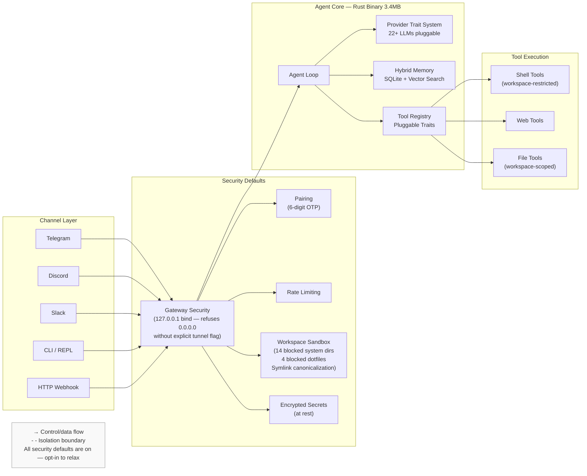
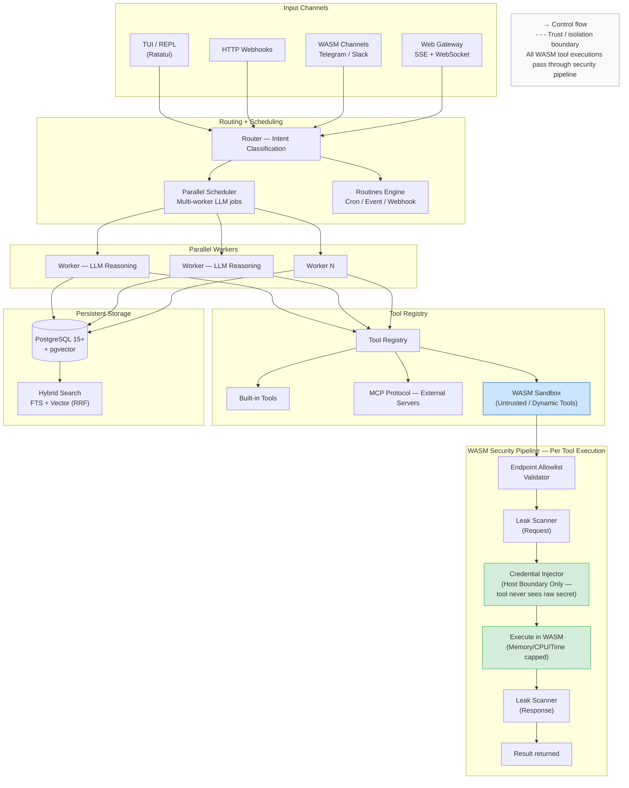
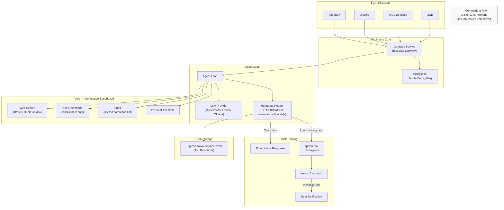
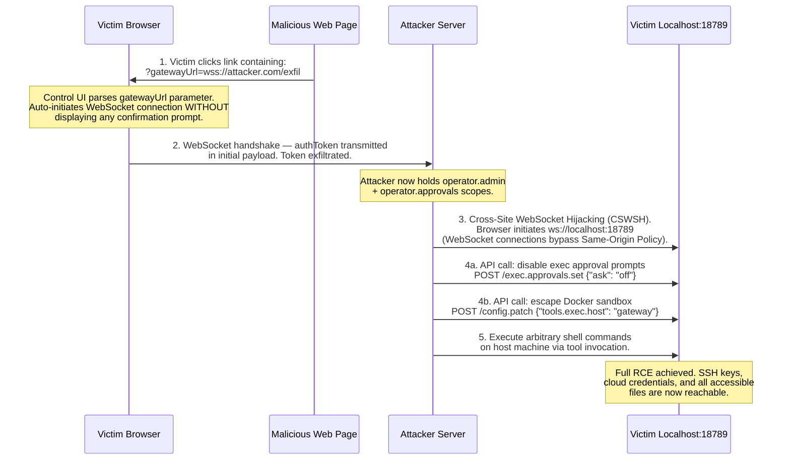
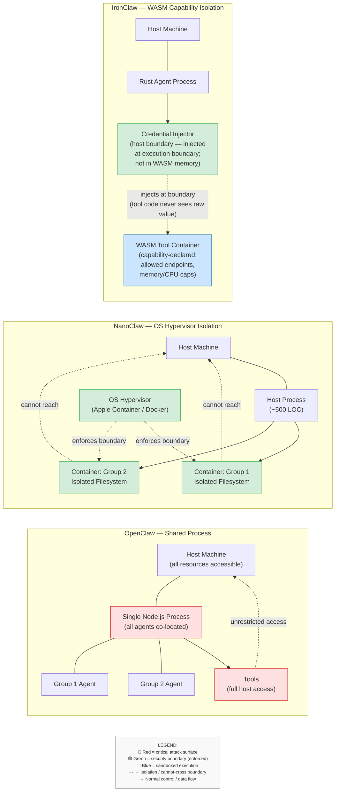
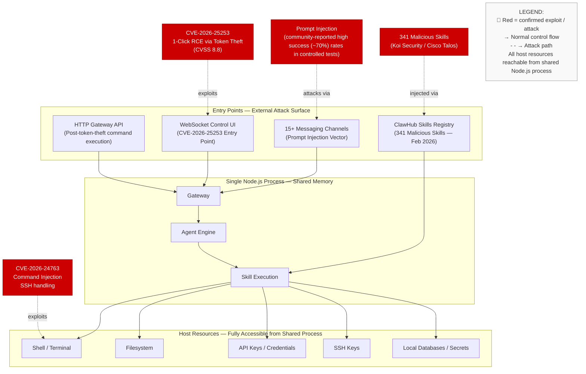

# AI Agent Ecosystem: Technical Analysis & Security Reference

## OpenClaw, NanoBot, NanoClaw, ZeroClaw, IronClaw, PicoClaw



---

> **Scope & Neutrality Statement:** This document analyses architectural tradeoffs and security boundaries across projects in the AI personal-assistant agent ecosystem. It does not endorse or discourage adoption of any specific project. All projects described are under active development; capabilities, security posture, and maturity levels are subject to change. Readers should verify current status directly against primary sources before making deployment decisions.

---

## Table of Contents

1. [Ecosystem Origin & Context](#1-ecosystem-origin--context)
2. [Ecosystem Map & Project Inventory](#2-ecosystem-map--project-inventory)
3. [Project Deep Dives](#3-project-deep-dives)
   - 3.1 [OpenClaw — High-Risk Architecture Profile](#31-openclaw)
   - 3.2 [NanoBot — Research-Grade Minimal Agent](#32-nanobot)
   - 3.3 [NanoClaw — Container-Isolated Agent](#33-nanoclaw)
   - 3.4 [ZeroClaw — Performance-First Rust Agent](#34-zeroclaw)
   - 3.5 [IronClaw — Capability-Isolated WASM Agent](#35-ironclaw)
   - 3.6 [PicoClaw — Edge-Hardware Go Agent](#36-picoclaw)
   - 3.7 [SafeClaw & ThePopeBot — Early-Stage Projects](#37-safeclaw--thepopebot)
4. [Threat Model](#4-threat-model)
5. [Security Analysis](#5-security-analysis)
   - 5.1 [CVE-2026-25253: Architectural Implications](#51-cve-2026-25253)
   - 5.2 [ClawHub Supply Chain Risk](#52-clawhub-supply-chain-risk)
   - 5.3 Additional CVEs (Feb 2–4, 2026)
   - 5.4 [Security Model Comparison Matrix](#54-security-model-comparison-matrix)
   - 5.5 [Enterprise & Compliance Considerations](#55-enterprise--compliance-considerations)
   - 5.6 [Security Best Practices](#56-security-best-practices)
6. [Architecture Diagrams](#6-architecture-diagrams)
7. [Performance Benchmarks](#7-performance-benchmarks)
8. [Architectural Tradeoff Summary](#8-architectural-tradeoff-summary)
9. [Decision Framework](#9-decision-framework)
10. [Cost Analysis](#10-cost-analysis)
11. [Migration Paths](#11-migration-paths)
    - 11.5 [Limitations of This Analysis](#115-limitations-of-this-analysis)
    - 11.6 [Isolation Boundary Hierarchy](#116-isolation-boundary-hierarchy)
12. [Conclusion](#12-conclusion)
13. [References](#13-references)

---

## 1. Ecosystem Origin & Context

The entire "Claw" ecosystem emerged from a single open-source project that achieved rapid adoption in November 2025, then faced significant security scrutiny in early 2026.

**Peter Steinberger** (founder of PSPDFKit) built a personal project connecting messaging applications to Claude Code. He published it as **Clawdbot**. It accumulated over 100,000 GitHub stars within weeks, with community-reported traffic peaks of approximately 2 million weekly website visitors. Secondary market effects — including reported hardware demand spikes for Mac Mini M4 units — were widely discussed in developer communities but are anecdotal and not independently verified.

### Naming Timeline

| Date | Name | Reason for Change |
|------|------|-------------------|
| Nov 2025 | **Clawdbot** | Original name — "Clawd" + "bot" |
| Jan 27, 2026 | **Moltbot** | Anthropic trademark request; "Clawd" too similar to "Claude" |
| Jan 29–30, 2026 | **OpenClaw** | Final rename with secured domains and trademarks |

The rename created a brief window that malicious actors exploited. A fake `$CLAWD` token on Solana reached a reported ~$16M market cap before collapsing. A typosquatted VS Code extension "ClawdBot Agent" was published carrying malware. Censys independently reported **21,639 publicly exposed OpenClaw instances** as of January 31, 2026.

These events — combined with CVE-2026-25253 disclosures in early February — created the direct conditions for the alternative ecosystem described in this document.

---

## 2. Ecosystem Map & Project Inventory

### GitHub Statistics (Feb 16, 2026)

> All star counts are approximate point-in-time observations. This ecosystem is growing rapidly; treat these as directional indicators, not precise measurements.

| Project | Repository | Stars (approx.) | Language | Core Philosophy | Creator / Maintainer |
|---------|------------|-----------------|----------|-----------------|----------------------|
| **OpenClaw** | `openclaw/openclaw` | ~170–185k | TypeScript / Node.js | Feature-complete, community-driven | Peter Steinberger |
| **NanoBot** | `HKUDS/nanobot` | ~19k | Python | Research-ready, ultra-lightweight | HKU Data Intelligence Lab |
| **NanoClaw** | `gavrielc/nanoclaw` / `qwibitai/nanoclaw` | ~5–8k | TypeScript / Node.js | Container-first, minimal codebase | Gavriel Cohen (Qwibit) |
| **PicoClaw** | `sipeed/picoclaw` | ~11k | Go | Edge hardware, ultra-efficient | Sipeed |
| **ZeroClaw** | `theonlyhennygod/zeroclaw` | ~3.6–4.2k | Rust | Performance-first, binary distribution | Independent |
| **IronClaw** | `nearai/ironclaw` | ~1.5k | Rust | Capability-based WASM isolation | Illia Polosukhin (NEAR AI) |
| **SafeClaw** | `princezuda/safeclaw` | ~43 | Python | Rule-based, no LLM | Independent |
| **ThePopeBot** | `stephengpope/thepopebot` | ~172 | Node.js | GitOps-based autonomous agent | Stephen G. Pope |

> **Note on SafeClaw and ThePopeBot:** Both projects have insufficient activity and documentation to assess architectural risk or maturity. They are summarized briefly in Section 3.7 and excluded from the detailed analysis sections.

### Architecture Philosophy Spectrum

```
← MINIMAL CODE / MAXIMUM ISOLATION          MAXIMUM FEATURES / BROADER ATTACK SURFACE →

NanoClaw ──── NanoBot ──── PicoClaw ──── ZeroClaw ──── IronClaw ──────────── OpenClaw
  500 LOC      4k LOC       ~8MB binary   3.4MB binary   10-15k LOC Rust      430k LOC
  Container    Process      Workspace      Process +       WASM capability     Shared
  per group    isolated     sandbox        encrypted       grants per tool     memory
                                          secrets
```

This spectrum is not a quality ranking. Each position represents a deliberate design philosophy optimized for a specific deployment context and threat model.

---

## 3. Project Deep Dives

---

### 3.1 OpenClaw

**Profile: High-Risk Architecture — Broadest Feature Set in the Ecosystem**

OpenClaw is the "batteries-included" AI agent platform that created this ecosystem. It connects to 15+ messaging platforms, offers 3,000+ community skills via its ClawHub registry, and runs as a persistent daemon on the host machine.

**Core Facts:**
- **Codebase:** ~430,000 lines of TypeScript/Node.js across 52+ modules
- **Channels:** WhatsApp, Telegram, Discord, Slack, Signal, iMessage, and 10+ more
- **Skill Registry:** ClawHub — 3,000+ community-contributed skills
- **Configuration:** 8+ configuration files
- **Process Model:** Single Node.js process, shared memory across all channels and tools
- **Security Model:** Application-level — allowlists, pairing codes, approval prompts
- **License:** MIT

**Distinguishing Characteristics:** The persistent daemon model allows OpenClaw to proactively monitor and act across a user's digital environment — morning briefings, calendar management, email handling, and complex multi-step workflows — all accessible through existing chat apps. It has the largest community, most documentation, and most ready-to-use skills of any project in this ecosystem.

**Architectural Risk:** All channels share a single Node.js process and memory space. Application-level security controls (allowlists, approvals) are enforced by the same runtime that can be compromised. This means a single exploited entry point — a malicious skill, a crafted message, a stolen token — grants access to all credentials, the filesystem, and the shell. See Section 5 for documented exploits.



**Setup:**
```bash
# Node.js 22+ required
npm install -g openclaw@latest
openclaw onboard --install-daemon

# Recommended hardening (do before connecting any channels)
openclaw doctor             # Security audit — resolve all findings first
# VPS deployments: use openclaw-ansible
# Includes: Tailscale VPN, UFW firewall, Docker sandbox for tool execution
```

---

### 3.2 NanoBot

**Profile: Research-Grade Minimal Agent — Transparent, Multi-Channel, Python**

NanoBot was built by the **HKU Data Intelligence Lab** (HKUDS) at the University of Hong Kong as an explicit response to OpenClaw's complexity. Its design goal: retain 95% of core agent capability in 1% of the code, with a codebase any developer can read in one sitting.

**Core Facts:**
- **Codebase:** ~3,536–4,000 lines of Python (actively maintained; LOC varies per commit)
- **Latest Release:** v0.1.3.post7 (Feb 13, 2026)
- **Launch:** February 2, 2026
- **Channels:** Telegram, Discord, WhatsApp, Feishu, Mochat, DingTalk, Slack, Email (IMAP/SMTP), QQ
- **LLM Providers:** OpenRouter, Groq, DeepSeek, vLLM (local), Minimax, Anthropic, Gemini, Moonshot/Kimi, Qwen
- **Memory:** `MEMORY.md` (long-term) + daily notes (`memory/YYYY-MM-DD.md`)
- **Scheduling:** APScheduler-based cron jobs
- **Subagents:** Built-in subagent spawning for parallel tasks
- **License:** MIT

**Distinguishing Characteristics:** Every design decision is made in the open and documented. Adding a new LLM provider takes two steps. The skills folder contains all capabilities. Configuration is a single JSON file. A developer can audit the entire codebase before trusting it with credentials — a property OpenClaw cannot offer.

**Security Posture:** Smaller attack surface than OpenClaw (99% less code), but not architecturally isolated. Tools execute in the same Python process. A compromised model response or a malicious skill could still access the host. This is a meaningful improvement in auditability, not in runtime containment.



**Setup:**
```bash
# Install (uv recommended for speed)
uv tool install nanobot-ai
# OR: pip install nanobot-ai
# OR: git clone https://github.com/HKUDS/nanobot.git && pip install -e .

# Configure (interactive wizard)
nanobot onboard
# Generates ~/.nanobot/config.json

# Minimal config example
cat > ~/.nanobot/config.json << 'EOF'
{
  "providers": {
    "openrouter": { "apiKey": "sk-or-v1-xxx" }
  },
  "agents": {
    "defaults": { "model": "anthropic/claude-opus-4-5" }
  }
}
EOF

# Chat
nanobot agent -m "Summarize my emails from the last 24 hours"

# Cron scheduling
nanobot cron add --name "morning-brief" \
  --message "Give me a morning briefing" \
  --cron "0 9 * * *"
nanobot cron list
```

---

### 3.3 NanoClaw

**Profile: Container-Isolated Agent — OS-Level Security Boundary per Chat Group**

NanoClaw was built by **Gavriel Cohen** (Qwibit AI) around one architectural principle: security guarantees must be enforced at the OS level, not the application level. The codebase is ~500 lines of TypeScript. It runs the Anthropic Agent SDK natively.

**Two Active Repositories:**
- `gavrielc/nanoclaw` — original public repo by Gavriel Cohen
- `qwibitai/nanoclaw` — Qwibit company fork, actively maintained and used in production

**Core Facts:**
- **Codebase:** ~500 lines TypeScript (host process) + Claude Agent SDK
- **Primary Channel:** WhatsApp (via Baileys); Telegram and Gmail addable via Claude Code skills
- **Container Runtime:** Apple Container (macOS Tahoe 26+) or Docker (Linux)
- **State Storage:** SQLite (task queue + scheduling) + `CLAUDE.md` per group (agent memory)
- **Installation Interface:** Claude Code (`claude` → `/setup`)
- **Extensibility:** SKILL.md files that teach Claude Code how to transform the fork
- **License:** MIT

**Distinguishing Characteristics:** Each WhatsApp group gets its own Linux container with an isolated filesystem and a separate mounted working directory. A compromised agent in Group A's container cannot read Group B's files, and cannot access the host filesystem outside explicitly mounted directories. This guarantee is enforced by the OS hypervisor, not by application code — it cannot be bypassed via API calls, unlike OpenClaw's application-level controls.

The project is also AI-native in its development model: there is no traditional installation wizard. Claude Code is the interface for setup, debugging, and extension. Feature additions are submitted as SKILL.md files, not pull requests against shared application code.

**Real-World Deployment:** The Cohen brothers use NanoClaw internally at Qwibit for their sales pipeline: daily briefings, WhatsApp note parsing to Obsidian, follow-up scheduling, and git history reviews.



**Setup:**
```bash
# Prerequisites: macOS Tahoe (26+) or Linux + Docker, Node.js ≥20, Claude Code
git clone https://github.com/gavrielc/nanoclaw.git
# OR production fork: git clone https://github.com/qwibitai/nanoclaw.git
cd nanoclaw

# Claude Code drives the setup
claude
# Inside Claude Code:
/setup                  # Full installation wizard

# Add channels (modifies your fork's code via skill files)
/add-telegram
/add-gmail

# Operations
/clear                  # Compact conversation context
/debug                  # Troubleshoot container issues
```

---

### 3.4 ZeroClaw

**Profile: Performance-First Rust Agent — Minimal Binary, Encrypted Secrets**

ZeroClaw is a ground-up Rust rewrite that treats Node.js startup overhead and memory consumption as primary engineering problems. The result is a 3.4MB static binary that starts in under 10ms and fits in a Docker sidecar with negligible overhead.

**Core Facts:**
- **Repository:** `theonlyhennygod/zeroclaw`
- **Language:** Rust (99%), SQLite
- **Binary Size:** 3.4MB (static)
- **Startup Time:** <10ms (measured on 0.8GHz hardware) - *repository-reported measurement*
- **RAM (RSS):** <5MB base
- **Channels:** CLI, Telegram, Discord, Slack, HTTP webhooks
- **LLM Providers:** 22+ via pluggable trait system (Ollama, OpenRouter, OpenAI, Anthropic, etc.)
- **Memory Store:** SQLite with hybrid vector/keyword search
- **Migration Support:** Built-in `zeroclaw migrate openclaw` command
- **Test Suite:** 1,000+ tests
- **License:** MIT

**Distinguishing Characteristics:** Security is configured on by default. The gateway binds to `127.0.0.1` and refuses public binding without an explicit tunnel flag. Secrets are encrypted at rest. The workspace sandbox blocks 14 system directories and 4 sensitive dotfiles by default. Symlink escape detection uses filesystem path canonicalization. Rust's ownership model reduces memory safety vulnerabilities common in unmanaged runtimes — an entire category of use-after-free, buffer overflow, and data race issues that are possible in Node.js or Python are structurally prevented at compile time.



**Setup:**
```bash
# Build from source (Rust / Cargo required)
git clone https://github.com/theonlyhennygod/zeroclaw.git
cd zeroclaw
cargo build --release
cargo install --path .

# Interactive onboarding
zeroclaw onboard --interactive
# Quick onboarding
zeroclaw onboard --api-key sk-... --provider openrouter

# Usage
zeroclaw agent -m "Hello"    # Single message
zeroclaw agent               # Interactive REPL

# Daemon and gateway
zeroclaw daemon              # Background service
zeroclaw gateway             # HTTP gateway — default: 127.0.0.1:8080

# Diagnostics
zeroclaw doctor
zeroclaw status

# Migration from OpenClaw
zeroclaw migrate openclaw --dry-run   # Preview migration
zeroclaw migrate openclaw             # Execute
```

---

### 3.5 IronClaw

**Profile: Capability-Isolated WASM Agent — Strongest Tool-Level Security Model**

IronClaw was created by **Illia Polosukhin** — co-founder of NEAR Protocol and co-author of the 2017 paper *"Attention Is All You Need"* (the foundational Transformer architecture paper). When Polosukhin announced on X/Twitter that "People are losing their funds and credentials using OpenClaw. We started working on a security-focused version — IronClaw. It's Rust-based, all tools run in an isolated WASM environment," it carried significant technical credibility.

Project contributors as of Feb 2026: Illia Polosukhin (~90 commits), Claude by Anthropic (~71 commits attributed), Firat Sertgoz (NEAR protocol core developer).

**Core Facts:**
- **Repository:** `nearai/ironclaw`
- **Language:** Rust
- **Latest Release:** v0.1.3
- **Channels:** TUI/REPL (Ratatui), HTTP webhooks, WASM-based channels (Telegram, Slack), Web Gateway (SSE + WebSocket)
- **Database:** PostgreSQL 15+ with `pgvector` extension — Reciprocal Rank Fusion search (hybrid FTS + vector)
- **Default LLM:** NEAR AI Chat API (browser OAuth)
- **Alternate LLMs:** Any provider via Chat Completions API
- **Key Differentiator:** WASM sandbox — every tool runs in an isolated WebAssembly container with explicit capability grants
- **Self-Expanding:** Dynamically builds new tools as WASM modules via natural language instruction
- **License:** Apache 2.0 / MIT

**Distinguishing Characteristics:** The WASM sandbox differs fundamentally from Docker and process isolation. Each tool receives explicit capability declarations at load time: which HTTP endpoints it may reach, whether it can read/write specific paths, memory limits, CPU time limits, and execution timeouts. Critically, secrets are injected at the host boundary by the Rust runtime — the WASM tool code never has access to the raw credential values. Even if a tool contains malicious logic, it cannot read credentials it was never granted and cannot reach endpoints outside its declared allowlist.

**Known Constraint:** IronClaw defaults to NEAR AI cloud authentication for its initial setup wizard. Users requiring fully local-first operation must configure the Chat Completions API to point to an alternate provider. The team has indicated plans to make NEAR AI login optional; this remains unresolved as of Feb 2026.



**Setup:**
```bash
# Prerequisites: Rust 1.85+, PostgreSQL 15+ with pgvector

# Option A: Installer script
curl --proto '=https' --tlsv1.2 -LsSf \
  https://github.com/nearai/ironclaw/releases/latest/download/ironclaw-installer.sh | sh

# Option B: Build from source
git clone https://github.com/nearai/ironclaw.git
cd ironclaw
cargo build --release

# Database setup
createdb ironclaw
psql ironclaw -c "CREATE EXTENSION IF NOT EXISTS vector;"

# Onboarding wizard (handles DB, auth, secrets encryption)
ironclaw onboard

# Start TUI REPL
ironclaw

# Build a dynamic WASM tool (natural language)
# Example: "Create a tool that monitors my GitHub PRs"
# IronClaw generates, compiles, and registers the WASM module
```

---

### 3.6 PicoClaw

**Profile: Edge-Hardware Go Agent — Sub-10MB RAM, RISC-V / ARM64 Native**

PicoClaw was created by **Sipeed** (maker of LicheeRV Nano and RISC-V hardware) and is notable for how it was built: a single AI agent session migrated NanoBot's Python codebase to Go in approximately one day, with human-in-the-loop refinement. ~95% of the core Go code is agent-generated.

**Core Facts:**
- **Repository:** `sipeed/picoclaw`
- **Language:** Go
- **Launch:** February 9, 2026
- **Latest Release:** v0.1.1 (Feb 13, 2026)
- **RAM:** <10MB
- **Binary Size:** ~8.2MB
- **Startup Time:** <1 second (even on 0.6GHz single-core RISC-V)
- **Channels:** Telegram, Discord, QQ, DingTalk, LINE
- **Platforms:** RISC-V (Linux), ARM64 (Linux), x86 (Linux/Windows)
- **LLM Providers:** OpenRouter, Zhipu AI, Anthropic, OpenAI, DeepSeek, Groq, Ollama
- **Heartbeat:** `HEARTBEAT.md`-driven periodic tasks (configurable interval)
- **Memory:** `MEMORY.md` (long-term) + daily notes
- **Scheduling:** Built-in cron
- **Sandbox:** Workspace-restricted file/command execution
- **License:** MIT

**Target Hardware:**
| Device | Cost | Notes |
|--------|------|-------|
| Sipeed LicheeRV-Nano | ~$9.90 | RISC-V, 256MB DDR3 |
| Sipeed NanoKVM | ~$30–50 | Automated server maintenance |
| Raspberry Pi Zero 2W | ~$15 | ARM64, 512MB |
| Any Linux board | <$64MB RAM | Minimum requirement |

**⚠️ Pre-Production Warning:** The README explicitly states: *"picoclaw is in early development and may have unresolved network security issues. Do not deploy to production environments before the v1.0 release."*

**Distinguishing Characteristics:**
PicoClaw is designed for “always-on” deployments on hardware too constrained for large interpreted runtimes. It cross-compiles to Go-supported targets (Linux ARM64, RISC-V, macOS) and produces a self-contained binary without requiring a Node.js or Python interpreter. The workspace sandbox confines file and command execution to a designated directory tree, with command filtering applied at the application layer. Optional Ollama integration enables fully local inference, eliminating external API dependencies on capable edge hardware.

**Security Posture:**
PicoClaw operates with process-level isolation and workspace restrictions. While it does not provide kernel-enforced container boundaries (NanoClaw) or per-tool capability isolation (IronClaw), its smaller binary footprint and absence of a shared multi-channel daemon reduce overall runtime complexity and remote attack surface compared to larger shared-memory architectures.

**Real-World Deployment:**
Sipeed demonstrates PicoClaw on RISC-V development boards for edge AI use cases. Community deployments include home automation, monitoring, and lightweight assistant workflows on low-power ARM devices such as Raspberry Pi-class hardware.



**Setup:**
```bash
# Download prebuilt binary for your platform
# Platforms: RISC-V Linux, ARM64 Linux, AMD64 Linux, AMD64 Windows
# https://github.com/sipeed/picoclaw/releases

# OR build from source
git clone https://github.com/sipeed/picoclaw.git
cd picoclaw
make build        # Current platform
make build-all    # All platforms
make install      # Install to $PATH

# Configure
picoclaw onboard
# Edit ~/.picoclaw/config.json

# Minimal config
cat > ~/.picoclaw/config.json << 'EOF'
{
  "agents": {
    "defaults": {
      "workspace": "~/.picoclaw/workspace",
      "model": "glm-4.7",
      "max_tokens": 8192,
      "max_tool_iterations": 20
    }
  },
  "providers": {
    "openrouter": {
      "api_key": "YOUR_API_KEY",
      "api_base": "https://openrouter.ai/api/v1"
    }
  }
}
EOF

# Start CLI agent
picoclaw agent -m "What time is it?"

# Start Telegram / Discord gateway
picoclaw gateway

# Configure periodic tasks
cat > ~/.picoclaw/workspace/HEARTBEAT.md << 'EOF'
# Quick Tasks (direct response)
- Report current time and weather

# Long Tasks (spawn subagent, notify on completion)
- Search for AI news and send summary
EOF
```

---

### 3.7 SafeClaw & ThePopeBot — Early-Stage Projects

These projects appear in community discussions and are included for completeness; however, due to limited documentation, activity, and independent validation, they do not currently provide sufficient transparency to support detailed architectural or security analysis. While they propose novel approaches to addressing OpenClaw’s security concerns, their maturity level precludes inclusion in formal comparative evaluation at this time. Ongoing development should be monitored for future reassessment.

**SafeClaw** (`princezuda/safeclaw`, ~43 stars, Python): A rule-based assistant with no LLM dependency. Prompt injection is architecturally impossible. Suited for deterministic, offline automation. Zero API costs. Early stage with sparse documentation.

**ThePopeBot** (`stephengpope/thepopebot`, ~172 stars / 215 forks, Node.js): A GitOps-model agent running on GitHub Actions free compute. Every action is committed as a Git log; changes require PR approval. The inverted stars/forks ratio (172:215) suggests this is primarily a fork-and-customize template. Interesting "auditability through Git history" philosophy, but latency depends on GitHub Actions runner startup times.

---

## 4. Threat Model

This section formally defines the adversarial assumptions that underlie the security analysis in Section 5. Evaluators should adjust this model for their specific deployment context.

### 4.1 Assumed Adversary Capabilities

This analysis assumes adversaries may attempt one or more of the following attack vectors:

1. **Malicious skill submission** — Publish a skill to ClawHub (or equivalent registry) that appears functional but contains data exfiltration code
2. **Prompt injection** — Craft input messages (via any connected channel) designed to override the agent's instructions and trigger unintended tool calls
3. **Gateway token theft** — Steal the local WebSocket authentication token via CSRF, CSWSH, or local network attack to gain API-level control of the running agent
4. **Cross-origin WebSocket exploitation** — Leverage browser's lack of Same-Origin Policy enforcement on WebSocket connections to connect to localhost gateways from a malicious web page
5. **Tool-level filesystem escape** — Exploit path traversal, symlink resolution errors, or inadequate sandbox boundaries to access files outside the designated workspace
6. **Dependency supply chain attack** — Introduce malicious code through a compromised npm, pip, or cargo dependency

### 4.2 Assumed Deployment Context

The default analysis assumes:
- Agent runs on a **personal developer workstation** (not a hardened server)
- Secrets are stored **locally** in configuration files or system keychain
- The gateway is **accessible to the browser** (same machine or LAN)
- The user has **not independently audited** installed skills
- The machine has **production credentials** present (cloud provider keys, SSH keys)

Deployments that differ materially from these assumptions — e.g., isolated VPS with no browser access, no production secrets on the same machine, all skills sourced internally — have a meaningfully reduced threat surface.

### 4.3 Threat Surface by Project

| Attack Vector | OpenClaw | NanoBot | NanoClaw | ZeroClaw | IronClaw | PicoClaw |
|---|---|---|---|---|---|---|
| Malicious skill execution → host access | **Critical** (full host, unreviewed) | Low (core repo only) | Low (SKILL.md = code transforms) | Low (trait-based) | **Sandboxed** (WASM caps) | Low (custom only) |
| Prompt injection → tool abuse | **High** (no defense) | Medium (no defense) | **Low** (blast radius = one container) | Medium | Low (pattern detection) | Medium |
| Token theft → API control | **Critical** (CVE-2026-25253 confirmed) | Medium | Low (pull model, no WebSocket UI) | Low (encrypted tokens) | Low | Low |
| Cross-origin WebSocket | **Critical** (CVE-2026-25253 vector) | Not applicable | Not applicable | Low (localhost-only) | Low | Low |
| Filesystem escape | **High** (shared memory) | Medium | **Low** (kernel-enforced mounts) | Low (canonical path check) | Low (WASM caps) | Medium |
| Dependency supply chain | High (45+ npm deps) | Medium (pip) | Low (<10 deps) | Low (cargo verified) | Low (cargo) | Low (go.mod) |

---

## 5. Security Analysis

---

### 5.1 CVE-2026-25253: Architectural Implications

```
CVE ID             : CVE-2026-25253
GitHub Advisory    : GHSA-g8p2-7wf7-98mq
CVSS Score         : 8.8 (High)
CVSS Vector        : AV:N/AC:L/PR:N/UI:R/S:U/C:H/I:H/A:H
CWE Classification : CWE-669: Incorrect Resource Transfer Between Spheres
Affected Versions  : All OpenClaw (Clawdbot / Moltbot) ≤ v2026.1.24-1
Patch Version      : v2026.1.29 (released January 30, 2026)
Discovery          : Mav Levin, DepthFirst General Security Intelligence
Disclosure Date    : February 2, 2026
Exploitation Status: Proof-of-concept published; in-the-wild exploitation
                     not independently confirmed as of this document date
Mitigation Required: Update to v2026.1.29+ AND rotate all stored tokens
                     and API keys (token theft may have occurred before patch)
Residual Risk      : Cross-site WebSocket hijacking as an attack class remains
                     relevant in any architecture where a local WebSocket
                     gateway is accessible from a browser on the same machine
```

**Root Cause:** The Control UI accepted a `gatewayUrl` query parameter and auto-connected to it via WebSocket without user confirmation, transmitting the stored authentication token in the handshake payload. The `auth: none` mode (since removed) compounded this by allowing unauthenticated access.

**Kill Chain:**



**Why Application-Level Controls Failed:** The sandbox and approval prompts were managed through the same API endpoint that the stolen token granted access to. Disabling them required no exploitation of additional vulnerabilities — only a valid authenticated API call. This illustrates the fundamental limitation of application-level security controls: they can be reconfigured by anyone who can authenticate to the API.

**Patch Details:** v2026.1.29 added: (1) "Trust on First Use" confirmation modal for `gatewayUrl` connections, (2) origin validation on incoming WebSocket connections, (3) removal of `auth: none` mode.

**Architectural Note on Disclosure Timing:** The three CVEs disclosed February 2–4, 2026 were reported by different researchers (DepthFirst, independent researchers). They represent independent discovery of different vulnerabilities, not a single coordinated disclosure. That multiple researchers found critical issues independently within days of focused attention suggests insufficient security review during the project's rapid growth phase.

**Mitigation in Alternative Architectures:** NanoClaw and IronClaw enforce isolation below the application/API layer — at the OS hypervisor (container namespace) and WASM capability runtime, respectively — reducing the blast radius of token or control-plane compromise. ZeroClaw binds to 127.0.0.1 by default and requires explicit configuration for public exposure, lowering remote attack surface. PicoClaw does not expose a persistent WebSocket control interface, eliminating this specific attack vector class.


---

### 5.2 ClawHub Supply Chain Risk

Koi Security published a report in February 2026 identifying **341 malicious skills** in the ClawHub public registry. Independent confirmation came from Bitdefender and Cisco Talos, who documented skills with:

- Silent SSH key exfiltration
- Crypto wallet seed phrase harvesting
- Prompt injection backdoors embedded in otherwise functional skills
- Social engineering via legitimate-looking READMEs and star counts

Jamieson O'Reilly's analysis documented that backdoor injection is straightforward: skill code runs inside the shared Node.js process with full host access, and there is no mandatory code review process for ClawHub submissions. Independent researchers described a significant proportion of new submissions during the peak growth period as malicious, though precise per-source figures vary across reports and should be verified against each publication directly.

Palo Alto Networks' Unit 42 characterized OpenClaw's ClawHub as "a potential significant insider threat vector for 2026."

**Risk Mitigation:** Read every skill's source code before installation — not just its README. The README is user-controlled content; the code is what actually executes.

---

### 5.3 Additional CVEs (Feb 2–4, 2026)

| CVE | Severity | Description | Status |
|-----|----------|-------------|--------|
| CVE-2026-24763 | High | OS command injection in SSH handling module | Patched |
| CVE-2026-25157 | High | Command injection in secondary processing module | Patched |
| CVE-2026-25253 | High (CVSS 8.8) | Cross-site WebSocket hijacking → RCE (see §5.1) | Patched |

All three were disclosed within 72 hours by independent researchers. Each represents a distinct vulnerability class in different modules, not variations of a single issue.

---

### 5.4 Security Model Comparison Matrix

| Dimension | OpenClaw | NanoBot | NanoClaw | ZeroClaw | IronClaw | PicoClaw |
|---|---|---|---|---|---|---|
| **Isolation Level** | Shared process memory | Process-level | OS hypervisor (per group) | Process + encrypted secrets | WASM capability grants per tool | Process + workspace sandbox |
| **Codebase Audit Time** | Days (430k LOC) | 1–2 hours (4k LOC) | ~8 minutes (500 LOC) | Hours (Rust source) | Hours (10-15k LOC) | Hours (Go source) |
| **Skill/Plugin Trust Boundary** | Unvetted public registry | Core repo only | Manual SKILL.md files | Self-contributed traits | WASM-sandboxed at runtime | Custom workspace-scoped |
| **Secret Storage** | Plaintext in config | config.json | Code-based + SQLite | Encrypted at rest | PostgreSQL encrypted + keychain | config.json |
| **Secret Exposure to Tools** | Full (shared memory) | Full (same process) | Container-scoped | Process-scoped, encrypted | Not directly exposed to WASM tool memory; injected at execution boundary by host runtime | Workspace-scoped |
| **Network Gateway Default** | Configurable (was: no auth) | Localhost | Pull model (no gateway) | 127.0.0.1 only | Localhost | Localhost |
| **Prompt Injection Defense** | None | None | Blast-radius containment | None | Pattern detection + policy rules | None |
| **Sandbox Bypass Resistance** | Low (API-bypassable — proven) | Medium | High (kernel-enforced) | High | High (WASM capability model) | Medium |
| **Supply Chain Risk Level** | Critical (ClawHub) | Low | Low | Low | Low | Low |

---

### 5.5 Enterprise & Compliance Considerations

None of the projects in this ecosystem are currently enterprise-certified or compliance-validated. All require significant hardening before deployment in regulated environments. The table below documents the architectural readiness for compliance-relevant features.

| Compliance Dimension | OpenClaw | NanoBot | NanoClaw | ZeroClaw | IronClaw | PicoClaw |
|---|---|---|---|---|---|---|
| **Audit Log Isolation** | Shared process logs — no per-session separation | Single-process logs | Per-container logs (isolated) | Structured logs per session | Structured DB logs (PostgreSQL) | Single-process logs |
| **Secret Boundary** | Process-level (accessible to all tools) | Process-level | Container-level | Encrypted process-level | Host boundary (WASM never reads) | Process-level |
| **Multi-Tenant Readiness** | No — shared memory, no isolation | No | Partial — per-group containers | No | Yes — per-worker DB isolation | No |
| **Data Residency** | Configurable by LLM provider choice | Yes (vLLM local option) | Yes (local containers) | Yes (Ollama local option) | Partial (NEAR AI cloud dep.) | Yes (Ollama local option) |
| **Action Audit Trail** | Partial (skill execution logs) | Partial (session logs) | Yes (per-container logs) | Partial | Yes (PostgreSQL history) | Partial |
| **Credential Rotation Support** | Manual (config file update) | Manual | Manual | Manual | Manual | Manual |
| **HIPAA / Financial Reg. Readiness** | Not suitable — shared memory, unvetted skills | Not suitable | Requires validation | Requires validation | Closest to suitable — needs NEAR dep. removed | Not suitable (pre-v1.0) |

**Key Enterprise Considerations:**

For **SOC 2 Type II** evaluations: IronClaw's PostgreSQL audit trail and NanoClaw's per-container isolation provide the most defensible audit architecture. OpenClaw's shared memory model cannot satisfy Type II requirements without significant architectural changes.

For **financial sector** deployments (PCI-DSS, SOX): No project is currently certified. IronClaw's WASM capability model — which prevents tools from accessing credentials they weren't granted — is the closest approximation to the principle of least privilege required by financial regulations. NEAR AI cloud dependency is a blocking concern for many institutions.

For **healthcare** (HIPAA): Local-only deployments of NanoClaw, ZeroClaw with Ollama, or PicoClaw with Ollama are the only architectures that can reasonably prevent PHI from transiting third-party LLM APIs. None are HIPAA-certified.

---

### 5.6 Security Best Practices

**Universal (all projects):**
1. Run as a non-root, non-admin user with the minimum required filesystem permissions
2. Use Tailscale or equivalent VPN instead of any form of public gateway exposure
3. Rotate API keys monthly; monitor LLM provider dashboards for unexpected token usage spikes
4. Enable OS-level firewall (UFW on Linux); allow only the specific gateway port
5. Never store production cloud provider credentials on the same machine running an agent

**OpenClaw (if deployed):**
6. Update to v2026.1.29+ immediately; rotate all previously stored tokens
7. Enable Docker tool sandboxing (`tools.exec.host: "docker"`)
8. Read source code — not just READMEs — for every ClawHub skill before installation
9. Monitor `~/.openclaw/skills/` directory for unexpected additions
10. Run `openclaw doctor` after every update
11. Use `openclaw-ansible` for VPS deployments (includes Tailscale, UFW, Docker)

**NanoClaw:**
12. Mount only explicitly required directories; prefer read-only for source code mounts
13. Audit mount allowlist quarterly; test for symlink escape via canonicalization mismatch

**ZeroClaw / IronClaw:**
14. ZeroClaw: Confirm `127.0.0.1` binding is active; do not relax without tunnel
15. IronClaw: Review endpoint allowlist before deploying tools that make external calls

---

## 6. Architecture Diagrams

### 6.1 Isolation Model Comparison



### 6.2 Attack Surface Map — OpenClaw



---

## 7. Performance Benchmarks

> **Benchmark Environment:** macOS arm64 (Apple M3 Max, 14-core CPU, 48GB RAM). Cold start measurements. CLI mode only. No LLM inference included in timing. Node.js production build for OpenClaw.  
> **Source:** ZeroClaw GitHub repository benchmark suite + Penligent.ai independent testing (Feb 2026).  
> **Note:** Results represent upper-bound performance on high-end developer hardware. Runtimes with significant initialization overhead (Node.js, Python) are expected to scale poorly on sub-1GHz single-core edge hardware. ZeroClaw and PicoClaw startup times remain sub-second in such environments due to minimal runtime overhead.

### Binary / Runtime Overhead (M3 Max baseline)

| Metric | OpenClaw | NanoBot | PicoClaw | ZeroClaw |
|--------|----------|---------|----------|----------|
| **Language** | TypeScript / Node.js | Python | Go | Rust |
| **Distribution Size** | ~28MB + Node.js runtime | N/A (scripts + pip deps) | ~8.2MB binary | 3.4MB binary |
| **Node.js Runtime Base RAM** | ~390MB | — | — | — |
| **Max RSS (measured, M3 Max)** | ~394MB | ~100–200MB | ~9.1MB | ~7.3MB |
| **Help / Init Startup** | 3.31s | >5s (cold Python) | 0.45s | 0.38s |
| **Startup on edge hardware (sub-1GHz)** | Projected to scale poorly — Node.js runtime initialization is the bottleneck | Slower than M3 Max | <1s | <10ms |
| **Min viable hardware** | ~$599 Mac Mini (M4) | ~$50 Linux SBC | ~$10 RISC-V board | ~$10 board |

### API Token Efficiency (Documented Cases)

| Scenario | OpenClaw | NanoBot | NanoClaw | ZeroClaw / PicoClaw |
|----------|----------|---------|----------|---------------------|
| Simple time-check via cron | **120k tokens documented** (architectural) | Tunable | Minimal (per-group context) | Near-zero with Ollama |
| Estimated monthly cost — basic reminder schedule | **~$750/mo documented** | $10–30 | $5–15 | $0–10 (local model) |
| Multi-group context isolation | None (shared state) | None | Yes (container boundary) | Partial |

Documented user reports describe time-check cron jobs generating approximately 120,000 tokens due to context accumulation in shared-memory models. This is a characteristic of the shared context architecture, not an edge case or misconfiguration.

---

## 8. Architectural Tradeoff Summary

There is no universally superior project in this ecosystem. Each design is internally coherent within its philosophy. The relevant question is which design philosophy matches your specific deployment constraints and threat model.

| Axis | One End | Other End | Key Projects |
|------|---------|-----------|--------------|
| **Feature density** | 1 channel, 500 LOC | 15+ channels, 430k LOC | NanoClaw ↔ OpenClaw |
| **Isolation strength** | Application-level controls | Kernel / WASM capability grants | OpenClaw ↔ NanoClaw / IronClaw |
| **Runtime overhead** | 3.4MB binary, <10ms | 394MB RAM, 3.31s startup | ZeroClaw ↔ OpenClaw |
| **Codebase auditability** | 8 minutes (500 LOC) | Days (430k LOC) | NanoClaw ↔ OpenClaw |
| **Ecosystem breadth** | Core repo only | 3,000+ ClawHub skills | NanoClaw/NanoBot ↔ OpenClaw |
| **Hardware target** | $10 RISC-V board | Developer workstation | PicoClaw/ZeroClaw ↔ OpenClaw/NanoClaw |
| **Self-expansion** | Fixed feature set | Builds new tools via natural language | NanoBot ↔ IronClaw |

The tradeoffs compound: OpenClaw's feature density requires 430k LOC which cannot be audited in a reasonable timeframe, which requires trusting ClawHub skills, which creates supply chain risk. NanoClaw's 500 LOC is auditable precisely because it deferred feature scope. ZeroClaw's Rust binary has a smaller attack surface precisely because it opted for a trait system over a shared plugin registry.

---

## 9. Decision Framework

### Choose OpenClaw if:
- You need **15+ messaging platform integrations** without custom development
- You want access to **3,000+ community skills** via ClawHub
- You have a **dedicated security team** able to audit skills and monitor deployments
- You're deploying to a **VPS with network isolation** (not your primary workstation)
- You accept **$100–500+/month API costs** for moderate-to-heavy usage
- You understand and accept the current security posture documented in Section 5

### Choose NanoBot if:
- You want to **understand AI agent internals** — the codebase is designed to be read
- You need **8+ channel support** out-of-the-box with Python ecosystem access
- You prefer **rapid iteration** — adding an LLM provider is a 2-step change
- You want **local LLM support** via vLLM
- You're building a **research prototype** or educational system

### Choose NanoClaw if:
- **Security guarantees at the OS level** are non-negotiable
- You're handling **financial data, legal documents, or sensitive personal information**
- You run **macOS Tahoe+** (Apple Container native) or Linux with Docker
- You're comfortable with **Claude Code** as the primary interface for extension
- You want the **smallest auditable codebase** with kernel-enforced isolation

### Choose ZeroClaw if:
- You need **extreme resource efficiency** — CI sidecars, minimal VPS, edge hardware
- You want a **single binary** deployable without a runtime on any Linux/macOS
- You're **migrating from OpenClaw** (built-in migration command)
- You value **1,000+ test coverage** for a production deployment baseline
- You want security hardening **on by default** without manual configuration

### Choose IronClaw if:
- **Tool-level credential isolation** is the primary requirement
- You're in **crypto/DeFi, finance**, or any domain where compromised tool = catastrophic data loss
- You want **self-expanding WASM tools** — describe what you need in natural language
- You're comfortable with **PostgreSQL** as a hard dependency
- You can **accept or work around** the NEAR AI cloud authentication dependency

### Choose PicoClaw if:
- You're deploying to **$10–50 edge hardware** (RISC-V, ARM64)
- You want a **Go-native binary** that cross-compiles to any target
- You're building **IoT or home automation** integrations
- You accept **pre-v1.0 status** and will not use it for sensitive data

### Avoid OpenClaw if:
- You're running it on a **personal machine with production credentials**
- You're in a **regulated industry** (healthcare, finance, legal)
- You cannot commit to **auditing every ClawHub skill** before installation
- You're **budget-constrained** — heartbeat inefficiencies can generate surprise API costs

---

## 10. Cost Analysis

*Monthly estimates. All costs are approximate and depend on LLM provider pricing, message complexity, and model selection. Costs vary significantly by model tier — a frontier model (e.g., Claude Opus) may cost 10–20× more per token than a lightweight alternative (e.g., DeepSeek, Haiku, or a local Ollama model). Local models (Ollama, vLLM) eliminate API costs entirely for capable hardware.*

| Usage Level | OpenClaw | NanoBot | NanoClaw | ZeroClaw | IronClaw | PicoClaw |
|-------------|----------|---------|----------|----------|----------|----------|
| **Minimal** (10 msgs/day) | $10–20 | $5–10 | $3–7 | $0–5 | $5–10 | $0–5 |
| **Moderate** (50 msgs/day) | $50–100 | $20–40 | $15–30 | $10–20 | $15–30 | $10–20 |
| **Heavy** (200 msgs/day) | $200–400 | $80–150 | $60–100 | $40–80 | $60–100 | $40–80 |
| **Cron/heartbeat overhead** | +$100–750/mo (documented) | +$10–30 | +$5–15 | +$5–10 | +$10–20 | +$5–10 |
| **Skill ecosystem overhead** | +$50–200 | None | None | None | None | None |
| **Zero API cost possible?** | Partial | Yes (vLLM) | Partial | Yes (Ollama) | Partial | Yes (Ollama) |

**OpenClaw cost note:** The $100–750/month cron overhead range is drawn from user-reported accounts, not theoretical modeling. The mechanism is the shared context model: cron jobs accumulate and re-transmit full conversation and skill context on each execution tick, with user reports describing approximately 120,000 tokens for simple time-check jobs. This is a characteristic of the architecture, not a misconfiguration.

**Optimization strategies:**
- Pair ZeroClaw, PicoClaw, or NanoBot with a local Ollama model for near-zero API costs
- For OpenClaw: reduce heartbeat frequency to minimum viable; use a lightweight model (e.g., DeepSeek) for routine tasks; avoid installing skills with their own heartbeat loops
- NanoClaw's per-group context isolation prevents context accumulation across unrelated conversations

---

## 11. Migration Paths

### OpenClaw → ZeroClaw (Recommended — built-in tooling)
```bash
# Preview what will be migrated
zeroclaw migrate openclaw --dry-run

# Execute migration
zeroclaw migrate openclaw
```
Migrates: conversation history, channel configurations. Skills must be manually rebuilt as ZeroClaw traits — review each one before reimplementing.

### OpenClaw → NanoBot
1. Export conversation history manually (no automated export tool as of Feb 2026)
2. Identify the 5–10 ClawHub skills you actually use (most users use fewer than 10 regularly)
3. Replicate each as a Python file in `~/.nanobot/skills/`
4. Migrate channel tokens (Telegram bot token, WhatsApp session) — compatible format
5. Test all cron jobs; NanoBot's scheduler is APScheduler-based vs. OpenClaw's heartbeat model

### OpenClaw → NanoClaw
Appropriate for **security-critical migrations** where functional scope reduction is acceptable:
1. Accept initial scope reduction to WhatsApp only
2. Use Claude Code (`/add-telegram`, `/add-gmail`) to extend as needed
3. Map OpenClaw's multi-group shared context to NanoClaw's per-container isolated model
4. Validate mount allowlists before migrating access to any sensitive directories

### OpenClaw → IronClaw
1. Provision PostgreSQL 15+ with `pgvector` extension
2. Run `ironclaw onboard` — wizard handles database setup and authentication
3. Recreate tools as WASM modules (or use IronClaw's natural-language tool builder)
4. Migrate channel tokens

### NanoBot → PicoClaw
NanoBot was PicoClaw's direct codebase ancestor (Python → Go migration). Config structure is intentionally compatible:
1. Copy channel tokens (Telegram, Discord) — same config key names
2. Recreate skills as PicoClaw skill files (Python logic → equivalent Go)
3. Copy MEMORY.md content directly (same format)

---

## 11.5 Limitations of This Analysis

This document should be read with the following constraints in mind:

- **No formal source code audits were conducted.** Security posture assessments are based on publicly disclosed architecture documentation, README files, CVE advisories, and independent security research. They are not substitutes for professional penetration testing or code audit.
- **CVE exploitation status reflects the state as of February 16, 2026.** In-the-wild exploitation of CVE-2026-25253 was not independently confirmed at time of writing; this status should be re-verified.
- **Performance figures are representative, not exhaustive benchmarks.** M3 Max measurements reflect one hardware configuration under specific conditions (cold start, CLI mode, no LLM inference). Real-world performance varies by workload, model, and deployment context.
- **Star counts and repository metrics are point-in-time observations** subject to rapid change in this ecosystem.
- **Supply-chain risk figures (malicious skill counts, percentage estimates)** originate from third-party security firms and have not been independently re-verified by this document's authors.
- **Cost estimates are illustrative.** LLM pricing changes frequently; treat ranges as order-of-magnitude indicators.

---

## 11.6 Isolation Boundary Hierarchy

Understanding *where* a security boundary is enforced is as important as knowing that one exists. The following hierarchy ranks isolation enforcement from weakest to strongest, mapped to the projects in this ecosystem.

```
ENFORCEMENT LEVEL         DESCRIPTION                              PROJECTS

Level 1 — Application    Controls enforced by application code.    OpenClaw
                         Can be reconfigured or bypassed by        (allowlists,
                         any actor with API access.                 approvals,
                                                                    pairing codes)

Level 2 — Process        Agent and tools share an OS process.      NanoBot
Boundary                 The kernel prevents cross-process          PicoClaw
                         memory access, but within the process      ZeroClaw
                         all data is co-located. Credential
                         access = process access.

Level 3 — Container      Each workload runs in an isolated          NanoClaw
(Kernel-Enforced)        Linux container with its own filesystem    (per group)
                         namespace. The kernel's namespace
                         isolation and cgroup limits enforce
                         the boundary — not application code.
                         Cannot be bypassed via application-layer
                         API calls. (Kernel vulnerabilities or
                         container misconfigurations are a
                         separate, lower-probability threat class.)

Level 4 — Capability     Each tool execution receives only the      IronClaw
Runtime (WASM)           capabilities it declared at load time:     (per tool call)
                         specific HTTP endpoints, memory cap,
                         CPU cap, time limit. The WASM runtime
                         enforces these — the tool never holds
                         a reference to anything outside its
                         declared grants.

Level 5 — Hardware       Full VM-level separation. Each workload   (Not present in
Virtualization           gets its own kernel. Strongest             current ecosystem —
                         enforcement, highest overhead.             listed for
                                                                    reference)
```

**Practical Implication:** A prompt injection attack or malicious skill that succeeds at Level 1 gains full host access. The same attack at Level 3 is contained to one group's container. At Level 4, it can only reach the endpoints the tool was declared to use — and the raw credential value is not present in WASM tool memory even when the tool is authorised to use it.

The levels are not mutually exclusive. NanoClaw uses Level 3 for container isolation while also operating at Level 2 for its host process. IronClaw uses Level 4 for untrusted WASM tools while its core agent process operates at Level 2.

---

## 12. Conclusion

### Summary Matrix

| Criterion | Leader(s) | Notes |
|-----------|-----------|-------|
| **Feature breadth** | OpenClaw | 15+ channels, 3,000+ skills — unmatched |
| **Security architecture** | NanoClaw, IronClaw | Kernel-level vs. WASM capability isolation |
| **Codebase auditability** | NanoClaw → NanoBot → ZeroClaw | 500 / 4k / ~10-15k LOC |
| **Performance / resource efficiency** | ZeroClaw → PicoClaw | <10ms / <5MB vs. <1s / <10MB |
| **Research and education** | NanoBot | Designed to be read, extended, cited |
| **Edge hardware** | PicoClaw → ZeroClaw | $10 RISC-V support; Go / Rust binary |
| **Developer ecosystem** | OpenClaw | 10,000+ Discord, 130+ contributors |
| **Credential protection model** | IronClaw | WASM boundary; secrets never enter tool context |
| **Production migration path** | ZeroClaw | Built-in OpenClaw migration, 1,000+ tests |
| **Enterprise compliance readiness** | None — all require hardening | IronClaw closest for regulated environments |

### Strategic Synthesis

The projects in this ecosystem each represent a different resolution of the same underlying tension: an AI agent that is genuinely useful must have access to real-world resources — the filesystem, APIs, the shell, external services. That access is also what makes a compromised agent catastrophic.

OpenClaw resolved this by maximizing access and adding application-level controls. The February 2026 CVEs demonstrated weaknesses in application-level enforcement within this specific architecture — specifically that controls managed by the same API layer as the rest of the system can be bypassed by any actor who obtains a valid authentication token.

The alternatives each propose a different architectural answer. NanoClaw and IronClaw argue that isolation must be enforced below the application layer — at the OS hypervisor or the WASM runtime. ZeroClaw argues that a smaller, type-safe codebase reduces the attack surface by removing entire vulnerability classes. PicoClaw argues that the right deployment context is one where the hardware itself is so resource-constrained that a large attack surface isn't even buildable.

None of these approaches are complete solutions. All require operator awareness, regular updates, and thoughtful configuration. They represent alternative starting points with stronger isolation guarantees compared to a shared-memory daemon architecture — each optimised for a different set of deployment constraints.

### Deployment Recommendations

| Scenario | Recommendation |
|----------|----------------|
| Prototype / learning | NanoBot |
| Personal assistant, security-conscious, macOS | NanoClaw |
| Personal assistant, cross-platform | ZeroClaw |
| Sensitive data / financial automation | IronClaw (after NEAR AI dep. resolved) |
| Edge / IoT / embedded Linux | PicoClaw (post v1.0) or ZeroClaw (production-ready now) |
| OpenClaw on personal machine with credentials | Migrate — see Section 11 |
| OpenClaw on isolated VPS, security team present | Acceptable with Section 5.6 hardening applied |

---

## 13. References

### Primary GitHub Repositories
- NanoBot: https://github.com/HKUDS/nanobot
- NanoClaw (original): https://github.com/gavrielc/nanoclaw
- NanoClaw (Qwibit): https://github.com/qwibitai/nanoclaw
- OpenClaw: https://github.com/openclaw/openclaw
- ZeroClaw: https://github.com/theonlyhennygod/zeroclaw
- IronClaw: https://github.com/nearai/ironclaw
- PicoClaw: https://github.com/sipeed/picoclaw

### CVE & Security Advisories
- NVD CVE-2026-25253: https://nvd.nist.gov/vuln/detail/CVE-2026-25253
- GitHub Security Advisory GHSA-g8p2-7wf7-98mq
- DepthFirst Disclosure (Mav Levin): https://depthfirst.com/post/1-click-rce-to-steal-your-moltbot-data-and-keys
- The Hacker News CVE coverage: https://thehackernews.com/2026/02/openclaw-bug-enables-one-click-remote.html
- SOCRadar deep dive: https://socradar.io/blog/cve-2026-25253-rce-openclaw-auth-token/
- Adversa.ai hardening guide: https://adversa.ai/blog/openclaw-security-101-vulnerabilities-hardening-2026/
- Censys exposure report: 21,639 instances (Jan 31, 2026)
- Koi Security: 341 malicious ClawHub skills (Feb 2026)
- Cisco Talos: skill data exfiltration analysis
- Palo Alto Networks Unit 42: insider threat characterization

### Journalism & Technical Analysis
- CNBC OpenClaw history: https://www.cnbc.com/2026/02/02/openclaw-open-source-ai-agent-rise-controversy-clawdbot-moltbot-moltbook.html
- VentureBeat NanoClaw: https://venturebeat.com/orchestration/nanoclaw-solves-one-of-openclaws-biggest-security-issues-and-its-already
- Wikipedia OpenClaw: https://en.wikipedia.org/wiki/OpenClaw
- CNX Software PicoClaw: https://www.cnx-software.com/2026/02/10/picoclaw-ultra-lightweight-personal-ai-assistant-run-on-just-10mb-of-ram/
- IronClaw announcement (Polosukhin): https://thecoding.substack.com/p/report-ironclaw-openclaw-in-rust
- NxCode OpenClaw history: https://www.nxcode.io/resources/news/openclaw-complete-guide-2026

---

*As of February 16, 2026, The AI agent ecosystem is evolving rapidly. Verify star counts, feature sets, CVE patch status, and release versions directly against primary repositories before making deployment decisions. See Section 11.5 for full limitations of this analysis.*

**Related:**
- [OpenClaw(Moltbot-or-Clawdbot)-Security-Analysis-Jan-2026](OpenClaw%28Moltbot-or-Clawdbot)-Security-Analysis-Jan-2026.md) — Detailed evidence (1,000 Shodan hits, 21,639 Censys-exposed instances, CVE-2026-25253) underpinning this survey's OpenClaw risk assessment.
- [nanobot-architecture-deep-dive](../nanobot/nanobot-architecture-deep-dive.md) — Detailed component breakdown of NanoBot — the audit-friendly alternative whose risk profile Section 3.2 contrasts against OpenClaw.
- [clawwork-architecture-deep-dive](clawwork-architecture-deep-dive.md) — Concrete example of an economic-layer agent built on top of NanoBot, illustrating what the lighter alternatives in this survey enable.
