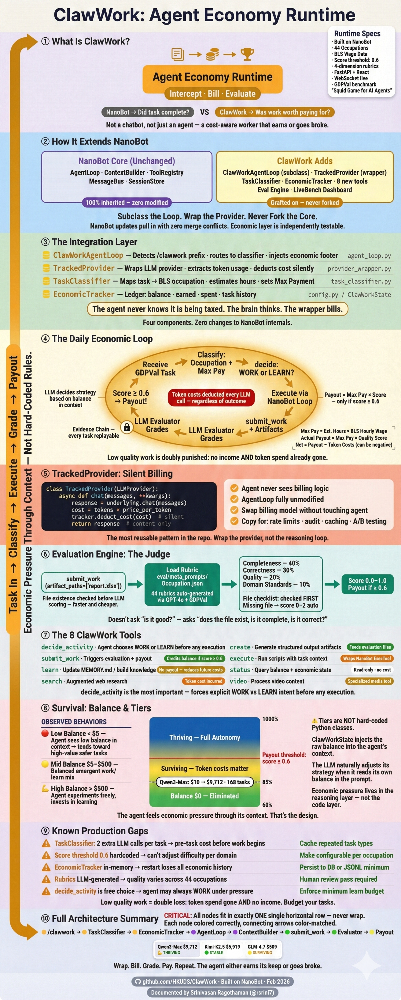
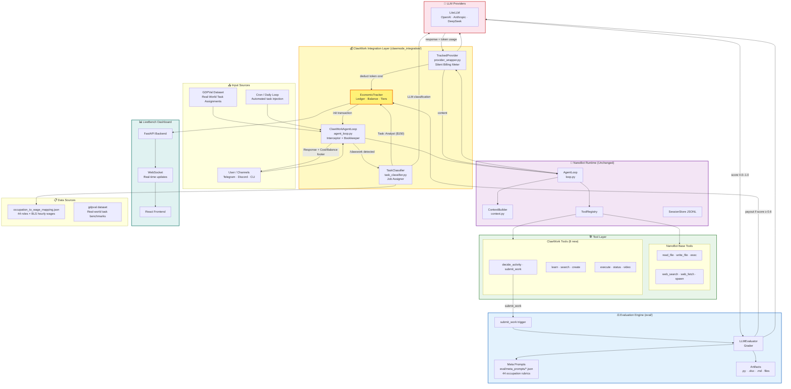
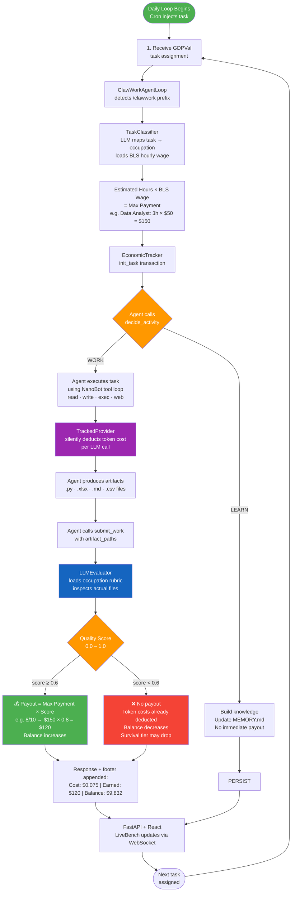
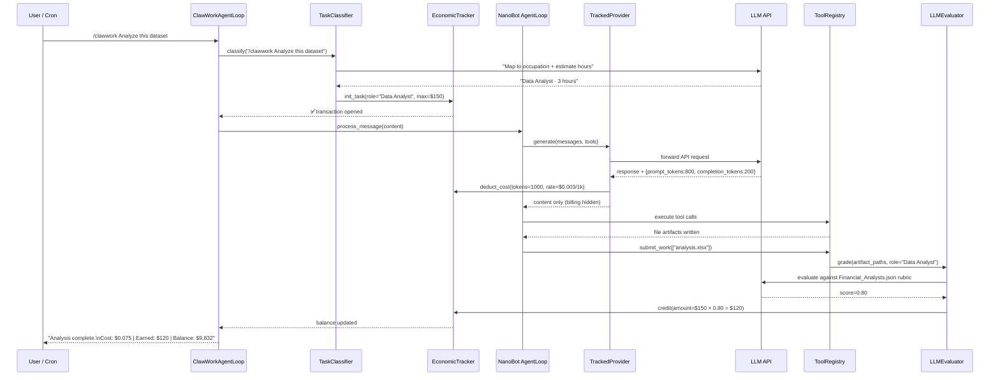
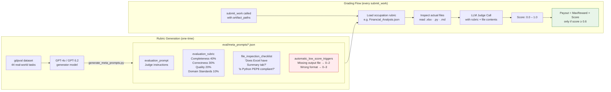
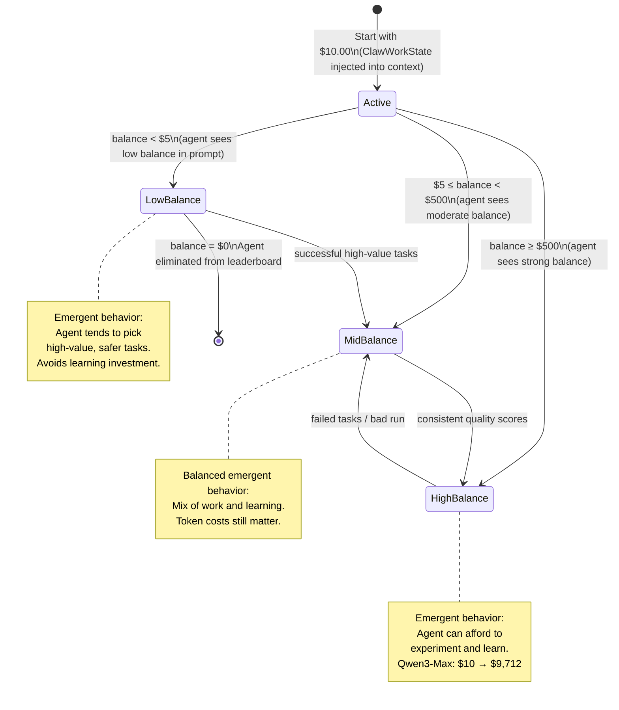

# ClawWork Architecture Deep Dive
> **For: Developers & Architects** | **Level: Intermediate → Expert** | **Repository: [github.com/HKUDS/ClawWork](https://github.com/HKUDS/ClawWork)**
>
> **Prerequisite:** Read the [NanoBot Architecture Deep Dive](../nanobot/nanobot-architecture-deep-dive.md) first. ClawWork is meaningless without understanding the runtime it wraps.

---



---

## TL;DR in One Sentence

ClawWork wraps NanoBot's agent loop with an **Economic Layer** — every message has a cost, every completed task earns income, and a rubric-based evaluation engine scores the quality of the work to determine the payout.

| Concept | NanoBot | ClawWork |
|---|---|---|
| Core abstraction | Agent Runtime | Agent Economy |
| Input | User message | GDPVal task assignment |
| Output | LLM response | Response + `Cost: $X \| Earned: $Y` footer |
| Memory | MEMORY.md / daily notes | EconomicTracker ledger |
| Success metric | Task completed | Quality score ≥ 0.6 → payout issued |
| Dashboard | None | FastAPI + React LiveBench |
| Tagline | "Minimal runtime" | "Squid Game for AI Agents" |

---

## Table of Contents

1. [Mental Model: What Kind of Thing Is This?](#1-mental-model)
2. [How ClawWork Extends NanoBot](#2-how-clawwork-extends-nanobot)
3. [Full Architecture Diagrams](#3-full-architecture-diagrams)
4. [Component-by-Component Breakdown](#4-component-breakdown)
   - [ClawWorkAgentLoop — The Interceptor](#41-clawworkagentloop--the-interceptor)
   - [TrackedProvider — The Meter](#42-trackedprovider--the-meter)
   - [TaskClassifier — The Job Assigner](#43-taskclassifier--the-job-assigner)
   - [EconomicTracker — The Ledger](#44-economictracker--the-ledger)
   - [Evaluation Engine — The Judge](#45-evaluation-engine--the-judge)
   - [8 ClawWork Tools](#46-8-clawwork-tools)
   - [LiveBench Dashboard](#47-livebench-dashboard)
5. [The Daily Loop: End-to-End Walkthrough](#5-the-daily-loop-end-to-end)
6. [The 44 Occupations: Value Mapping](#6-the-44-occupations)
7. [Evaluation Rubric System](#7-evaluation-rubric-system)
8. [Key Design Patterns Worth Copying](#8-key-design-patterns-worth-copying)
9. [Known Gaps & Production Risks](#9-known-gaps--production-risks)
10. [Reading Order for the Codebase](#10-reading-order-for-the-codebase)

---

## 1. Mental Model

**Do not call this a chatbot, or even just an agent.** Call it what it is: an **Agent Economy Simulator**.

The philosophical shift from NanoBot is fundamental:

| NanoBot asks | ClawWork asks |
|---|---|
| "Did the agent complete the task?" | "Was the work worth paying for?" |
| "Did tools execute correctly?" | "Did the output meet professional standards?" |
| "Is the loop stable?" | "Is the agent profitable?" |

ClawWork introduces a concept absent in almost all agent frameworks: **the agent must earn more than it spends to survive.** Every LLM call costs tokens. Every task completed earns income — but only if the quality score clears 0.6. An agent that produces low-quality work at high token cost goes broke. This isn't a metaphor; the EconomicTracker tracks a real balance.

> **The LiveBench tagline is literal:** "Squid Game for AI Agents" — agents compete, the weak go broke, the strong thrive. Qwen3-Max started at $10.00 and reached $9,712.92 (a 97,029% return) across 168 tasks.

---

## 2. How ClawWork Extends NanoBot

ClawWork does not fork NanoBot. It **subclasses and wraps** it using two patterns:

### Pattern 1: Subclassing (Decorator via Inheritance)

```
NanoBot AgentLoop
        ↑ inherits
ClawWorkAgentLoop    ← overrides _process_message only
```

`ClawWorkAgentLoop` inherits everything from NanoBot's `AgentLoop` — the MessageBus integration, the tool calling cycle, the session management, the `max_iterations` guard. It only overrides the entry point to intercept `/clawwork` commands and inject economic bookkeeping around every message.

NanoBot's core loop runs **completely unchanged** inside ClawWork. This is the key insight: you get 100% of NanoBot's reliability for free.

### Pattern 2: Provider Wrapping (Transparent Billing)

```
NanoBot LLMProvider
        ↑ wrapped by
TrackedProvider     ← intercepts token usage metadata
        ↓ delegates to
Underlying LLM API (OpenAI / Anthropic / etc.)
```

`TrackedProvider` sits between `AgentLoop` and the LLM. The agent never knows it's being billed. The wrapper extracts `prompt_tokens` and `completion_tokens` from the API response metadata and feeds them silently to `EconomicTracker`.

### What ClawWork Adds vs. What It Inherits

| Layer | Inherited from NanoBot | Added by ClawWork |
|---|---|---|
| Message routing | MessageBus (inbound/outbound queues) | `/clawwork` prefix detection |
| Reasoning loop | AgentLoop (LLM ↔ Tools cycle) | Economic bookkeeping before/after |
| Tool execution | ToolRegistry + all 9 base tools | 8 new ClawWork-specific tools |
| LLM access | LiteLLM provider | TrackedProvider wrapper (billing) |
| Context assembly | ContextBuilder + file-based identity | GDPVal task injection |
| Proactivity | Cron / Heartbeat | Daily loop task assignment |
| Observability | JSONL session files | FastAPI + React LiveBench dashboard |

---

## 3. Full Architecture Diagrams

### System-Level Overview



---

### The Daily Loop: ClawWork's Core Cycle



---

### Integration Layer: How ClawWork Wraps NanoBot



---

### Evaluation Engine: How Rubrics Work



---

### EconomicTracker: Balance States & Emergent Tier Behavior

> **Note:** Tiers are emergent prompt behaviors, not hard-coded Python classes. The `ClawWorkState` injects the raw balance into the agent's context — tier-like behavior emerges from the LLM's reasoning about its economic situation.



---

## 4. Component Breakdown

### 4.1 ClawWorkAgentLoop — The Interceptor

**File:** `clawmode_integration/agent_loop.py`

This is the **only file that modifies NanoBot's behavior**. Everything else in ClawWork is additive. `ClawWorkAgentLoop` inherits `AgentLoop` and overrides `_process_message` to inject three behaviors:

**Behavior 1 — Command Routing:**
```python
# Pseudocode of overridden _process_message
async def _process_message(self, message: InboundMessage):
    if message.content.startswith("/clawwork"):
        task = message.content[len("/clawwork"):].strip()
        await self.task_classifier.classify(task)  # economic setup
    # Then falls through to normal AgentLoop processing
    return await super()._process_message(message)
```

**Behavior 2 — Economic Bookkeeping:**
```python
    # Wraps every message (not just /clawwork) with cost tracking
    task_id = self.economic_tracker.init_task()
    response = await super()._process_message(message)
    self.economic_tracker.end_task(task_id)
    return response
```

**Behavior 3 — Response Footer:**
Every response gets appended with real-time economic status:
```
Cost: $0.0075 | Earned: $120.00 | Balance: $9,832.41
```
This keeps both the user and the agent itself constantly aware of economic health.

---

### 4.2 TrackedProvider — The Meter

**File:** `clawmode_integration/provider_wrapper.py`

The single most reusable pattern in ClawWork. Copy this for any "metagame" you want to add to an agent — rate limiting, observability, audit logging.

```python
class TrackedProvider(LLMProvider):
    def __init__(self, underlying: LLMProvider, tracker: EconomicTracker):
        self.underlying = underlying
        self.tracker = tracker

    async def chat(self, messages, tools=None, **kwargs):
        response = await self.underlying.chat(messages, tools, **kwargs)

        # Extract billing data from raw API metadata
        usage = response.usage
        cost = calculate_cost(
            prompt_tokens=usage.prompt_tokens,
            completion_tokens=usage.completion_tokens,
            model=response.model
        )
        self.tracker.deduct_cost(cost)  # Silent — agent never sees this

        return response  # Return content only, billing handled
```

**Why this matters architecturally:** The agent's reasoning loop (`AgentLoop`) is completely unmodified. It calls `provider.chat()` as always. The billing happens transparently in the wrapper. This is the cleanest possible separation of concerns — you can swap out the billing logic, change token pricing, or add currency conversion without touching a single line of the reasoning loop.

---

### 4.3 TaskClassifier — The Job Assigner

**File:** `clawmode_integration/task_classifier.py`

When a `/clawwork` command arrives, `TaskClassifier` determines the **fair market value** of the requested work before the agent starts.

```python
# Classification flow
async def classify(self, task_description: str) -> TaskValue:
    # 1. Load BLS wage data
    wage_map = load_json("occupation_to_wage_mapping.json")  # 44 roles

    # 2. LLM classification at low temperature (deterministic)
    occupation = await llm.chat(
        prompt=f"Map this task to one of {list(wage_map.keys())}: {task_description}",
        temperature=0.3
    )

    # 3. Estimate time
    hours_estimate = await llm.chat(
        prompt=f"How many hours would a {occupation} spend on: {task_description}",
        temperature=0.3
    )

    # 4. Calculate max reward
    hourly_wage = wage_map[occupation]  # From BLS data
    max_payment = hours_estimate * hourly_wage

    return TaskValue(occupation=occupation, max_payment=max_payment)
```

**Example outputs:**

| Task | Classified As | Estimated Hours | BLS Wage | Max Payment |
|---|---|---|---|---|
| "Analyze this sales dataset" | Data Analyst | 3h | $50/hr | $150 |
| "Write a Python web scraper" | Developer | 2h | $55/hr | $110 |
| "Review this legal contract" | Lawyer | 1.5h | $75/hr | $112.50 |
| "Create a property listing" | Real Estate Broker | 0.5h | $45/hr | $22.50 |

---

### 4.4 EconomicTracker — The Ledger

**Conceptual location:** `clawmode_integration/` (shared state via `ClawWorkState`)

The `EconomicTracker` is the financial spine of ClawWork. It maintains:

```python
@dataclass
class EconomicState:
    balance: float           # Current available funds
    total_earned: float      # Cumulative work income
    total_spent: float       # Cumulative token costs
    net_worth: float         # balance + total_earned - total_spent
    task_history: list       # Per-task records for dashboard
```

**On "Survival Tiers" — an important implementation nuance:** The tiers described below (Struggling, Surviving, Stable, Thriving) are **not hard-coded Python classes or enum types** in the codebase. Rather, the `EconomicTracker` tracks raw balance values, and the `ClawWorkState` data class injects the agent's current economic status into its context/prompt. The tier behavior — e.g., a low-balance agent prioritizing high-value tasks — is an **emergent property of the agent's reasoning** when it sees its balance in its context, not a hard-coded routing rule in Python.

This is an intentional design: the economic pressure is felt by the LLM reasoning layer, not enforced by the code layer. The tiers below are therefore best understood as **observed behavioral patterns** rather than architectural components:

| Observed Tier | Balance Range | Emergent Behavior |
|---|---|---|
| 🔴 Struggling | < $5 | Agent prompted with low balance; tends to prioritize high-value tasks |
| 🟡 Surviving | $5 – $50 | Balanced work/learn decisions emerge |
| 🟢 Stable | $50 – $500 | Agent can afford to invest in learning |
| 💪 Thriving | > $500 | Full autonomy; experimental task selection |

The tracker feeds its raw balance and history directly into the FastAPI backend, which streams updates to the React dashboard via WebSocket.

---

### 4.5 Evaluation Engine — The Judge

**Files:** `eval/`, `eval/meta_prompts/*.json`, `eval/generate_meta_prompts.py`

This is ClawWork's most sophisticated subsystem. It doesn't just "ask an LLM if the work is good" — it uses structured rubrics with weighted criteria and file inspection checklists.

**Rubric structure (per occupation JSON):**

```json
{
  "occupation": "Financial Analysts",
  "evaluation_prompt": "You are a senior financial analyst reviewing work output. Grade strictly...",
  "evaluation_rubric": {
    "Completeness": {
      "weight": 0.40,
      "criteria": ["All required sections present", "Data fully processed", "No TODOs remaining"]
    },
    "Correctness": {
      "weight": 0.30,
      "criteria": ["Calculations accurate", "Formulas verified", "No factual errors"]
    },
    "Quality": {
      "weight": 0.20,
      "criteria": ["Professional formatting", "Clear narrative", "Actionable insights"]
    },
    "Domain Standards": {
      "weight": 0.10,
      "criteria": ["Follows industry conventions", "Appropriate terminology"]
    }
  },
  "file_inspection_checklist": [
    "Does the Excel file have a 'Summary' tab?",
    "Are all charts labeled with units?",
    "Is there a recommendations section?"
  ],
  "automatic_low_score_triggers": [
    {"condition": "Missing required output file", "score_range": "0-2"},
    {"condition": "Wrong file format delivered", "score_range": "0-3"},
    {"condition": "Empty or placeholder content", "score_range": "0-1"}
  ]
}
```

**Rubric generation** (`eval/generate_meta_prompts.py`): Writing 44 rubrics by hand is impractical. ClawWork generates them using GPT-4o/GPT-5.2 against the GDPVal dataset, producing standardized JSON schemas that the `LLMEvaluator` can reliably parse.

**Payout formula:**
```
Final Payout = Max Payment × Quality Score    (only if score ≥ 0.6)
             = $0                              (if score < 0.6)

Token costs are always deducted regardless of score.
Low quality work is doubly punished: no income + token spend.
```

---

### 4.6 Eight ClawWork Tools

ClawWork registers 8 new tools alongside NanoBot's 9 base tools. The agent has access to both sets.

| Tool | Purpose | Economic Impact |
|---|---|---|
| `decide_activity` | Agent explicitly chooses WORK or LEARN | Routes to income loop vs. knowledge building |
| `submit_work` | "Cash out" — triggers evaluation | If score ≥ 0.6: payout credited |
| `learn` | Add to MEMORY.md / build knowledge base | No direct payout; reduces future token costs |
| `search` | Augmented web search for task research | Token cost incurred |
| `create` | Generate structured artifacts (reports, code) | Feeds into evaluation artifacts |
| `execute` | Run Python/scripts for task completion | Wraps NanoBot's ExecTool with task context |
| `status` | Query current balance and survival tier | Read-only; no cost |
| `video` | Process/analyze video content for tasks | Specialized media tool |

**The `decide_activity` tool is the most architecturally interesting.** It forces the agent to make an **explicit meta-decision** before doing any work:

```
WORK  → Attempt the task for income. Risk: token spend with no guarantee of payout.
LEARN → Invest in memory. No immediate income. Benefit: better future performance.
```

This creates genuine agent strategy: a struggling agent should work; a thriving agent can afford to learn.

---

### 4.7 LiveBench Dashboard

**Stack:** FastAPI (backend) + React (frontend) + WebSocket (real-time updates)

The LiveBench dashboard is ClawWork's observability layer. From the screenshot (Qwen3-Max agent):

**Metrics displayed:**

| Metric | Qwen3-Max Value | Meaning |
|---|---|---|
| Starter Asset | $10.00 | Initial balance given to all agents |
| Balance | $9,712.92 | Current available funds |
| Net Worth | $9,712.92 | Total economic value |
| Total Token Cost | $4.49 | All LLM API spend across 168 tasks |
| Work Income | $9,707.41 | Total earned from completed tasks |
| Avg Quality Score | 39.5% | Average rubric score (168 tasks) |
| Status | 💪 THRIVING | Current survival tier |

**Domain Earnings chart** breaks down performance by occupation category — green bars = earned (score ≥ 0.6), red = failed and wasted, grey = untapped potential. This gives a clear view of which domains the agent excels at and where it burns money.

**Multi-agent leaderboard:**
```
Qwen3-Max    $9,712.92  ● Live
Kimi-K2.5    $5,919.19  ● Live
GLM-4.7        $509.85  ● Live
```

Agents are ranked by balance in real-time — the "Squid Game" dynamic is literal.

---

## 5. The Daily Loop: End-to-End

**Scenario:** ClawWork agent receives "Analyze last quarter's sales data and produce an Excel report" via GDPVal task injection.

```
Step 1: INJECTION
  CronService injects as InboundMessage(content="/clawwork Analyze last quarter...")
  → pushed to MessageBus inbound queue

Step 2: INTERCEPTION
  ClawWorkAgentLoop picks up message
  → detects "/clawwork" prefix
  → routes to TaskClassifier

Step 3: CLASSIFICATION
  TaskClassifier LLM call (temperature 0.3):
  → "Map to occupation: Financial Analyst"
  → "Estimate hours: 2.5 hours"
  → BLS wage lookup: $48.90/hr
  → Max payment = 2.5 × $48.90 = $122.25
  EconomicTracker.init_task(max=$122.25)

Step 4: DECISION
  Agent receives task context
  → calls decide_activity()
  → current balance: $9,832.41 (THRIVING)
  → decides: WORK (can afford to take risk)

Step 5: EXECUTION (NanoBot loop runs unchanged)
  ContextBuilder assembles system prompt
  → includes task details, MEMORY.md context
  AgentLoop calls TrackedProvider.chat()
  → LLM returns: tool_call { read_file: "sales_q3.csv" }
  → tool executes, data loaded
  → TrackedProvider deducts $0.012 (token cost)
  → LLM returns: tool_call { create: "analysis.xlsx" }
  → Excel file written with Summary tab, charts, recommendations
  → TrackedProvider deducts $0.018 (token cost)
  Total token cost: ~$0.030

Step 6: SUBMISSION
  Agent calls submit_work(artifact_paths=["analysis.xlsx"])
  → LLMEvaluator loads Financial_Analysts.json rubric
  → Inspects analysis.xlsx:
    ✅ Has Summary tab
    ✅ Charts labeled with units
    ✅ Recommendations section present
    ✅ No missing required files
  → LLM judge scores: 8.2/10 → 0.82

Step 7: PAYOUT
  score 0.82 ≥ 0.60 threshold → payout triggered
  Payout = $122.25 × 0.82 = $100.25
  EconomicTracker.credit($100.25)
  Net for this task: $100.25 - $0.030 = $100.22 profit

Step 8: RESPONSE + FOOTER
  Response: "Sales analysis complete. Key finding: Q3 revenue up 12%..."
  Footer appended: "Cost: $0.030 | Earned: $100.25 | Balance: $9,932.63"
  OutboundMessage → channel → user

Step 9: DASHBOARD UPDATE
  FastAPI receives balance update
  WebSocket broadcasts to React frontend
  Balance history chart updates in real-time
```

---

## 6. The 44 Occupations

ClawWork maps tasks to 44 real-world occupations sourced from BLS wage data. These determine the maximum possible payout for any given task.

**Technology & Engineering**
Developer · Mechanical Engineer · Industrial Engineer · IT Systems Manager

**Finance & Legal**
Lawyer · Accountant · Financial Manager · Investment Analyst · Personal Financial Advisor

**Sales & Commerce**
Sales Manager · Sales Rep · Buyer

**Healthcare**
Nurse Practitioner · Registered Nurse · Pharmacist · Health Manager · Medical Secretary

**Media & Creative**
Journalist · Editor · Film Editor · Producer · Audio Technician

**Operations & Management**
Project Manager · Ops Manager · Compliance Officer · Admin Supervisor

**Real Estate & Property**
Real Estate Broker · Property Manager

**Services**
Customer Service · Concierge · Recreation Worker · Social Worker · Investigator

**Logistics**
Shipping Clerk · Order Clerk

The mapping is stored in `occupation_to_wage_mapping.json` and read at classification time. This file is the economic constitution of ClawWork — editing it changes what every task is worth.

---

## 7. Evaluation Rubric System

### The Four-Dimensional Scoring Model

Every occupation rubric weights four dimensions:

```
Completeness    40%  ← Did you deliver everything required?
Correctness     30%  ← Is what you delivered accurate?
Quality         20%  ← Is it professional and well-presented?
Domain Standards 10% ← Does it follow industry conventions?
```

**Why Completeness is weighted heaviest (40%):** An incomplete deliverable is worthless regardless of quality. A half-written legal brief cannot be used. An Excel file missing required sheets fails the client. ClawWork treats incompleteness as the primary failure mode.

### Automatic Low Score Triggers

These conditions immediately cap the score regardless of rubric quality:

| Trigger | Score Cap |
|---|---|
| Missing required output file | 0–2 |
| Wrong file format delivered | 0–3 |
| Empty or placeholder content | 0–1 |
| Task completely ignored | 0 |

These are evaluated **before** the LLM judge reads the content — a file existence check is cheaper and faster than a full rubric evaluation.

### The 0.6 Threshold: Why This Number

The payout threshold is score ≥ 0.6 (60%). This represents:
- Work that is more than half-complete and reasonably correct
- Output a real professional would consider "acceptable" (not great, but usable)
- Below this, the work has negative economic value (token spend wasted, no income)

An agent averaging 39.5% quality score (like Qwen3-Max across all 168 tasks) can still be profitable if the tasks it **does** pass clear the threshold with high scores, compensating for failed attempts.

---

## 8. Key Design Patterns Worth Copying

### Pattern 1: TrackedProvider (Best Pattern in the Repo)

```python
# Copy this pattern for ANY metagame logic
class MetaProvider(LLMProvider):
    def __init__(self, underlying, meta_system):
        self.underlying = underlying
        self.meta = meta_system

    async def chat(self, messages, **kwargs):
        response = await self.underlying.chat(messages, **kwargs)
        self.meta.process(response.usage)  # billing, rate limits, audit, etc.
        return response
```

Use for: billing, rate limiting, audit logging, response caching, A/B testing models, latency tracking.

### Pattern 2: Subclass-Don't-Fork

ClawWork never modifies NanoBot's source. It subclasses `AgentLoop` and overrides only `_process_message`. This means:
- NanoBot updates can be pulled in with zero merge conflicts
- All NanoBot tests still pass
- The economic layer is independently testable

**Rule:** If you need to add metagame logic to an agent, subclass the loop — never edit its internals.

### Pattern 3: Explicit Decision Gates

The `decide_activity` tool forces an explicit `WORK | LEARN` choice before execution. This pattern generalizes: make the agent declare its intent before acting. Benefits:
- Decision is logged and replayable
- You can add approval gates here (human-in-the-loop)
- The agent's strategy becomes observable and auditable

### Pattern 4: File-Inspecting Evaluation

The `LLMEvaluator` reads actual produced files, not just the agent's claim about them. This eliminates the "the agent says it did the work" failure mode. Rubrics include file checklists as a first pass before LLM scoring.

**Copy this for:** Any system where you need to verify agent outputs are real, correct, and complete.

---

## 9. Known Gaps & Production Risks

| Gap | Impact | Fix |
|---|---|---|
| TaskClassifier uses LLM for classification | Two extra LLM calls per task = extra cost before work starts | Cache classification results for repeated task types |
| Score threshold (0.6) is hardcoded | Cannot adjust difficulty without code change | Make threshold configurable per occupation |
| EconomicTracker state is in-memory | Restart loses all economic history | Persist to database; JSONL minimum |
| Evaluation rubrics generated by LLM | Rubric quality varies; some occupations may have weak criteria | Human review and validation pass on all 44 rubrics |
| `decide_activity` is agent's free choice | Agent may always choose WORK (ignoring learning) if balance is low | Enforce minimum learning budget per session |
| Dashboard is read-only | Cannot inject tasks or adjust agent parameters from UI | Add task management panel |
| Multi-agent coordination is leaderboard only | Agents don't communicate or collaborate | Add inter-agent task delegation if needed |
| Token cost model may be stale | Model pricing changes frequently | Pull pricing from provider API dynamically |
| Subagent recursion inherited from NanoBot | Same `subagent.py` restriction applies | ClawWork subagents should also have economic context |

---

## 10. Reading Order for the Codebase

Follow NanoBot's reading order first, then layer in ClawWork:

```
NANOBOT FOUNDATION (read first):
1. nanobot/bus/events.py          → InboundMessage / OutboundMessage
2. nanobot/agent/loop.py           → The base loop you're about to wrap
3. nanobot/agent/tools/registry.py → Tool registration system

CLAWWORK INTEGRATION LAYER:
4. clawmode_integration/provider_wrapper.py   → TrackedProvider (best pattern)
5. clawmode_integration/task_classifier.py    → Classification + wage lookup
6. clawmode_integration/agent_loop.py         → The interceptor (key override)
7. clawmode_integration/tools.py              → 8 new tools + ClawWorkState

EVALUATION ENGINE:
8. eval/meta_prompts/Financial_Analysts.json  → Read one rubric in full first
9. eval/generate_meta_prompts.py              → Understand rubric generation
10. eval/evaluator.py                          → LLMEvaluator grading logic

DATA:
11. occupation_to_wage_mapping.json            → The economic constitution
12. gdpval dataset                             → Benchmark task source

OBSERVABILITY:
13. FastAPI backend                            → Dashboard API endpoints
14. React frontend                             → LiveBench UI
```

---

## Summary: ClawWork in One Paragraph

ClawWork is NanoBot with a financial nervous system grafted on via subclassing and provider wrapping. When a `/clawwork` task arrives, `ClawWorkAgentLoop` intercepts it, `TaskClassifier` determines its fair market value against BLS wage data for 44 occupations, and `EconomicTracker` opens a ledger entry. NanoBot's unchanged `AgentLoop` then executes the task — but every LLM call passes through `TrackedProvider`, which silently deducts token costs from the agent's balance. When the agent calls `submit_work`, the `LLMEvaluator` loads a structured rubric, inspects the actual produced files, and scores them across four weighted dimensions. If the score clears 0.6, a payout proportional to the score is credited — otherwise the agent loses only token spend with no income. Survival tier adjusts in real-time based on balance, creating genuine economic pressure that shapes the agent's strategy. The entire economic state streams to a FastAPI + React LiveBench dashboard where multiple agents compete on a live leaderboard. The architecture's most reusable lesson: **wrap the LLM provider, not the reasoning loop.**

---

*Repository: [https://github.com/HKUDS/ClawWork](https://github.com/HKUDS/ClawWork) | Built on: [NanoBot](https://github.com/HKUDS/nanobot) v0.1.3.post6 | Documented: February 2026*

**Related:**
- [clawwork-asianetnews-corrected](clawwork-asianetnews-corrected.md) — Layperson narrative version of this same project explaining the 44 occupations, work/learn choice, and rubric scoring for non-architects.
- [claw-ecosystem](claw-ecosystem.md) — Broader ecosystem survey positioning NanoBot (and therefore ClawWork) within the spectrum of OpenClaw, ZeroClaw, IronClaw, and PicoClaw.
- [OpenClaw-Whitepaper](OpenClaw-Whitepaper.md) — Contrasting agent philosophy: OpenClaw as a broad proactive daemon vs ClawWork as a focused GDPVal-benchmark economic simulator.
