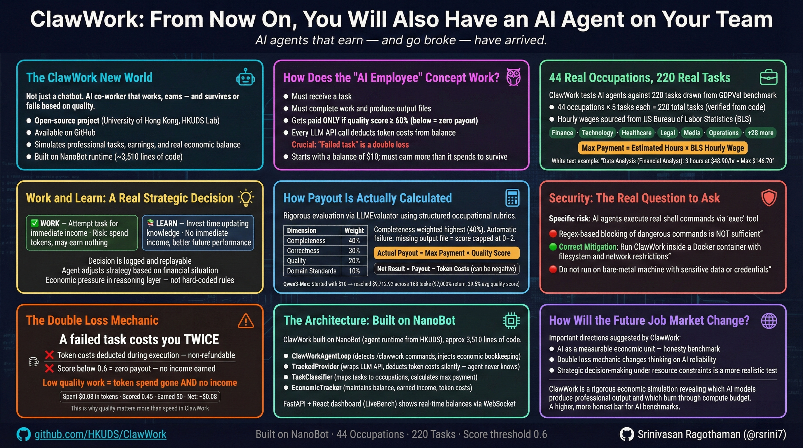

# ClawWork: From Now On, You Will Also Have an AI Agent on Your Team

---

Architecture:

---

---

**AI agents that earn — and go broke — have arrived.**

*Corrected & updated version for technical accuracy — original article published by Asianetnews (Telugu)*

---

Artificial intelligence is developing rapidly. It has grown from the level of chatbots that simply answer questions to systems that complete real professional tasks. Recently, a new kind of AI agent has arrived — one that doesn't just work, but earns money, manages expenses, and can go completely broke if the work quality is poor.

---

## The "ClawWork" New World

Not just a chatbot. The era of the AI co-worker who works, earns — and survives or fails based on quality — has begun.

An open-source project called **ClawWork**, created by the Data Intelligence Lab at the University of Hong Kong, is turning AI into a real "employee" — not just an assistant. Available on GitHub, it simulates the way AI agents complete professional tasks, earn income, and manage a real economic balance. It is one of the most honest experiments yet in showing what AI agents can and cannot do.

---

## How Does the "AI Employee" Concept Work?

At ClawWork, the AI agent is treated like an employee with real financial consequences:

- It must receive a task
- It must complete the work and produce actual output files
- It gets paid **only if the quality score clears 60%** — below that, the payout is zero
- Every single LLM API call deducts token costs from the balance — whether the task succeeds or fails

This is the crucial detail most summaries miss: **a failed task is a double loss.** The agent spends tokens reasoning and executing, earns nothing because the quality was too low, and the balance drops. This mirrors real job economics more closely than any previous AI benchmark.

The AI starts with a balance of just **$10**. From that point, it must earn more than it spends to survive.

---

## 44 Real Occupations, 220 Real Tasks

ClawWork tests AI agents against tasks drawn from the **GDPVal benchmark** — a dataset of real professional work mapped to **44 occupations** with hourly wages sourced from US Bureau of Labor Statistics (BLS) data. Each occupation has exactly **5 distinct tasks**, giving a total of **220 professional tasks** (44 × 5 = 220) — precisely as stated in the official README.

The 44 occupations span all major professional sectors:- Finance: Financial Analyst, Investment Analyst, Accountant
- Technology: Developer, IT Systems Manager
- Healthcare: Nurse Practitioner, Pharmacist, Health Manager
- Legal: Lawyer, Compliance Officer
- Media: Journalist, Editor, Film Editor
- Operations: Project Manager, Ops Manager, Admin Supervisor
- And 28 more occupations across all major sectors

For each task, the system calculates a **maximum possible payment** using the formula:

> **Max Payment = Estimated Hours × BLS Hourly Wage**

For example: a data analysis task classified as "Financial Analyst" work, estimated at 3 hours, at $48.90/hr = maximum $146.70 available to earn.

---

## Work and Learn — A Real Strategic Decision

What makes ClawWork genuinely interesting is a daily choice the agent must make explicitly before starting any task. Using a tool called `decide_activity`, it must declare:

- **WORK** — attempt the task now for immediate income (risk: spend tokens, may earn nothing if quality is low)
- **LEARN** — invest time updating its knowledge base for better future performance (no immediate income)

This is not just a conceptual framing. It is a real tool call the agent makes, and the decision is logged and replayable. An agent with a dangerously low balance naturally gravitates toward safer, higher-value tasks. An agent that is financially healthy can afford to experiment and learn.

Importantly — **this behavior is not hard-coded in Python.** The agent's current balance is injected into its reasoning context, and the LLM adjusts its own strategy naturally when it reads its own financial situation. Economic pressure lives in the reasoning layer, not the code layer. This is one of the most architecturally sophisticated aspects of the project.

---

## How Payout Is Actually Calculated

The evaluation system is rigorous and worth understanding in detail. When an agent submits completed work, an **LLMEvaluator** loads a structured rubric specific to the occupation and grades the actual output files — not just the agent's claim of completion.

Each rubric scores four dimensions:

| Dimension | Weight |
|---|---|
| Completeness | 40% |
| Correctness | 30% |
| Quality | 20% |
| Domain Standards | 10% |

**Completeness is weighted highest (40%)** because an incomplete deliverable — a report missing required sections, an Excel file without the Summary tab — is worthless regardless of how well-written the rest is.

The rubric also includes **automatic failure triggers**: if the required output file is missing entirely, the score is capped at 0–2 regardless of other factors. File existence is checked before the LLM even reads the content.

The final payout formula:

> **Actual Payout = Max Payment × Quality Score** *(only if score ≥ 0.6)*
>
> **Net Result = Payout − Token Costs** *(can be negative)*

In real terms: Qwen3-Max, one of the AI models tested on the LiveBench leaderboard, started with $10 and reached **$9,712.92** across 168 tasks — a 97,000% return — with an average quality score of 39.5%. It succeeded not by being perfect, but by generating enough high-scoring tasks to far outweigh its losses.

---

## The Architecture: Built on NanoBot

ClawWork is built on top of an open-source agent runtime called **NanoBot** (also from HKUDS), which runs in approximately 3,510 lines of code, starts in 0.8 seconds, and uses 45MB of memory. NanoBot provides the core agent loop, tool execution, and messaging infrastructure.

ClawWork adds an **Economic Layer** on top without modifying NanoBot's internals at all. The key components:

- **ClawWorkAgentLoop** — detects `/clawwork` task commands and injects economic bookkeeping
- **TrackedProvider** — wraps the LLM API provider and silently deducts token costs after every call, without the agent's reasoning loop ever "knowing" it is being billed
- **TaskClassifier** — maps the task to one of 44 occupations and calculates the maximum payment
- **EconomicTracker** — maintains the balance ledger, earned income, and token costs

The **TrackedProvider** pattern is the most reusable engineering insight in the project: by wrapping the provider rather than modifying the agent, you can add billing, rate limiting, audit logging, or any other "metagame" to any agent framework without touching its reasoning logic.

A **FastAPI + React dashboard** called LiveBench shows all agents' balances updating in real time via WebSocket, creating a live leaderboard where multiple AI models compete economically.

---

## Security: The Real Question to Ask

The article's discussion of security deserves more precision than "data privacy concerns."

The specific risk in ClawWork is that AI agents execute real shell commands on the host machine via the `exec` tool. The system has regex-based blocking of obviously dangerous commands (like `rm -rf /`), but regex pattern matching is not a robust security boundary — it can be bypassed by a sufficiently unusual command or a prompt injection attack via any channel input.

The correct mitigation, recommended in the project's own documentation: **run ClawWork inside a Docker container** with filesystem and network restrictions. Do not run it on a bare-metal machine with sensitive data or credentials present.

This is not a reason to avoid the project — it is a reason to run it correctly.

---

## How Will the Future Job Market Change?

Projects like ClawWork suggest some genuinely important directions:

**AI as a measurable economic unit.** For the first time, we have a framework that answers "how much is this AI agent's work actually worth?" with a real number, derived from real output quality against real professional rubrics. That is a more honest benchmark than most academic leaderboards.

**The "double loss" mechanic changes how we think about AI reliability.** An agent that confidently produces low-quality work is not just useless — it is economically destructive. ClawWork makes that cost visible and immediate.

**Strategic decision-making under resource constraints.** The Work vs. Learn decision, made under economic pressure with a depleting balance, is a more realistic test of agent intelligence than answering questions with unlimited compute.

Whether this means AI will replace white-collar workers is a much larger societal question that ClawWork alone cannot answer. What it does show, precisely and measurably, is that some AI models can complete professional-grade tasks at a quality level that a rubric-based evaluator would consider worth paying for — and others cannot.

---

## In Summary

ClawWork is not an ordinary tech experiment. It is a rigorous economic simulation that reveals which AI models can produce genuinely professional output and which ones burn through compute budget producing work nobody would pay for.

The phrase "AI is also an employee on your team" may indeed become commonplace — but ClawWork's more important contribution is showing that being a good employee requires more than completing tasks. It requires completing them well enough that someone would actually pay for the result.

That is a higher bar than most AI benchmarks set. And it is a more honest one.

---

*Original article: Asianetnews Telugu | Technical review and additional context: based on HKUDS/ClawWork and HKUDS/nanobot repositories (February 2026)*
*220 tasks × 44 sectors verified against `occupation_to_wage_mapping.json` (task_count: 5 per occupation) and `eval/meta_prompts/` directory structure*
*Repository: [github.com/HKUDS/ClawWork](https://github.com/HKUDS/ClawWork)*

**Related:**- [clawwork-architecture-deep-dive](clawwork-architecture-deep-dive.md) — Full technical reference for the same project — covers ClawWorkAgentLoop, TrackedProvider, EconomicTracker, and the 8 ClawWork tools in code-level detail.- [nanobot-architecture-deep-dive](../nanobot/nanobot-architecture-deep-dive.md) — Underlying NanoBot runtime that ClawWork inherits 100% from, including the AgentLoop and memory system referenced in this article's architecture section.- [OpenClaw-Whitepaper](OpenClaw-Whitepaper.md) — Different agent framing — OpenClaw's broad proactive daemon for personal use versus ClawWork's narrow economic-simulation agent benchmark.
