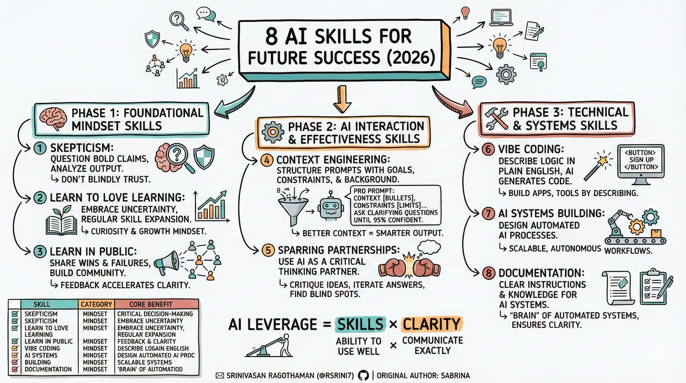

## 📌 **8 AI Skills for Future Success (2026)**



---


---

### 🧠 **Phase 1: Foundational Mindset Skills**

These skills are about mindset — not technical tools — and form the backbone of how you effectively work with AI.

---

### **1️⃣ Skepticism**

**What it is:**
The ability to critically evaluate information rather than accepting claims at face value.

**Why it matters:**
AI hype is everywhere. Many tools, courses, and experts promise success — but not all are valuable. Skepticism helps you avoid shiny distractions and make grounded decisions.

**Practical examples:**

* Question bold product claims.
* Verify tool capabilities before investing time or money.
* Analyze AI output instead of blindly trusting it.

---

### **2️⃣ Learn to Love Learning**

**What it is:**
Cultivating curiosity and a growth mindset — enjoying the process of learning instead of fearing it.

**Why it matters:**
AI evolves rapidly. If you resist learning, you’ll fall behind. Those who enjoy exploring new tools and concepts stay ahead.

**Practical examples:**

* Play with new tools for enjoyment, not just profit.
* Accept that uncertainty is part of growth.
* Set a habit of regular skill expansion.

---

### **3️⃣ Learn in Public**

**What it is:**
Sharing your learning process openly — including wins *and* failures — on social channels.

**Why it matters:**
Public sharing builds credibility and community. It accelerates learning because feedback and accountability increase clarity and motivation.

**Practical examples:**

* Write about what you’re experimenting with.
* Share lessons learned from projects, even imperfect ones.
* Give helpful tips to others as you learn.

---

## ⚙️ **Phase 2: AI Interaction & Effectiveness Skills**

These skills help you work *with* AI more effectively — getting better answers and deeper insights.

---

### **4️⃣ Context Engineering**

**What it is:**
Structuring your AI inputs (prompts + context) to give AI clear, detailed information about your goals, constraints, and background.

**Why it matters:**
Better context means better answers. Not all prompts are created equal — the richer the context, the smarter the output.

**Pro prompt template:**

```
You are an expert in [FIELD] helping me with [TASK].
CONTEXT: [detailed bullet points]
CONSTRAINTS: [requirements/limits]
Ask clarifying questions until 95% confident.
```

---

### **5️⃣ Sparring Partnerships**

**What it is:**
Using AI as a critical thinking partner rather than a simple answer machine.

**Why it matters:**
Surface answers are rarely enough. Teaching AI to critique ideas helps uncover weaknesses, blind spots, and alternative paths.

**Practical examples:**

* Ask AI to *criticize* your plan.
* Use multiple models to compare perspectives.
* Iterate answers rather than accept the first one.

---

## 🛠️ **Phase 3: Technical & Systems Skills**

These skills enable you to build *with* AI — not just talk about it.

---

### **6️⃣ Vibe Coding**

**What it is:**
Describing software/app logic in plain English so AI generates code for you.

**Why it matters:**
Reduces dependency on hardcore programming skills. You can build apps, tools, sites, and automations by describing what you want.

**Practical examples:**

* “Build a landing page with a signup form.”
* “Make a lead magnet calculator for pricing.”
* Translate your product ideas into AI prompts.

---

### **7️⃣ AI Systems Building**

**What it is:**
Designing automated AI processes that operate continuously, without manual interaction.

**Why it matters:**
Manual use of AI (copy-paste requests) doesn’t scale. Building *systems* lets AI do work for you on autopilot (e.g., automated customer support or content workflows).

**Practical examples:**

* System that reads support tickets and auto-responds.
* Automated content generation pipeline.
* AI that autonomously executes tasks cross-platform.

---

### **8️⃣ Documentation**

**What it is:**
Writing clear, structured instructions and knowledge for AI systems to understand and follow.

**Why it matters:**
AI output quality depends on *clarity of rules.* Good documentation acts as the “brain” of your automated systems and future teams.

**Practical examples:**

* Step-by-step task guides.
* Standard operating procedures for AI workflows.
* Updated knowledge bases for systems to reference.

---

## 🧩 **How These Skills Fit Together**

Sabrina frames the AI success formula as:

> **AI Leverage = Skills × Clarity**

Skills give you the *ability* to use AI well. Clarity lets you communicate exactly what you want from AI. Together, they multiply your effectiveness.

---

## 📌 **Summary Checklist**

| Skill                  | Category    | Core Benefit                  |
| ---------------------- | ----------- | ----------------------------- |
| Skepticism             | Mindset     | Critical decision-making      |
| Learn to Love Learning | Mindset     | Continuous adaptation         |
| Learn in Public        | Mindset     | Brand growth & accountability |
| Context Engineering    | Interaction | High-quality AI responses     |
| Sparring Partnerships  | Interaction | Deep iterative thinking       |
| Vibe Coding            | Tech        | Low-code app building         |
| AI Systems Building    | Tech        | Scalable automation           |
| Documentation          | Tech        | System clarity & reliability  |

---

## Reference 

["The 8 AI Skills That Will Separate Winners From Losers in ..."](https://www.sabrina.dev/p/8-ai-skills-learn-2026)

https://www.youtube.com/watch?v=4Q7gUXAveL0

**Related:**- [Agent-Skills](Agent-Skills.md) — disambiguates the technical 'Agent Skills' packaging standard from the personal 'AI skills' (mindset, interaction, technical) discussed here.- [AI-Coding-Loops](../development/AI-Coding-Loops.md) — its four engineering layers (prompt, context, harness, loop) map onto the Phase 2 'AI Interaction Skills' here, especially Context Engineering.- [AI-Operating-Manual](../development/AI-Operating-Manual.md) — uses the parallel 'Skills x Clarity' success formula and 70-20-10 human/AI split that mirrors the Phase 1 mindset framework here.
