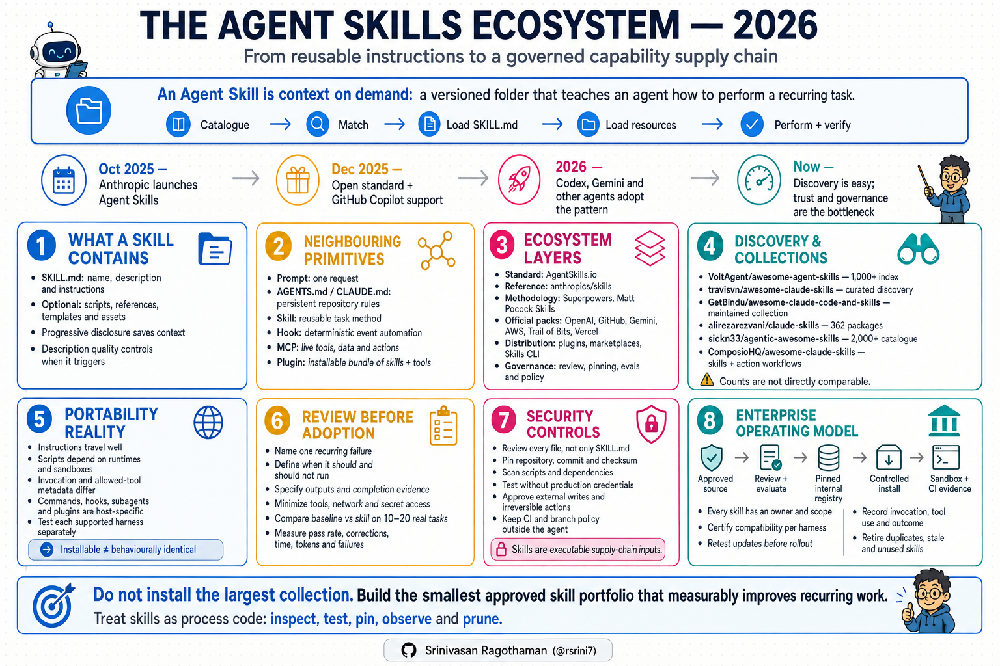
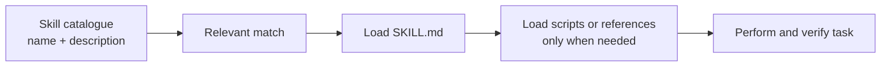
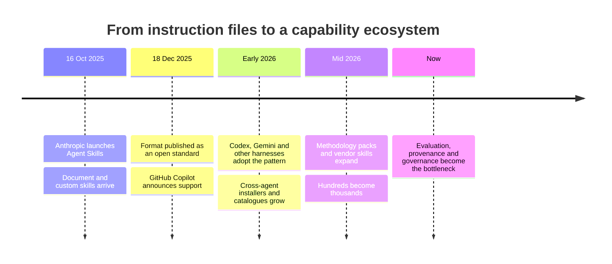
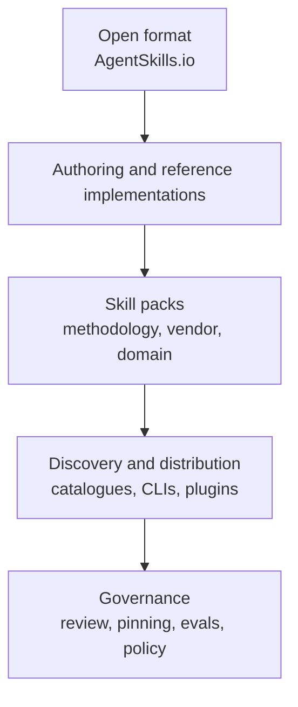
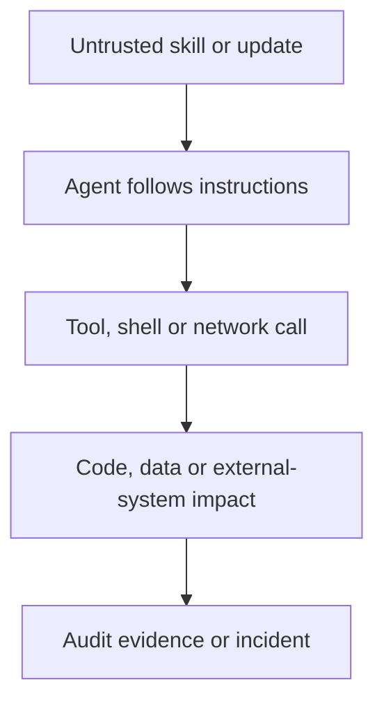

# The Agent Skills Ecosystem in 2026

*How `SKILL.md` grew from a useful instruction pattern into a cross-agent ecosystem of methodologies, vendor knowledge, reusable tools, catalogues and governed capability packs.*

> **Research snapshot:** 6 August 2026. Repository counts and product integrations change quickly. The classifications and trust model are more durable than the numbers.

> **Companion article:** [AI Coding Methodologies and Tooling in 2026](../development/AI-Coding-Methodologies-and-Tooling-2026.md) compares Spec Kit, OpenSpec, BMad, Superpowers, Matt Pocock Skills, GSD and the harnesses that run them. This guide focuses only on the skills ecosystem.

---



---

## The short answer

An Agent Skill is **context on demand**: a small, versioned package that teaches an agent how to perform a recurring task.

The important story is no longer “there are many useful prompts on GitHub.” It is this:

- `SKILL.md` has become a portable extension format.
- Skills can contain instructions, scripts, references, templates and assets.
- Methodologies such as Superpowers and Matt Pocock Skills can be delivered as skill chains.
- Official vendors are publishing product and domain knowledge as skills.
- Installers and catalogues make third-party skills easy to acquire.
- That convenience creates a new software supply-chain and governance problem.

> Do not install the largest collection. Build the smallest approved skill portfolio that measurably improves your recurring work.

---

## 1. What a skill is—and what it is not

The open [Agent Skills format](https://agentskills.io/home) defines a skill as a folder whose entry point is `SKILL.md`. At minimum, its frontmatter provides a `name` and a `description`. The folder may also contain executable scripts, reference material, templates and other assets.

```text
my-skill/
├── SKILL.md
├── scripts/
├── references/
└── assets/
```

Compatible agents use progressive disclosure:



This saves context, but the description becomes part of the control plane: if it is vague, the right skill may not trigger—or the wrong one may.

### Skills versus neighbouring concepts

| Primitive | Main purpose | Loaded or run | Typical example |
|---|---|---|---|
| **Prompt** | One request | Once | “Review this API design” |
| **Repository instruction** | Persistent local rules | Usually every relevant session | `AGENTS.md`, `CLAUDE.md` |
| **Skill** | Reusable task knowledge or workflow | On demand | TDD, PDF creation, incident diagnosis |
| **Command** | Explicit workflow entry point | Human invokes it | `/to-spec`, `$skill-name` |
| **Subagent** | Isolated reasoning context or role | Spawned for delegated work | Independent code reviewer |
| **Hook** | Deterministic event automation | On a defined event | Run a formatter after edits |
| **MCP server** | Live tools, data and actions | Agent calls a tool | Query GitHub, deploy to cloud |
| **Plugin** | Installable distribution bundle | Installed as a package | Skills + MCP + commands + hooks |

A skill tells the agent **how to work**. MCP gives it **something it can do**. A plugin can package both.

---

## 2. How the ecosystem formed

Skills did not invent checklists, TDD, runbooks or onboarding guides. Their contribution was packaging that knowledge so agents could discover and load it consistently.



[Anthropic introduced Agent Skills](https://www.anthropic.com/news/skills) on 16 October 2025 and announced the open standard on 18 December. [GitHub Copilot added support](https://github.blog/changelog/2025-12-18-github-copilot-now-supports-agent-skills/) the same day. By 2026, the format had spread across coding agents, catalogues and plugin systems.

---

## 3. The ecosystem has distinct layers



| Layer | Representative projects | Why it exists |
|---|---|---|
| **Standard** | [AgentSkills.io](https://agentskills.io/specification) | Defines the common folder and metadata contract |
| **Reference implementation** | [anthropics/skills](https://github.com/anthropics/skills) | Shows simple and production-scale patterns |
| **Methodology packs** | [Superpowers](https://github.com/obra/superpowers), [Matt Pocock Skills](https://github.com/mattpocock/skills) | Encodes an engineering way of working |
| **Official capability packs** | AWS, Google Gemini, Trail of Bits, Vercel | Supplies authoritative product or domain expertise |
| **Distribution** | [Vercel Skills CLI](https://github.com/vercel-labs/skills), Claude marketplaces, [OpenAI Plugins](https://github.com/openai/plugins) | Finds, installs, updates and bundles skills |
| **Curated indexes** | VoltAgent, travisvn, GetBindu, GitHub Awesome Copilot | Helps people discover external projects |
| **Large libraries** | Alireza Rezvani, Agentic Awesome Skills, Composio | Provides broad collections and, increasingly, selection tooling |
| **Enterprise governance** | Internal registries, protected CI, admin controls | Decides what may run, where and with which authority |

The category mistake to avoid is comparing every row as if it were the same product.

---

## 4. The important repositories

### 4.1 Official and reference sources

| Repository | Accurate description | Important qualification |
|---|---|---|
| **[anthropics/skills](https://github.com/anthropics/skills)** | Anthropic’s implementation, specification, template and example collection | The DOCX, PDF, PPTX and XLSX production skills are source-available, not open source; Anthropic tells users to test skills before critical use |
| **[openai/plugins](https://github.com/openai/plugins)** | Current OpenAI examples for distributing Codex skills and richer plugin bundles | The older `openai/skills` catalogue is deprecated; local skills remain supported, while reusable distribution is moving to plugins |
| **[github/awesome-copilot](https://github.com/github/awesome-copilot)** | GitHub’s community collection of skills, agents, instructions, hooks, workflows and plugins | It mixes multiple extension types; it is broader than a skills library |
| **[google-gemini/gemini-skills](https://github.com/google-gemini/gemini-skills)** | Official skills for building against Gemini APIs and SDKs | Product knowledge can be authoritative while runtime behaviour remains harness-specific |
| **[aws/agent-toolkit-for-aws](https://github.com/aws/agent-toolkit-for-aws)** | AWS-supported MCP servers, skills, plugins and guardrails for building on AWS | Some plugin or hook behaviour is agent-specific; verify the Codex or Claude path separately |
| **[trailofbits/skills](https://github.com/trailofbits/skills)** | Security research, vulnerability detection, verification and audit workflows | Strong domain depth; still requires approved tools, sandboxes and human security judgment |
| **[vercel-labs/agent-skills](https://github.com/vercel-labs/agent-skills)** | Vercel’s practical skills for AI coding agents | Useful vendor-authored examples, not a general governance layer |

Anthropic’s repository is the closest reference implementation, but [AgentSkills.io](https://agentskills.io/home) is the neutral place to understand the open format.

### 4.2 Methodology packs

| Pack | Philosophy | Best fit | Main risk |
|---|---|---|---|
| **Superpowers** | Automatically apply a cohesive engineering method | Teams wanting strong default discipline | Unexpected or over-applied workflow; overlap with other planning systems |
| **Matt Pocock Skills** | Let the engineer select small, composable practices | Teams valuing explicit control and inspectability | Humans may omit a needed skill; the complete chain still behaves like a framework |

Matt Pocock’s main path is:

> `grill-with-docs` → `to-spec` → `to-tickets` → `implement` → `code-review`

This belongs in the methodology comparison. The individual skills, invocation model and distribution mechanics belong in the broader ecosystem discussed here.

### 4.3 Curated indexes

| Repository | Current position | How to interpret it |
|---|---|---|
| **[VoltAgent/awesome-agent-skills](https://github.com/VoltAgent/awesome-agent-skills)** | Advertises 1,000+ official and community skills across many agents | Strong discovery index with contribution criteria; not an audit of every linked skill |
| **[travisvn/awesome-claude-skills](https://github.com/travisvn/awesome-claude-skills)** | Broad list of skills, tools and Claude workflow resources | Useful discovery surface, but it mixes skills with adjacent primitives |
| **[GetBindu/awesome-claude-code-and-skills](https://github.com/GetBindu/awesome-claude-code-and-skills)** | Maintainer-curated collection across coding, security, marketing and other domains | “Verified” is the project’s curation claim, not evidence of an independent security audit |

An awesome list answers **“what exists?”** It does not answer **“what should this organisation trust?”**

### 4.4 Large libraries and emerging control layers

| Repository | Verified August 2026 description | What makes it different |
|---|---|---|
| **[alirezarezvani/claude-skills](https://github.com/alirezarezvani/claude-skills)** | Describes 362 packages for 13 agent environments, with hundreds of scripts and references | Broad multi-domain suite spanning engineering, compliance, research, business and executive roles |
| **[sickn33/agentic-awesome-skills](https://github.com/sickn33/agentic-awesome-skills)** | Renamed from `antigravity-awesome-skills`; now claims 2,000+ skills | AAS Core adds local search, agent-owned selection, manifests, evidence and plan preview; it explicitly does not certify semantic suitability or safety |
| **[ComposioHQ/awesome-claude-skills](https://github.com/ComposioHQ/awesome-claude-skills)** | 1,000+ skill/plugin catalogue plus local examples | Also promotes a commercial MCP gateway and `connect-apps` plugin for authenticated actions across external services |

Raw counts are not comparable. One collection may count folders, another external links, another commands, agents or plugins. Duplicates and different levels of granularity further distort rankings.

---

## 5. Distribution is becoming package management

[Vercel’s Skills CLI](https://github.com/vercel-labs/skills) provides cross-agent discovery and installation through commands such as:

```bash
npx skills find <query>
npx skills add <owner/repository>
npx skills update
```

Claude uses plugin marketplaces. Codex supports local/repository skills and now recommends [plugins for reusable distribution](https://developers.openai.com/codex/build-skills). GitHub has also introduced skill-management and pinning concepts.

This is convenient, but installation is not neutral:

- files may be copied or symlinked into agent-specific paths;
- an update may change future agent behaviour;
- plugin metadata, hooks and tool names differ by harness;
- transitive scripts and references may be missed during review;
- “latest” makes reproduction and incident analysis harder.

Treat a skill lockfile or pinned commit as evidence—not bureaucracy.

---

## 6. Portability: the format travels better than the behaviour

| Capability | Portable in principle? | What can still differ |
|---|---|---|
| `name`, `description`, Markdown instructions | **Yes** | Trigger ranking and prompt interpretation |
| `scripts/`, `references/`, `assets/` | **Mostly** | Runtime, dependencies, paths and sandbox permissions |
| Automatic invocation | **Partly** | Some agents auto-trigger readily; others need explicit invocation |
| Allowed-tool metadata | **Partly** | Field names and enforcement differ |
| Slash commands | **No common guarantee** | Command syntax and namespace |
| Hooks | **Mostly host-specific** | Events, configuration and security model |
| Subagents | **Host-specific** | Context isolation, concurrency and hand-off semantics |
| MCP access | **Protocol-portable, policy-specific** | Authentication, approvals and available servers |
| Plugin packaging | **Host-specific** | Manifest, marketplace and update model |

> “Works with Codex, Claude and Gemini” often means the files can be installed—not that the same task produces the same behaviour.

Test every supported harness separately when portability is a requirement.

---

## 7. How to judge a skill before adopting it

### The practical review card

| Question | Healthy signal | Warning signal |
|---|---|---|
| **What failure does it solve?** | One named, recurring problem | “Makes the agent better” |
| **When should it trigger?** | Specific positive scenarios | Vague or overly broad description |
| **When should it not run?** | Clear boundaries and alternatives | Claims universal applicability |
| **What is the output contract?** | Files, checks and completion evidence are explicit | Success means the agent says it is done |
| **What authority does it need?** | Minimum tools and permissions | Shell, network and secrets without justification |
| **What is deterministic?** | Scripts or tests handle repeatable work | Long prose for something code could verify |
| **Is context progressive?** | Short core; targeted references | One giant `SKILL.md` loaded every time |
| **Is it maintainable?** | Owner, version, license, changelog | Abandoned copy with unclear origin |
| **Is it evaluated?** | Baseline-versus-skill tasks with measurable results | Testimonials and stars only |
| **Can it recover?** | Failure, retry and rollback behaviour are defined | Partial writes with no recovery path |

The [Agent Skills guidance](https://agentskills.io/skill-creation/evaluating-skills) recommends evaluating the **delta**: what extra latency and tokens cost, and what pass-rate improvement the skill buys.

### A small evaluation is enough to begin

Use 10–20 representative tasks and compare:

1. native agent without the skill;
2. native agent with the skill;
3. the same tasks after a skill update.

Measure pass rate, human corrections, unnecessary changes, elapsed time, tokens, tool failures and security interventions. A skill that adds ceremony without improving outcomes should be removed.

---

## 8. Security: skills are executable supply-chain inputs

A skill may only look like Markdown, but it can instruct an agent to execute scripts, call tools, open the network, read files or modify external systems.



Minimum controls:

- review every file, not only `SKILL.md`;
- pin source repository, commit and checksum;
- record author, license and upstream provenance;
- scan scripts and dependencies;
- test in a sandbox without production credentials;
- deny network and secrets unless the task needs them;
- require approval for external writes and irreversible actions;
- keep protected CI and branch policy outside the agent;
- monitor upstream changes before updating;
- retain run evidence for sensitive workflows.

“Official” reduces provenance uncertainty. It does not eliminate bugs, excessive permissions or unsuitable behaviour for your environment.

---

## 9. A sensible enterprise operating model

Do not point every developer at a public catalogue and call that enablement. Create a small internal capability supply chain.


| Control | Minimum enterprise rule |
|---|---|
| **Ownership** | Every approved skill has a team owner |
| **Scope** | Project, team or organisation scope is explicit |
| **Versioning** | Pin versions; updates enter through review |
| **Permissions** | Least privilege by task and environment |
| **Compatibility** | Certify each supported harness separately |
| **Evaluation** | Maintain a small regression suite per critical skill |
| **Observability** | Record invocation, tool use, outcome and intervention |
| **Retirement** | Remove duplicates, stale knowledge and unused skills |

The durable asset is not the public collection. It is the organisation’s reviewed, tested and versioned portfolio.

---

## 10. A practical adoption path

### Phase 1 — Start with recurring pain

Choose three to eight skills for failures you can already observe:

- vague requirements;
- weak domain terminology;
- shallow task slicing;
- inconsistent debugging;
- skipped verification;
- repetitive document or infrastructure work.

### Phase 2 — Prefer focused sources

Use this trust order as a starting heuristic:

1. internally authored and reviewed;
2. official product/vendor skill;
3. respected domain specialist;
4. established methodology pack;
5. curated external index;
6. unknown bulk collection.

Then review the actual content. Source reputation never replaces inspection.

### Phase 3 — Measure and prune

Keep a skill only when it improves at least one of:

- correctness;
- clarification time;
- review burden;
- repeatability;
- recovery;
- security evidence;
- operational quality.

### Phase 4 — Standardise the survivors

Pin them in an internal registry, document their owners and define which projects may use them. Avoid installing hundreds globally merely because progressive disclosure exists: catalogue metadata still consumes context, and invocation collisions still grow.

---

## 11. Recommended stack for enterprise Java platforms

For Java/Spring/Quarkus microservices, a good starting portfolio is intentionally small:

| Need | Suggested source |
|---|---|
| Clarification and domain language | Selected Matt Pocock `grill-with-docs` and `domain-modeling` patterns |
| Change specification and slicing | One of Matt `to-spec`/`to-tickets`, OpenSpec or Spec Kit—not all three as owners |
| Diagnosis and review | Selected Matt or Superpowers skills, adapted to local test seams |
| Cloud product knowledge | Official AWS skills only when AWS is actually in scope |
| Security analysis | Selected Trail of Bits patterns plus organisational scanners and policy |
| Team-specific expertise | Internal skills for API contracts, Kafka schemas, Oracle migrations, resilience, observability and rollback |

The highest-value skills for an enterprise codebase will probably be internal. Public repositories cannot know:

- which service owns a business capability;
- which event schemas are compatibility contracts;
- which migrations require expand–contract rollout;
- which data may leave the environment;
- which dashboards and alerts prove production safety.

Encode those decisions without duplicating facts that the repository or build system can already reveal.

---

## 12. Final view

Agent Skills are becoming a durable extension layer between general-purpose models and real organisational work. Their value is not that Markdown is magical. Their value is that expertise can become:

- discoverable;
- composable;
- versioned;
- reviewable;
- progressively loaded;
- measurable;
- portable enough to avoid complete vendor lock-in.

The next bottleneck is trust. As skill counts move from dozens to thousands, the winning ecosystem will not be the one with the biggest catalogue. It will be the one that makes provenance, compatibility, evaluation, least privilege and controlled updates routine.

> Treat skills as process code: keep them small, test the behaviour they change, pin what you trust and delete what no longer earns its place.

---

## Primary sources

All descriptions were checked against first-party repositories or documentation through 6 August 2026.

- [Anthropic: Introducing Agent Skills](https://www.anthropic.com/news/skills)
- [Anthropic: Equipping agents for the real world with Agent Skills](https://www.anthropic.com/engineering/equipping-agents-for-the-real-world-with-agent-skills)
- [Anthropic Skills repository](https://github.com/anthropics/skills)
- [Agent Skills overview](https://agentskills.io/home), [specification](https://agentskills.io/specification), [authoring guidance](https://agentskills.io/skill-creation/best-practices) and [evaluation guidance](https://agentskills.io/skill-creation/evaluating-skills)
- [GitHub Copilot Agent Skills announcement](https://github.blog/changelog/2025-12-18-github-copilot-now-supports-agent-skills/)
- [GitHub Awesome Copilot](https://github.com/github/awesome-copilot)
- [OpenAI Codex skills](https://developers.openai.com/codex/build-skills), [plugins](https://developers.openai.com/codex/plugins) and [plugin examples](https://github.com/openai/plugins)
- [Vercel Skills CLI](https://github.com/vercel-labs/skills) and [Vercel Agent Skills](https://github.com/vercel-labs/agent-skills)
- [Matt Pocock Skills](https://github.com/mattpocock/skills), [documentation](https://www.aihero.dev/skills) and [v1.2 changes](https://www.aihero.dev/skills/skills-changelog-v12-wait-what-writing-for-agents-claude-code-plugin-and-more)
- [Superpowers](https://github.com/obra/superpowers)
- [AWS Agent Toolkit](https://github.com/aws/agent-toolkit-for-aws)
- [Google Gemini Skills](https://github.com/google-gemini/gemini-skills)
- [Trail of Bits Skills](https://github.com/trailofbits/skills)
- [VoltAgent Awesome Agent Skills](https://github.com/VoltAgent/awesome-agent-skills)
- [TravisVN Awesome Claude Skills](https://github.com/travisvn/awesome-claude-skills)
- [GetBindu Awesome Claude Code and Skills](https://github.com/GetBindu/awesome-claude-code-and-skills)
- [Alireza Rezvani Claude Skills](https://github.com/alirezarezvani/claude-skills)
- [Agentic Awesome Skills and AAS Core](https://github.com/sickn33/agentic-awesome-skills)
- [Composio Awesome Claude Skills](https://github.com/ComposioHQ/awesome-claude-skills)

---

**Related:**
- [Agent-Skills](Agent-Skills.md) — introduces the Agent Skills primitive and its reusable workflow model.
- [Agent-Specs-vs-Rules-vs-Skills](Agent-Specs-vs-Rules-vs-Skills.md) — distinguishes skills from specifications and persistent repository rules.
- [Agent-sdd-uacf-skills-comparison](Agent-sdd-uacf-skills-comparison.md) — compares skills with broader software-development agent frameworks.
- [claude-agents-vs-sub-agents-vs-projects-vs-workflow-vs-rules-vs-mcp-vs-skills](claude-agents-vs-sub-agents-vs-projects-vs-workflow-vs-rules-vs-mcp-vs-skills.md) — maps skills against adjacent agent primitives and orchestration layers.
- [AI-Coding-Methodologies-and-Tooling-2026](../development/AI-Coding-Methodologies-and-Tooling-2026.md) — companion comparison of methodologies that use or overlap with skills.
