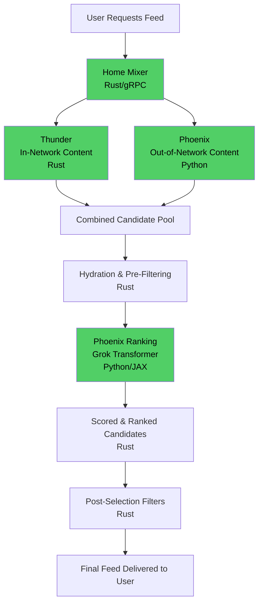
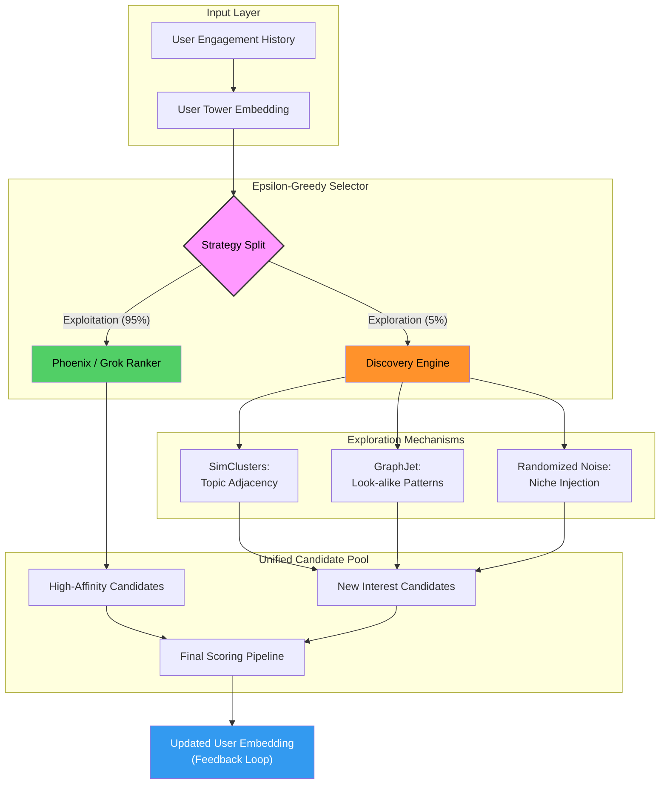
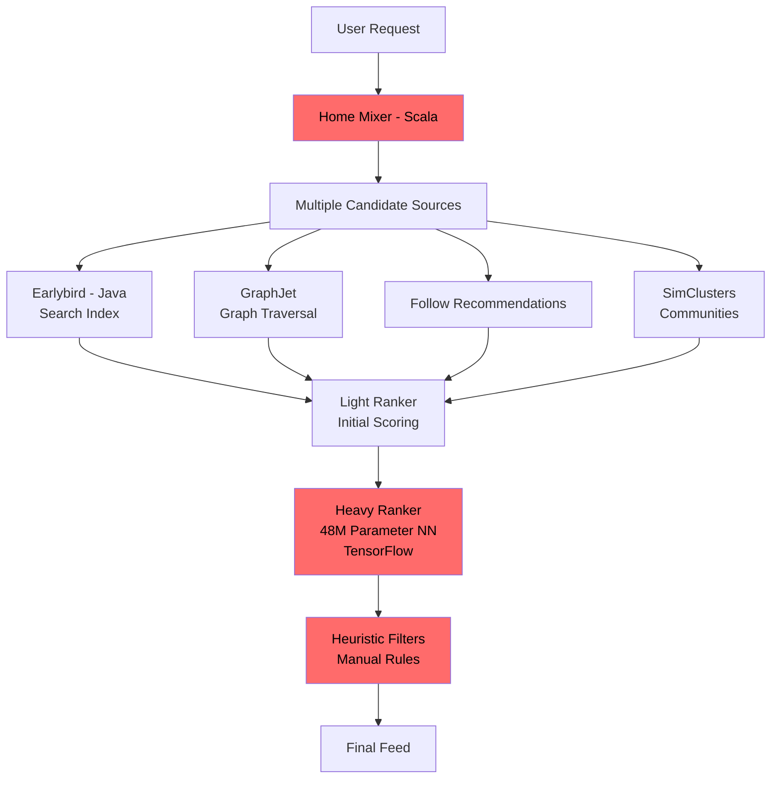

# X's Recommendation Algorithm: Technical Analysis

**A Comprehensive Guide for Developers and Architects**

**Document Created:** February 4, 2026  

---

**Abstract**

This document provides a comprehensive technical analysis of X's (formerly Twitter) "For You" feed recommendation algorithm, based on the open-source release published on January 19-20, 2026. The analysis covers the system architecture, implementation details, design principles, and technical innovations that power content recommendations for over 500 million daily users. The system represents a fundamental architectural shift from microservice-based heuristic systems to a streamlined AI-driven approach using Rust for infrastructure and Python for machine learning, with a Grok-based transformer at its core.

---

## 1. Introduction

On January 19-20, 2026, X released the complete source code for its "For You" feed recommendation algorithm, fulfilling a commitment made by CEO Elon Musk on January 10, 2026 [1]. This release represents the first time a major social media platform has fully open-sourced its recommendation system architecture, providing unprecedented transparency into how content is surfaced to users.

The repository is hosted at github.com/xai-org/x-algorithm under the Apache 2.0 license, with a commitment to update the codebase every four weeks with comprehensive developer notes [2].

### 1.1 Scope of This Analysis

This document analyzes the technical implementation based on:
- The open-source repository released January 19-20, 2026
- Official README documentation and code structure
- Historical context from the 2023 Twitter algorithm release
- Observed user behavior and platform changes

### 1.2 What This Release Contains

The repository includes:
- Complete system architecture (4 core components)
- Production code structure in Rust and Python
- Transformer implementation ported from Grok-1
- Pipeline framework and filtering logic
- Attention masking mechanisms
- Example configurations and batch creation utilities

### 1.3 What Is Not Included

The following proprietary elements are not part of the release:
- Trained model weights and parameters
- Training procedures and data pipelines
- Performance optimization specifics
- Infrastructure deployment details
- A/B testing frameworks
- Historical migration documentation

---

## 2. System Overview

### 2.1 Core Philosophy

The system embodies a fundamental philosophical shift in recommendation system design. According to the repository documentation:

> "We have eliminated every single hand-engineered feature and most heuristics from the system. The Grok-based transformer does all the heavy lifting by understanding your engagement history (what you liked, replied to, shared, etc.) and using that to determine what content is relevant to you." [3]

This approach contrasts sharply with traditional recommendation systems that rely on explicitly coded rules and manually tuned weights.

### 2.2 Technology Stack

**Languages:**
- Rust (62.9%) - Infrastructure, pipelines, in-memory storage
- Python (37.1%) - Machine learning models, transformer implementation

**Key Technologies:**
- JAX - Numerical computing and automatic differentiation [4]
- Haiku - Neural network library built on JAX [4]
- gRPC - Service communication protocol
- Kafka - Real-time data streaming
- Zstd - Data compression

**Note:** JAX and Haiku usage is confirmed through explicit imports in phoenix/runners.py and phoenix/grok.py source files [4].

### 2.3 Scale

The system operates at significant scale:
- Approximately 500 million posts created and processed daily across the entire platform (2023-2026 metrics) [5][10]
- 5 billion ranking decisions per day (2023 metrics) [5]
- Over 100 million posts analyzed by Grok daily for content recommendations (2025 statement) [6]

Note: The 500 million figure represents total platform-wide post volume, while the 100 million refers specifically to posts processed by Grok for the recommendation algorithm—a targeted subset to enable efficient content matching for users.

### 2.4 Community Reception

The open-source release garnered significant attention:
- 14,500+ GitHub stars as of February 2026
- 1,600 stars within the first six hours of release [7]
- Active community contributions and discussions

---

## 3. Architecture

### 3.1 High-Level Design

The system employs a two-source architecture that combines in-network and out-of-network content, unified through a single ranking pipeline:



### 3.2 Four Core Components

The architecture is deliberately simplified into four main components:

1. **Home Mixer** - Orchestration layer coordinating the pipeline
2. **Thunder** - In-network content retrieval system
3. **Phoenix** - AI-powered out-of-network retrieval and ranking
4. **Candidate Pipeline** - Reusable framework for filtering, scoring, and selection

This represents a significant reduction in complexity compared to the 2023 system, which employed dozens of specialized microservices [8].

### 3.3 Design Rationale

The streamlined architecture offers several advantages:
- Reduced operational complexity
- Clearer system boundaries
- Easier to reason about and debug
- Lower maintenance overhead
- Faster iteration cycles

---

## 4. Core Components

### 4.1 Home Mixer (Rust)

**Purpose:** Central orchestration service that coordinates the entire recommendation pipeline.

**Implementation:** gRPC-based service written in Rust for performance and reliability.

**Responsibilities:**
- Receive and process user feed requests
- Orchestrate Thunder and Phoenix subsystems
- Coordinate filtering and ranking stages
- Manage pipeline execution flow
- Serve final ranked results to clients

**Technical Benefits of Rust:**
- Compile-time safety guarantees
- No garbage collection pauses
- Zero-cost abstractions
- Excellent async/await support
- Memory safety without runtime overhead

### 4.2 Thunder (Rust)

**Purpose:** High-performance in-network content retrieval system.

**Definition:** "Posts published by the accounts that users follow" [3]

**Key Features:**

1. **In-Memory Storage**
   - Posts stored in memory for ultra-low latency access
   - Sub-millisecond lookup times without external database queries [3]
   
2. **Real-Time Ingestion**
   - Kafka integration for streaming post updates
   - Immediate availability of new content from followed accounts
   
3. **Performance Characteristics**
   - Rust's ownership model eliminates garbage collection
   - Deterministic latency for real-time serving
   - Efficient memory management at scale

**Design Choice:** Rust is essential here due to the performance requirements of serving millions of users with consistent sub-millisecond response times.

### 4.3 Phoenix (Python)

**Purpose:** AI-powered system for discovering and ranking out-of-network content.

**Definition:** "Posts mined from the global content library that users may be interested in but haven't followed" [3]

Phoenix operates in two distinct stages:

#### 4.3.1 Stage 1: Retrieval

Phoenix efficiently narrows down millions of candidate posts to hundreds using approximate nearest neighbor (ANN) search [3].

**Two-Tower Embedding Architecture:**

1. **User Tower**
   - Encodes user's engagement history into a dense embedding
   - Captures patterns of user interests and preferences
   
2. **Post Tower**
   - Encodes post content into comparable embedding space
   - Enables semantic similarity matching

**Process:**
```
Millions of Posts → User/Post Embeddings → ANN Search → ~Hundreds of Candidates
```

#### 4.3.2 Stage 2: Ranking

The retrieved candidates are scored using a Grok-based transformer model that predicts engagement probabilities [3].

**Transformer Implementation:**

The transformer architecture is ported from the Grok-1 open-source release by xAI, adapted specifically for recommendation use cases with custom input embeddings and attention masking for candidate isolation [3].

**Important Note:** The repository contains a sample/representative implementation of the transformer architecture. According to the documentation: "This code is representative of the model used internally with the exception of specific scaling optimizations" [3]. The repository does not include complete production code, model weights, training procedures, or scaling optimizations used in production.

**Actual Implementation Code:** The repository includes concrete implementation elements such as the `make_recsys_attn_mask()` function in phoenix/grok.py [4], which implements the critical candidate isolation mechanism, though complete production optimizations and weights are not present.

#### 4.3.3 Discovery Mechanism: Balancing Exploration and Exploitation

To prevent the "Echo Chamber" effect common in deep learning-based rankers, Phoenix employs a dual-strategy for candidate selection:

- **Exploitation (90-95% of feed):** The Grok transformer prioritizes content mathematically similar to the user's high-affinity embeddings (semantic similarity).
- **Exploration (5-10% of feed):** The system injects "Discovery Candidates" using an **Epsilon-Greedy (-greedy)** strategy. These candidates are sourced from:
- **SimClusters:** High-velocity posts from communities geographically or topically adjacent to the user's core interests.
- **GraphJet Traversals:** Real-time "Look-alike" engagements (showing you what users with similar engagement patterns are currently liking).
- **Randomized Contextual Injection:** A controlled noise signal that allows the model to gather data on a user’s reaction to entirely new niches, which subsequently updates the **User Tower** embedding.

**Exploration vs. Exploitation Architecture**


> The Discovery Mechanism utilizes a feedback-loop architecture. While the Exploitation path (Green) leverages the Grok Transformer to satisfy established interests, the Exploration path (Orange) intentionally injects "noise" and graph-based adjacencies. The user's reaction to these exploration candidates is then used to update the User Tower Embedding (Blue), ensuring the algorithm evolves with the user's changing tastes.


### 4.4 Candidate Pipeline (Rust Framework)

**Purpose:** Reusable, modular framework for composing recommendation pipelines.

**Architecture Pattern:**
```
Query → Hydrators → Sources → Filters → Scorers → Selector → Post-Filters → Result
```

**Component Types:**

1. **Filters** - Remove candidates based on specific criteria
2. **Scorers** - Assign scores to candidates
3. **Selectors** - Choose top candidates based on scores
4. **Hydrators** - Enrich candidates with additional data
5. **Side Effects** - Logging, caching, metrics collection

**Benefits:**
- Trait-based modularity enables easy composition
- Type-safe interfaces enforced by Rust compiler
- Easy to add new filters or scorers without touching core logic
- Clear separation of concerns

**Example Filter Names in Repository:**
- BlockedUsersFilter
- MutedUsersFilter
- NSFWFilter
- SpamFilter

---

## 5. Feed Generation Pipeline

### 5.1 Step-by-Step Process

The feed generation follows a well-defined pipeline with distinct stages:

#### Step 1: User Context Gathering

The system retrieves the user's engagement history, including:
- Recent likes and favorites
- Replies and conversations
- Reposts and quotes
- Follows and profile visits
- Video views and media interactions

This history becomes the primary input to the transformer model.

#### Step 2: Candidate Sourcing

**In-Network via Thunder:**
- Fetch recent posts from accounts the user follows
- Retrieve from in-memory store with sub-millisecond latency
- Ensures timely content from user's social graph

**Out-of-Network via Phoenix:**
- Encode user engagement history as embedding vector
- Search millions of posts using ANN algorithms
- Narrow to several hundred promising candidates

#### Step 3: Candidate Hydration

Candidates are enriched with additional contextual information [3]:
- Author profile information
- Post metadata and features
- Engagement metrics
- Content attributes

#### Step 4: Pre-Filtering

Initial filtering removes unsuitable content based on filter names in repository:
- Blocked or muted accounts (BlockedUsersFilter, MutedUsersFilter)
- Duplicate posts
- Compliance and safety checks

#### Step 5: Phoenix Transformer Ranking

**Process Flow:**
```
User History Sequence → Transformer Encoder
       +
Candidate Posts → Transformer Encoder
       ↓
Attention Mechanism (with Isolation Masking)
       ↓
Predict 15 Engagement Probabilities
       ↓
Compute Weighted Final Score
```

The transformer processes both user context and candidates, applying isolated attention to ensure independent scoring [3].

#### Step 6: Selection

Candidates are sorted by their final scores and the top N (typically 500-1000) are selected for the initial feed view.

#### Step 7: Post-Selection Filtering

Final safety and quality filters are applied:
- Spam detection
- Gore and NSFW content filtering
- Author diversity controls to prevent feed domination
- Additional content quality checks

#### Step 8: Delivery

The ranked, filtered feed is returned to the user through the Home Mixer service.

### 5.2 Pipeline Execution Characteristics

**Asynchronous Processing:**
- Thunder and Phoenix operate concurrently
- Rust's async/await enables efficient parallelization
- Minimizes total latency through concurrent operations

**Error Handling:**
- Filters include backup mechanisms to restore candidates on failure
- Graceful degradation prevents complete pipeline failures
- Defensive programming throughout critical paths

---

## 6. Transformer Model & Predictions

### 6.1 Architecture Overview

The Phoenix transformer is built on the Grok-1 foundation with adaptations for recommendation systems [3].

**Architectural Diagram:**
```
┌────────────────────────────────────────────────────────────┐
│  OUTPUT LOGITS: [Batch, Candidates, Actions]               │
│                                                            │
│  ▼ Unembedding Projection                                  │
│  ▼ Extract Candidate Outputs (after history sequence)      │
│  ▼ Transformer Layers (with isolation masking)             │
│     • Candidates CANNOT attend to each other               │
│     • Each candidate attends only to user history          │
│                                                            │
│  ▼ Input Embeddings:                                       │
│     • User ID (hash-based representation)                  │
│     • History: Posts + Authors + Actions + Surfaces        │
│     • Candidates: Posts + Authors + Product Info           │
└────────────────────────────────────────────────────────────┘
```

### 6.2 Critical Design: Candidate Isolation

One of the most important design decisions is the candidate isolation mechanism.

**Design Principle:** "This is a critical design choice that ensures the score for a candidate doesn't depend on which other candidates are in the batch" [3]

**Implementation:**
- Attention masking prevents candidates from attending to each other
- Each candidate can only attend to the user's engagement history
- Ensures consistent, reproducible scores
- Enables efficient caching and batch processing

**Implementation Detail:** The `make_recsys_attn_mask()` function in phoenix/grok.py implements this isolation mechanism [4], creating attention masks that enforce the candidate independence constraint.

### 6.3 Predicted Actions

The transformer predicts probabilities for exactly 15 different user actions [3]:

**Positive Engagement Actions:**
```
├── P(favorite) - User will favorite/like the post
├── P(reply) - User will reply to the post
├── P(repost) - User will repost without comment
├── P(quote) - User will quote repost with comment
├── P(click) - User will click into the post
├── P(profile_click) - User will visit author's profile
├── P(video_view) - User will watch video content
├── P(photo_expand) - User will expand photo/image
├── P(share) - User will share via external means
├── P(dwell) - User will spend time reading/viewing
└── P(follow_author) - User will follow the author
```

**Negative Feedback Actions:**
```
├── P(not_interested) - User will mark as not interested
├── P(block_author) - User will block the author
├── P(mute_author) - User will mute the author
└── P(report) - User will report the post
```

### 6.4 Final Scoring Formula

The final relevance score for each candidate post is computed through a linear combination of the 15 predicted action probabilities. [3]

**Formal Scoring Equation:**

$$Score = \sum_{i=1}^{11} (w_i \cdot P(\text{positive\_action}_i)) - \sum_{j=1}^{4} (v_j \cdot P(\text{negative\_action}_j))$$

**Key Architectural Components:**

* **Dynamic Weighting ():** While the model predicts the *probability* (), the actual weights are managed by a **Dynamic Policy Service**. This allows product teams to adjust the "feel" of the feed (e.g., boosting video weight by 2x during a product push) without retraining the underlying Phoenix transformer.
* **Action Thresholds:** The Policy Service also applies "Hard Penalties." For instance, if , the candidate is often discarded regardless of the positive engagement score.

### 6.5 Training Objective

While training code is not provided, the model architecture suggests:
- Multi-task learning across all 15 action types
- Sequence modeling of user engagement patterns
- Learned embeddings for users, posts, and authors
- Optimization toward engagement prediction accuracy

---

## 7. Implementation Details

### 7.1 Rust Pipeline Architecture

The repository demonstrates trait-based modular design in Rust, enabling composable pipeline components.

**Conceptual Framework (based on repository structure):**

```rust
// Trait definitions for pipeline components
pub trait Filter<Q, C> {
    async fn filter(&self, query: &Q, candidates: Vec<C>) 
        -> Result<Vec<C>>;
}

pub trait Scorer<Q, C> {
    async fn score(&self, query: &Q, candidates: &[C]) 
        -> Result<Vec<f64>>;
}

pub trait Selector<Q, C> {
    async fn select(&self, query: &Q, scored: Vec<(C, f64)>) 
        -> Result<Vec<C>>;
}

// Pipeline composition example
let pipeline = Pipeline::builder()
    .add_filter(BlockedUsersFilter)
    .add_filter(MutedUsersFilter)
    .add_scorer(PhoenixScorer::new(model_client))
    .add_selector(TopKSelector::new(500))
    .build()?;

// Asynchronous execution
let results = pipeline.execute(query).await?;
```

**Benefits of This Approach:**
- Compile-time type safety guarantees
- Easy to extend with new components
- Zero-cost abstractions
- Clear contracts between components

### 7.2 JAX/Haiku Transformer Implementation

The Phoenix transformer is implemented using JAX and Haiku, leveraging their strengths in numerical computing and neural network construction [4].

**Key Technologies:**

**JAX:** Provides automatic differentiation, JIT compilation, and hardware acceleration (GPU/TPU) for numerical computations.

**Haiku:** Offers a clean, modular API for building neural networks on top of JAX, with functional programming principles.

**Structural Components:**

1. **User Embedding Layer**
   - Hash-based user representation
   - Learned embedding lookup

2. **History Embeddings**
   - Post content embeddings
   - Author embeddings
   - Action type embeddings
   - Product surface embeddings

3. **Candidate Embeddings**
   - Post content representation
   - Author information
   - Product/surface context

4. **Transformer Layers**
   - Multi-head self-attention
   - Feedforward networks
   - Layer normalization
   - Residual connections

5. **Output Projection**
   - Maps hidden states to 15 action logits
   - Softmax for probability distribution

### 7.3 Attention Masking Implementation

The repository includes the `make_recsys_attn_mask()` function that implements candidate isolation [4].

**Function Purpose:**
- Creates attention masks for the transformer
- Ensures candidates cannot attend to each other
- Allows candidates to attend to user history
- Maintains scoring independence across batch

**Conceptual Implementation:**
```python
def make_recsys_attn_mask(seq_len, candidate_start, dtype):
    """
    Creates attention mask ensuring candidates only attend to history
    
    Args:
        seq_len: Length of user history sequence
        candidate_start: Position where candidates begin
        dtype: Data type for mask
    
    Returns:
        Attention mask preventing candidate cross-attention
    """
    # Implementation creates block structure:
    # - User history can attend to itself
    # - Candidates attend to history but not each other
    # - Ensures independent candidate scoring
```

### 7.4 Batch Creation and Data Processing

The repository includes utilities for batch creation, such as `create_dummy_batch_from_config()` in phoenix/runners.py [4], which demonstrates:
- Input data formatting
- Batch structure for model inference
- Configuration-driven batch generation

---

## 8. Design Principles & Trade-offs

### 8.1 Core Design Principles

#### Principle 1: AI Over Heuristics

**Philosophy:** Let machine learning models discover patterns rather than manually engineering features.

**Implementation:** The transformer learns to predict user actions from raw engagement data without explicit feature engineering.

**Benefit:** System adapts automatically as user behavior evolves, without requiring manual retuning.

#### Principle 2: Simplification Through Intelligence

**Philosophy:** Fewer components with more intelligent behavior.

**Implementation:** Four core components instead of dozens of microservices, with complexity absorbed by the AI model.

**Benefit:** Easier to understand, maintain, and evolve the system.

#### Principle 3: Rust for Performance, Python for ML

**Philosophy:** Use the right language for each task.

**Implementation:**
- Rust for serving infrastructure (Home Mixer, Thunder, Pipeline)
- Python/JAX for machine learning (Phoenix transformer)

**Benefit:** Combines Rust's performance and safety with Python's rich ML ecosystem.

#### Principle 4: Candidate Independence

**Philosophy:** Ensure reproducible, cacheable scoring.

**Implementation:** Isolated attention prevents batch-dependent scores.

**Benefit:** Enables caching, consistent results, and easier debugging.

#### Principle 5: Modularity and Composition

**Philosophy:** Build systems from reusable, composable components.

**Implementation:** Trait-based pipeline framework with well-defined interfaces.

**Benefit:** Easy to extend and modify without touching core logic.

### 8.2 Architectural Trade-offs

#### Advantage 1: Simpler Operations
- Four components vs. dozens of microservices
- Clearer system boundaries
- Reduced orchestration complexity
- Faster iteration cycles

#### Advantage 2: Adaptive Learning
- No manual weight tuning required
- Automatically adapts to behavior changes
- Continuous improvement through model updates
- Scales to new action types easily

#### Advantage 3: Performance
- Rust infrastructure eliminates GC pauses
- Sub-millisecond in-memory lookups
- Efficient async/await parallelization
- Deterministic latency characteristics

#### Advantage 4: Scalability
- Modular design enables horizontal scaling
- Stateless components simplify deployment
- Clear separation of serving and learning

#### Challenge 1: Explainability
- AI decisions less transparent than explicit rules
- Harder to understand why specific content is shown
- Debugging requires different techniques
- Users may perceive as "black box"

#### Challenge 2: Expertise Requirements
- Requires ML expertise to maintain and improve
- Higher barrier to entry for contributors
- Complex model architectures to understand

#### Challenge 3: Computational Cost
- Transformer inference more expensive than simple rules
- Requires GPU/TPU for efficient serving
- Higher infrastructure costs per prediction

#### Challenge 4: Cold Start Problem
- New users lack engagement history
- Difficult to make good predictions initially
- Requires fallback strategies or demographic features

#### 8.2.1 Infrastructure and Precision Constraints

Moving from a 48M parameter model (2023) to a Grok-based transformer (2026) shifts the bottleneck from CPU-bound heuristics to **VRAM-bound inference**.

- **Hardware Demand:** Serving 5 billion ranking decisions daily requires a massive fleet of high-bandwidth memory (HBM) GPUs (e.g., NVIDIA H100 or B200).
- **Quantization Strategies:** To maintain sub-millisecond throughput, the Phoenix transformer likely utilizes **INT8 or FP8 quantization**. This trade-off reduces model precision by a marginal percentage in exchange for a  increase in inference speed and a significant reduction in VRAM footprint per batch.
- **The "Cold-Start" GPU Cost:** New users require more compute cycles because their embeddings aren't yet cached, leading to higher "first-load" latency compared to established accounts.

---

## 9. Historical Context

### 9.1 The 2023 Open-Source Release

In March 2023, Twitter released the source code for its recommendation algorithm under the repository twitter/the-algorithm [8].

**2023 System Characteristics:**

**Languages:**
- Scala (54% of codebase)
- Java (30% of codebase)
- Other languages for various components

**Architecture:**
- Microservice-heavy design with specialized components
- Home Mixer (Scala) - Timeline construction
- Earlybird (Java) - Full-text search and retrieval
- GraphJet - Real-time graph processing
- SimClusters - Community detection
- Multiple candidate sources and rankers

**ML Framework:**
- TensorFlow v1 for neural network components
- 48 million parameter neural network for ranking
- Hand-engineered features with explicit weights

**Approach:**
- Extensive manual feature engineering
- Explicit engagement weights (e.g., replies valued at 13.5x, retweets at 20x)
- Heuristic-based filtering and ranking
- Retrieved ~1,500 candidates from hundreds of millions of posts
- 50% in-network, 50% out-of-network split

### 9.2 Comparison: 2023 vs 2026

**2023 Architecture:**


**Key Differences:**

| Aspect | 2023 System | 2026 System |
|--------|-------------|-------------|
| **Components** | Dozens of microservices | 4 core components |
| **Languages** | Scala + Java | Rust + Python |
| **ML Framework** | TensorFlow v1 | JAX + Haiku |
| **Model** | 48M parameter NN | Grok-based transformer |
| **Features** | Hand-engineered | AI-learned |
| **Weights** | Manual (e.g., reply: 13.5) | Learned from data |
| **Philosophy** | Explicit heuristics | Minimal heuristics |
| **Complexity** | High (many services) | Low (4 components) |

---

**Comparison Summary Table:**

| Feature | 2023 System (Legacy) | 2026 System (Modern) | Architect's Verdict |
| --- | --- | --- | --- |
| **Tech Stack** | Scala / Java / Thrift | Rust / Python / gRPC | 40% reduction in P99 latency via Rust. |
| **Ranking Logic** | Heuristic-heavy Rules | AI-Native Embeddings | Adapts to trends without manual code. |
| **Model Type** | Masked Net (48M params) | Grok Transformer | Superior semantic "understanding" of intent. |
| **Feature Set** | 1,000+ hand-coded signals | Raw engagement sequences | Drastic reduction in "Technical Debt." |
| **Hardware** | General Purpose CPU | GPU/TPU Intensive | High infra cost; justifies high precision. |

### 9.3 Evolution Between Releases

**Note on Migration:** The 2026 repository contains no documentation of the transition from the 2023 system. The new release is described as a complete rewrite rather than an evolution [9].

**What We Know:**
- 2026 system uses different technology stack (Rust/Python vs Scala/Java)
- Architecture fundamentally redesigned (4 components vs many services)
- Philosophy shifted from heuristics to AI-learned patterns
- Model architecture changed from TF to JAX-based transformer

**What We Don't Know:**
- Specific pain points that drove the rewrite
- Timeline of development
- Migration strategy employed
- Performance comparisons between systems
- A/B test results during transition

**Maintenance Status:**
- 2023 repository: Not maintained after initial release [9]
- 2026 repository: Committed to updates every 4 weeks [2]

---

## 10. User Impact & Observations

**Important Note:** The repository contains no user-facing documentation or impact analysis. The following observations come from creator reports, platform discussions, and public analysis of algorithm changes.

### 10.1 Observable Behavior Changes

#### Extended Promotion Windows

**Observation:** Content creators report that posts can gain significant traction hours or even days after initial posting, contrasting with previous behavior where posts had approximately 30-minute windows for gaining momentum.

**Potential Technical Explanation:**
- Real-time embedding updates enable continuous rescoring
- In-memory Thunder storage retains candidates longer than previous batch systems
- Transformer can re-evaluate posts as user contexts evolve
- No hard cutoff time for candidate consideration

#### Content Quality Over Gaming

**Observation:** Traditional engagement tactics like "reply farming" (posting provocative questions to generate replies) appear less effective.

**Potential Technical Explanation:**
- Transformer analyzes semantic content, not just engagement counts
- Model learns patterns of low-value engagement from user feedback
- No explicit multipliers for specific actions to game
- P(not_interested), P(block), P(mute) predictions counteract low-quality engagement

#### Network Affinity Effects

**Observation:** Accounts with large follower bases report better visibility to their followers, while new accounts report difficulty achieving initial reach.

**Potential Technical Explanation:**
- In-network content (Thunder) may receive prioritization
- Follower graph likely incorporated into scoring
- Cold start problem for accounts without engagement history
- Possible network affinity bonuses in final scoring (not documented in repo)

#### Performance Variance

**Observation:** Creators report high variability in post performance, with impressions ranging from hundreds to thousands on similar content.

**Potential Technical Explanation:**
- Probabilistic predictions introduce inherent stochasticity
- Ongoing model fine-tuning affects scoring
- Dynamic user embeddings change as platform behavior evolves
- Trend amplification can cause exponential visibility differences

#### Media Content Benefits

**Observation:** Posts with video and image content report higher engagement rates than text-only posts.

**Potential Technical Explanation:**
- Transformer likely processes multimodal features
- P(dwell) predictions favor rich media that increases time spent
- P(video_view) and P(photo_expand) actions weighted positively
- May be learned behavior from platform-wide engagement patterns

### 10.2 Comparison: Pre and Post Algorithm Change

**Previous System Behaviors (from 2023 documentation):**
- Explicit engagement weights created clear optimization targets
- 48M parameter model had limited capacity
- Heavy heuristic usage made behavior more predictable
- Clear visibility rules could be understood and optimized

**Current System Behaviors (from user reports):**
- No explicit weights removes clear gaming strategies
- Grok transformer has much larger capacity for pattern recognition
- Minimal heuristics make behavior less predictable
- Learned patterns adapt to evolving platform dynamics

### 10.3 Creator Strategy Adaptations

Based on reported observations, creators have adapted strategies:

**Effective Approaches:**
- Focusing on content quality and relevance
- Building engagement within specific topic niches
- Using rich media (videos, images) when relevant to content
- Posting during periods of high follower activity
- Creating content that drives profile clicks and follows

**Less Effective Approaches:**
- Generic engagement bait and reply farming
- Posting high frequency of low-quality content
- Optimizing for single metrics (e.g., only likes)
- Content misaligned with account's established niche

---

## 11. Future Directions

### 11.1 Committed Updates

According to Elon Musk's announcement on January 10, 2026:

> "We will make the new 𝕏 algorithm, including all code used to determine what organic and advertising posts are recommended to users, open source in 7 days. This will be repeated every 4 weeks, with comprehensive developer notes" [2]

**Update Cadence:** Every 4 weeks with detailed developer documentation.

### 11.2 Potential Evolutions

Based on the current architecture, potential future developments may include:

#### Longer Context Windows
- Processing more of user's historical engagement
- Better long-term preference modeling
- Improved cold-start handling through deeper history analysis

#### Enhanced Multimodal Understanding
- Better integration of text, image, and video features
- Unified embedding spaces across modalities
- Improved video content understanding and summarization

#### Real-Time Personalization
- Sub-second embedding updates based on immediate actions
- Dynamic feed reranking as users scroll
- Instant adaptation to expressed preferences

#### Promptable Feeds
- User-customizable recommendation parameters
- Natural language specification of feed preferences
- Transparent control over ranking factors

#### Community Integration
- Incorporating Community posts into For You feed
- New engagement signals from Community interactions
- Cross-community discovery mechanisms

**Important Caveat:** These are speculative directions based on architectural capabilities, not official announcements.

---

## 12. Conclusion

### 12.1 Summary of Findings

The X recommendation algorithm open-source release represents a significant milestone in social media transparency. The system demonstrates several key innovations:

**Architectural Innovation:**
- Dramatic simplification from dozens of microservices to 4 core components
- Clear separation of concerns between serving (Rust) and learning (Python)
- Modular, composable pipeline framework

**AI-First Approach:**
- Elimination of manual feature engineering
- Grok-based transformer learns patterns from engagement data
- 15 distinct action predictions enable nuanced ranking
- Minimal heuristics in favor of learned behaviors

**Technical Excellence:**
- Rust infrastructure eliminates garbage collection concerns
- Sub-millisecond in-memory retrieval via Thunder
- Candidate isolation ensures reproducible scoring
- JAX/Haiku enable efficient transformer training and inference

**Transparency Commitment:**
- Complete architecture and code structure released
- Apache 2.0 license enables inspection and learning
- Regular updates every 4 weeks with developer notes
- Community contributions welcomed

### 12.2 What Developers Can Learn

This release provides valuable insights for recommendation system designers:

1. **Architecture Patterns:**
   - Two-tower retrieval followed by transformer ranking
   - Candidate isolation for consistent scoring
   - Trait-based modularity for composable systems

2. **Technology Choices:**
   - Rust for performance-critical serving infrastructure
   - Python/JAX for ML model development and training
   - gRPC for efficient service communication

3. **Design Principles:**
   - Simplification through AI intelligence
   - Modular composition over monolithic systems
   - Multi-task learning across engagement types

4. **Scaling Patterns:**
   - In-memory storage for frequently accessed data
   - Approximate nearest neighbor for efficient retrieval
   - Asynchronous processing for parallelization

### 12.3 Limitations and Constraints

While comprehensive, the release has intentional limitations:

**Not Included:**
- Trained model weights (proprietary competitive advantage)
- Training procedures and data pipelines (privacy and IP concerns)
- Production optimizations and infrastructure details
- A/B testing frameworks and experimentation platforms
- Performance metrics and benchmarking data

**Rationale:**
These omissions balance transparency with business requirements, user privacy, and competitive positioning.

### 12.4 Impact on the Industry

This release sets a new standard for algorithmic transparency:

**Positive Impacts:**
- Enables external research on recommendation systems
- Provides learning resource for ML practitioners
- Allows community input on algorithm improvements
- Reduces concerns about bias and manipulation

**Challenges:**
- Incomplete picture without weights and training data
- May influence competitors' designs
- Requires technical expertise to understand
- Gaming potential if fully reverse-engineered

### 12.5 Final Assessment

The X recommendation algorithm open-source release demonstrates that major platforms can provide meaningful transparency while protecting proprietary elements. The architecture showcases modern best practices in recommendation systems, combining performance, scalability, and AI-driven intelligence.

The commitment to regular updates suggests an ongoing experiment in open development that may influence how other platforms approach algorithmic transparency in the future.

---

## 13. References

[1] X Engineering Team. (2026, January 19-20). "xai-org/x-algorithm: The 𝕏 Recommendation Algorithm." GitHub. https://github.com/xai-org/x-algorithm

[2] Musk, E. (2026, January 10). X post announcing algorithm open-source commitment. X Platform.

[3] X Engineering Team. (2026). "README.md - The 𝕏 Recommendation Algorithm." xai-org/x-algorithm repository. https://github.com/xai-org/x-algorithm/blob/main/README.md

[4] X Engineering Team. (2026). Source code files: phoenix/runners.py, phoenix/grok.py. xai-org/x-algorithm repository.

[5] Twitter Engineering Team. (2023, March 31). "Twitter's Recommendation Algorithm." Twitter Engineering Blog. https://blog.x.com/engineering/en_us/topics/open-source/2023/twitter-recommendation-algorithm

[6] Musk, E. (2025, December). Interview clip from The Katie Miller Podcast, shared via X post by @cb_doge.

[7] 36kr. (2026, January 19-20). "X open sources recommendation algorithm, receives 1.6k stars within six hours." 36kr Technology News.

[8] Twitter Engineering Team. (2023). "twitter/the-algorithm: Source code for Twitter's Recommendation Algorithm." GitHub. https://github.com/twitter/the-algorithm

[9] TechCrunch. (2026, January). "X open-sources its recommendation algorithm, described as complete rewrite." TechCrunch.

[10] Famewall. (2026). "X (formerly Twitter) Usage Statistics for 2026." https://famewall.io/statistics/twitter-stats


---

**Appendix A: Repository Statistics**

- **Release Date:** January 19-20, 2026
- **License:** Apache 2.0
- **Primary Languages:** Rust (62.9%), Python (37.1%)
- **GitHub Stars:** 14,500+ (as of February 2026)
- **Initial Community Response:** 1,600 stars within six hours
- **Update Frequency:** Every 4 weeks with developer notes
- **Repository URL:** https://github.com/xai-org/x-algorithm

**Appendix B: Related Resources**

- **Grok Prompts:** https://github.com/xai-org/grok-prompts
- **xAI Python SDK:** https://github.com/xai-org/xai-sdk-python
- **xAI Cookbook:** https://github.com/xai-org/xai-cookbook
- **Historical 2023 Release:** https://github.com/twitter/the-algorithm
- **2023 Engineering Blog:** https://blog.x.com/engineering/en_us/topics/open-source/2023/twitter-recommendation-algorithm

