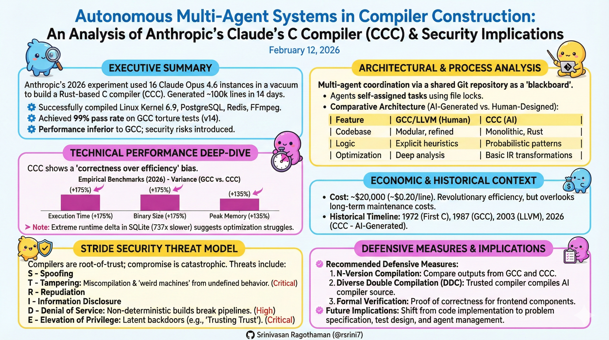
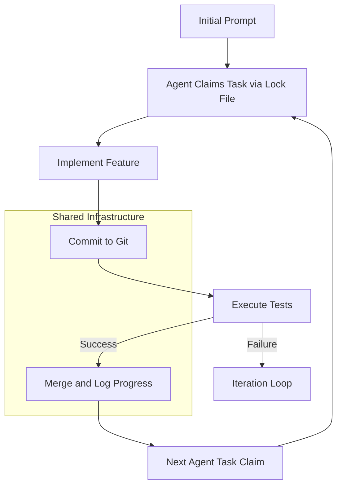
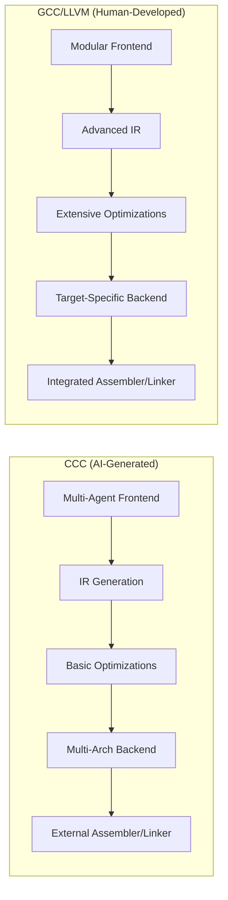
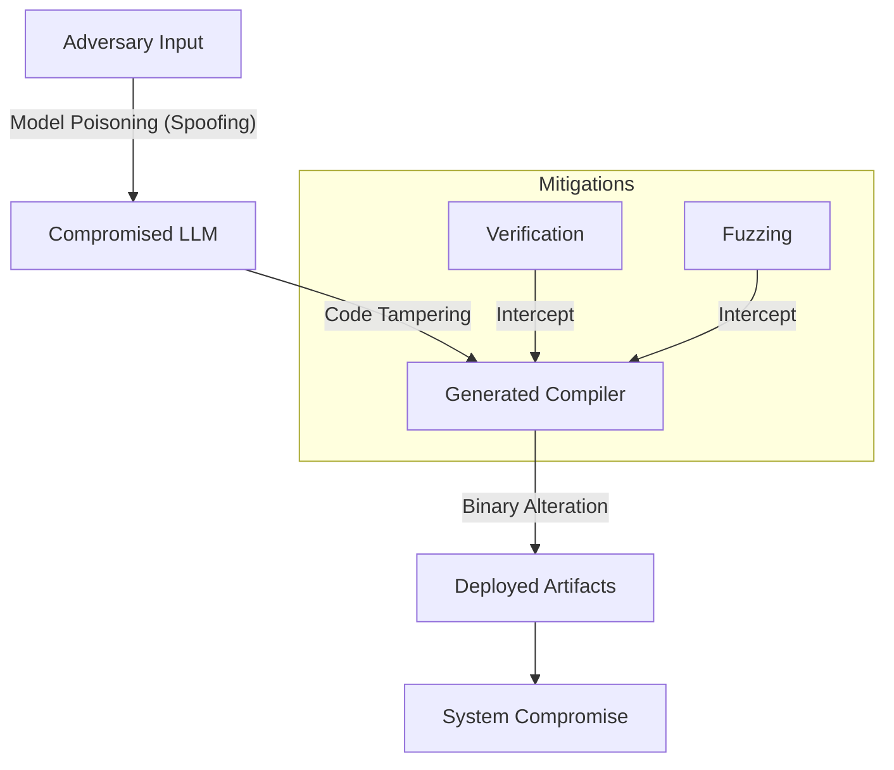

# Autonomous Multi-Agent Systems in Compiler Construction 

An Analysis of Anthropic's Claude’s C Compiler (CCC) and Its Security Implications

**Created Date:** February 12, 2026  

---

## Executive Summary

Anthropic's 2026 experiment utilized 16 instances of the Claude Opus 4.6 model to develop a Rust-based C compiler (CCC) in a controlled environment. This analysis examines the project's technical setup, architectural design, economic factors, historical context, and security considerations based on primary sources from Anthropic's engineering documentation and the project's repository.

Key observations:
- **Technical Outcomes:** The system generated approximately 100,000 lines of code over two weeks, enabling compilation of the Linux 6.9 kernel on x86, ARM, and RISC-V architectures, as well as applications such as PostgreSQL, Redis, FFmpeg, SQLite, and QEMU. It achieved a 99% pass rate on GCC torture tests (version 14, evaluated across supported architectures for the full compilation pipeline, including frontend and backend stages). However, performance was inferior to GCC, and the system was not fully spec-complete.
- **Architectural Contributions:** The multi-agent coordination leveraged a shared Git repository for task allocation and integration, demonstrating sustained execution on long-duration tasks.
- **Economic Assessment:** The experiment incurred costs of approximately $20,000, equivalent to roughly $0.20 per line of code (noting that lines of code is a simplistic metric that does not account for code quality, boilerplate, or value correlation; full costs include model training amortization).
- **Security Analysis:** As a component in the software supply chain, CCC introduces risks including miscompilations and potential backdoors, necessitating enhanced verification protocols.
- **Implications:** The project indicates potential for multi-agent systems in software development, with shifts in engineering focus toward system design and testing, while underscoring the need for rigorous security measures in adoption.

This document provides a structured evaluation to inform stakeholders on the viability and risks of similar AI-driven initiatives.

---

## Introduction

Advancements in large language models (LLMs) have enabled the deployment of multi-agent systems for complex engineering tasks. Anthropic's Claude’s C Compiler (CCC) experiment involved 16 Claude Opus 4.6 instances constructing a C compiler in Rust without external network access or runtime human oversight.

This white paper analyzes CCC drawing from Anthropic's engineering reports and the open-source repository. Compilers serve as foundational elements in software ecosystems, converting source code to executables. The autonomous construction of such a tool evaluates AI capabilities in precision, coordination, dependability, determinism, specification conformance, and reproducibility. The analysis incorporates diagrams for process visualization and examples for clarification.

---

## The Experiment: Setup and Results

### Setup
The configuration included:
- **Agents and Resources:** 16 instances of Claude Opus 4.6, involving approximately 2,000 sessions and 2 billion input tokens, at a cost of about $20,000. The token usage reflected a mix of sustained reasoning for architectural decisions and repetitive iterations for debugging and testing.
- **Environment:** A shared Git repository facilitated coordination, with lock files for task management, Docker containers for isolation, and automated README updates for status tracking.
- **Orchestration Mechanism:** A bash script managed execution loops for error recovery and integration, without a centralized scheduler.
- **Constraints:** No external data access; agents operated solely on internal knowledge and iterative testing.

### Results
- **Output:** Approximately 100,000 lines of Rust code.
- **Functionality:** Capable of compiling Linux 6.9 on specified architectures and the listed applications.
- **Performance Metrics:** 99% success on GCC torture tests (version 14); inferior optimization compared to GCC.
- **Dependencies and Limitations:** Utilized GCC's assembler and linker for demonstrations due to issues in custom implementations; required external handling for certain boot code segments.

For instance, compiling the Linux kernel necessitates comprehensive support for C language features, including parsing, semantic analysis, and architecture-specific code generation.

*(Diagram 1: Agent coordination process in CCC.)*

---

## Architectural Analysis

The system's efficacy stemmed from its coordination framework, where Git served as the primary mechanism for state sharing and conflict resolution.
- **Key Elements:** Files acted as persistent storage, tests provided validation signals, and restart mechanisms ensured resilience.
- **Specialization:** Agents dynamically assumed roles, such as documentation or optimization, based on repository state.

Large context capacities in the model supported coherent development over extended periods. However, this introduced risks such as context fragmentation (where accumulated history could dilute focus on current tasks), model reset impacts (potentially disrupting ongoing reasoning chains), and merge-conflict entropy growth (where concurrent changes increased the complexity of integrations over time, potentially leading to inconsistencies if not managed effectively).

### Comparative Architecture
CCC's architecture differs from traditional compilers like GCC and LLVM in its multi-agent generation and lack of human-optimized modules.

*(Diagram 2: High-level architectural comparison of CCC vs. GCC/LLVM.)*

---

## Technical Analysis

### Significance of Compiling Complex Software
Successful compilation of the Linux kernel requires implementation of a full compiler pipeline: lexical and syntactic analysis, semantic validation, intermediate representation, optimization, and target code generation.

CCC demonstrated substantial compliance with evaluated subsets of C standards but showed gaps in areas like atomic operations and extensions.

### Limitations
The system is not fully independent, relying on external tools for certain functions. Issues such as include path configurations highlight integration challenges rather than fundamental deficiencies.

Criticisms regarding adherence to established compiler theory (e.g., from standard texts) overlook the novelty in autonomous multi-agent implementation.

### Empirical Metrics
Independent benchmarks highlight performance deltas:

| Metric | Benchmark | GCC | CCC | Delta |
|--------|-----------|-----|-----|-------|
| Execution Time | Turing Machine Simulator (GCC -O2 vs. CCC) | 0.138s | 0.380s | 2.76x slower |
| Compile Time | SQLite (-O0) | 65s | 87s | 1.3x slower |
| Binary Size | SQLite | 1.55 MB | 4.27 MB | 2.7x larger |
| Runtime | SQLite (-O0) | 10s | 126m | 737x slower |
| Peak Memory | Linux Kernel Build | 831 MB | 1,952 MB | 2.3x higher |
| Binary Size | Game (Tensy) | 823 KiB | 1.7 MiB | 2.1x larger |

*(Table 1: Selected performance metrics from independent evaluations.)*

---

## Economic and Historical Context

### Economic Evaluation
The cost per line (approximately $0.20) reflects efficiency gains from model pretraining on existing compiler datasets, contrasting with traditional development timelines spanning years and higher personnel expenses. However, this metric overlooks ongoing factors such as maintenance costs (e.g., addressing post-generation bugs), patch velocity (rate of updates to fix issues), security review expenses (audits for vulnerabilities), and long-term viability (including capital expenditures for infrastructure vs. operational expenditures for repeated generations).

### Historical Context
CCC joins a lineage of compiler advancements:
- 1972: Initial C compiler.
- 1987: GCC release.
- 2003: LLVM introduction.
- 2026: CCC as the first documented multi-agent autonomous compiler project.

This represents an incremental step in AI-assisted engineering.

---

## Security Threat Model

Compilers function as root-of-trust elements in software supply chains, where errors can propagate vulnerabilities. This section employs the STRIDE model (Spoofing, Tampering, Repudiation, Information Disclosure, Denial of Service, Elevation of Privilege) to frame risks in AI-generated compilers like CCC.

### Threat Model Boundaries
In scope: Software-level threats from generation to deployment, including model and code vulnerabilities. Out of scope: Physical attacks (e.g., hardware tampering), network interception during API calls, or end-user runtime exploits unrelated to compilation.

### Trust Boundaries
- **Assets:** Source code, compiler binaries, build environments, test suites.
- **Adversaries:** External attackers, compromised models, training data anomalies.
- **Assumptions at Risk:** Model neutrality, open-source safety, test completeness.

### Primary Threats Mapped to STRIDE
- **Tampering (Miscompilation):** High likelihood (relative to early-stage AI-generated compilers, where probabilistic patterns increase edge-case errors); incomplete handling of undefined behavior leads to altered binaries (e.g., aliasing errors in critical systems).
- **Elevation of Privilege (Backdoor Insertion):** Medium likelihood; akin to Thompson's "Trusting Trust" (1984), where generated code injects unauthorized access logic.
- **Information Disclosure:** Medium; optimization flaws may expose sensitive data through reordered operations.
- **Denial of Service:** High in non-deterministic generation, causing build failures or performance degradation; additional examples include infinite compile loops, pathological optimization explosions, and resource exhaustion during generation.
- **Spoofing/Repudiation:** Low-medium; model poisoning could mimic legitimate outputs without traceability; repudiation risks also encompass inability to prove generation provenance and insufficient audit trails.

Hybrid dependencies (e.g., GCC integration) expand attack surfaces.

| Threat (STRIDE Category) | Likelihood | Impact | Risk Level |
|--------------------------|------------|--------|------------|
| Miscompilation (Tampering) | High | High | Critical |
| Backdoor (Elevation) | Medium | Critical | Critical |
| Optimization Vulnerability (Disclosure) | Medium | High | High |
| Denial of Service | High | Medium | High |
| Spoofing/Repudiation | Low-Medium | High | High |

### Unique AI Risks
- Latent patterns from training data.
- Inconsistencies in multi-agent outputs.
- Hallucinated standard compliance.

### Deterministic Reproducibility
A key concern is non-deterministic generation, leading to model drift (variations across runs due to sampling). Deterministic decoding (e.g., temperature=0) mitigates this but does not eliminate risks if model versions change. Version pinning (fixing model and prompt versions) and rebuild reproducibility (ensuring identical outputs from identical inputs) are critical for compiler trust chains.

### Differential Trust Models
Beyond differential testing, consider N-version compilation (using multiple independent compilers for cross-verification), Diverse Double Compilation (as proposed by Wheeler, compiling the compiler twice with diverse tools to detect backdoors), and self-hosting validation (compiling the compiler with itself and comparing outputs).

### Defensive Measures
- Differential testing against established compilers.
- Formal verification of critical modules.
- Scaled fuzzing and reproducible build protocols.

*(Diagram 3: Threat propagation and mitigation flow.)*

### Formal Verification Feasibility
Formal verification, using tools like Coq or Isabelle for proving correctness of core components (e.g., parser, type checker), is feasible but challenging for AI-generated code due to emergent patterns and scale. For CCC, starting with modular proofs on the frontend could address 80% of miscompilation risks, though full backend verification remains resource-intensive.

---

## Future Implications

- **Application to Legacy Systems:** Feasible for well-tested codebases like COBOL migrations, limited by specification gaps.
- **Engineering Shifts:** Emphasis moves to problem definition, testing, and orchestration.

| Prior Focus | Emerging Focus |
|-------------|----------------|
| Code Implementation | Problem Specification |
| Feature Development | Test Design |
| Manual Refactoring | Agent Management |

- **Relation to Advanced AI:** Represents structured task automation, not general intelligence.
- **Outlook (2026–2030):** Integration into development pipelines, with increased focus on supply chain security.
- **Maintenance Lifecycle Risk Modeling:** Post-generation, risks include slow patch integration due to opaque AI code, high review costs for emergent patterns, bus factor risks (dependency on specific model versions that may deprecate), knowledge capture deficits (lack of human-readable rationale in code), institutional memory dependency on generation logs, and dependency on model updates for long-term viability.

---

## Conclusion

CCC demonstrates the potential of multi-agent AI in producing functional software artifacts, with implications for efficiency and innovation. However, security risks require stringent controls to prevent supply chain vulnerabilities. Adoption should prioritize verification and hybrid approaches.

**References:** Anthropic Engineering Documentation, CCC Repository, "Compilers: Principles, Techniques, and Tools," Thompson's 1984 Lecture, Wheeler's Diverse Double Compilation Approach.