# Understanding Auto-Regression in AI: The Speed-Quality Trade-off

## Executive Summary

This whitepaper explains how Large Language Models (LLMs) generate text and why they can seem slow despite their intelligence. We explore the fundamental mechanism called auto-regression, its benefits and limitations, and the cutting-edge techniques being developed to overcome its speed bottleneck while maintaining quality.

**Key Takeaways:**
- Auto-regression makes AI smart but slow by generating one word at a time
- New techniques can speed up AI by 2-5x without sacrificing quality
- The future involves balancing perfection with performance

---

## 1. Introduction to Auto-Regression

### What is Auto-Regression?

**Auto-regression** combines two concepts:
- **Auto** = self
- **Regression** = prediction

In simple terms, auto-regression means the model predicts what comes next by looking at what has already happened.

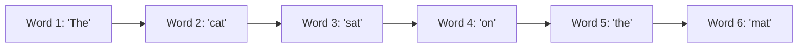

### Historical Context

Auto-regression has a rich history across different fields:

| Decade | Field | Application |
|--------|-------|-------------|
| 1950s | Economics & Meteorology | Market trends and weather forecasting |
| Later decades | Audio Processing | Signal processing |
| 2010s | Natural Language Processing | Language understanding and generation |
| Today | Generative AI | ChatGPT, voice models, and more |

### How It Works Mathematically

At its core, auto-regression uses this principle:

**The next word (at time t) = a weighted combination of previous words**

This means the model:
1. Looks at all previous words
2. Assigns importance (weights) to each word
3. Uses this information to predict the most likely next word
4. Repeats this process step-by-step

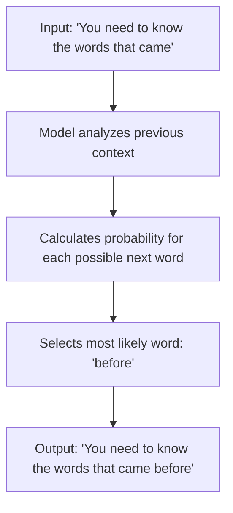

---

## 2. The Bottleneck Problem

### Sequential Dependency: The Core Issue

The very mechanism that makes auto-regression powerful creates its biggest weakness: **it must generate one token at a time, in order**.

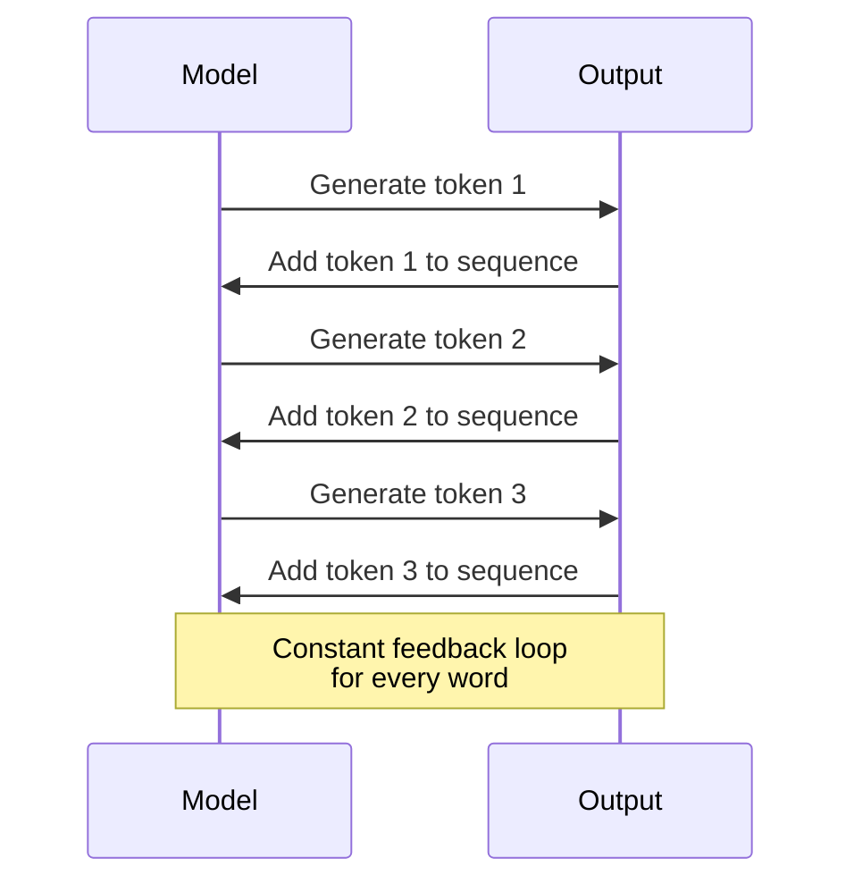

This creates a continuous "generate, feedback, generate, feedback" loop for every single word.

### Why Can't We Parallelize?

**The model cannot generate word 5 until word 4 is successfully generated.**

Think of it like building a Lego tower:
- You must place brick 1 before brick 2
- You must place brick 2 before brick 3
- You cannot stack all bricks at once

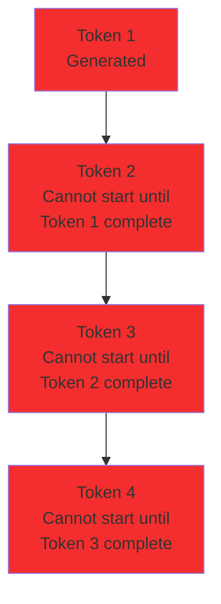

### Impact on Performance

For a 100-word response:
- **Sequential processing** = 100 separate generation steps
- Each step requires the model to reload weights and process everything
- Memory bandwidth becomes the limiting factor, not compute power

---

## 3. Exposure Bias: A Surprising Discovery

### What is Exposure Bias?

**Exposure bias** refers to the gap between how models are trained versus how they work in real use.

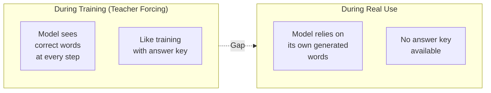

### The Fear and the Reality

**Initial Fear:**
- One small mistake could cascade into bigger errors
- The output would quickly derail from accuracy

**Surprising Reality:**
Research shows that models have a remarkable **self-recovery ability**:
- Even with slightly incorrect input history, models often get back on track
- Exposure bias causes only minor performance drops (2-3%)
- This is **not** the catastrophic problem researchers initially feared

### Teacher Forcing Explained

**Teacher Forcing** is the training technique that creates exposure bias:

During training:
1. Model predicts word 5
2. Instead of using its prediction, we show it the correct word 5
3. Model uses this correct word to predict word 6
4. Repeat for entire sequence

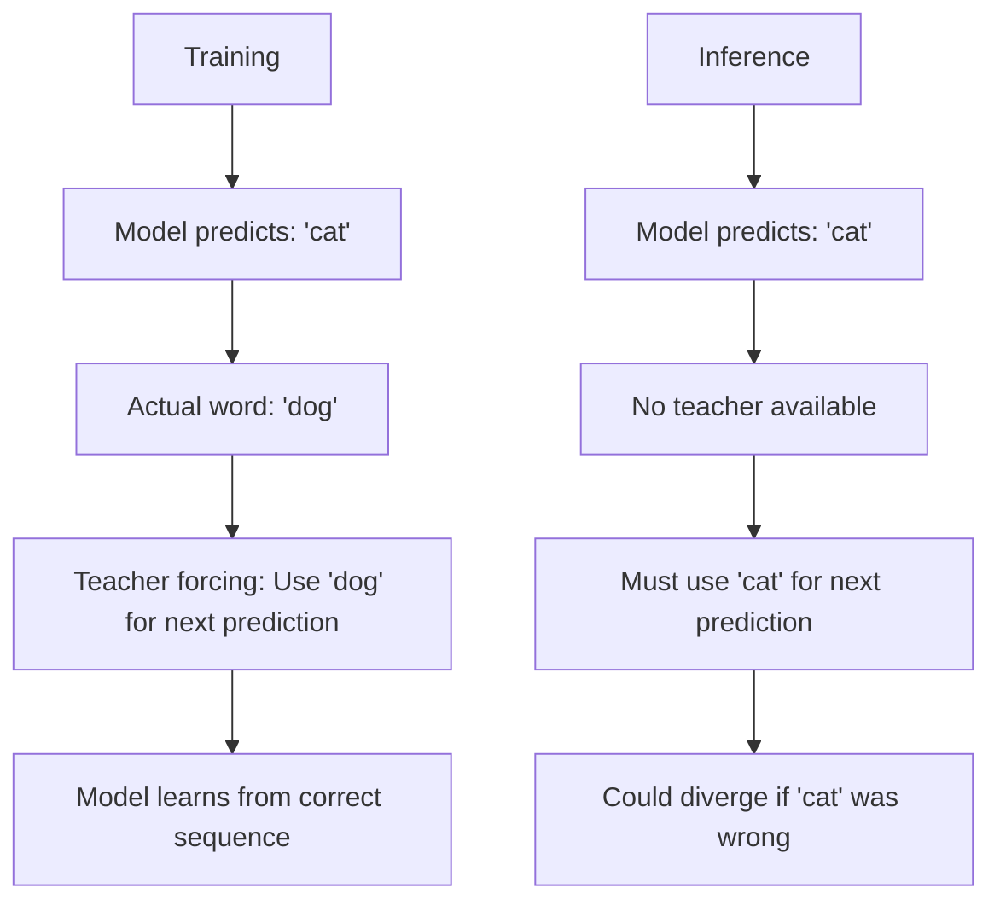

---

## 4. Solutions to Speed Up AI

### Two Main Philosophies

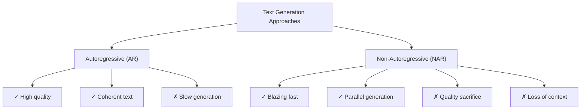

### Solution 1: Speculative Decoding

**Concept:** Use a small, fast model to draft; a large model to verify.

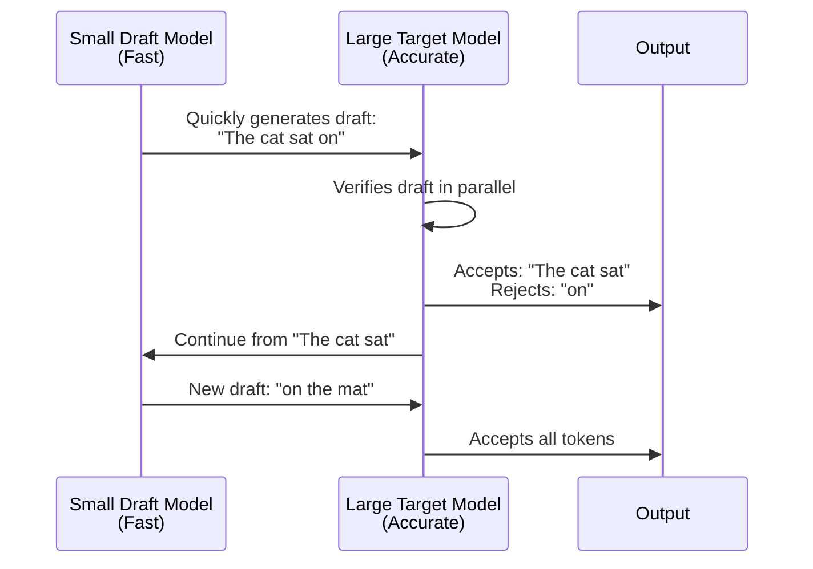

**How It Works:**
1. Small model quickly generates next 3-5 words
2. Large model checks these words in a single parallel step
3. Accepts correct predictions, rejects wrong ones
4. Continues from last correct word

**Results:**
- 2-3x speed improvement
- No loss in quality (same output as using large model alone)
- Much faster than generating from scratch

### Solution 2: Speculative Streaming

**Evolution of Speculative Decoding:** Uses a single model with multi-stream attention.

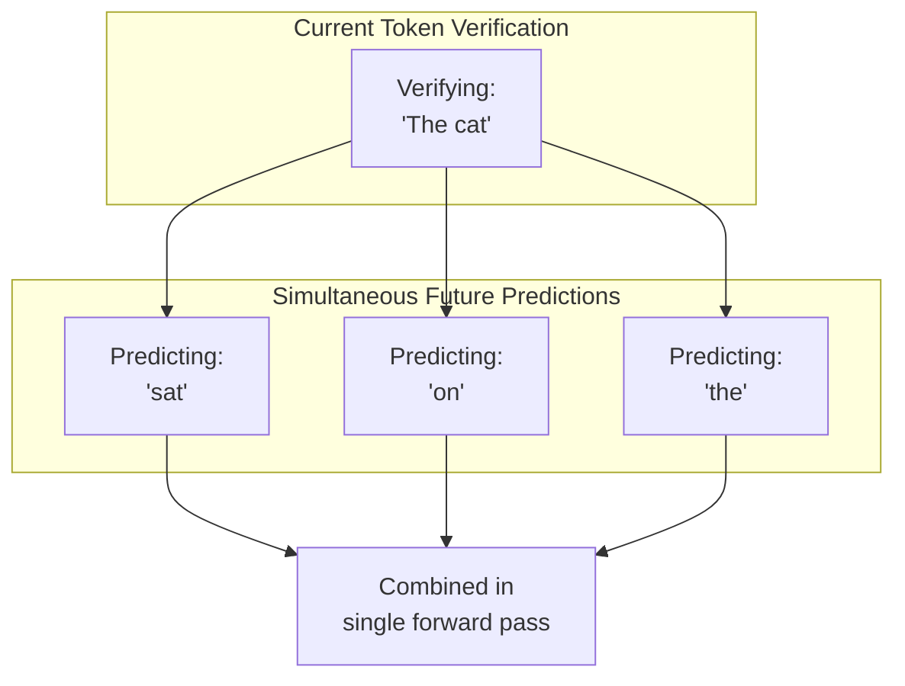

**Mechanism:**
- While confirming the current word, simultaneously predict several future words
- Like a chess master thinking several moves ahead
- Uses multi-stream attention within one model

**Results:**
- 2-3.5x speed improvement
- More efficient than using separate models
- Parameter-efficient (~10,000x fewer extra parameters than alternatives)

**Accuracy Visualization:**

```mermaid
graph LR
    A["Layer 1<br/>Low confidence"] --> B["Layer 5<br/>Medium confidence"]
    B --> C["Layer 10<br/>High confidence"]
    C --> D["Final Layer<br/>Highest accuracy"]
    
    style A fill:#2f2ccc
    style B fill:#1f1f1f
    style C fill:#5c1fcc
    style D fill:#901E90
```

Model predictions become more accurate in deeper layers of the network.

### Solution 3: Knowledge Distillation

**Goal:** Train fast NAR models to achieve quality of slow AR models.

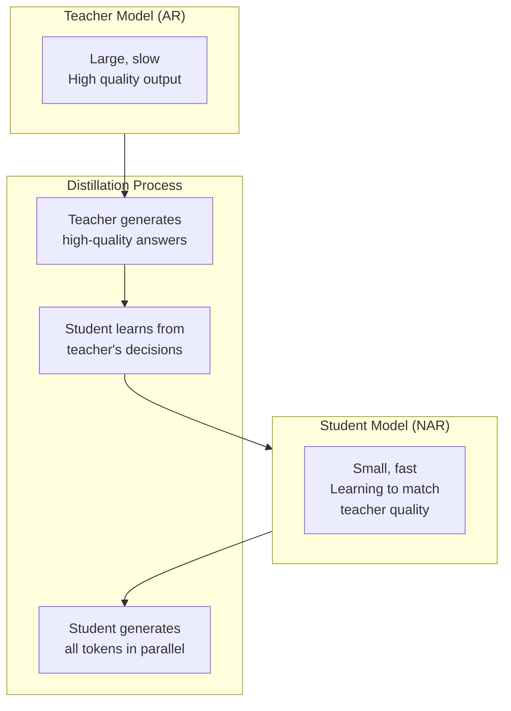

**How It Works:**

1. **Teacher (Large AR Model):**
   - Produces slow but excellent results
   - Captures complex patterns and dependencies

2. **Student (Small NAR Model):**
   - Learns to mimic teacher's decisions
   - Makes all predictions in parallel (simultaneously)

3. **Knowledge Transfer:**
   - Student trained on teacher's high-quality outputs
   - Learns not just correct answers, but the reasoning patterns

**Performance Example:**

| Model Type | Generation Time | Quality (Optimality Gap) | Speed Improvement |
|------------|-----------------|--------------------------|-------------------|
| AR Teacher | 422 seconds | Baseline (highest) | 1x |
| NAR Student | 0.43 seconds | Nearly identical | ~980x faster |

**Results:**
- 4-5x faster than original AR models (in typical cases)
- Some cases show nearly 1000x improvement
- Minimal quality loss
- Student becomes nearly as intelligent as teacher

---

## 5. Conclusion

### Closing the Gap

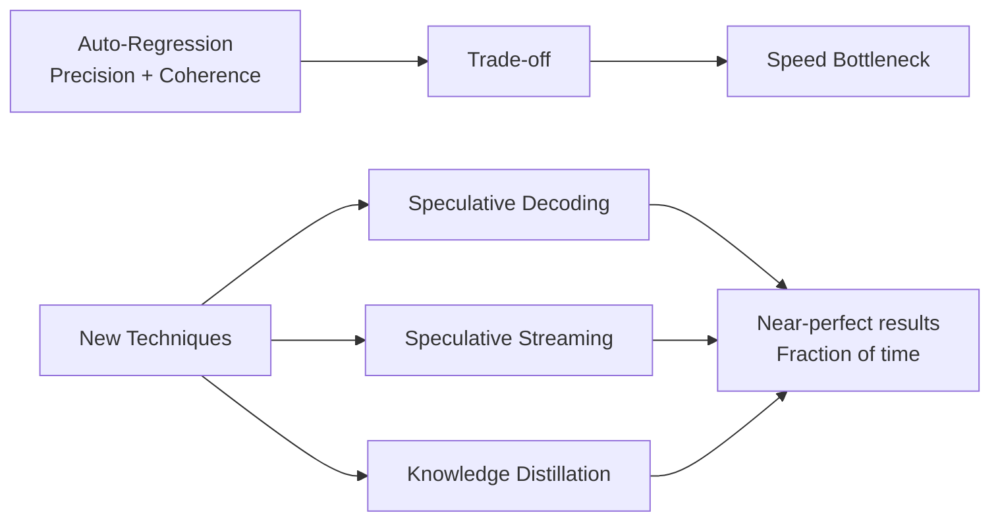

Auto-regression provides:
- ✓ Precision in predictions
- ✓ Coherent, contextual text
- ✗ Slower generation speed

New techniques bridge this gap:
- Speculative methods: 2-3.5x speedup
- Knowledge distillation: 4-1000x speedup
- All maintain quality comparable to original models

### The Fundamental Question

**As AI models become faster, what trade-offs between perfection and performance are users and developers willing to make?**

Consider these scenarios:

| Use Case | Priority | Acceptable Trade-off |
|----------|----------|---------------------|
| Creative writing | Quality | Slower is fine |
| Real-time chat | Speed | Slight quality loss OK |
| Code generation | Accuracy | Can't sacrifice quality |
| Simple Q&A | Balance | Moderate speed boost helpful |

### Future Directions

The field is moving toward:

1. **Adaptive Systems:** Models that automatically balance speed vs. quality based on task
2. **Hybrid Approaches:** Combining AR for critical parts, NAR for simple parts
3. **Continuous Improvement:** Ongoing research to close the quality gap further

### Key Insights for Practitioners

**For Developers:**
- Speculative decoding: Best when you have existing draft models
- Speculative streaming: Best for single-model, resource-constrained scenarios
- Knowledge distillation: Best for deployment to edge devices

**For Business Leaders:**
- Speed improvements directly impact user experience
- Cost reductions from faster inference are significant
- Quality must remain acceptable for specific use cases

**For Researchers:**
- Exposure bias is less severe than initially thought
- Single-model approaches show great promise
- Parameter efficiency is crucial for deployment

---

## Glossary

**Auto-regression (AR):** Generating text one token at a time, where each token depends on all previous tokens.

**Exposure Bias:** The mismatch between training (using correct tokens) and inference (using model's own predictions).

**Knowledge Distillation:** Training a smaller model to mimic a larger model's behavior.

**Non-Autoregressive (NAR):** Generating all tokens simultaneously in parallel.

**Speculative Decoding:** Using a draft model to predict multiple tokens, then verifying with the target model.

**Teacher Forcing:** Training technique where the model is shown the correct token at each step.

**Token:** A unit of text (usually a word or part of a word) that the model processes.

---

## References

1. AWS. "What are Autoregressive Models?" (2025)
2. Chen et al. "Accelerating Large Language Model Decoding with Speculative Sampling" (2023)
3. Google Research. "Looking back at speculative decoding" (2024)
4. Hinton et al. "Distilling the Knowledge in a Neural Network" (2015)
5. IBM. "What is Knowledge distillation?" (2025)
6. Leviathan et al. "Fast Inference from Transformers via Speculative Decoding" (2022)
7. NVIDIA. "An Introduction to Speculative Decoding" (2025)
8. Ren et al. "A Study of Non-autoregressive Model for Sequence Generation" (2020)
9. Wang et al. "Quantifying Exposure Bias for Neural Language Generation" (2019)
10. Bhendawade et al. "Speculative Streaming: Fast LLM Inference without Auxiliary Models" (2024)

