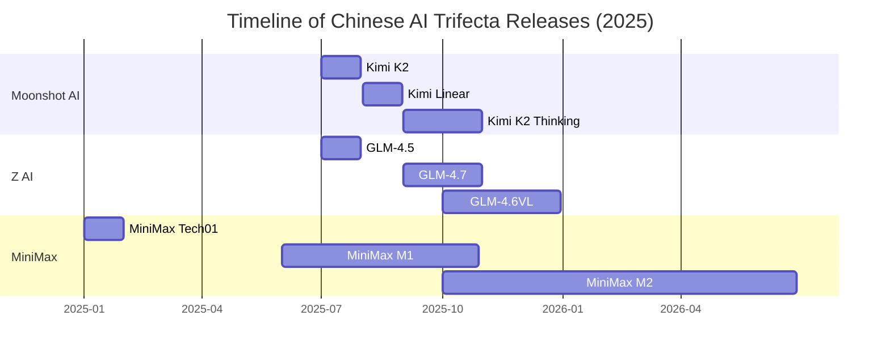

# Technical Document: The Chinese AI Trifecta for Developers and Architects

## Introduction
This document summarizes the key technical points from the video "The New China AI Trifecta" (published January 13, 2026), focusing on three leading Chinese open-source AI labs: Moonshot AI, Z AI (formerly Zhipu AI), and MiniMax. These labs have advanced large language models (LLMs) rapidly from July to December 2025, emphasizing practical, agentic AI over traditional benchmarks. The trifecta challenges closed-source giants like OpenAI, Anthropic, and Google by prioritizing real-world usability, inference efficiency, and specialization.

The document is structured for simplicity: trends, lab-specific details, overall insights, and comparisons. It targets developers (implementation focus) and architects (design and scalability focus). Key concepts include agentic AI (models that use tools, reason multi-step, and handle tasks like coding), quantization for efficient deployment, and evolving benchmarks.

## Key Trends in LLM Development
- **Benchmark Shift**: Traditional benchmarks (e.g., MMLU for knowledge, GSM8K for math) are saturated. New ones emphasize practical tasks: SWE-Bench (coding), LiveCodeBench (live coding), TAU Bench (agent tool use), Agentic 2025 (agent workflows), GPQA Diamond (expert Q&A).
- **Practical Focus**: Models prioritize inference speed, cost, and quantization (e.g., int4 precision) over full-precision benchmarks. User experience in deployments matters more than raw scores.
- **Agentic Emphasis**: LLMs are evolving for specialized applications, enabling smaller labs to compete by excelling in niches like coding or long-context handling.
- **Open-Source Acceleration**: Chinese labs share research openly, accelerating innovation via techniques like custom optimizers and attention mechanisms.

For architects: Design for modularity—integrate agentic features (tool calling, multi-hop reasoning) to build scalable systems. For developers: Optimize for quantization to reduce latency/costs in production.

### Timeline of Key Releases (Mermaid Diagram)
Below is a simple Mermaid Gantt chart showing the chronological progression of major releases discussed.

## Moonshot AI
### Background
Founded March 2023; valued at $2.5B USD. Emphasizes open research, similar to DeepSeek, with a risk-taking approach.

### Key Releases and Innovations
- **Kimi K2 (July 2025)**: First model using Muon optimizer (replaces Adam; basic training block with math proofs).
- **Kimi Linear**: Hybrid attention for 1M context window, outperforming SOTA on recall.
- **Kimi K2 Thinking**: SOTA on Artificial Analysis leaderboard; uses quantization-aware training (QAT) for int4 inference, doubling speed with minimal loss.

### Implementation Details
- Optimizer: Muon for efficient training (detailed in researcher blogs with code guides).
- Quantization: QAT in post-training ensures low-precision models match benchmarks.
- Attention: Hybrid mechanisms for long contexts.

For developers: Implement QAT in your training pipelines (e.g., via PyTorch) to optimize serving. For architects: Design for variable precision to balance speed and accuracy in distributed systems.

### Strengths
- Inference efficiency and long-context tasks.
- Outperforms DeepSeek/Qwen in open-source rankings.

## Z AI
### Background
Originated 2019 from Tsinghua University; rebranded mid-2025; valued at $5.6B USD (publicly traded). Started in visual gen (CogView); focuses on agentic AI.

### Key Releases and Innovations
- **GLM-4.5 (July 2025)**: Tops leaderboards; 3x smaller than Kimi K2 but superior in aspects; uses Group Query Attention (GQA) and Muon.
- **GLM-4.7**: Beats Kimi K2 Thinking; SOTA in practical metrics.
- **GLM-4.6VL/GLM-4.6VL Air**: Vision models for code gen from web/Figma designs.

### Implementation Details
- Attention: GQA (like Llama 3) for efficiency.
- Formatting: XML over JSON for code tasks (avoids escaping issues).
- Training: Agentic focus (tool use, reasoning); high throughput (1,500 tokens/sec on Cerebras hardware).
- Serving: $3/month API, cheaper than Claude.

For developers: Use XML for structured outputs in agentic apps to simplify parsing. For architects: Leverage vision capabilities for multimodal systems (e.g., UI-to-code pipelines).

### Strengths
- Agentic coding/tool use; affordable alternative to Claude.
- Tops TAU Bench and web design tasks.

## MiniMax
### Background
Founded 2021; valued at $4B USD. Started in AI roleplay; pivoted to video/speech (Huo AI, Speech 02 HD); focuses on massive models.

### Key Releases and Innovations
- **MiniMax Tech01/VL01 (January 2025)**: 456B param MoE (46B active); 1M context with Linear Attention.
- **MiniMax M1 (June 2025)**: Reasoning model; struggles with multi-hop.
- **MiniMax M2 (October 2025)**: Pivots to GQA; tops SWE-Bench (open-source #1); 2x cheaper than Kimi K2 on context.

### Implementation Details
- Architecture: Mixture of Experts (MoE) for scale; shift from Linear to standard attention for better reasoning.
- Licensing: MIT; focuses on agentic tasks (tool use, coding).
- Challenges: Hallucinations in multi-hop, but strong in instruction following.

For developers: Experiment with attention pivots in fine-tuning for reasoning gains. For architects: Use MoE for scalable, sparse activation in large models.

### Strengths
- Cost-effective long-context and agentic coding.
- Rapid iteration for application focus.

## Overall Insights
- **Common Architectures**: Muon optimizer (Moonshot, Z AI), GQA (Z AI, MiniMax), attention variants (hybrid/linear/standard).
- **Developer Tips**: Prioritize quantization, agentic formatting (XML/JSON), and hardware optimization (e.g., Cerebras).
- **Architect Tips**: Build for specialization—agentic AI enables modular, niche systems. Open-source sharing accelerates iteration.
- **Future**: Expect 2026 focus on agentic apps; trifecta balances research and practicality.

## Comparisons with Other Popular Gen AI
The table below compares the trifecta to popular Gen AI (e.g., OpenAI's GPT series, Anthropic's Claude, Google's Gemini, and other Chinese labs like DeepSeek/Qwen). Focus: size, focus, efficiency, and strengths.

| Aspect                  | Chinese Trifecta (Moonshot, Z AI, MiniMax) | OpenAI (GPT-4o) | Anthropic (Claude 3.5) | Google (Gemini 1.5) | DeepSeek/Qwen (Other Chinese) |
|-------------------------|--------------------------------------------|-----------------|------------------------|---------------------|-------------------------------|
| **Model Size**         | Varied (e.g., 456B MoE; smaller variants like GLM-4.5 Air) | Massive (trillions?) | Large (undisclosed)   | Large (1.5T+)      | Large (e.g., DeepSeek V2: 236B) |
| **Primary Focus**      | Agentic/practical (coding, tools, inference efficiency) | Generalist (chat, reasoning) | Safety/agentic coding | Multimodal/search  | Research (sparse attention, benchmarks) |
| **Efficiency (Inference/Cost)** | High (QAT/int4, $3/month APIs, 1,500 tokens/sec) | Moderate (high costs) | High but expensive ($20-100/month) | Optimized for cloud | Good but research-oriented |
| **Innovations**        | Muon optimizer, GQA, XML formatting, attention pivots | o1 reasoning chain | Artifacts (code gen)  | Flash for speed   | Sparse MoE, long-context |
| **Strengths**          | Open-source, affordable agents; challenges closed-source on usability | Broad capabilities | Coding reliability    | Integration with Google ecosystem | Niche benchmarks; open research |
| **Weaknesses**         | Hallucinations in multi-hop; newer players | Closed-source; high costs | Less multimodal       | Privacy concerns  | Less practical focus |
| **Use Cases for Devs/Archs** | Building agentic apps (e.g., code gen from designs) | General prototyping | Secure coding tools   | Search-enhanced AI | Experimental research |

In summary, the trifecta excels in open, practical AI, outpacing US giants in affordability and agentic niches while complementing research-heavy peers like DeepSeek. For developers/architects, adopt their techniques (e.g., QAT, Muon) for efficient, specialized systems.

Ref: https://www.youtube.com/watch?v=82DyXL0ZXI8