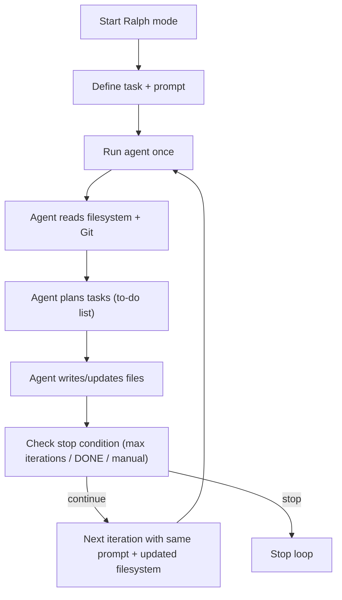

Ralph Mode for Deep Agents is the same Ralph Wiggum loop pattern, but implemented as a LangChain Deep Agent that is re‑invoked in a loop with the same task while using the filesystem (plus Git) as persistent memory between iterations.[1][2][3]

Below is an updated simple whitepaper‑style markdown file that combines what you saw in both videos (Claude Code “Ralph” and Deep Agents “Ralph Mode”).

***

# Ralph Wiggum Loops and Ralph Mode (Deep Agents)

## Concept overview

Ralph Wiggum loops are a pattern for running AI coding agents autonomously by re‑invoking the same task in a loop while using the **filesystem as memory** instead of chat history.[4][5][1]
Ralph Mode for Deep Agents applies the same idea to LangChain Deep Agents: the agent is called repeatedly with the same prompt, sees an updated project directory each time, and continues work until a stopping condition is met (or you manually stop it).[2][3][1]

***

## Core loop pattern

### High‑level behavior

- You define a clear task specification (for example: “build a beginner Python programming course, use Git, create modules and exercises”).[6][1]
- A loop repeatedly runs the agent (Claude Code or Deep Agent) with that same task every iteration.[1][4]
- On each iteration, the agent:
  - Reads the current filesystem (code, docs, to‑do lists, Git history if present).[7][1]
  - Plans work (often using internal tools like a to‑do list planner).[2][1]
  - Writes or updates files and possibly commits to Git.[1][2]
- When the run ends, the outer loop starts another iteration, giving the agent the **same prompt** but now with a richer filesystem reflecting previous progress.[3][1]

### Example control flow (conceptual)

***

## Ralph with Claude Code vs Ralph Mode (Deep Agents)

| Aspect                    | Ralph loop (Claude Code)                                                                 | Ralph Mode (Deep Agents)                                                                                           |
|---------------------------|------------------------------------------------------------------------------------------|--------------------------------------------------------------------------------------------------------------------|
| Runtime shell             | Simple bash `while` loop that invokes Claude Code CLI with `prompt.md`.[1][5]  | Deep Agent CLI with a `--ralph` or similar flag to enable looping mode.[1][2]                            |
| Task definition           | `prompt.md` describing outcome, constraints, and what “done” means.[1][8]     | CLI instruction string or config (e.g., “build a Python programming course for beginners, use git”).[1][6] |
| Memory mechanism          | Project files on disk; Claude Code inspects repo each run.[1][9]             | Filesystem + optional Git history; Deep Agent tools read and update files.[1][2][7]                 |
| Planning                  | Emergent from Claude Code’s internal workflow.[1][10]                          | Uses Deep Agents planning tools, e.g., a to‑do list tool that builds/updates a task list each iteration.[1][2] |
| Example output            | Features, migrations, test suites, refactors.[1][11]                           | Example in video: a full Python course with modules, exercises, and projects.[1][6]                      |
| Loop stopping options     | Max iterations or manual stop (Ctrl+C), plus optional “DONE” pattern in prompt.[1][8] | Max iterations flag, agent deciding it is done, or manual interrupt; design is flexible.[1][2]          |
| Context management        | Reset conversation each run; rely on files as persistent state.[1][5]         | Same benefit: each loop is a fresh context with summarized state in files, reducing long‑context degradation.[1][1][7] |

***

## Why filesystem‑based loops work

Filesystem‑based loops avoid long chat histories and “context rot” by treating files as the source of truth.[7][1]
Each loop starts with a cleaner context window, but the agent can still see prior progress by reading project files, task lists, and Git history.[2][1]

Key advantages:

- **Eventual consistency** for grindy tasks: given enough iterations, the agent tends to converge on a functional solution, even if not perfect.[5][1]
- **Better long‑running behavior**: instead of one fragile, massive context, you have many small runs plus persistent state in the repo.[7][1]
- **Traceability**: with Git enabled, you can see each change across iterations, revert, or inspect diffs.[1][2]

***

## When to use vs avoid

### Good use cases

- Greenfield projects: new services, CLIs, or small apps where you have clear specs and little to break.[12][1]
- Large refactors and migrations: repetitive transformations with stable behavior targets and tests.[8][1]
- Test generation and coverage goals: “keep writing tests until coverage ≥ X%.”[11][1]
- Course/content/codebase generation: e.g., generate a full Python course with modules, exercises, and projects.[6][1]

### When not to use

- Security‑critical code: auth, crypto, payments—agents may produce insecure code that passes naive tests.[11][1]
- Core architecture decisions: monolith vs microservices, SQL vs NoSQL, or system design tradeoffs.[11][1]
- Open‑ended exploration: debugging “why is the app slow?” without clear “done” criteria; the loop may run forever or stop prematurely.[11][1]
- Situations needing strong business judgment or hidden context that cannot be fully encoded in the prompt.[12][1]

***

## Practical control and safety

### Iteration control

- Always set a **max iterations** value when experimenting (for example, 10–20 iterations to start).[3][1]
- Optionally have the agent emit a clear completion signal in a log file or summary (for example, write `DONE` or “all tasks complete”).[2][1]
- Support manual override: Ctrl+C or equivalent to stop long‑running Ralph sessions.[4][1]

### Cost and resource management

- Each iteration is a full agent run; on large repos with strong models, many iterations can become expensive.[1][11]
- Prefer predictable billing (flat‑rate plans) or strict caps on iterations and token usage when using paid APIs.[11][1]
- Use tests, linters, and coverage tools so the agent can check progress automatically rather than wasting iterations on guesswork.[2][1]

***

## Mental model for using Ralph Mode

Think of Ralph Mode as a **looped project worker**: you give it a clear goal, a repo, and tools (filesystem, Git, planners), then you let it grind through the task while you only specify outcomes and guardrails.[3][1]
Failures and weird outputs are feedback about missing constraints or unclear specs, so you update the prompt or structure of the repo rather than micromanaging each step.[5][1]
The goal is to stop “babysitting” the agent and instead design tasks, prompts, and environments in which the agent can safely run for many iterations without supervision.[3][1]

***

[1](https://www.youtube.com/watch?v=yi4XNKcUS8Q)
[2](https://github.com/langchain-ai/deepagents)
[3](https://www.linkedin.com/posts/deeplyagentic_agenticai-autonomousagents-deepagents-activity-7414751794892881921-bUry)
[4](https://x.com/Vtrivedy10/status/2008945303353971066)
[5](https://paddo.dev/blog/ralph-wiggum-autonomous-loops/)
[6](https://www.linkedin.com/posts/vivek-trivedy-433509134_ralph-mode-is-here-run-your-friendly-agent-activity-7414723647141175296-G8No)
[7](https://docs.langchain.com/oss/python/deepagents/overview)
[8](https://awesomeclaude.ai/ralph-wiggum)
[9](https://anandchowdhary.com/blog/2025/running-claude-code-in-a-loop)
[10](https://motlin.com/blog/claude-code-workflow-commands)
[11](https://dev.to/sivarampg/the-ralph-wiggum-approach-running-ai-coding-agents-for-hours-not-minutes-57c1)
[12](https://www.atcyrus.com/stories/ralph-wiggum-technique-claude-code-autonomous-loops)
[13](https://www.linkedin.com/posts/langchain-oss_ralph-mode-for-deep-agents-what-if-activity-7414709373324849153-h-wX)
[14](https://github.com/langchain-ai/deep-agents-from-scratch)
[15](https://www.youtube.com/@LangChain/videos)
[16](https://www.youtube.com/watch?v=CejntUP3muU)