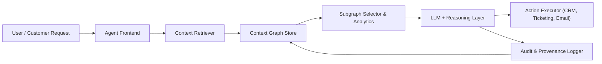
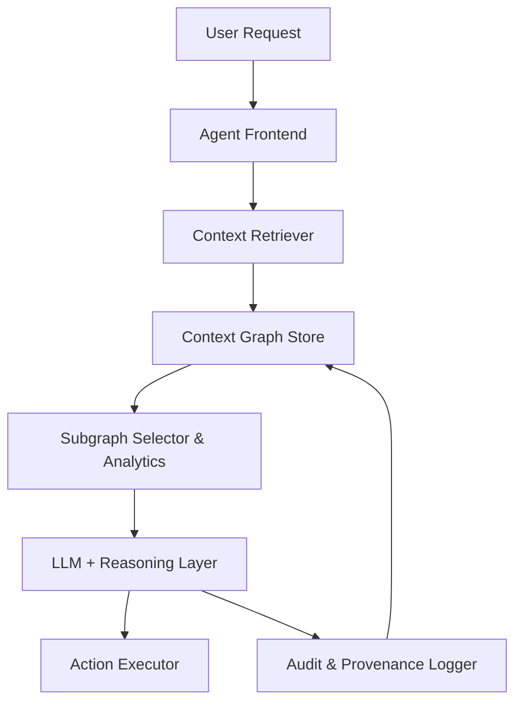
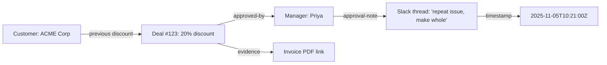

## 1. Executive summary

Context graphs are graph-structured representations that capture both facts and the **context** around those facts: provenance, decision traces, time validity, policy constraints, and links to underlying evidence.[3][1]
They are emerging as an AI-optimized “living layer” that LLM-based agents query to answer not only *what* happened but *why*, improving autonomy, reliability, and auditability in enterprise workflows.[2][1]

***

## 2. Why we need context graphs

Traditional systems of record (ERPs, CRMs, warehouses, data lakes) primarily store outcomes: “deal closed”, “incident resolved”, “policy updated”.[4][1]
They do not reliably capture the informal and cross-channel traces that explain **why** those outcomes were allowed (exceptions, backchannel approvals, chat threads), which limits what agents can safely automate.[5][1]

LLM agents, however, are cross-system and action-oriented: they read tickets, emails, chats, and logs, then propose or execute actions.[6][1]
Without decision traces and temporal context, they either overfit to static rules or hallucinate, making them hard to trust in high-stakes workflows like pricing, compliance, or incident response.[1][3]

***

## 3. What is a context graph?

In Other words,A context graph is a graph (often triple-based: subject–predicate–object) enriched with metadata about time, provenance, evidence, actors, and policies, explicitly designed to be consumed by AI systems.[2][3]
Rather than exposing an entire enterprise knowledge graph, a context graph focuses on AI-ready subgraphs that bundle facts with their explanatory context for a specific question or decision.[6][2]

Formally, recent work defines context graphs as extensions of classical knowledge graphs that annotate each triple or relation with attributes such as temporal validity, geographic scope, and source provenance, then use these annotations in reasoning and retrieval.[3]
This additional structure enables LLM-based pipelines to retrieve, rank, and reason over localized “decision neighborhoods” instead of unstructured document chunks.[2][3]

***

## 4. How context graphs differ from knowledge graphs

Both context graphs and knowledge graphs use nodes and edges to represent entities and relationships, often with ontologies and constraints for validation.[7][2]
The difference is in emphasis: knowledge graphs focus on semantic integration and inference over *what* is true, while context graphs emphasize *why*, *when*, and *under which conditions* facts and decisions apply.[1][3]

### Knowledge graphs vs context graphs

| Aspect                     | Knowledge graphs                                            | Context graphs                                                      |
|---------------------------|-------------------------------------------------------------|----------------------------------------------------------------------|
| Primary goal              | Integrate and reason over entities/relations (“what”) [7] | Capture decision traces, provenance, and applicability (“why/when”) [1][3] |
| Core unit                 | Triples plus schema/ontology [7]                      | Triples plus temporal, provenance, policy, evidence metadata [3][2] |
| Main consumers            | BI tools, KGQA, search, analytics [7]                 | LLMs and agents executing or recommending actions [2][6] |
| Typical queries           | “What products are related to X?”                          | “Why was this exception approved and does it apply now?” [1][8] |
| Temporal focus            | Often static or snapshot-based                             | Explicit validity intervals, freshness, versioning [3]        |
| Provenance & audit        | Optional, sometimes coarse                                 | First-class, modeled via standards like W3C PROV [3]  |

By layering provenance, temporal scope, and policy constraints on top of facts, context graphs become a natural fit for reconstructing localized narratives such as “why this decision was made for this customer at this time”.[3][1]

***

## 5. Core components

A practical context graph for agents usually includes these **components**:

- **Entities & relations**  
  Domain objects (customers, tickets, policies, releases) and their relationships form the base graph, often using RDF, property graphs, or hybrid models.[6][2]

- **Provenance & decision traces**  
  Events like approvals, escalations, overrides, and comments are modeled as nodes/edges with actors, timestamps, and justifications, frequently aligned with W3C PROV (PROV-DM / PROV-O).[3]

- **Temporal validity & freshness**  
  Facts carry effective intervals, version identifiers, or time-scoped edges so agents can distinguish current from stale or superseded information.[3]

- **Policy / constraint metadata**  
  Nodes and relations are annotated with policy tags, risk levels, or SHACL/OWL constraints, enabling validation and policy-aware retrieval.[2]

- **Evidence links**  
  Graph nodes point back to underlying artifacts—Slack threads, emails, ticket text, PDFs, contracts—so human reviewers can inspect the raw record.[1][6]

- **Indexed subgraphs / retrieval layer**  
  Specialized indices and APIs support fast extraction of compact subgraphs tailored to an LLM prompt, often combining graph algorithms with vector search.[2][6]

***

## 6. Example architecture: enterprise agent + context graph

A typical enterprise setup places the context graph at the center of an agentic loop, distinct from but connected to warehouses, SaaS tools, and logs.[6][1]

### High-level architecture

- The **Context Retriever** translates a natural-language task into graph queries (plus optional embedding search) and returns a compact, relevant subgraph that includes facts and decision traces.[2][3]
- The **Subgraph Selector & Analytics** layer may run graph algorithms (shortest paths, precedent search, anomaly scores) to highlight key nodes and edges before passing them to the LLM.[8][3]

### Compact architecture variant

This variant fits well with existing RAG stacks by replacing “text chunk retriever” with a “context subgraph retriever”.[6][2]

***

## 7. Typical agent workflow (support exception)

Consider a support or sales agent asked: “Can I apply a 20% discount for customer X?”.[8][1]

1. **Intent & entities**  
   The agent frontend extracts entities (customer X, 20% discount) and task type (discount approval).[3][6]

2. **Context retrieval**  
   The retriever queries the context graph for: customer history, past discounts, exception approvals, related tickets, Slack/email discussions, and relevant policies, all constrained by time windows.[1][3]

3. **Subgraph analytics**  
   Analytics highlight similar past decisions, typical approvers for that segment, risk flags (e.g., unusually high cumulative discount), and policy tags (e.g., “VIP exception”, “incident-make-good”).[2][3]

4. **LLM reasoning**  
   The LLM receives a compressed subgraph (often serialized as JSON, triples, or a tabular view) plus instructions to consider precedence, policy constraints, and effective dates, then produces a recommendation and an explanation referencing specific nodes.[3][6]

5. **Action & logging**  
   The action executor applies the change or routes for approval; the decision, rationale, and resulting outcome are written back into the context graph as new provenance nodes, improving future precedent search.[1][2]

***

## 8. Standards & technologies to reuse

Rather than inventing everything from scratch, context graph implementations typically lean on existing web and graph standards:

- **Graph stores / DBs**  
  - Property graph databases like Neo4j, JanusGraph, or graph services from major clouds.[6]
  - RDF triple stores / graph databases (e.g., Blazegraph, GraphDB) when interoperability and standards-based modeling are priorities.[7][2]

- **Provenance: W3C PROV**  
  The W3C PROV family (PROV-DM, PROV-O) provides a mature model for activities, agents, entities, and derivations, which maps naturally to decision traces and audit logs.

- **Ontologies & shapes (OWL, SHACL)**  
  Existing domain ontologies and SHACL shapes can define the allowed structure of entities and relationships, enabling validation and safer evolution of the graph.[7][2]

- **Context graph tooling**  
  Projects like TrustGraph position themselves as “context graph factories” that transform fragmented enterprise data into AI-optimized graphs and expose retrieval interfaces tuned for LLMs.[6][2]

***

## 9. Implementations & demos

Context graphs are early but rapidly gaining visibility in late 2025 and early 2026.[8][1]

- **Foundation Capital thesis**  
  A widely circulated essay frames context graphs—built from decision traces across tools—as the core asset powering autonomous agents and a major enterprise platform opportunity.[9][1]

- **TrustGraph open-source project**  
  TrustGraph offers an open-source “context graph factory” and manifesto, with tooling for constructing graphs from heterogeneous data, ontology-driven modeling, and integration into RAG/agent pipelines.[2][6]

- **Community demos**  
  Practitioners have released small prototypes (often with Streamlit or similar) where a graph is wired to an LLM to handle customer requests or support workflows, serving as proofs-of-concept rather than production deployments.[8][6]

- **Formalization on arXiv**  
  A 2024 paper proposes a formal context graph model extending knowledge graphs with temporal validity and provenance metadata, and introduces a CGR³ (retrieve–rank–reason) paradigm that improves KG completion and QA tasks with LLMs.[3]

***

## 10. Graph analytics that add value

Context graphs unlock a richer set of graph-native analytics beyond simple semantic search, particularly useful in enterprise agents.[2][3]

- **Precedent search**  
  Find subgraphs representing past decisions similar to the current case (e.g., customers with similar attributes who received comparable discounts) and surface their outcomes.[8][3]

- **Anomaly detection**  
  Use community detection, centrality measures, or learned embeddings to flag unusual approval paths, outlier discounts, or policy-violating patterns.[3]

- **Shortest / most-explanatory paths**  
  Generate minimal chains of nodes and edges connecting a decision to its underlying facts and justifications, which can be presented as an explanation narrative to humans and LLMs.[2][3]

- **Community / clustering**  
  Identify clusters where exceptions or specific outcomes concentrate (e.g., a particular region or manager), exposing “policy in practice” vs written policy.[3]

***

## 11. Risks & challenges

While attractive, context graphs also introduce non-trivial challenges that teams must design for from the start.[8][1]

- **Data capture gap**  
  Much of the “why” behind decisions lives in private chats, meetings, or unstructured notes; reliable context graphs require instrumentation and behavioral incentives to capture these traces.[1][8]

- **Privacy, security, and compliance**  
  Decision traces may contain PII, sensitive legal discussions, or privileged communications, making access control, redaction, and data residency constraints critical.[1]

- **Vendor lock-in & longevity**  
  Since decision traces can be relevant for many years (e.g., regulatory inquiries), organizations should favor open models and formats (RDF, PROV-O) to avoid long-term lock-in to specific vendors.

- **Trust & explainability**  
  For agents to be trusted, recommendations must point to specific evidence nodes and paths so auditors can verify that actions were consistent with precedent and policy.[1][2]

***

## 12. Practical roadmap (4 steps)

A pragmatic way to adopt context graphs is to start small around a single, high-value workflow and iterate.[6][1]

1. **Inventory**  
   Select 1–2 key decisions (e.g., discount approvals, incident severity overrides, release go/no-go decisions) where better traceability and automation would clearly help.[1]

2. **Instrument**  
   Begin capturing decision artifacts from existing tools (ticket comments, email approvals, Slack threads) with minimal structured metadata: actor, timestamp, artifact type, and linkage to the underlying case.[6]

3. **Prototype store**  
   Build a small context graph (property graph or RDF) for that workflow, define a lightweight ontology/shape, and implement subgraph retrieval wired into a test LLM agent.[6][2]

4. **Evaluate & expand**  
   Measure agent correctness, human override rates, and audit quality; refine modeling and retrieval strategies, then extend to adjacent workflows once benefits are demonstrated.[1][3]

***

## 13. Short recommendations

- **Prioritize provenance early**  
  Adopt W3C PROV (or a compatible model) from day one so decision traces are consistently represented and portable.

- **Design for small, explainable subgraphs**  
  Optimize retrieval to deliver compact, human-auditable subgraphs instead of dumping entire graphs or large text chunks into prompts.[2][3]

- **Reuse existing ontologies**  
  Leverage standard domain ontologies and SHACL/OWL constraints instead of inventing schemas from scratch, reducing integration risk and validation effort.[7][2]

***

## 14. Example decision trace subgraph (Mermaid)

Below is a simple illustrative decision-trace subgraph for a discount approval:

This small subgraph encodes the precedent, approver, justification, time, and attached evidence in a form that both humans and LLMs can query and understand.[3][1]

***

[1](https://foundationcapital.com/context-graphs-ais-trillion-dollar-opportunity/)
[2](https://trustgraph.ai/news/context-graph-manifesto/)
[3](https://arxiv.org/abs/2406.11160)
[4](https://foundationcapital.com)
[5](https://www.linkedin.com/posts/futuristkeynotespeaker_foundation-capital-shares-a-compelling-view-activity-7410489038383706112-7mFW)
[6](https://trustgraph.ai)
[7](https://en.wikipedia.org/wiki/Knowledge_graph)
[8](https://www.reddit.com/r/KnowledgeGraph/comments/1q0osth/what_are_context_graphs_the_trilliondollar/)
[9](https://foundationcapital.com/where-ai-is-headed-in-2026/)
[10](https://www.linkedin.com/posts/anthony-alcaraz-b80763155_foundation-capital-just-published-context-activity-7410253380641734656-RuYD)