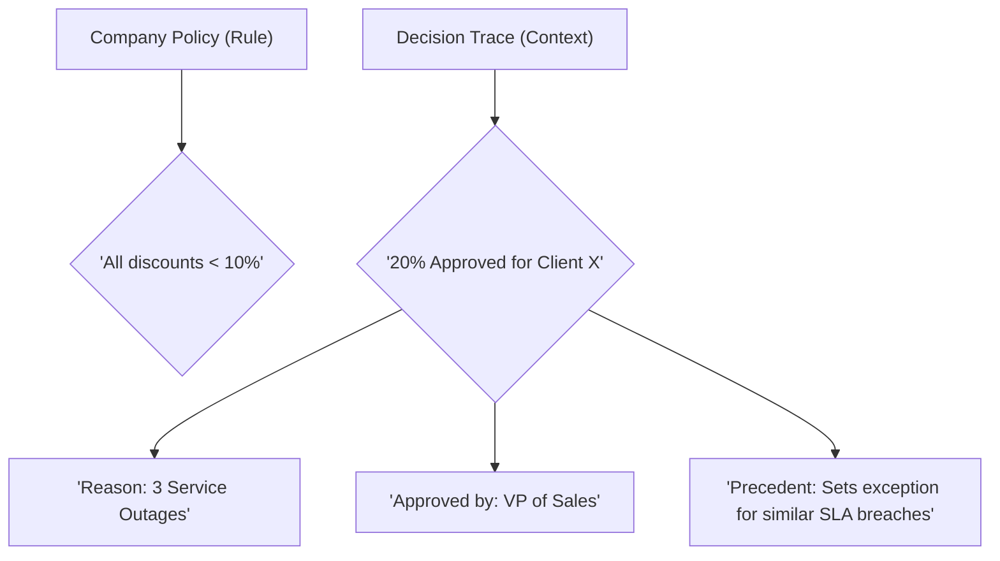
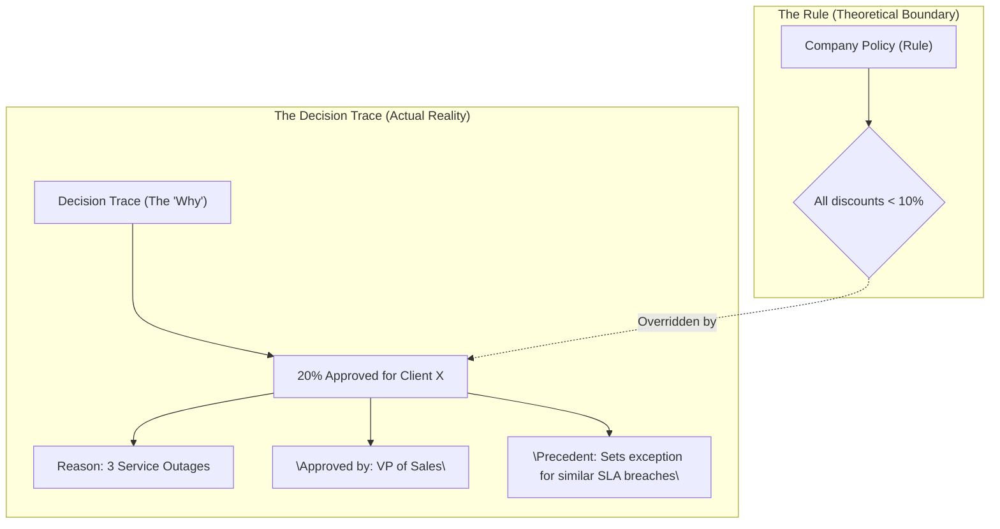
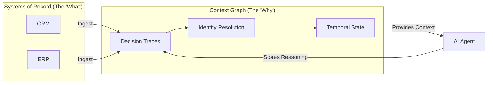
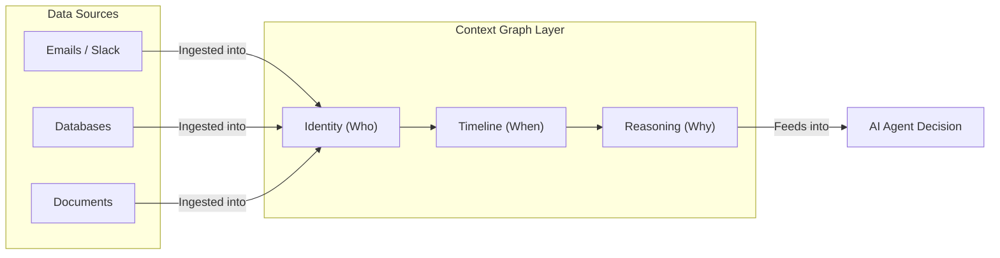
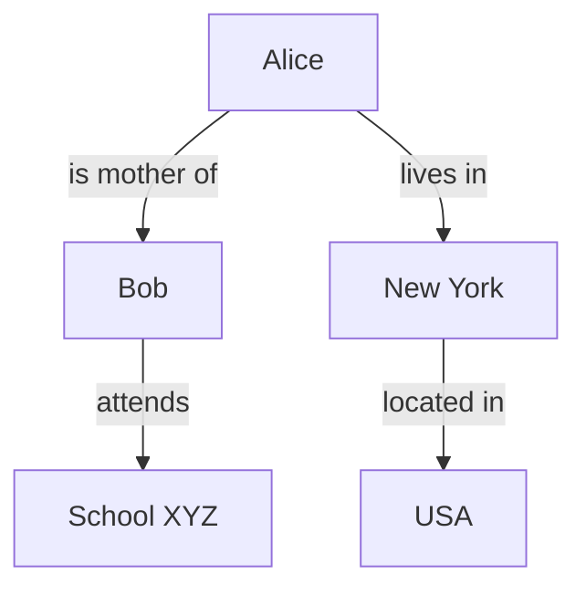
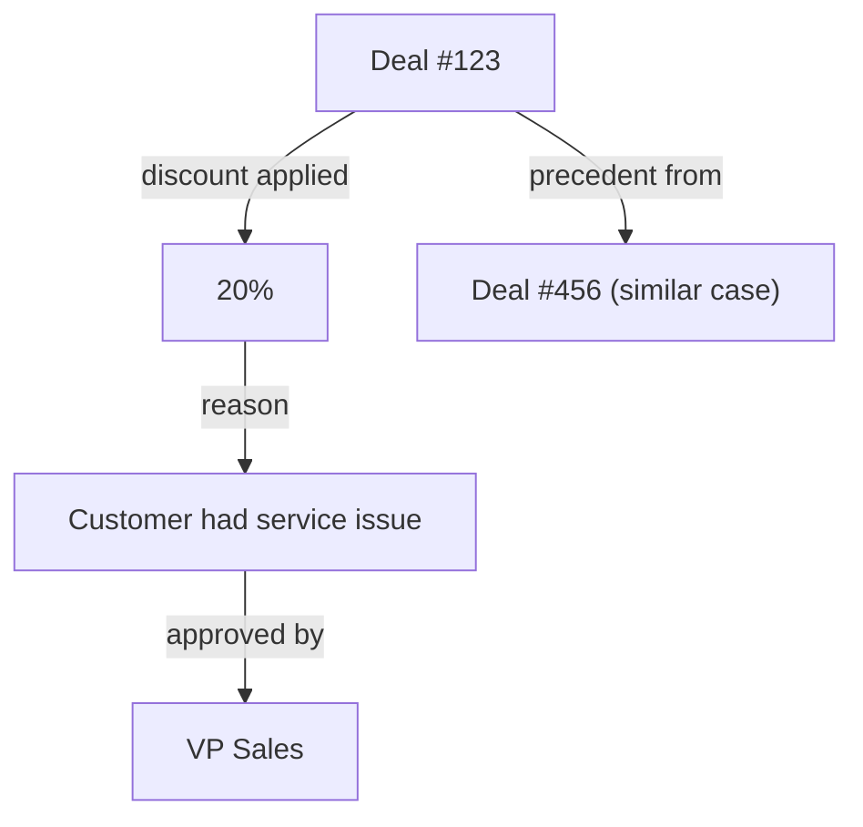

# Context Graphs: A Simple Guide

## **What is a Context Graph?**

A **context graph** is a way to organize information using a graph structure (nodes and edges) that is made especially for AI systems, like large language models (LLMs) and AI agents.

It goes beyond simple text or basic data lists. It shows **relationships**, **reasons**, **time changes**, and **details** clearly. This helps AI understand and reason better, just like humans use background knowledge to make sense of things.

Traditional AI context is often linear text (a long string of words). Context graphs make it structured and connected, reducing confusion and improving accuracy.

In other words, A Context Graph is an **AI-optimized knowledge structure** that links entities (people, projects, products) with the reasoning behind their interactions.

## **Core Pillars of the Context Graph**

1. **Decision Traces:** A record of the inputs, rules, and human approvals that led to an outcome.
2. **Temporal Metadata:** Tracking "when" a fact was true (e.g., Steve Jobs was Chairman of Apple *during specific years*).
3. **In-situ Context:** Preserving where the data came from (Provenance) and its original surroundings (e.g., which Slack channel or document).
4. **Reification:** A technique where the *relationship itself* becomes an object, allowing you to attach "trust scores" or "confidence levels" to it.

## **Why Context Graphs Matter**

Current AI tools (like RAG - Retrieval Augmented Generation) pull text chunks to help LLMs answer questions. But text chunks can lose important connections:
- Pronouns (he/she/it) become unclear.
- Time-based changes (something true yesterday but not today) get ignored.
- Reasons for decisions (why an exception was allowed) stay hidden in emails or chats.

Context graphs fix this by keeping connections intact. They can make AI:
- More reliable.
- Able to explain answers.
- Better at handling complex tasks, like business decisions or research.

Experts in late 2025 called context graphs a possible "trillion-dollar opportunity" for AI because they unlock smarter automation in companies.

## **The Problem: The "What vs. Why" Gap**

Traditional data systems are excellent at recording final states but terrible at recording the process:

* **Systems of Record:** Record that a "20% discount was applied".
* **The Missing Context:** Doesn't explain *why* (e.g., "The VP approved this because the client had three service outages last month").
* **Result:** AI agents without this context repeatedly re-solve the same edge cases, treat related events as isolated incidents, and ultimately fail in production.

## **How It Works: The CGR3 Paradigm**

To use a Context Graph, AI systems follow a **Retrieve-Rank-Reason (CGR3)** workflow:

* **Retrieve:** 
    - Pull "subgraphs" (relevant nodes and their connections) instead of just flat text chunks. 
    - The AI pulls a "subgraph"—a small piece of the map showing related people, past decisions, and rules.
* **Rank:** 
    - Use the graph’s structure and metadata to identify the most trustworthy or relevant connections. 
    - The system looks at "trust scores" or "provenance" (where the data came from) to decide which info is most important.
* **Reason:** 
    - The LLM uses the structured relationship data to explain its conclusion with high precision. 
    - The AI uses the connections to explain its answer. For example: "I approved this because it matches a previous exception handled by the VP."

## **Concept: Rule vs. Decision Trace**

The Rule (Static): A rule is just a boundary or a "theory." For example: "No discount over 10%." It is simple and doesn't change, but it doesn't tell the whole story of a business.

The Decision Trace (Dynamic): This is the "complete" story. In the real world, rules are often broken or modified for a reason.

The Context Graph focuses on the Decision Trace because that is where the real intelligence lives.

By recording why a rule was overridden (e.g., "We gave 20% because the server was down"), the AI learns the "spirit" of the business, not just the "letter" of the law.

#### **One more Flow**

## **Why This Matters for Enterprise AI**

* **No More Guesswork:** AI stops "hallucinating" (making things up) because it has a factual trail of past decisions to follow.
* **Auditability:** Every action the AI takes has a "reasoning trail." If something goes wrong, you can see exactly who approved the logic and why.
* **Institutional Memory:** When an employee leaves, their "context" (why they made certain choices) stays in the graph instead of disappearing.

## **Architecture: From Data to Context**

#### **One more Flow**

## **Key Ideas from Recent Discussions**

There are two main ways people describe context graphs today:

1. **Knowledge-Focused (Triples-Based)**  
   Data is stored as simple statements called "triples":  
   Subject → Predicate → Object  
   Example: "Alice" → "is mother of" → "Bob"  
   These build large knowledge graphs. For AI, a small relevant part (subgraph) is pulled out and given to the LLM in structured form. This keeps meaning clear and handles ambiguities.

2. **Decision-Focused (For AI Agents)**  
   In companies, many decisions involve exceptions, approvals, and "why" reasons scattered in tools like Slack or email.  
   A context graph records these "decision traces": what data was used, what rules were bent, who approved, and why.  
   Over time, AI agents learn from past cases, turn exceptions into new rules, and act more independently.

Both ideas use graphs to give AI richer context.

## **How a Context Graph Works**

Here is a simple diagram of a basic triple in a context graph:

This graph shows clear connections. An AI can easily answer: "Where does Alice's child go to school?" without guessing pronouns or links.

Compare to linear text: "Alice lives in New York. Bob attends School XYZ in USA." – Connections are weaker.

For decisions:

This records "why" a discount happened, so future AI agents can follow or suggest the same.

## **Benefits**

- **Better Reasoning**: AI sees relationships, not just words.
- **Handles Time**: Tracks changes (e.g., prices yesterday vs today).
- **Explains Decisions**: Shows "why", making AI trustworthy.
- **Scales for Agents**: Helps AI automate real work with fewer mistakes.
- **Builds on Old Tech**: Uses mature graph tools (like RDF or property graphs) with new AI.
- **Searchable Precedent:** Exceptions become searchable rules, preventing agents from making the same mistake twice.
- **Disambiguation:** Differentiates between "Fred the Cat" and "Fred the IKEA Table" by looking at their connected properties.
- **Auditability:** Every AI decision has a clear "reasoning trail" that can be reviewed for legal or regulatory compliance.
- **Organic Growth:** The graph doesn't need a manual schema; it "learns" the organizational structure by watching how agents and humans interact.

## **Real-World Examples**

- Fraud detection already uses huge graphs to spot patterns fast.
- Company sales: Graph records why discounts were given, so AI can auto-approve similar ones.
- Research: Connect old and new facts without losing meaning.

## **Conclusion**

- Context is the "connective tissue" of human intelligence. By building Context Graphs, enterprises are moving beyond simple pattern matching to a world where AI truly understands the spirit, not just the letter, of how a business operates.

- The Context Graph is the "brain" of a modern enterprise. While traditional databases record the state of the world, the Context Graph records the logic of the company. This allows AI agents to move from being simple "chatbots" to becoming reliable "teammates" that understand how your business actually works.

- Context graphs are new (ideas grew in 2025-2026). Companies like TrustGraph build open tools for knowledge-style graphs. Others focus on agent decision graphs for business.

- Together, they help build AI that truly understands context – the next big step after basic LLMs.

**Sources:**

* *What is a Context Graph? | Guide to AI* (TrustGraph)
* *Context Graphs: AI's Next Big Idea* (The AI Daily Brief)
* *Context Graph Manifesto* (Daniel Davis)
* *Long Live Systems of Record* (Jamine Ball)
* *AI's Trillion Dollar Opportunity: Context Graphs* (Foundation Capital)