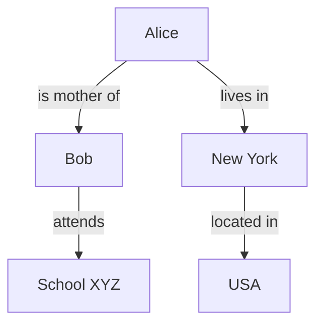
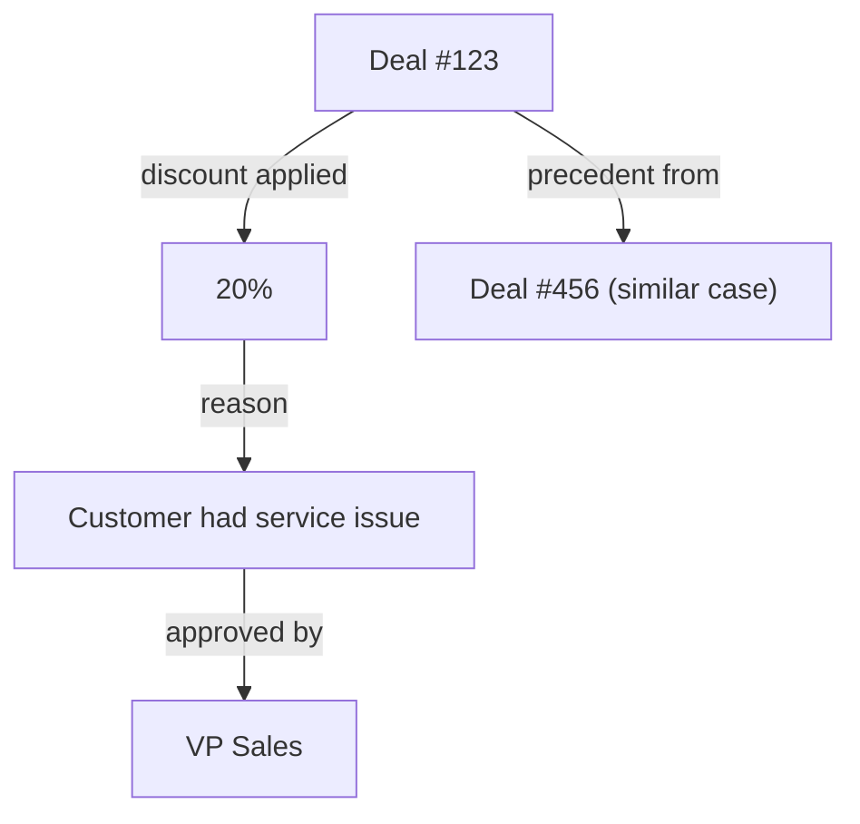

# Context Graphs: A Simple Guide

## What is a Context Graph?

A **context graph** is a way to organize information using a graph structure (nodes and edges) that is made especially for AI systems, like large language models (LLMs) and AI agents.

It goes beyond simple text or basic data lists. It shows **relationships**, **reasons**, **time changes**, and **details** clearly. This helps AI understand and reason better, just like humans use background knowledge to make sense of things.

Traditional AI context is often linear text (a long string of words). Context graphs make it structured and connected, reducing confusion and improving accuracy.

## Why Context Graphs Matter

Current AI tools (like RAG - Retrieval Augmented Generation) pull text chunks to help LLMs answer questions. But text chunks can lose important connections:
- Pronouns (he/she/it) become unclear.
- Time-based changes (something true yesterday but not today) get ignored.
- Reasons for decisions (why an exception was allowed) stay hidden in emails or chats.

Context graphs fix this by keeping connections intact. They can make AI:
- More reliable.
- Able to explain answers.
- Better at handling complex tasks, like business decisions or research.

Experts in late 2025 called context graphs a possible "trillion-dollar opportunity" for AI because they unlock smarter automation in companies.

## Key Ideas from Recent Discussions

There are two main ways people describe context graphs today:

1. **Knowledge-Focused (Triples-Based)**  
   Data is stored as simple statements called "triples":  
   Subject → Predicate → Object  
   Example: "Alice" → "is mother of" → "Bob"  
   These build large knowledge graphs. For AI, a small relevant part (subgraph) is pulled out and given to the LLM in structured form. This keeps meaning clear and handles ambiguities.

2. **Decision-Focused (For AI Agents)**  
   In companies, many decisions involve exceptions, approvals, and "why" reasons scattered in tools like Slack or email.  
   A context graph records these "decision traces": what data was used, what rules were bent, who approved, and why.  
   Over time, AI agents learn from past cases, turn exceptions into new rules, and act more independently.

Both ideas use graphs to give AI richer context.

## How a Context Graph Works

Here is a simple diagram of a basic triple in a context graph:

This graph shows clear connections. An AI can easily answer: "Where does Alice's child go to school?" without guessing pronouns or links.

Compare to linear text: "Alice lives in New York. Bob attends School XYZ in USA." – Connections are weaker.

For decisions:

This records "why" a discount happened, so future AI agents can follow or suggest the same.

## Benefits

- **Better Reasoning**: AI sees relationships, not just words.
- **Handles Time**: Tracks changes (e.g., prices yesterday vs today).
- **Explains Decisions**: Shows "why", making AI trustworthy.
- **Scales for Agents**: Helps AI automate real work with fewer mistakes.
- **Builds on Old Tech**: Uses mature graph tools (like RDF or property graphs) with new AI.

## Real-World Examples

- Fraud detection already uses huge graphs to spot patterns fast.
- Company sales: Graph records why discounts were given, so AI can auto-approve similar ones.
- Research: Connect old and new facts without losing meaning.

## Future

Context graphs are new (ideas grew in 2025-2026). Companies like TrustGraph build open tools for knowledge-style graphs. Others focus on agent decision graphs for business.

Together, they help build AI that truly understands context – the next big step after basic LLMs.
