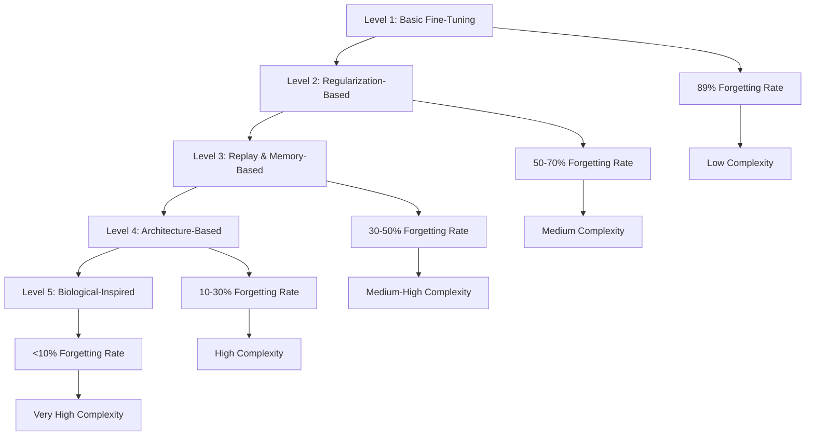
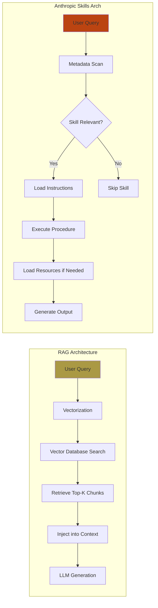
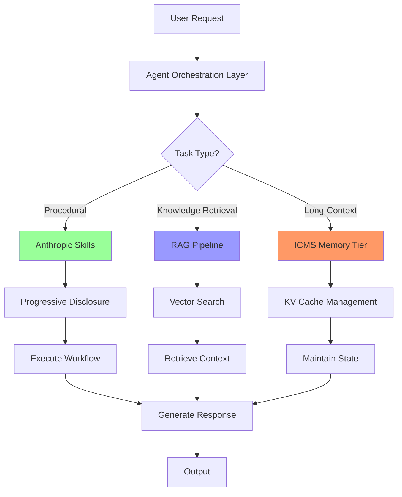

# The Holy Grail of Intelligence: Understanding the 5 Levels of Continual Learning

## Executive Summary

Current AI models suffer from catastrophic forgetting—the inability to retain previously learned knowledge when acquiring new information. This fundamental limitation forces organizations into expensive retraining cycles and prevents AI systems from achieving true continuous learning capabilities. This whitepaper presents a comprehensive analysis of the "5 Levels of Continual Learning" framework, evaluates current engineering solutions including Retrieval-Augmented Generation (RAG) and Anthropic Skills, and examines whether emerging memory architectures can finally solve AI's memory challenge in 2026. Based on extensive research across academic literature, industry implementations, and hardware innovations, we conclude that while RAG and Skills provide valuable interim solutions, a fundamental architectural shift toward hierarchical memory systems is necessary for true continual learning at scale.

## 1. The Catastrophic Forgetting Problem

### 1.1 What Is Catastrophic Forgetting?

Catastrophic forgetting occurs when neural networks abruptly lose previously learned information upon learning new tasks. When a model trained on Task A is subsequently trained on Task B, the optimization process for Task B overwrites the parameters that encoded Task A's knowledge. This phenomenon is not a minor performance degradation but a near-total erasure of prior capabilities.[1][2][3][4]

Research demonstrates that this occurs because standard neural networks use shared parameters across all tasks. When gradient updates modify these parameters for new information, they inevitably disrupt previously learned representations. Studies show that even in simple linear models, the order of task presentation significantly impacts retention, with dissimilar tasks learned first reducing subsequent forgetting.[4]

### 1.2 The "Frozen Model" Dilemma

Modern foundation models remain essentially static after initial training. While they can process new information within a conversation context, they cannot permanently integrate this knowledge into their parameters. This creates three critical business problems:

1. **Knowledge Staleness**: Models become outdated as world knowledge evolves[5]
2. **Retraining Costs**: Full model retraining requires millions in compute resources[6][7]
3. **Specialization Inefficiency**: Each domain requires separate fine-tuned models, multiplying infrastructure costs[5]

### 1.3 Human vs. AI Learning

Humans learn continuously without catastrophic forgetting through sophisticated memory consolidation mechanisms. The brain employs metaplasticity—adjusting the degree of synaptic change based on importance and novelty. Current AI lacks this fundamental capability, treating all new information with equal weight and overwriting indiscriminately.[8][4]

## 2. The 5 Levels of Continual Learning Framework

The framework organizes continual learning approaches by architectural sophistication and effectiveness at mitigating forgetting.

### 2.1 Level 1: Basic Fine-Tuning

The simplest approach involves training a pre-trained model on new data without any forgetting mitigation. This method exhibits severe catastrophic forgetting, with performance drops of 89% on original tasks when learning new information.[9]

**Characteristics**:
- Direct parameter updates on new data
- No memory preservation mechanisms
- Highest forgetting rate
- Lowest implementation complexity

### 2.2 Level 2: Regularization-Based Methods

These approaches constrain parameter updates to protect important weights from previous tasks. Elastic Weight Consolidation (EWC) represents the state-of-the-art in this category, inspired by synaptic consolidation in biological neural systems.[10]

**Mechanism**: EWC identifies parameters critical to previous tasks and applies quadratic penalties to their modification. Research shows EWC reduces forgetting significantly compared to naive training, though it slightly compromises learning efficiency on new tasks.[10]

**Limitations**: Regularization creates a trade-off between plasticity (learning new tasks) and stability (retaining old knowledge). As task sequences grow longer, the parameter space becomes overly constrained, limiting adaptability.[1]

### 2.3 Level 3: Replay and Memory-Based Methods

This level introduces explicit memory systems to store and replay examples from previous tasks during new learning. The "Remembering for the Right Reasons" (RRR) paradigm stores visual model explanations alongside examples, ensuring models retain the correct reasoning patterns.[11]

**Key Innovations**:
- **Experience Replay**: Storing representative samples from previous tasks
- **Generative Replay**: Using generative models to synthesize past data
- **Selective Replay**: Prioritizing examples based on learning difficulty—quickly learned examples are remembered better, while difficult examples require more reinforcement[3]

**Limitations**: Memory size grows with task number, creating scalability challenges. Retrieval quality becomes a bottleneck, and storing all historical data is often impractical.[12]

### 2.4 Level 4: Architecture-Based Methods

These solutions modify the neural network structure itself to accommodate new knowledge. Google's Nested Learning paradigm represents a breakthrough, creating a "continuum memory system" where different memory modules update at different frequencies.[13]

**Key Approaches**:
- **Dynamic Architectures**: Adding task-specific neurons or layers
- **Modular Networks**: Separate sub-networks for different tasks
- **Sparse Memory Fine-Tuning**: Meta's approach uses a memory layer with many slots, activating only tiny subsets per forward pass. This achieves only 11% performance drop while learning new facts[9]

**Advantages**: Architecture-based methods provide the strongest forgetting mitigation by isolating task knowledge. The Hope architecture, built on Nested Learning principles, demonstrates superior memory management in long-context tasks.[13]

### 2.5 Level 5: Biological-Inspired and Neuromorphic Methods

The most sophisticated level draws directly from neuroscience, implementing brain-like learning mechanisms in hardware and software.

**Key Innovations**:
- **Neuromorphic Chips**: Novel memristors from Jülich Research exhibit metaplasticity, adjusting synaptic change degrees like biological neurons[8]
- **Continuum Memory Systems**: Multiple memory modules with different update frequencies mimic hippocampal-cortical interactions[13]
- **Wake-Sleep Consolidated Learning**: Simulates human sleep phases to reinforce memories and reduce forgetting[4]

**Current State**: While promising, these methods remain primarily in research. Commercial deployment requires specialized hardware and faces integration challenges with existing infrastructure.

## 3. Current Workarounds and Innovations

### 3.1 Retrieval-Augmented Generation (RAG)

RAG has become the dominant engineering solution for knowledge augmentation, storing vast quantities of data in vector databases and retrieving relevant context during inference.[14][15]

**Architecture**: Text documents are converted to high-dimensional vectors (typically 768+ dimensions) and stored in searchable databases. When querying, the system finds nearest neighbors using distance calculations and injects retrieved text into the model's context window.[14]

**Strengths**:
- No retraining required for knowledge updates
- Scalable to massive document corpora
- Cost-effective for static knowledge bases[15]

**Critical Limitations**:
1. **No True Understanding**: RAG retrieves without comprehension, often surfacing out-of-context chunks that the LLM must stitch together[16][12]
2. **Context Overload**: Retrieved chunks can exceed context windows, forcing artificial fragmentation that breaks important connections[16]
3. **No Forgetting Mechanism**: RAG systems retain all information indefinitely, including outdated or contradictory data, leading to retrieval noise[16]
4. **Poor Temporal Reasoning**: Cannot distinguish between current and historical information or track evolving beliefs[17]
5. **Associative Memory Weakness**: Struggles with tasks requiring connecting disparate concepts across documents[18]

### 3.2 Anthropic Skills

Introduced in October 2025, Anthropic Skills provide modular, reusable capabilities that extend Claude's functionality through progressive disclosure architecture.[19][20]

**Architecture**: Skills are folder-based packages containing structured instructions, optional scripts, and resources. The system employs three-tier progressive disclosure:

1. **Level 1 (Metadata)**: Name and description always loaded (~100 tokens)
2. **Level 2 (Instructions)**: Detailed procedures loaded on-demand when triggered (~5,000 tokens)
3. **Level 3 (Resources)**: Additional files and code accessed only when referenced[21][22]

**Strengths**:
- **Token Efficiency**: Only relevant expertise loads when needed
- **Repeatability**: Prescriptive instructions reduce variance for standardized tasks
- **Composition**: Skills can be layered for complex workflows[23]
- **Cross-Platform Consistency**: Works identically across Claude.ai, API, and Claude Code[24]

**Limitations**:
- **Ecosystem Lock-in**: Skills only function within Anthropic's platform
- **Limited Freshness**: Knowledge limited to what's bundled in the skill[25]
- **Observability Gaps**: No consolidated logging or versioning mechanisms as of October 2025[24]
- **Scalability Ceiling**: Up to 8 skills per API request with 8MB combined limit[24]

### 3.3 Comparative Analysis

| Dimension | RAG Pipelines | Anthropic Skills |
|-----------|---------------|------------------|
| **Primary Use Case** | Dynamic knowledge retrieval | Procedural task automation |
| **Data Freshness** | Excellent (continuous indexing) | Limited (bundled knowledge) |
| **Repeatability** | Variable (depends on retrieval) | Strong (prescriptive instructions) |
| **Token Efficiency** | Poor (all retrieved text loaded) | Excellent (progressive disclosure) |
| **Extensibility** | Excellent (multiple data sources) | Good (within Claude ecosystem) |
| **Team Skills Required** | Data/ML ops, search tuning | Scripting, prompt engineering |
| **Failure Modes** | Retrieval gaps, stale indexes | Script errors, wrong skill selection |
| **Vendor Lock-in** | Low (open standards) | High (Anthropic platform) |

**Bottom Line**: RAG and Skills are complementary, not competitive. RAG excels at "what" (knowledge retrieval), while Skills excel at "how" (procedural execution). Hybrid architectures that combine Skills for workflow orchestration with RAG for fresh knowledge retrieval deliver optimal results.[25]

## 4. The Architecture Gap: Why We Need New Solutions

### 4.1 The Memory Wall

Current AI infrastructure faces a critical bottleneck: context memory management. As foundation models scale toward trillions of parameters and context windows reach millions of tokens, the computational cost of remembering history rises faster than processing capacity.[26]

**The Problem Hierarchy**:
- **GPU HBM (G1)**: Ultra-fast but extremely limited (tens of GB)
- **System RAM (G2)**: Larger but slower, creates latency
- **Shared Storage (G4)**: Millisecond-level latency, power-inefficient[26]

Moving active context from GPU to shared storage introduces millisecond delays, leaving expensive GPUs idle while awaiting data. This inefficiency increases power cost per token and renders real-time agentic interactions unviable at scale.[26]

### 4.2 NVIDIA's Inference Context Memory Storage (ICMS)

At CES 2026, NVIDIA introduced the Inference Context Memory Storage Platform, creating a new "G3.5" tier specifically for AI context memory.[27][26]

**Architecture**:
- **BlueField-4 DPU**: Offloads context management from host CPU
- **Ethernet-Attached Flash**: NVMe-based storage with RDMA access
- **Spectrum-X Ethernet**: High-bandwidth, low-jitter connectivity
- **Dynamo KV Cache Engine**: Smart sharing of context across AI nodes[28]

**Performance Impact**:
- **5x Higher Throughput**: Tokens-per-second improvement for long-context workloads
- **5x Better Power Efficiency**: Removes general-purpose storage protocol overhead[28][26]
- **Petabyte-Scale Capacity**: Per-pod shared memory pool

**Industry Alignment**: Major storage vendors (Dell, HPE, IBM, Pure Storage, etc.) are building ICMS-compatible platforms, with solutions expected in H2 2026.[26]

### 4.3 Software-Hardware Co-Design

The most promising path forward requires coordinated software and hardware innovation:

**Memory-Centric Architectures**: Systems like WEKA's Augmented Memory Grid extend GPU memory into high-performance, RDMA-connected NVMe fabrics, enabling persistent, reusable KV cache across sessions.[27]

**Continuum Memory Systems**: Google's Nested Learning paradigm creates memory modules that update at different frequencies, mimicking biological memory hierarchies. This approach, combined with hardware acceleration, could enable true continual learning without catastrophic forgetting.[13]

**Neuromorphic Integration**: Novel memristors that operate in both analog and digital modes offer brain-like metaplasticity, potentially solving catastrophic forgetting at the hardware level.[8]

## 5. Economic Implications

### 5.1 The Cost of Forgetting

Catastrophic forgetting imposes substantial economic costs across the AI ecosystem:

**Retraining Expenses**: Full model retraining for GPT-scale models costs $2-5 million per run, excluding data preparation and engineering time. Organizations must retrain periodically to combat knowledge staleness, creating recurring capital expenditure.[6]

**Infrastructure Inefficiency**: The memory wall forces over-provisioning of GPU resources. As context windows grow, KV cache memory requirements scale linearly, increasing hardware costs by 40-60% for long-context applications.[7]

**Talent Costs**: The public sector faces a critical challenge, with nearly one-third of federal employees eligible for retirement in 2025. Continuous learning programs cost $20,269 per employee versus[6]

[1](https://arxiv.org/abs/2403.05175)
[2](https://www.nature.com/articles/s41598-025-31685-9)
[3](https://icml.cc/virtual/2025/poster/43833)
[4](https://cacm.acm.org/news/forget-the-catastrophic-forgetting/)
[5](https://arxiv.org/html/2506.03320v1)
[6](https://www.munitemps.com/2025/05/30/why-continuous-learning-in-government-matters-a-2025-public-sector-guide/)
[7](https://intuitionlabs.ai/articles/ram-shortage-2025-ai-demand)
[8](https://www.fz-juelich.de/en/news/archive/press-release/2025/novel-memristors-to-overcome-ai2019s-catastrophic-forgetting)
[9](https://beam.ai/agentic-insights/what-is-continual-learning-(and-why-it-powers-self-learning-ai-agents))
[10](https://arxiv.org/abs/2507.10485)
[11](https://ai.meta.com/research/publications/remembering-for-the-right-reasons-explanations-reduce-catastrophic-forgetting/)
[12](https://dev.to/isaachagoel/why-llm-memory-still-fails-a-field-guide-for-builders-3d78)
[13](https://research.google/blog/introducing-nested-learning-a-new-ml-paradigm-for-continual-learning/)
[14](https://hub.ai.uky.edu/unlocking-ais-memory-retrieval-augmented-generation-rag/)
[15](https://learn.microsoft.com/en-us/azure/search/retrieval-augmented-generation-overview)
[16](https://mykin.ai/resources/why-kins-memory-needs-more-than-rag)
[17](https://www.opensourceforu.com/2025/12/agentic-memory-hindsight-beats-rag-in-long-term-ai-reasoning/)
[18](https://arxiv.org/html/2502.14802v1)
[19](https://www.globaltechcouncil.org/ai/openai-adopted-anthropics-skills/)
[20](https://www.anthropic.com/engineering/equipping-agents-for-the-real-world-with-agent-skills)
[21](https://lilys.ai/notes/en/claude-skills-20251020/anthropic-agent-skills-architecture-development)
[22](https://leehanchung.github.io/blogs/2025/10/26/claude-skills-deep-dive/)
[23](https://www.ikangai.com/claudes-modular-mind-how-anthropics-agent-skills-redefine-context-in-ai-systems/)
[24](https://skywork.ai/blog/ai-agent/anthropic-skills-vs-custom-skills-2025-comparison/)
[25](https://skywork.ai/blog/ai-agent/claude-skills-vs-rag-pipelines-comparison/)
[26](https://www.artificialintelligence-news.com/news/agentic-ai-scaling-requires-new-memory-architecture/)
[27](https://www.weka.io/blog/ai-ml/the-context-era-has-begun/)
[28](https://blocksandfiles.com/2026/01/06/nvidia-standardizes-gpu-cluster-kv-cache-offload-to-nvme-ssds/)
[29](https://www.youtube.com/watch?v=2NDMtAEu7FQ)
[30](https://magazine.sebastianraschka.com/p/state-of-llms-2025)
[31](https://dev.to/dbolotov/anthropic-skills-the-landscape-for-new-models-and-architectures-2ld3)
[32](https://www.ai21.com/glossary/foundational-llm/continual-learning/)
[33](https://www.facebook.com/groups/techtitansgroup/posts/1524700762190570/)
[34](https://www.youtube.com/watch?v=9B5gh0VZDCY)
[35](https://www.youtube.com/@engineerprompt)
[36](https://x.com/engineerrprompt)
[37](https://www.youtube.com/watch?v=LWiMwhDZ9as)
[38](https://www.reddit.com/r/PromptEngineering/comments/1j8m0rs/the_ultimate_fucking_guide_to_prompt_engineering/)
[39](https://www.cipd.org/globalassets/media/knowledge/knowledge-hub/reports/2025-pdfs/8930-lifelong-learning-in-the-reskilling-era-report-web.pdf)
[40](https://www.youtube.com/watch?v=5i2Hn8OG94o)
[41](https://www.reddit.com/r/PromptEngineering/comments/1jqil9h/ml_science_applied_to_prompt_engineering/)
[42](https://generalassemb.ly/blog/timeless-prompt-engineering-principles-improve-ai-output-reliability/)
[43](https://pub.towardsai.net/you-can-learn-advanced-prompt-engineering-to-get-5x-productivity-with-these-resources-6ead804db71c)
[44](https://en.wikipedia.org/wiki/Prompt_engineering)
[45](https://www.reddit.com/r/PromptEngineering/comments/1fryzab/prompt_guru_v5_advanced_engineering_framework/)
[46](https://towardsdatascience.com/the-current-state-of-continual-learning-in-ai-af4a05c42f3c/)
[47](https://arxiv.org/abs/2502.09500)
[48](https://www.artificialintelligence-news.com/news/ai-memory-hunger-micron-consumer-exit/)
[49](https://cloud.google.com/discover/what-is-prompt-engineering)
[50](https://pmc.ncbi.nlm.nih.gov/articles/PMC12647548/)
[51](https://arxiv.org/html/2510.13008v1)
[52](https://aclanthology.org/2025.babylm-main.20.pdf)
[53](https://www.sciencedirect.com/science/article/abs/pii/S0957417425023577)
[54](https://proceedings.iclr.cc/paper_files/paper/2024/file/67c15da4a9340140c60783d9a175fd3f-Paper-Conference.pdf)
[55](https://openaccess.thecvf.com/content/ICCV2023/papers/Gao_A_Unified_Continual_Learning_Framework_with_General_Parameter-Efficient_Tuning_ICCV_2023_paper.pdf)
[56](https://gizmodo.com/nvidia-new-rubin-platform-shows-memory-is-no-longer-afterthought-in-ai-2000705639)
[57](https://www.continu.com/blog/continual-learning)