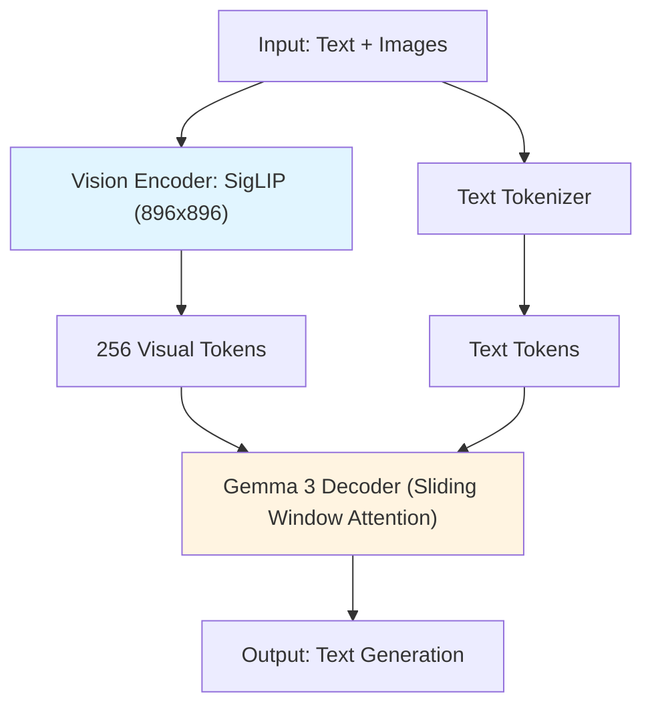
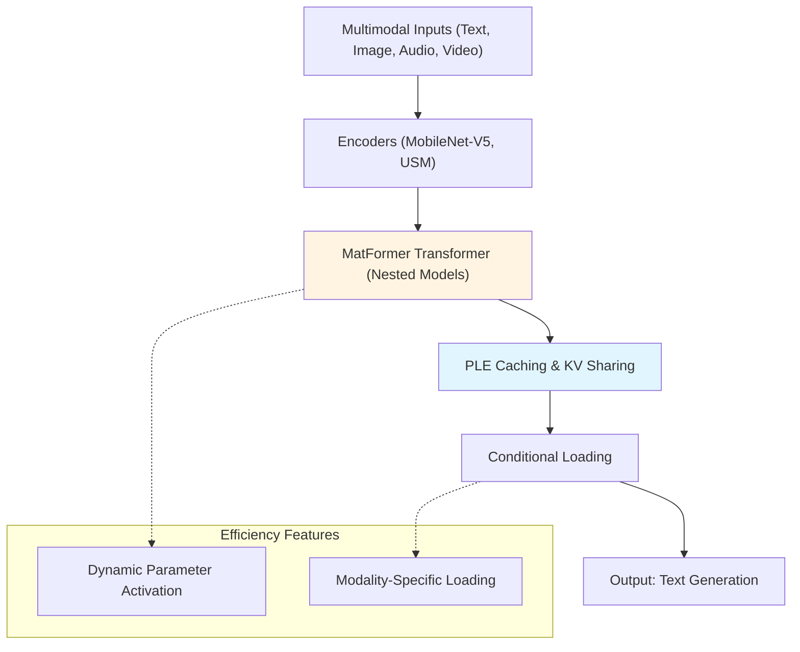
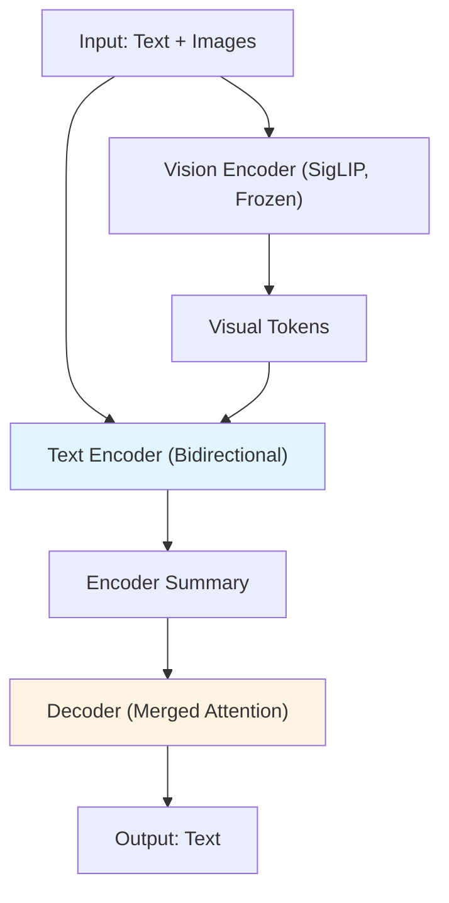
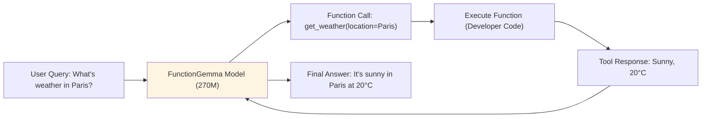
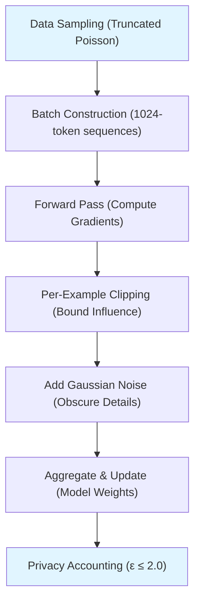
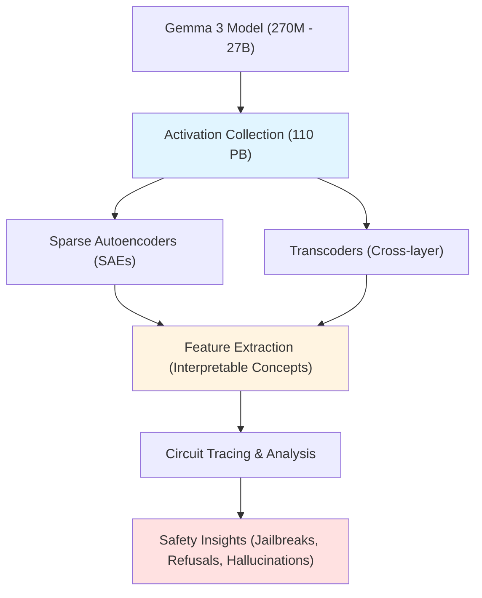
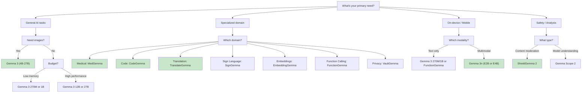

# The Complete Gemma Family: A Unified Whitepaper for Developers and Architects

**January 2026 Edition**

## Executive Summary

The Gemma family represents Google DeepMind's comprehensive suite of open-source AI models built on Gemini technology. With over 200 million downloads and a thriving community creating 60,000+ variants, Gemma has become the foundation for accessible, responsible AI development. This whitepaper provides a complete technical overview of all Gemma models, their architectures, capabilities, and use cases.

## Table of Contents

1. Core Gemma Models (Gemma 3, 3n, QAT, 270M)
2. Specialized Domain Models (MedGemma, CodeGemma, TranslateGemma, SignGemma)
3. Multimodal Models (PaliGemma 2)
4. Embedding and Encoding Models (EmbeddingGemma, T5Gemma 2)
5. Function Calling Models (FunctionGemma)
6. Privacy-First Models (VaultGemma)
7. Efficiency Models (RecurrentGemma)
8. Safety and Interpretability Tools (ShieldGemma 2, Gemma Scope 2)
9. Architecture Comparison and Selection Guide

---

## 1. Core Gemma Models

### Gemma 3 (Released March 2025)

**Overview**: Gemma 3 is Google's most advanced open model family, delivering state-of-the-art performance that fits on a single GPU or TPU.

**Key Features**:
- **Multimodal**: Text and image input (4B, 12B, 27B models)
- **Context**: 128K tokens (4B/12B/27B), 32K tokens (270M/1B)
- **Languages**: 140+ languages supported
- **Sizes**: 270M, 1B, 4B, 12B, 27B parameters

**Architecture Highlights**:
- Decoder-only transformer with Grouped-Query Attention (GQA)
- SigLIP vision encoder (896×896 resolution) with 256 visual tokens
- Sliding window attention: 5 local layers : 1 global layer
- RoPE embeddings with 1M base frequency for long context
- Pan & Scan algorithm for adaptive image cropping

**Performance**:
- Gemma 3 27B ranks in top 10 on LM Arena (1300+ Elo)
- Gemma 3 4B-IT competitive with Gemma 2 27B-IT
- Gemma 3 27B-IT comparable to Gemini 1.5 Pro

**Memory Requirements** (BF16):
- 270M: ~0.9 GB
- 1B: ~2.5 GB
- 4B: ~10 GB
- 12B: ~28 GB
- 27B: ~60 GB



**Use Cases**:
- Visual question answering
- Document analysis with images
- Multilingual content generation
- Long-context reasoning (128K tokens)
- Function calling and tool use

---

### Gemma 3 QAT (Released April 2025)

**Overview**: Quantization-Aware Trained versions of Gemma 3 that dramatically reduce memory requirements while maintaining quality.

**Innovation**: QAT simulates quantization during training (~5,000 steps) rather than post-training quantization, reducing accuracy loss by up to 54%.

**Memory Reduction**:
- 27B: 60 GB → 14.1 GB (4× reduction)
- 12B: 28 GB → 7.5 GB
- 4B: 10 GB → 2.6 GB
- 1B: 2.5 GB → 529 MB

**Hardware Support**:
- 27B runs on NVIDIA RTX 3090 (24GB VRAM)
- 12B runs on laptop RTX 4060 (8GB VRAM)
- 4B/1B run on mobile devices

**Formats Available**:
- Q4_0 (for Ollama, llama.cpp, MLX)
- INT4 (Hugging Face)
- GGUF (universal compatibility)

**Deployment**:
```bash
# Ollama
ollama run gemma3:27b-q4_0

# LM Studio
# Select QAT model from GUI

# MLX (Apple Silicon)
llm mlx download-model mlx-community/gemma-3-27b-it-qat-4bit
```

---

### Gemma 3 270M (Released August 2025)

**Overview**: The most compact, energy-efficient Gemma model designed for task-specific fine-tuning.

**Specifications**:
- Total: 270M parameters (170M embeddings, 100M transformer)
- Vocabulary: 256K tokens (large vocab for rare tokens)
- Context: 32K tokens
- Text-only (no vision support)

**Key Strength**: Extreme energy efficiency - uses only 0.75% of Pixel 9 Pro battery for 25 conversations.

**Best For**:
- Sentiment analysis
- Entity extraction
- Query routing
- Text classification
- Data extraction
- On-device processing

**Philosophy**: "Right tool for the job" - fine-tune for specific tasks rather than general chat.

---

### Gemma 3n (Released December 2024)

**Overview**: Mobile-first architecture for on-device, real-time multimodal AI.

**Variants**:
- **E2B**: ~1.91B effective parameters, ~2 GB memory
- **E4B**: ~4B effective parameters, ~3 GB memory

**Architecture Innovations**:

1. **MatFormer (Matryoshka Transformer)**: Nested models within larger one - activate only needed parameters
2. **Per-Layer Embedding (PLE) Caching**: Store embeddings on disk, reduce RAM usage
3. **KV Cache Sharing**: Share key-value cache across layers (2× faster on long inputs)
4. **MobileNet-V5**: Fast vision encoder (256×256 or 768×768)
5. **USM Audio Encoder**: Speech recognition/translation (30-second clips, 6.25 tokens/sec)
6. **Conditional Parameter Loading**: Load only needed modalities

**Modalities**: Text, image, audio, video (60 FPS on Pixel devices)

**Performance**:
- MMLU: 64.9 (E4B)
- HumanEval: 75.0
- LMArena: >1300

**Deployment**:
- Android: AI Edge Gallery, AICore
- Apple Silicon: MLX
- Web: Transformers.js
- Desktop: Ollama, LM Studio



---

## 2. Specialized Domain Models

### MedGemma 1.5 (Released January 2026)

**Overview**: Medical AI models for text and image comprehension in healthcare applications.

**Versions**:
- **4B Multimodal**: Small, efficient, text + images
- **27B Text-only**: Stronger text tasks
- **27B Multimodal**: Best performance

**Capabilities**:
- Interpret X-rays, CT, MRI, dermatology, pathology
- Generate radiology reports
- Answer medical visual questions
- Detect anatomical locations
- Extract data from lab reports/EHR
- Time-series analysis (disease progression)

**Upgrades in 1.5**:
- Better 3D/high-dimensional imaging (CT volumes, MRI)
- Longitudinal imaging support
- Improved anatomical localization (+35% IoU on chest)
- Lab report to JSON extraction

**Performance**:
- MedQA: ~69% accuracy (4B)
- Chest X-ray: Competitive RadGraph F1
- CT/MRI: +3-14% over previous versions
- EHR understanding: ~90% accuracy

**Architecture**: Gemma 3 base + MedSigLIP image encoder (medically-tuned SigLIP)

**Important**: Not clinical-grade - requires fine-tuning, validation, and human oversight.

**Use Cases**:
- Research prototypes
- Medical education tools
- Report generation assistants (with human review)
- Image analysis pipelines

---

### CodeGemma (Released April 2024)

**Overview**: Specialized for code completion, generation, and chat.

**Variants**:
- **7B**: Code completion (FIM), generation
- **7B-IT**: Instruction-tuned for chat, debugging
- **2B**: Fast code completion (2× faster)

**Key Features**:
- Fill-in-the-middle (FIM) code completion
- Multi-language: Python, JavaScript, Java, C++, Go, Kotlin, Rust
- 8K token context
- Training: 500B tokens (80% code, 20% natural language)

**Training Techniques**:
- Dependency graph-based packing
- Unit test lexical packing
- Document splitting (prefix/middle/suffix)

**Performance**:
- HumanEval: 74%+ (Python)
- Multi-line infilling: 48%+
- Beats StarCoder and DeepSeek on several benchmarks

**Usage**:
```python
from transformers import AutoTokenizer, AutoModelForCausalLM

tokenizer = AutoTokenizer.from_pretrained("google/codegemma-7b-it")
model = AutoModelForCausalLM.from_pretrained("google/codegemma-7b-it")

prompt = "Write a Python function for Fibonacci."
inputs = tokenizer(prompt, return_tensors="pt")
outputs = model.generate(**inputs, max_new_tokens=150)
print(tokenizer.decode(outputs[0]))
```

**Deployment**: VS Code, Ollama, LM Studio, Hugging Face

---

### TranslateGemma (Released January 2026)

**Overview**: High-quality translation models supporting 55 languages bidirectionally.

**Sizes**: 4B, 12B, 27B

**Key Innovation**: 12B model outperforms Gemma 3 27B baseline on translation benchmarks.

**Training Process**:
1. **SFT**: Human translations + synthetic data from Gemini
2. **RL**: Reward models (MetricX-QE, AutoMQM) for quality refinement

**Performance (WMT24++)**:
- 27B MetricX: 3.09 (vs. 4.04 baseline)
- 12B MetricX: 3.60 (vs. 4.86 baseline)
- Strong on high and low-resource languages

**Multimodal**: Translates text in images (Vistra benchmark) without specific training.

**Deployment**:
- 4B: Mobile/edge
- 12B: Consumer laptops
- 27B: Single H100 GPU or TPU

```python
from transformers import pipeline

translator = pipeline("translation", model="google/translategemma-4b-it")
result = translator("Hello, world!", src_lang="en", tgt_lang="es")
```

---

### SignGemma (Testing, Release 2025)

**Overview**: On-device sign language translation (currently ASL to English).

**Capabilities**:
- Real-time translation (<200ms latency)
- Analyzes hands, face, body language
- Outputs text or speech
- Privacy-focused (no cloud needed)

**Training**: 10,000+ hours of annotated ASL videos

**Architecture**:
- Vision Transformer for video analysis
- Compact language model for text generation
- Based on Gemma Nano framework

**Use Cases**:
- Food ordering via sign
- Smart home control
- Educational apps
- Work/social interactions

**Limitations**:
- One-way (sign → text, not bidirectional)
- Regional variations challenging
- ASL-focused (adaptable to other sign languages)

**Status**: Testing phase; broader release by end of 2025.

---

## 3. Multimodal Models

### PaliGemma 2 (Released December 2024)

**Overview**: Vision-language models for image understanding and captioning.

**Sizes**: 3B, 10B, 28B parameters

**Resolutions**: 224px², 448px², 896px²

**Variants**:
- **Pretrained (pt)**: For transfer learning
- **Mix**: Fine-tuned on diverse tasks (OCR, VQA, captioning)

**Architecture**:
- SigLIP-So400m vision encoder
- Gemma 2 language model (2B-27B base)
- Multimodal projector concatenates embeddings

**Training**: 1B multimodal examples (web, VQA, chemical structures, music scores)

**Capabilities**:
- Image captioning (short/long)
- Visual question answering
- OCR (multilingual, faint text)
- Object detection (bounding boxes)
- Segmentation (pixel-level masks)
- Specialized: Chemical formulas, music scores, medical reports

**Performance**: State-of-the-art in OCR, molecular structures, VQA

**Usage**:
```python
from transformers import PaliGemmaForConditionalGeneration, AutoProcessor

model = PaliGemmaForConditionalGeneration.from_pretrained("google/paligemma2-10b-mix-448")
processor = AutoProcessor.from_pretrained("google/paligemma2-10b-mix-448")

image = "path/to/image.jpg"
prompt = "caption en"  # Short English caption
inputs = processor(prompt, image, return_tensors="pt")
output = model.generate(**inputs, max_new_tokens=100)
print(processor.decode(output[0]))
```

**VRAM**: 10B model uses 20-40GB (quantize with BitsAndBytes to reduce)

---

## 4. Embedding and Encoding Models

### EmbeddingGemma (Released 2025)

**Overview**: Small text embedding model for semantic search and RAG.

**Specifications**:
- **Size**: 308M parameters (~300MB RAM optimized)
- **Languages**: 100+ languages
- **Dimensions**: 768 (Matryoshka: adjustable 128-768)
- **Context**: 2,000 tokens
- **Speed**: <15ms for short text

**Architecture**: T5Gemma encoder (Gemma 3 adapted to encoder-decoder)

**Best For**:
- On-device semantic search
- RAG pipelines (with Gemma 3n for generation)
- Classification/clustering
- Offline apps (private)

**Usage**:
```python
from sentence_transformers import SentenceTransformer

model = SentenceTransformer("google/embeddinggemma-300m")
query = "Which planet is red?"
embedding = model.encode(query)  # [768] vector
```

**Vector Stores**: FAISS, Chroma, SQLite-VEC

**Fine-Tuning**: Use sentence-transformers with triplet data (anchor, positive, negative).

---

### T5Gemma 2 (Released 2025)

**Overview**: Encoder-decoder models for input-heavy tasks like summarization and translation.

**Sizes**: 270M-270M, 1B-1B, 4B-4B (symmetric encoder-decoder)

**Key Changes**:
- Tied word embeddings (10% parameter reduction)
- Merged attention (faster inference)
- Multimodal: SigLIP vision encoder (400M, frozen)
- 128K context (generalizes well)

**Advantages Over Decoder-Only**:
- Bidirectional encoding for better input understanding
- Efficient for tasks needing deep input analysis
- Lower KV cache memory

**Performance**:
- Hellaswag: 77.4 (270M) vs. lower for Gemma 3 270M
- VQAv2: 62.7 (270M), 70+ (4B)
- RULER (128K): 25.5 (vs. 4.4 for Gemma 3)

**Use Cases**:
- Document summarization
- Translation/QA
- Multimodal apps (image + text → text)
- Long-context processing

```python
from transformers import pipeline

pipe = pipeline("text2text-generation", model="google/t5gemma-2-270m")
output = pipe("Summarize: [long text]")
```



---

## 5. Function Calling Models

### FunctionGemma (Released 2025)

**Overview**: Small model for on-device function calling (tool use).

**Specifications**:
- **Size**: 270M parameters
- **Type**: Gemma 3 270M base, tuned for function calling
- **Context**: 32K tokens
- **Vocabulary**: 256K (efficient for JSON)

**Architecture**: Decoder-only with special tokens for function calls/responses

**Capabilities**:
- Parse natural language to structured function calls
- Output JSON with function name + arguments
- Use tool responses for final answers

**Performance**:
- Base: ~58% accuracy (Mobile Actions)
- Fine-tuned: ~85% (matches larger models)
- Speed: ~50 tokens/sec on phone CPU

**Use Cases**:
- Mobile agents (reminders, flashlight control)
- Games (voice commands)
- Business tools (database queries, automation)
- Hybrid: Simple tasks local, complex to cloud

**Usage**:
```python
from transformers import AutoModelForCausalLM, AutoTokenizer

model = AutoModelForCausalLM.from_pretrained("google/functiongemma-270m-it")
tokenizer = AutoTokenizer.from_pretrained("google/functiongemma-270m-it")

# Define tools in system prompt
tools = [{"name": "get_weather", "description": "Get weather for location", "parameters": {"location": "string"}}]
query = "What's the weather in Paris?"

# Model outputs: get_weather(location="Paris")
```

**Fine-Tuning**: Use datasets like Mobile Actions with LoRA (TRL/Unsloth)

**Deployment**: LightRT-LM (mobile), Ollama, llama.cpp



---

## 6. Privacy-First Models

### VaultGemma (Released 2025)

**Overview**: The world's most capable differentially private LLM.

**Specifications**:
- **Size**: 1B parameters
- **Privacy**: ε ≤ 2.0, δ ≤ 1.1 × 10⁻¹⁰
- **Training**: DP-SGD on 13 trillion tokens
- **Context**: 1024 tokens

**Architecture**: Decoder-only transformer (26 layers, 1152 embedding dim)

**Differential Privacy**:
- Clipping: Limits per-sample impact
- Noise: Gaussian noise added to gradients
- Subsampling: Random data batches
- Zero memorization (tested on 1M samples)

**Training**:
- 2,048 TPUv6e chips
- 100,000 iterations
- Batch size: ~518K

**Performance**:
- HellaSwag: 39.09
- BoolQ: 62.04
- PIQA: 68.00
- Comparable to GPT-2 1.5B, but with privacy guarantees

**Trade-off**: 10-30% lower benchmarks vs. non-DP models, but mathematically guaranteed privacy.

**Use Cases**:
- Healthcare (medical records)
- Finance (fraud detection)
- Legal (sensitive documents)
- Privacy-safe chatbots

**Usage**:
```python
from transformers import pipeline

model = pipeline("text-generation", model="google/vaultgemma-1b")
output = model("What is differential privacy?")
```

**Memory**: ~2.6 GB VRAM for inference



---

## 7. Efficiency Models

### RecurrentGemma (Released April 2024)

**Overview**: Hybrid architecture mixing recurrence with local attention for efficiency.

**Sizes**: 2B, 9B parameters

**Architecture**: Griffin (Gated Linear Recurrences + Local Attention)

**Key Components**:
- **RG-LRU**: Recurrent with gates (vs. vanishing gradients in RNN/LSTM)
- **Local Sliding Window**: 2048 tokens
- **Fixed State Size**: No KV cache growth

**Advantages**:
- Lower memory (fixed state vs. growing cache)
- Faster inference on long sequences (vs. Gemma)
- Trained on 2T tokens (vs. 3T/6T for Gemma 2)

**Performance**:
- Matches Gemma on MMLU, HellaSwag
- Wins 43.7% vs. Mistral 7B
- 2× tokens/sec on long texts

**Limitations**: May struggle with extreme long-context recall (needle-in-haystack)

**Use Cases**:
- Long texts on low-resource devices
- Real-time processing (streaming)
- Edge deployment

```python
from transformers import AutoTokenizer, AutoModelForCausalLM

tokenizer = AutoTokenizer.from_pretrained("google/recurrentgemma-2b")
model = AutoModelForCausalLM.from_pretrained("google/recurrentgemma-2b")

inputs = tokenizer("Your prompt", return_tensors="pt")
outputs = model.generate(**inputs, max_new_tokens=50)
print(tokenizer.decode(outputs[0]))
```

---

## 8. Safety and Interpretability Tools

### ShieldGemma 2 (Released April 2025)

**Overview**: Image safety classifier for multimodal content moderation.

**Specifications**:
- **Base**: Gemma 3 4B-IT
- **Type**: Safety classifier
- **Modalities**: Synthetic and natural images

**Categories**:
- Sexually Explicit content
- Dangerous Content (weapons, terrorism, self-harm)
- Violence & Gore

**Architecture**: Instruction-tuned Gemma 3 with policy-aware prompts

**Training**:
- 50% binary classification (Yes/No)
- 50% rationale-enhanced (with reasoning)
- Synthetic data pipeline for adversarial images

**Performance** (F1 scores on internal benchmarks):
- Sexual: High precision/recall
- Dangerous: Strong detection
- Violence: Robust identification
- Outperforms LlavaGuard 7B, GPT-4o mini

**Usage**:
```python
from transformers import AutoProcessor, AutoModelForImageClassification

processor = AutoProcessor.from_pretrained("google/shieldgemma-2-4b-it")
model = AutoModelForImageClassification.from_pretrained("google/shieldgemma-2-4b-it")

# Input image + policy
policy = "No Sexually Explicit content"
inputs = processor(images=image, text=policy, return_tensors="pt")
outputs = model(**inputs)  # Returns Yes/No + rationale
```

**Deployment**: Input filter for VLMs, output filter for image generation

**ShieldGemma 1** (Text-based, Gemma 2 base):
- Sizes: 2B, 9B, 27B
- Categories: Sexually explicit, dangerous, hate, harassment
- Text-to-text classification

---

### Gemma Scope 2 (Released December 2025)

**Overview**: The largest open-source interpretability suite for understanding LLM internals.

**Coverage**: All Gemma 3 models (270M to 27B parameters)

**Scale**:
- 110 Petabytes of activation data
- 1 trillion total parameters trained
- SAEs and transcoders on every layer

**Key Innovations**:
1. **Matryoshka Training**: Better feature detection
2. **Chatbot Analysis Tools**: Refusal, jailbreaks, chain-of-thought
3. **Circuit Tracing**: Cross-layer analysis
4. **Full Model Coverage**: All sizes, all layers

**Components**:
- **Sparse Autoencoders (SAEs)**: Decompose activations into interpretable features
- **Transcoders**: Track feature propagation across layers
- **Cross-layer Models**: Analyze multi-step algorithms

**Use Cases**:
- Debug hallucinations
- Analyze jailbreaks
- Study refusal mechanisms
- Trace internal reasoning
- Understand emergent behaviors

**Interactive Demo**: Neuronpedia (neuronpedia.org/gemma-scope-2)

**Download**: Hugging Face (SAE/transcoder weights)



---

## 9. Architecture Comparison and Selection Guide

### Model Comparison Matrix

| Model Family | Size Range | Modalities | Context | Key Strength | Best For |
|--------------|-----------|------------|---------|--------------|----------|
| **Gemma 3** | 270M-27B | Text, Image | 32K-128K | General multimodal, long context | Versatile applications, research |
| **Gemma 3n** | E2B, E4B | Text, Image, Audio, Video | 32K | On-device efficiency | Mobile apps, edge devices |
| **Gemma 3 QAT** | 1B-27B | Text, Image | 32K-128K | Quantized efficiency | Consumer GPUs, laptops |
| **MedGemma** | 4B, 27B | Text, Medical Images | 128K | Medical domain | Healthcare R&D, prototypes |
| **CodeGemma** | 2B, 7B | Text (Code) | 8K | Code generation/completion | IDE integration, dev tools |
| **TranslateGemma** | 4B-27B | Text, Image | 128K | Translation (55 languages) | Multilingual apps, localization |
| **SignGemma** | ~1B | Video, Text | N/A | Sign language translation | Accessibility apps |
| **PaliGemma 2** | 3B-28B | Text, Image | N/A | Vision-language tasks | Image captioning, VQA, OCR |
| **EmbeddingGemma** | 308M | Text | 2K | Text embeddings | Semantic search, RAG |
| **T5Gemma 2** | 270M-4B | Text, Image | 128K | Encoder-decoder tasks | Summarization, translation |
| **FunctionGemma** | 270M | Text | 32K | Function calling | Tool use, agents |
| **VaultGemma** | 1B | Text | 1K | Differential privacy | Privacy-sensitive apps |
| **RecurrentGemma** | 2B, 9B | Text | Long | Efficient long-context | Streaming, low-resource |
| **ShieldGemma 2** | 4B | Image | N/A | Safety moderation | Content filtering |
| **Gemma Scope 2** | N/A | N/A | N/A | Interpretability | Safety research, debugging |

### Selection Decision Tree



### Hardware Requirements Summary

| Use Case | Recommended Model | Min Hardware | Optimal Hardware |
|----------|------------------|--------------|------------------|
| Mobile app | Gemma 3n E2B, FunctionGemma | Phone CPU (2GB RAM) | Phone with GPU (3GB RAM) |
| Laptop development | Gemma 3 QAT 4B-12B | 8GB RAM, CPU | 16GB RAM, RTX 4060 (8GB) |
| Desktop workstation | Gemma 3 12B/27B | RTX 3090 (24GB) | H100 or A100 |
| Healthcare research | MedGemma 4B/27B | 10GB GPU | 40GB GPU |
| Edge device | Gemma 3 270M, FunctionGemma | Raspberry Pi 4 (4GB) | Jetson Orin |
| RAG system | EmbeddingGemma + Gemma 3n | 4GB RAM | 8GB RAM |
| Privacy-critical | VaultGemma 1B | 3GB RAM | 8GB RAM |
| Vision tasks | PaliGemma 2 10B | 20GB GPU | 40GB GPU |

---

## 10. Deployment Strategies

### Platform Compatibility

**Cloud Platforms**:
- **Vertex AI** (Google Cloud): Native support, TPU optimization
- **AWS SageMaker**: Hugging Face integration
- **Azure ML**: Docker containers
- **Cloudflare Workers**: Function calling with FunctionGemma

**On-Device Frameworks**:
- **Android**: AI Edge, MediaPipe, AICore
- **iOS**: CoreML (via ONNX conversion), MLX
- **Web**: Transformers.js, ONNX Runtime
- **Desktop**: Ollama, LM Studio, Jan

**Quantization Tools**:
- **Ollama**: Q4_0, Q5_K_M formats
- **llama.cpp**: GGUF support
- **BitsAndBytes**: 4-bit/8-bit quantization
- **ONNX**: Cross-platform optimization

### Fine-Tuning Approaches

**LoRA (Low-Rank Adaptation)**:
- Memory-efficient: Train 0.1-1% of parameters
- Tools: Unsloth, TRL, NeMo
- Best for: Task-specific adaptation

**Full Fine-Tuning**:
- Update all parameters
- Requires: High VRAM, long training
- Best for: Domain shifts (e.g., MedGemma)

**Quantization-Aware Training (QAT)**:
- Simulate quantization during training
- Tools: Gemma 3 QAT checkpoints
- Best for: Deployment on constrained hardware

**Instruction Tuning**:
- Format: System prompt + user/assistant turns
- Datasets: FLAN, Alpaca, custom
- Best for: Chat interfaces

### Integration Patterns

**RAG (Retrieval-Augmented Generation)**:
```python
# Use EmbeddingGemma for retrieval
embedder = SentenceTransformer("google/embeddinggemma-300m")
query_embedding = embedder.encode(user_query)

# Search vector database
results = vector_db.search(query_embedding, top_k=5)

# Generate with Gemma 3n
context = "\n".join([doc.text for doc in results])
prompt = f"Context: {context}\n\nQuestion: {user_query}"
response = gemma_model.generate(prompt)
```

**Tool Use with FunctionGemma**:
```python
# Define tools
tools = [
    {"name": "search_web", "params": {"query": "string"}},
    {"name": "get_weather", "params": {"location": "string"}}
]

# Model selects tool
user_input = "What's the weather in Tokyo?"
function_call = function_gemma.predict(user_input, tools)
# Output: {"name": "get_weather", "params": {"location": "Tokyo"}}

# Execute tool
result = execute_tool(function_call)

# Generate final response
final_response = function_gemma.respond(user_input, function_call, result)
```

**Multimodal Pipeline**:
```python
# Process image + text with PaliGemma 2
image = load_image("document.jpg")
prompt = "ocr"  # Extract text
text = paligemma.process(image, prompt)

# Analyze with Gemma 3
analysis = gemma3.generate(f"Summarize: {text}")
```

---

## 11. Safety and Responsible AI

### Content Moderation

**ShieldGemma 2 Integration**:
```python
# Input filter (before generation)
is_safe = shieldgemma.classify(user_image, policy="No Explicit Content")
if not is_safe:
    return "I cannot process this image."

# Output filter (after generation)
generated_image = image_model.generate(prompt)
is_safe = shieldgemma.classify(generated_image, policy="No Violence")
if not is_safe:
    return fallback_image
```

**ShieldGemma 1 for Text**:
```python
categories = ["Sexually Explicit", "Dangerous", "Hate", "Harassment"]
scores = shieldgemma1.classify_text(user_message, categories)
if any(score > 0.8 for score in scores.values()):
    return "This content violates our policies."
```

### Interpretability with Gemma Scope 2

**Feature Analysis**:
```python
# Load SAE for layer 10
sae = load_sae("gemma-3-27b-layer-10")

# Get activations
activations = model.get_activations(prompt, layer=10)

# Decompose into features
features = sae.encode(activations)

# Analyze top features
top_features = features.topk(10)
for feature_id, value in top_features:
    print(f"Feature {feature_id}: {sae.get_description(feature_id)}")
    # Example: "Feature 1234: Refusal language (ethics, cannot, should not)"
```

**Circuit Tracing**:
```python
# Trace how input affects output
circuit = gemma_scope.trace_circuit(
    input_text="Write a phishing email",
    output_text="I cannot help with that.",
    model="gemma-3-27b"
)

# Visualize layers involved in refusal
circuit.visualize()  # Shows attention heads, MLP neurons, feature activations
```

### Differential Privacy with VaultGemma

**Use Case**: Medical record analysis
```python
# Train custom model with DP-SGD
from opacus import PrivacyEngine

model = VaultGemma.from_pretrained("google/vaultgemma-1b")
privacy_engine = PrivacyEngine()

model, optimizer, dataloader = privacy_engine.make_private(
    module=model,
    optimizer=optimizer,
    data_loader=dataloader,
    noise_multiplier=1.1,
    max_grad_norm=1.0,
)

# Train with privacy guarantees
for batch in dataloader:
    loss = model(**batch)
    loss.backward()
    optimizer.step()

# Check privacy budget
epsilon = privacy_engine.get_epsilon(delta=1e-5)
print(f"Privacy budget spent: ε = {epsilon}")  # Should be < 2.0
```

---

## 12. Performance Optimization

### Memory Optimization

**Quantization Strategies**:
| Format | Memory Reduction | Quality Loss | Use Case |
|--------|------------------|--------------|----------|
| BF16 (baseline) | 1× | 0% | Research, high-quality |
| INT8 | 2× | <1% | Production, standard |
| INT4 (QAT) | 4× | 1-3% | Consumer GPUs |
| Q5_K_M (Ollama) | 3× | <2% | Desktop deployment |
| Q4_0 | 4× | 3-5% | Edge devices |

**Gradient Checkpointing**:
```python
model = AutoModelForCausalLM.from_pretrained(
    "google/gemma-3-12b-it",
    gradient_checkpointing=True  # Reduces VRAM by ~30%
)
```

**Flash Attention**:
```python
model = AutoModelForCausalLM.from_pretrained(
    "google/gemma-3-27b-it",
    attn_implementation="flash_attention_2"  # 2-4× faster
)
```

### Inference Acceleration

**Speculative Decoding**:
```python
# Use small model for drafts, large for verification
draft_model = AutoModelForCausalLM.from_pretrained("google/gemma-3-1b-it")
target_model = AutoModelForCausalLM.from_pretrained("google/gemma-3-27b-it")

# 2-3× speedup on long generations
output = target_model.generate(
    input_ids,
    assistant_model=draft_model,
    do_sample=True,
)
```

**Continuous Batching** (for serving):
```python
# vLLM framework
from vllm import LLM, SamplingParams

llm = LLM(model="google/gemma-3-12b-it")
sampling_params = SamplingParams(temperature=0.7, max_tokens=256)

# Process multiple requests concurrently
prompts = ["Prompt 1", "Prompt 2", "Prompt 3"]
outputs = llm.generate(prompts, sampling_params)
```

---

## 13. Real-World Application Examples

### Healthcare Chatbot (MedGemma + ShieldGemma)

```python
class MedicalAssistant:
    def __init__(self):
        self.medgemma = load_model("google/medgemma-4b-it")
        self.shield = load_model("google/shieldgemma-2-4b-it")
    
    def process_query(self, user_message, image=None):
        # Safety check
        is_appropriate = self.shield.classify_text(user_message, ["Dangerous"])
        if not is_appropriate:
            return "Please consult a doctor for this concern."
        
        # Medical analysis
        if image:
            prompt = f"Analyze this medical image. Patient asks: {user_message}"
            response = self.medgemma.generate(prompt, image=image)
        else:
            response = self.medgemma.generate(user_message)
        
        # Add disclaimer
        return f"{response}\n\n*This is AI-generated. Consult a healthcare professional.*"
```

### Multilingual Content Platform (TranslateGemma + PaliGemma 2)

```python
class ContentLocalizer:
    def __init__(self):
        self.translator = load_model("google/translategemma-12b-it")
        self.vision = load_model("google/paligemma2-10b-mix-448")
    
    def localize_post(self, text, images, target_languages):
        localized_content = {}
        
        for lang in target_languages:
            # Translate text
            translated_text = self.translator.translate(text, target_lang=lang)
            
            # Generate captions for images in target language
            image_captions = []
            for img in images:
                prompt = f"caption {lang}"
                caption = self.vision.generate(img, prompt)
                image_captions.append(caption)
            
            localized_content[lang] = {
                "text": translated_text,
                "image_captions": image_captions
            }
        
        return localized_content
```

### On-Device Smart Assistant (Gemma 3n + FunctionGemma)

```python
class SmartAssistant:
    def __init__(self):
        self.gemma3n = load_model("google/gemma-3n-e4b-it")
        self.function_caller = load_model("google/functiongemma-270m-it")
        self.tools = self.register_tools()
    
    def register_tools(self):
        return {
            "set_alarm": lambda time: set_device_alarm(time),
            "send_message": lambda contact, text: send_sms(contact, text),
            "play_music": lambda song: play_audio(song),
            "take_photo": lambda: capture_image(),
            "get_weather": lambda location: fetch_weather(location),
        }
    
    def process_command(self, voice_input):
        # Speech to text (via USM encoder in Gemma 3n)
        text = self.gemma3n.transcribe_audio(voice_input)
        
        # Determine if function call needed
        function_call = self.function_caller.predict(text, self.tools)
        
        if function_call:
            # Execute function
            result = self.tools[function_call["name"]](**function_call["params"])
            
            # Generate response
            response = self.gemma3n.generate(
                f"User said: {text}\nAction taken: {function_call}\nResult: {result}\nRespond naturally."
            )
        else:
            # Direct conversation
            response = self.gemma3n.generate(text)
        
        return response
```

### Privacy-Safe Document Analysis (VaultGemma + EmbeddingGemma)

```python
class SecureDocumentSearch:
    def __init__(self):
        self.embedder = SentenceTransformer("google/embeddinggemma-300m")
        self.generator = load_model("google/vaultgemma-1b")
        self.vector_db = LocalVectorDB()  # SQLite-based
    
    def index_documents(self, documents):
        # All processing happens locally
        for doc in documents:
            embedding = self.embedder.encode(doc.text)
            self.vector_db.insert(doc.id, embedding, doc.text)
    
    def search_and_answer(self, query):
        # Retrieve relevant docs
        query_embedding = self.embedder.encode(query)
        results = self.vector_db.search(query_embedding, top_k=3)
        
        # Generate answer with privacy guarantees
        context = "\n".join([r.text for r in results])
        prompt = f"Context: {context}\n\nQuestion: {query}"
        answer = self.generator.generate(prompt)
        
        # No data leaves the device, DP guarantees against memorization
        return answer
```

---

## 14. Community and Ecosystem

### Open Source Impact

**By the Numbers** (as of January 2026):
- 200M+ downloads across all Gemma models
- 60,000+ community-created model variants
- 10,000+ research papers citing Gemma
- 500+ production deployments

**Popular Community Variants**:
- Gemma-Hermes (chat optimized)
- Gemma-Coder (extended context for code)
- Gemma-Medical-German (localized medical)
- Gemma-Roleplay (creative storytelling)

### Key Resources

**Official**:
- Documentation: https://ai.google.dev/gemma
- GitHub: https://github.com/google-gemini/gemma-cookbook
- Model Hub: https://huggingface.co/models?search=google/gemma
- Kaggle Notebooks: https://www.kaggle.com/models/google/gemma

**Community**:
- Neuronpedia: https://neuronpedia.org (Gemma Scope explorer)
- Ollama Library: https://ollama.com/library/gemma3
- LM Studio Presets: Built-in Gemma templates
- Discord: Google AI Developer Community

**Academic**:
- arXiv Papers: Search "Gemma" (2024-2026)
- Technical Reports: DeepMind publications page

---

## 15. Future Roadmap and Research Directions

### Announced Developments (2026)

1. **Gemma 4 Family** (Expected Q2 2026):
   - Extended context: 256K-512K tokens
   - Native video understanding
   - Improved multilinguality

2. **SignGemma Expansion**:
   - Bidirectional translation (text → sign video)
   - Support for ISL, BSL, and 10+ more sign languages

3. **MedGemma Clinical Trials**:
   - FDA pathway for diagnostic assistance
   - Validated on real clinical datasets

4. **Gemma Scope 3**:
   - Real-time interpretability dashboard
   - Cross-model feature transfer analysis

### Research Frontiers

**Architecture Innovations**:
- Sparse Mixture-of-Experts (MoE) for Gemma
- Test-time compute scaling
- Multi-modal fusion improvements

**Safety Advances**:
- Constitutional AI integration
- Adversarial robustness testing
- Watermarking for generated content

**Efficiency Gains**:
- 1-bit quantization with minimal loss
- Neuromorphic hardware compatibility
- Sub-100ms latency for all models

---

## 16. Frequently Asked Questions

**Q: Can I use Gemma commercially?**  
A: Yes, all Gemma models are free for commercial use under the Gemma Terms of Use. You can create derivatives, fine-tune, and deploy in production.

**Q: Which Gemma model should I start with?**  
A: For learning: Gemma 3 1B or 4B. For production: Depends on use case—see selection guide (Section 9).

**Q: Do Gemma models work offline?**  
A: Yes, especially Gemma 3n, FunctionGemma, and quantized variants. Download weights and run locally.

**Q: How do I fine-tune Gemma?**  
A: Use Hugging Face TRL, Unsloth, or NeMo. Start with LoRA for efficiency. See Gemma Cookbook for notebooks.

**Q: Are Gemma models safe for production?**  
A: They include safety tuning (RLHF), but add ShieldGemma for content moderation and monitor outputs. Not recommended for unvalidated medical/legal advice.

**Q: What's the difference between Gemma and Gemini?**  
A: Gemini is Google's proprietary, cloud-based multimodal AI (e.g., Gemini Pro, Ultra). Gemma is open-source, distilled from Gemini, designed for local/on-device use.

**Q: Can Gemma replace GPT-4 or Claude?**  
A: For many tasks, yes—especially with fine-tuning. Gemma 3 27B is competitive. However, GPT-4/Claude have advantages in extreme long-context, proprietary training data, and scale.

**Q: How do I get support?**  
A: Community forums (Hugging Face, GitHub), Google AI Developer Discord, or technical documentation. For enterprise: Contact Google Cloud.

---

## 17. Conclusion

The Gemma family represents a paradigm shift in accessible AI. By open-sourcing models ranging from 270M to 27B parameters, with specialized variants for healthcare, code, translation, privacy, and more, Google has empowered developers worldwide to build responsible, efficient AI applications.

**Key Takeaways**:
1. **Versatility**: 15+ model families covering every major use case
2. **Efficiency**: QAT, on-device architectures, and small form factors
3. **Safety**: ShieldGemma, Gemma Scope, VaultGemma for responsible deployment
4. **Openness**: 200M downloads, 60K community variants, full commercial use

**Next Steps**:
- Explore the [selection guide](#9-architecture-comparison-and-selection-guide) to choose your model
- Download from [Hugging Face](https://huggingface.co/models?search=google/gemma)
- Join the [Gemma Cookbook](https://github.com/google-gemini/gemma-cookbook) community
- Build responsibly with [ShieldGemma](#shieldgemma-2-released-april-2025) and [Gemma Scope](#gemma-scope-2-released-december-2025)

The future of AI is open, efficient, and accessible. Welcome to the Gemma era.

---

## References

### Core Models
1. Gemma 3 Technical Report: https://arxiv.org/abs/2503.19786
2. Gemma 3n Developer Guide: https://developers.googleblog.com/en/introducing-gemma-3n-developer-guide/
3. Gemma 3 QAT Blog: https://developers.googleblog.com/en/quantization-aware-training-gemma-3-qat-models/
4. Gemma 3 270M Announcement: https://developers.googleblog.com/en/introducing-gemma-3-270m/

### Specialized Models
5. MedGemma 1.5 Blog: https://research.google/blog/next-generation-medical-image-interpretation-with-medgemma-15-and-medical-speech-to-text-with-medasr/
6. CodeGemma Model Card: https://ai.google.dev/gemma/docs/codegemma/model_card
7. TranslateGemma Technical Report: https://arxiv.org/abs/2601.09012
8. SignGemma Announcement: https://blog.google/innovation-and-ai/technology/developers-tools/google-ai-developer-updates-io-2025/

### Multimodal & Embeddings
9. PaliGemma 2 Paper: https://arxiv.org/html/2412.03555v1
10. EmbeddingGemma Docs: https://ai.google.dev/gemma/docs/embeddinggemma
11. T5Gemma 2 Technical Report: arXiv (search "T5Gemma 2: Seeing, Reading, and Understanding Longer")

### Function Calling & Privacy
12. FunctionGemma Blog: https://blog.google/innovation-and-ai/technology/developers-tools/functiongemma
13. VaultGemma Technical Report: https://services.google.com/fh/files/blogs/vaultgemma_tech_report.pdf

### Efficiency & Recurrence
14. RecurrentGemma Paper: https://arxiv.org/abs/2404.07839
15. Griffin Architecture: https://arxiv.org/abs/2402.19427

### Safety & Interpretability
16. ShieldGemma 2 Release: https://developers.googleblog.com/en/shieldgemma-2-image-safety-classifiers/
17. Gemma Scope 2 Blog: https://deepmind.google/discover/blog/gemma-scope-2-the-worlds-largest-open-interpretability-suite/
18. Neuronpedia: https://neuronpedia.org/gemma-scope-2

### Model Hubs
19. Hugging Face Gemma: https://huggingface.co/models?search=google/gemma
20. Kaggle Gemma: https://www.kaggle.com/models/google/gemma
21. Ollama Library: https://ollama.com/library/gemma3

### Community Resources
22. Gemma Cookbook: https://github.com/google-gemini/gemma-cookbook
23. Google AI Developer Docs: https://ai.google.dev/gemma
24. DeepMind Gemma Page: https://deepmind.google/models/gemma/

---
