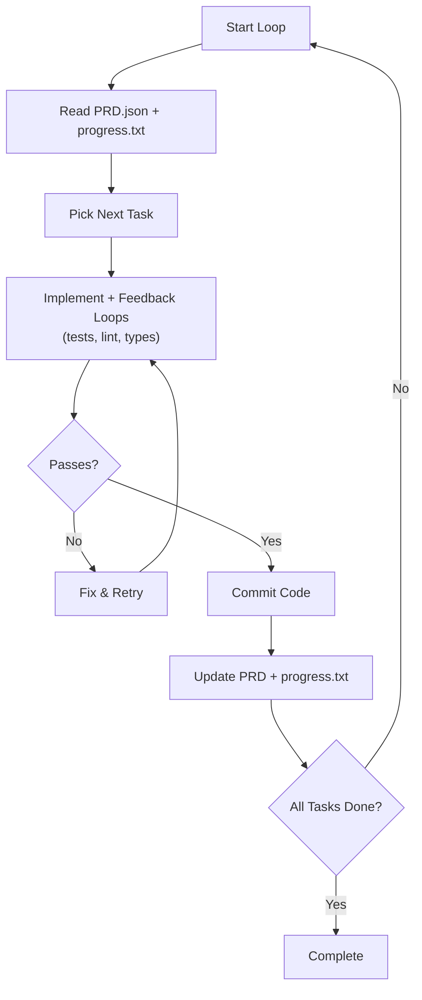
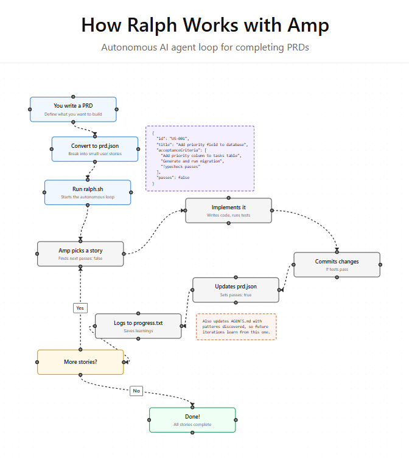

# Ralph Wiggum AI Agent 

Ralph Wiggum is a simple AI agent loop for autonomous coding. It builds full product features by breaking tasks into small, testable stories from a PRD. The agent runs in iterations, picks tasks, implements, commits, and updates progress until complete.

## Core Concept

Ralph uses a bash loop to feed the same prompt to an AI like Claude repeatedly. Each loop starts fresh to avoid context rot, relying on files for memory: PRD JSON for tasks, progress.txt for recent work, and agents.md for long-term notes.

Named after the Simpsons character, it shifts from one-shot prompts to continuous autonomy. Traditional agents stop after tools; Ralph verifies and retries until success.

## Workflow Steps

1. Generate PRD with user stories and acceptance criteria.
2. Convert PRD to JSON with "passes" fields.
3. Run loop: Agent reads PRD/progress, picks task, codes, runs tests/lint, commits if passes.
4. Updates PRD (mark passes:true), appends to progress.txt.
5. Repeats until all tasks pass or emits <promise>COMPLETE</promise>.



## Key Components

- **PRD.json**: Structured tasks with category, description, verification steps, passes:false.
- **progress.txt**: Short-term memory of recent changes, decisions, blockers.
- **agents.md**: Long-term repo memory, skills, quality rules.
- **Feedback Loops**: Types, tests, lint block bad commits.
- **Guardrails**: Small tasks, Docker sandbox for AFK runs, iteration limits.

## Implementation Guide

Install from Vercel Labs repo: `npm install ralph-loop-agent ai zod`.

Basic JS example:
```javascript
import { RalphLoopAgent, iterationCountIs } from 'ralph-loop-agent';

const agent = new RalphLoopAgent({
  model: 'anthropic/claude-opus-4.5',
  instructions: 'Coding assistant.',
  stopWhen: iterationCountIs(10),
  verifyCompletion: async ({ result }) => ({
    complete: result.text.includes('DONE'),
    reason: 'Task done'
  }),
});

const result = await agent.loop({ prompt: 'Build feature X' });
```
Customize verifyCompletion for real checks like test passes.

For CLI: Use scripts like ralph.sh with Docker sandbox.

## Benefits and Tips

- **Leverage**: Ships features AFK, like overnight.
- **Safety**: Small steps, human review commits, prioritize risky tasks first.
- **Cost**: HITL cheap; AFK 30-50 iterations ~$5-10 on Claude Max.
- Tips: Start HITL, define quality explicitly, use JSON PRDs, clean repo first.

| Mode | Supervision | Use Case |
|------|-------------|----------|
| HITL | Watch & intervene | Learning, complex tasks |
| AFK | Unsupervised loop | Bulk/low-risk work |

## Limitations

Bottleneck is PRD quality; vague specs lead to shortcuts. Needs good feedback loops. Not for infinite loops—cap iterations. Open-source models lag behind Claude.

---

# How Ralph Works with Amp

(Here's a [complete GitHub repo](https://github.com/snarktank/ralph) for you to download and try.)

## Visualize the loop:
https://snarktank.github.io/ralph/


## My Reference :
[Claude Ralph Loop](Claude-Ralph-Loop.md)

[Claude Ralph Loop vs Agent Ralph Mode](ClaudeRalphLoop-vs-AgentRalphMode.md)

---

## **Ralph** AI coding loop Steps:

Steps to implement the **"Ralph" AI coding loop** to build software features automatically:

### 1. Create a Product Requirement Document (PRD)

Start by writing a description of the feature you want to build in a markdown file. You can use a "PRD generator" skill with an AI agent (like AMP or Claude) to help structure this. You can even dictate your ideas using voice-to-text tools like Whisper Flow to get your thoughts down quickly.

### 2. Convert the PRD to JSON Format

Use a "Ralph PRD converter" tool to turn your markdown document into a **JSON file**. This format is easier for the computer to process as a structured list of tasks.

### 3. Break Tasks into Small "User Stories"

The JSON file must consist of small, atomic "user stories." Each story should be small enough to be completed within the AI's "context window" (memory limit) in a single iteration.

### 4. Set Clear Acceptance Criteria

For every user story, you must provide specific **acceptance criteria**. These are clear tests that allow the AI agent to verify for itself whether a task is truly finished without needing to ask you for feedback.

### 5. Run the Ralph Bash Script

Open your computer's terminal and run the Ralph bash script (found in the open-source repository). This script acts as the manager for the entire automated loop.

### 6. Automated Implementation Loop

Once started, the system follows this cycle automatically while you sleep or work on other things:

* **Pick a Story:** The agent selects the next incomplete task from your JSON list.
* **Code and Test:** The agent writes the code and checks it against your acceptance criteria.
* **Commit Code:** Once finished, the agent automatically commits the changes to your project.
* **Update Progress:** The agent marks the task as complete in the JSON file and updates a `progress.txt` file (short-term memory).

### 7. Build Long-Term "Agent Memory"

The agent updates `agents.md` files within your code folders. This serves as long-term memory, where the AI stores notes about your codebase or mistakes it learned from so it doesn't repeat them in the future.

### 8. Final Manual Verification

After the agent has finished all the stories in your list, perform a final manual test of the feature to catch any minor edge-case bugs that the AI might have missed.

---

## Bash loop:

1. Pipes a prompt into your AI agent
2. Agent picks the next story from prd.json
3. Agent implements it
4. Agent runs typecheck + tests
5. Agent commits if passing
6. Agent marks story done
7. Agent logs learnings
8. Loop repeats until done

Memory persists only through:

- Git commits
- progress.txt (learnings)
- prd.json (task status)

## File Structure

```
scripts/ralph/
├── ralph.sh
├── prompt.md
├── prd.json
└── progress.txt
```

## ralph.sh

The loop:

```bash
#!/bin/bash
set -e

MAX_ITERATIONS=${1:-10}
SCRIPT_DIR="$(cd "$(dirname \
  "${BASH_SOURCE[0]}")" && pwd)"

echo "🚀 Starting Ralph"

for i in $(seq 1 $MAX_ITERATIONS); do
  echo "═══ Iteration $i ═══"
  
  OUTPUT=$(cat "$SCRIPT_DIR/prompt.md" \
    | amp --dangerously-allow-all 2>&1 \
    | tee /dev/stderr) || true
  
  if echo "$OUTPUT" | \
    grep -q ">COMPLETE>"
  then
    echo "✅ Done!"
    exit 0
  fi
  
  sleep 2
done

echo "⚠️ Max iterations reached"
exit 1
```

Make executable:

```bash
chmod +x scripts/ralph/ralph.sh
```

Other agents:

- Claude Code: `claude --dangerously-skip-permissions`

## prompt.md

Instructions for each iteration:

```markdown
# Ralph Agent Instructions

## Your Task

1. Read `scripts/ralph/prd.json`
2. Read `scripts/ralph/progress.txt` (check Codebase Patterns first)
3. Check you're on the correct branch
4. Pick highest priority story where `passes: false`
5. Implement that ONE story
6. Run typecheck and tests
7. Update AGENTS.md files with learnings
8. Commit: `feat: [ID] - [Title]`
9. Update prd.json: `passes: true`
10. Append learnings to progress.txt

## Progress Format

APPEND to progress.txt:

## [Date] - [Story ID]

- What was implemented
- Files changed
- **Learnings:**
  - Patterns discovered
  - Gotchas encountered

***

## Codebase Patterns

Add reusable patterns to the TOP of progress.txt:
## Codebase Patterns

- Migrations: Use IF NOT EXISTS
- React: useRef | null > (null)

## Stop Condition

If ALL stories pass, reply: `>COMPLETE>`

Otherwise end normally.
```

## prd.json

Your task list:

```json
{
  "branchName": "ralph/feature",
  "userStories": [
    {
      "id": "US-001",
      "title": "Add login form",
      "acceptanceCriteria": [
        "Email/password fields",
        "Validates email format",
        "typecheck passes"
      ],
      "priority": 1,
      "passes": false,
      "notes": ""
    }
  ]
}
```

Key fields:

- `branchName` — branch to use
- `priority` — lower = first
- `passes` — set true when done

## progress.txt

Start with context:

```markdown
# Ralph Progress Log

Started: 2024-01-15

## Codebase Patterns

- Migrations: IF NOT EXISTS
- Types: Export from actions.ts

## Key Files

- db/schema.ts
- app/auth/actions.ts

---
```

Ralph appends after each story.
Patterns accumulate across iterations.

## Running Ralph

```bash
./scripts/ralph/ralph.sh 25
```

Runs up to 25 iterations.
Ralph will:

- Create the feature branch
- Complete stories one by one
- Commit after each
- Stop when all pass

## Critical Success Factors

### 1. Small Stories

Must fit in one context window.

```
❌ Too big:
> "Build entire auth system"

✅ Right size:
> "Add login form"
> "Add email validation"
> "Add auth server action"
```

### 2. Feedback Loops

Ralph needs fast feedback:

- `npm run typecheck`
- `npm test`

Without these, broken code compounds.

### 3. Explicit Criteria

```
❌ Vague:
> "Users can log in"

✅ Explicit:
> - Email/password fields
> - Validates email format
> - Shows error on failure
> - typecheck passes
> - Verify at localhost:$PORT/login (PORT defaults to 3000)
```

### 4. Learnings Compound

By story 10, Ralph knows patterns from stories 1-9.
Two places for learnings:

1. progress.txt — session memory for Ralph iterations
2. [AGENTS.md](https://agents.md/) — permanent docs for humans and future agents

Before committing, Ralph updates AGENTS.md files in directories with edited files if it discovered reusable patterns (gotchas, conventions, dependencies).

### 5. AGENTS.md Updates

Ralph updates [AGENTS.md](https://agents.md/) when it learns something worth preserving:

```
✅ Good additions:
- "When modifying X, also update Y"
- "This module uses pattern Z"
- "Tests require dev server running"

❌ Don't add:
- Story-specific details
- Temporary notes
- Info already in progress.txt
```

### 6. Browser Testing

For UI changes, use the [dev-browser skill](https://github.com/SawyerHood/dev-browser) by [@sawyerhood](https://x.com/@sawyerhood). Load it with `Load the dev-browser skill`, then:

```bash
# Start the browser server
~/.config/amp/skills/dev-browser/server.sh &
# Wait for "Ready" message

# Write scripts using heredocs
cd ~/.config/amp/skills/dev-browser && npx tsx <<'EOF'
import { connect, waitForPageLoad } from "@/client.js";

const client = await connect();
const page = await client.page("test");
await page.setViewportSize({ width: 1280, height: 900 });
const port = process.env.PORT || "3000";
await page.goto(`http://localhost:${port}/your-page`);
await waitForPageLoad(page);
await page.screenshot({ path: "tmp/screenshot.png" });
await client.disconnect();
EOF
```

Not complete until verified with screenshot.

## Common Gotchas

**Idempotent migrations:**

```sql
ADD COLUMN IF NOT EXISTS email TEXT;
```

**Interactive prompts:**

```bash
echo -e "\n\n\n" | npm run db:generate
```

**Schema changes:**

After editing schema, check:

- Server actions
- UI components
- API routes

Fixing related files is OK: If typecheck requires other changes, make them. Not scope creep.

## Monitoring

```bash
# Story status
cat scripts/ralph/prd.json | \
  jq '.userStories[] | {id, passes}'

# Learnings
cat scripts/ralph/progress.txt

# Commits
git log --oneline -10
```

## Real Results

We built an evaluation system:

- 13 user stories
- ~15 iterations
- 2-5 min each
- ~1 hour total

Learnings compound. By story 10, Ralph knew our patterns.

## When NOT to Use

- Exploratory work
- Major refactors without criteria
- Security-critical code
- Anything needing human review

***

For a great video walkthrough of how to use Ralph, checkout the video from [@mattpocockuk](https://x.com/@mattpocockuk) — "My Ralph Wiggum breakdown went viral https://x.com/mattpocockuk/status/2008200878633931247?s=20. It's a keep-it-simple-stupid approach to AI coding that lets you ship while you sleep."

## Other References:   

https://ampcode.com/
https://snarktank.github.io/ralph/
https://github.com/snarktank/amp-skills
https://github.com/snarktank/ralph
https://ghuntley.com/ralph/

[1](https://www.youtube.com/watch?v=_IK18goX4X8)
[2](https://github.com/vercel-labs/ralph-loop-agent)
[3](https://www.youtube.com/watch?v=RpvQH0r0ecM)
[4](https://www.aihero.dev/tips-for-ai-coding-with-ralph-wiggum)
[5](https://dev.to/alexandergekov/2026-the-year-of-the-ralph-loop-agent-1gkj)
[6](https://github.com/alfredolopez80/multi-agent-ralph-loop)
[7](https://x.com/JeremyNguyenPhD/status/2008877889056370802)
[8](https://venturebeat.com/technology/how-ralph-wiggum-went-from-the-simpsons-to-the-biggest-name-in-ai-right-now)
[9](https://gist.github.com/peteristhegreat/31e7114805e24b9e38084772e2e7cf46)
[10](https://samcouch.com/articles/ralph-wiggum-coding/)