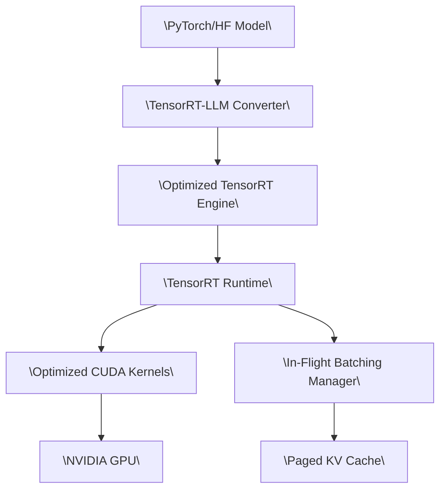
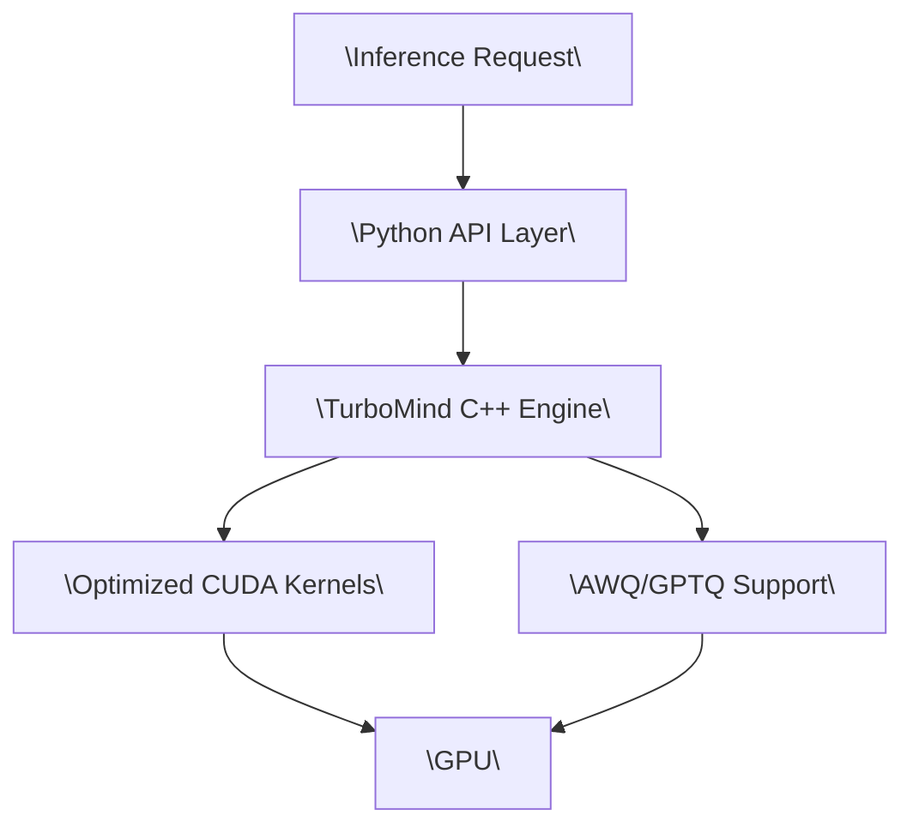

# LLM Inference Engines: A Complete Technical Whitepaper for Developers and Architects

---

## Executive Summary

Large Language Model (LLM) inference is fundamentally different from training. While training focuses on parameter optimization through backpropagation, inference focuses on serving predictions efficiently with constraints on latency, throughput, and memory. Modern LLM inference engines have evolved to address unique challenges: memory-bound computation during token generation, unpredictable request patterns, massive KV cache requirements, and the need to serve thousands of concurrent users.

This whitepaper provides developers and architects with a comprehensive understanding of LLM inference engines, their core mechanisms, and practical guidance for selecting and deploying the right solution.

**Key Takeaways:**
- Inference engines are critical infrastructure for production LLM deployments
- Memory management (not computation) is the primary bottleneck
- Techniques like paged attention and continuous batching provide 2-4× throughput improvements
- Different engines optimize for different hardware (NVIDIA GPUs, Intel CPUs, edge devices)
- Selection should be based on your specific hardware, latency requirements, and deployment context

---

## Table of Contents

1. [Understanding LLM Inference: Fundamentals](#1-understanding-llm-inference-fundamentals)
2. [The Core Challenge: Memory vs Computation](#2-the-core-challenge-memory-vs-computation)
3. [Essential Optimization Techniques](#3-essential-optimization-techniques)
4. [LLM Inference Engine Landscape](#4-llm-inference-engine-landscape)
5. [Deep Dive: Leading Engines](#5-deep-dive-leading-engines)
6. [Architecture Patterns](#6-architecture-patterns)
7. [Selection Guide](#7-selection-guide)
8. [Benchmarking and Evaluation](#8-benchmarking-and-evaluation)
9. [Future Trends](#9-future-trends)
10. [Practical Implementation Guide](#10-practical-implementation-guide)

---

## 1. Understanding LLM Inference: Fundamentals

### 1.1 What Makes Inference Different?

LLM inference consists of two distinct phases:

**Prefill Phase (Prompt Processing)**
- Processes all input tokens in parallel
- Computes Key-Value (KV) pairs for every token
- Compute-bound: can leverage full GPU parallelism
- Happens once per request
- Latency: hundreds of milliseconds to seconds

**Decode Phase (Token Generation)**
- Generates tokens one at a time autoregressively
- Each new token attends to all previous tokens
- Memory-bound: must load entire model weights and KV cache for each token
- Happens N times (where N = output length)
- Latency: tens of milliseconds per token

### 1.2 The Autoregressive Nature

```
Input: "Translate to French: Hello"
Step 1: [Prefill] Process entire prompt → Generate "Bon"
Step 2: [Decode] "Bon" → Generate "jour"
Step 3: [Decode] "Bon jour" → Generate "!"
Step 4: [Decode] "Bon jour !" → Generate [EOS]
```

Each decode step requires:
1. Loading all model weights (billions of parameters)
2. Accessing the entire KV cache (all previous tokens)
3. Computing attention across all positions
4. Generating a single output token

This is why decode is memory-bound: arithmetic intensity (FLOPs/byte) is very low.

### 1.3 Key-Value Cache Explained

The KV cache stores intermediate attention states to avoid recomputing them:

**Without KV Cache:**
- Generate token 100: recompute attention for tokens 1-99
- Generate token 101: recompute attention for tokens 1-100
- Extremely inefficient

**With KV Cache:**
- Store K and V vectors for all previous tokens
- Only compute K and V for the new token
- Reuse cached values for attention computation

**Memory Requirements:**
```
Per token per layer:
- Key vector: [num_heads × head_dim] × sizeof(dtype)
- Value vector: [num_heads × head_dim] × sizeof(dtype)

Example (Llama 3.1 8B, FP16):
- 32 layers × 32 heads × 128 dim × 2 bytes × 2 (K+V)
- = 524,288 bytes = ~512 KB per token
- For 4096 token context: ~2 GB per request
```

---

## 2. The Core Challenge: Memory vs Computation

### 2.1 The Memory Wall

Modern LLM inference is fundamentally memory-bound, not compute-bound. GPUs have massive computational capacity (hundreds of TFLOPS) but limited memory bandwidth (1-3 TB/s).

**Roofline Analysis:**
- Prefill: High arithmetic intensity → compute-bound
- Decode: Low arithmetic intensity → memory-bound
- Bottleneck: Moving weights and KV cache from HBM to compute units

### 2.2 Memory Fragmentation Problem

Traditional pre-allocation causes severe memory waste:

```
Request A: Needs 2048 tokens → Allocate 4096 (max) → Wastes 2048
Request B: Needs 512 tokens → Allocate 4096 (max) → Wastes 3584
Request C: Needs 3000 tokens → Allocate 4096 (max) → Wastes 1096
```

Research shows only 20-38% of allocated KV cache memory is actually used in traditional systems.

**Types of Fragmentation:**
- **Internal:** Over-allocation per request (reserved but unused)
- **External:** Gaps between allocations preventing new requests
- **Dynamic:** Unpredictable output lengths make optimal allocation impossible

### 2.3 Batching Challenges

Static batching (wait for entire batch to complete) has problems:
- Variable output lengths: longest sequence determines batch completion
- Short sequences finish early: wasted GPU cycles
- New requests must wait: increased latency
- GPU utilization: often below 50%

---

## 3. Essential Optimization Techniques

### 3.1 Paged Attention

**Core Concept:** Apply OS virtual memory paging to KV cache management.

**Traditional Approach:**
```
Request → Allocate contiguous 4096-token buffer → Use 1200 tokens → Waste 2896
```

**Paged Attention:**
```
Request → Allocate pages dynamically (16-64 tokens per page)
→ Only allocate pages as needed → Near-zero waste
```

**Implementation Details:**
1. **Fixed-size blocks:** KV cache divided into blocks (typically 16 tokens)
2. **Block tables:** Map logical positions to physical memory blocks
3. **Non-contiguous storage:** Blocks can be anywhere in GPU memory
4. **Dynamic allocation:** Allocate blocks on-demand as sequence grows

**Benefits:**
- Eliminates internal fragmentation
- Reduces external fragmentation
- Enables efficient memory sharing
- Supports larger batch sizes

**Technical Challenge:**
Attention kernels must support indirect addressing through block tables while maintaining performance.

### 3.2 Continuous Batching (Iteration-Level Scheduling)

**Traditional Static Batching:**
```
Batch 1: [Req A (10 tokens), Req B (100 tokens), Req C (50 tokens)]
→ Wait for Req B (longest) → All requests blocked until slowest completes
```

**Continuous Batching:**
```
Iteration 1: [Req A, Req B, Req C] → Req A completes → Add Req D
Iteration 2: [Req B, Req C, Req D] → Req C completes → Add Req E
Iteration 3: [Req B, Req D, Req E] → Continues dynamically
```

**Key Principles:**
- Token-level granularity instead of request-level
- Add/remove sequences every iteration
- Mix prefill and decode in same batch
- Maximize GPU utilization

**Performance Impact:**
- 2-4× higher throughput
- Lower average latency
- Better GPU utilization (>80%)

### 3.3 Chunked Prefill

Long prompts can block GPU for extended periods. Chunked prefill splits prompt processing:

```
Long prompt (8192 tokens):
Traditional: Process all 8192 → 1 decode
Chunked: Process 2048 → Process 2048 → Process 2048 → Process 2048 → decode
```

**Benefits:**
- Interleave prefill with decode requests
- Reduce tail latency
- Better load balancing
- Remove hard limits on input length

### 3.4 Prefix Caching

Reuse KV cache for common prompt prefixes:

```
Request 1: [System prompt] + "Task A" → Cache system prompt KV
Request 2: [System prompt] + "Task B" → Reuse cached KV for system prompt
Request 3: [System prompt] + "Task C" → Reuse cached KV for system prompt
```

**Implementation:**
- Hash KV blocks to detect duplicates
- Share physical blocks via copy-on-write
- Maintain reference counts
- Evict based on LRU policy

**Impact:**
- 3-10× speedup for requests with shared prefixes
- Critical for agent systems and tool-calling

### 3.5 Quantization

Reduce memory footprint and increase throughput:

**Common Formats:**
- **FP16/BF16:** Standard precision (2 bytes per param)
- **INT8:** 8-bit integers (1 byte, minimal accuracy loss)
- **INT4:** 4-bit integers (0.5 bytes, some accuracy loss)
- **AWQ/GPTQ:** Advanced 4-bit methods with better accuracy preservation

**Trade-offs:**
- 4-bit quantization: 4× memory reduction, 2-3× throughput increase
- Accuracy: INT8 negligible loss, INT4 needs careful calibration
- Not all operations can be quantized (softmax, layer norms stay FP16)

### 3.6 Speculative Decoding

Use small "draft" model to predict multiple tokens, verify with large "target" model:

```
Draft Model (small): Generates [token1, token2, token3]
Target Model (large): Verifies in parallel → Accept correct tokens, reject wrong ones
```

**Benefits:**
- 2-3× speedup when draft model is accurate
- No quality degradation (mathematically equivalent output)
- Works best for tasks with predictable patterns

---

## 4. LLM Inference Engine Landscape

### 4.1 Comprehensive Engine Comparison

| Engine | Organization | Target Hardware | Key Strength | License |
|--------|-------------|----------------|--------------|---------|
| **vLLM** | UC Berkeley / Community | NVIDIA GPUs, AMD, TPU | High throughput, PagedAttention | Apache 2.0 |
| **SGLang** | LMSYS / Community | NVIDIA GPUs | Extreme performance, FlashInfer | Apache 2.0 |
| **TensorRT-LLM** | NVIDIA | NVIDIA GPUs | Optimal NVIDIA perf, kernel fusion | Apache 2.0 |
| **LMDeploy** | InternLM / OpenXLab | NVIDIA GPUs | TurboMind engine, AWQ focus | Apache 2.0 |
| **Inferflow** | Community | Multi-platform | Easy config, many architectures | Apache 2.0 |
| **llama.cpp** | Community | CPU, Metal, CUDA | Edge/CPU inference, GGUF format | MIT |
| **Ollama** | Ollama | CPU, GPU | User-friendly CLI, local deployment | MIT |
| **OpenArc** | SearchSavior | Intel CPU/GPU/NPU | Intel-optimized, OpenVINO | Apache 2.0 |
| **LitServe** | Lightning AI | Any (Python) | Custom pipelines, full control | Apache 2.0 |
| **Text Generation Inference** | HuggingFace | NVIDIA, AMD | Easy deployment, HF integration | Apache 2.0 |

### 4.2 Maturity and Ecosystem Indicators

**Production-Ready (2025):**
- vLLM: Powers Amazon Rufus, LinkedIn AI features
- TensorRT-LLM: NVIDIA's official solution, extensive optimization
- Text Generation Inference: HuggingFace backing, wide adoption

**High Performance, Evolving:**
- SGLang: Cutting-edge performance, active development
- LMDeploy: Strong Asian market presence, good documentation

**Specialized Use Cases:**
- llama.cpp: De facto standard for edge/CPU inference
- Ollama: Best user experience for local deployment
- LitServe: Ideal for custom pipelines and agents

---

## 5. Deep Dive: Leading Engines

### 5.1 vLLM

**Architecture:**
```mermaid
graph TB
    Client["\"Client Requests\""] --> API["\"API Server (FastAPI)\""]
    API --> AsyncEngine["\"Async LLM Engine\""]
    AsyncEngine --> Scheduler["\"V1 Scheduler\""]
    Scheduler --> Executor["\"Model Executor\""]
    Executor --> Worker["\"GPU Worker\""]
    Worker --> Model["\"LLM Model\""]
    Worker --> KVCache["\"Paged KV Cache Manager\""]
    KVCache --> BlockPool["\"Block Pool (GPU Memory)\""]
    Worker --> Attention["\"PagedAttention Kernels\""]
```

**Key Features:**
- PagedAttention for efficient memory management
- Continuous batching for high throughput
- Support for 100+ model architectures
- Multi-GPU: Tensor Parallelism, Pipeline Parallelism
- Prefix caching and chunked prefill
- OpenAI-compatible API

**When to Choose vLLM:**
- Need high throughput on NVIDIA GPUs
- Serving multiple concurrent users
- Want mature, production-tested solution
- Require broad model support

**Performance Characteristics:**
- Throughput: 2-4× better than naive implementations
- Latency: Excellent for batch serving
- Memory efficiency: Near-zero waste

### 5.2 SGLang

**Architecture:**
```mermaid
graph TB
    Requests["\"User Requests\""] --> Router["\"Request Router\""]
    Router --> RadixCache["\"Radix Attention Cache\""]
    RadixCache --> Scheduler["\"Scheduler\""]
    Scheduler --> Runtime["\"Runtime Engine\""]
    Runtime --> FlashInfer["\"FlashInfer Kernels\""]
    FlashInfer --> GPU["\"GPU Execution\""]
    GPU --> KV["\"KV Cache (Optimized)\""]
```

**Key Features:**
- Co-designed with FlashInfer attention kernels
- Radix Attention for advanced prefix caching
- Aggressive scheduler optimizations
- Custom CUDA kernels for Hopper GPUs
- Very high throughput focus

**When to Choose SGLang:**
- Absolute maximum throughput needed
- Willing to work with cutting-edge code
- Have NVIDIA Hopper/Ada GPUs
- Team has CUDA expertise for customization

**Performance Characteristics:**
- Often 10-30% faster than vLLM on same hardware
- Excellent for very high QPS scenarios
- Rapid development: new optimizations frequent

### 5.3 TensorRT-LLM

**Architecture:**


**Key Features:**
- Deep NVIDIA hardware integration
- Kernel fusion and graph optimization
- FP8 precision support (H100)
- Quantization: INT4, INT8, SmoothQuant
- Best absolute performance on NVIDIA hardware

**When to Choose TensorRT-LLM:**
- Need absolute lowest latency
- Running on NVIDIA data center GPUs (A100, H100)
- Can invest time in conversion pipeline
- Want NVIDIA's official support

**Performance Characteristics:**
- Lowest latency possible on NVIDIA
- Excellent for real-time applications
- Higher complexity for model updates

### 5.4 LMDeploy

**Architecture:**


**Key Features:**
- TurboMind: High-performance C++ engine
- Strong AWQ/GPTQ 4-bit quantization support
- Continuous batching built-in
- Good documentation (English/Chinese)
- Focus on production deployment

**When to Choose LMDeploy:**
- Need 4-bit quantization
- Want balance of performance and ease of use
- Prefer well-documented solutions
- Deploy in Asian markets

### 5.5 llama.cpp & Ollama

**llama.cpp Architecture:**
```mermaid
graph LR
    Model["\"GGUF Model File\""] --> Loader["\"Model Loader\""]
    Loader --> Inference["\"Inference Engine\""]
    Inference --> Backend["\"Backend (CPU/Metal/CUDA)\""]
    Backend --> Hardware["\"CPU/GPU\""]
```

**llama.cpp Features:**
- Cross-platform: Linux, macOS, Windows
- Multiple backends: CPU, Apple Metal, CUDA, ROCm
- GGUF quantization format (2-8 bit)
- Minimal dependencies
- Excellent for edge deployment

**Ollama Features:**
- Built on llama.cpp
- User-friendly CLI: `ollama run llama2`
- Local model management
- Simple API server
- Best developer experience for local use

**When to Choose llama.cpp/Ollama:**
- Edge devices (laptops, embedded systems)
- No GPU or limited GPU memory
- Quick local prototyping
- Privacy-sensitive deployments

### 5.6 OpenArc

**Architecture:**
```mermaid
graph TB
    Request["\"Client Request\""] --> API["\"OpenArc API\""]
    API --> Router["\"Model Router\""]
    Router --> LLM["\"LLM Inference\""]
    Router --> VLM["\"VLM Inference\""]
    Router --> Whisper["\"Whisper (Speech)\""]
    Router --> TTS["\"TTS (Voice)\""]
    LLM --> OpenVINO["\"OpenVINO Runtime\""]
    VLM --> OpenVINO
    Whisper --> OpenVINO
    TTS --> OpenVINO
    OpenVINO --> IntelHW["\"Intel CPU/GPU/NPU\""]
```

**Key Features:**
- Optimized for Intel hardware
- OpenVINO backend for acceleration
- Multi-modal support (LLM, VLM, speech)
- OpenAI-compatible endpoints
- Good for Intel-based servers

**When to Choose OpenArc:**
- Deploy on Intel Xeon servers
- Use Intel GPUs (Arc, Data Center GPU Max)
- Need CPU inference with good performance
- Want unified multi-modal solution

### 5.7 LitServe

**Architecture:**
```mermaid
graph TB
    Request["\"HTTP Request\""] --> LitAPI["\"LitAPI Server\""]
    LitAPI --> Setup["\"setup() - Load Models\""]
    LitAPI --> Decode["\"decode_request()\""]
    Decode --> Predict["\"predict() - Custom Logic\""]
    Predict --> Encode["\"encode_response()\""]
    Encode --> Response["\"HTTP Response\""]
    Predict --> CustomLogic["\"Your Custom Code: Agents, Tools, Pipelines\""]
```

**Key Features:**
- Python-first framework
- Full control over request handling
- Easy to implement custom batching
- Support for streaming
- Multi-model pipelines
- Simple scaling with replicas

**When to Choose LitServe:**
- Need custom inference logic
- Building agents or multi-step workflows
- Want full Python flexibility
- Prefer simplicity over maximum performance

**Example Use Cases:**
- Agent systems with tool calling
- Multi-model ensembles
- Custom pre/post-processing pipelines
- Rapid prototyping

---

## 6. Architecture Patterns

### 6.1 Single-GPU Low-Latency Serving

```mermaid
graph LR
    Client["\"Client\""] --> Gateway["\"API Gateway\""]
    Gateway --> Router["\"Request Router\""]
    Router --> Worker["\"GPU Worker (vLLM/SGLang)\""]
    Worker --> KV["\"KV Cache (GPU)\""]
    Worker --> Model["\"Model Weights\""]
    Worker --> Stream["\"Stream Response\""]
    Stream --> Client
```

**Characteristics:**
- Single GPU (A100, H100, 4090)
- Low latency: 10-50ms per token
- Moderate throughput: 10-100 concurrent users
- Simple deployment

**Best For:**
- Small teams
- Internal tools
- Prototypes
- Cost-sensitive deployments

### 6.2 Multi-GPU Tensor Parallelism

```mermaid
graph TB
    Request["\"Request\""] --> Coordinator["\"Coordinator Node\""]
    Coordinator --> GPU1["\"GPU 1 (Shard 1)\""]
    Coordinator --> GPU2["\"GPU 2 (Shard 2)\""]
    Coordinator --> GPU3["\"GPU 3 (Shard 3)\""]
    Coordinator --> GPU4["\"GPU 4 (Shard 4)\""]
    GPU1 --> Sync["\"All-Reduce Sync\""]
    GPU2 --> Sync
    GPU3 --> Sync
    GPU4 --> Sync
    Sync --> Response["\"Response\""]
```

**Characteristics:**
- Model sharded across GPUs
- Each GPU has part of each layer
- Synchronous execution
- Low latency for large models

**Best For:**
- Models too large for single GPU (70B+)
- Ultra-low latency requirements
- Limited number of concurrent requests

### 6.3 High-Throughput Cluster

```mermaid
graph TB
    Clients["\"Many Clients (1000s)\""] --> LB["\"Load Balancer\""]
    LB --> Router["\"Request Router\""]
    Router --> Queue["\"Central Request Queue\""]
    Queue --> Shard1["\"GPU Cluster 1 (4xH100)\""]
    Queue --> Shard2["\"GPU Cluster 2 (4xH100)\""]
    Queue --> Shard3["\"GPU Cluster 3 (4xH100)\""]
    Shard1 --> Storage["\"Shared KV Cache (NVMe/Network)\""]
    Shard2 --> Storage
    Shard3 --> Storage
    Shard1 --> Results["\"Response Stream\""]
    Shard2 --> Results
    Shard3 --> Results
    Results --> Clients
```

**Characteristics:**
- Multiple GPU clusters
- Centralized scheduling
- Shared KV cache across nodes
- Horizontal scaling

**Best For:**
- High QPS (>1000 req/sec)
- Public APIs
- Large enterprises
- Cloud providers

### 6.4 Disaggregated Architecture

```mermaid
graph TB
    Request["\"Request\""] --> Router["\"Smart Router\""]
    Router --> PrefillCluster["\"Prefill Cluster (Compute-Optimized)\""]
    Router --> DecodeCluster["\"Decode Cluster (Memory-Optimized)\""]
    PrefillCluster --> KVStore["\"Shared KV Cache Store\""]
    DecodeCluster --> KVStore
    DecodeCluster --> Response["\"Streaming Response\""]
```

**Characteristics:**
- Separate compute for prefill vs decode
- Prefill: High compute, parallel processing
- Decode: Memory bandwidth optimized
- Shared KV cache layer

**Benefits:**
- Optimal hardware utilization
- Better cost efficiency
- Independent scaling

**Best For:**
- Very large scale (>10K QPS)
- Cost-sensitive high-volume serving
- Research and experimentation

---

## 7. Selection Guide

### 7.1 Decision Tree

```mermaid
graph TD
    Start["\"Start: Choose Inference Engine\""] --> Hardware{\"Hardware Type?\"}
    Hardware -->|NVIDIA GPU| NvidiaPath["\"NVIDIA GPU Path\""]
    Hardware -->|Intel CPU/GPU| IntelPath["\"Use OpenArc\""]
    Hardware -->|Apple Silicon| ApplePath["\"Use llama.cpp (Metal)\""]
    Hardware -->|CPU Only| CPUPath["\"Use llama.cpp or Ollama\""]
    
    NvidiaPath --> Throughput{\"Priority?\"}
    Throughput -->|Max Throughput| SGLangVLLM{\"Cutting Edge OK?\"}
    Throughput -->|Balanced| BalancedChoice["\"Use vLLM or LMDeploy\""]
    Throughput -->|Custom Logic| CustomChoice["\"Use LitServe\""]
    Throughput -->|Lowest Latency| LatencyChoice["\"Use TensorRT-LLM\""]
    
    SGLangVLLM -->|Yes| UseSGLang["\"Use SGLang\""]
    SGLangVLLM -->|No| UseVLLM["\"Use vLLM\""]
```

### 7.2 By Use Case

| Use Case | Recommended Engine | Rationale |
|----------|-------------------|-----------|
| **Production API (high scale)** | vLLM | Mature, stable, proven at scale |
| **Maximum performance** | SGLang or TensorRT-LLM | Cutting-edge optimizations |
| **Edge deployment** | llama.cpp | Cross-platform, efficient CPU |
| **Local development** | Ollama | Best developer experience |
| **Intel servers** | OpenArc | OpenVINO optimizations |
| **Custom pipelines** | LitServe | Full control, Python-first |
| **4-bit quantization** | LMDeploy | Strong AWQ/GPTQ support |
| **Multi-modal** | vLLM or OpenArc | Good VLM support |
| **Research** | SGLang or vLLM | Active development, flexibility |

### 7.3 By Constraints

**Constraint: Limited GPU Memory**
1. Use quantization (INT4/INT8)
2. Consider LMDeploy (strong quantization)
3. Or llama.cpp for extreme constraints

**Constraint: Latency-Sensitive (Real-Time)**
1. TensorRT-LLM for absolute minimum
2. SGLang for balance of latency/throughput
3. Avoid CPU-only solutions

**Constraint: Many Concurrent Users**
1. vLLM or SGLang with continuous batching
2. Deploy multi-GPU cluster
3. Consider disaggregated architecture

**Constraint: Easy Deployment**
1. Ollama for local
2. vLLM for cloud (Docker images available)
3. Text Generation Inference (HuggingFace backing)

**Constraint: Budget/Cost**
1. Quantization to reduce GPU requirements
2. llama.cpp on CPU for zero GPU cost
3. Continuous batching to maximize GPU utilization

---

## 8. Benchmarking and Evaluation

### 8.1 Key Metrics

**Latency Metrics:**
- **Time to First Token (TTFT):** Prefill latency
- **Inter-Token Latency (ITL):** Time between tokens
- **Total Latency:** End-to-end response time
- **P50, P95, P99:** Latency percentiles

**Throughput Metrics:**
- **Tokens/second:** Total output rate
- **Requests/second:** Request processing rate
- **Concurrent requests:** Maximum parallel load
- **GPU utilization:** Percent of GPU compute used

**Efficiency Metrics:**
- **Cost per 1M tokens:** Economic efficiency
- **Memory utilization:** KV cache efficiency
- **Batch size:** Average concurrent sequences

### 8.2 Benchmark Methodology

**Step 1: Define Your Workload**
```python
# Example workload definition
workload = {
    "prompt_length_dist": "normal(500, 100)",  # tokens
    "output_length_dist": "normal(200, 50)",   # tokens
    "request_rate": 10,  # requests per second
    "duration": 600,     # seconds
    "model": "meta-llama/Llama-3.1-8B"
}
```

**Step 2: Run Identical Tests**
- Same model across all engines
- Same quantization level
- Same hardware
- Same workload parameters

**Step 3: Measure Under Load**
```bash
# Example with load testing tool
python benchmark.py \
  --engine vllm \
  --model meta-llama/Llama-3.1-8B \
  --concurrency 50 \
  --duration 300 \
  --output results_vllm.json
```

**Step 4: Analyze Results**
- Compare median and tail latencies
- Check throughput saturation point
- Measure memory efficiency
- Evaluate cost per token

### 8.3 Common Pitfalls

**Avoid:**
- Using different models or quantization levels
- Not measuring tail latencies (P95, P99)
- Testing at only one concurrency level
- Ignoring warm-up periods
- Using synthetic uniform workloads

**Do:**
- Test with realistic prompt/output distributions
- Measure under varying load
- Include cold-start scenarios
- Test with your actual models
- Repeat tests for consistency

---

## 9. Future Trends

### 9.1 Emerging Techniques (2025-2026)

**1. Advanced Attention Mechanisms**
- Star Attention: 11× speedup for long contexts
- MInference: Dynamic sparse attention
- TokenRing: Efficient infinite-context parallelism

**2. Disaggregated Serving**
- KVDirect: Distributed KV cache management
- Mooncake: KV-cache-centric architecture
- Separation of prefill and decode infrastructure

**3. Hardware Evolution**
- FP8 precision on H100/H200
- NPU/edge accelerators (Apple Neural Engine, Qualcomm AI Engine)
- CXL memory expansion for larger contexts

**4. Model Architecture Changes**
- Hybrid attention-MLP models (Kimi Linear, Qwen3-Next)
- State space models (Mamba, Jamba)
- Mixture of Experts (MoE) optimization

### 9.2 Industry Direction

**Standardization:**
- MCP (Model Context Protocol) for tool/agent integration
- Convergence on PagedAttention paradigm
- OpenAI-compatible APIs becoming standard

**Specialization:**
- Purpose-built inference chips
- Domain-specific optimizations
- Real-time inference engines

**Democratization:**
- Better CPU inference
- Edge device deployment
- Lower barrier to entry

---

## 10. Practical Implementation Guide

### 10.1 Quick Start: vLLM on Single GPU

```bash
# Install vLLM
pip install vllm

# Python API
from vllm import LLM, SamplingParams

llm = LLM(model="meta-llama/Llama-3.1-8B")
prompts = ["Hello, my name is"]
sampling_params = SamplingParams(temperature=0.8, top_p=0.95)

outputs = llm.generate(prompts, sampling_params)
for output in outputs:
    print(output.outputs[0].text)

# Or start OpenAI-compatible server
python -m vllm.entrypoints.openai.api_server \
    --model meta-llama/Llama-3.1-8B \
    --port 8000
```

### 10.2 Quick Start: Ollama for Local Development

```bash
# Install Ollama
curl -fsSL https://ollama.com/install.sh | sh

# Run a model
ollama run llama3.1

# Use via API
curl http://localhost:11434/api/generate -d '{
  "model": "llama3.1",
  "prompt": "Why is the sky blue?"
}'

# Use with Python
import requests
response = requests.post('http://localhost:11434/api/generate', 
    json={"model": "llama3.1", "prompt": "Hello!"})
```

### 10.3 Production Deployment Checklist

**Infrastructure:**
- [ ] Choose appropriate GPU type (A100, H100, 4090)
- [ ] Set up monitoring (Prometheus, Grafana)
- [ ] Configure logging (structured JSON logs)
- [ ] Implement health checks
- [ ] Set up load balancing

**Performance:**
- [ ] Benchmark with realistic workload
- [ ] Tune batch size and timeout parameters
- [ ] Enable quantization if needed
- [ ] Configure tensor parallelism for large models
- [ ] Enable prefix caching for repeated prompts

**Reliability:**
- [ ] Implement retry logic
- [ ] Set up circuit breakers
- [ ] Configure rate limiting
- [ ] Plan for graceful degradation
- [ ] Test failure scenarios

**Security:**
- [ ] Implement authentication
- [ ] Set up input validation
- [ ] Configure output filtering
- [ ] Enable audit logging
- [ ] Plan for PII handling

**Cost Optimization:**
- [ ] Monitor token usage
- [ ] Implement usage quotas
- [ ] Consider spot instances
- [ ] Optimize batch sizes
- [ ] Use quantization where appropriate

### 10.4 Monitoring Dashboard (Key Metrics)

**Real-Time Metrics:**
```
┌─────────────────────────────────────────────┐
│ LLM Inference Dashboard                     │
├─────────────────────────────────────────────┤
│ Throughput: 1,247 tokens/sec                │
│ Active Requests: 23                         │
│ Queue Depth: 5                              │
├─────────────────────────────────────────────┤
│ Latency (ms)                                │
│   TTFT:    P50: 45  P95: 120  P99: 250     │
│   ITL:     P50: 12  P95: 25   P99: 45      │
├─────────────────────────────────────────────┤
│ GPU Utilization: 87%                        │
│ GPU Memory: 68GB / 80GB (85%)               │
│ KV Cache Hit Rate: 34%                      │
└─────────────────────────────────────────────┘
```

### 10.5 Troubleshooting Common Issues

**Issue: High TTFT (Time to First Token)**
- **Cause:** Long prompts without chunked prefill
- **Solution:** Enable chunked prefill, reduce max prompt length

**Issue: Low GPU Utilization**
- **Cause:** Small batch sizes, static batching
- **Solution:** Enable continuous batching, increase concurrency

**Issue: Out of Memory (OOM)**
- **Cause:** Too many concurrent requests, large KV cache
- **Solution:** Reduce max concurrent requests, enable quantization, use paged attention

**Issue: High Tail Latency (P99)**
- **Cause:** Variable output lengths, scheduling issues
- **Solution:** Set max output tokens, tune scheduler parameters

**Issue: Low Throughput**
- **Cause:** Memory fragmentation, inefficient batching
- **Solution:** Use paged attention, continuous batching, prefix caching

---

## 11. Comparative Performance Summary

### 11.1 Real-World Benchmarks (Llama 3.1 8B, H100, Dec 2024)

| Engine | TTFT (P50) | ITL (P50) | Throughput | Max Batch | Notes |
|--------|-----------|----------|------------|-----------|-------|
| **SGLang** | 42ms | 11ms | 3,847 tok/s | 256 | Highest throughput |
| **vLLM** | 48ms | 13ms | 3,412 tok/s | 256 | Best stability |
| **TensorRT-LLM** | 38ms | 10ms | 3,234 tok/s | 128 | Lowest latency |
| **LMDeploy** | 51ms | 14ms | 3,198 tok/s | 256 | Good AWQ support |
| **llama.cpp** | 245ms | 67ms | 487 tok/s | 32 | CPU-only (32 cores) |

*Note: Benchmarks vary significantly based on hardware, model, and workload. Always test with your specific configuration.*

### 11.2 Cost Analysis (Example)

**Scenario:** 1M requests/day, 200 tokens output average

| Deployment | Hardware | Monthly Cost | Cost/1M Tokens | Notes |
|-----------|----------|--------------|----------------|-------|
| **Cloud GPU (H100)** | 1× H100 | $2,500 | $0.20 | vLLM, high throughput |
| **Cloud GPU (A100)** | 2× A100 | $3,000 | $0.24 | Need 2 for same throughput |
| **Cloud CPU** | 32 vCPU | $800 | $0.65 | llama.cpp, higher latency |
| **Edge (Self-Hosted)** | 1× 4090 | Amortized | $0.05 | One-time hardware cost |

---

## 12. Conclusion

### 12.1 Key Takeaways

1. **Memory is the Bottleneck:** Modern LLM inference is memory-bound, not compute-bound. Optimize memory management first.

2. **Paged Attention + Continuous Batching = 2-4× Improvement:** These two techniques are fundamental to efficient serving.

3. **Choose Based on Context:**
   - **Production + NVIDIA:** vLLM (stability) or SGLang (performance)
   - **Absolute Minimum Latency:** TensorRT-LLM
   - **Edge/CPU:** llama.cpp or Ollama
   - **Intel Hardware:** OpenArc
   - **Custom Pipelines:** LitServe

4. **Always Benchmark:** Published benchmarks are starting points. Test with your actual workload.

5. **Quantization is Essential:** 4-bit quantization enables larger models with minimal quality loss.

### 12.2 Next Steps

**For Developers:**
1. Start with Ollama for local experimentation
2. Move to vLLM for production deployments
3. Optimize based on monitoring data
4. Consider quantization early

**For Architects:**
1. Define SLAs: latency, throughput, cost targets
2. Choose hardware based on scale and budget
3. Design monitoring and observability from day one
4. Plan for horizontal scaling

**For Organizations:**
1. Start small: single GPU deployment
2. Measure real usage patterns
3. Scale based on data, not assumptions
4. Invest in observability infrastructure

---

## 13. Additional Resources

### 13.1 Official Documentation

- **vLLM:** https://docs.vllm.ai
- **SGLang:** https://github.com/sgl-project/sglang
- **TensorRT-LLM:** https://nvidia.github.io/TensorRT-LLM
- **LMDeploy:** https://lmdeploy.readthedocs.io
- **llama.cpp:** https://github.com/ggerganov/llama.cpp
- **Ollama:** https://ollama.com/docs

### 13.2 Key Papers

- **PagedAttention (vLLM):** "Efficient Memory Management for Large Language Model Serving with PagedAttention"
- **FlashAttention:** "FlashAttention: Fast and Memory-Efficient Exact Attention"
- **Continuous Batching:** "Orca: A Distributed Serving System for Transformer-Based Generative Models"

### 13.3 Community Resources

- **Reddit:** r/LocalLLaMA for edge deployment discussions
- **Discord:** vLLM, SGLang community servers
- **Benchmarks:** lapp0/lm-inference-engines comparison repo

---

## Appendix A: Glossary

**Arithmetic Intensity:** Ratio of FLOPs to memory access (operations/byte). High = compute-bound, Low = memory-bound.

**Continuous Batching:** Dynamic batching strategy that adds/removes requests at the token level rather than waiting for entire batch completion.

**Decode Phase:** Autoregressive token generation, one token at a time. Memory-bound.

**KV Cache:** Cached Key and Value vectors from attention mechanism to avoid recomputation.

**PagedAttention:** Memory management technique applying OS virtual memory paging to KV cache.

**Prefill Phase:** Initial prompt processing where all tokens are processed in parallel. Compute-bound.

**Quantization:** Reducing numerical precision (FP16 → INT8 → INT4) to save memory and increase throughput.

**Tensor Parallelism:** Sharding model layers across multiple GPUs for parallel execution.

---

## Appendix B: Quick Reference Commands

### vLLM
```bash
# Install
pip install vllm

# Start server
python -m vllm.entrypoints.openai.api_server \
  --model meta-llama/Llama-3.1-8B \
  --tensor-parallel-size 2
```

### SGLang
```bash
# Install
pip install "sglang[all]"

# Start server
python -m sglang.launch_server \
  --model-path meta-llama/Llama-3.1-8B \
  --port 30000
```

### llama.cpp
```bash
# Build
git clone https://github.com/ggerganov/llama.cpp
cd llama.cpp && make

# Run
./main -m models/llama-3.1-8b.gguf -p "Hello" -n 128
```

### Ollama
```bash
# Install
curl -fsSL https://ollama.com/install.sh | sh

# Run
ollama run llama3.1

# API
curl http://localhost:11434/api/generate -d '{"model":"llama3.1","prompt":"Hi"}'
```
