# 📄 Whitepaper: Understanding LLM Benchmarks

**A Simple Guide to Measuring AI Intelligence**

## What is an LLM Benchmark?

**LLM Benchmarks** are standardized tests for AI models—think of them as the SAT or GRE for language models. They measure specific capabilities like reasoning, coding, knowledge recall, and tool use through structured tasks and datasets.

However, no single benchmark tells the whole story. Each test captures only a narrow aspect of performance, which is why researchers use multiple benchmarks and leaderboards (like MMLU for knowledge, SWE-bench for coding, or Chatbot Arena for real user preferences) to build a complete picture of a model's strengths and limitations.

Benchmarks provide scores (usually percentages) to compare models objectively. They are like report cards for AI.

## Why do we need them?

* **Comparison:** See which LLM is better at certain tasks, if Model A (e.g., GPT-4) is better than Model B (e.g., Llama-3).
* **Progress Tracking:** To see how much AI is improving every month or over time.
* **Guide development**: Help researchers focus on weak areas.
* **Inform users**: Help people choose the right model for their needs.
* **Choosing the Right Tool:** If you need an AI for coding, you look at coding benchmark scores.

## Core idea of LLM benchmarks

- Benchmarks define a **task**, a dataset, and a scoring metric (e.g., accuracy) to turn model behavior into a 0–100 style score for easy comparison.
- Typical tasks include multiple-choice Q&A, math word problems, coding tasks, or conversational prompts, with metrics such as accuracy, recall, and perplexity.
- Leaderboards (Open LLM, Chatbot Arena, etc.) aggregate scores from multiple benchmarks to rank models and show trade-offs between strengths like reasoning, coding, and instruction following.

***

## Major benchmark families

### General knowledge & reasoning

- **MMLU (Massive Multitask Language Understanding) / MMLU Pro**: Massive multitask multiple‑choice exam over 57+ subjects (STEM, humanities, social sciences). Measures academic and professional knowledge; final score is averaged per category then across all categories.
- **ARC (AI2 Reasoning Challenge)**: Science questions (grades ~3–9) with an “easy” and “challenge” split; widely used for standardized reasoning evaluation and example of how to run your own eval via lm‑evaluation‑harness.
- **TruthfulQA, Winogrande, HellaSwag, GSM8K, GPQA, AIME, AGIEval, BigBench/BBH**: Focus on truthfulness, commonsense, plausible continuations, grade‑school math, graduate‑level science, exam‑style reasoning, and “hard” language tasks respectively.
- **GSM8K:** High-school level math word problems that require step-by-step thinking.
- **HumanEval:** Tests if an AI can write a small, working piece of Python code from a text description.
- **GPQA:** Extremely hard science questions written by experts. Even humans with Google struggle to answer these, but top AIs are starting to excel here.
- **MMLU-Pro**: Harder version with more reasoning required.
- **LiveBench / WildBench**: Newer tests using fresh questions (from recent news/contests) to avoid cheating.

***

### Coding and tool‑use benchmarks

- **SWE‑Bench / SWE‑Bench Verified**: Tests whether a model can read real GitHub issues and generate code patches that pass tests; contamination is a concern, so “verified” or post‑cutoff suites are preferred.
- **HumanEval, LiveCodeBench, BigCodeBench**: Measure code generation and problem solving on curated coding tasks and programming challenges.
- **Tool‑usage reliability / function‑calling benchmarks** (e.g., Gorilla function calling, tool‑use leaderboards): Measure how reliably a model calls tools/APIs in multi‑tool setups such as MCP‑heavy agents.

***

## Leaderboards and what they mean

### Representative leaderboard types

| Aspect           | Examples                          | What they aggregate | What you learn |
|-----------------|------------------------------------|---------------------|----------------|
| Open LLM boards | Open LLM Leaderboard, YALL        | MMLU, ARC, GSM8K, TruthfulQA, BBH, etc. | General capability profile across reasoning, knowledge, safety. |
| Arena‑style      | Chatbot Arena, MT‑Bench + ELO      | Pairwise chat comparisons + MT‑Bench | Interactive chat quality and instruction following vs peers. |
| Specialized      | Coding leaderboards, function‑calling boards | SWE‑Bench, HumanEval, tool‑use suites | Depth in one capability like coding or tools. |

- Benchmarks can be run in **zero‑shot** or **few‑shot** modes; adding examples usually raises scores and needs to be matched when comparing models.
- Tools like **EleutherAI’s lm‑evaluation‑harness** standardize how tasks like MMLU or ARC are run (prompt templates, number of shots, scoring) so results are more comparable across models.

Leaderboards rank models using multiple benchmarks:

- **Hugging Face Open LLM Leaderboard**: Focuses on open-source models, uses average scores.
- **LMSYS Chatbot Arena**: Blind user votes (Elo ratings) — often considered most realistic.
- **Artificial Analysis**: Detailed tests including speed, cost, and quality.

***

## The Two Ways to Test

Research shows there are two main "flavors" of testing:

| Feature | **Static Benchmarks** (The "Fixed Test") | **Live Leaderboards** (The "Crowd Test") |
| --- | --- | --- |
| **How it works** | A set list of questions and answers. | Humans chat with two AIs and vote for the better one. |
| **Example** | MMLU, HumanEval | **LMSYS Chatbot Arena** |
| **Pros** | Fast, cheap, and repeatable. | Hard to "cheat"; reflects real-world use. |
| **Cons** | AI might "memorize" the answers during training. | Subjective; depends on human opinion. |

***

## Current Challenges

As AI gets smarter, our tests are facing two major problems:

1. **Contamination ("Teaching to the Test"):** Because AI models are trained on the whole internet, they often "see" the exam questions before they take them. This makes their scores look better than they actually are.
* *Solution:* Researchers now use **"Canary Strings"** (hidden text codes) to tell AI trainers to keep test data out of the training set.

2. **Saturation:** Top models are getting nearly 90-100% on old tests (like MMLU). This makes the tests too easy to tell which model is actually better.
* *Solution:* New "Frontier" tests like **Humanity's Last Exam (HLE)** and **ARC-AGI** are being created to be much more difficult.

3. **Benchmark Gaming**: Companies train specifically on benchmark styles.

4. **Not Real-World**: High scores don't always mean good performance in actual use.

5. **Static Questions**: Old questions become easy as models improve.

```mermaid
flowchart LR
    A["Create Benchmark"] --> B["Models Train on Internet Data"]
    B --> C{"Questions Leaked?"}
    C -->|Yes| D["Contamination → Inflated Scores"]
    C -->|No| E["Fair Test"]
    D --> F["New Harder Benchmarks Needed"]
    E --> G["Reliable Comparison"]
```

## Recent Improvements (2024-2026)

- **Contamination-free tests**: LiveBench, Arena-Hard, and others use new questions monthly.
- **Human preference leaderboards**: LMSYS Arena focuses on what users actually prefer.
- **Multi-dimensional evaluation**: New leaderboards measure reasoning depth, tool use, and long-context handling.

***

## Strengths, limits, and how to use them

- Strengths:  
  - Fast model filtering: quickly rule out weak models for a use case (e.g., need math → check GSM8K/AIME; need coding → check SWE‑Bench / HumanEval).
  - Regression testing: track whether fine‑tuning or new releases actually improve targeted skills (e.g., comparing zero‑shot vs 25‑shot ARC after fine‑tuning).
  - Communication: give a shared numeric language (“Model X: 90% on science test benchmark”) for teams and customers.

- Limitations:  
  - They may miss **edge cases** or your specific domain quirks, so production behavior can differ from benchmark scores.
  - Overfitting and contamination (training on benchmark data, or benchmarks becoming saturated) can inflate scores without real capability gains.
  - Implementation details (prompt formats, number of shots, scoring functions like length‑normalized log‑likelihood vs regex extraction) can change scores noticeably.

- Practical guidance:  
  - Use benchmarks to narrow candidates, then run **task‑specific, custom evals** for your application (your own datasets, success criteria, and environments).
  - For Cline‑style dev workflows:  
    - Coding‑heavy → SWE‑Bench, HumanEval, LiveCodeBench, BigCodeBench.  
    - Domain‑heavy coding → MMLU Pro, GPQA, AIME.  
    - Tool‑heavy agents → tool‑usage reliability benchmarks and function‑calling leaderboards.

***

## Conceptual diagram

***

## Summary & Conclusion

Benchmarks are the best way to keep AI companies honest and help users pick the right model. However, no single score tells the whole story.
LLM benchmarks are useful tools to compare models and track progress, but they have clear limitations. High benchmark scores do not guarantee strong real-world performance. The field is rapidly creating better, contamination-resistant tests. Always test a model on your specific tasks for the truest picture.

This guide is based on widely discussed concepts in the AI community, verified across major sources including academic papers, leaderboards, and expert analyses up to January 2026.

**Recommendation:**

* For **General Use**, look at the **LMSYS Chatbot Arena**.
* For **Deep Reasoning**, look at **GPQA** and **MATH**.
* For **Professional Coding**, look at **SWE-bench**.

## Sources & Reference Videos

* [Overview of Evaluation Metrics](https://www.youtube.com/watch?v=JOIV1LdRnP8)
* [Top 5 Benchmarks Explained](https://www.youtube.com/watch?v=aOjgPJ94-aM)
* [The Problem with Contamination](https://www.youtube.com/watch?v=-YPiHoHLRSY)
* [Deep Dive: Coding Benchmarks](https://www.youtube.com/watch?v=QNQHRjU3DoM)