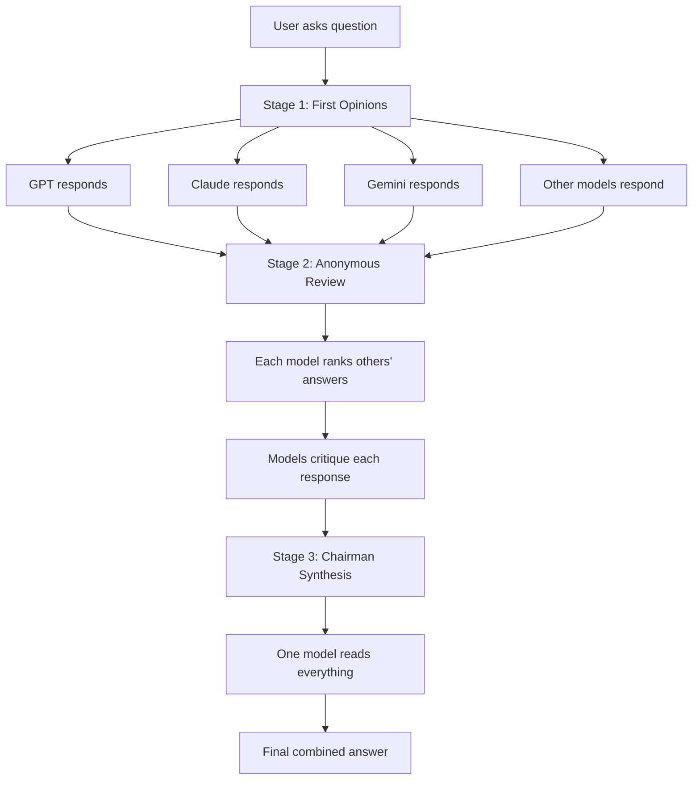
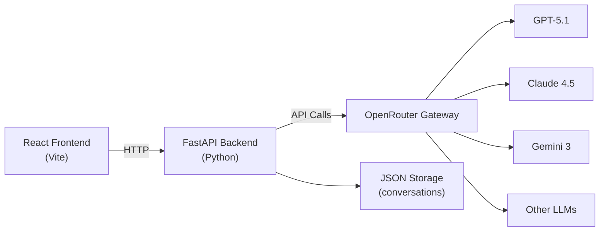
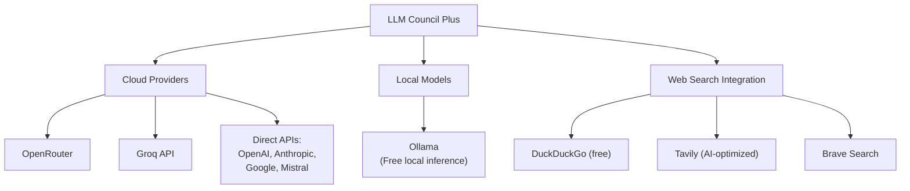
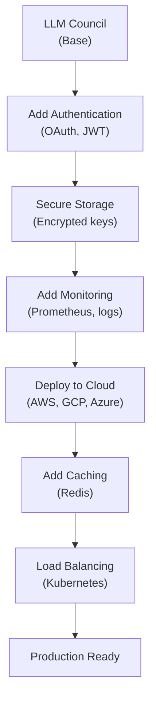

# LLM Council: A Simple Guide for Developers and Architects

## What is LLM Council?

LLM Council is an open-source project created by Andrej Karpathy (former Tesla AI Director, OpenAI founding member) in November 2025. Instead of asking one AI model for an answer, you ask multiple models, have them critique each other anonymously, and get one final synthesized answer.

**Think of it as:** An AI board of directors debating to give you the best possible answer.

---

## Why Do We Need This?

### The Problem with Single Models

1. **Different models give different answers** - GPT might say one thing, Claude says another, Gemini suggests something else
2. **Hallucinations** - AI models confidently make up incorrect information
3. **Bias** - Each model has biases from its training data
4. **Vendor lock-in** - You rely on one provider's strengths and weaknesses

### The Solution

Multiple AI models work together like a peer review system in academia:
- Different perspectives reduce blind spots
- Cross-examination catches errors
- Anonymous review prevents favoritism
- Final synthesis combines the best parts

---

## How It Works: 3 Simple Stages



### Stage 1: First Opinions (Divergence)

- Your question goes to all selected models at the same time
- Each model answers independently without seeing others' responses
- You get 3-8 different perspectives (typically 4-5 models)

**Example models:**
- OpenAI GPT-5.1
- Anthropic Claude Sonnet 4.5
- Google Gemini 3 Pro
- xAI Grok 4
- Meta Llama 4

### Stage 2: Anonymous Review (Convergence)

- All answers are labeled as "Response A", "Response B", "Response C" (names removed)
- Each model sees all the anonymized answers
- Each model ranks them from best to worst
- Each model explains why they ranked that way

**Why anonymous?** Research shows models favor their own style or brand. Removing names forces judgment based on content quality, not brand recognition.

### Stage 3: Chairman Synthesis

- One designated "chairman" model receives:
  - All original answers
  - All rankings
  - All critiques
- The chairman combines the best parts into one final answer
- The result is usually better than any single model's response

---

## Real Architecture Overview

### Technology Stack



**Components:**
1. **Frontend**: React app (looks like ChatGPT)
2. **Backend**: FastAPI (Python) - handles the 3-stage workflow
3. **API Gateway**: OpenRouter - connects to multiple LLM providers with one API key
4. **Storage**: Simple JSON files for conversation history

### Why OpenRouter?

Instead of managing separate API keys for OpenAI, Anthropic, Google, xAI, etc., you use one OpenRouter account. This means:
- One API key for all models
- Easy to swap models (change one line of config)
- No vendor lock-in
- Pay-as-you-go pricing

---

## Quick Setup Guide

### Prerequisites

- Python 3.10 or newer
- Node.js (for frontend)
- OpenRouter API key (get from openrouter.ai)

### Installation Steps

```bash
# 1. Clone the repository
git clone https://github.com/karpathy/llm-council.git
cd llm-council

# 2. Install Python dependencies
pip install uv
uv sync

# 3. Set up your API key
# Create .env file with:
# OPENROUTER_API_KEY=your_key_here

# 4. Install frontend dependencies
cd frontend
npm install
cd ..

# 5. Start the application
# Terminal 1 - Backend:
python -m backend.main

# Terminal 2 - Frontend:
cd frontend
npm run dev
```

Open http://localhost:5173 in your browser.

### Configuration

Edit `backend/config.py` to choose your council members:

```python
COUNCIL_MODELS = [
    "openai/gpt-5.1",
    "anthropic/claude-sonnet-4.5",
    "google/gemini-3-pro",
    "xai/grok-4"
]

CHAIRMAN_MODEL = "openai/gpt-5.1"  # or any other model
```

---

## Cost Considerations

### How Much Does It Cost?

Each question goes through multiple models multiple times:

**Cost multiplier: 3-5x a single query**

Example calculation:
- Single GPT query: $0.02
- Council with 4 models + chairman: $0.10-0.20

### Why the Extra Cost?

- Stage 1: 4 models respond → 4 API calls
- Stage 2: 4 models rank → 4 API calls
- Stage 3: 1 chairman synthesizes → 1 API call
- **Total: 9 API calls per question**

### Is It Worth It?

**Yes for:**
- Important business decisions
- High-stakes questions (legal, medical, financial)
- Strategic planning
- Contract reviews
- Catching expensive mistakes

**No for:**
- Simple factual lookups
- Casual conversations
- High-volume/low-value queries

---

## Advanced Features (LLM Council Plus)

Jacob BD created an enhanced fork with extra features:

### Multi-Provider Support



### Key Enhancements

1. **Local Model Support (Ollama)**
   - Run models on your computer
   - Zero API costs
   - Compare free local vs paid cloud models

2. **Web Search Integration**
   - Overcome training data limitations
   - Get current information
   - Uses Jina AI to fetch article content

3. **Customizable Prompts**
   - Change how models are prompted in each stage
   - Adapt for specific use cases

4. **Multiple Execution Modes**
   - **Chat Only**: Direct conversation with one model
   - **Chat + Ranking**: Get answers and rankings only
   - **Full Deliberation**: Complete 3-stage process

5. **Import/Export Configs**
   - Save your council setups
   - Share configurations with team

---

## When to Use LLM Council

### Best Use Cases

1. **Strategic Business Decisions**
   - Hiring expensive talent
   - Major project planning
   - Budget allocation (>$10K)

2. **Risk Assessment**
   - Contract reviews
   - Compliance checks
   - Security analysis

3. **Research & Analysis**
   - Market research
   - Competitive analysis
   - Technical evaluations

4. **Content Quality**
   - Important communications
   - Public statements
   - Critical documentation

### When NOT to Use

- Simple factual questions
- Brainstorming sessions
- High-frequency queries
- Time-sensitive responses
- Budget-constrained projects

---

## Comparison with Other Approaches

| Approach | How It Works | Pros | Cons |
|----------|-------------|------|------|
| **Single LLM** | Ask one model | Fast, cheap, simple | Biased, can hallucinate |
| **LLM Council** | Multiple models debate | Reduces bias & errors | Slower, 3-5x cost |
| **Mixture of Experts** | Neural network routing | Fast, efficient | Complex, needs special hardware |
| **Multi-Agent** | AIs with different roles | Task completion | Variable latency |
| **Simple Ensemble** | Average multiple outputs | Easy | No debate/critique |

---

## Technical Implementation Details

### Core Workflow Code (Simplified)

```python
# Stage 1: Collect independent responses
async def stage1_collect_opinions(query, models):
    tasks = [call_llm(model, query) for model in models]
    responses = await asyncio.gather(*tasks)
    return responses

# Stage 2: Anonymous ranking
async def stage2_collect_rankings(query, responses):
    # Anonymize responses
    anonymized = {f"Response {chr(65+i)}": resp 
                  for i, resp in enumerate(responses)}
    
    # Each model ranks all responses
    ranking_prompt = f"""
    Original Question: {query}
    
    Here are the responses to evaluate:
    {format_responses(anonymized)}
    
    Rank these responses from best to worst.
    Format: FINAL RANKING: 1. Response A, 2. Response C, ...
    """
    
    rankings = await asyncio.gather(*[
        call_llm(model, ranking_prompt) 
        for model in models
    ])
    
    return parse_rankings(rankings)

# Stage 3: Chairman synthesis
async def stage3_synthesize(query, responses, rankings, chairman):
    synthesis_prompt = f"""
    Original Question: {query}
    
    All Responses: {responses}
    
    Rankings and Critiques: {rankings}
    
    Create a final synthesized answer combining the best insights.
    """
    
    final_answer = await call_llm(chairman, synthesis_prompt)
    return final_answer
```

### Key Technical Patterns

1. **Async/Parallel Execution**
   - Uses Python `asyncio` for parallel API calls
   - Reduces latency (all Stage 1 calls happen simultaneously)

2. **Anonymization**
   - Simple label mapping: `{"Response A": "gpt-5.1", "Response B": "claude-4.5"}`
   - Prevents brand bias

3. **Error Handling**
   - Fallback regex if models don't follow ranking format
   - Retries for API failures

4. **Storage**
   - JSON files for conversations
   - No database required
   - API keys stored locally (security warning: plain text)

---

## Research Background

### Academic Validation

A research paper "Language Model Council: Democratically Benchmarking Foundation Models" (June 2024) studied this approach:

**Key Findings:**
- Council rankings more consistent with human evaluations
- Reduces "intra-model bias" (models favoring their own style)
- Especially effective for subjective tasks:
  - Creative writing
  - Emotional intelligence
  - Persuasiveness

**Study Details:**
- Tested 20 different LLMs
- Compared to single-judge approaches
- Found council approach more robust and separable

---

## Production Considerations

### What's Missing for Enterprise Use?

Karpathy describes this as a "vibe coded weekend hack" - **not production-ready**. Missing:

1. **Security**
   - No authentication
   - API keys in plain text
   - No rate limiting

2. **Reliability**
   - No retries
   - No circuit breakers
   - No monitoring

3. **Scalability**
   - Single server
   - No load balancing
   - No caching

4. **Operations**
   - No logging
   - No metrics
   - No alerts

### Path to Production

If you want to use this in production:



---

## Best Practices

### 1. Start Small

- Begin with 3-4 models
- Use for one important decision
- Measure the value

### 2. Choose Models Wisely

**Good mix:**
- One strong reasoning model (GPT-5.1)
- One creative model (Claude)
- One analytical model (Gemini)
- One efficient model (Llama)

### 3. Optimize Costs

- Use cheaper models in Stage 1 and 2
- Reserve expensive model for chairman
- Cache common queries
- Set monthly budget limits

### 4. Monitor Quality

- Track agreement rates between models
- Compare council output to single-model
- Measure decision confidence
- Collect user feedback

---

## Common Questions

### Q: Can I use free models?

Yes! OpenRouter offers free models, and you can run local models with Ollama. However, quality varies significantly.

### Q: How long does a query take?

- Single model: 2-5 seconds
- Council (4 models): 10-30 seconds
- Depends on model speeds and parallel execution

### Q: Can I add my own models?

Yes! If you can access it via API, you can add it. Just update the config file.

### Q: Is my data private?

- Karpathy's version: Runs locally, but sends queries to cloud APIs
- Your queries are sent to third-party LLM providers
- Conversation history stored as JSON files locally

### Q: Can I use this commercially?

Yes, it's MIT licensed. But remember:
1. You pay for API calls
2. Check each LLM provider's terms
3. Not production-ready out of the box

---

## Future Possibilities

### Emerging Patterns

1. **Specialized Councils**
   - Legal council (models fine-tuned on law)
   - Medical council (healthcare-trained models)
   - Code review council (programming-focused)

2. **Role-Based Models**
   - Strategist (big picture thinking)
   - Critic (finds flaws)
   - Fact-checker (verifies claims)
   - Summarizer (distills insights)

3. **Dynamic Councils**
   - Auto-select models based on query type
   - Adjust council size based on question complexity
   - Use cheaper models for simple, expensive for hard

---

## Getting Help

### Resources

- **GitHub**: https://github.com/karpathy/llm-council
- **Enhanced Version**: https://github.com/jacob-bd/llm-council-plus
- **OpenRouter Docs**: https://openrouter.ai/docs
- **Research Paper**: "Language Model Council" on arXiv

### Community

- GitHub Issues for bug reports
- X (Twitter) for discussions
- Fork and customize for your needs

---

## Key Takeaways

1. **LLM Council reduces AI errors** through collaborative critique
2. **Costs 3-5x more** but worth it for important decisions
3. **Easy to setup** - works in 10-20 minutes
4. **Not production-ready** - needs enterprise features for real deployment
5. **Flexible architecture** - swap models easily via OpenRouter
6. **Research-backed** - academically validated approach
7. **Open source** - free to use and modify (MIT license)

---

## Final Thoughts

LLM Council shows us that **collaboration beats individual performance** - even for AI. As models become commoditized, the value shifts to:
- How we orchestrate them
- How we make them debate
- How we synthesize their outputs

This pattern will likely become standard for high-stakes AI applications.

**Remember:** This is a weekend hack that became influential. The concept matters more than the code. Use it as inspiration to build your own AI orchestration systems.

**Related:**- [microGPT-Technical-Deep-Dive](microGPT-Technical-Deep-Dive.md) — Both are Karpathy educational projects; microGPT exposes the single-model algorithm while Council exposes multi-model orchestration.- [LLM-Inference](LLM-Inference.md) — Council's 3-5x cost multiplier stems from 9 inference calls per question — inference economics detailed in this companion guide.- [OpenResponses-Open-Inference-Standard](../optimization/OpenResponses-Open-Inference-Standard.md) — Both tackle vendor-neutral multi-model orchestration; OpenResponses formalizes the API while Council is a reference implementation.
