# microGPT Architecture — Complete Guide

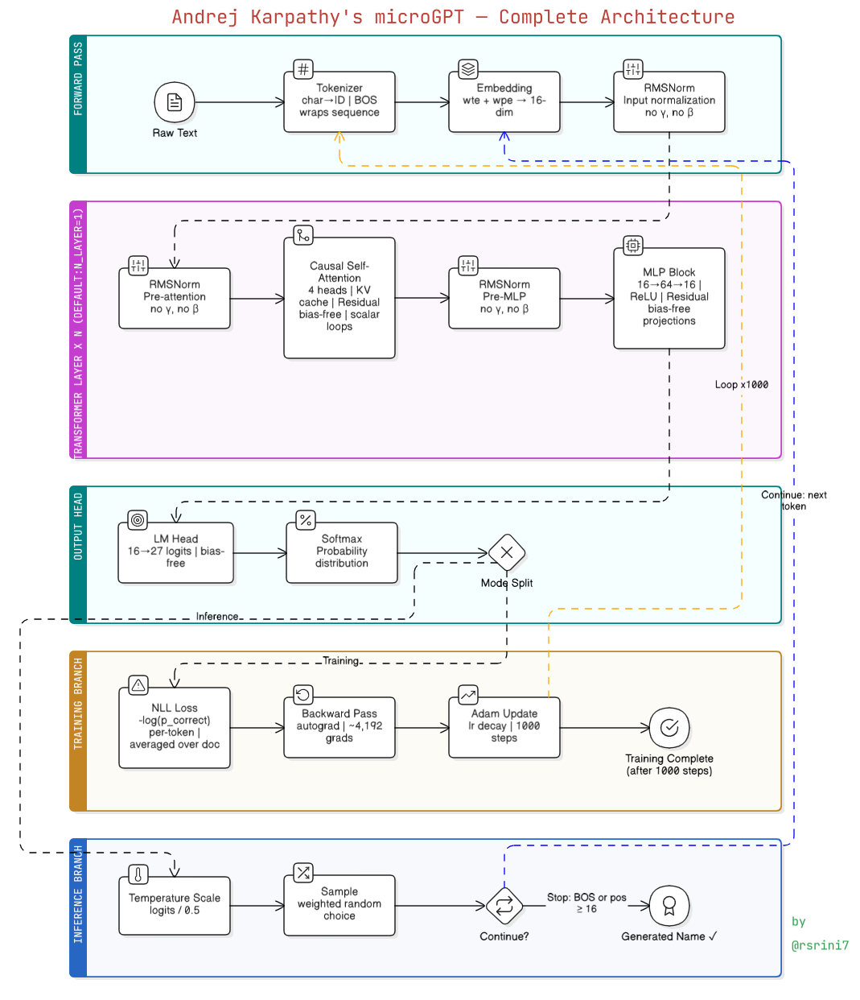

> A comprehensive walkthrough of Andrej Karpathy's **microGPT**: the "most atomic" GPT implementation using **pure Python and math only** — no PyTorch, no NumPy, no GPU.

---

## High-Level Overview

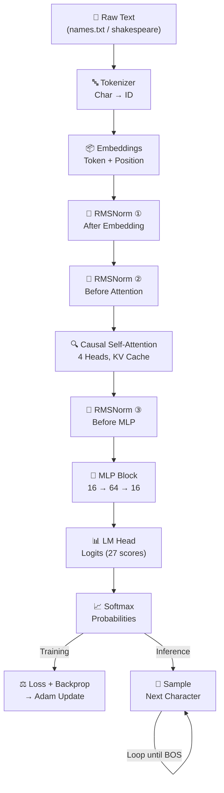

---

## 1. Data Loading and Preprocessing

The script begins by ensuring `input.txt` exists, defaulting to a dataset of names. Each line (name) is treated as an individual **document** and shuffled so the model learns character patterns — not a fixed ordering.

```python
if not os.path.exists('input.txt'):
    # downloads names.txt ...
docs = [l.strip() for l in open('input.txt').read().strip().split('\n') if l.strip()]
random.shuffle(docs)
```

---

## 2. The Tokenizer — Text to Numbers

This is not a fancy library tokenizer. It finds every unique **character** in the text and uses that as the vocabulary.

```python
uchars = sorted(set(''.join(docs)))
BOS = len(uchars)   # Beginning of Sequence token (also acts as End-of-Sequence)
vocab_size = len(uchars) + 1
```

A special **BOS** token is added — it serves as both the start signal during generation and the stop signal when it's sampled as output.

**Example:**

```
"emma" → [BOS, e, m, m, a, BOS] → [26, 4, 12, 12, 0, 26]
```

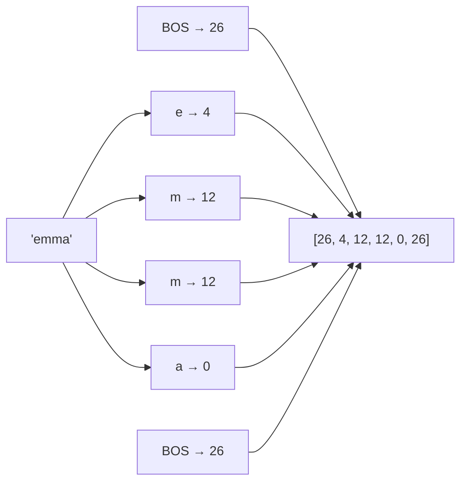

---

## 3. Embeddings — Numbers to Meaningful Vectors

Each token ID gets two 16-dimensional vectors that are **added together** to form one input vector:

| Embedding | Weight Matrix | Encodes |
|-----------|--------------|---------|
| **Token Embedding (wte)** | `state_dict['wte'][token_id]` | *What* this character is |
| **Position Embedding (wpe)** | `state_dict['wpe'][pos_id]` | *Where* this character sits in the sequence |

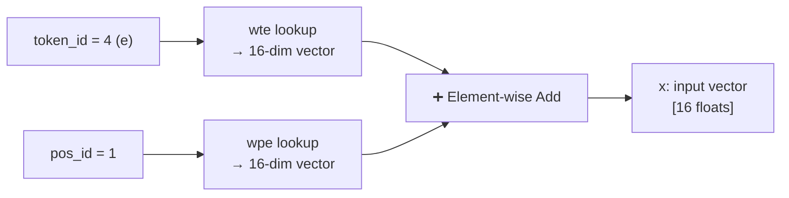

**`wte` — Token Embedding Table**

It encodes **"What"** — the identity of the character itself. Each character in the vocabulary gets its own unique 16-dimensional vector. So `"e"` always starts with the same base vector regardless of where it appears in a word. It's looked up by `token_id`.

```python
tok_emb = state_dict['wte'][token_id]  # "who is this character?"
```

**`wpe` — Position Embedding Table**

It encodes **"Where"** — the position of the character in the sequence. Position 0 has its own 16-dim vector, position 1 has another, and so on up to `block_size`. This tells the model *where* in the sequence the current character sits.

```python
pos_emb = state_dict['wpe'][pos_id]   # "where in the sequence?"
```

**Together:**

```python
x = [t + p for t, p in zip(tok_emb, pos_emb)]
```

They are **element-wise added** to produce one combined 16-dim vector that carries both pieces of information — *identity + position* — before being passed into the Transformer. Without `wpe`, the model would treat `"e"` at position 1 the same as `"e"` at position 5, losing all sense of word structure.

---

## 4. RMSNorm — Stabilize the Numbers

microGPT uses a **pre-norm Transformer design**: RMSNorm is applied before each sublayer (attention and MLP) inside each Transformer block, plus once at input after the combined embedding. This keeps values in a stable range and prevents exploding/vanishing gradients.

```python
x = rmsnorm(x)            # at input — after embedding, before the layer block
# inside each layer:
x = rmsnorm(x)            # before attention sublayer
x = rmsnorm(x)            # before MLP sublayer
```

**Formula:** `x / sqrt(mean(x²) + ε)`

> **Important:** This RMSNorm has **no learnable parameters** — no scale (γ) or shift (β). Unlike LayerNorm, it is purely a normalization operation with nothing added to `state_dict`.

---

## 5. The Autograd Engine — `Value` Class

`Value` is the minimal building block that replaces PyTorch's entire autograd system. Every scalar number in the model — **both weights and intermediate activations** — is wrapped in a `Value` object. Each `Value` stores three things: its scalar data, its gradient (`.grad`), and **links to its parent nodes** (`children` and `local_grads`) so the computation graph can be traversed.

```python
class Value:
    def __init__(self, data, children=(), local_grads=()):
        self.data = data       # the scalar value
        self.grad = 0          # gradient accumulates here during backward()
        self._children = children       # parent nodes in the graph
        self._local_grads = local_grads # local derivative w.r.t. each parent
    def backward(self):
        # reverse topological sort + chain rule
```

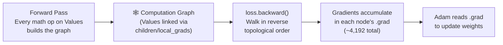

- **Forward pass**: every math operation (`+`, `*`, `log`, etc.) records its inputs as `children` and stores the local derivative as `local_grads`, building the graph automatically.
- **Backward pass**: `loss.backward()` performs a **reverse topological sort** of the entire graph and walks it in reverse, applying the **chain rule** at each node. The gradient of the loss with respect to each parameter **accumulates in `.grad`**.
- **Adam then reads `.grad`** from every parameter `Value` to perform the weight update — this is the bridge between autograd and the optimizer.

---

## 6. Parameter Initialization

Before the model can run, all learnable weight matrices must be created and stored in a `state_dict` dictionary. There are **four core model size hyperparameters** that together determine total model capacity:

| Hyperparameter | Value | Controls |
|---|---|---|
| `n_embd` | 16 | Width of every vector representation |
| `n_head` | 4 | Number of attention heads |
| `n_layer` | 1 | Depth — how many Transformer blocks |
| `block_size` | 10 | **Maximum sequence length** the model trains on at once |

**`block_size` deserves special attention.** Each document is one line from `input.txt`. If lines are very short (like names: 3–8 characters), `block_size` rarely becomes a limiting factor — the whole name fits within it easily. But if lines are long (like Shakespeare passages), `block_size` controls how much of the line the model can see as context at any one position. A small `block_size` means the model only ever sees a short window, which is a direct reason it **cannot learn long-range patterns** — it never has access to context from far back in the sequence. This is explicitly why the Shakespeare experiment produces words and local formatting but lacks real structural memory.

Every matrix is seeded with small random numbers via a helper `matrix()` function that returns a 2D list of `Value` objects.

```python
n_embd   = 16   # embedding dimension
n_head   = 4    # attention heads
n_layer  = 1    # transformer layers
block_size = 10 # max sequence length

state_dict = {
    'wte': matrix(vocab_size, n_embd),   # token embedding table
    'wpe': matrix(block_size, n_embd),   # position embedding table
}
for i in range(n_layer):
    state_dict[f'layer{i}.attn_wq'] = matrix(n_embd, n_embd)  # Query projection
    state_dict[f'layer{i}.attn_wk'] = matrix(n_embd, n_embd)  # Key projection
    state_dict[f'layer{i}.attn_wv'] = matrix(n_embd, n_embd)  # Value projection
    state_dict[f'layer{i}.attn_wo'] = matrix(n_embd, n_embd)  # Output projection
    state_dict[f'layer{i}.mlp_fc1'] = matrix(n_embd, n_embd * 4)  # MLP expand
    state_dict[f'layer{i}.mlp_fc2'] = matrix(n_embd * 4, n_embd)  # MLP contract
state_dict['lm_head'] = matrix(n_embd, vocab_size)             # final classifier
```

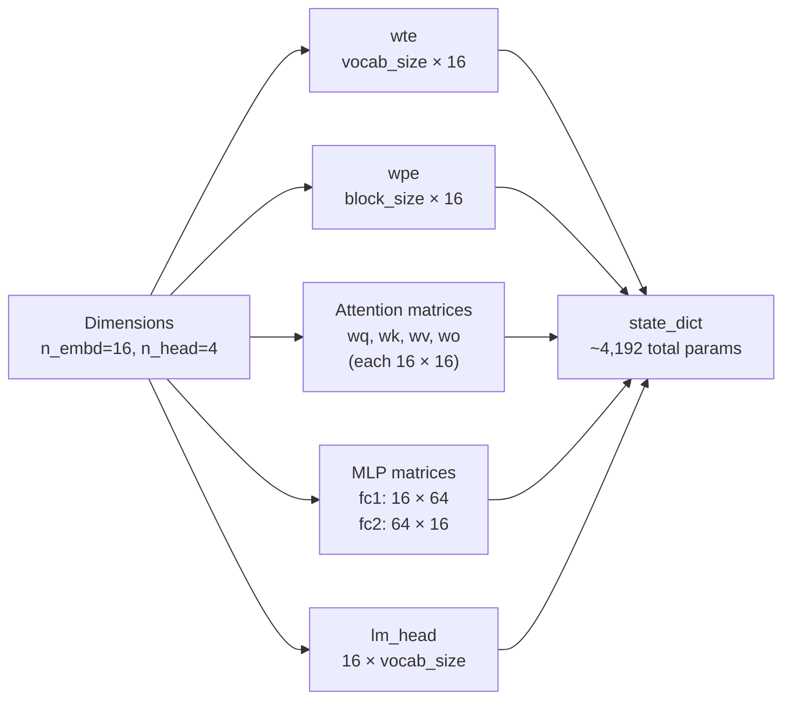

> **All matrices are bias-free.** Every linear projection in this model computes only `Wx` — there is no `+ b` term anywhere. The `params` list flattens all `Value` objects from `state_dict` for the optimizer to iterate over.

---

## 7. Model Architecture — `gpt()` Function

The `gpt` function is the Transformer. It processes **one token at a time** — there is no batching, no batch dimension, no parallel sequence processing. This single-token-at-a-time design is exactly why causality is structural: the KV cache simply hasn't seen future tokens yet when the current one is processed.

> **All linear projections (Q, K, V, attn_wo, mlp_fc1, mlp_fc2, lm_head) are bias-free** — the `linear()` function computes only `Wx`, never `Wx + b`. This matches modern GPT design.

```python
def gpt(token_id, pos_id, keys, values):
    tok_emb = state_dict['wte'][token_id]
    pos_emb = state_dict['wpe'][pos_id]
    x = [t + p for t, p in zip(tok_emb, pos_emb)]
    x = rmsnorm(x)
    # ... Attention and MLP blocks ...
```

### 7a. Causal Self-Attention

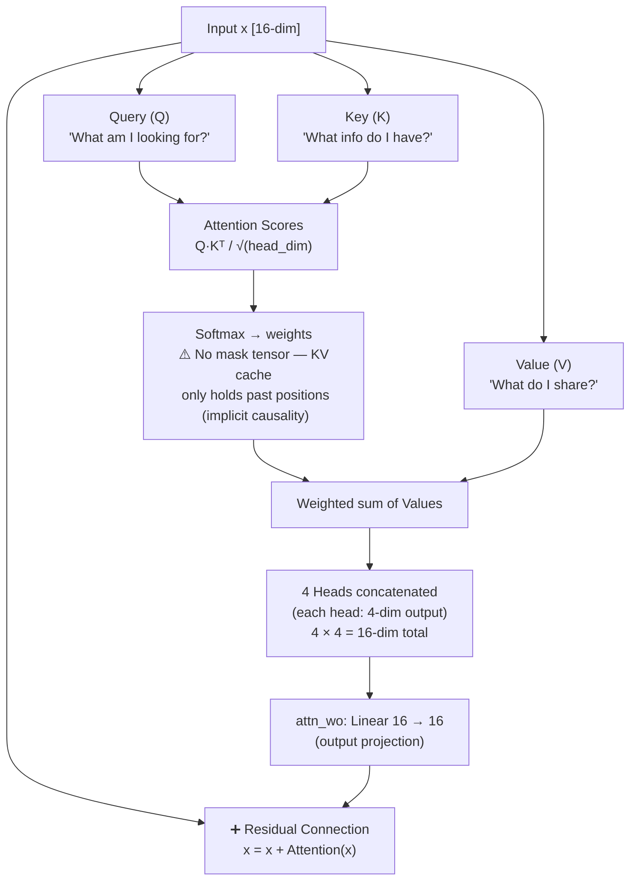

**Key insight on causality:** There is no explicit masking matrix. Causality is enforced *structurally* — at position 5, the KV cache only contains entries from positions 0–4 because they haven't been processed yet.

```python
keys[li].append(k)
values[li].append(v)
# Scores are only computed over the keys seen so far
attn_logits = [sum(q_h[j] * k_h[t][j] for j in range(head_dim))
               for t in range(len(keys[li]))]
```

**Head dimension arithmetic:** `head_dim = n_embd // n_head = 16 // 4 = 4`. Each of the 4 heads independently attends over its own 4-dimensional slice of Q, K, V. Their outputs are concatenated back to 16 dims, then passed through `attn_wo` (a 16×16 linear projection) before the residual add.

**Implementation note:** There are no tensor `matmul` operations. Attention scores are computed via explicit Python loops over scalars: `sum(q_h[j] * k_h[t][j] for j in range(head_dim))`. Everything is scalar arithmetic on `Value` objects.

### 7b. MLP Block

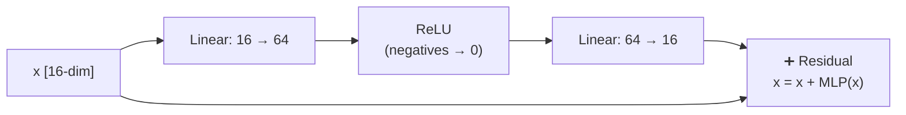

The expansion to 64 dimensions gives the model more "room to think" before compressing back.

---

## 8. LM Head + Softmax — Scores to Probabilities

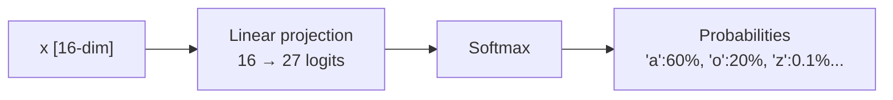

The 27 scores (one per character in the vocabulary) are converted to a probability distribution that sums to 100%.

---

## 9. Training Loop — Learning from Mistakes

**Task:** Next Token Prediction. If the model sees `"J"`, it tries to predict `"e"` for `"Jeffrey"`.

On each training step, one document (one line) is picked from `docs`. It is tokenized as `[BOS] + characters + [BOS]`. The number of positions actually trained is:

```python
n = min(block_size, len(doc_tokens) - 1)
```

This caps training at `block_size` even if the document is longer, and subtracts 1 because next-token prediction needs a target at `t+1` for every input at `t`. After the forward pass, loss is averaged across all positions in that document, gradients are computed, Adam updates the weights, and gradients are reset to zero before the next document.

```python
losses = []
for pos_id in range(n):
    token_id, target_id = tokens[pos_id], tokens[pos_id + 1]  # current → next
    logits = gpt(token_id, pos_id, keys, values)
    probs = softmax(logits)
    loss_t = -probs[target_id].log()   # .log() is autograd-aware: defined on the Value class
    losses.append(loss_t)
loss = (1 / n) * sum(losses)           # per-token loss averaged across the document slice
```

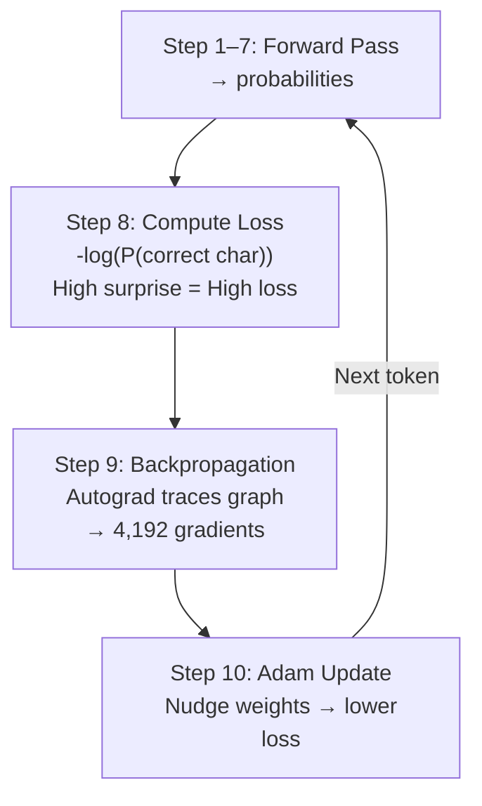

**Loss intuition:** If the model predicts the correct next character with low confidence → loss is **high**. Perfect confidence → loss approaches **0**.

---

## 10. The Adam Optimizer

```python
lr_t = learning_rate * (1 - step / num_steps)  # linear decay
for i, p in enumerate(params):
    m[i] = beta1 * m[i] + (1 - beta1) * p.grad        # 1st moment (mean)
    v[i] = beta2 * v[i] + (1 - beta2) * p.grad ** 2   # 2nd moment (variance)
    m_hat = m[i] / (1 - beta1 ** (step + 1))           # bias correction
    v_hat = v[i] / (1 - beta2 ** (step + 1))           # bias correction
    p.data -= lr_t * m_hat / (v_hat ** 0.5 + eps_adam) # weight update
    p.grad = 0                                          # zero out gradient
```

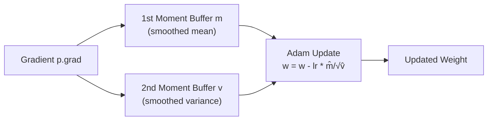

The moment buffers act as **memory** for training — they smooth out updates so learning doesn't wobble, ensuring convergence.

- **Learning rate** starts at `0.01` and follows **linear decay** to 0: `lr_t = 0.01 × (1 − step/1000)`. Gradient is zeroed after each update (`p.grad = 0`) since the `Value` engine accumulates.

---

## 11. Inference — Generating New Names

```python
temperature = 0.5  # controls randomness: low = conservative, high = creative
for pos_id in range(block_size):
    logits = gpt(token_id, pos_id, keys, values)
    probs = softmax([l / temperature for l in logits])  # temperature applied to logits BEFORE softmax
    token_id = random.choices(range(vocab_size), weights=[p.data for p in probs])[0]
    if token_id == BOS:
        break  # Stop if it predicts the end
```

> **Note on temperature:** dividing logits by a value < 1 *sharpens* the distribution (more confident), while > 1 *flattens* it (more random). The source uses `temperature = 0.5` by default.

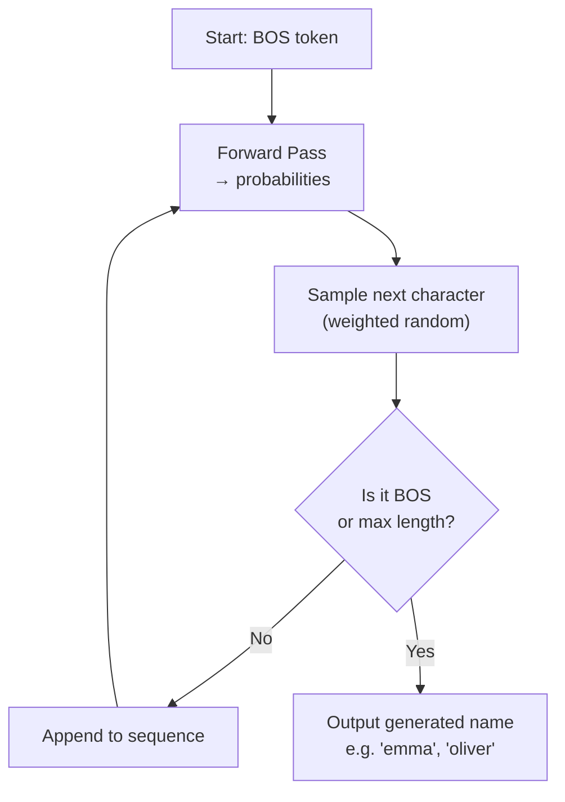

Inference is identical to the forward pass during training — but **no loss is calculated and no weights are updated**. The model "babbles" by feeding its own output back in as the next input (autoregressive generation).

---

## 12. Full Training Pipeline — End to End

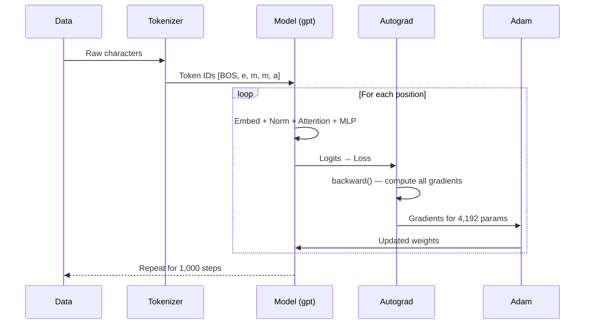

---

## 13. Model Capacity & Experiments

| Experiment | Result |
|---|---|
| **1,000 steps on names** | Learns basic name structures — common endings, typical lengths |
| **10,000 steps on names** | No clear improvement over 1,000 steps — the task is simple enough that the model saturates quickly |
| **Shakespeare (small model)** | Produces basic short words, punctuation, and line breaks, but not real Shakespeare |

**What the Shakespeare model learns vs misses:**

It picks up **surface patterns** — common short words ("the", "me", "and"), punctuation placement, and line break frequency. What it completely misses is **deeper structure**: multi-line continuity, rhythmic meter, long-range phrasing, and dramatic coherence. There are three compounding reasons for this:

1. **`block_size = 10`** — the model never sees more than 10 characters at once, so long-range context is structurally inaccessible
2. **Each line is treated as a separate document** — the model has no continuity between lines; every line is an isolated training example, so it never learns cross-line patterns
3. **Tiny capacity** — 1 layer, 16-dim embeddings, ~4,192 parameters total is far too small to internalize Shakespeare's vocabulary and structure

> **Scaling note:** Larger GPTs increase `n_layer`, `n_embd`, `block_size`, and `vocab_size` — but the core algorithm here is **identical**. Everything else is just efficiency.

---

## 14. Key Design Principle

> The entire architecture runs on **pure Python scalars**. Every number is wrapped in a custom `Value` object that tracks both its value and its gradient, building a computation graph that enables learning via the chain rule.

```
Characters get personalities (embeddings)
    → talk to each other (attention)
    → think deeply (MLP)
    → predict what comes next (LM head + softmax)
    → learn from mistakes (loss + backprop + Adam)
    → repeat
```

---

*Based on Andrej Karpathy's microGPT implementation.*

**Related:**
- [Auto-Regression](../training/Auto-Regression.md) — microGPT's inference loop is autoregressive generation; this doc explains that mechanism and its speed-quality tradeoffs.
