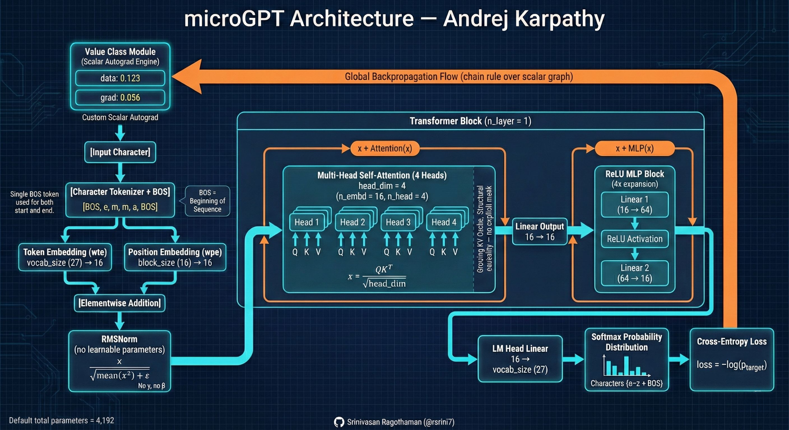

# microGPT Architecture — Diagram Explanation



This diagram visualizes the complete microGPT model — a minimal, dependency-free implementation of a GPT-style Transformer. It shows how data flows forward to produce predictions and how gradients flow backward to update parameters.

We’ll walk through it from **top to bottom (forward pass)** and then explain the **backpropagation flow**.

---

# 1️ Scalar Autograd Engine (Top Section)

At the very top is the **Value Class Module**.

This is microGPT’s custom scalar automatic differentiation engine.

Each number in the model is wrapped in a `Value` object that stores:

* `data` → the numerical value
* `grad` → the gradient (∂loss/∂value)

Unlike PyTorch tensors, microGPT operates on **pure Python scalars**.
Every multiplication, addition, and activation builds a computation graph.

When training finishes a forward pass, gradients are computed using:

> Chain rule over a scalar computation graph

This is what the orange “Global Backpropagation Flow” arrow represents.

---

# 2️ Input and Tokenization

The model begins with a single character input.

Example shown:

```
[BOS, e, m, m, a, BOS]
```

Important details:

* The model uses **character-level tokenization**
* There is a single special token: **BOS**
* BOS is used for both beginning and end of sequence
* Vocabulary size ≈ 27 (a–z + BOS)

Each character is converted into an integer token ID.

---

# 3️ Embeddings

Two embeddings are learned:

### Token Embedding (wte)

Maps each character ID to a 16-dimensional vector.

Shape:

```
vocab_size (27) × 16
```

### Position Embedding (wpe)

Adds positional information (since Transformers have no recurrence).

Shape:

```
block_size (16) × 16
```

Both embeddings produce 16-dimensional vectors, which are:

> Added elementwise

This produces the initial representation for each token.

---

# 4️ RMSNorm (Normalization)

Before entering the Transformer block, the representation is normalized using **RMSNorm**:

[
x \leftarrow \frac{x}{\sqrt{\text{mean}(x^2)} + \epsilon}
]

Important differences from GPT-2:

* No mean subtraction
* No learnable scale (γ)
* No bias (β)

This keeps the model minimal and dependency-free.

---

# 5️ Transformer Block (n_layer = 1)

microGPT uses **one Transformer block** by default.

Each block has two sublayers:

---

## 5A️ Multi-Head Self-Attention

There are:

* 4 heads
* head_dim = 4
* n_embd = 16

Each head computes:

[
\text{Attention}(x) = \text{softmax}\left(\frac{QK^T}{\sqrt{\text{head_dim}}}\right)V
]

### Key details:

* Q, K, V are linear projections of the input
* No bias terms
* Causality is enforced structurally

Instead of using a mask matrix, microGPT:

* Processes tokens sequentially
* Stores previous keys and values in a **growing KV cache**

This ensures tokens only attend to past tokens.

After all heads:

* Outputs are concatenated
* A linear projection maps 16 → 16

Then comes the first residual connection:

[
x \leftarrow x + \text{Attention}(x)
]

---

## 5B️ MLP Block (Feedforward Network)

This is the second sublayer.

Structure:

```
Linear 1: 16 → 64
ReLU activation
Linear 2: 64 → 16
```

Expansion ratio: 4×

Important:

* Uses **ReLU**, not GeLU
* No bias terms

Then second residual connection:

[
x \leftarrow x + \text{MLP}(x)
]

---

# 6️ LM Head

After the Transformer block:

A final linear layer maps:

```
16 → vocab_size (27)
```

This produces **logits** — one score per character.

---

# 7️ Softmax & Cross-Entropy Loss

Softmax converts logits into probabilities:

[
p = \text{softmax}(logits)
]

Then training uses:

[
\text{loss} = -\log(p_{\text{target}})
]

This measures how wrong the model’s prediction was.

---

# 8️ Backpropagation (Orange Arrow)

The orange arrow shows gradients flowing backward through:

* Cross-entropy
* Softmax
* LM Head
* MLP
* Attention
* RMSNorm
* Embeddings
* Back to the Value objects

Because every scalar is tracked in a computation graph, gradients are computed using the **chain rule**.

Finally:

* Adam optimizer updates each parameter
* Gradients are reset
* Training repeats

---

# 🔑 What This Diagram Demonstrates

This diagram captures the **five irreducible ideas of GPT**:

1. Embed tokens
2. Attend (scaled dot-product)
3. Transform (MLP)
4. Predict (softmax + cross-entropy)
5. Learn (backprop + Adam)

Everything in large modern LLMs is built from these same core components — just scaled and optimized.

---

# 🧠 Why microGPT Matters

* No PyTorch
* No NumPy
* No GPU
* No tensor libraries

Just pure Python and scalar math.

It proves:

> The Transformer algorithm itself is small.
> Engineering scale is what makes modern LLMs complex.


---

# microGPT — A Beginner-Friendly Analogy

Imagine you're teaching a child to **invent new names**.

They don’t memorize entire names.

Instead, they learn:

* What letters usually follow other letters
* Where letters typically appear in a word
* How letters influence each other

That’s exactly what microGPT does.

Now let’s map the diagram to a simple story.

---

# 🧱 Step 1: Every Letter Gets a Personality Card (Embeddings)

Imagine each letter — **a, b, c, …** — gets a little card describing its personality.

For example:

* “a” might like vowels
* “m” might often sit in the middle
* “z” is rare and usually near the end

These personality cards are numbers (16 numbers per letter).

This is called:

> **Token Embedding**

Then we add another card:

> “Where are you in the word?”

That’s the **Position Embedding**.

So each letter knows:

* Who it is
* Where it is

These two cards are added together.

---

# 🧼 Step 2: Normalize (RMSNorm)

Before the letters talk to each other, we make sure no one is shouting too loudly.

RMSNorm simply says:

> “Let’s scale everyone so they’re on the same volume level.”

No fancy adjustments. No learnable knobs. Just balance.

---

# 👂 Step 3: Letters Talk to Each Other (Attention)

Now comes the interesting part.

Each letter looks at the letters before it and asks:

> “Who should I pay attention to?”

For example:

In “emma”
When predicting the last “a”:

* It looks at “e”
* It looks at “m”
* It looks at the previous “m”

Each letter creates:

* A **Query** → “What am I looking for?”
* A **Key** → “What do I offer?”
* A **Value** → “What information do I provide?”

Then it calculates:

> Who is most relevant right now?

This is called **Self-Attention**.

microGPT splits this into 4 small “attention heads” so the letter can look at patterns from multiple perspectives.

After listening to others, it updates itself:

> New letter state = old state + attention result

That “+” is the **residual connection**.

Think of it like:

> “I’ll keep my identity, but I’ll add what I learned.”

---

# 🧠 Step 4: Think Deeper (MLP)

After listening to others, each letter goes into a small thinking room.

Inside:

1. It expands its thinking (16 → 64 numbers)
2. Applies a simple rule (ReLU)
3. Compresses back (64 → 16)

This is like:

> “Let me process everything I just heard.”

Then again:

> Keep old self + new thinking

Another residual connection.

---

# 🎯 Step 5: Make a Prediction

Now the letter must guess:

> What letter comes next?

The LM Head converts the 16-number personality into:

* 27 scores (one per possible character)

Softmax turns those into probabilities.

Example:

* a → 60%
* o → 20%
* z → 0.1%

---

# ❌ Step 6: Measure How Wrong It Was

If the correct answer was “a”:

Loss = –log(probability of “a”)

If it predicted correctly with high confidence:

* Small loss

If it guessed badly:

* Big loss

---

# 🔁 Step 7: Learn From Mistakes (Backpropagation)

Now comes the orange arrow in the diagram.

The mistake signal travels backward through:

* LM Head
* MLP
* Attention
* Embeddings
* All the way to every number

Every tiny number asks:

> “How much was I responsible for that mistake?”

Then the optimizer (Adam) slightly adjusts them.

Tiny improvements.
Repeated 1000 times.

That’s learning.

---

# 🧩 What Makes microGPT Special

Most modern AI systems hide all this inside giant tensor libraries.

microGPT does everything with:

* Simple Python numbers
* A tiny custom autograd engine
* No external libraries

It proves:

> The core idea of GPT is surprisingly small.

The complexity in large models comes from scale — not from the fundamental algorithm.

---

# 🧠 In One Sentence

microGPT is like teaching letters to:

* Understand themselves
* Listen to each other
* Think
* Guess what comes next
* Learn from mistakes

All using nothing but simple math.

**Related:**
- [inside-a-neuron](../attention/inside-a-neuron.md) — Same beginner-friendly pedagogical style; this covers the single-neuron building block before tackling microGPT's Transformer composition.
