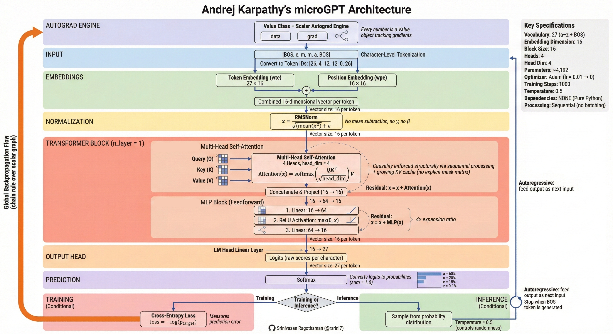

# microGPT Architecture - Step-by-Step Flow in Plain English

**Below is the complete architecture flow of microGPT:**

## **Forward Pass (Making Predictions)**

### Step 1: **Tokenizer - Text to Numbers**
- Takes your input text (like "emma")
- Converts each character into a number ID
- Adds a special BOS (Begin/End of Sequence) token at the start and end
- Example: "emma" becomes [BOS, e, m, m, a, BOS] → [26, 4, 12, 12, 0, 26]

### Step 2: **Embeddings - Numbers to Meaningful Vectors**
- **Token Embedding (wte)**: Looks up each character ID and gets a 16-number vector that represents "what this character is"
- **Position Embedding (wpe)**: Gets another 16-number vector that represents "where this character sits in the sequence"
- **Combines them**: Adds the two vectors together element-by-element to create one input vector per character

### Step 3: **RMSNorm - Stabilize the Numbers**
- Normalizes the input vector to keep values in a stable range
- Prevents numbers from getting too large or too small during calculations
- Formula: divides the vector by sqrt(mean(x²) + epsilon)

### Step 4: **Attention Layer - Letters Talk to Each Other**
- Creates 3 vectors for each token:
  - **Query (Q)**: "What am I looking for?"
  - **Key (K)**: "What information do I have?"
  - **Value (V)**: "What do I want to share?"
- Uses 4 parallel "heads" (each head focuses on different patterns)
- Each position can only look at previous positions (causality enforced structurally via sequential processing and a growing KV cache — no explicit mask matrix)
- Calculates attention scores to decide which previous characters are most relevant
- Combines relevant information from past characters
- **Residual connection**: Adds the previous representation back (x = x + Attention(x))

### Step 5: **MLP Block - Deep Thinking**
- Expands the 16-dimensional vector to 64 dimensions (more room to think)
- Applies ReLU activation (sets negative numbers to zero)
- Compresses back down to 16 dimensions
- **Residual connection**: Adds the previous representation back (x = x + MLP(x))

### Step 6: **LM Head - Turn Thoughts into Character Scores**
- Projects the 16-dimensional vector into 27 raw scores (one for each possible character)
- These raw scores are called "logits"

### Step 7: **Softmax - Scores to Probabilities**
- Converts the 27 logits into probabilities that sum to 100%
- Example: 'a' might get 60%, 'o' might get 20%, 'z' might get 0.1%

---

## **Training Mode - Learning from Mistakes**

### Step 8: **Calculate Loss**
- Compares the predicted probabilities to the correct answer
- Uses Negative Log Likelihood: higher loss = model was more surprised by the correct answer
- Formula: loss = -log(probability of correct character)

### Step 9: **Backpropagation - Figure Out What Went Wrong**
- The custom Autograd engine traces back through every calculation
- For each of the ~4,192 parameters, it calculates: "How much did you contribute to the mistake?"
- This creates gradients (directions to improve)

### Step 10: **Update Parameters with Adam Optimizer**
- Adjusts all 4,192 parameters slightly in the direction that reduces loss
- Learning rate starts at 0.01 and gradually decays to zero
- Repeat Steps 1-10 for 1000 training steps (default)

---

## **Inference Mode - Generating New Text**

### Step 11: **Autoregressive Generation Loop**
1. Start with just the BOS token
2. Run forward pass (Steps 1-7) to get probabilities for next character
3. **Sample** a character from the probability distribution (with temperature control for randomness)
4. Add that character to your sequence
5. Repeat until BOS token is generated again (signals "I'm done")
6. Output: A newly generated name like "emma" or "oliver"

---

## **Key Principle**

The entire architecture runs on **pure Python scalars** - no NumPy, no PyTorch, no GPU. Every single number is wrapped in a custom `Value` object that tracks both its value and its gradient, building a computation graph that enables learning through the chain rule.

**In essence**: Characters get personalities → talk to each other → think deeply → predict what comes next → learn from mistakes → repeat.

**Related:**
- [Auto-Regression](../training/Auto-Regression.md) — Explains the autoregressive generation (Step 11 here) and decode-loop bottleneck that this flow's inference loop demonstrates.
