# microGPT — Consolidated Technical Deep Dive
> *"New art project. Train and inference GPT in 243 lines of pure, dependency-free Python. This is the full algorithmic content... I cannot simplify this any further. This file is the complete algorithm. Everything else is just efficiency."*  
> — Andrej Karpathy, [X Post, February 2026](https://x.com/karpathy/status/2021694437152157847) · [GitHub Gist](https://gist.github.com/karpathy/8627fe009c40f57531cb18360106ce95) ¹

**Public release:** February 2026 (Gist and mirror published)  
**Canonical sources:** [GitHub Gist](https://gist.github.com/karpathy/8627fe009c40f57531cb18360106ce95) ¹ · [karpathy.ai/microgpt.html](https://karpathy.ai/microgpt.html) ²  
**Author:** Andrej Karpathy — founder of [Eureka Labs](https://karpathy.ai) ⁹ (announced 2024)

> **Pedagogical framing:** microGPT deliberately omits all engineering optimizations. It is a teaching artifact, not a production system. Performance, vectorization, and scalability are explicitly out of scope.

---

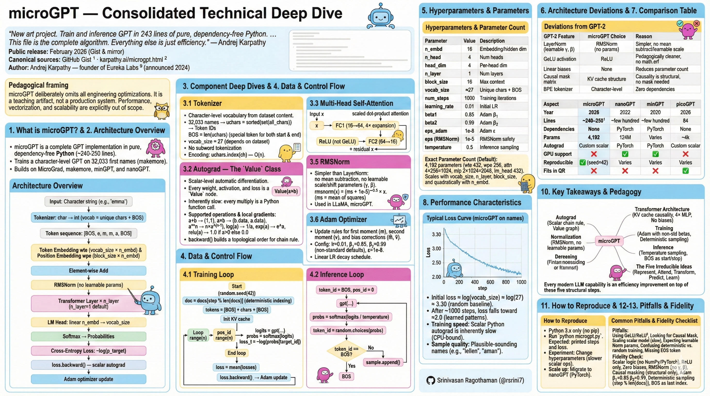

---


---

---
## Table of Contents
1. [What is microGPT?](#1-what-is-microgpt)
2. [Architecture Overview](#2-architecture-overview)
3. [Component Deep Dives](#3-component-deep-dives)
4. [Data & Control Flow](#4-data--control-flow)
5. [Hyperparameters & Parameter Count](#5-hyperparameters--parameter-count)
6. [Architecture Deviations from GPT-2](#6-architecture-deviations-from-gpt-2)
7. [Comparison Table](#7-comparison-table)
8. [Performance Characteristics](#8-performance-characteristics)
9. [Community Ports & Extensions](#9-community-ports--extensions)
10. [Key Takeaways & Pedagogy](#10-key-takeaways--pedagogy)
11. [How to Reproduce](#11-how-to-reproduce)
12. [Common Pitfalls](#12-common-pitfalls)
13. [Fidelity Checklist](#13-fidelity-checklist)
14. [Technical FAQ](#14-technical-faq)
15. [Quick Reference](#15-quick-reference)
16. [References](#16-references)

---

## 1. What is microGPT?

microGPT is a complete GPT training and inference implementation in pure, dependency-free Python — no PyTorch, no NumPy, no external libraries beyond the standard `os`, `math`, and `random` modules. The file spans approximately **240–250 lines** (exact count varies by whitespace in the current Gist revision) ¹ and contains every algorithmic component required to train and run a Transformer-based language model from scratch.

It trains a character-level GPT on `input.txt`, which is automatically downloaded from the `names.txt` dataset in the [karpathy/makemore](https://github.com/karpathy/makemore) repository — **32,033 first names**, one per line. The model learns to generate plausible-sounding new names character by character.

It builds directly on Karpathy's lineage of educational projects: MicroGrad (scalar autograd, ~150 lines), makemore (character LMs), minGPT and nanoGPT (PyTorch GPT implementations). microGPT is the synthesis — bringing everything together with zero dependencies.

---

## 2. Architecture Overview

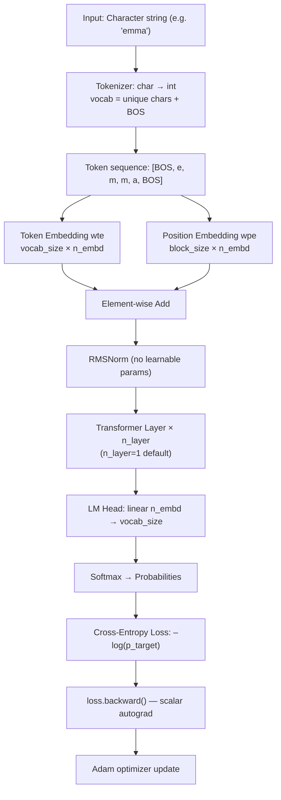

---

## 3. Component Deep Dives

### 3.1 Tokenizer

Character-level vocabulary built entirely from dataset content:

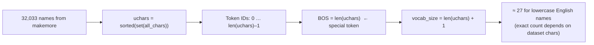

- No subword tokenization — purely character level
- Single special token: BOS, used as both Beginning and End of Sequence
- Encoding: `uchars.index(ch)` — O(n) but adequate at this scale
- `vocab_size` is dataset-dependent; approximately 27 for lowercase English first-names but may vary if the dataset includes punctuation or mixed case ¹

---

### 3.2 Autograd — The `Value` Class

The entire computational engine is built on **scalar-level** automatic differentiation. This mirrors the scalar autograd pattern introduced in MicroGrad, but is implemented independently here — every single weight, activation, and loss is a `Value` node. This makes the math completely transparent but is inherently slow: every multiply is a Python function call creating a new object.

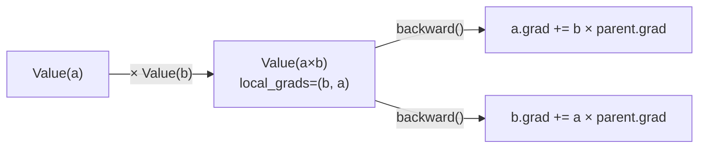

**Supported operations and their local gradients:**

| Operation | Forward value | Local gradient(s) |
|-----------|--------------|-------------------|
| `a + b` | `a + b` | `(1, 1)` |
| `a * b` | `a × b` | `(b.data, a.data)` |
| `a ** n` | `aⁿ` | `n × a^(n-1)` |
| `log(a)` | `ln(a)` | `1 / a` |
| `exp(a)` | `eᵃ` | `eᵃ` |
| `relu(a)` | `max(0, a)` | `1.0 if a > 0 else 0.0` |

The `backward()` method builds a topological ordering of the graph and applies the chain rule in reverse:

```python
def backward(self):
    topo, visited = [], set()
    def build_topo(v):
        if v not in visited:
            visited.add(v)
            for child in v._children: build_topo(child)
            topo.append(v)
    build_topo(self)
    self.grad = 1
    for v in reversed(topo):          # loss node first
        for child, lg in zip(v._children, v._local_grads):
            child.grad += lg * v.grad  # chain rule: dL/dchild
```

---

### 3.3 Multi-Head Self-Attention

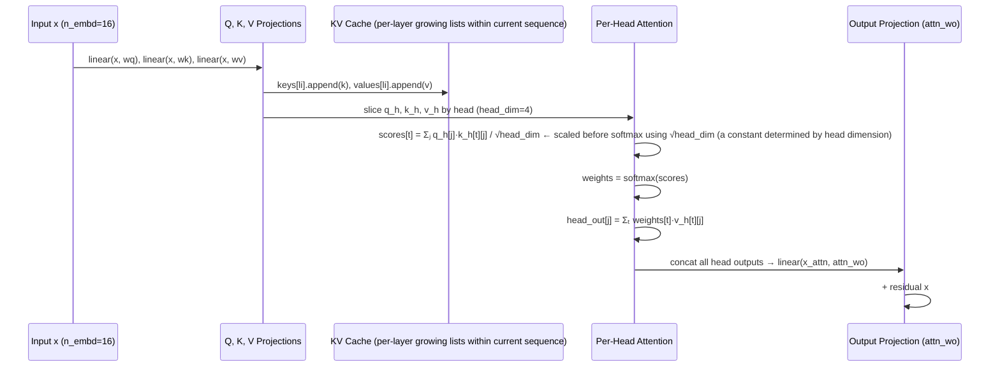

> **Causal attention without masking:** The KV "cache" here is a per-layer growing list of past keys and values within the current sequence — not a persistent cache across calls as in optimized LLM runtimes. Because tokens are processed strictly sequentially, it only ever contains tokens processed so far, making explicit causal masking unnecessary. Causality is structural, not enforced via a mask matrix ¹. This works because microGPT processes tokens strictly sequentially; a batched/vectorized implementation would require an explicit causal mask.

---

### 3.4 MLP Block

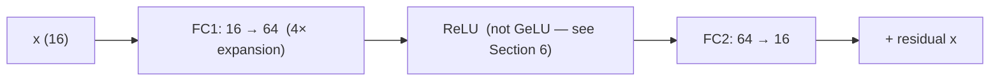

The 4× hidden-dimension expansion ratio follows GPT-2 convention ¹.

---

### 3.5 RMSNorm

Simpler and cheaper than LayerNorm — no mean subtraction, no learnable scale or shift parameters. Note: microGPT's RMSNorm has no learned scale parameter; some RMSNorm implementations (e.g., LLaMA's) include one.

```python
def rmsnorm(x):
    ms    = sum(xi * xi for xi in x) / len(x)  # mean of squares
    scale = (ms + 1e-5) ** -0.5                 # inverse RMS
    return [xi * scale for xi in x]
```

**LayerNorm vs. RMSNorm comparison:**

| Property | LayerNorm | RMSNorm (microGPT) |
|----------|-----------|---------------------|
| Mean subtraction | ✅ | ❌ |
| Learnable γ, β | ✅ | ❌ |
| Bias terms | Yes | No |
| Computational cost | Higher | Lower |
| Used in | GPT-2, BERT | LLaMA, Mistral, microGPT |

---

### 3.6 Adam Optimizer

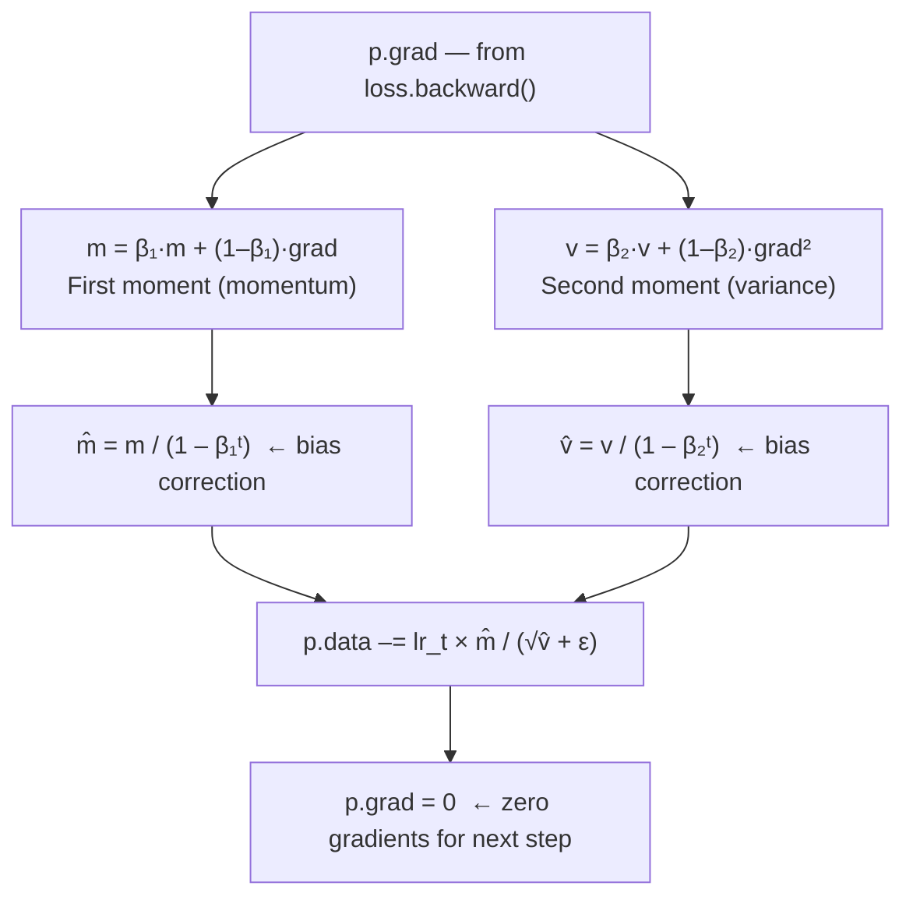

**Config:** `lr=0.01, β₁=0.85, β₂=0.99, ε=1e-8`  
**LR schedule:** linear decay → `lr_t = 0.01 × (1 – step / num_steps)`

> **Note on Adam defaults:** microGPT uses β₁=0.85 and β₂=0.99, which differ from the standard Adam defaults of 0.9/0.999. This is an intentional choice for this scale and task.

---

## 4. Data & Control Flow

### 4.1 Training Loop

> **Document sampling:** The training loop iterates deterministically over documents using modulo indexing (`docs[step % len(docs)]`) rather than random per-step sampling. The dataset is pre-shuffled once at startup via `random.shuffle(docs)`, but `random.seed(42)` is set at the top of the script — making document order **fully reproducible across runs** ¹.

> **Loss scope:** Loss is averaged over processed token positions within the current document slice — not accumulated across documents or the full dataset.

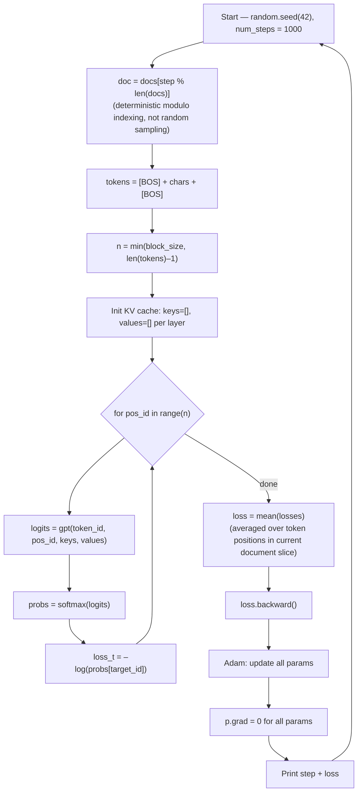

### 4.2 Inference Loop

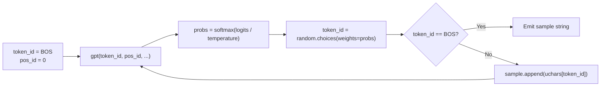

---

## 5. Hyperparameters & Parameter Count

### Hyperparameter Table

| Parameter | Value | Description |
|-----------|-------|-------------|
| `n_embd` | 16 | Embedding / hidden dimension |
| `n_head` | 4 | Number of attention heads |
| `head_dim` | 4 | Per-head dimension (`n_embd / n_head`) |
| `n_layer` | 1 | Number of Transformer layers |
| `block_size` | 16 | Maximum sequence (context) length |
| `vocab_size` | ≈27 | Unique chars + BOS (dataset-dependent) |
| `num_steps` | 1000 | Training iterations |
| `learning_rate` | 0.01 | Initial Adam LR |
| `beta1` | 0.85 | Adam β₁ (note: not the standard 0.9) |
| `beta2` | 0.99 | Adam β₂ (note: not the standard 0.999) |
| `eps_adam` | 1e-8 | Adam ε |
| `eps` (RMSNorm) | 1e-5 | Safety constant for RMSNorm division |
| `temperature` | 0.5 | Inference sampling temperature |

### Exact Parameter Count

With the default lowercase English names dataset, `vocab_size ≈ 27`, yielding **4,192 parameters** ¹. Using `vocab_size = 27`, `n_embd = 16`, `n_layer = 1`, `block_size = 16`:

| Component | Shape | Count |
|-----------|-------|-------|
| `wte` (token emb) | 27 × 16 | 432 |
| `wpe` (pos emb) | 16 × 16 | 256 |
| `attn_wq` | 16 × 16 | 256 |
| `attn_wk` | 16 × 16 | 256 |
| `attn_wv` | 16 × 16 | 256 |
| `attn_wo` | 16 × 16 | 256 |
| `mlp_fc1` | 64 × 16 | 1,024 |
| `mlp_fc2` | 16 × 64 | 1,024 |
| `lm_head` | 27 × 16 | 432 |
| **Total** | | **4,192** |

> The Gist prints `num params: 4192` at runtime under default settings. Any report of ~1,664 is a summarization error. The exact total scales linearly with `vocab_size` (wte and lm_head), linearly with `n_layer`, linearly with `block_size` (wpe), and quadratically with `n_embd` (attention and MLP weights) ¹.

---

## 6. Architecture Deviations from GPT-2

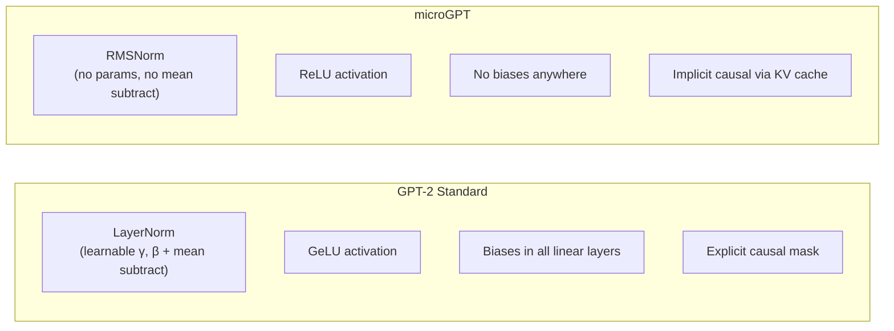

| GPT-2 Feature | microGPT Choice | Reason |
|---------------|-----------------|--------|
| LayerNorm (learnable γ, β) | RMSNorm (no params) | Simpler; eliminates mean subtraction and learnable scale/shift |
| GeLU activation | ReLU | Eliminates dependency on `math.erf`; pedagogically cleaner |
| Linear biases | None | Reduces parameter count; common in several modern decoder-only implementations |
| Causal mask matrix | KV cache structure | Causality is structural — no mask tensor needed for sequential processing |
| BPE tokenizer | Character-level | Zero dependencies; sufficient for name generation |

These choices resemble modern decoder-only architectures (e.g., LLaMA-family models) in their use of RMSNorm and bias-free linear layers, though microGPT omits RoPE, SwiGLU, and other contemporary refinements.

---

## 7. Comparison Table

| Aspect | **microGPT** | nanoGPT | minGPT | picoGPT | SNES-GPT |
|--------|-------------|---------|--------|---------|----------|
| **Year** | 2026 | 2022 | 2020 | 2026 | 2026 |
| **Lines** | ~240–250 ¹ | ~few hundred (core script) | ~few hundred (core script) | 84 | N/A |
| **Dependencies** | **None** | PyTorch | PyTorch | None | None |
| **Params (default)** | **4,192** | 124M (GPT-2 sm) | Varies | ~4k | ~4k |
| **Autograd** | Custom scalar | PyTorch | PyTorch | Custom scalar | Assembly |
| **GPU support** | ❌ | ✅ | ✅ | ❌ | ❌ |
| **Tokenizer** | Char-level | BPE | BPE/Char | Char-level | Char-level |
| **Reproducible** | ✅ (seed=42) | Varies | Varies | Varies | N/A |
| **Purpose** | Full algo, zero deps | Fast GPT-2 repro | Clean GPT study | Extreme min. | Novelty / portability |
| **Fits in QR code** | ❌ | ❌ | ❌ | ✅ | ❌ |

**Key distinctions:**
- **microGPT vs. nanoGPT:** nanoGPT is GPU-optimized and vectorized but uses PyTorch abstractions. microGPT exposes every raw scalar operation for maximum transparency.
- **microGPT vs. picoGPT:** picoGPT minifies further to 84 lines (fits in a QR code) but sacrifices readability. microGPT is the readable canonical form.
- **vs. Hugging Face Transformers (millions of LOC):** microGPT proves the algorithm is not what makes LLMs hard — scale, data, and engineering do.

---

## 8. Performance Characteristics

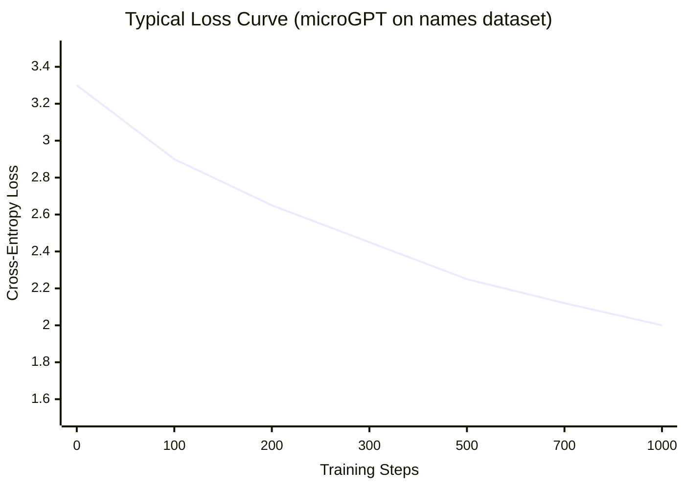

- **Initial loss ≈ log(vocab_size) ≈ log(27) ≈ 3.30** — the random baseline (uniform over 27 tokens) ¹
- **After ~1000 steps:** loss falls toward ≈2.0, reflecting learned character n-gram patterns
- **Training speed:** Scalar Python autograd is inherently slow. Wall-clock time varies significantly by CPU; scalar Python execution is the dominant bottleneck. No GPU path exists ¹.
- **Bottleneck:** Every arithmetic operation creates a Python `Value` object. Tensor frameworks batch thousands of such ops into single C++/CUDA kernel calls — that is the efficiency gap.
- **Sample quality:** Generates plausible-sounding names (e.g., `"lellen"`, `"aman"`, `"karin"`) — name-shaped strings showing learned character patterns.

---

## 9. Community Ports & Extensions

| Project | Author | Description | Link |
|---------|--------|-------------|------|
| **microGPT Visualizer** | @enescang | Interactive web app stepping through gradients and activations | [microgpt.enescang.dev](https://microgpt.enescang.dev) · [source](https://github.com/enescang/microgpt-visualizer) |
| **picoGPT** | @Kuberwastaken | Minified to 84 lines; fits inside a QR code | [github.com/Kuberwastaken/picogpt](https://github.com/Kuberwastaken/picogpt) |
| **SNES-GPT** | @vabruzzo | Full port to 65816 Assembly — runs on Super Nintendo (AI-assisted via Claude Code) | [github.com/vabruzzo/snes-gpt](https://github.com/vabruzzo/snes-gpt) |
| **C# port** | @milan_milanovic | C# from scratch, trains on names | [X post](https://x.com/milan_milanovic/status/2022049644298350988) |
| **JavaScript port** | @MathKyle | npm package (`microgptjs`); runs in browser, zero deps | `npm install microgptjs` |
| **Web Worker version** | @aneesha | Runs in browser using Web Workers | [aneesha.github.io](https://aneesha.github.io/MicroGPT-WebWorker-Version/) |
| **Rust port** | @parkinsonjamesd-PY | Rust rewrite for native speed | Gist comments |
| **Go port** | @prasad83 | Go rewrite | Gist comments |
| **karpathy.ai mirror** | Karpathy | Beautifully typeset single-page HTML version | [karpathy.ai/microgpt.html](https://karpathy.ai/microgpt.html) |

**Inspired projects:**
- **RLHF in 180 lines** (@PhilipOttesen): Tolkien-pilled RLHF extension — [Gist](https://gist.github.com/pjo256/c47cbd3eab6af765016c681c8b0df341)
- **microGPT Doc** (@DagmawiBabi): Beginner-friendly line-by-line explanation — [microgptdoc.vercel.app](https://microgptdoc.vercel.app/) · [source](https://github.com/Dagmawi-Babi/microgpt-doc)

**Notable community observations** (Gist ¹ and X²):
- *"Crazy how simple this looks now. The actual intelligence lies in the data and compute."*
- The SNES port was generated using Claude Code, demonstrating the portability of microGPT's dependency-free design.
- Discussed on [Hacker News](https://news.ycombinator.com/item?id=46998295) ³ as demystifying the "black box" of LLMs.

---

## 10. Key Takeaways & Pedagogy

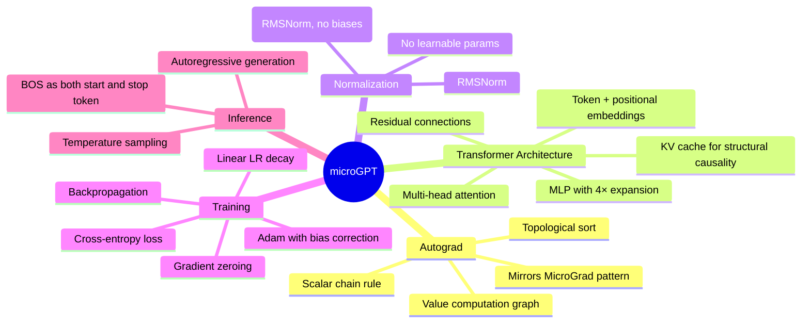

### The Five Irreducible Ideas

microGPT demonstrates that every GPT reduces to exactly five operations:

1. **Represent** — tokens as dense learned vectors (embeddings)
2. **Attend** — tokens communicate via scaled dot-product attention
3. **Transform** — MLP refines each position's representation non-linearly
4. **Predict** — project to vocabulary, softmax to probabilities, cross-entropy loss
5. **Learn** — backprop gradients, Adam update, repeat

Every capability in modern LLMs — Flash Attention, RoPE embeddings, grouped-query attention, mixture-of-experts layers, KV quantization — is an efficiency improvement on top of these five steps. The core autoregressive Transformer algorithm remains structurally stable; modern advances primarily improve efficiency, stability, and scaling behavior.

> This should be interpreted as a pedagogical insight, not a claim that engineering optimizations are unimportant. Those optimizations are what make 70B-parameter models trainable in finite time.

---

## 11. How to Reproduce

```bash
# Requirements: Python 3.x only — no pip installs needed
# input.txt is fetched automatically from karpathy/makemore names.txt

python microgpt.py

# Expected printed output:
# num docs: 32033
# vocab size: 27
# num params: 4192
# step    1 / 1000 | loss 3.3012
# step    2 / 1000 | loss 3.2874
# ...
# step 1000 / 1000 | loss ~2.00
#
# --- inference (new, hallucinated names) ---
# sample  1: lellen
# sample  2: aman
# ...
```

**Experimentation ideas:**
- `n_layer = 2`, `n_embd = 32` → better quality, significantly slower (scalar ops)
- `temperature = 0.2` → more conservative names; `1.0` → more random
- `num_steps = 5000` → continued loss reduction
- Replace `input.txt` with any character-level corpus (Shakespeare, source code, etc.)

> **Note on speed:** Scalar Python autograd means training is CPU-bound and slow. If you want to scale up, migrate to nanoGPT which implements the same algorithm with PyTorch vectorization.

---

## 12. Common Pitfalls

### Pitfall 1 — The ReLU / GeLU Confusion

The most frequent point of confusion in community ports.

- **The Pitfall:** Assuming microGPT uses GeLU (like GPT-2) or Squared ReLU / ReLU² (as in Primer, So et al. 2021, and PaLM). Note: LLaMA uses SwiGLU, not ReLU².
- **The Reality:** It uses **standard ReLU** — `max(0, x)`.
- **Why:** GeLU requires `math.erf`, adding mathematical overhead. Karpathy chose standard ReLU for scalar simplicity: `1.0 if x > 0 else 0.0`.
- **The modification trap:** Many ports add squaring to the ReLU to smooth the gradient. If you do this, you are no longer running the canonical microGPT algorithm.

For reference, the ReLU method in the Value class is:

```python
def relu(self):
    out = Value(0 if self.data < 0 else self.data, (self,), 'relu')
    def _backward():
        self.grad += (out.data > 0) * out.grad
    out._backward = _backward
    return out
```


### Pitfall 2 — The Missing Causal Mask

- **The Pitfall:** Looking for a triangular `tril` mask matrix and thinking the model is buggy without one.
- **The Reality:** Causality in microGPT is **structural**, not masked.
- **Why:** PyTorch implementations process full sequences in parallel, requiring a mask to hide future tokens. microGPT processes one token at a time in a loop, appending to a KV list. The model physically cannot see the future because those tokens haven't been added to the list yet.

### Pitfall 3 — Scaling the Scalar Model

- **The Pitfall:** Increasing `n_embd` to 128 or `n_layer` to 12 and wondering why the script hangs.
- **The Reality:** This is **scalar Python**, not tensor math.
- **Why:** In PyTorch, one operation multiplies thousands of numbers in a single C++ call. In microGPT, that same operation creates thousands of Python `Value` objects. Python object creation overhead is the bottleneck, not the arithmetic. It is designed to be read, not to be fast.

### Pitfall 4 — Expecting Learnable Norm Parameters

- **The Pitfall:** Assuming there are learnable weights (γ/β) in the normalization layer.
- **The Reality:** microGPT's `rmsnorm` has **zero learnable parameters**.
- **Why:** Standard LayerNorm (GPT-2) uses learnable γ and β. microGPT's version simply scales by the inverse RMS. This directly contributes to the 4,192 parameter count.

### Pitfall 5 — Deterministic vs. Random Training

- **The Pitfall:** Thinking the training loop samples documents randomly like a standard shuffle buffer.
- **The Reality:** It uses **deterministic modulo indexing** on a **fixed shuffle** (`random.seed(42)`).
- **Why:** `doc = docs[step % len(docs)]` produces a fixed, reproducible document sequence every run, making microGPT fully deterministic by default.

### Pitfall 6 — The Missing EOS Token

- **The Pitfall:** Searching for a separate `<EOS>` token and not finding one.
- **The Reality:** The `BOS` token serves dual duty as both **start** and **stop** signal.
- **Why:** To save vocabulary space and logic. When the model samples the BOS token ID during inference, the generation loop breaks. If you adapt microGPT for multi-line text, the stop logic must be updated accordingly.

### Summary: microGPT vs. Standard LLM

| Feature | Standard LLM (LLaMA/GPT-4) | microGPT |
|---------|----------------------------|----------|
| Matrix math | BLAS / CUDA kernels | For-loops over scalar `Value` objects |
| Memory | Pre-allocated tensors | Growing Python lists (`keys`, `values`) |
| Activations | GeLU / SwiGLU | Standard ReLU |
| Biases | Sometimes used | Strictly none |
| Normalization | LayerNorm or RMSNorm (with γ) | RMSNorm (no learnable params) |
| Reproducibility | Varies | Fully deterministic (`seed=42`) |

---

## 13. Fidelity Checklist

Use this to audit any community port or your own experiments to ensure the implementation remains a faithful microGPT rather than accidentally diverging.

### Autograd & Activations

- [ ] **Scalar logic:** Does every operation (`add`, `mul`, `pow`) happen at the individual `Value` level? No hidden NumPy or PyTorch tensors?
- [ ] **The ReLU test:** Is the activation exactly `max(0, x)`?
  - 🚩 *Red flag:* If you see `math.erf` or a `**2` term in the activation, it is not the canonical version.

### Architectural Purity

- [ ] **Zero biases:** Check every linear layer (`y = Wx`). Is bias `b` strictly omitted?
- [ ] **Norm layer:** Does normalization use RMSNorm **without** any learnable parameters?
  - 🚩 *Test:* Ensure no γ or β vector is updated during backprop.
- [ ] **Causal masking:** Is there a triangular mask matrix in the attention logic?
  - 🚩 *Correction:* If yes, remove it. Causality should arise from sequential KV list appending only.

### Optimization & Training

- [ ] **Adam hyperparameters:** Are the defaults β₁=0.85 and β₂=0.99? (Standard Adam defaults to 0.9/0.999.)
- [ ] **Data sampling:** Does the training loop use `step % len(docs)` for deterministic document selection?
- [ ] **Loss averaging:** Is loss the mean of negative log-probabilities across the entire document slice?
- [ ] **Seed:** Is `random.seed(42)` set at startup for full reproducibility?

### Tokenization

- [ ] **BOS index:** Is the BOS token defined as the last index in the vocabulary (`len(uchars)`)?
- [ ] **Dual role:** Does the inference loop stop immediately when the BOS token is sampled?

---

## 14. Technical FAQ

**Q1: Why no NumPy? Wouldn't that be much faster?**  
Yes, NumPy would be orders of magnitude faster. However, microGPT is an educational art project. By avoiding NumPy, every multiplication and addition is handled by the `Value` class — fully readable, traceable, and understandable. With NumPy, the calculus would happen inside a pre-compiled C library, hiding the mechanics from the student.

**Q2: Is this GPT-2 or GPT-3?**  
Neither exactly. It follows the decoder-only Transformer architecture but is a hybrid: architecturally closer to LLaMA (RMSNorm, no biases), simpler activation than GPT-2 (ReLU vs. GeLU), and smaller than any production model ever released.

**Q3: How does structural causality work without a mask?**  
In standard Transformers (e.g., nanoGPT), the full sequence is fed at once for speed, requiring a triangular mask to prevent token N from attending to token N+k. In microGPT, tokens are generated one-by-one. Token 2 only has access to a list containing token 1's key and value. Token 3 hasn't been born yet — it isn't in the list. You don't need to mask what doesn't exist.

**Q4: Why is the parameter count exactly 4,192?**  
Embeddings: 432 + 256 = 688. 
Attention (4 matrices): 256 × 4 = 1,024. 
MLP (2 matrices): 1,024 + 1,024 = 2,048. 
LM head: 432. 
Total: 688 + 1,024 + 2,048 + 432 = **4,192**.

**Q5: Why RMSNorm instead of LayerNorm?**  
RMSNorm eliminates mean subtraction — only the root mean square is computed. This saves lines of code and reflects state-of-the-art model choices (LLaMA 3). In microGPT, it also means zero extra learnable parameters (no γ, no β) to track through the scalar autograd engine.


**Q6: Can I train this on a GPU?**  
No. microGPT is strictly CPU-bound. Scalar Python `Value` objects cannot leverage GPU parallel processing. For GPU training, migrate to nanoGPT which uses PyTorch tensors designed for CUDA kernels.

**Q7: What does the BOS token actually do?**  
It serves as a clean slate: at the start of every name, the model receives BOS to signal it should decide which character starts a name. During inference, when the model predicts BOS again, the generation loop treats it as an end-of-sequence signal and stops.

**Q8: Why does the loss start at ~3.30?**  
This is the random baseline. A model with no knowledge guesses uniformly across 27 tokens, giving probability 1/27 per token. The cross-entropy loss is −ln(1/27) ≈ 3.295. If your starting loss is significantly different, your tokenizer or initialization is likely misconfigured.

### The "Naked Algorithm" — Component Summary

| Component | Purpose | microGPT implementation |
|-----------|---------|------------------------|
| **Storage** | Where weights live | Standard Python lists of `Value` objects |
| **Logic** | How weights change | Scalar chain rule (backprop) |
| **Communication** | How tokens interact | Scaled dot-product attention |
| **Non-linearity** | How it learns patterns | ReLU |
| **Refinement** | How it improves | Adam optimizer |

---

## 15. Quick Reference

| Variable | Value | Description |
|----------|-------|-------------|
| `n_embd` | 16 | Width of token representation vector |
| `n_head` | 4 | Number of parallel attention perspectives |
| `head_dim` | 4 | Per-head dimension (`n_embd / n_head`) |
| `block_size` | 16 | Maximum context window (sequence length) |
| `n_layer` | 1 | Number of Transformer blocks |
| `vocab_size` | ≈27 | Unique characters + BOS token |
| `eps` | 1e-5 | Safety constant for RMSNorm division |
| `eps_adam` | 1e-8 | Safety constant for Adam division |
| `beta1` | 0.85 | Adam first moment decay |
| `beta2` | 0.99 | Adam second moment decay |
| `temperature` | 0.5 | Inference creativity control |
| **Total params** | **4,192** | Under default dataset and hyperparameters |

---

## 16. References

1. Karpathy, A. (February 2026). *microgpt* [GitHub Gist]. https://gist.github.com/karpathy/8627fe009c40f57531cb18360106ce95
2. Karpathy, A. (February 11, 2026). *New art project...* [X Post]. https://x.com/karpathy/status/2021694437152157847
3. *Show HN: MicroGPT in 243 Lines – Demystifying the LLM Black Box* (February 2026). Hacker News. https://news.ycombinator.com/item?id=46998295
4. *How Andrej Karpathy Built a Working Transformer in 243 Lines of Code* (February 12, 2026). Analytics Vidhya. https://www.analyticsvidhya.com/blog/2026/02/andrej-karpathy-microgpt
5. *In Just 243 Lines of Python Code, Andrej Karpathy Recreates GPT From Scratch* (February 12, 2026). Analytics India Magazine. https://analyticsindiamag.com/ai-news/in-just-243-lines-of-python-code-andrej-karpathy-recreates-gpt-from-scratch
6. *Visualizer for Karpathy's MicroGPT* (February 2026). Reddit. https://www.reddit.com/r/learnmachinelearning/comments/1r2zquj/visualizer_for_karpathys_microgpt
7. Karpathy, A. (February 2026). *microgpt* [Single-page mirror]. https://karpathy.ai/microgpt.html
8. Karpathy, A. *makemore / names.txt* [GitHub]. https://github.com/karpathy/makemore
9. Karpathy, A. *Personal site / Eureka Labs*. https://karpathy.ai
10. Milanovic, M. (February 12, 2026). *I wanted to understand how GPT works...* [X Post]. https://x.com/milan_milanovic/status/2022049644298350988
11. Enescang. *MicroGPT Visualizer*. https://microgpt.enescang.dev · Source: https://github.com/enescang/microgpt-visualizer
12. Kuberwastaken. *picoGPT* [GitHub]. https://github.com/Kuberwastaken/picogpt
13. Vabruzzo. *SNES-GPT* [GitHub]. https://github.com/vabruzzo/snes-gpt
14. Karpathy, A. *minGPT* [GitHub]. https://github.com/karpathy/minGPT
15. Karpathy, A. *nanoGPT* [GitHub]. https://github.com/karpathy/nanoGPT

**Related:**
- [Auto-Regression](../training/Auto-Regression.md) — microGPT's autoregressive sampling loop (Section 4.2 here) is detailed in this training/inference whitepaper.
- [Beyond-SoftMax-Attention](../attention/Beyond-SoftMax-Attention.md) — Contrasts with microGPT's standard softmax attention; useful for understanding next-generation attention mechanisms beyond microGPT.
