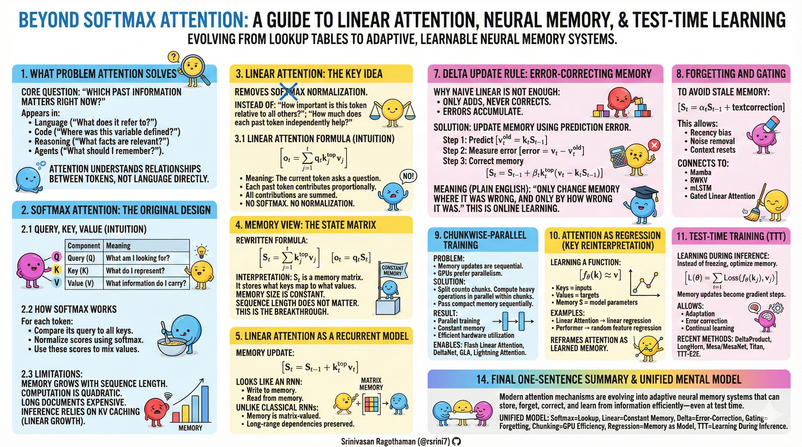

# Beyond-Softmax-Attention

## 🎯 What You Need to Know in 120 Seconds

𝗕𝗲𝘆𝗼𝗻𝗱 𝗦𝗼𝗳𝘁𝗺𝗮𝘅: 𝗧𝗵𝗲 𝗥𝗶𝘀𝗲 𝗼𝗳 𝗟𝗶𝗻𝗲𝗮𝗿 𝗔𝘁𝘁𝗲𝗻𝘁𝗶𝗼𝗻 & 𝗡𝗲𝘂𝗿𝗮𝗹 𝗠𝗲𝗺𝗼𝗿𝘆
Can we scale LLMs to infinite context without the quadratic memory tax of Softmax?

━━━━━━━━━━━━━━━━━━━━

⚡ **𝗧𝗵𝗲 𝗣𝗿𝗼𝗯𝗹𝗲𝗺: The Quadratic Bottleneck**

Standard **𝗦𝗼𝗳𝘁𝗺𝗮𝘅 𝗔𝘁𝘁𝗲𝗻𝘁𝗶𝗼𝗻** requires storing every token's Key-Value pair, causing memory usage to grow at **𝗢(𝗡²)**. This creates a hard ceiling for long-context reasoning, effectively trapping **$𝗕𝗶𝗹𝗹𝗶𝗼𝗻𝘀 𝗶𝗻 𝗰𝗼𝗺𝗽𝘂𝘁𝗲 𝗲𝗳𝗳𝗶𝗰𝗶𝗲𝗻𝗰𝘆** due to **𝗞𝗩 𝗖𝗮𝗰𝗵𝗲** bloating and massive inference latency in documents exceeding **𝟭𝟬𝟬𝗸+ 𝘁𝗼𝗸𝗲𝗻𝘀**.

━━━━━━━━━━━━━━━━━━━━

📈 **𝗧𝗵𝗲 𝗦𝗼𝗹𝘂𝘁𝗶𝗼𝗻: Linear Attention & Neural Memory**

Built on research evolving from **𝗧𝗿𝗮𝗻𝘀𝗳𝗼𝗿𝗺𝗲𝗿𝘀**, **𝗥𝗡𝗡𝘀**, and **𝗦𝗦𝗠𝘀** (like **𝗠𝗮𝗺𝗯𝗮**), **𝗟𝗶𝗻𝗲𝗮𝗿 𝗔𝘁𝘁𝗲𝗻𝘁𝗶𝗼𝗻** reinterprets attention as a fixed-size memory system. It shifts from an "exact lookup" model to a "compressed state" architecture.

* **Constant Memory footprint** → Scale to infinite sequences without increasing RAM
* **Recurrent Formulation** → Enable streaming inference at  per-token cost
* **Error-Correction (Delta Rule)** → Dynamically update memory based on prediction error

━━━━━━━━━━━━━━━━━━━━

🔧 **𝗖𝗼𝗿𝗲 𝗔𝗿𝗰𝗵𝗶𝘁𝗲𝗰𝘁𝘂𝗿𝗲: How It Works**

1️⃣ **State Matrix ()**: Replaces the KV cache with a fixed-dimension matrix (`d_k x d_v`) that accumulates information over time.

2️⃣ **Non-Linear Gating**: Uses **𝗔𝗹𝗽𝗵𝗮 ()** and **𝗕𝗲𝘁𝗮 ()** gates to control information flow and prevent memory saturation.

3️⃣ **Delta Update Rule**: Updates the state matrix by calculating the error between current input and memory-based prediction (`v - kS`).

4️⃣ **Chunkwise Parallelism**: Processes sequences in blocks (size `C`) to leverage **𝗚𝗣𝗨 𝗧𝗲𝗻𝘀𝗼𝗿 𝗖𝗼𝗿𝗲𝘀** while maintaining recurrent state-passing between blocks.

━━━━━━━━━━━━━━━━━━━━

🛒 **𝗖𝗼𝗿𝗲 𝗙𝗲𝗮𝘁𝘂𝗿𝗲𝘀: Workflow & Capabilities**
Transforming passive lookups into active, learnable memory.

1. **State Update** (`S_t = S_{t-1} + k_t v_t`) → Information is compressed into the matrix instead of appended to a list.
2. **Gated Forgetting** (`S_t = \alpha S_{t-1} + \dots`) → The model "cleans" its own memory, removing noise or irrelevant context.
3. **Linear Regression View** (`f(k) \approx v`) → Maps keys to values as a learned function rather than a simple index.
4. **Test-Time Training (TTT)** (`\nabla L(S)`) → Optimizes hidden states via gradient descent during inference to adapt to new data.

━━━━━━━━━━━━━━━━━━━━

🛡️ **𝗕𝗲𝗻𝗲𝗳𝗶𝘁𝘀: Security, Performance & Trust**
Why engineering teams are moving toward these "Non-Transformer" architectures.

* **Inference Scalability**: Maintaining  memory cost per token allows for **𝟭𝟬𝘅-𝟭𝟬𝟬𝘅 𝗹𝗼𝗻𝗴𝗲𝗿 𝗰𝗼𝗻𝘁𝗲𝘅𝘁** on existing hardware.
* **Predictive Accuracy**: The **𝗗𝗲𝗹𝘁𝗮 𝗥𝘂𝗹𝗲** ensures the model corrects early mistakes, preventing "hallucination drift" in long-running agentic loops.
* **Hardware Efficiency**: **𝗖𝗵𝘂𝗻𝗸𝘄𝗶𝘀𝗲 𝗣𝗮𝗿𝗮𝗹𝗹𝗲𝗹𝗶𝘀𝗺** enables training speeds competitive with FlashAttention while keeping the deployment benefits of RNNs.
* **Adaptive Learning**: **𝗧𝗧𝗧** allows models to "learn" specific document structures during the forward pass, significantly improving performance on niche technical jargon or private datasets.

━━━━━━━━━━━━━━━━━━━━

⚖️ **𝗦𝘁𝗿𝗮𝘁𝗲𝗴𝗶𝗰 𝗩𝗲𝗿𝗱𝗶𝗰𝘁: Why This Matters**
The industry is at a crossroads between "Brute Force" Scaling and "Algorithmic" Efficiency.

**The Softmax Status Quo (GPT-4, Claude 3)**

* Strength: Unmatched reasoning quality and architectural maturity.
* Risk: Massive **𝗞𝗩 𝗖𝗮𝗰𝗵𝗲** costs make high-throughput agentic workflows economically non-viable.
* Best for: General-purpose reasoning where context length is secondary to raw capability.

**The Neural Memory Challengers (Mamba, Titan, GLA)**

* Strength: Operationally superior for streaming data and long-context RAG-replacement.
* Risk: Training stability is less proven than standard Transformers; ecosystem tooling is still maturing.
* Best for: High-throughput agents, real-time code analysis, and long-horizon sequence modeling.

**Watch**: **𝗧𝗼𝗸𝗲𝗻-𝗽𝗲𝗿-𝘀𝗲𝗰𝗼𝗻𝗱 𝘃𝘀. 𝗖𝗼𝗻𝘁𝗲𝘅𝘁 𝗪𝗶𝗻𝗱𝗼𝘄 𝘀𝗰𝗮𝗹𝗶𝗻𝗴**. If architectures like **𝗗𝗲𝗹𝘁𝗮𝗡𝗲𝘁** or **𝗧𝗧𝗧-𝗘𝟮𝗘** achieve parity in standard benchmarks (MMLU) by mid-2026, the era of quadratic attention will effectively end.

━━━━━━━━━━━━━━━━━━━━

**𝗧𝗟;𝗗𝗥**

* **From Storage to Learning** → Attention is no longer a database; it’s an active, error-correcting neural memory.
* **Infinite Context is Operational** → Removing  constraints turns "Long Context" from a premium feature into an architectural default.
* **Inference-Time Adaptation** → Models that update their internal state via gradient descent (TTT) will outperform static-memory models on complex, novel tasks.

**Will the future of AI be defined by models with larger fixed memory banks, or by those that can learn and optimize their internal state during inference?**

👤 **Srinivasan Ragothaman (@rsrini7)**

Source: https://www.youtube.com/watch?v=pUCWwGR5WmQ

**Related:**- [inside-a-neuron](inside-a-neuron.md) — Introduces the neuron math (weighted sums, activations) that linear attention variants like Mamba/DeltaNet still build on at the per-unit level.- [AI-in-Next-18-Months](../economy/AI-in-Next-18-Months.md) — Covers Power Attention as a subquadratic alternative in its post-LLM breakthroughs, the same architectural shift away from softmax attention this file advocates.- [LLM-Inference](../architecture/LLM-Inference.md) — Explains the KV-cache bottleneck that linear attention is specifically designed to eliminate, giving the concrete cost driver behind the softmax-vs-linear trade-off.- [microGPT-Architecture-Complete](../architecture/microGPT-Architecture-Complete.md) — Walks through the causal self-attention and KV-cache mechanics that linear attention seeks to replace with a fixed-size state matrix.- [Auto-Regression](../training/Auto-Regression.md) — Explains the sequential token-by-token generation pattern whose memory cost drives interest in linear/state-space alternatives.
