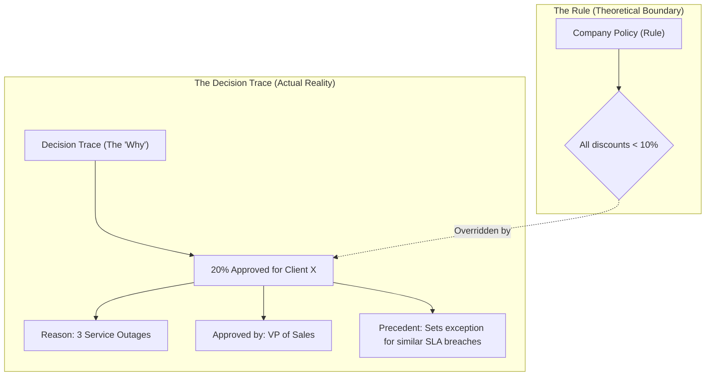
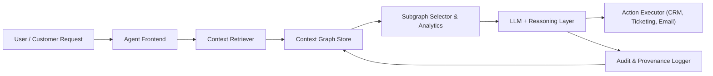
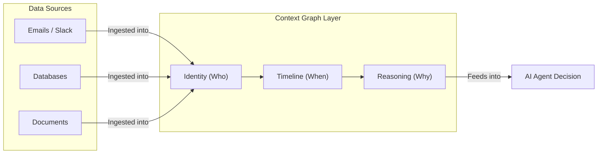
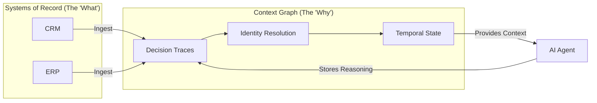
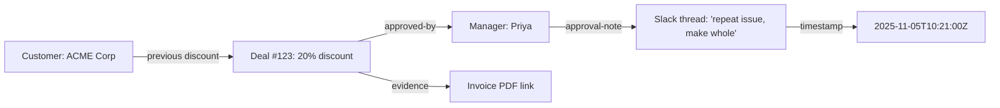

# Context Graphs: Comprehensive Guide

---

## Executive Summary

Context graphs are graph-structured representations that capture both facts and the **context** around those facts: provenance, decision traces, temporal validity, policy constraints, and links to underlying evidence. They are emerging as an AI-optimized "living layer" that LLM-based agents query to answer not only *what* happened but *why*, improving autonomy, reliability, and auditability in enterprise workflows.

**Definition**: A context graph is an AI-optimized knowledge structure that links entities (people, projects, products) with the reasoning behind their interactions. It goes beyond simple text or basic data lists by showing **relationships**, **reasons**, **time changes**, and **details** clearly, enabling AI to understand and reason better.

**Key Insight**: On December 22, 2025, Foundation Capital published a thesis calling context graphs "AI's trillion-dollar opportunity," arguing that enterprise value is shifting from "systems of record" (Salesforce, Workday, SAP) to "systems of agents," with context graphs serving as the new crown jewel.

---

## Table of Contents

1. [Why We Need Context Graphs](#why-we-need-context-graphs)
2. [What is a Context Graph?](#what-is-a-context-graph)
3. [Core Pillars](#core-pillars)
4. [The "What vs. Why" Gap](#the-what-vs-why-gap)
5. [How Context Graphs Differ from Knowledge Graphs](#how-context-graphs-differ-from-knowledge-graphs)
6. [Core Components](#core-components)
7. [The CGR³ Paradigm](#the-cgr3-paradigm)
8. [Rule vs. Decision Trace](#rule-vs-decision-trace)
9. [Example Architecture](#example-architecture)
10. [Typical Agent Workflow](#typical-agent-workflow)
11. [Graph Analytics That Add Value](#graph-analytics-that-add-value)
12. [Standards & Technologies](#standards-and-technologies)
13. [Implementations & Demos](#implementations-and-demos)
14. [Why This Matters for Enterprise AI](#why-this-matters-for-enterprise-ai)
15. [Real-World Examples](#real-world-examples)
16. [Benefits](#benefits)
17. [Risks & Challenges](#risks-and-challenges)
18. [Practical Roadmap](#practical-roadmap)
19. [Recommendations](#recommendations)
20. [Example Decision Trace Subgraph](#example-decision-trace-subgraph)
21. [Conclusion](#conclusion)
22. [Sources & References](#sources-and-references)

---

## Why We Need Context Graphs

### The Problem with Traditional Systems

Traditional systems of record (ERPs, CRMs, data warehouses, data lakes) primarily store **outcomes**: "deal closed", "incident resolved", "policy updated". They do not reliably capture the informal and cross-channel traces that explain **why** those outcomes were allowed (exceptions, backchannel approvals, chat threads), which limits what agents can safely automate.

**Current AI Context Limitations**: Traditional AI context is often linear text (a long string of words). This approach can lose important connections:
- Pronouns (he/she/it) become unclear
- Time-based changes (something true yesterday but not today) get ignored
- Reasons for decisions (why an exception was allowed) stay hidden in emails or chats
- Connections are weaker, leading to ambiguity and potential hallucinations

### Why LLM Agents Need More

LLM agents are cross-system and action-oriented: they read tickets, emails, chats, and logs, then propose or execute actions. Without decision traces and temporal context, they either overfit to static rules or hallucinate, making them hard to trust in high-stakes workflows like pricing, compliance, or incident response.

**The Temporal Gap**: Your CRM knows Sarah is a VP. It doesn't know she was a Director until June, and that the pricing exception approved in May happened before she had authority, which is why Finance flagged it as suspicious. This isn't an edge case—it's the default behavior of most enterprise data systems.

---

## What is a Context Graph?

### Formal Definition

A context graph is a graph (often triple-based: subject—predicate—object) enriched with metadata about time, provenance, evidence, actors, and policies, explicitly designed to be consumed by AI systems. 

Rather than exposing an entire enterprise knowledge graph, a context graph focuses on **AI-ready subgraphs** that bundle facts with their explanatory context for a specific question or decision.

### Academic Definition

Recent academic work (arXiv 2406.11160, June 2024) defines context graphs as extensions of classical knowledge graphs that annotate each triple or relation with attributes such as:
- Temporal validity
- Geographic scope
- Source provenance

These annotations enable structured reasoning and retrieval. This additional structure enables LLM-based pipelines to retrieve, rank, and reason over localized "decision neighborhoods" instead of unstructured document chunks.

### Simple Explanation

Put simply, **a context graph is a triples-representation of data that is optimized for usage with AI**. It's a way to organize information using a graph structure (nodes and edges) that helps AI systems understand not just what entities are and how they relate, but the full context in which those relationships exist and matter.

---

## Core Pillars

Context graphs are built on four fundamental pillars:

### 1. Decision Traces
A record of the inputs, rules, and human approvals that led to an outcome. This captures what data was used, what rules were bent, who approved, and why.

**Example**: Not just "20% discount applied" but "20% discount approved by VP Sarah Thompson because customer had 3 SEV-1 incidents and threatened cancellation, meeting strategic partnership exception criteria."

### 2. Temporal Metadata
Tracking "when" a fact was true, including effective intervals, version identifiers, or time-scoped edges so agents can distinguish current from stale or superseded information.

**Example**: "Sarah was a Director until June, then became the decision-maker for accounts over $500K" is context, not just data.

### 3. In-situ Context (Provenance)
Preserving where the data came from and its original surroundings (e.g., which Slack channel, document, or email thread). Facts carry explicit source attribution.

**Example**: Linking a discount approval to the specific Slack thread where the VP explained the reasoning.

### 4. Reification
A technique where the *relationship itself* becomes an object, allowing you to attach "trust scores," "confidence levels," or other metadata to connections.

**Example**: A relationship can have a relevance score of 0.95, indicating high confidence in that connection.

---

## The "What vs. Why" Gap

### Systems of Record Record Final States

Traditional data systems are excellent at recording final states but terrible at recording the process:

- **What Systems Store**: "A 20% discount was applied"
- **What's Missing**: *Why* it was applied (e.g., "The VP approved this because the client had three service outages last month and threatened to cancel")
- **The Result**: AI agents without this context:
  - Repeatedly re-solve the same edge cases
  - Treat related events as isolated incidents
  - Ultimately fail in production

### The Reasoning Lives in Unstructured Channels

The reasoning behind decisions currently lives in:
- Slack threads
- Zoom calls
- Email chains
- Hallway conversations
- People's heads

**The Problem**: The CRM stores the discount. The ticketing system stores the escalation. The ERP stores the override. But the reasoning never enters the system of record. It exists only in the memories of the people involved and in unstructured communication channels that agents can't reliably search or understand.

---

## How Context Graphs Differ from Knowledge Graphs

Both context graphs and knowledge graphs use nodes and edges to represent entities and relationships, often with ontologies and constraints for validation. The difference is in **emphasis**: knowledge graphs focus on semantic integration and inference over *what* is true, while context graphs emphasize *why*, *when*, and *under which conditions* facts and decisions apply.

### Comparison Table

| Aspect | Knowledge Graphs | Context Graphs |
|--------|-----------------|----------------|
| **Primary Goal** | Integrate and reason over entities/relations ("what") | Capture decision traces, provenance, and applicability ("why/when") |
| **Core Unit** | Triples plus schema/ontology | Triples plus temporal, provenance, policy, evidence metadata |
| **Main Consumers** | BI tools, KGQA, search, analytics | LLMs and agents executing or recommending actions |
| **Typical Queries** | "What products are related to X?" | "Why was this exception approved and does it apply now?" |
| **Temporal Focus** | Often static or snapshot-based | Explicit validity intervals, freshness, versioning |
| **Provenance & Audit** | Optional, sometimes coarse | First-class, modeled via standards like W3C PROV |
| **Optimization** | Comprehensive data storage, human-oriented querying | Token efficiency, relevance ranking, AI model consumption |

### Structural Comparison

**Traditional Database**:
```
Customer record with columns: "Name," "Email," "Last Purchase"
Simple, but no relationships
```

**Knowledge Graph**:
```
Customer → Purchased → Product
Customer → Lives In → City
More powerful, but context is just metadata
```

**Context Graph**:
```
Customer → Purchased → Product
  + When did the purchase happen? (temporal)
  + Where is the customer located? (spatial)
  + How confident are we in this data? (confidence)
  + Who verified this information? (provenance)
  + Why was this decision made? (reasoning trace)
  + Relevance score: 0.95 (AI optimization)
```

By layering provenance, temporal scope, and policy constraints on top of facts, context graphs become a natural fit for reconstructing localized narratives such as "why this decision was made for this customer at this time."

---

## Core Components

A practical context graph for agents usually includes these components:

### 1. Entities & Relations
Domain objects (customers, tickets, policies, releases) and their relationships form the base graph, often using RDF, property graphs, or hybrid models.

### 2. Provenance & Decision Traces
Events like approvals, escalations, overrides, and comments are modeled as nodes/edges with actors, timestamps, and justifications, frequently aligned with W3C PROV (PROV-DM / PROV-O).

### 3. Temporal Validity & Freshness
Facts carry effective intervals, version identifiers, or time-scoped edges so agents can distinguish current from stale or superseded information. As noted in temporal RAG research (February 2025), temporal relationships are the next frontier for understanding data.

### 4. Policy / Constraint Metadata
Nodes and relations are annotated with policy tags, risk levels, or SHACL/OWL constraints, enabling validation and policy-aware retrieval.

### 5. Evidence Links
Graph nodes point back to underlying artifacts—Slack threads, emails, ticket text, PDFs, contracts—so human reviewers can inspect the raw record.

### 6. Indexed Subgraphs / Retrieval Layer
Specialized indices and APIs support fast extraction of compact subgraphs tailored to an LLM prompt, often combining graph algorithms with vector search.

### 7. AI Optimization Features
- **Relevance Ranking**: Entities and relationships scored for AI model relevance
- **Token Efficiency**: Maximizing information density per token (70% token reduction possible)
- **Confidence Scores**: Metadata tracking reliability of data
- **Context Window Awareness**: Optimized to fit within LLM context limits

---

## The CGR³ Paradigm

Context graphs use a **Retrieve-Rank-Reason (CGR³)** workflow to power AI systems:

### Step 1: Retrieve
Pull "subgraphs"—relevant nodes and their connections—instead of just flat text chunks. The AI pulls a small piece of the graph showing related people, past decisions, and rules.

**How it works**: The retriever queries the context graph for customer history, past discounts, exception approvals, related tickets, Slack/email discussions, and relevant policies, all constrained by time windows.

### Step 2: Rank
Use the graph's structure and metadata to identify the most trustworthy or relevant connections. The system looks at "trust scores" or "provenance" (where the data came from) to decide which information is most important.

**How it works**: Analytics highlight similar past decisions, typical approvers for that segment, risk flags (e.g., unusually high cumulative discount), and policy tags (e.g., "VIP exception", "incident-make-good").

### Step 3: Reason
The LLM uses the structured relationship data to explain its conclusion with high precision. The AI uses the connections to explain its answer.

**How it works**: The LLM receives a compressed subgraph (often serialized as JSON, triples, or a tabular view) plus instructions to consider precedence, policy constraints, and effective dates, then produces a recommendation and an explanation referencing specific nodes.

### Example
"I approved this 20% discount because it matches a previous exception handled by the VP for a customer with 3 service outages, which meets our strategic partnership criteria even though it violates standard 10% cap."

---

## Rule vs. Decision Trace

This concept is fundamental to understanding context graphs:

### The Rule (Static Theory)
A rule is just a boundary or a "theory." For example: "No discount over 10%." It is simple and doesn't change, but it doesn't tell the whole story of a business.

### The Decision Trace (Dynamic Reality)
This is the "complete" story. In the real world, rules are often broken or modified for a reason. The Context Graph focuses on the Decision Trace because that is where the real intelligence lives.

**Why This Matters**: By recording why a rule was overridden (e.g., "We gave 20% because the server was down and client threatened cancellation"), the AI learns the "spirit" of the business, not just the "letter" of the law.

### Visual Representation



---

## Example Architecture

### High-Level Enterprise Architecture

A typical enterprise setup places the context graph at the center of an agentic loop, distinct from but connected to warehouses, SaaS tools, and logs.



**How it works**:
- The **Context Retriever** translates a natural-language task into graph queries (plus optional embedding search) and returns a compact, relevant subgraph that includes facts and decision traces
- The **Subgraph Selector & Analytics** layer may run graph algorithms (shortest paths, precedent search, anomaly scores) to highlight key nodes and edges before passing them to the LLM

### From Data Sources to AI Decisions



### Systems of Record Evolution



This variant fits well with existing RAG stacks by replacing "text chunk retriever" with a "context subgraph retriever."

---

## Typical Agent Workflow

### Support Exception Example

Consider a support or sales agent asked: "Can I apply a 20% discount for customer X?"

**Step 1: Intent & Entities**
The agent frontend extracts entities (customer X, 20% discount) and task type (discount approval).

**Step 2: Context Retrieval**
The retriever queries the context graph for:
- Customer history
- Past discounts
- Exception approvals
- Related tickets
- Slack/email discussions
- Relevant policies
All constrained by time windows.

**Step 3: Subgraph Analytics**
Analytics highlight:
- Similar past decisions
- Typical approvers for that segment
- Risk flags (e.g., unusually high cumulative discount)
- Policy tags (e.g., "VIP exception", "incident-make-good")

**Step 4: LLM Reasoning**
The LLM receives a compressed subgraph (serialized as JSON, triples, or tabular view) plus instructions to consider precedence, policy constraints, and effective dates. It produces a recommendation and explanation referencing specific nodes.

**Example Output**:
"Based on precedent Deal #456 where VP Thompson approved a similar discount for a customer with service issues, and given that this customer has experienced 3 SEV-1 incidents this quarter, I recommend approving the 20% discount as a strategic partnership exception, routed to Finance for final approval."

**Step 5: Action & Logging**
The action executor applies the change or routes for approval. The decision, rationale, and resulting outcome are written back into the context graph as new provenance nodes, improving future precedent search.

---

## Graph Analytics That Add Value

Context graphs unlock a richer set of graph-native analytics beyond simple semantic search, particularly useful in enterprise agents:

### 1. Precedent Search
Find subgraphs representing past decisions similar to the current case (e.g., customers with similar attributes who received comparable discounts) and surface their outcomes.

**Value**: Turns exceptions into searchable rules, preventing agents from making the same mistake twice.

### 2. Anomaly Detection
Use community detection, centrality measures, or learned embeddings to flag unusual approval paths, outlier discounts, or policy-violating patterns.

**Value**: Identifies patterns where exceptions concentrate (e.g., a particular region or manager), exposing "policy in practice" vs written policy.

### 3. Shortest / Most-Explanatory Paths
Generate minimal chains of nodes and edges connecting a decision to its underlying facts and justifications, which can be presented as an explanation narrative to humans and LLMs.

**Value**: Creates transparent audit trails for regulatory compliance and human review.

### 4. Community / Clustering
Identify clusters where exceptions or specific outcomes concentrate, revealing organizational patterns and informal decision-making networks.

**Value**: Organic understanding of how the organization actually operates, beyond formal hierarchies.

---

## Standards and Technologies

Rather than inventing everything from scratch, context graph implementations typically lean on existing web and graph standards:

### Graph Stores / Databases

**Property Graph Databases**:
- Neo4j
- JanusGraph
- Cloud graph services (AWS Neptune, Azure Cosmos DB, Google Cloud Spanner)

**RDF Triple Stores**:
- Blazegraph
- GraphDB
- Apache Jena

**Why both?**: Property graphs when flexibility is key; RDF when interoperability and standards-based modeling are priorities.

### Provenance: W3C PROV

The W3C PROV family (PROV-DM, PROV-O) provides a mature model for activities, agents, entities, and derivations, which maps naturally to decision traces and audit logs. This should be adopted from day one for consistent representation and portability.

### Ontologies & Shapes

**OWL (Web Ontology Language)**: Defines domain ontologies
**SHACL (Shapes Constraint Language)**: Defines allowed structure and constraints

These existing standards enable validation and safer evolution of the graph. Reusing standard domain ontologies reduces integration risk and validation effort.

### Context Graph Tooling

**TrustGraph**: 
- Open-source "Context Operating System" (Apache 2.0 license)
- Positions itself as a "context graph factory"
- Transforms fragmented enterprise data into AI-optimized graphs
- Exposes retrieval interfaces tuned for LLMs
- Version 1.2 (August 2025): Added agent-powered knowledge extraction using ReAct framework
- Version 1.1 (July 2025): Full Model Context Protocol (MCP) integration
- Features:
  - Automated entity & relationship extraction
  - Ontology-driven graph construction
  - Hybrid retrieval (vector + graph)
  - Context cores (versioned, reusable knowledge packages)
  - GraphRAG and Document RAG support
  - Full deployment flexibility (on-prem, cloud, bare metal)

### Integration Standards

**Model Context Protocol (MCP)**: Open standard for connecting AI agents to external tools and services while maintaining grounded context.

**Graph Query Languages**:
- GQL (ISO standard, 2024)
- Cypher
- SPARQL (for RDF)

---

## Implementations and Demos

Context graphs are rapidly gaining visibility in late 2025 and early 2026:

### Foundation Capital Thesis (December 22, 2025)
A widely circulated essay frames context graphs—built from decision traces across tools—as the core asset powering autonomous agents and a major enterprise platform opportunity. The thesis is that enterprise value is shifting from "systems of record" to "systems of agents."

### TrustGraph Open-Source Project
- **License**: Apache 2.0
- **What it offers**: Open-source "context graph factory" and manifesto
- **Key Features**:
  - Tooling for constructing graphs from heterogeneous data
  - Ontology-driven modeling
  - Integration into RAG/agent pipelines
  - AI agent-powered knowledge extraction (v1.2, August 2025)
  - Full MCP integration (v1.1, July 2025)
  - Structured data handling
  - Multiple LLM provider support (including Anthropic models on Google VertexAI)
  - Deployment on multiple clouds (AWS, Azure, GCP, OVHcloud)
- **Documentation**: Comprehensive guides at docs.trustgraph.ai
- **GitHub**: Active development with multiple repositories

### Community Demos
Practitioners have released small prototypes (often with Streamlit or similar) where a graph is wired to an LLM to handle customer requests or support workflows, serving as proofs-of-concept rather than production deployments.

### Academic Formalization

**arXiv 2406.11160 (June 2024)**: 
A formal paper proposes a context graph model extending knowledge graphs with temporal validity and provenance metadata, introducing the CGR³ (retrieve—rank—reason) paradigm that improves KG completion and QA tasks with LLMs.

**Key findings**:
- Demonstrated effectiveness on knowledge graph completion (KGC) and knowledge graph question answering (KGQA)
- Integration of contextual data contributes to effective knowledge reasoning
- LLMs better at handling unstructured data from context graphs than structured triples

---

## Why This Matters for Enterprise AI

### No More Guesswork
AI stops "hallucinating" (making things up) because it has a factual trail of past decisions to follow. The system has access to actual precedents rather than having to infer or guess.

### Auditability
Every action the AI takes has a "reasoning trail." If something goes wrong, you can see exactly:
- Who approved the logic
- Why they approved it
- What data supported the decision
- Which precedents were considered

This is crucial for regulatory compliance and legal requirements.

### Institutional Memory
When an employee leaves, their "context" (why they made certain choices) stays in the graph instead of disappearing. This captures:
- Decision rationales
- Exception handling patterns
- Informal organizational knowledge
- Cross-team collaboration traces

### Searchable Precedent
Exceptions become searchable rules. Instead of every edge case being treated as new, agents can find similar situations and their resolutions.

**Example**: "Last quarter, we approved a similar discount for Customer Y under similar circumstances (3 outages, strategic value). VP approved. Customer became a reference account."

### Disambiguation
Context graphs can differentiate between entities with the same name by looking at their connected properties and relationships.

**Example**: Distinguishing "Fred the Cat" from "Fred the IKEA Table" by examining their relationship patterns and attributes.

### Organic Growth
The graph doesn't need a manual schema; it "learns" the organizational structure by watching how agents and humans interact over time.

---

## Real-World Examples

### Current Applications

**Fraud Detection**: 
Already uses huge graphs to spot patterns fast. Financial institutions use relationship networks to identify suspicious transaction patterns.

**Company Sales**: 
Graph records why discounts were given, so AI can auto-approve similar ones based on precedent rather than requiring manual review each time.

**Research**: 
Connect old and new facts without losing meaning. Temporal context helps understand how scientific understanding evolved.

**Customer Support**:
Track incident resolution patterns, escalation paths, and exception approvals to improve automated response quality.

**Compliance & Audit**:
Maintain complete decision trails for regulatory requirements, linking every action to its justification and approval chain.

### Example Use Cases from Industry

**Quote-to-Cash**: 
Agent analyzes pricing requests against historical deals, approval patterns, and policy exceptions to recommend or auto-approve pricing.

**Contract Review**:
Agents reference similar contract clauses, past negotiation outcomes, and legal precedents to suggest revisions.

**Support Resolution**:
System retrieves similar past tickets, their resolution paths, and outcome quality to guide current incident handling.

---

## Benefits

### 1. Better Reasoning
AI sees relationships, not just words. The graph structure enables understanding of how entities connect and influence each other.

### 2. Handles Time
Tracks changes (e.g., prices yesterday vs today, role changes, policy versions). Temporal validity prevents outdated information from influencing decisions.

### 3. Explains Decisions
Shows "why", making AI trustworthy. Every recommendation can point to specific evidence nodes and precedent paths.

### 4. Scales for Agents
Helps AI automate real work with fewer mistakes. Reduces hallucinations by grounding responses in verifiable context.

### 5. Builds on Mature Technology
Uses proven graph tools (RDF, property graphs, W3C PROV) combined with new AI capabilities.

### 6. Searchable Precedent
Exceptions become searchable rules, preventing agents from repeatedly solving the same problems.

### 7. Disambiguation
Differentiates between entities with similar names by examining their relationship patterns.

### 8. Auditability
Every AI decision has a clear "reasoning trail" that can be reviewed for legal or regulatory compliance.

### 9. Organic Growth
The graph doesn't need manual schema definition; it learns organizational structure through observation of interactions.

### 10. Token Efficiency
Maximizes information density per token—up to 70% reduction in token usage while preserving all essential information.

### 11. Reduced Hallucinations
Grounding in factual, traceable context dramatically reduces AI hallucinations compared to vanilla RAG.

---

## Risks and Challenges

While attractive, context graphs also introduce non-trivial challenges that teams must design for from the start:

### 1. Data Capture Gap
Much of the "why" behind decisions lives in private chats, meetings, or unstructured notes. Reliable context graphs require instrumentation and behavioral incentives to capture these traces.

**Challenge**: Getting people to document their reasoning in structured ways.
**Solution**: Integrate capture into existing workflows; make it easy and valuable to contribute context.

### 2. Privacy, Security, and Compliance
Decision traces may contain PII, sensitive legal discussions, or privileged communications. This makes access control, redaction, and data residency constraints critical.

**Challenge**: Balancing transparency with confidentiality.
**Solution**: Implement fine-grained access controls, role-based permissions, and automated redaction capabilities.

### 3. Vendor Lock-in & Longevity
Since decision traces can be relevant for many years (e.g., regulatory inquiries), organizations should favor open models and formats (RDF, PROV-O) to avoid long-term lock-in to specific vendors.

**Challenge**: Ensuring data portability and long-term accessibility.
**Solution**: Use open standards from the start; avoid proprietary formats.

### 4. Trust & Explainability
For agents to be trusted, recommendations must point to specific evidence nodes and paths so auditors can verify that actions were consistent with precedent and policy.

**Challenge**: Making AI reasoning transparent and verifiable.
**Solution**: Always maintain evidence links and provide reasoning trails; design for auditability from day one.

### 5. Integration Complexity
Context graphs sit at the intersection of multiple systems (CRM, ERP, communication tools, ticketing systems). Integration can be complex.

**Challenge**: Connecting diverse data sources with different formats and access patterns.
**Solution**: Use standardized connectors and transformation pipelines; leverage existing integration platforms.

### 6. Performance at Scale
As graphs grow to millions of nodes and edges, maintaining query performance becomes critical.

**Challenge**: Balancing comprehensive context with query speed.
**Solution**: Implement strategic indexing, caching, and subgraph extraction optimization.

---

## Practical Roadmap

A pragmatic way to adopt context graphs is to start small around a single, high-value workflow and iterate:

### Step 1: Inventory (Weeks 1-2)
Select 1-2 key decisions (e.g., discount approvals, incident severity overrides, release go/no-go decisions) where better traceability and automation would clearly help.

**Deliverable**: Document current decision-making process, identify pain points, quantify potential value.

### Step 2: Instrument (Weeks 3-6)
Begin capturing decision artifacts from existing tools (ticket comments, email approvals, Slack threads) with minimal structured metadata:
- Actor (who made the decision)
- Timestamp (when it occurred)
- Artifact type (approval, override, exception)
- Linkage to underlying case

**Deliverable**: Working data capture pipeline for selected workflow.

### Step 3: Prototype Store (Weeks 7-12)
Build a small context graph (property graph or RDF) for that workflow:
- Define lightweight ontology/shape
- Implement subgraph retrieval
- Wire into test LLM agent
- Create basic visualization for human review

**Deliverable**: Functional prototype with test queries and agent integration.

### Step 4: Evaluate & Expand (Weeks 13+)
Measure:
- Agent correctness (accuracy of recommendations)
- Human override rates (how often humans disagree with agent)
- Audit quality (ease of reviewing decisions)

Refine modeling and retrieval strategies based on feedback, then extend to adjacent workflows once benefits are demonstrated.

**Deliverable**: Production pilot with measurable ROI; roadmap for expansion.

---

## Recommendations

### Prioritize Provenance Early
Adopt W3C PROV (or a compatible model) from day one so decision traces are consistently represented and portable. This prevents costly migrations later.

### Design for Small, Explainable Subgraphs
Optimize retrieval to deliver compact, human-auditable subgraphs instead of dumping entire graphs or large text chunks into prompts. Focus on "decision neighborhoods" relevant to specific questions.

**Example**: For a discount approval query, retrieve only the customer history, similar precedents, relevant policies, and recent incidents—not the entire customer graph.

### Reuse Existing Ontologies
Leverage standard domain ontologies and SHACL/OWL constraints instead of inventing schemas from scratch. This reduces:
- Integration risk
- Validation effort
- Learning curve for team members
- Long-term maintenance burden

### Build for Both Humans and AI
Remember that context graphs serve two audiences:
- **AI agents** need structured, token-efficient, machine-readable formats
- **Human auditors** need clear, visualizable, understandable explanations

Design retrieval and visualization with both in mind.

### Start with High-Value, High-Trust Workflows
Choose initial use cases where:
1. Current manual process is expensive or error-prone
2. Decisions have clear precedents
3. Stakeholders will value transparency
4. Success can be clearly measured

Examples: pricing approvals, compliance exceptions, resource allocation.

### Instrument the Decision Loop
Don't just capture outcomes—capture the full decision process:
- What data was considered
- What alternatives were evaluated
- Why specific options were chosen or rejected
- Who participated in the decision
- What constraints or policies applied

This creates rich training data for future agent improvements.

---

## Example Decision Trace Subgraph

Below is a simple illustrative decision-trace subgraph for a discount approval:



This small subgraph encodes:
- The precedent (Deal #123)
- The approver (Manager Priya)
- The justification (Slack thread content)
- The time (timestamp)
- Attached evidence (invoice link)

All in a form that both humans and LLMs can query and understand.

---

## Conclusion

### Context is the Connective Tissue of Intelligence

Context is the "connective tissue" of human intelligence. By building Context Graphs, enterprises are moving beyond simple pattern matching to a world where AI truly understands the spirit, not just the letter, of how a business operates.

### From Chatbots to Teammates

The Context Graph is the "brain" of a modern enterprise. While traditional databases record the state of the world, the Context Graph records the logic of the company. This allows AI agents to move from being simple "chatbots" to becoming reliable "teammates" that understand how your business actually works.

### The Path Forward

Context graphs are still emerging (ideas grew significantly in 2025-2026), but momentum is building rapidly:

**Open Source**: Companies like TrustGraph are building open tools for knowledge-style graphs with AI optimization.

**Enterprise Focus**: Organizations are implementing decision-focused graphs for business automation, compliance, and institutional knowledge.

**Academic Foundation**: Formal research (arXiv 2406.11160) provides theoretical grounding and measurable improvements in AI reasoning tasks.

**Industry Validation**: Foundation Capital's trillion-dollar opportunity thesis signals major venture and enterprise interest.

### The Opportunity

Together, these developments help build AI that truly understands context—the next big step after basic LLMs. The shift from systems of record to systems of agents requires a new kind of data infrastructure, and context graphs are emerging as that infrastructure.

### Two Key Perspectives

There are two complementary ways people describe context graphs today:

1. **Knowledge-Focused (Triples-Based)**
   - Data stored as subject → predicate → object statements
   - Builds large knowledge graphs with clear semantic relationships
   - AI retrieves relevant subgraphs for reasoning
   - Reduces ambiguity through structured connections

2. **Decision-Focused (For AI Agents)**
   - Records "why" behind business decisions
   - Captures exceptions, approvals, and reasoning scattered across tools
   - Enables AI agents to learn from past cases
   - Turns exceptions into new precedents over time

Both use graphs to give AI richer context, and practical implementations often combine both approaches.

### Final Thought

The question isn't whether context graphs will become important—the question is which organizations will build them first and gain the institutional intelligence advantage they provide. As AI agents become more capable, the quality of their context will determine the quality of their decisions. Context graphs are how we make that context structured, traceable, and actionable.

---

## Sources and References

### Primary Sources

1. **Foundation Capital**: "Context Graphs: AI's Trillion-Dollar Opportunity" (December 22, 2025)
   - https://foundationcapital.com/context-graphs-ais-trillion-dollar-opportunity/
   - "Where AI is Headed in 2026"
   - https://foundationcapital.com/where-ai-is-headed-in-2026/

2. **TrustGraph**:
   - Context Graph Manifesto
   - https://trustgraph.ai/news/context-graph-manifesto/
   - Main website: https://trustgraph.ai
   - Documentation: https://docs.trustgraph.ai

3. **Academic Research**:
   - arXiv:2406.11160 (June 2024): "Context Graphs: Enhancing Knowledge Graph Completion and Question Answering with Large Language Models"
   - https://arxiv.org/abs/2406.11160

4. **Community Discussion**:
   - Reddit r/KnowledgeGraph: "What are Context Graphs?"
   - https://www.reddit.com/r/KnowledgeGraph/comments/1q0osth/what_are_context_graphs_the_trilliondollar/

5. **Supporting Resources**:
   - Foundation Capital website: https://foundationcapital.com
   - W3C PROV specifications: https://www.w3.org/TR/prov-overview/
   - Knowledge Graph Wikipedia: https://en.wikipedia.org/wiki/Knowledge_graph

### Social Media & Industry Discussion

6. **LinkedIn Discussions**:
   - Anthony Alcaraz: Foundation Capital context graphs discussion (Post ID: 7410253380641734656)
   - Futurist Keynote Speaker: AI context graphs analysis (Post ID: 7410489038383706112)

### Additional Context

This document consolidates information from multiple sources as of January 2026. Context graphs remain an emerging field with rapid development. For the latest information:
- Monitor TrustGraph releases and documentation
- Follow Foundation Capital's AI thesis updates
- Track academic publications on arXiv
- Engage with the knowledge graph and AI agent communities

### Related Concepts to Explore

- **Retrieval-Augmented Generation (RAG)**: Traditional approach that context graphs extend
- **Knowledge Graphs**: The foundation that context graphs build upon
- **W3C PROV**: Provenance standard critical for decision traces
- **Model Context Protocol (MCP)**: Integration standard for AI agents
- **Temporal Knowledge Graphs**: Related research on time-aware knowledge representation
- **GraphRAG**: Microsoft's graph-based RAG approach
- **Agentic AI**: Autonomous AI systems that benefit from context graphs

**Related:**- [RAG-Guide-Jan-2026](../../RAG/RAG-Guide-Jan-2026.md) — Frames context graphs as the natural evolution beyond flat-chunk RAG, addressing RAG's temporal and reasoning gaps with provenance and decision traces.- [Persistent-Memory-Layers-AI-Agents](../architecture/Persistent-Memory-Layers-AI-Agents.md) — Both address memory architectures for agents; context graphs add decision traces and temporal validity on top of the semantic/vector memory layers.- [AI-Coding-Loops](../../Agents/development/AI-Coding-Loops.md) — Provides the agent-loop and harness patterns that context graphs are designed to feed with grounded 'why' context for enterprise workflows.- [Autonomous-AI-Agents](../../Agents/analysis/Autonomous-AI-Agents.md) — Both argue autonomous agents need richer context than chat history; context graphs supply the traceable decision layer that makes agent actions auditable.- [Unlock-the-Dark-Data](../optimization/Unlock-the-Dark-Data.md) — Both target enterprise unstructured-data lock-in; Unlock-the-Dark-Data covers agentic extraction while this covers the downstream reasoning substrate.
