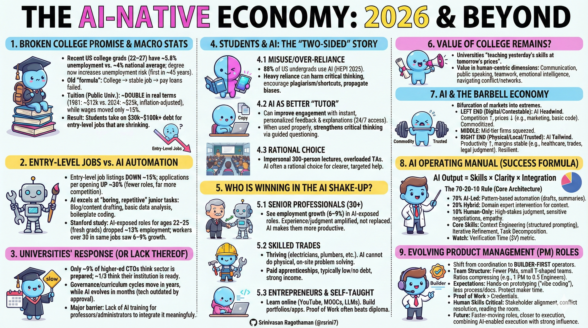
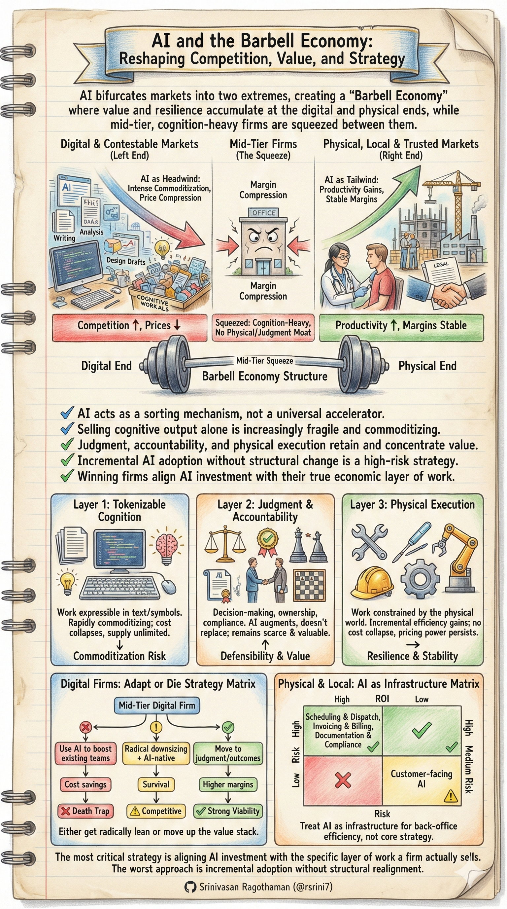
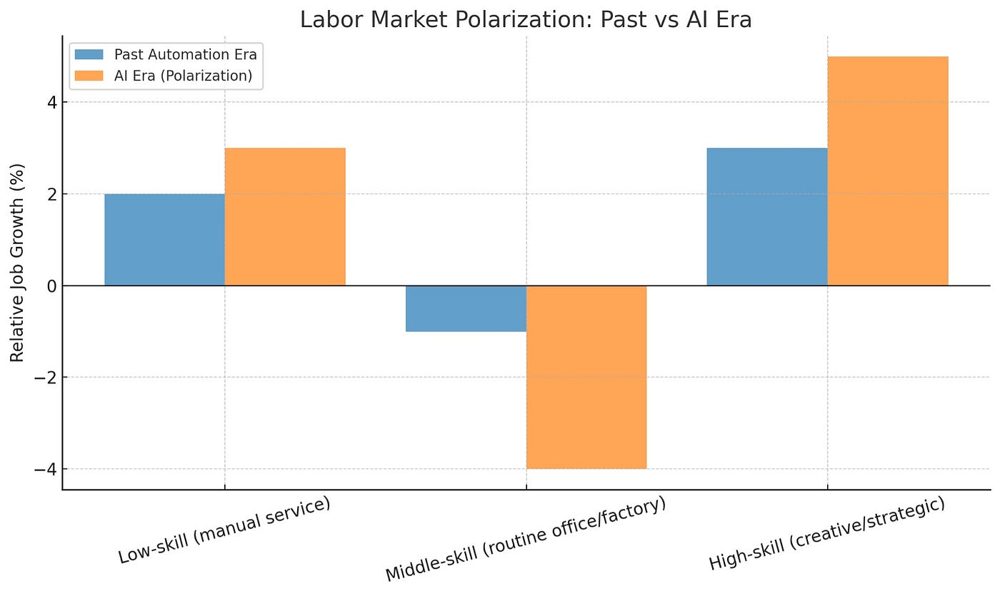
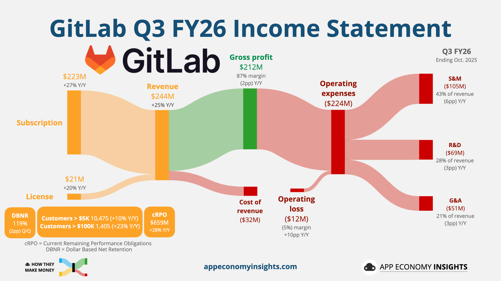
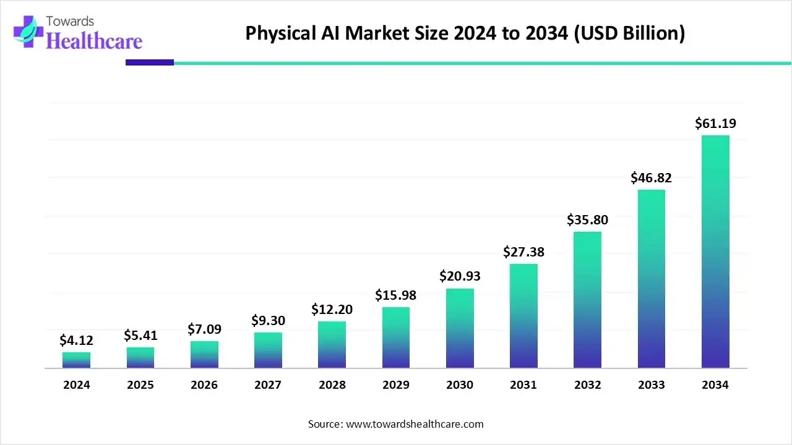
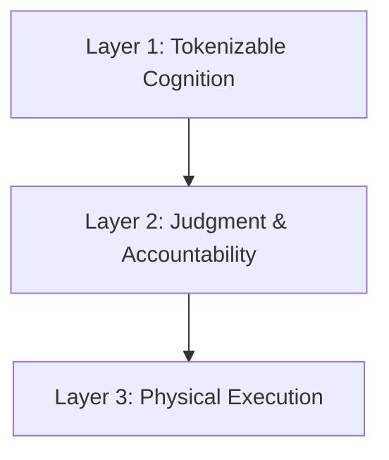

# AI and the Barbell Economy

---

## How Artificial Intelligence Is Reshaping Competition, Value, and Strategy

---

---

## Executive Summary

Artificial Intelligence (AI) is not affecting all parts of the economy equally.
Rather than uniformly intensifying competition, AI is **bifurcating markets** into two extremes:

* **Digital, contestable markets** are experiencing intense commoditization and price compression.
* **Physical, local, and relationship-driven markets** are benefiting from productivity gains without proportional increases in competition.

This phenomenon creates a **“barbell economy”**, where mid-tier, cognition-heavy firms are squeezed while both ends of the market strengthen.

This whitepaper provides:

* A clear conceptual framework
* Decision matrices for AI investment
* Visual diagrams
* Industry-specific implications
* Practical guidance for executives and founders

---

## 1. The Barbell Economy

### Definition

The **Barbell Economy** describes a market structure where value and resilience accumulate at two extremes:

| End of Barbell | Market Type                | AI Effect                      |
| -------------- | -------------------------- | ------------------------------ |
| Left End       | Digital / Contestable      | Competition ↑, prices ↓        |
| Middle         | Mid-tier service firms     | Margin compression             |
| Right End      | Physical / Local / Trusted | Productivity ↑, margins stable |

---

### 1.1 Digital & Contestable Markets (AI as a Headwind)

**Characteristics**

* Low switching costs
* Global competition
* Output easily evaluated
* Work is language- or code-based

**AI Impact**

* Cognitive work becomes abundant
* Differentiation erodes
* Price competition intensifies

**Examples**

* Marketing agencies
* Software development services
* Research & analytics firms
* Design and content studios

---

### 1.2 Physical, Local, and Relationship-Based Markets (AI as a Tailwind)

**Characteristics**

* Physical constraints
* Local regulation or trust
* Relationship-based demand
* High switching costs

**AI Impact**

* Administrative burden reduced
* Throughput and margins improve
* Competitive structure remains stable

**Examples**

* Healthcare delivery
* Construction & real estate
* Manufacturing
* Legal and accounting practices
* Field services

---

## 2. The Three Layers of Business Work

### Conceptual Model

---

### Layer 1: Tokenizable Cognition

**Description**
Work that can be expressed in text, symbols, or code.

**Examples**

* Writing
* Coding
* Analysis
* Design drafts

**AI Effect**

* Cost collapses
* Speed increases
* Supply becomes unlimited

**Economic Reality**

> This layer is rapidly commoditizing.

---

### Layer 2: Judgment and Accountability

**Description**
Decision-making, responsibility, and ownership of outcomes.

**Examples**

* Approvals
* Compliance sign-off
* Client accountability
* Strategic decisions

**AI Effect**

* Augmented, not replaced
* Remains scarce and valuable

**Economic Reality**

> This is where defensibility is concentrating.

---

### Layer 3: Physical Execution

**Description**
Work constrained by the physical world.

**Examples**

* Installation
* Manufacturing
* Medical procedures
* Repairs

**AI Effect**

* Incremental efficiency gains
* No cost collapse

**Economic Reality**

> Scarcity and pricing power persist.

---

## 3. Industry Mapping

### AI Impact by Industry

| Industry                   | Dominant Layer | AI Effect | Strategic Outlook      |
| -------------------------- | -------------- | --------- | ---------------------- |
| Marketing Agencies         | Layer 1        | Negative  | High risk              |
| Software Services          | Layer 1 → 2    | Mixed     | Must reposition        |
| Management Consulting      | Layer 2        | Positive  | Strong if judgment-led |
| Healthcare Providers       | Layer 3        | Positive  | AI as efficiency layer |
| Construction               | Layer 3        | Positive  | Back-office automation |
| Legal (Local Firms)        | Layer 2        | Positive  | Trust-driven moat      |
| Manufacturing              | Layer 3        | Positive  | Operational leverage   |
| SaaS (Generic Tools)       | Layer 1        | Negative  | Commoditization risk   |
| SaaS (Workflow/Compliance) | Layer 2        | Strong    | Defensible             |

---

## 4. Decision Matrices for AI Investment

---

### 4.1 Mid-Tier Digital Firms

**Decision Matrix**

| Strategy                       | Short-Term Outcome | Long-Term Viability |
| ------------------------------ | ------------------ | ------------------- |
| Use AI to boost existing teams | Cost savings       | ❌ Death trap        |
| Radical downsizing + AI-native | Survival           | ⚠️ Competitive      |
| Move to judgment/outcomes      | Higher margins     | ✅ Strong            |
| Ignore AI                      | Rapid decline      | ❌                   |

**Recommendation**

> Either **get radically lean** or **move up the value stack**.

---

### 4.2 Physical & Local Businesses

| AI Investment Area         | ROI  | Risk   |
| -------------------------- | ---- | ------ |
| Scheduling & dispatch      | High | Low    |
| Invoicing & billing        | High | Low    |
| Documentation & compliance | High | Low    |
| Customer-facing AI         | Low  | Medium |

**Recommendation**

> Treat AI as **infrastructure**, not strategy.

---

### 4.3 AI-Native Startups

| Focus Area                | Defensibility |
| ------------------------- | ------------- |
| Pure generation           | ❌ Weak        |
| Workflow orchestration    | ✅ Strong      |
| Compliance & audit        | ✅ Strong      |
| Human-in-the-loop systems | ✅ Strong      |
| Decision ownership        | ✅ Very strong |

**Core Insight**

> Own the bottleneck where judgment meets automation.

---

### 4.4 Large Enterprises with Distribution Moats

| Risk              | Mitigation                   |
| ----------------- | ---------------------------- |
| Talent flight     | Internal builders, autonomy  |
| Bureaucratic drag | Operating model change       |
| AI theater        | Measurable outcome ownership |

**Recommendation**

> Pair AI investment with **organizational redesign**.

---

## 5. Barbell Visual Summary

---

## 6. Key Takeaways

1. AI is a **sorting mechanism**, not a universal accelerator.
2. Selling cognitive output alone is increasingly fragile.
3. Judgment, accountability, and physical execution retain value.
4. The worst strategy is incremental AI adoption without structural change.
5. Winning firms align AI investment with **their true economic layer**.

---

## Final Conclusion

> The most important AI question is not
> **“How advanced is our AI?”**
> but
> **“Which layer of work do we actually sell?”**

Firms that realign around this insight will compound advantages.
Those that do not will be efficiently outcompeted.
