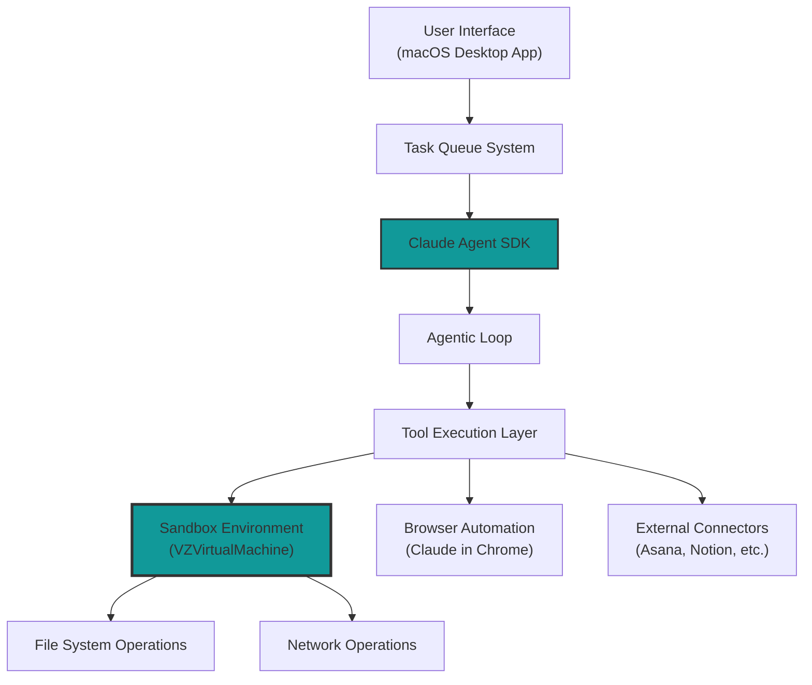
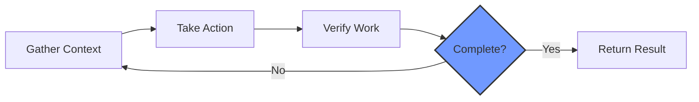
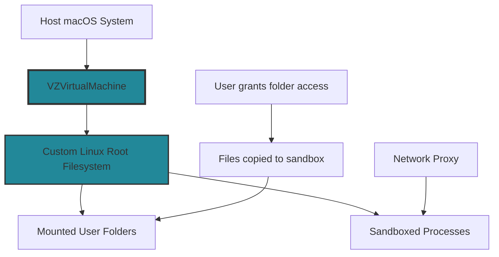
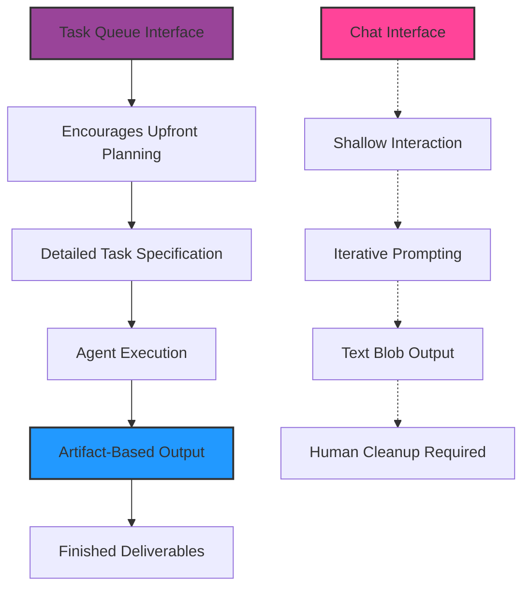
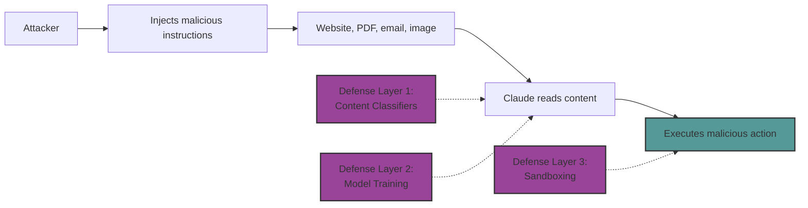
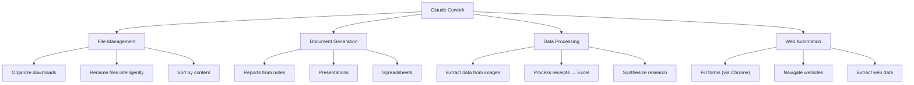
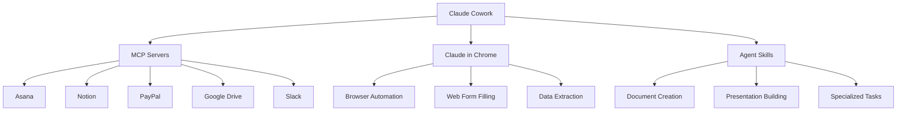
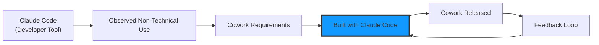
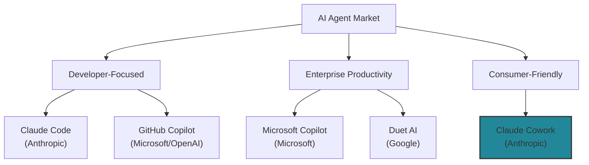
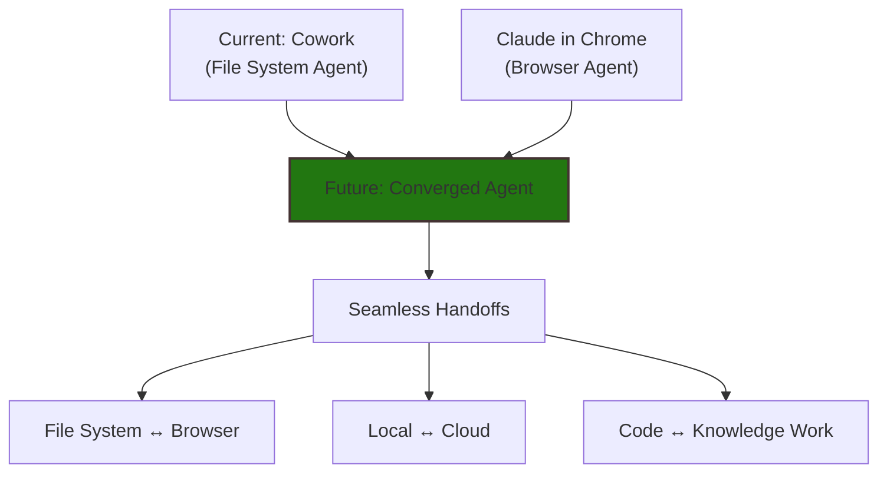

# Claude Cowork: Technical Whitepaper for Developers and Architects

## Executive Summary

Claude Cowork is an AI agent for knowledge work built by Anthropic in approximately 10 days. It extends Claude Code's capabilities to non-technical users, allowing autonomous file management and task execution through a simple interface. This whitepaper provides technical insights for developers and architects evaluating or implementing Claude Cowork.

**Key Facts:**
- **Development Time:** 10 days (built using Claude Code itself)
- **Availability:** Research preview for Claude Max subscribers ($100-200/month)
- **Platform:** macOS Desktop application
- **Foundation:** Built on Claude Agent SDK (same as Claude Code)
- **Model:** Claude Sonnet 4.5

---

## 1. Architecture Overview

### 1.1 Core Components



### 1.2 System Architecture Layers

| Layer | Component | Purpose |
|-------|-----------|---------|
| **Presentation** | macOS Desktop UI | User interaction, task delegation, progress visibility |
| **Agent** | Claude Agent SDK | Agent loop, context management, tool orchestration |
| **Execution** | VZVirtualMachine Sandbox | Isolated environment for file/command execution |
| **Integration** | MCP Servers & Connectors | External system connectivity |
| **Security** | Multi-layer Defenses | Prompt injection protection, access controls |

---

## 2. Technical Foundation: Claude Agent SDK

### 2.1 Agent Loop Pattern

Claude Cowork follows the standard agent feedback loop:



**Key Characteristics:**
- **Autonomous execution** - Agent makes decisions without step-by-step prompting
- **Parallel processing** - Multiple tasks executed simultaneously
- **Self-verification** - Built-in error checking and correction
- **Iterative refinement** - Loops until completion or clarification needed

### 2.2 Built-in Tools

The SDK provides native tools that Cowork leverages:

| Tool Category | Tools | Purpose |
|--------------|-------|---------|
| **File Operations** | Read, Write, Edit, Glob, Grep | File system manipulation |
| **Execution** | Bash (sandboxed) | Command execution |
| **Search** | WebSearch | Internet information retrieval |
| **Code Operations** | Lint, Debug | Code quality checks |
| **Agent Management** | Subagent | Specialized task delegation |

### 2.3 SDK Configuration

```python
# Python SDK Example
from claude_agent_sdk import query, ClaudeAgentOptions

options = ClaudeAgentOptions(
    model="claude-sonnet-4-5-20250929",
    allowed_tools=["Read", "Edit", "Write", "Bash"],
    permission_mode="sandbox",  # Key for Cowork
    max_turns=250,
    setting_sources=["project"]
)

async for message in query(
    prompt="Organize receipts folder",
    options=options
):
    print(message)
```

---

## 3. Sandbox Security Architecture

### 3.1 Isolation Technology

**Implementation:** Apple VZVirtualMachine (Virtualization Framework)



**Security Benefits:**
1. **Process-level isolation** from host OS
2. **Filesystem containment** - Only mounted folders accessible
3. **Network filtering** - Proxy-controlled internet access
4. **Ephemeral environment** - Clean state per session

### 3.2 Dual-Boundary Protection

Effective sandboxing requires BOTH boundaries:

#### Filesystem Isolation
```
Default Behavior:
├── Write Access: Current working directory + subdirectories
├── Read Access: Entire computer (except denied directories)
└── Denied: ~/.ssh/, system files, credentials

User Control:
├── Explicitly grant folder access
└── All operations confined to mounted paths
```

#### Network Isolation
```
Control Mechanisms:
├── Unix domain socket → Proxy server
├── Domain allowlist/denylist enforcement
├── User confirmation for new domains
└── Custom proxy rules (optional)

Protection:
├── Prevents data exfiltration
└── Blocks malware downloads
```

### 3.3 Sandbox Path Example

When user grants access to `/Users/alice/receipts`:

```
Sandbox View:
/sessions/zealous-bold-ramanujan/mnt/receipts/
                                   └── [user files copied here]

Host System:
/Users/alice/receipts/
              └── [original files remain untouched]
```

**Important:** Operations occur on copies in sandbox; changes require explicit permission to write back to host.

---

## 4. Anti-Slop Architecture

"Work slop" = passable but unchecked AI output that creates downstream cognitive burden.

### 4.1 Design Principles



### 4.2 Anti-Slop Features

| Feature | Mechanism | Benefit |
|---------|-----------|---------|
| **Artifact Output** | Generates Excel, PowerPoint, structured documents | No text-to-format conversion needed |
| **Steering Loop** | Progress visibility, mid-task corrections | User guides execution, not cleanup |
| **Concrete Inputs** | Sandbox requires real files | Reduces hallucination, forces specificity |
| **Task Queue** | Batch processing, parallel execution | Shifts cognitive load upstream |

### 4.3 Interaction Model Shift

**Traditional Chat (Conversational AI):**
```
User → Prompt → Response → Evaluate → Prompt → Response → ...
       (Fast, shallow, reactive)
```

**Task Queue (Management Model):**
```
User → Detailed Task → [Agent Executes] → Review Deliverable
       (Deep upfront thought, autonomous execution)
```

---

## 5. Security Considerations

### 5.1 Prompt Injection Threat Model

**Attack Vector:** Malicious instructions embedded in content Claude processes



### 5.2 Defense Mechanisms

| Defense Layer | Implementation | Effectiveness |
|---------------|----------------|---------------|
| **Model Training** | Reinforcement learning to refuse malicious instructions | High for known patterns |
| **Content Classifiers** | Scan untrusted content before entering context | Medium (can be bypassed) |
| **Sandboxing** | VM isolation limits blast radius | High for containment |
| **Network Proxy** | Domain filtering prevents exfiltration | High for network attacks |
| **User Confirmation** | Critical actions require approval | Depends on user vigilance |

### 5.3 Anthropic's Honest Disclosure

> "We've built sophisticated defenses against prompt injections, but agent safety—that is, the task of securing Claude's real-world actions—is still an active area of development in the industry."

**Key Risk Acknowledgments:**
- Prompt injection is OWASP #1 LLM security threat
- No guarantees of perfect safety
- Potential for file deletion or data exposure
- "Structural weakness in how AI systems process context" (Lakera Security)

### 5.4 Security Best Practices

```
For Users:
├── Avoid sensitive files (financial docs, credentials)
├── Use dedicated working folders
├── Limit browser access to trusted sites
├── Monitor for unexpected file/network access
└── Maintain backups

For Developers:
├── Implement least-privilege access
├── Use allowlists over denylists
├── Deploy prompt injection detection (e.g., Lasso Defender)
├── Enable enterprise-managed settings
├── Monitor tool execution logs
└── Regular security audits
```

---

## 6. Capabilities and Use Cases

### 6.1 Core Capabilities



### 6.2 Enterprise Use Cases

| Domain | Use Case | Tools Used |
|--------|----------|------------|
| **Finance** | Expense report from receipt screenshots | Read, Vision, Write (Excel) |
| **Research** | Multi-document synthesis | Read, WebSearch, Write (Markdown) |
| **Operations** | File organization and cleanup | Glob, Grep, Edit, Write |
| **Content** | Draft creation from scattered notes | Read, Write (Word/PowerPoint) |
| **Data** | CSV processing and analysis | Bash, Python, Write |

---

## 7. Integration Architecture

### 7.1 Connector Ecosystem



### 7.2 MCP (Model Context Protocol) Integration

**Purpose:** Connect Claude to external systems and data sources

**Architecture:**
```
In-Process MCP Servers:
├── Run directly in Python/TypeScript application
├── No separate process required
├── Custom tools defined as functions
└── Registered via create_sdk_mcp_server()

External MCP Servers:
├── Separate processes for complex integrations
├── OAuth 2.1-style authentication
├── TLS encryption
└── Scoped permissions
```

**Security Considerations:**
- Only enable explicitly trusted MCP servers
- Deny risky servers proactively (e.g., unrestricted filesystem access)
- Use allowlist approach for server enablement
- Audit MCP server permissions regularly

---

## 8. Performance and Cost Considerations

### 8.1 Token Economics

```
Primary Cost Driver: Claude API Tokens
├── Input tokens: Context, files, conversation history
├── Output tokens: Agent responses, artifacts
└── Tool use: Additional tokens per tool call

Secondary Costs:
├── Container/VM hosting: ~$0.05/hour minimum
├── Network egress (if applicable)
└── Storage for session checkpointing
```

### 8.2 Performance Characteristics

| Metric | Value | Notes |
|--------|-------|-------|
| **Development Speed** | 10 days for Cowork | Using Claude Code for self-development |
| **Permission Reduction** | 84% fewer prompts | With sandboxing enabled |
| **Task Duration** | Up to 30+ hours | On complex multi-step tasks |
| **Parallel Execution** | Multiple tasks | Queue-based processing |

### 8.3 Optimization Strategies

```
Context Management:
├── Automatic compaction by SDK
├── Prompt caching for repeated patterns
├── Per-subagent context isolation
└── Periodic context pruning in long sessions

Tool Efficiency:
├── Batch file operations
├── Use Glob/Grep for targeted reads
├── Minimize web searches (cache results)
└── Leverage Skills for common patterns

Cost Control:
├── Set max_turns limits
├── Use cheaper models for simple tasks
├── Implement usage monitoring
└── Session resumption vs. new sessions
```

---

## 9. Development Lifecycle

### 9.1 Recursive Improvement Loop

The story of Cowork's development demonstrates AI-assisted development at scale:



**Key Insight:** AI building its own expansion represents a "recursive improvement loop" - AI systems accelerating their own development.

### 9.2 Research Preview Model

**Status:** Research preview (not production-ready)

**Implications for Architects:**
```
Expectations:
├── Rapid iteration and feature changes
├── Potential breaking changes
├── Limited SLAs or guarantees
├── Feedback-driven development
└── MacOS-only initially

Planning Considerations:
├── Don't build critical workflows yet
├── Experiment and provide feedback
├── Prepare for API/interface changes
├── Plan for broader platform support
└── Consider Claude Code for production use
```

---

## 10. Competitive Landscape

### 10.1 Market Position



### 10.2 Anthropic's Strategy

**Bottom-Up Evolution:**
1. Build powerful developer tool (Claude Code)
2. Observe non-technical usage patterns
3. Abstract capabilities for broader audience
4. Inherit proven agent capabilities

**Advantages:**
- Robust agentic behavior from day one
- Proven architecture (not built from scratch)
- Strong enterprise foundation
- Clear upgrade path (Code → Cowork)

### 10.3 Impact on Startups

**Concern:** Cowork overlaps with dozens of AI startups focused on:
- File organization
- Document generation  
- Data extraction
- Workflow automation

**Risk:** Foundation model providers bundling features that startups offer as point solutions.

---

## 11. Implementation Guidelines

### 11.1 For Developers

**Getting Started:**

```bash
# Install Claude Desktop (macOS)
# Subscribe to Claude Max ($100-200/month)
# Access Cowork tab in sidebar

# For SDK development:
pip install claude-agent-sdk
# or
npm install @anthropic-ai/claude-agent-sdk
```

**Basic Integration Pattern:**

```python
import asyncio
from claude_agent_sdk import ClaudeSDKClient, ClaudeAgentOptions

async def process_receipts():
    client = ClaudeSDKClient()
    
    options = ClaudeAgentOptions(
        model="claude-sonnet-4-5-20250929",
        allowed_tools=["Read", "Write"],
        permission_mode="sandbox",
        cwd="/path/to/receipts"
    )
    
    response = await client.start_conversation(
        prompt="Create expense spreadsheet from receipts",
        options=options
    )
    
    async for message in response:
        if hasattr(message, 'result'):
            print(f"Result: {message.result}")

asyncio.run(process_receipts())
```

### 11.2 For Architects

**Evaluation Checklist:**

```
Strategic Fit:
□ Does the task queue model align with workflows?
□ Can users articulate detailed tasks upfront?
□ Are deliverables clearly defined?
□ Is autonomous execution acceptable?

Technical Requirements:
□ macOS availability (initially)
□ Claude Max budget allocated
□ Data sensitivity assessment completed
□ Backup and recovery processes defined

Security Assessment:
□ Prompt injection risk evaluated
□ Sandbox boundaries understood
□ Network access policies defined
□ Monitoring and alerting configured

Integration Planning:
□ MCP server requirements identified
□ External connector needs mapped
□ Browser automation requirements clear
□ Custom tool development scoped
```

### 11.3 Architecture Patterns

**Pattern 1: Personal Productivity**
```
User → Dedicated Folder → Cowork → Artifacts
      (Downloads, Receipts, Notes)
```

**Pattern 2: Research Workflow**
```
User → Research Folder + Web Access → Cowork + WebSearch → Report
```

**Pattern 3: Data Processing Pipeline**
```
Data Sources → Cowork (Read/Process) → Structured Output → Downstream Systems
```

**Pattern 4: Multi-Agent Orchestration**
```
Orchestrator Agent → Task Queue
                   ├── Cowork (Document generation)
                   ├── Claude Code (Technical tasks)
                   └── Custom Subagent (Domain-specific)
```

---

## 12. Future Outlook

### 12.1 Expected Evolution



**Anticipated Developments:**
1. **Platform Expansion:** Windows, Linux support
2. **Enhanced Security:** Improved prompt injection defenses
3. **Broader Integration:** More MCP servers and connectors
4. **Production Readiness:** SLAs, enterprise features
5. **Convergence:** Unified file system + browser agent

### 12.2 Industry Implications

**For Knowledge Work:**
- Verification becomes scarce skill
- Junior roles face pressure
- AI fluency becomes essential
- Focus shifts to task delegation

**For AI Development:**
- Speed of iteration accelerates
- Recursive improvement loops normalize
- Agent capabilities become commoditized
- Differentiation moves to specialized domains

**For Competitive Response:**
- Microsoft, OpenAI, Google pressure to match
- Timeline: Weeks to months for competitor releases
- Consolidation of point solutions into platform features

---

## 13. Conclusion

### 13.1 Key Takeaways

**For Developers:**
- Claude Cowork brings Claude Code capabilities to non-technical users
- Built on proven Claude Agent SDK architecture
- Strong sandbox security with acknowledged risks
- Rapid iteration expected in research preview phase

**For Architects:**
- Task queue model shifts interaction paradigm from chat to management
- Anti-slop architecture produces finished deliverables, not text blobs
- Security requires defense-in-depth approach
- Evaluate fit for specific workflows, not as general replacement

**For Organizations:**
- 10-day development cycle demonstrates AI-assisted velocity
- Recursive improvement loops change development economics
- AI fluency and adaptability become competitive advantages
- Monitor competitive response in coming weeks/months

### 13.2 Strategic Recommendations

**Near-Term (0-3 months):**
1. Experiment with Cowork for non-critical workflows
2. Assess security posture and risk tolerance
3. Train users on effective task delegation
4. Monitor for production readiness signals

**Medium-Term (3-12 months):**
1. Develop internal best practices and guidelines
2. Integrate with enterprise systems via MCP
3. Build custom Skills for domain-specific tasks
4. Plan for broader platform rollout

**Long-Term (12+ months):**
1. Design workflows around agent-first paradigm
2. Reskill workforce for verification and delegation
3. Develop proprietary agent capabilities
4. Prepare for convergence of agent types

---

## Appendix A: Technical Glossary

| Term | Definition |
|------|------------|
| **Agent Loop** | Feedback cycle of gather context → take action → verify work |
| **Artifact** | Finished deliverable (Excel, PowerPoint, document) vs. text blob |
| **Anti-Slop** | Design that prevents low-quality AI output requiring cleanup |
| **MCP** | Model Context Protocol - connects Claude to external systems |
| **Prompt Injection** | Attack where malicious instructions embedded in content |
| **Sandbox** | Isolated environment limiting agent's access and capabilities |
| **Subagent** | Specialized agent launched for specific task types |
| **Task Queue** | Interface for delegating multiple parallel tasks |
| **VZVirtualMachine** | Apple's virtualization framework for macOS sandboxing |
| **Work Slop** | Passable but unchecked output shifting burden downstream |

## Appendix B: Additional Resources

**Official Documentation:**
- Claude Agent SDK: https://platform.claude.com/docs/en/agent-sdk
- Claude Code Security: https://code.claude.com/docs/en/sandboxing
- Cowork Announcement: https://claude.com/blog/cowork-research-preview

**Community Resources:**
- Simon Willison's Analysis: https://simonwillison.net/2026/Jan/12/claude-cowork/
- Agent SDK Best Practices: Various developer guides
- Security Research: Lasso, Backslash, OWASP LLM Top 10

**Developer Tools:**
- Python SDK: `pip install claude-agent-sdk`
- TypeScript SDK: `npm install @anthropic-ai/claude-agent-sdk`
- Claude Desktop: https://claude.ai/download

**Related:**- [claude-agents-vs-sub-agents-vs-projects-vs-workflow-vs-rules-vs-mcp-vs-skills](../../../Agents/skills/claude-agents-vs-sub-agents-vs-projects-vs-workflow-vs-rules-vs-mcp-vs-skills.md) — Cowork is built on the Claude Agent SDK described here; this comparison clarifies how Agent SDK, Skills, MCP, and Rules fit together in Cowork's stack.- [Agent-Skills](../../../Agents/skills/Agent-Skills.md) — Skills are an explicit connector category in Cowork's integration architecture; this guide explains the open standard they implement.- [MCP_Scalability_Issue_Solution](../../../Protocols/MCP_Scalability_Issue_Solution.md) — Cowork relies on MCP for Asana/Notion/Slack integration; this paper documents the context-bloat problem that grows with each connected server.- [AI-Coding-Loops](../../../Agents/development/AI-Coding-Loops.md) — Cowork's agent loop and recursive improvement (Claude Code building Cowork) map onto the agent-loop and background-agent patterns from the 5 loops.- [Claude-Developer-Ecosystem-Jan-2026](Claude-Developer-Ecosystem-Jan-2026.md) — Cowork has a full section in this comprehensive ecosystem guide — see it for installation, sandboxing details, and broader Claude ecosystem context.
