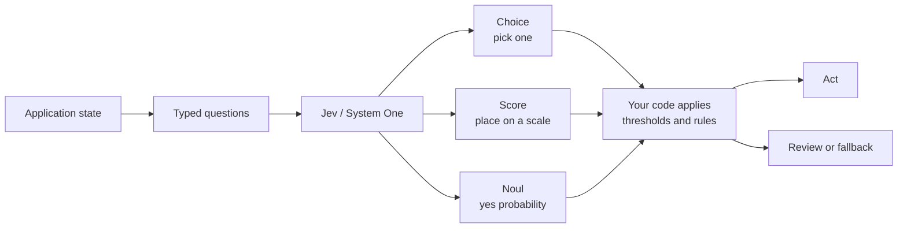
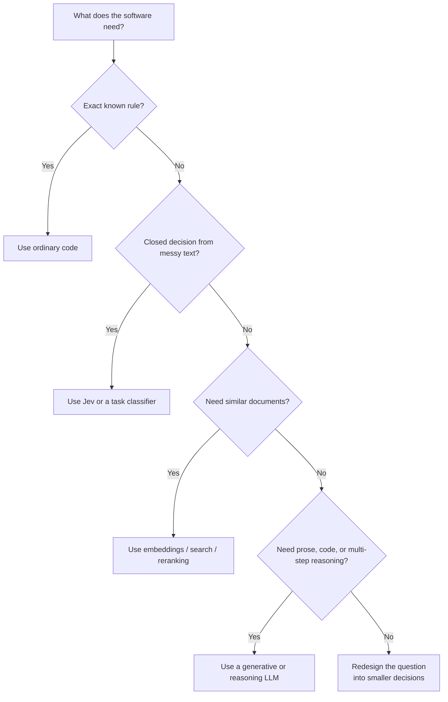

# Jev (TypeSafe AI): a simple guide to System One decisions

> **Research note — 21 September 2026**
>
> This note condenses the supplied videos, posts, repositories, and independent checks against TypeSafe AI's own documentation. It is deliberately the **guide**: what Jev is, how to use it, where it breaks, and how to try it.
>
> The deeper material — how the model probably works internally, how to grade the evidence behind each claim, and the open-source replica ecosystem — lives in [Jev-Internals-and-Open-Source-Replicas-2026](Jev-Internals-and-Open-Source-Replicas-2026.md).
>
> Product details and prices can change; the official links at the bottom are the source of truth. Note also that the supplied notes render the company variously as "TypeSafe", "Typesafe AI", and "Types AI"; the canonical name is **TypeSafe AI** (`typesafe.ai`).

## The short version

**Jev is an AI model for making small, structured judgments inside software.** You send it a `state`—a message, document, or JSON object—and one or more typed questions. It returns values your program can use directly, instead of writing a paragraph that your program must parse.

TypeSafe's own one-line framing is the clearest description available:

> "a frontier-intelligence function call: unstructured state in, typed probabilistic decisions out."

```text
POST https://api.typesafe.ai/v1/systemone

state      + typed questions        →  choice / score / noul (yes-probability)  →  ordinary code
"jev-latest"                          (responses report "jev-1.13.0")
```

- **Python SDK:** `typesafe-sdk` (requires Python ≥ 3.10); the client reads `TYPESAFE_API_KEY` and calls `jev-latest` by default.
- **Official agent skill:** `npx skills add typesafe-ai/skills --skill typesafe-ai` (also installable as a Claude Code plugin) — lets a coding agent write Jev-based code for you.
- **Playground:** `console.typesafe.ai/playground` (needs an API key from the dashboard).

It is therefore best understood as a fast **decision component**, not as a replacement for ChatGPT, Claude, or another general-purpose model.

## Why this category exists

This is the part that is easiest to skip when summarising Jev, and it is the most interesting part.

**The name is the thesis.** Jev is named after **William Stanley Jevons**, the economist behind the **Jevons paradox**: when the steam engine made coal use dramatically more efficient, total coal consumption *rose* rather than fell. TypeSafe's bet is that intelligence behaves the same way — every order-of-magnitude drop in the cost of intelligence unlocks orders of magnitude *more* use cases, not fewer.

**The founder's question.** Jev comes from **Diogo Almeida**, founder of TypeSafe and a former OpenAI researcher whose work fed into the research behind ChatGPT. His framing, from the launch post: models have been superhuman at chat for years, so where is all the automation? Two years in stealth went into building a stack aimed specifically at automation — a new architecture, a parallel sampler, and a new training objective.

**Assistance vs. automation.** The core argument is that current LLMs are trained to be *assistants*: reinforcement learning from human feedback (RLHF) and reinforcement learning from verifiable rewards (RLVR) optimize for what a human rater prefers. That is exactly the wrong objective for a component buried inside software, because a human-in-the-loop task can tolerate "usually right", while an unattended pipeline cannot. The gap Almeida points at is that **a model that can do a task 95% of the time but cannot say when it is in the 5% cannot automate that task at all.**

| | Existing LLMs | System One + Jev |
|---|---|---|
| Optimised with | RLHF / RLVR | **RLCD** — Reinforcement Learning for Calibrated Decisions |
| Optimises for | Human preference: writeups and chat replies raters like | **Calibrated decisions**: epistemically honest probabilities |
| Inputs | Unstructured text, emphasis on sequential messages | Unstructured text, emphasis on **structured program state** |
| Outputs | **Strings** — anything, including hallucinations and refusals; must be parsed and validated | **Type-safe structured values** — options and shape defined in advance |
| Sampling | **Sequential**, one token conditioned on the last | **Parallel**, all outputs in a single query |
| Cost | Input $0.20–$10 / MTok; output ~5× input | Input **$0.042 / MTok** ($42 per billion); output **free** |
| Speed | 3–329 s end-to-end for frontier models | **70–500 ms** end-to-end |
| Confidence | Overconfident and inconsistent even when asked | Always reported; calibrated, so higher confidence means higher accuracy |

**System One vs. System Two.** The framing is borrowed from Daniel Kahneman's *Thinking, Fast and Slow*: fast intuitive judgment versus slow deliberate reasoning. Jev is deliberately the former. TypeSafe acknowledges the obvious objection — "System 1 thinking" usually implies *error-prone* — and argues that a model trained for calibrated decisions can be made more reliable than the alternative, precisely because it reports its own uncertainty.

**Timeline.** Announced **15 September 2026**; launched in **early access** the same day, with developers being brought off a waitlist. If you are building a dependency on it, treat availability and pricing as moving targets.

## How to picture Jev



The key idea is the **last box**: Jev does not own the workflow. It gives your program a small judgment, and your program decides what that judgment is allowed to do.

## The three question types

| Type | Simple meaning | Returns | Example |
|---|---|---|---|
| `Choice` | Pick one item from a list | `choice`, `probabilities`, `confidence` | Which team should handle this ticket? |
| `Score` | Place something on an ordered rubric | `score`, `probabilities`, `confidence` | How frustrated is the customer: calm, civil, or angry? |
| `Noul` | Is this statement true? | `noul` (0–1) | Does this message ask for a refund? |

Details that are easy to miss:

- **The name is `Noul`.** The supplied notes variously say "Null" and "Newell"; the official primitive and the response field are both **`noul`**. (Choice and Score also return a separate `confidence`; Noul does not need one, because a yes/no distribution is fully described by the single number — "the answer and the certainty in one".)
- **A Noul is a probability, not a degree.** This is the most common misuse. If you ask "Is this candidate strong in Python?", a value of `0.4` means *the model is unsure whether the proposition is true* — it does **not** mean "40% strong". Do not invent levels in code around a Noul value; the model never saw them. **For degrees, use `Score`.**
- **Don't pack two conditions into one question.** "Is the customer angry *and* asking for a refund?" makes the number mean less. Ask two Nouls and combine them in your code.
- **Don't invert the phrasing.** "Is the message free of personal data?" reads fine to a human and backwards to the code consuming it. Phrase so that a high value means yes.
- **Question IDs are yours.** They are not sent to the model; the answers come back under the same keys.
- **All three mix in one call.** Every question is evaluated **in parallel and in isolation** against the same state. Adding questions barely changes response time, and because each question is evaluated independently, adding more questions does **not** create context rot *between questions*.
- **There is an option ceiling.** Choice cardinality is capped at **255** (the API limit). Above that, the documented workaround is a two-stage pattern: score options independently first, then make an explicit Choice over the shortlist.

## A small example

For an incoming support ticket, ask:

```text
Choice: billing, technical, or shipping?
Score:  how frustrated is the customer?
Noul:   does the customer explicitly request a human?
```

Then let code decide — note the **three-way split**, which is the recommended shape rather than a bare `if`:

```python
YES, NO = 0.8, 0.2

wants_human = answers["is_human_escalation"].noul
repeat      = answers["is_repeat_contact"].noul

if NO < wants_human < YES or NO < repeat < YES:
    send_to_review(ticket)          # the model isn't sure either way — a person decides
    return

priority = "high" if repeat > YES else "normal"
route_to_agent(ticket, priority=priority) if wants_human > YES else route_to_bot(ticket, priority=priority)
```

The model supplies judgments. **Your code owns thresholds, permissions, side effects, and the final action.** Set the threshold from the cost of being wrong: raise it when a false yes is expensive (paging someone, issuing a refund), lower it when a missed yes is expensive (failing to flag a safety issue).

## Why developers care

- **Machine-friendly output:** the answer space is defined in advance, so there is no JSON or prose to parse — and, by construction, no type errors.
- **Calibration is the real product.** Choice and Score expose a probability distribution and confidence; Noul exposes its yes probability. A *calibrated* model is one where higher confidence means higher accuracy — which is what makes a threshold in code a meaningful engineering decision rather than a guess. Use uncertainty as a reason to review or fall back.
- **Parallel fan-out:** several independent questions can be sent together, which is useful for routing, filtering, ranking, moderation, citation checks, and agent/tool selection.
- **Speed and price:** TypeSafe publishes 70–500 ms end-to-end latency and $0.042 per million input tokens with free output tokens. For scale: a creator demo classified **1,700 emails for about 18 cents**, and the official Doom demo runs at roughly 10 queries per second for about **$7 per hour**. These are vendor-published figures, not independent benchmarks — recheck before budgeting.
- **Context discipline:** unrelated material in the state costs accuracy (TypeSafe calls this **context rot**). Jev rewards sending only the fields the question needs, which is a healthy habit for the surrounding system anyway.

The practical idea is not "AI replaces the application." It is "AI supplies a fuzzy judgment at one small decision point; deterministic software controls the workflow around it." TypeSafe's official use-case list extends this to **map-reducing over big data** (turning very large corpora into features and insights) and **"verify everything"** — scoring, judging, and guardrailing LLM prompts, reasoning traces, and outputs, including jailbreak detection.

## Where it fits

Good first candidates:

- support-ticket routing and email triage (category, spam score, reply-likelihood);
- document, passage, or message classification at high volume;
- lead, risk, urgency, or quality scoring on a 0–1 or rubric scale;
- RAG filtering, reranking, citation validation, and policy alignment;
- guardrails before or after a larger language model, including verifying a reasoning trace;
- selecting one tool, skill, or workflow from a known set — trimming a large tool catalogue down to the few an agent actually needs;
- agentic coding: cheap first-pass **qualitative linting** and code review ("code smells", house-style rules) before escalating real problems to an expensive System Two model;
- adversarial or bulk testing — running large parallel test fleets for pennies and routing only failures to a human;
- content clipping and scoring (finding the most engaging segments of long-form video);
- browser and computer-use control (an agent choosing the next click, e.g. booking a flow);
- real-time loops where a 100 ms budget rules out an LLM — TypeSafe's official **Doom** and **Wikiracing** demos, and a third-party Minecraft demo where Jev takes the tactical calls while a larger model handles strategy;
- MCP-style tool routers, up to and including tool-driven chat that needs no text generation at all.

A useful metaphor from the supplied material: Jev is an **"AI traffic cop"** at the front of an expensive queue. It makes the cheap, repeatable routing call, and only the interesting cases reach the costly model.

Use a normal program or a generative/reasoning model instead when you need:

- prose, code, explanations, or a conversation;
- open-ended planning or multi-step reasoning;
- exact arithmetic, counting, date comparison, or other calculations;
- an answer that is not in a closed set or an ordered rubric;
- image, audio, or video input. The current official state documentation describes text and JSON state; the vendor's own Doom demo explicitly runs on *structured state as a text data structure*, not pixels.

The supplied material is **not consistent** about high-stakes finance: one video lists crypto trading among Jev's uses, another explicitly advises against financial trading or portfolio management. Treat the conservative reading as correct — Jev is not a market-prediction engine, and any use where being wrong is expensive needs human or stronger-model review on top.

## Jev compared with similar tools

| Approach | What it returns | Best at | How it differs from Jev |
|---|---|---|---|
| Hand-written rules | Exact conditions | Stable, explicit policy | More predictable, but cannot understand messy language well. |
| Traditional classifier | A label, often with a probability | One fixed classification task | Usually needs a fixed taxonomy and training pipeline; Jev lets each request declare its question and options. |
| Fine-tuned small model (e.g. a BERT or LoRA classifier) | A label or score | One narrow task you can afford to train and host | Cheaper per call and fully local, but one model per task, and you own training data and retraining. |
| Embeddings / vector search | Similarity between items | Finding related documents | Similarity is not the same as correctness, policy fit, or "yes/no"; Jev can judge a retrieved shortlist. |
| Cross-encoder reranker | Relevance scores or ranking | Ordering query–document pairs | Usually optimised for relevance; Jev can be steered toward a specific business question or policy. |
| General LLM with JSON mode | Generated text shaped like JSON | Explanations, extraction, and open-ended reasoning | Still generates tokens and can require parsing/validation; Jev is bounded around the decision itself. |
| **Jev** | `Choice`, `Score`, or `Noul` plus probabilities | Fast, narrow decisions inside code | Needs a well-defined question and surrounding code; it is not a writer or autonomous planner. |

A question TypeSafe anticipates and answers: **"Is Jev just a smaller LLM?"** Not in the way that matters — a smaller LLM is still optimised to produce text you then coerce into a decision. Jev gives up string generation entirely in exchange for parallel, typed, calibrated output.

### The simplest selection rule



Jev often works **alongside** these tools: search finds candidates, Jev filters or ranks them, code applies policy, and a larger LLM writes the final response only when needed. TypeSafe ships an official **`system-one-adapter-python`** wrapper that constrains ordinary LLMs to emit decisions in Jev's shape — the recommended way to make a Jev-versus-LLM comparison, and a practical fallback if you want one interface over both.

## The safest implementation pattern

1. **Prepare the state in code.** Filter irrelevant records before sending them. More context is not automatically better — unrelated detail acts as a distractor and makes a wrong answer harder to trace.
2. **Ask atomic questions.** One question per factor; combine the results with your own formula so you can retune weights in code rather than rewriting a prompt.
3. **Keep exact work in code.** Parse dates, count items, calculate totals, and enforce invariants conventionally.
4. **Write the literal condition.** Say what you mean; put boundary cases in the criteria. If you find yourself explaining what you *really* meant, that explanation is the missing half of the instruction.
5. **Set risk-based thresholds.** A low-stakes screen change can use a lower threshold than a refund, deletion, or security action. Use a middle band that routes to a human.
6. **Add a review path.** Low confidence should lead to clarification, a human, or a stronger model — not a guess.
7. **Evaluate on your own data.** "Type-safe" means the result matches the declared shape; it does not mean the chosen label is factually correct.

## What Jev is actually bad at

TypeSafe publishes a **jaggedness** page listing the known failure modes for `jev-1.13`. This is unusually candid vendor documentation and worth reading in full — the table below is a summary:

| # | Failure mode | What to do instead |
|---|---|---|
| 1 | **Literal reading** — answers the question you wrote, not the one you meant; scoping words, negations, and implied conditions are taken at face value | State the exact condition; put boundary cases in the criteria; split ambiguous intent into two literal questions |
| 2 | **Math and numbers** — not a calculator; does not count reliably (characters, occurrences, list items), and the error grows with size | Keep arithmetic and counting in code; iterate in code and ask one question per item, then add up |
| 3 | **Date and time comparison** — reads dates as text, not ordered quantities; worse with mixed formats and relative references | Extract the components (each is a small closed set → make it a Choice), assemble and compare in code |
| 4 | **Indirection** — double negatives, "property of a property", multiple reasoning hops | Write instructions as directly as possible; name the relevant parts of the state |
| 5 | **Large state full of irrelevant detail** — accuracy falls as unrelated content grows | Retrieve and filter in code first; if you can't, use a Noul to filter for relevance |
| 6 | **Adversarial content** — state is *not* treated as hostile by default; injected instructions or self-advocating text can move the answer | Be explicit in the criteria; test edge cases before deploying widely |
| 7 | **Contradictory instructions and criteria** — conflicting asks confuse the model | Treat criteria as an extension of the instruction and align the two |
| 8 | **Common-sense structural invariants** — identities you would assume hold, may not | Ask each decision one way; enforce identities in code |
| 9 | **Generation** — not trained to produce text; forcing it by chaining choices is slow and poor | Use a generative model, or turn extraction into a Choice over known options |

Point 8 deserves a concrete example, because it is the kind of assumption that silently breaks a pipeline. On the same ticket, asking "Is the customer asking for a refund?" as a Noul and as a yes/no Choice gave **0.22** versus **0.01 (yes) / 0.99 (no)** — the comparable numbers are `noul` and `probabilities["yes"]`, and they are not interchangeable. Likewise, a question and its own negation returned **0.72** and **0.47** — summing to **1.19**, not 1.0. Do not carry a threshold tuned on a Noul over to a Choice, and do not hold the model to arithmetic identities between separate questions.

Also worth noting: `jev-1.13` has a **bounded context window** (see the Models page for exact token limits), and the guidance is unambiguous — *avoid asking the model something code can compute exactly, hiding several judgments inside one question, System Two tasks, and giving it more state than the question needs.*

## Important corrections and limitations

The supplied material is directionally right, but these distinctions matter:

- **Not deterministic:** Jev returns probabilities and can be wrong. It is *extremely consistent* — expect quantitatively similar outputs for semantically similar inputs — but consistency is not correctness, and confidence is not a guarantee of truth.
- **"Can't hallucinate" is the vendor's framing.** What is guaranteed is narrower and stronger than it sounds: the output space is declared in advance, so the model cannot invent an option, emit malformed structure, or make a type error. It can still **choose the wrong valid option**. Read the claim as "no type errors, no invented labels", not "always right".
- **Not a calculator:** see the jaggedness table — counting, numeric precision, date/time comparison, indirection, contradictory criteria, adversarial content, and large irrelevant states are all documented weak spots.
- **Adversarial content is a real risk:** the model does not treat state as hostile by default, so untrusted text in the state can steer the answer. If Jev is your guardrail, remember the guardrail is itself steerable.
- **Not a general LLM:** the model gives up text generation to specialise in structured decisions. Pair it with a generative model when the system must explain or write.
- **Not open-weight.** No public weights or technical architecture paper are cited in the reviewed sources.
- **The architecture is only partly public.** TypeSafe publicly names its training method — **Reinforcement Learning for Calibrated Decisions (RLCD)** — and its **parallel sampler**, and publicly claims Jev "outputs all probabilities in parallel instead of autoregressively generating by token." What remains unpublished is the model architecture itself; see [Jev-Internals-and-Open-Source-Replicas-2026](Jev-Internals-and-Open-Source-Replicas-2026.md) for the community reconstruction.
- **Practical limits to design around:** **255** options per Choice, a bounded context window per request, and (per independent API probing, not vendor confirmation) roughly **32k tokens per question branch and 64k per request**.
- **Benchmark claims need context.** The headline **193.6× faster / 444.6× cheaper** figures come from TypeSafe's own workflow evals, and the vendor expects them to be **at the high end** of real-world gains. Its own caveats: the workflows were built by its capabilities team (possible bias); the reference answer is the *average of GPT-6 Astra and Fable 5.1*, which biases toward OpenAI and Anthropic models and probably **understates** Jev and DeepSeek; and the LLMs were constrained to structured output via TypeSafe's own adapter. The per-call claim is a range — **40×–200× faster** for System-One-shaped queries — while some video summaries quote 20×–200× faster and 40×–400× cheaper. The 0% type-error figure is not measured at all: schema matching is guaranteed, so it is asserted mathematically, not empirically. Treat all multipliers as directional.
- **Early product:** the launch announcement describes Jev as early access. Confirm model names, limits, gateway pricing, and availability before building a dependency around them.

## Going deeper

Two topics are deliberately separated out so this guide stays readable:

- **How Jev probably works internally**, and how to grade the evidence behind each claim — published, observed, inferred, or speculative.
- **The open-source replica ecosystem** — SemIf, Nimble, Decider and the rest — including where the local alternatives fall short.

Both live in [Jev-Internals-and-Open-Source-Replicas-2026](Jev-Internals-and-Open-Source-Replicas-2026.md).

## A simple mental model

```text
Traditional LLM:
  input → generated text → parser/validator → application logic

Jev:
  state + closed question → typed probability/choice/score → application logic

Best production pattern:
  Jev for narrow judgments + code for control + a larger model for language/reasoning
```

Or, in one line: **a calibrated gut-check you can put in an `if` statement.**

## How to try it

1. **Playground** — `console.typesafe.ai/playground`; paste a state, add a Noul question, then mix all three types in one call.
2. **API** — `POST https://api.typesafe.ai/v1/systemone` with a bearer key; see the API reference for the full schema.
3. **Python SDK** — `pip install typesafe-sdk` (Python ≥ 3.10).
4. **Agent skill** — `npx skills add typesafe-ai/skills --skill typesafe-ai`, or install the Claude Code plugin, then ask your coding agent to build with Jev.
5. **Waitlist** — the launch post says early access is being opened from a waitlist; expect names, limits, and prices to move.

## Sources

**Official documentation**

- [Introduction](https://docs.typesafe.ai/introduction) · [System One concept](https://docs.typesafe.ai/concepts/system-one) · [AI primer](https://docs.typesafe.ai/introduction/machine-learning-primer) — purpose, the System One framing, and why TypeSafe trains for calibrated decisions rather than generated text.
- [Quick start](https://docs.typesafe.ai/introduction/quickstart) · [API reference](https://docs.typesafe.ai/api) · [SDKs](https://docs.typesafe.ai/sdk) · [Agent skill](https://docs.typesafe.ai/agent-skill) — endpoint, request/response shape, clients, and coding-agent integration.
- [Primitives](https://docs.typesafe.ai/primitives): [Choice](https://docs.typesafe.ai/primitives/choice) · [Score](https://docs.typesafe.ai/primitives/score) · [Noul](https://docs.typesafe.ai/primitives/noul) — official semantics, response fields, and phrasing rules.
- [Confidence](https://docs.typesafe.ai/confidence) · [State](https://docs.typesafe.ai/concepts/state) · [Patterns](https://docs.typesafe.ai/patterns) · [Models](https://docs.typesafe.ai/models) — calibration, supported state, recommended patterns, and hard limits.
- [Jev 1.13 jaggedness](https://docs.typesafe.ai/model-jaggedness/jev-1.13) — the official failure-mode list and fallbacks (last reviewed 2026-09-17).
- [Introducing System One Models & Jev](https://typesafe.ai/blog/introducing-system-one-models-and-jev) — Diogo Almeida's launch post: RLCD, the RLHF contrast, pricing, latency, demo economics, and the benchmark caveats.
- [Workflow evaluations](https://evals.typesafe.ai/) · [GitHub org](https://github.com/typesafe-ai) · [system-one-adapter-python](https://github.com/typesafe-ai/system-one-adapter-python) · [skills](https://github.com/typesafe-ai/skills)
- Cookbooks: [classifying RAG passages](https://docs.typesafe.ai/cookbooks/classifying_rag_passages) · [skill suggestion](https://docs.typesafe.ai/cookbooks/skill_suggestion) · [date extraction](https://docs.typesafe.ai/cookbooks/date_extraction_cookbook)

**Supplied video and community references**

These are retained as the original discovery material; their claims were simplified and checked against the official sources above. Sources specific to the internals and the replica ecosystem are listed in the companion note.

- [What is Jev?](https://www.youtube.com/watch?v=ZgXej_9isxY) · [System One overview](https://www.youtube.com/watch?v=CcmqPS6q9Gw) · [Jev for RAG reranking](https://www.youtube.com/watch?v=UhGH8cNG0qs)
- [Open-source Jev alternatives](https://www.youtube.com/watch?v=53wDOI_7x8I) · [Jev for agentic coding](https://www.youtube.com/watch?v=ScvXFi4MUSc) · [Fast classification introduction](https://www.youtube.com/watch?v=4mTLpuQpB80)
- [System One classification overview](https://www.youtube.com/watch?v=X117w2Rark8) · [Jev benchmarks and limitations](https://www.youtube.com/watch?v=2XFXe-oGnrI) · [Assistance versus automation](https://www.youtube.com/watch?v=cJ0EOzey--o) (Diogo Almeida on RLHF vs. calibrated decision-making)
- [LangChain post](https://x.com/langchain/status/2101454284927959080) · [Avi Chawla post](https://x.com/_avichawla/status/2101563610644496464) · [Akshay Pachaar post](https://x.com/akshay_pachaar/status/2101037514945597645)

**Related:**
- [Jev-Internals-and-Open-Source-Replicas-2026](Jev-Internals-and-Open-Source-Replicas-2026.md) — Companion note: how the model probably works internally, how to grade the evidence, and the open-source replica ecosystem.
- [RAG-Guide-Jan-2026](../../../RAG/RAG-Guide-Jan-2026.md) — Retrieval pipelines where Jev-style filtering, reranking, and citation checks fit.
- [GenAI-cost-Optimization](../../optimization/GenAI-cost-Optimization.md) — Broader model-routing and cost-control context; Jev is the extreme cheap-tier case.
- [LLM-Benchmarks](../../architecture/LLM-Benchmarks.md) — How to read vendor-published evaluation numbers like the 193.6×/444.6× claims.
- [Agent-Skills](../../../Agents/skills/Agent-Skills.md) — Agent capabilities and workflow composition that can use decision gates.
