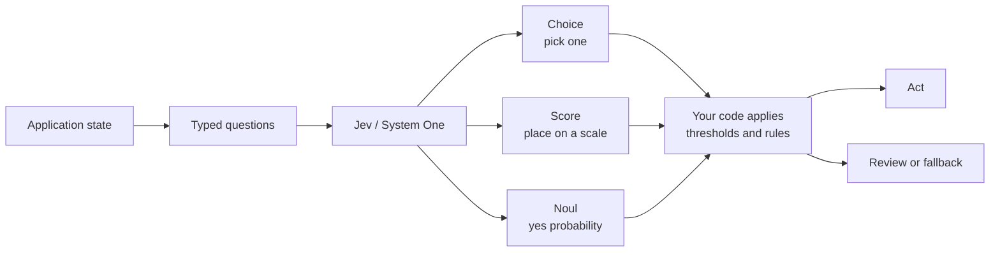
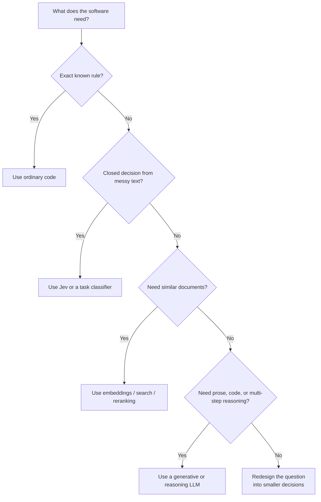

# Jev (TypeSafe AI): a simple guide to System One decisions

> **Research note — 21 September 2026**
>
> This note condenses the supplied videos, posts, repositories, and independent checks against TypeSafe AI's own documentation. Product details and prices can change; the official links below are the source of truth.

## The short version

**Jev is an AI model for making small, structured judgments inside software.** You send it a `state`—a message, document, or JSON object—and one or more typed questions. It returns values your program can use directly, instead of writing a paragraph that your program must parse.

The current API examples use the model alias `jev-latest` (currently reported as `jev-1.13.0`).

```text
state + typed questions → choice / score / yes-no probability → ordinary code
```

It is therefore best understood as a fast **decision component**, not as a replacement for ChatGPT, Claude, or another general-purpose model.

## How to picture Jev



The key idea is the **last box**: Jev does not own the workflow. It gives your program a small judgment, and your program decides what that judgment is allowed to do.

## The three question types

| Type | Simple meaning | Example |
|---|---|---|
| `Choice` | Pick one item from a list | Which team should handle this ticket? |
| `Score` | Place something on an ordered scale | How severe is this bug: low, medium, high? |
| `Noul` | Estimate whether a yes/no statement is true | Does this message ask for a refund? |

`Choice` returns the selected option, probabilities for all options, and confidence. `Score` returns a numeric position on the levels you define, probabilities, and confidence. `Noul` returns one number from 0 to 1: the probability that the answer is **yes**. The name is **Noul**—the supplied notes variously call it “Null” and “Newell,” but those are not the official API names.

All three can be asked in one request. They are evaluated independently against the same state, so software can ask several small questions and combine the results with normal `if` statements.

## A small example

For an incoming support ticket, ask:

```text
Choice: billing, technical, or shipping?
Score: how frustrated is the customer?
Noul: does the customer explicitly request a human?
```

Then let code decide:

```text
high confidence + technical → send to the technical queue
low confidence              → ask for clarification or send to review
human requested             → escalate
```

The model supplies judgments. **Your code owns thresholds, permissions, side effects, and the final action.**

## Why developers care

- **Machine-friendly output:** the answer space is defined in advance, so there is no JSON or prose to parse.
- **Confidence-aware workflows:** `Choice` and `Score` expose a probability distribution and confidence; `Noul` exposes its yes probability. Use uncertainty as a reason to review or fall back.
- **Parallel fan-out:** several independent questions can be sent together, which is useful for routing, filtering, ranking, moderation, citation checks, and agent/tool selection.
- **Speed and price:** TypeSafe currently publishes 70–500 ms end-to-end latency and $0.042 per million input tokens, with output tokens free. These are vendor-published figures, not an independent benchmark, and should be rechecked before budgeting.

The practical idea is not “AI replaces the application.” It is “AI supplies a fuzzy judgment at one small decision point; deterministic software controls the workflow around it.”

## Where it fits

Good first candidates:

- support-ticket routing and email triage;
- document or passage classification;
- lead, risk, urgency, or quality scoring;
- RAG filtering and reranking;
- citation or policy checks;
- guardrails before or after a larger language model;
- selecting one tool, skill, or workflow from a known set.

Use a normal program or a generative/reasoning model instead when you need:

- prose, code, explanations, or a conversation;
- open-ended planning or multi-step reasoning;
- exact arithmetic, counting, date comparison, or other calculations;
- an answer that is not in a closed set or an ordered rubric;
- image, audio, or video input. The current official state documentation describes text and JSON state, not those media types.

## Jev compared with similar tools

| Approach | What it returns | Best at | How it differs from Jev |
|---|---|---|---|
| Hand-written rules | Exact conditions | Stable, explicit policy | More predictable, but cannot understand messy language well. |
| Traditional classifier | A label, often with a probability | One fixed classification task | Usually needs a fixed taxonomy and training pipeline; Jev lets each request declare its question and options. |
| Embeddings / vector search | Similarity between items | Finding related documents | Similarity is not the same as correctness, policy fit, or “yes/no”; Jev can judge a retrieved shortlist. |
| Cross-encoder reranker | Relevance scores or ranking | Ordering query–document pairs | Usually optimized for relevance; Jev can be steered toward a specific business question or policy. |
| General LLM with JSON mode | Generated text shaped like JSON | Explanations, extraction, and open-ended reasoning | Still generates tokens and can require parsing/validation; Jev is bounded around the decision itself. |
| **Jev** | `Choice`, `Score`, or `Noul` plus probabilities | Fast, narrow decisions inside code | Needs a well-defined question and surrounding code; it is not a writer or autonomous planner. |

### The simplest selection rule



Jev often works **alongside** these tools: search finds candidates, Jev filters or ranks them, code applies policy, and a larger LLM writes the final response only when needed.

## The safest implementation pattern

1. **Prepare the state in code.** Filter irrelevant records before sending them. More context is not automatically better.
2. **Ask atomic questions.** Split a complicated judgment into small, literal questions.
3. **Keep exact work in code.** Parse dates, count items, calculate totals, and enforce invariants conventionally.
4. **Set risk-based thresholds.** A low-stakes screen change can use a lower threshold than a refund, deletion, or security action.
5. **Add a review path.** Low confidence should lead to clarification, a human, or a stronger model—not a guess.
6. **Evaluate on your own data.** “Type-safe” means the result matches the declared shape; it does not mean the chosen label is factually correct.

## Important corrections and limitations

The supplied material is directionally right, but these distinctions matter:

- **Not deterministic:** Jev returns probabilities and can be wrong. Similar inputs may be treated consistently, but confidence is not a guarantee of truth.
- **Not “zero hallucinations” in the broad sense:** it cannot invent an undeclared output shape or option, but it can choose the wrong valid option.
- **Not a calculator:** TypeSafe's own jaggedness guide warns about counting, numeric precision, date/time comparison, indirection, contradictory criteria, adversarial content, and large irrelevant states.
- **Not a general LLM:** the model gives up text generation to specialize in structured decisions. Pair it with a generative model when the system must explain or write.
- **Implementation details are not all public:** community projects often describe logit or prefill techniques, but TypeSafe publicly confirms the behavior and interface—not that exact internal mechanism for Jev.
- **Benchmark claims need context:** the 193.6× faster / 444.6× cheaper figures come from TypeSafe's own workflow comparisons, with vendor-selected workflows and reference models. Treat them as a useful signal, not a universal guarantee.
- **Early product:** the launch announcement describes Jev as early access. Confirm model names, limits, gateway pricing, and availability before building a dependency around them.

## A simple mental model

```text
Traditional LLM:
  input → generated text → parser/validator → application logic

Jev:
  state + closed question → typed probability/choice/score → application logic

Best production pattern:
  Jev for narrow judgments + code for control + a larger model for language/reasoning
```

## Open-source projects in the supplied material

The listed projects are useful for learning, experimentation, or local alternatives, but they are **community implementations or replicas**, not proof that TypeSafe's proprietary Jev weights are open:

- [awesome-jev](https://github.com/fatwang2/awesome-jev) — ecosystem list.
- [SemIf](https://github.com/TheoLeeCJ/SemIf) — open classification-oriented implementation.
- [building-with-jev-skill](https://github.com/dbreunig/building-with-jev-skill) — community skill and examples for building with Jev.
- [localjev](https://github.com/githubnext/localjev) — local experimentation.
- [fast-jev-compaction](https://github.com/tamaratran/fast-jev-compaction) — community project focused on compact decisions.
- [simple-jev](https://github.com/featherless-ai/simple-jev) and its [playground](https://simple-jev.featherless.ai/) — alternative implementation/demo.
- [Open-Jev on Hugging Face](https://huggingface.co/spaces/pngwn/open-jev) — community demo.

## Sources

### Independent primary verification

- [TypeSafe introduction](https://docs.typesafe.ai/introduction) — model purpose, state/questions, primitives, and parallel evaluation.
- [TypeSafe quick start](https://docs.typesafe.ai/introduction/quickstart) — API endpoint, request/response examples, SDK usage.
- [Choice](https://docs.typesafe.ai/primitives/choice), [Score](https://docs.typesafe.ai/primitives/score), and [Noul](https://docs.typesafe.ai/primitives/noul) — official semantics and response fields.
- [Confidence](https://docs.typesafe.ai/confidence) — how confidence differs from probability and how to gate actions.
- [State](https://docs.typesafe.ai/concepts/state) — supported text/JSON state and media limitation.
- [Jev 1.13 jaggedness](https://docs.typesafe.ai/model-jaggedness/jev-1.13) — official failure modes and recommended fallbacks.
- [Introducing System One Models & Jev](https://typesafe.ai/blog/introducing-system-one-models-and-jev) — launch date, System One framing, vendor speed/cost claims, and methodology caveats.
- [TypeSafe workflow evaluations](https://evals.typesafe.ai/) — vendor workflow-evaluation design and examples.
- [TypeSafe official GitHub organization](https://github.com/typesafe-ai) — official SDKs and adapter repositories.

### Supplied video and community references

These are retained as the original discovery material; their claims were simplified and checked against the official sources above:

- [What is Jev?](https://www.youtube.com/watch?v=ZgXej_9isxY) · [System One overview](https://www.youtube.com/watch?v=CcmqPS6q9Gw) · [Jev for RAG reranking](https://www.youtube.com/watch?v=UhGH8cNG0qs)
- [Open-source Jev alternatives](https://www.youtube.com/watch?v=53wDOI_7x8I) · [Jev for agentic coding](https://www.youtube.com/watch?v=ScvXFi4MUSc) · [Fast classification introduction](https://www.youtube.com/watch?v=4mTLpuQpB80)
- [System One classification overview](https://www.youtube.com/watch?v=X117w2Rark8) · [Jev benchmarks and limitations](https://www.youtube.com/watch?v=2XFXe-oGnrI) · [Assistance versus automation](https://www.youtube.com/watch?v=cJ0EOzey--o)
- [LangChain post](https://x.com/langchain/status/2101454284927959080) · [Avi Chawla post](https://x.com/_avichawla/status/2101563610644496464) · [Akshay Pachaar post](https://x.com/akshay_pachaar/status/2101037514945597645)
- [Jev architecture article](https://archerhume.com/posts/jevs-architecture-unmasked/?v=3)

**Related:**
- [RAG-Guide-Jan-2026](../../../RAG/RAG-Guide-Jan-2026.md) — Retrieval pipelines where Jev-style filtering and reranking can be useful.
- [GenAI-cost-Optimization](../../optimization/GenAI-cost-Optimization.md) — Broader model-routing and cost-control context.
- [LLM-Inference](../../architecture/LLM-Inference.md) — Why latency, throughput, and inference design matter in production.
- [Agent-Skills](../../../Agents/skills/Agent-Skills.md) — Agent capabilities and workflow composition that can use decision gates.
