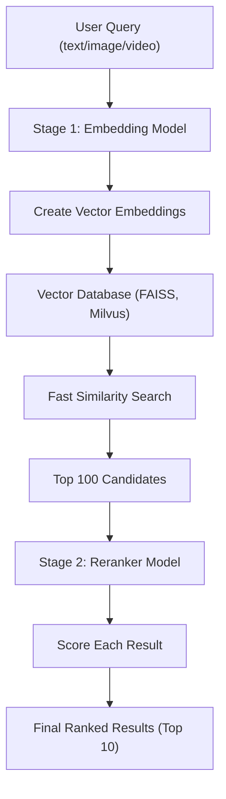
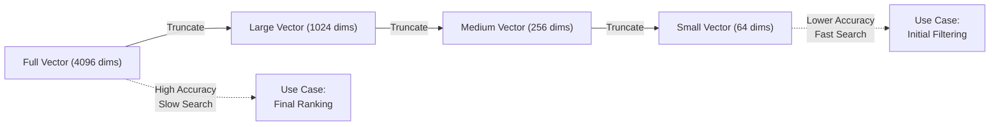
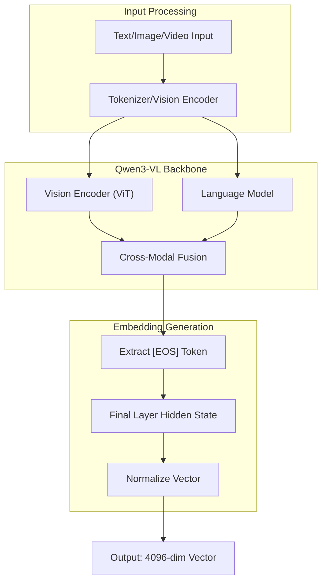
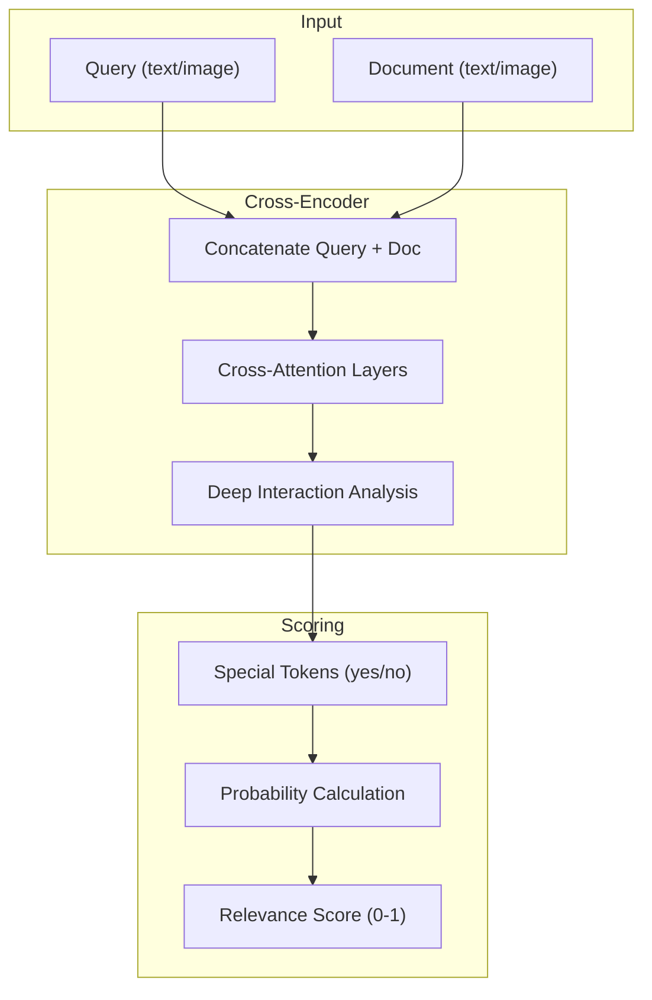
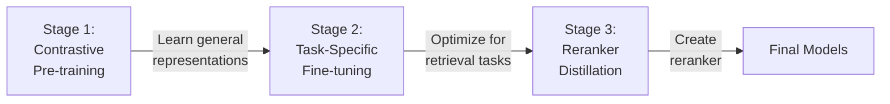

# Qwen3-VL-Embedding and Qwen3-VL-Reranker

## Simple Developer and Architect Guide

---

## What Are These Models?

Qwen3-VL-Embedding and Qwen3-VL-Reranker are open-source AI models from Alibaba's Qwen team, released in January 2026. They help you search and rank information across text, images, videos, and documents in a single system.

**Think of it like this:**
- **Embedding Model**: Converts anything (text, images, videos) into numbers that computers can compare
- **Reranker Model**: Takes search results and sorts them by relevance

---

## Why Use These Models?

### Key Benefits

1. **Unified Search**: Search with text and get matching images, or vice versa
2. **Flexible Size**: Choose between 2B (smaller, faster) or 8B (more accurate) versions
3. **Multilingual**: Works with over 30 languages
4. **Long Context**: Handles up to 32,000 tokens (roughly 24,000 words)
5. **Free**: Apache 2.0 license means you can use it commercially

### Real-World Uses

- **E-commerce**: "Find green version of this shirt" with an image
- **Document Search**: Search PDFs without OCR
- **Video Search**: Find specific scenes in videos
- **Multimodal RAG**: Build AI assistants that understand images and text

---

## How It Works

The models work in two stages:



**Stage 1 - Embedding (Fast Recall)**
- Converts inputs to vectors (arrays of numbers)
- Searches millions of items quickly
- Returns top 100 candidates

**Stage 2 - Reranking (Precise Scoring)**
- Analyzes query-document pairs deeply using cross-attention
- Scores candidates 0-1 for relevance
- Returns final top 10 results

---

## Performance Benchmarks

### MMEB-V2 Benchmark (Multimodal Embedding)

| Model | Size | Score | Rank |
|-------|------|-------|------|
| Qwen3-VL-Embedding-8B | 8B | 77.8 | #1 |
| Qwen3-VL-Embedding-2B | 2B | 73.2 | Top 5 |

The 8B model achieved a 6.7% improvement over the previous best open-source model, beating both open and closed-source competitors.

### What This Means

- **8B Model**: Best accuracy, needs more resources (6GB+ GPU memory)
- **2B Model**: Good accuracy, faster, works on smaller GPUs

---

## Key Technology: Matryoshka Embeddings

Matryoshka Representation Learning (MRL) allows you to use smaller vector sizes without retraining.

**How It Works:**

Think of Russian nesting dolls. A 4096-dimension vector contains useful information at every level:
- First 64 dimensions: Basic meaning
- First 256 dimensions: More detail  
- First 1024 dimensions: Rich detail
- All 4096 dimensions: Full detail

**Benefits:**



This enables a two-step process: shortlist with small vectors, then rerank with full vectors for final accuracy.

**Real Impact:**
- 10x faster search with 256 dims vs 4096 dims
- 95%+ accuracy maintained
- Massive storage savings

---

## Getting Started

### Installation

```bash
# Install required packages
pip install transformers torch pillow

# For faster inference
pip install vllm
```

### Example 1: Basic Text Embedding

```python
import torch
from transformers import AutoModel, AutoTokenizer

# Load model (choose 2B or 8B)
model_name = "Qwen/Qwen3-VL-Embedding-2B"
model = AutoModel.from_pretrained(model_name, trust_remote_code=True)
tokenizer = AutoTokenizer.from_pretrained(model_name, trust_remote_code=True)

# Create embeddings
texts = [
    "A dog playing on the beach",
    "A cat sleeping on a sofa",
    "Ocean waves at sunset"
]

# Tokenize
inputs = tokenizer(texts, padding=True, truncation=True, return_tensors="pt")

# Generate embeddings
with torch.no_grad():
    outputs = model(**inputs)
    embeddings = outputs.last_hidden_state[:, -1]  # Use last token

# Normalize for cosine similarity
embeddings = torch.nn.functional.normalize(embeddings, p=2, dim=1)

# Calculate similarity
similarity = embeddings[0] @ embeddings[1].T
print(f"Similarity: {similarity.item():.3f}")
```

### Example 2: Image + Text Search

```python
from src.models.qwen3_vl_embedding import Qwen3VLEmbedder

# Initialize
model = Qwen3VLEmbedder(
    model_name_or_path="Qwen/Qwen3-VL-Embedding-2B"
)

# Define queries (can be text or images)
queries = [
    {"text": "A woman playing with her dog on a beach"},
    {"text": "City skyline at night"}
]

# Define documents (text, images, or both)
documents = [
    {"text": "A joyful beach scene with a golden retriever"},
    {"image": "path/to/beach_photo.jpg"},
    {"text": "Description text", "image": "path/to/image.jpg"}
]

# Generate embeddings
query_embeddings = model.encode(queries)
doc_embeddings = model.encode(documents)

# Find top matches
import numpy as np
scores = np.dot(query_embeddings, doc_embeddings.T)
top_matches = np.argsort(scores[0])[::-1][:5]
```

### Example 3: Reranking Results

```python
from transformers import AutoModelForSequenceClassification

# Load reranker
reranker = AutoModelForSequenceClassification.from_pretrained(
    "Qwen/Qwen3-VL-Reranker-2B",
    trust_remote_code=True
)

# Prepare query-document pairs
query = "Find information about AI"
candidates = [
    "Artificial Intelligence is transforming industries",
    "The weather today is sunny",
    "Machine learning is a subset of AI"
]

# Score each pair
scores = []
for doc in candidates:
    pair = f"Query: {query}\nDocument: {doc}"
    inputs = tokenizer(pair, return_tensors="pt")
    with torch.no_grad():
        score = reranker(**inputs).logits[0][0]
    scores.append(score.item())

# Sort by score
ranked = sorted(zip(candidates, scores), key=lambda x: x[1], reverse=True)
for doc, score in ranked:
    print(f"{score:.3f}: {doc}")
```

### Example 4: Full RAG Pipeline

```python
import faiss
import numpy as np

# 1. Create vector database
dimension = 4096
index = faiss.IndexFlatIP(dimension)  # Inner product for cosine similarity

# 2. Add documents
documents = ["doc1", "doc2", "doc3"]  # Your documents
doc_embeddings = model.encode(documents)
index.add(doc_embeddings)

# 3. Search
query = "Your search query"
query_embedding = model.encode([query])
k = 100  # Get top 100 candidates

distances, indices = index.search(query_embedding, k)

# 4. Rerank top candidates
top_candidates = [documents[i] for i in indices[0]]
reranked = reranker.rerank(query, top_candidates)

# 5. Get final results
final_results = reranked[:10]
```

---

## Using Matryoshka Embeddings

### Shortlist and Rerank Strategy

```python
# Generate full embeddings once
full_embeddings = model.encode(documents)  # Shape: (N, 4096)

# Stage 1: Fast shortlist with small vectors
small_embeddings = full_embeddings[:, :256]  # Use first 256 dims
index_small = faiss.IndexFlatIP(256)
index_small.add(small_embeddings)

# Quick search gets 1000 candidates
_, candidates = index_small.search(query_embedding[:, :256], k=1000)

# Stage 2: Precise rerank with full vectors
candidate_full_embeddings = full_embeddings[candidates[0]]
scores = query_embedding @ candidate_full_embeddings.T
top_100 = np.argsort(scores[0])[::-1][:100]

# Stage 3: Final rerank with reranker model
final_results = reranker.rerank(query, [documents[i] for i in top_100])
```

**Speed Comparison:**
- Full 4096 dims: 100ms per query
- 256 dims: 10ms per query (10x faster!)
- Accuracy loss: <5%

---

## Architecture Deep Dive

### Embedding Model Architecture



**Key Components:**
- Dual-tower architecture extracts vectors from a special end token
- Vision and text processed in unified space
- Supports variable-length inputs

### Reranker Model Architecture



**Key Features:**
- Cross-attention mechanism enables deeper query-document interaction
- Outputs precise relevance score by predicting special token probabilities
- Much slower than embedding but more accurate

---

## Training Process

The models use multi-stage training:



The embedding model uses contrastive pre-training followed by reranking distillation to generate rich high-dimensional vectors.

---

## Deployment Options

### Option 1: Local Deployment (Hugging Face)

**Pros:**
- Full control
- No API costs
- Privacy

**Cons:**
- Requires GPU (6GB+ for 2B, 16GB+ for 8B)
- You manage infrastructure

**Best for:** Development, small-scale apps, privacy-sensitive use cases

### Option 2: vLLM for Scale

```python
from vllm import LLM

# Load model with vLLM for better performance
model = LLM(
    model="Qwen/Qwen3-VL-Embedding-2B",
    distributed_executor_backend="mp"
)

# Batch processing (much faster)
outputs = model.embed(large_text_list)
```

**Best for:** Production, high-throughput applications

### Option 3: Cloud APIs

Use Alibaba Cloud API for managed inference.

**Best for:** Quick prototyping, no infrastructure management

---

## Performance Optimization Tips

### 1. Choose the Right Model Size

```python
# Development/Testing
model = "Qwen/Qwen3-VL-Embedding-2B"  # Faster, less memory

# Production
model = "Qwen/Qwen3-VL-Embedding-8B"  # Better accuracy
```

### 2. Use Appropriate Vector Dimensions

```python
# For 1M+ documents
embedding_dim = 256  # Fast search, good accuracy

# For <100K documents  
embedding_dim = 1024  # Better accuracy

# For final reranking
embedding_dim = 4096  # Best accuracy
```

### 3. Batch Processing

```python
# Bad: Process one at a time
for text in texts:
    embedding = model.encode([text])

# Good: Process in batches
batch_size = 32
embeddings = model.encode(texts, batch_size=batch_size)
```

### 4. Enable Flash Attention

```python
model = AutoModel.from_pretrained(
    model_name,
    torch_dtype=torch.bfloat16,
    attn_implementation="flash_attention_2"  # 2-3x faster
)
```

### 5. GPU Memory Management

```python
# For large models on limited GPU
model = AutoModel.from_pretrained(
    model_name,
    device_map="auto",  # Automatic device placement
    load_in_8bit=True   # Quantization
)
```

---

## Comparison with Alternatives

### vs. CLIP (OpenAI)

| Feature | Qwen3-VL-Embedding | CLIP |
|---------|-------------------|------|
| Modalities | Text, Image, Video, Docs | Text, Image only |
| Context Length | 32K tokens | 77 tokens |
| Video Support | ✅ Native | ❌ Frame-by-frame |
| Open Source | ✅ Apache 2.0 | ✅ MIT |
| Multilingual | 30+ languages | Limited |

### vs. Text-Only Models (Qwen3-Embedding)

| Feature | Qwen3-VL-Embedding | Qwen3-Embedding |
|---------|-------------------|-----------------|
| Images | ✅ | ❌ |
| Videos | ✅ | ❌ |
| Text Performance | Excellent | Excellent |
| Use Case | Multimodal search | Text-only search |

### vs. Closed Models (Gemini, GPT-4V)

| Feature | Qwen3-VL-Embedding | Closed Models |
|---------|-------------------|---------------|
| Cost | Free (self-hosted) | API fees |
| Privacy | Full control | Data sent to API |
| Customization | Trainable | Limited |
| Performance | Competitive or better | Variable |

---

## Common Issues and Solutions

### Issue 1: Out of Memory

**Problem:** Model doesn't fit in GPU memory

**Solutions:**
```python
# Solution 1: Use smaller model
model = "Qwen/Qwen3-VL-Embedding-2B"  # Instead of 8B

# Solution 2: Use quantization
model = AutoModel.from_pretrained(
    model_name,
    load_in_8bit=True  # or load_in_4bit=True
)

# Solution 3: Use CPU (slower)
model = AutoModel.from_pretrained(
    model_name,
    device_map="cpu"
)
```

### Issue 2: Slow Inference

**Problem:** Embedding generation is too slow

**Solutions:**
```python
# Solution 1: Batch processing
embeddings = model.encode(texts, batch_size=32)

# Solution 2: Use vLLM
from vllm import LLM
model = LLM(model="Qwen/Qwen3-VL-Embedding-2B")

# Solution 3: Reduce vector dimensions
embeddings = full_embeddings[:, :256]  # Use Matryoshka
```

### Issue 3: Poor Search Results

**Problem:** Search doesn't return relevant results

**Solutions:**
```python
# Solution 1: Add instructions
query = {
    "text": "your query",
    "instruction": "Retrieve documents about [specific topic]"
}

# Solution 2: Use reranker
candidates = embedding_search(query, k=100)
final = reranker.rerank(query, candidates)[:10]

# Solution 3: Normalize embeddings
embeddings = F.normalize(embeddings, p=2, dim=1)
```

---

## Best Practices

### 1. Two-Stage Retrieval

Always use embedding for recall, reranker for precision:

```python
# Stage 1: Get 100 candidates (fast)
candidates = embedding_model.search(query, k=100)

# Stage 2: Rerank to top 10 (accurate)
results = reranker.score(query, candidates)[:10]
```

### 2. Use Instructions

Using task-specific instructions typically yields 1-5% improvement:

```python
# Without instruction
query = {"text": "machine learning"}

# With instruction (better)
query = {
    "text": "machine learning",
    "instruction": "Retrieve research papers about AI techniques"
}
```

### 3. Multilingual Tips

For multilingual contexts, write instructions in English, as most training instructions were in English:

```python
# Query in Chinese, instruction in English
query = {
    "text": "机器学习",  # Chinese query
    "instruction": "Retrieve academic papers"  # English instruction
}
```

### 4. Monitor VRAM

Track GPU memory to prevent crashes:

```python
import torch

# Check available memory
print(f"GPU Memory: {torch.cuda.get_device_properties(0).total_memory / 1e9:.2f} GB")

# Monitor usage
print(f"Used: {torch.cuda.memory_allocated(0) / 1e9:.2f} GB")
```

---

## Sample Use Cases

### Use Case 1: E-Commerce Image Search

```python
# Customer uploads a product image
customer_image = "uploaded_shoe.jpg"

# Search product catalog
query = {
    "image": customer_image,
    "instruction": "Find similar products"
}

# Get similar products
embeddings = model.encode([query] + product_catalog)
scores = embeddings[0] @ embeddings[1:].T
top_products = np.argsort(scores)[::-1][:20]

# Rerank for best matches
final = reranker.rerank(query, [product_catalog[i] for i in top_products])
```

### Use Case 2: Document QA with Images

```python
# PDF with charts and text
documents = [
    {"text": "Q3 revenue increased 25%", "image": "chart1.png"},
    {"text": "Market analysis shows growth", "image": "chart2.png"}
]

# User question
question = "What was the revenue growth?"

# Semantic search
doc_embeddings = model.encode(documents)
query_embedding = model.encode([{"text": question}])
scores = query_embedding @ doc_embeddings.T
best_doc = documents[np.argmax(scores)]

# Use with LLM for answer generation
# answer = llm.generate(question, context=best_doc)
```

### Use Case 3: Video Moment Retrieval

```python
# Index video frames
video_frames = extract_frames("lecture.mp4", fps=1)  # 1 frame/sec
frame_embeddings = model.encode([{"image": f} for f in video_frames])

# Find specific moment
query = {"text": "When does the speaker discuss AI safety?"}
query_embedding = model.encode([query])
scores = query_embedding @ frame_embeddings.T
timestamp = np.argmax(scores)  # In seconds

print(f"AI safety discussed at {timestamp}s")
```

---

## Resources and References

### Official Links

- **GitHub Repository**: [github.com/QwenLM/Qwen3-VL-Embedding](https://github.com/QwenLM/Qwen3-VL-Embedding)
- **Hugging Face**: 
  - [Qwen3-VL-Embedding-2B](https://huggingface.co/Qwen/Qwen3-VL-Embedding-2B)
  - [Qwen3-VL-Embedding-8B](https://huggingface.co/Qwen/Qwen3-VL-Embedding-8B)
  - [Qwen3-VL-Reranker-2B](https://huggingface.co/Qwen/Qwen3-VL-Reranker-2B)
  - [Qwen3-VL-Reranker-8B](https://huggingface.co/Qwen/Qwen3-VL-Reranker-8B)
- **Technical Paper**: [arXiv:2601.04720](https://arxiv.org/abs/2601.04720)
- **Blog Post**: [qwen.ai/blog?id=qwen3-vl-embedding](https://qwen.ai/blog?id=qwen3-vl-embedding)

### Benchmarks

- **MMEB-V2 Leaderboard**: [huggingface.co/spaces/TIGER-Lab/MMEB-Leaderboard](https://huggingface.co/spaces/TIGER-Lab/MMEB-Leaderboard)
- **MTEB Leaderboard**: [huggingface.co/spaces/mteb/leaderboard](https://huggingface.co/spaces/mteb/leaderboard)

### Related Papers

- Matryoshka Representation Learning: [arxiv.org/abs/2205.13147](https://arxiv.org/abs/2205.13147)
- VLM2Vec (MMEB Benchmark): [github.com/TIGER-AI-Lab/VLM2Vec](https://github.com/TIGER-AI-Lab/VLM2Vec)

### Community

- **Issues/Questions**: GitHub Issues
- **Discussions**: Hugging Face Forums
- **Updates**: Follow [@Alibaba_Qwen](https://x.com/Alibaba_Qwen) on X (Twitter)

---

## Quick Start Checklist

✅ **Setup**
- [ ] Install Python 3.8+
- [ ] Install transformers: `pip install transformers torch`
- [ ] Have 6GB+ GPU memory (for 2B model)

✅ **First Steps**
- [ ] Download model from Hugging Face
- [ ] Test basic text embedding
- [ ] Try image + text example
- [ ] Understand Matryoshka truncation

✅ **Production**
- [ ] Set up vector database (FAISS/Milvus)
- [ ] Implement two-stage retrieval
- [ ] Add reranker for precision
- [ ] Monitor performance metrics

✅ **Optimization**
- [ ] Use appropriate batch sizes
- [ ] Enable Flash Attention
- [ ] Choose optimal vector dimensions
- [ ] Profile GPU memory usage

---

## Summary

**Qwen3-VL-Embedding and Qwen3-VL-Reranker** provide state-of-the-art multimodal search capabilities:

- **Unified System**: Search across text, images, videos, and documents
- **Flexible**: 2B and 8B sizes, Matryoshka dimensions, 30+ languages
- **Production-Ready**: Apache 2.0 license, extensive documentation
- **Best Performance**: #1 on MMEB-V2 benchmark

**When to Use:**
- Building multimodal RAG systems
- E-commerce visual search
- Document retrieval with images
- Video content search
- Any cross-modal search application

**Getting Started:**
1. Start with 2B model for testing
2. Use Matryoshka embeddings (256-1024 dims)
3. Implement two-stage retrieval
4. Scale to 8B model for production

**Next Steps:**
- Try the code examples
- Read the official documentation
- Join the community
- Build your first multimodal search app!

---

**Related:**
- [RAG-Architectures](../../../RAG/RAG-Architectures.md) — The two-stage retrieval pipeline (embedding recall -> reranker precision) is the canonical Tier 1 hybrid RAG architecture described here.
- [RAG-Guide-Jan-2026](../../../RAG/RAG-Guide-Jan-2026.md) — Provides foundational chunking, retrieval, and evaluation context that the Qwen3 embedding/reranker code examples build on.
- [RAG-Scaling-10M-Documents](../../../RAG/RAG-Scaling-10M-Documents.md) — Matryoshka truncation for 10x speedup and the embedding->reranker funnel are the exact scaling levers advocated at 10M-document scale here.
- [LLM-Benchmarks](../../architecture/LLM-Benchmarks.md) — Defines MMEB-V2 (where Qwen3-VL-Embedding-8B ranks #1) and MTEB benchmark families used to score embedding quality.
