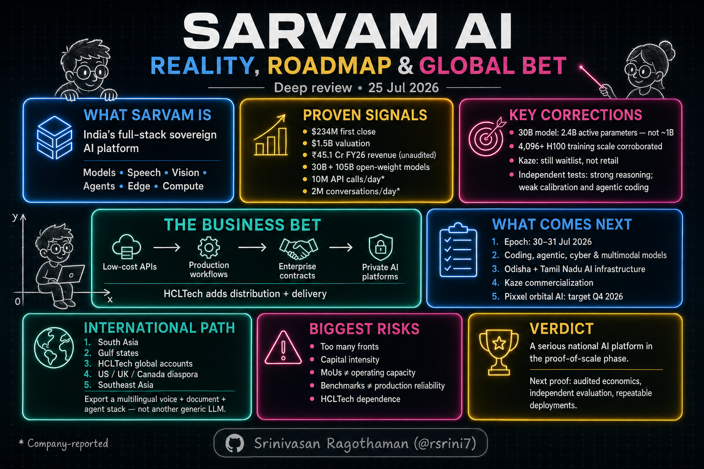
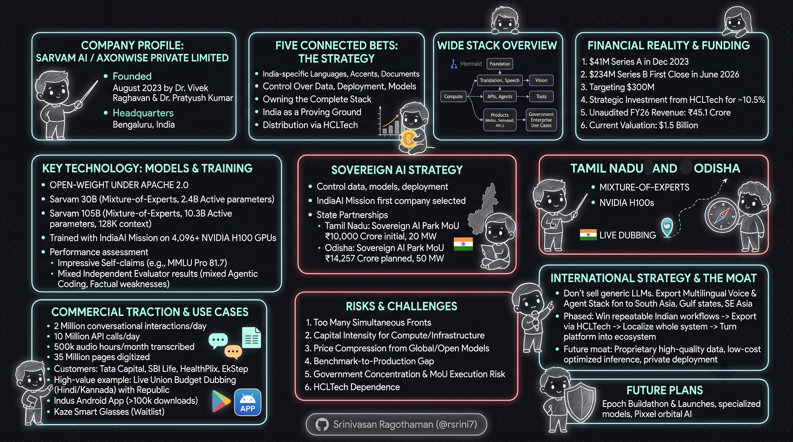
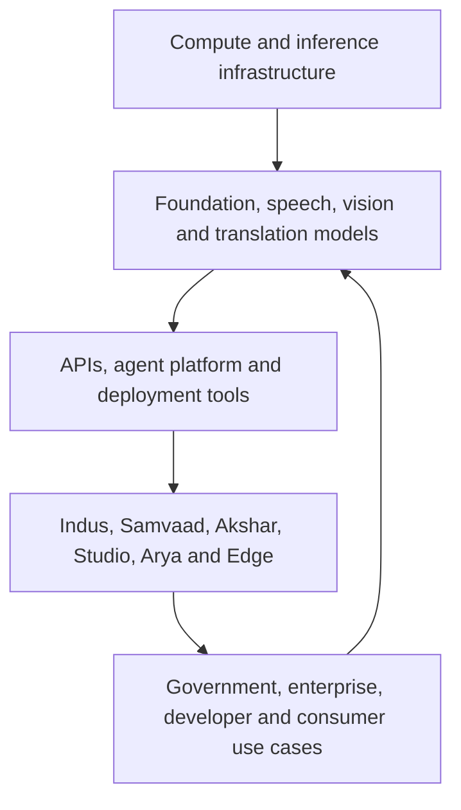
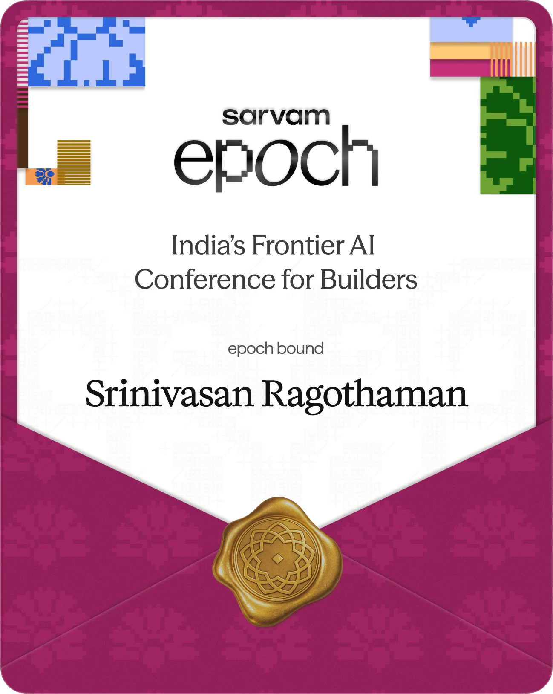
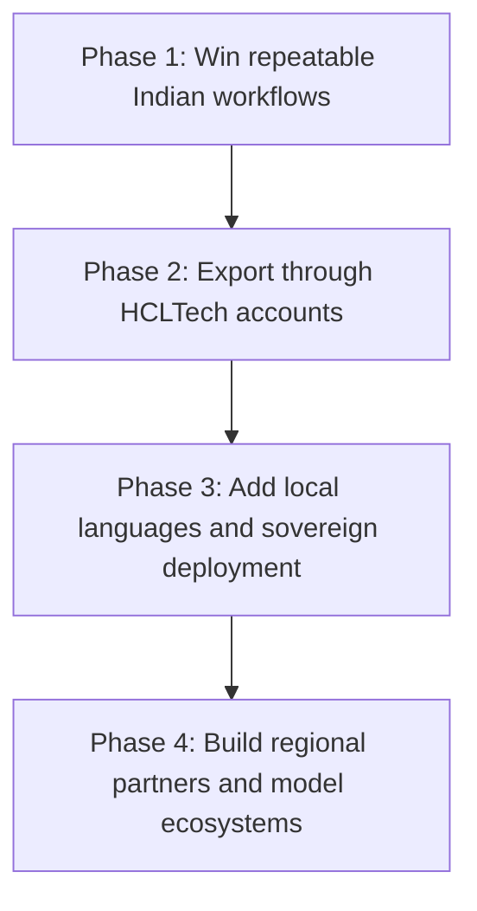

# Sarvam AI: What Is Real, What Is Still a Bet, and What Comes Next

**A deep, human-readable review of the company, technology, business model, sovereign-AI strategy, and international opportunity**

**Research cut-off:** July 25, 2026  
**Company:** Sarvam AI / Axonwise Private Limited  
**Headquarters:** Bengaluru, India  
**Founded:** August 2023 by Dr. Vivek Raghavan and Dr. Pratyush Kumar

> **Short version:** Sarvam is no longer merely an “Indian-language model startup.” It is trying to become an integrated AI company spanning models, speech, document intelligence, agents, applications, edge devices, and domestic compute. The technical work is substantial and the commercial signals are real. But its valuation, infrastructure announcements, and sovereign-AI narrative are running ahead of independently demonstrated economics and product maturity. The next test is execution: reliable deployments, transparent evaluation, repeatable revenue, and a disciplined expansion beyond India.

---

## How to read this review

Public information about Sarvam comes from very different kinds of sources. A company blog can confirm that a product was announced, but it cannot independently prove the product's accuracy, adoption, or business value. Similarly, an MoU records an intention; it is not the same as a commissioned data centre.

This review therefore uses four labels:

| Label | Meaning |
|---|---|
| **Confirmed** | Supported by an official filing, government source, live product, model weights, or strong independent reporting |
| **Company-reported** | Published by Sarvam or a partner, but not independently audited |
| **Announced** | A plan or MoU exists, but delivery is incomplete or not yet observable |
| **Analysis** | My interpretation or recommendation, clearly separated from reported fact |

The distinction matters because Sarvam operates in a market where announcements, benchmarks, funding, infrastructure, and production adoption move at very different speeds.

---

---

## 1. The clearest way to understand Sarvam

Sarvam is making five connected bets:

1. **India needs AI that handles its languages, accents, documents, code-mixing, and voice-heavy user behaviour better than English-first systems.**
2. **Governments and regulated enterprises will pay for control over data, deployment, models, and infrastructure.**
3. **Owning more of the stack can reduce cost and dependency while improving the product through real usage.**
4. **India can be the proving ground for multilingual, low-cost, population-scale AI that later travels to other markets.**
5. **A strategic distribution partner such as HCLTech can turn research and products into large enterprise deployments.**

That produces a stack wider than the phrase “LLM company” suggests:

The feedback arrow is strategically important. If Sarvam can learn from production speech, documents, transactions, and workflows—within valid consent and governance boundaries—it can improve the parts of the stack that generic global models do not optimize for. If it cannot create that feedback loop, the wide stack risks becoming an expensive collection of products.

---

## 2. Executive assessment

| Question | Assessment |
|---|---|
| Is Sarvam a serious technical company? | **Yes.** Training and releasing 30B and 105B MoE models, optimizing inference, and shipping speech, document, and agent products is meaningful work. |
| Are its flagship benchmark claims independently proven? | **Only partly.** Company results are broad and impressive, but independent testing is mixed and exposes hallucination and agentic-coding weaknesses. |
| Is “sovereign AI” only marketing? | **No—but it is broader than the literal facts.** Domestic control and deployment are genuine differentiators; complete technological independence is not. |
| Has Sarvam found commercial demand? | **Probably yes.** Named deployments, ₹45.1 crore unaudited FY26 revenue, daily usage, and HCLTech’s investment are credible signals. Profitability and repeatability remain undisclosed. |
| Is the $1.5 billion valuation justified by current revenue? | **Not by current revenue alone.** It prices in future platform dominance, strategic value, government adoption, infrastructure access, and HCLTech-led distribution. |
| Is Kaze commercially launched? | **No evidence of retail availability was found.** Sarvam’s own site still presents a waitlist. |
| Is international expansion already a proven business? | **No.** There is a US research footprint and a stated “India and beyond” ambition, but no disclosed international revenue or scaled overseas customer base. |
| What is the biggest opportunity? | Becoming the trusted multilingual voice-and-agent layer for high-volume, regulated workflows—not winning a generic chatbot race. |
| What is the biggest risk? | Capital intensity and execution complexity: Sarvam is attempting frontier research, cloud infrastructure, enterprise services, consumer software, and hardware at the same time. |

---

## 3. Company, funding, and economic reality

### Funding history

Sarvam says it was founded in August 2023. In December 2023, it announced $41 million across seed and Series A financing, led by Lightspeed with participation from Peak XV and Khosla Ventures. The company’s own announcement describes the amount as Series A, while TechCrunch reported that the total covered seed plus Series A; the latter is the more precise description. Sources: [Sarvam’s announcement](https://www.sarvam.ai/blogs/announcing-series-a), [TechCrunch](https://techcrunch.com/2023/12/06/indias-sarvam-ai-raises-41-million-from-lightspeed-khosla-peak-xv/).

On June 15, 2026, Sarvam announced a **$234 million first close of a targeted $300 million Series B** at a **$1.5 billion post-money valuation**. HCLTech committed $150 million as lead strategic investor; Bessemer joined, while Khosla Ventures and Peak XV participated again. HCLTech’s investment was reported as roughly ₹1,427 crore for approximately 10.5%. Sources: [HCLTech/Sarvam release](https://www.hcltech.com/press-releases/sarvam-raises-234-million-first-close-300-million-series-b-15-billion-valuation), [Reuters](https://www.reuters.com/world/india/indias-hcltech-buy-105-stake-sarvam-ai-valuing-startup-15-billion-2026-06-15/).

The phrase **“first close”** matters. As of this review, the remaining approximately $66 million has not been publicly confirmed as closed. The headline “$300 million Series B” describes the target; $234 million is the confirmed first close.

### Revenue: encouraging growth, but a large expectation gap

MediaNama reported **₹45.1 crore of unaudited FY26 revenue**, versus ₹1.5 crore in FY25. This is a strong early growth signal, but it is not an audited financial statement. Source: [MediaNama](https://www.medianama.com/2026/06/223-sarvam-raises-234-million-ai-unicorn-amid-anthropic-restrictions/).

At a $1.5 billion valuation, Sarvam is being valued primarily on future potential rather than current revenue. That is not unusual for a strategic AI company, but it means investors are implicitly betting on several outcomes at once:

- Sarvam becomes a default AI supplier to Indian governments and regulated industries.
- Its model and inference costs remain competitive as global model prices fall.
- HCLTech converts global enterprise relationships into revenue for the joint stack.
- State-backed compute projects move from MoUs to utilized, revenue-producing infrastructure.
- Sarvam’s products become repeatable platforms rather than bespoke engineering engagements.

The funding is therefore less a verdict on today’s financial performance and more a large prepayment on execution.

### What the HCLTech investment really changes

HCLTech is more than a financial investor. It supplies three things Sarvam would find difficult to build quickly:

- access to large enterprises and public-sector buyers;
- systems integration and managed-service capacity;
- balance-sheet strength for compute and data-centre projects.

Sarvam supplies the model, language, voice, and product layer. HCLTech supplies distribution, delivery, and enterprise trust. This combination could be more valuable than either company’s contribution alone—but it also creates dependency. Sarvam must retain enough independent product identity and customer access to avoid becoming only the AI engine inside HCLTech-led service contracts.

---

## 4. Technology: what has actually been built

### 4.1 Sarvam 30B and Sarvam 105B

Sarvam announced its new model generation at the India AI Impact Summit in February 2026 and released weights on March 6, 2026. The company calls them open source; a more precise description is **open-weight models released under Apache 2.0**, because downloadable weights and permissive licensing do not by themselves expose the full training data, data lineage, or research pipeline. Sources: [Sarvam technical blog](https://www.sarvam.ai/blogs/sarvam-30b-105b), [Sarvam 30B model card](https://huggingface.co/sarvamai/sarvam-30b), [Sarvam 105B model card](https://huggingface.co/sarvamai/sarvam-105b).

| Model | Architecture and purpose | Corrected facts |
|---|---|---|
| **Sarvam 30B** | Mixture-of-experts model optimized for deployment, voice agents, and tool use | **2.4B non-embedding active parameters**; 128 experts with top-6 routing |
| **Sarvam 105B** | Larger MoE reasoning model used by Indus | **10.3B active parameters**; 128 experts with top-8 routing; MLA-style attention; 128K context stated in the model card |

Sarvam reports training the 30B model on 16 trillion tokens and the 105B model on 12 trillion tokens. It says both were trained from scratch in India using compute supplied under the IndiaAI Mission.

The IndiaAI story is stronger than the attachment suggested. A Government of India release confirms Sarvam’s selection under the foundation-model pillar, while NVIDIA reports training-scale execution across **4,096+ H100 GPUs**. Earlier reporting described access to 4,096 H100 GPUs for six months with a government subsidy. Sources: [PIB](https://www.pib.gov.in/PressReleasePage.aspx?PRID=2132817), [NVIDIA case study](https://www.nvidia.com/en-us/case-studies/sarvam-sovereign-ai/), [Economic Times](https://economictimes.indiatimes.com/tech/artificial-intelligence/sarvam-ai-to-open-source-ai-models-it-is-training-under-indiaai-mission/articleshow/122524232.cms).

One open question remains: the government originally described Sarvam as building a **120B-parameter** model, while the released flagship is 105B. The public record does not clearly explain whether the 105B model is the final form of that commitment, one output in a broader programme, or an architectural adjustment. This is not evidence of a failure, but it deserves explicit clarification.

### 4.2 Benchmark performance: impressive claims, incomplete proof

Sarvam’s reported scores are not invented; they are accurately published in its technical blog and model cards. The 105B model is reported at 98.6 on Math500, 71.7 on LiveCodeBench v6, 81.7 on MMLU Pro, 49.5 on BrowseComp, and 68.3 on the average τ² benchmark. The 30B model is also reported as unusually capable for its active-compute footprint.

The right conclusion is not “the scores are false,” and it is no longer accurate to say that no independent evaluation exists.

Independent evaluator Artificial Analysis subsequently found a more mixed profile:

- Both models were weak on its TerminalBench Hard agentic coding evaluation.
- The models attempted answers aggressively rather than abstaining.
- Their hallucination-to-accuracy profile was poor on the evaluator’s AA-Omniscience measure.

Source: [Artificial Analysis review](https://artificialanalysis.ai/articles/sarvam-105b-Sarvam-30b-everything-you-need-to-know).

Forbes also raised valid transparency concerns shortly after release: no independent leaderboard placement at that time, no full research paper, and heavy reliance on Sarvam-designed Indic evaluation judged by another model. Source: [Forbes](https://www.forbes.com/sites/janakirammsv/2026/03/07/india-can-train-a-sovereign-model-but-still-cannot-prove-it-works/).

The balanced reading is:

> Sarvam has demonstrated credible model-building capability and competitive self-reported results. It has not yet demonstrated that the models are uniformly frontier-class, and independent evidence suggests material weaknesses in factual calibration and some agentic coding tasks.

That still leaves a strong product case. A model does not need to win every general benchmark if it is cheaper, deployable, better on target languages, and reliably integrated into a specific workflow. But Sarvam should publish more:

- a full technical report with data-governance detail and ablations;
- independent multilingual human evaluation;
- per-language and per-dialect failure analysis;
- hallucination, refusal, safety, and calibration tests;
- production accuracy and cost by use case, not only benchmark averages.

### 4.3 Speech, translation, vision, and document intelligence

Sarvam’s strongest near-term commercial moat may be outside the general-purpose LLM.

Its current documentation lists:

- **Saaras v3:** speech-to-text across 22 Indian languages plus English, including code-mixed modes;
- **Bulbul v3:** text-to-speech across 10 Indian languages plus English;
- **Sarvam Translate:** formal translation across 22 Indian languages plus English;
- **Mayura:** more colloquial translation across 10 Indian languages plus English;
- **Sarvam Vision:** document extraction and digitization across 22 Indian languages plus English.

Sources: [Sarvam model documentation](https://docs.sarvam.ai/api/getting-started/models), [Saaras documentation](https://docs.sarvam.ai/api/getting-started/models/saaras), [Bulbul documentation](https://docs.sarvam.ai/api/getting-started/models/bulbul).

There is, however, a documentation-quality issue. Sarvam’s homepage still describes speech-to-text as supporting 12 languages, while the Saaras v3 model documentation says 23 languages including English. Some REST and streaming pages also show narrower language sets. This may reflect endpoint or version differences, but it is not consistently explained. For an enterprise API company, capability matrices should be versioned and unambiguous.

Sarvam reports more than 500,000 hours of audio transcribed per month and more than 35 million pages digitized. These figures are commercially encouraging but remain company-reported. Source: [HCLTech funding release](https://www.hcltech.com/press-releases/sarvam-raises-234-million-first-close-300-million-series-b-15-billion-valuation).

### 4.4 Applications and deployment layer

Sarvam’s public portfolio includes:

| Product | Role in the stack |
|---|---|
| **Samvaad** | Multilingual conversational and voice-agent platform |
| **Indus** | Consumer-facing AI assistant powered primarily by Sarvam 105B |
| **Akshar** | Document digitization and extraction |
| **Studio** | Multilingual content transformation |
| **Arya** | Enterprise work and agentic workflows |
| **Edge** | On-device speech, translation, and inference |
| **Kaze** | Smart-glasses concept/device built on Sarvam Edge |

Indus is no longer merely a waitlist announcement. The Android app was active on July 9, 2026 and showed more than 100,000 downloads when checked for this review. That proves public availability, not retention or product-market fit. Source: [Google Play listing](https://play.google.com/store/apps/details?id=ai.sarvam.indus).

Current public API pricing is unusually aggressive: Sarvam lists 105B input/output at ₹4/₹16 per million tokens and 30B at ₹2.5/₹10, alongside speech-to-text at ₹30 per audio hour and document digitization at ₹0.50 per page. These prices can change and may reflect an acquisition strategy, so enterprises should evaluate sustained contract economics rather than assuming public beta pricing will remain permanent. Source: [Sarvam pricing](https://www.sarvam.ai/api-pricing).

### 4.5 Kaze: unveiled, technically interesting, not yet retail

Sarvam unveiled Kaze smart glasses at the February 2026 summit, where Prime Minister Narendra Modi tried the device. Early reporting repeated a May 2026 commercial timeline.

As of July 25, however, Sarvam’s own Kaze page still says **“Join Waitlist.”** No public price, purchase page, retail shipment confirmation, or independent product review was found. Sources: [Kaze waitlist](https://www.sarvam.ai/kaze-waitlist), [Sarvam Edge](https://www.sarvam.ai/products/edge).

The correct status is therefore:

> **Kaze is a demonstrated and announced product that remains in waitlist or limited-access status; a May retail launch has not been publicly substantiated.**

The product should also be understood as a strategic showcase for Edge rather than only as a consumer-electronics bet. Its best early market may be field workers, inspections, healthcare, accessibility, and enterprise workflows—settings where local speech, hands-free input, low latency, and data privacy create measurable value.

---

## 5. Commercial traction: signals, not yet a full proof

Sarvam reports:

- more than 2 million conversational interactions per day;
- 10 million API calls per day;
- 500,000+ audio hours processed per month;
- 35 million+ pages digitized;
- named enterprise work with Tata Capital, SBI Life, HealthPlix, EkStep, and others.

Sources: [Sarvam homepage](https://www.sarvam.ai/), [customer stories](https://www.sarvam.ai/stories), [HCLTech funding release](https://www.hcltech.com/press-releases/sarvam-raises-234-million-first-close-300-million-series-b-15-billion-valuation).

These are meaningful operating signals, but they do not answer the questions an investor or enterprise buyer ultimately needs:

- How much of usage is paid?
- What is gross margin after inference, telephony, and forward-deployed engineering?
- How many pilots convert into multi-year production contracts?
- What is revenue concentration among government and a few large enterprises?
- Does the software improve enough to reduce the amount of custom engineering per deployment?

The most valuable public evidence would be audited revenue, recurring-revenue mix, retention, gross margin, and production-level accuracy by workflow.

### A particularly credible use case: live dubbing

On February 1, 2026, Republic and Sarvam delivered live AI dubbing of the Union Budget speech in Hindi and Kannada, using the Finance Minister’s synthesized voice. The event itself is supported by both Sarvam and Republic. Specific latency and “6.6×” performance numbers should still be treated as company or broadcaster claims rather than independently measured results. Sources: [Sarvam Dub](https://www.sarvam.ai/blogs/sarvam-dub), [Republic](https://www.republicworld.com/videos/india/republic-x-sarvam-ai-create-history-with-real-time-translation-of-nirmala-sitharaman-s-budget-speech).

---

## 6. Government and infrastructure strategy

### IndiaAI Mission

Sarvam was the first company selected under the IndiaAI Mission’s foundation-model programme. The selection, government-supported compute, and eventual model releases are confirmed. The programme matters not only as subsidy, but as an institutional endorsement that helps Sarvam win government and regulated-enterprise trust.

It also creates obligations: publicly supported models should have strong transparency, reproducibility, public-interest access, and clear reporting on what the programme delivered.

### Tamil Nadu: Digital Sangam

Tamil Nadu and Sarvam signed an MoU in January 2026 for a full-stack Sovereign AI Park, commonly reported as an initial **₹10,000 crore** project creating around 1,000 high-skilled jobs. Sarvam later described a 20 MW AI-optimized data centre, collaboration with IIT Madras, and applications including the Vivasāya Nanban assistant for 79 lakh farm households and a unified citizen helpline. Sources: [New Indian Express](https://www.newindianexpress.com/states/tamil-nadu/2026/Jan/13/tamil-nadu-signs-rs-10000-crore-mou-to-set-up-domestically-governed-ai-infrastructure), [Sarvam state-partnership update](https://www.sarvam.ai/blogs/partnerships-with-indian-states).

This remains an announced multi-year infrastructure and ecosystem plan. Public reporting did not provide a detailed funding split, commissioning schedule, or utilization commitment.

### Odisha: ambition is clear, capital figures need reconciliation

Sarvam’s February update described a planned **50 MW** AI-optimized facility in Odisha. On July 24, HCLTech announced its first AI data centre in the Odisha Sovereign AI Park with Sarvam and the state government, stating a planned capital outlay of **₹14,257 crore**, including Odisha government financial assistance. Sources: [Sarvam](https://www.sarvam.ai/blogs/partnerships-with-indian-states), [HCLTech](https://www.hcltech.com/press-releases/hcltech-announces-ai-data-center-bhubaneswar-partnership-sarvam-and-government), [Reuters](https://www.reuters.com/world/india/indias-hcltech-sarvam-set-up-148-billion-ai-data-center-odisha-state-2026-07-24/).

Eleven days earlier, HCLTech had said it would invest **up to ₹3,500 crore** in AI data centres with potential to scale to **50 MW**. Source: [HCLTech Q1 release](https://www.hcltech.com/press-releases/hcltech-delivers-robust-q1-led-record-deal-bookings-24-billion).

The public disclosures do not explain:

- whether both 50 MW references describe the same capacity;
- whether ₹3,500 crore is HCLTech’s equity/cash contribution while ₹14,257 crore is total lifetime project outlay;
- how much comes from the Odisha government;
- whether compute hardware, land, power infrastructure, and operating expenditure are included;
- whether the larger number is phased over several years.

These amounts should **not** be added together or treated as directly comparable until HCLTech or Odisha publishes a project structure.

### Separate HCLTech Global Technology Center

HCLTech separately announced a Global Technology Center in Bhubaneswar, expected to house 5,000 people and begin operations by 2028. Sarvam is not named as a partner in this second MoU. Source: [HCLTech](https://www.hcltech.com/press-releases/hcltech-establish-global-technology-center-bhubaneswar).

Some state and press reports associate approximately ₹730 crore and more than 6,000 jobs with the delivery-centre proposal, whereas HCLTech’s final public release says 5,000 people and does not state the ₹730 crore figure. The safest representation is to keep the official 5,000-person commitment separate and identify ₹730 crore as a reported, not company-confirmed, number.

---

## 7. What “sovereign AI” should—and should not—mean

Sarvam describes its platform as developed, deployed, and governed entirely in India. The substance behind that claim includes Indian model development, domestic training, local hosting, data-residency options, open weights, on-device processing, and the ability for governments or enterprises to operate systems under their own control.

But sovereignty is not the same as technological autarky. Sarvam relies on an international ecosystem that includes NVIDIA hardware and software, cloud partners, Qualcomm, AWS, and global open-source research. That does not invalidate sovereignty. It means the useful definition is:

> **The ability to control critical data, models, deployment, access, policy, and switching choices—even when some hardware or software components come from global suppliers.**

This definition is more defensible than implying that every dependency is Indian.

The temporary June 2026 US restriction on access to Anthropic’s Fable 5 and Mythos 5 gave Sarvam a vivid example for its message. The order was real, abruptly disrupted global access, and was lifted at the end of June. Sarvam co-founder Pratyush Kumar argued that countries should not confuse access with ownership. Sources: [Anthropic’s suspension statement](https://www.anthropic.com/news/fable-mythos-access), [Anthropic’s restoration update](https://www.anthropic.com/news/redeploying-fable-5), [Business Today](https://www.businesstoday.in/technology/story/dont-confuse-access-with-ownership-sarvam-ceo-on-what-anthropics-fable-ban-means-for-india-536753-2026-06-14).

The episode validates resilience and optionality as concerns. It does **not** prove that every workload should avoid global models, or that Sarvam’s models are technically superior. A mature sovereign strategy should support multiple models, portable workloads, local fallback, and risk-based procurement.

---

## 8. The business model Sarvam appears to be building

Sarvam’s public API prices are useful for developer adoption, but API tokens alone are unlikely to justify the company’s capital requirements. The more plausible revenue stack is:

1. **Usage-based APIs** for speech, translation, documents, and LLMs.
2. **Agent and application subscriptions** for enterprise workflows.
3. **Private/VPC/on-prem deployments** for regulated organizations.
4. **Forward-deployed engineering** to integrate AI into real operations.
5. **Managed sovereign AI platforms** sold with HCLTech.
6. **Government and public-infrastructure contracts.**
7. **Edge licensing** to device, automotive, and semiconductor partners.
8. **Consumer distribution** through Indus and potentially Kaze, with monetization still unclear.

The economic risk is that forward-deployed work becomes consulting-heavy. The economic opportunity is that repeated deployment patterns become reusable software and managed infrastructure. Sarvam’s long-term margin will depend on which side wins.

---

## 9. Officially signalled future plans

The following plans are grounded in company or partner announcements, but most are not yet completed:

### Near term: second half of 2026

*Srini (author) selected as a finalist for Epoch Builder Day, Jul 26 2026.*

- **Sarvam Epoch, July 30–31:** The event agenda explicitly promises product launches, demonstrations, and technical sessions. July 30 is the Builder Edition; July 31 is the Enterprise Edition. The July 26 Buildathon feeds ten finalist teams into Builder Day. NVIDIA is shown as “powered by,” AWS “in association with,” and HCLTech as a supporter—not simply a common sponsorship. Source: [Sarvam Epoch](https://epoch.sarvam.ai/).
- **New model directions:** Sarvam has named larger frontier work and specialized models for coding, agentic, cybersecurity, and multimodal conversational use cases. Source: [HCLTech/Sarvam funding release](https://www.hcltech.com/press-releases/sarvam-raises-234-million-first-close-300-million-series-b-15-billion-valuation).
- **Kaze:** Progression from waitlist or builders’ device to a defined commercial release remains an open milestone.
- **Pixxel orbital AI project:** Sarvam and Pixxel say a 200 kg-class orbital data-centre satellite could reach orbit as early as Q4 2026. This is an announced experimental mission, not an operational platform. Source: [Sarvam–Pixxel](https://www.sarvam.ai/partnerships/pixxel).
- **Series B second close:** Approximately $66 million remains between the first close and announced target.

### 2027–2028 and beyond

- Build-out and utilization of Tamil Nadu and Odisha AI infrastructure.
- HCLTech’s Bhubaneswar Global Technology Center reaching operation by 2028.
- Expansion of enterprise agents into BFSI, government, healthcare, defence, media, and commerce.
- Wider on-device licensing through Sarvam Edge.
- A stronger US research and talent presence through Sarvam Labs, which was announced in the Bay Area in 2025. Source: [Economic Times](https://m.economictimes.com/tech/artificial-intelligence/sarvam-ai-launches-sarvam-labs-for-foundational-research-in-the-us/articleshow/119167070.cms).

---

## 10. International market plan: the route that makes strategic sense

Sarvam and HCLTech say the partnership targets a sovereign AI ecosystem for “India and beyond,” but they have not published a detailed country-by-country plan. The following is therefore **analysis and recommendation**, not a claim about an approved internal roadmap.

### Do not begin by selling “another general-purpose LLM”

In the US and Europe, Sarvam would face better-known frontier-model vendors, mature cloud distribution, and intense price competition. Its India origin alone will not persuade an international buyer.

The exportable product is more specific:

> **A deployable multilingual voice, document, and agent stack for governments and regulated enterprises that need local control, low cost, and adaptation to underserved languages.**

That is a clearer and more defensible category than “India’s answer to ChatGPT.”

### Recommended market sequence

| Priority | Market | Why it fits | What must be added |
|---|---|---|---|
| **1** | **South Asia and Indian Ocean markets** | Linguistic adjacency, shared scripts, Urdu/Nepali/Bengali coverage, similar voice-first access patterns | Local policy partners, dialect data, in-country hosting where required |
| **2** | **Gulf states** | Strong sovereign-AI demand, large South Asian population, government and BFSI budgets, HCLTech relationships | High-quality Arabic stack, local cloud/data residency, Arabic-English-South Asian code-mixing |
| **3** | **Global enterprises through HCLTech** | Existing clients and delivery teams across 60 countries reduce go-to-market cost | USD pricing, global SLAs, compliance packs, multi-model orchestration |
| **4** | **UK, US, and Canada diaspora use cases** | Indian-language healthcare, financial services, media, and public access | Evidence that language specialization beats global providers in defined workflows |
| **5** | **Southeast Asia** | Multilingual and voice-heavy markets with sovereignty concerns | New language families, local partners, dedicated benchmarks |
| **Later** | **Continental Europe and Africa** | Long-term sovereign and low-resource-language opportunity | Extensive localization, regulatory investment, local data and research partnerships |

### A four-phase expansion model

#### Phase 1 — Prove repeatability in India

Before broad international expansion, Sarvam should show that a small number of vertical products can be deployed repeatedly with predictable accuracy, time, and margin. Strong candidates are:

- multilingual contact-centre automation;
- insurance and banking service agents;
- document digitization for complex scripts and forms;
- citizen-service voice agents;
- media translation and dubbing;
- field-worker assistants running partly on-device.

#### Phase 2 — Use HCLTech as the distribution wedge

Rather than building a large country-by-country sales force immediately, Sarvam can enter existing HCLTech accounts as a specialized component:

- private multilingual agent platform;
- sovereign or regional model layer;
- low-cost speech and document intelligence;
- open-weight fallback for business continuity;
- industry-specific agent bundles.

This route reduces sales friction, but commercial ownership must be designed carefully. Sarvam needs direct product telemetry, reference rights, and a recognizable product brand.

#### Phase 3 — Localize the whole system, not only the model

Internationalization requires more than translating prompts. Each market needs:

- local speech and document datasets acquired with valid rights;
- dialect and code-switch evaluation;
- cultural and policy alignment;
- regional data hosting or customer-operated deployment;
- local-language safety testing and human escalation;
- billing, support, documentation, and partner certification.

#### Phase 4 — Turn the platform into an ecosystem

The scalable version of Sarvam is not a central team manually adapting every market. It is a toolkit that allows approved local partners, universities, governments, and enterprises to adapt, evaluate, deploy, and govern models while Sarvam supplies core infrastructure and engineering.

### Product changes needed for international scale

1. **A formal sovereign deployment matrix:** public cloud, regional cloud, VPC, on-prem, air-gapped, and edge.
2. **A model-routing layer:** allow customers to combine Sarvam with global and local models rather than demand exclusivity.
3. **Country evaluation packs:** accuracy, safety, bias, hallucination, and latency by language and workflow.
4. **Transparent enterprise economics:** contracted pricing, hardware requirements, throughput, and total cost of ownership.
5. **Partner tooling:** adaptation pipelines, evaluation harnesses, observability, and certification.
6. **A global trust package:** data lineage, model cards, security controls, incident reporting, and regulatory mapping.
7. **Clear product/version documentation:** one authoritative capability matrix across APIs and models.

---

## 11. Competitive position

Sarvam competes with several different categories, not one simple rival:

| Competitor category | Examples | Sarvam’s possible advantage | Sarvam’s exposure |
|---|---|---|---|
| Frontier model platforms | OpenAI, Anthropic, Google | India-specific language, deployment control, cost | Frontier quality, ecosystem, and global developer mindshare |
| Open-weight model labs | Meta, Mistral, Qwen, DeepSeek and others | Integrated Indian speech/document/application stack | Faster global open-model innovation and falling inference prices |
| Voice specialists | Gnani.ai, ElevenLabs and global speech vendors | Full stack from ASR/TTS to agents and local deployment | Specialists may have deeper telephony data or voice quality |
| Indian public platforms | BHASHINI, BharatGen and IndiaAI-backed efforts | Commercial product execution and enterprise delivery | Public or consortium models may reduce differentiation |
| Indian AI companies | Krutrim, CoRover, Gnani.ai and others | Research depth plus HCLTech channel | Domestic competition for talent, government contracts, and “sovereign” positioning |
| IT services firms | TCS, Infosys, Wipro and global integrators | Native model and product IP | Integrators can remain model-neutral and use whichever provider is strongest |

Sarvam’s moat will not be “we support Indian languages”; that claim will become common. A stronger moat would combine:

- proprietary production-quality data with appropriate rights;
- low-cost inference optimized for Indian scripts and voice;
- measurable workflow success;
- private deployment and governance;
- HCLTech-scale distribution;
- trusted public infrastructure;
- a developer ecosystem around open weights and APIs.

---

## 12. The risks that deserve the most attention

### 1. Too many fronts

Sarvam is simultaneously pursuing frontier models, APIs, enterprise applications, government platforms, consumer chat, edge AI, smart glasses, data centres, and even an orbital experiment. Each is defensible in isolation; together they create formidable execution risk.

### 2. Capital intensity

Training, inference, data centres, and hardware consume capital before demand is certain. Subsidized or partner-funded compute helps, but underutilized capacity can become a burden.

### 3. Benchmark-to-production gap

Excellent math or reasoning scores do not guarantee safe insurance calls, correct citizen-service advice, or reliable document extraction. The cost of a wrong answer is domain-specific.

### 4. Price compression

Global and open-weight model prices are falling quickly. Sarvam cannot rely only on cheap tokens; it needs workflow value, deployment control, and language quality customers will pay to preserve.

### 5. Government concentration and MoU risk

Government partnerships create scale and legitimacy, but procurement cycles, political transitions, funding structures, and project execution can be slow. An MoU should not be counted as revenue.

### 6. Sovereignty becoming a slogan

If “sovereign” is not backed by measurable control over data, access, deployment, audit, and switching, buyers may treat it as branding. Sarvam should define sovereignty as a verifiable architecture.

### 7. Transparency and trust

The absence of a full technical report, documentation inconsistencies, self-reported adoption, and mismatched website dates are individually fixable. Left unresolved, they create avoidable doubts precisely where Sarvam wants to sell trust.

### 8. HCLTech dependence

The partnership is a powerful accelerator, but Sarvam needs a durable independent brand, developer community, and direct customer learning.

---

## 13. What would prove the thesis over the next 18 months?

Watch these indicators rather than announcement volume:

| Indicator | What success would look like |
|---|---|
| **Series B completion** | Remaining capital closes on disclosed terms |
| **Epoch announcements** | Products ship with documentation and customer access, not only demos |
| **Independent evaluation** | Better factual calibration and stronger results on multilingual, speech, and real workflow tests |
| **Revenue quality** | Audited growth, recurring contracts, improving gross margin, lower concentration |
| **Kaze** | Price, shipping date, developer kit, battery/privacy details, and independent review |
| **State AI parks** | Funding structure, construction milestones, power/capacity, commissioning, and customer utilization |
| **HCLTech channel** | Named joint customers outside India and repeatable offers |
| **International presence** | Revenue-producing overseas deployments, not only research hiring or conference visibility |
| **Developer ecosystem** | Downloads, active deployments, third-party fine-tunes, integrations, and community benchmarks |
| **Product clarity** | Consistent API capability matrices, versioning, SLAs, and deprecation policy |

---

## 14. Corrected timeline

| Date | Event | Interpretation |
|---|---|---|
| Aug 2023 | Sarvam founded | Confirmed by company |
| Dec 2023 | $41M seed + Series A total announced | Confirmed; company headline calls it Series A |
| Oct 2024 | Sarvam-1 released | Early Indic-model milestone |
| Apr 26, 2025 | Selected under IndiaAI foundation-model programme | Confirmed by Government of India |
| May 2025 | Sarvam-M released on top of Mistral Small | Useful post-training work, not a from-scratch base model |
| Mar 2025 onward | Sarvam Labs Bay Area research presence announced | First material international research footprint |
| Jan 13, 2026 | Tamil Nadu Sovereign AI Park MoU | ₹10,000 crore initial project reported; execution timeline limited |
| Feb 1, 2026 | Live Union Budget dubbing with Republic | Credible production demonstration |
| Feb 2–15, 2026 | Audio, speech, vision, agent, studio, edge, and document releases | Broad stack takes shape |
| Feb 16–18, 2026 | Kaze and 30B/105B unveiled at India AI Impact Summit | Announcement/demo stage |
| Feb 20, 2026 | Indus introduced | Now publicly available, not only a waitlist |
| Mar 6, 2026 | 30B and 105B weights released under Apache 2.0 | Major technical milestone |
| Apr 2026 | Independent Artificial Analysis evaluation | Mixed evidence; important correction to “no independent tests” |
| May 4, 2026 | Pixxel orbital AI partnership announced | Target as early as Q4 2026; still experimental |
| May 6, 2026 | YCP India partnership announced | Enterprise adoption channel |
| Jun 12–30, 2026 | Temporary US restriction on Anthropic models | Important sovereignty case study; access restored |
| Jun 15, 2026 | $234M first close at $1.5B valuation | HCLTech becomes strategic anchor |
| Jul 13, 2026 | HCLTech announces up to ₹3,500 crore/50 MW AI data-centre plan | Relationship to Odisha figure later unclear |
| Jul 24, 2026 | ₹14,257 crore Odisha AI data-centre MoU | Official planned outlay; not yet a commissioned facility |
| Jul 24, 2026 | Separate HCLTech Global Technology Center MoU | 5,000-person centre expected by 2028; Sarvam not named as partner |
| Jul 26, 2026 | Epoch Buildathon | Selected as a finalist for Builder Day |
| Jul 30–31, 2026 | Sarvam Epoch | Upcoming; product announcements expected |

---

## 15. Final judgement

Sarvam has crossed an important threshold. It has enough technical output, production usage, institutional backing, and capital that dismissing it as hype would be wrong. The 30B and 105B releases demonstrate genuine model-building capability. The speech, document, and voice-agent stack addresses real Indian market problems. HCLTech gives it a credible path into large contracts.

But the opposite mistake would be to treat every benchmark, MoU, and valuation headline as proof that the strategy has already succeeded.

Sarvam is currently best understood as a **high-potential national AI platform in the proof-of-scale phase**. Its core thesis is plausible:

- India-specific AI can be commercially and socially valuable.
- Control over models and deployment can matter.
- Voice, documents, and agents may be more defensible than a generic chatbot.
- Capabilities proven at Indian scale can travel to other multilingual markets.

The company now needs to turn that thesis into repeatable evidence. The strongest next chapter would be quieter than the launch cycle: better documentation, independent evaluations, audited economics, commissioned infrastructure, referenceable joint customers, and a small number of products that work exceptionally well.

If Sarvam achieves those things, it can become more than an Indian frontier-model project. It could become a blueprint for how countries and enterprises build useful AI capability without surrendering all control to a few global platforms.

---

## Primary and high-value sources

### Company and technical

- [Sarvam — About](https://www.sarvam.ai/about-us)
- [Open-Sourcing Sarvam 30B and 105B](https://www.sarvam.ai/blogs/sarvam-30b-105b)
- [Sarvam 30B model card](https://huggingface.co/sarvamai/sarvam-30b)
- [Sarvam 105B model card](https://huggingface.co/sarvamai/sarvam-105b)
- [Sarvam models](https://www.sarvam.ai/models)
- [Sarvam API model documentation](https://docs.sarvam.ai/api/getting-started/models)
- [Sarvam API pricing](https://www.sarvam.ai/api-pricing)
- [Sarvam customer stories](https://www.sarvam.ai/stories)
- [Sarvam state partnerships](https://www.sarvam.ai/blogs/partnerships-with-indian-states)
- [Sarvam Kaze waitlist](https://www.sarvam.ai/kaze-waitlist)
- [Sarvam Edge](https://www.sarvam.ai/products/edge)
- [Sarvam Epoch](https://epoch.sarvam.ai/)

### Government, partner, and filings

- [Government of India: IndiaAI foundation-model update](https://www.pib.gov.in/PressReleasePage.aspx?PRID=2132817)
- [NVIDIA: Sarvam sovereign AI case study](https://www.nvidia.com/en-us/case-studies/sarvam-sovereign-ai/)
- [HCLTech: Series B announcement](https://www.hcltech.com/press-releases/sarvam-raises-234-million-first-close-300-million-series-b-15-billion-valuation)
- [HCLTech: July 13 AI data-centre plan](https://www.hcltech.com/press-releases/hcltech-delivers-robust-q1-led-record-deal-bookings-24-billion)
- [HCLTech: Odisha AI Data Center](https://www.hcltech.com/press-releases/hcltech-announces-ai-data-center-bhubaneswar-partnership-sarvam-and-government)
- [HCLTech: Bhubaneswar Global Technology Center](https://www.hcltech.com/press-releases/hcltech-establish-global-technology-center-bhubaneswar)
- [Anthropic: suspension statement](https://www.anthropic.com/news/fable-mythos-access)
- [Anthropic: restoration update](https://www.anthropic.com/news/redeploying-fable-5)

### Independent reporting and evaluation

- [Reuters: HCLTech investment in Sarvam](https://www.reuters.com/world/india/indias-hcltech-buy-105-stake-sarvam-ai-valuing-startup-15-billion-2026-06-15/)
- [Reuters: Odisha AI data centre](https://www.reuters.com/world/india/indias-hcltech-sarvam-set-up-148-billion-ai-data-center-odisha-state-2026-07-24/)
- [Artificial Analysis: Sarvam 30B and 105B](https://artificialanalysis.ai/articles/sarvam-105b-Sarvam-30b-everything-you-need-to-know)
- [Forbes: benchmark-transparency critique](https://www.forbes.com/sites/janakirammsv/2026/03/07/india-can-train-a-sovereign-model-but-still-cannot-prove-it-works/)
- [MediaNama: funding and unaudited revenue](https://www.medianama.com/2026/06/223-sarvam-raises-234-million-ai-unicorn-amid-anthropic-restrictions/)
- [New Indian Express: Tamil Nadu Sovereign AI Park](https://www.newindianexpress.com/states/tamil-nadu/2026/Jan/13/tamil-nadu-signs-rs-10000-crore-mou-to-set-up-domestically-governed-ai-infrastructure)

---

*This is a point-in-time review, not investment advice. Upcoming events—especially Sarvam Epoch on July 30–31, 2026—may quickly change product and roadmap details.*

---

**Related:**
- [LLM-Benchmarks](../../architecture/LLM-Benchmarks.md) — Critically examines the benchmark scores (Math500, LiveCodeBench, MMLU Pro) Sarvam uses to validate its 30B and 105B models.
- [LLM-Inference](../../architecture/LLM-Inference.md) — Explores the MoE architecture, inference optimization, and cost structures that underpin Sarvam's model deployment strategy.
- [LLM-Council](../../architecture/LLM-Council.md) — Connects to Sarvam's multi-model orchestration and the recommended model-routing layer for international scale.
- [Chinese-AI-Trifecta-2025-2026](Chinese-AI-Trifecta-2025-2026.md) — Contrasts the open-weight Indian sovereignty strategy with the Chinese open-model cost-driven disruption approach.
