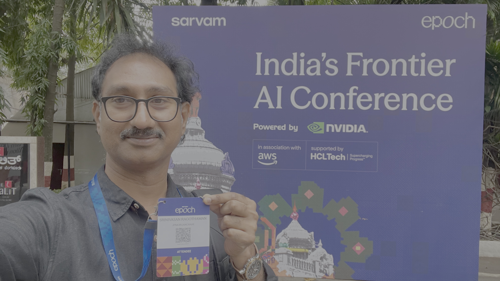
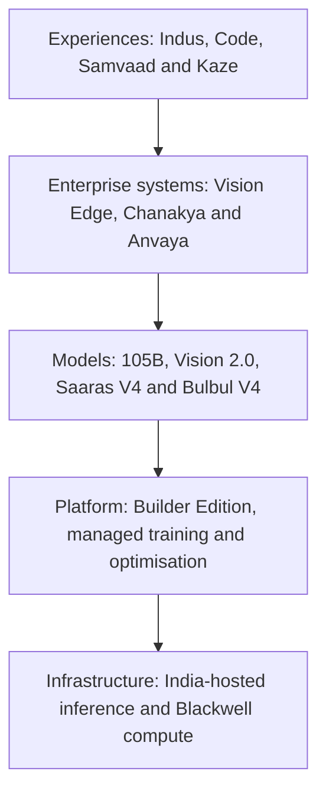
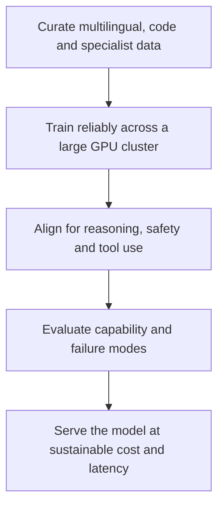
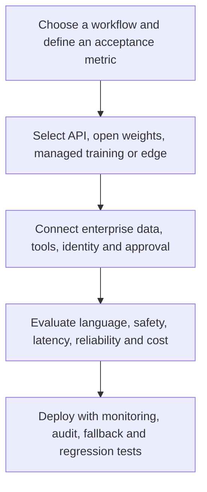

# Sarvam Epoch 2026 Builder Edition: India's AI Stack Is Taking Shape

> Bengaluru · 30 July 2026

I spent the full day at Sarvam Epoch 2026 Builder Edition in Bengaluru.

The obvious headline was Sarvam's announcement that it is building a **one-trillion-plus-parameter foundation model in India**. It is a bold target and naturally attracted attention.

But that was not the most important takeaway for me.

What stood out was the breadth of the stack Sarvam is trying to assemble: foundation models, speech, document intelligence, model training, India-hosted inference, voice-agent infrastructure, coding tools, secure deployments and even AI hardware.

In other words, the day was not only about building a bigger model. It was about building more of the system required to take AI from research to real Indian workflows.

Epoch is a two-day conference. Builder Edition was held on 30 July for developers, researchers and founders; Enterprise Edition followed on 31 July. These are my learnings from the Builder Edition.

## The short version

Sarvam's direction can be understood through five connected layers:

| Layer | What Sarvam showed |
| --- | --- |
| Models | Sarvam 105B, a trillion-plus roadmap, Vision 2.0, Saaras V4 and Bulbul V4 |
| Model platform | Managed training, the Epoch Builder platform and agentic optimisation |
| Infrastructure | India-hosted inference and NVIDIA Blackwell compute |
| Enterprise products | Document intelligence, voice agents, coding assistance and high-security AI |
| User experiences | Indus, phone-based agents and Kaze smart glasses |

This full-stack direction is more interesting than any one product announcement. A model can generate an answer, but a production system also needs data controls, integrations, identity, workflow state, evaluation, monitoring, fallback and human oversight.

## Everything announced at Builder Edition

Not every item was at the same stage. Some products were already available, some were announced for upcoming access, and a few were longer-term plans.

| Area | Announcement | Position at Builder Edition |
| --- | --- | --- |
| Frontier models | Trillion-plus-parameter model for coding, cybersecurity, science and simulation | In development; no public launch date |
| Reasoning model | Sarvam 105B improvements for agents, voice and instruction following | Existing model with announced improvements |
| Model economics | $0.80 per million blended tokens for Sarvam 105B | Pricing presented by Sarvam |
| Vision | Sarvam Vision 2.0 for handwriting, tables, forms and key-value extraction | Announced |
| Edge vision | Sarvam Vision Edge for local document processing | Commercial availability announced |
| Speech recognition | Saaras V4, including Odia, Sanskrit, Manipuri and multi-speaker use cases | Announced |
| Speech generation | Bulbul V4 with laughter, emotion and emphasis controls | Announced |
| Inference | Sarvam Inference for India-hosted access to Sarvam 105B, GLM 5.2 and Gemma 4 | Announced |
| Compute | NVIDIA Blackwell GPU cluster | Sarvam described it as India's largest |
| Optimisation | Agentic optimisation with up to 15× inference improvement for certain models | Performance presented by Sarvam |
| Builder platform | Epoch Builder Edition for data, training, tuning, evaluation and deployment | Private preview planned for August; GA planned for Q4 2026 |
| Builder models | 7B and 70B multilingual models trained on two trillion tokens | Announced with the Builder platform |
| Customisation | Managed model training on enterprise data, with trained weights delivered to the customer | Available as an enterprise offering |
| Coding | Sarvam Code | Beta |
| Voice agents | Samvaad conversational agents | Existing platform; new availability and pricing presented |
| AI assistant | Indus, powered by Sarvam 105B | Existing product |
| Telecom | Indian phone-number provisioning after PAN/Aadhaar verification | Demonstrated |
| Secure AI | Chanakya for on-premises, air-gapped and strategic environments | Existing vertical highlighted at Epoch |
| Government model | Anvaya, a custom 30B model for defence, intelligence and government | Announced |
| Hardware | Kaze smart glasses and an accessibility-focused bus-navigation demonstration | Existing device shown in a new use case |
| Expansion | San Francisco office | Announced |
| Talent | Devendra Singh Chaplot joining as an advisor | Announced |
| Ecosystem | Work with three IITs and two state governments | Announced |
| Developers | More than one million registered developers | Scale reported by Sarvam |
| Voice adoption | 325 million call/conversation minutes across Sarvam deployments | Scale reported by Sarvam |

## 1. The trillion-parameter model is the ambition, not yet the product

Sarvam co-founder Pratyush Kumar announced that the company is building a foundation model with more than one trillion parameters in India. The stated target areas include coding, cybersecurity, scientific work and simulation.

No public launch date was shared.

That distinction matters. A model being trained is different from a model that developers can evaluate, integrate and deploy. For now, the announcement tells us more about Sarvam's direction and infrastructure ambition than about a finished capability.

### What does "one trillion parameters" mean?

A parameter is a learned numerical value inside a neural network. Training adjusts these values so the model becomes better at predicting, reasoning and generating useful output.

Parameters are not the training dataset, and more parameters do not automatically produce a better model.

Actual quality depends on many connected choices:

- model architecture;
- total and active parameters;
- quality and diversity of training data;
- number of training tokens;
- tokenisation;
- post-training and reinforcement learning;
- tool-use training;
- inference optimisation;
- evaluation quality;
- the workload in which the model is used.

This is especially relevant for Mixture-of-Experts models. A model can have an enormous total parameter count while activating only a smaller subset for each token. The active parameters and serving design have a major effect on speed and cost.

### Why this project still matters

Training a model at this scale is not just about buying GPUs. It requires an end-to-end capability:

The real asset is the repeatable engineering system behind these steps. Even if model architectures continue to change, the ability to build datasets, train at scale, recover from failures, evaluate deeply and serve efficiently remains valuable.

The details I will watch for are:

- total versus active parameter count;
- architecture and context length;
- training-token budget and data mixture;
- Indian-language and code coverage;
- training infrastructure and duration;
- benchmark methodology;
- release model—API, open weights or both;
- cost and deployment options.

## 2. Sarvam 105B is the more immediate story

The trillion-plus model is the future plan. Sarvam 105B is the model developers can think about now.

Sarvam released the 105B and 30B models earlier in 2026 under Apache 2.0. Its [technical release](https://www.sarvam.ai/blogs/sarvam-30b-105b) describes both as reasoning models trained from scratch in India using compute from the IndiaAI Mission.

Sarvam 105B uses a sparse Mixture-of-Experts architecture. Sarvam's published material describes:

- 128 experts in its sparse feed-forward layers;
- Multi-head Latent Attention to reduce long-context memory pressure;
- training across reasoning, mathematics, coding and tool use;
- a tokenizer designed for Indian scripts;
- optimised kernels, scheduling and serving.

Sarvam says the model powers **Indus**, its AI assistant, while the smaller Sarvam 30B powers **Samvaad**, its conversational-agent platform.

At Epoch, the 105B model was presented as improved for complex instruction following, agentic workflows and voice calls.

### The pricing attracted attention

Sarvam presented a price of **$0.80 per one million blended tokens**, describing it as 5.5 times cheaper than GPT-5.4 Mini and more than 11 times cheaper than Gemini 3.5 Flash under the comparison used on stage.

This is an aggressive enterprise position, but "blended tokens" needs context. A blended value normally combines some ratio of:

- input tokens;
- cached-input tokens;
- output tokens.

The ratio can change the final price significantly. Sarvam's [API pricing page](https://docs.sarvam.ai/api/getting-started/pricing) lists those token categories separately, which is the better basis for a real cost model.

For an enterprise agent, the most useful measure is not only cost per token:

> **What does it cost to complete one business task successfully?**

That includes retries, long reasoning traces, tool calls, failures, human review and escalations. A cheaper model is valuable only if it maintains the quality and reliability required by the workflow.

### How I would evaluate Sarvam 105B for an agent

| Area | What I would measure |
| --- | --- |
| Instruction following | Does it obey constraints and output schemas consistently? |
| Tool use | Does it choose the right tool and pass valid arguments? |
| Long-running work | Can it preserve state across several steps without drifting? |
| Recovery | What happens after a timeout, partial response or tool failure? |
| Indian context | How well does it handle names, addresses, code-mixing and local terminology? |
| Voice workflows | Can it reason over noisy call transcripts and preserve numbers and entities? |
| Reliability | How often does a task finish correctly on the first attempt? |
| Economics | What are token usage, latency and total cost per completed task? |

General benchmarks help with model selection. A workload-specific evaluation decides whether a model is ready for production.

## 3. Vision 2.0 moves from OCR towards document workflows

Sarvam Vision 2.0 was presented as the next generation of its document-intelligence model, with improvements in:

- Indian handwriting;
- complex tables;
- forms;
- key-value extraction;
- dense enterprise records.

The original Sarvam Vision is a 3B vision-language model. Sarvam's [document digitisation documentation](https://docs.sarvam.ai/api/api-guides-tutorials/document-digitization/overview) describes extraction of text, layout, reading order and tables across Indian languages and English.

This area has enormous practical relevance. Many enterprise and public-sector processes still begin with a scanned document:

- land and property records;
- insurance forms;
- bank statements;
- invoices;
- handwritten applications;
- hospital records;
- legal and government documents.

For these workflows, basic OCR is only the first step. The system must understand structure.

It is not enough to recognise every word if the system places a value in the wrong row, separates a label from its field, loses a unit or changes the reading order.

### The right unit of evaluation

| Document task | Useful metric |
| --- | --- |
| Printed text | Character and word error rate |
| Handwriting | Error rate by language, script and writing style |
| Tables | Cell accuracy, row/column alignment and merged-cell handling |
| Forms | Field extraction accuracy |
| Key values | Exact-match accuracy and confidence calibration |
| Layout | Reading order and element grounding |
| Operations | Pages per minute, memory use and cost per page |

The most valuable feature would be traceability: every extracted value should be groundable back to its position on the original page so a person can verify uncertain results quickly.

### Vision Edge

Sarvam also announced commercial availability of Vision Edge, intended to process documents locally rather than sending every page to a cloud endpoint. A land-record digitisation project with the Odisha government was discussed as an example.

Local processing can help with:

- data residency;
- confidential records;
- disconnected environments;
- lower network dependence;
- predictable high-volume processing.

The next practical details are hardware support, model size, quantisation, page throughput, accuracy compared with the cloud version, update management and licence cost.

Sarvam already has a broader [Sarvam Edge](https://www.sarvam.ai/products/edge) offering for on-device speech, translation and synthesis. Clear documentation should show how Vision Edge relates to that platform.

## 4. Saaras V4 and Bulbul V4 deepen the voice stack

Voice is one of the clearest areas where an India-focused system can differentiate.

Real conversations in India are not clean benchmark audio. They include:

- regional accents;
- background noise;
- low-quality 8 kHz telephony audio;
- people interrupting each other;
- code-mixing;
- switching between native and Roman scripts;
- Indian names, addresses and numbers;
- English words pronounced within another language.

### Saaras V4

Sarvam announced Saaras V4 for speech recognition, including support or improvements for Odia, Sanskrit and Manipuri. Multi-speaker recognition was also highlighted, and Sarvam positioned the model strongly for English transcription.

Sarvam's public [Saaras API documentation](https://docs.sarvam.ai/api/getting-started/models/saaras) was still centred on V3 on the day of the event. V3 already documented:

- 22 Indian languages plus English;
- real-time streaming;
- transcription and translation;
- transliteration and code-mixed output;
- speaker diarisation.

For builders, the V4 announcement is promising, but production adoption begins when the model ID, streaming behaviour, latency modes, limits, regions and pricing are documented.

Word Error Rate alone will not tell whether an ASR model works for an agent. I would separately measure:

- number and currency accuracy;
- name and address accuracy;
- speaker separation;
- partial-transcript stability;
- end-of-turn detection;
- latency;
- performance on actual call recordings.

### Bulbul V4

Bulbul V4 adds more expressive text-to-speech, including controls for laughter, emotion and emphasis.

This can make voice experiences feel more natural, but it also needs careful product design. Expressiveness should match the context. Laughter may work in an entertainment or companion experience and be completely inappropriate in collections, healthcare or complaint handling.

The established [Bulbul API documentation](https://docs.sarvam.ai/api/getting-started/models/bulbul) still described V3, with more than 30 voices, 11 languages, streaming and pace control.

For V4, I would look for:

- the supported emotion and emphasis controls;
- consistency across languages;
- pronunciation dictionaries;
- time to first audio;
- voice stability across a long conversation;
- consent and protection against impersonation or misuse.

## 5. Sarvam Inference and "token sovereignty"

Sarvam Inference was introduced as an India-hosted service for serving Sarvam 105B and selected open models such as GLM 5.2 and Gemma 4.

The phrase used around this announcement was **token sovereignty**: increasing the share of AI inference consumed in India that is also processed on infrastructure located in India.

That matters because inference is where applications continuously send prompts, documents, user context and business data. Training sovereignty without inference sovereignty would still leave day-to-day workloads dependent on external endpoints.

However, sovereignty is not a simple yes-or-no label.

| Layer | Practical question |
| --- | --- |
| Data | Where are prompts, outputs, logs and backups stored? |
| Processing | Where does normal inference and failover run? |
| Operations | Who can access the environment and from where? |
| Model | Who owns the weights and controls updates? |
| Software | Which runtimes, control planes and dependencies are external? |
| Hardware | Which chip, firmware and networking dependencies remain? |
| Continuity | Can the workload move on-premises or to another host? |

India-hosted inference is a meaningful part of sovereignty. Contracts, operational controls and portability complete the picture.

## 6. Blackwell compute and inference optimisation

Sarvam said it is operating India's largest NVIDIA Blackwell AI cluster.

That description came from Sarvam, and the cluster's GPU count and comparison boundary were not publicly specified. Still, access to modern compute is important for both the trillion-parameter ambition and lower-cost inference.

From a customer's perspective, the practical questions are:

- How much capacity is available?
- What are the supported models and precisions?
- What are the latency and throughput SLAs?
- How are workloads isolated?
- How does failover work?
- What does reserved or burst capacity cost?

### Up to 15× faster inference

Sarvam also described an agentic optimisation system capable of improving inference speed by up to 15× for certain models.

That number is interesting, but performance improvements always depend on the baseline. A useful result needs the surrounding details:

- original and optimised model;
- GPU type;
- precision and quantisation;
- input and output lengths;
- batch size and concurrency;
- time to first token;
- output-token speed;
- quality before and after optimisation.

The broader idea is sound. Model quality and serving efficiency cannot be separated in production. Kernel optimisation, batching, caching, scheduling, quantisation and separating prompt processing from token generation can change the economics of the same model substantially.

## 7. Epoch Builder Edition: turning model development into a platform

One of the more strategically important announcements was the platform also described as **Epoch Builder Edition**.

It is intended to help developers, researchers and enterprises build, fine-tune and deploy models for Indian languages and use cases. Information shared around the launch included:

- 7B and 70B multilingual base models;
- training on two trillion tokens;
- support for more than ten Indian languages;
- distributed GPU training;
- instruction tuning and reinforcement learning;
- India-specific datasets;
- red-teaming, toxicity testing and benchmarks;
- API, on-premises and hybrid deployment.

Private preview was planned for August 2026, with general availability targeted for Q4 2026.

This platform could become more important than any single model. Organisations do not all need the same assistant. A bank, state department, healthcare organisation and software company may require different language behaviour, policies, output formats and evaluation criteria.

The opportunity is to make that adaptation repeatable instead of treating every custom model as a research project.

The name may need clearer product separation because "Builder Edition" also refers to the 30 July event itself.

## 8. Managed model training

Sarvam's [managed model-training offering](https://www.sarvam.ai/products/model-training) is already described publicly in more detail.

The service can cover:

- training-data preparation;
- LoRA or parameter-efficient adaptation;
- full-weight specialisation;
- reinforcement learning;
- evaluation;
- GPU capacity and run orchestration;
- checkpoint recovery;
- delivery of trained weights.

Sarvam says training runs in India, customer data is isolated to the engagement, and the contractual terms define data retention and ownership of the resulting weights.

This is useful because most enterprises do not want to become AI labs. They want a model that behaves correctly for a defined task.

Before training, I would compare three paths:

| Path | When it makes sense |
| --- | --- |
| Prompting and retrieval | Knowledge changes frequently or behaviour can be controlled without modifying weights |
| Parameter-efficient tuning | A narrow task needs consistent style, terminology or structured behaviour |
| Full specialisation | A high-volume domain needs stronger control, smaller-model economics or deeper behavioural change |

The evaluation set should be agreed before training begins. Otherwise, the team may complete an expensive training exercise without a reliable way to prove improvement.

## 9. Sarvam Code enters the coding-agent space

My Waiting List today (30 July 2026):

Sarvam Code was presented in beta.

A coding product is a natural extension of the 105B model's reasoning and agentic capabilities. But modern coding assistants are no longer only autocomplete systems. They are harnesses that explore repositories, edit files, execute commands, run tests and iterate.

The complete product therefore needs:

- accurate repository discovery;
- context selection;
- multi-file editing;
- safe terminal execution;
- test and build integration;
- secret protection;
- permission boundaries;
- diff review and rollback;
- long-running task state.

The most meaningful evaluation will be on real repository-level tasks: finding the right code, making a consistent change, running the relevant tests and recovering when the first approach fails.

## 10. Samvaad, Indus and the voice-agent ecosystem

Two Sarvam products are easy to mix up:

- **Indus** is Sarvam's AI assistant, powered by Sarvam 105B.
- **Samvaad** is Sarvam's conversational-agent platform, associated with the smaller and faster Sarvam 30B.

At Epoch, Samvaad was presented as generally available at ₹3.5 per minute. The public API price sheet had not yet reflected that voice-agent bundle, so builders will need the final commercial definition.

A real per-minute voice-agent cost can include:

- phone network charges;
- speech recognition;
- language-model inference;
- text-to-speech;
- recording and storage;
- tool calls;
- analytics;
- failed, repeated or transferred calls.

Sarvam also reported a cumulative scale of approximately **325 million call or conversation minutes** across its deployments. The number indicates meaningful production exposure. Over time, it will be useful to see it alongside business outcomes such as task completion, containment, escalation, latency and customer satisfaction.

### Indian phone numbers in about 30 seconds

The event demonstrated provisioning an Indian phone number after PAN and Aadhaar verification in about 30 seconds.

For a voice-agent builder, this removes a practical integration bottleneck. It also brings serious responsibilities:

- telecom and KYC compliance;
- clear caller identity;
- disclosure that the caller is interacting with AI;
- consent for recording;
- do-not-disturb and outbound-calling rules;
- rate limits and anti-spam protection;
- secure PAN/Aadhaar handling;
- number-reputation monitoring;
- complaint and abuse processes.

The best voice-agent platform will make responsible operation as easy as provisioning.

## 11. Chanakya and Anvaya for strategic environments

Chanakya is Sarvam's applied-AI vertical for defence, government and other high-security environments. It is designed for deployment models such as:

- on-premises;
- private infrastructure;
- fully air-gapped systems;
- classified or mission-critical environments.

Anvaya was introduced as a custom 30B model for defence, intelligence and government use cases.

These environments need much more than a capable model:

| Requirement | Why it matters |
| --- | --- |
| Offline installation and patching | Networks may be isolated |
| Signed models and builds | Prevents unauthorised modification |
| Dependency inventory | Supports supply-chain assurance |
| Strong access control | Limits data and tool access |
| Audit logs | Reconstructs consequential actions |
| Adversarial testing | Finds prompt-injection and manipulation risks |
| Human authorisation | Keeps consequential decisions under accountable control |
| Rollback and incident response | Allows safe recovery from a bad update |

Sensitive projects may not publish detailed capabilities. They still need strong assurance and governance within the customer environment.

## 12. Kaze: the most human demonstration

Sarvam first showed Kaze smart glasses at the India AI Impact Summit in February 2026. Epoch featured another demonstration, this time centred on accessibility.

The demo showed a visually impaired user receiving help with:

- identifying a bus;
- understanding its route;
- knowing the distance to a stop;
- estimating the journey time.

It was one of the day's most grounded examples because it connected vision, language, location and voice to an immediate human need.

The [official Kaze page](https://www.sarvam.ai/kaze-waitlist) was still operating as a waitlist on the day of Builder Edition, so the device remains an emerging product rather than an established consumer platform.

Accessibility hardware must be tested with special care:

- How does it communicate uncertainty?
- What happens when route data is old?
- Does it work when GPS or connectivity fails?
- What is the battery life?
- How are camera privacy and bystander consent handled?
- Can visually impaired users recover safely from a wrong answer?
- Which functions truly run on-device?

The device should assist users without presenting probabilistic recognition as guaranteed navigation information.

## 13. Global expansion and the developer ecosystem

Sarvam also announced:

- a San Francisco office;
- Devendra Singh Chaplot joining as an advisor;
- work with three IITs and two state governments;
- more than one million registered developers.

Chaplot brings experience associated with the founding teams of Mistral AI and Thinking Machines Lab and later work at xAI. His involvement is relevant to Sarvam's attempt to scale its frontier-model capability.

The San Francisco expansion does not have to conflict with the sovereign-AI goal. A company can keep critical data, training and inference capability in India while participating in global research and recruiting networks.

The ecosystem figures are promising, but their long-term value will come from:

- active developers rather than registrations alone;
- applications that reach production;
- retained usage;
- published project outcomes;
- reusable datasets and evaluation methods;
- successful public-service deployments.

## How the pieces could fit into an enterprise architecture

The event announcements map naturally into an enterprise AI lifecycle:

A team should begin with a workflow, not with a model.

For example, "use Sarvam 105B" is not a complete requirement. "Resolve a customer's loan-status request in Tamil, preserve account numbers, call two internal APIs, ask for confirmation before taking action, and complete 95% of valid requests within eight seconds" is a testable requirement.

### Production-readiness checklist

| Area | Questions I would ask |
| --- | --- |
| Availability | Is the product GA, preview, beta, waitlist or roadmap? |
| Versioning | Is there a stable model ID, changelog and deprecation period? |
| Quality | What is the pass rate on our languages, documents, calls and tools? |
| API behaviour | Are streaming, structured output, retries and errors documented? |
| Data | Where are prompts, outputs, logs, backups and training data stored? |
| Security | Are private networking, encryption, isolation and audit logs available? |
| Deployment | Can it run by API, in a VPC, on-premises, air-gapped or on-device? |
| Operations | What are the p50, p95 and p99 latency, uptime and rate limits? |
| Economics | What is the full cost per successful task, page or call? |
| Governance | How are consent, retention, updates and human approvals controlled? |
| Portability | Can prompts, evaluations, weights and workflows move elsewhere? |

## What I will watch next

The Builder Edition showed breadth. The next phase is turning that breadth into predictable engineering depth.

### Public documentation for the new products

Vision 2.0, Vision Edge, Saaras V4, Bulbul V4, Sarvam Inference, Builder Edition and Anvaya need complete product and API documentation:

- stable model IDs;
- availability and regions;
- limits and quotas;
- pricing;
- deployment targets;
- known limitations;
- migration guidance;
- model and system cards.

### Reproducible evaluation

Performance statements become more useful when the workload, baseline and harness are visible.

This is particularly important for:

- state-of-the-art ASR comparisons;
- the up-to-15× optimisation result;
- the "largest Blackwell cluster" description;
- handwriting and table-extraction improvements;
- agentic task performance;
- the 105B blended-price comparison.

Indian-language evaluations should include native script, Romanised text, code-mixing, dialects, noisy audio and domain terminology—not only translated English benchmarks.

### Clear cost models

Builders need calculators for the unit they actually buy:

- task;
- call;
- page;
- generated audio;
- training run;
- reserved inference capacity.

Token pricing remains important, but task-level economics decide whether a system creates value.

### A precise definition of sovereignty

Sarvam has an opportunity to define sovereignty more clearly than the broader market.

The strongest definition would cover:

- data location;
- compute location;
- operational control;
- model and weight ownership;
- dependency transparency;
- on-premises and offline deployment;
- portability and exit.

### A connected developer experience

A complete stack should also feel complete to a builder:

- one consistent authentication and billing model;
- SDK parity;
- OpenAI-compatible endpoints where appropriate;
- strong Python, JavaScript and Java examples;
- observability and tracing;
- evaluation and regression tools;
- local test environments;
- clear support and error handling.

The winning platform will not necessarily be the one with the most launches. It will be the one teams can integrate, evaluate, operate and upgrade with the least uncertainty.

## Final thought

The trillion-parameter model was the largest announcement in scale, but the full stack was the larger announcement in meaning.

Sarvam is positioning itself across:

- models;
- training;
- inference;
- speech;
- documents;
- agents;
- secure systems;
- edge devices;
- developer infrastructure.

That direction addresses genuine Indian requirements: multilingual and code-mixed interaction, telephony, document-heavy workflows, data residency, on-premises operation, lower cost and local support.

Some of the newly announced products still need public APIs, independent evaluation and production evidence. That is normal for a Builder Edition filled with first looks and previews.

My main takeaway from the day is simple:

> **India's AI opportunity is not only to build a large model. It is to build a dependable stack that understands Indian languages, workflows, constraints and scale.**

The model race will keep changing. The harder and more durable work is building the complete system around the model.

## References

### Sarvam sources

- [Sarvam Epoch 2026 agenda](https://epoch.sarvam.ai/)
- [Builder Edition livestream](https://www.youtube.com/watch?v=peO2ReobYSw)
- [Sarvam 30B and 105B technical release](https://www.sarvam.ai/blogs/sarvam-30b-105b)
- [Sarvam model catalogue](https://www.sarvam.ai/models)
- [Sarvam API pricing](https://docs.sarvam.ai/api/getting-started/pricing)
- [Saaras documentation](https://docs.sarvam.ai/api/getting-started/models/saaras)
- [Bulbul documentation](https://docs.sarvam.ai/api/getting-started/models/bulbul)
- [Document digitisation documentation](https://docs.sarvam.ai/api/api-guides-tutorials/document-digitization/overview)
- [Managed model training](https://www.sarvam.ai/products/model-training)
- [Sarvam Edge](https://www.sarvam.ai/products/edge)
- [Kaze waitlist](https://www.sarvam.ai/kaze-waitlist)
- [Sarvam's Odisha partnership](https://www.sarvam.ai/blogs/partnerships-with-indian-states)

### Event reporting

- [Moneycontrol: trillion-parameter plan, pricing and Vision Edge](https://www.moneycontrol.com/artificial-intelligence/sarvam-to-build-one-trillion-parameter-model-says-its-pricing-is-5-5-times-cheaper-than-global-rivals-article-13988303.html)
- [Inc42: Sarvam Inference, optimisation and expansion](https://inc42.com/buzz/sarvam-to-build-trillion-plus-ai-model-in-india-launches-inference-service/)
- [India Today: speech, vision, Kaze and phone-number announcements](https://www.indiatoday.in/technology/news/story/sarvam-announces-1-trillion-parametre-ai-model-vision-and-speech-getting-new-updates-2959609-2026-07-30)
- [ANI: Epoch Builder Edition platform](https://www.newkerala.com/news/a/sarvam-ai-launches-platform-help-build-india-centric-ai-437.htm)
- [Analytics India Magazine: Sarvam's full-stack announcements](https://analyticsindiamag.com/ai-news/sarvam-ai-takes-aim-at-every-layer-of-the-ai-stack)
- [Economic Times: Chanakya](https://m.economictimes.com/tech/technology/sarvam-ais-new-vertical-chanakya-to-address-problems-of-national-consequence/articleshow/129882533.cms)

---

**Related:**
- [Sarvam-AI-Deep-Review-2026](Sarvam-AI-Deep-Review-2026.md) — Pre-event deep review of Sarvam's technology, business model, and sovereign-AI strategy.
- [LLM-Inference](../../architecture/LLM-Inference.md) — Covers MoE architecture and inference optimization relevant to Sarvam 105B and the agentic optimization claims.
- [AI-Hardware-Chips-Explained](../../../Hardware/AI-Hardware-Chips-Explained.md) — Context on NVIDIA Blackwell and the compute infrastructure discussed at Epoch.
- [Chinese-AI-Trifecta-2025-2026](Chinese-AI-Trifecta-2025-2026.md) — Contrasts India's sovereign-AI approach with the Chinese open-model disruption strategy.
- [AI-in-Next-18-Months](../../economy/AI-in-Next-18-Months.md) — Broader AI trajectory context for the full-stack platform direction Sarvam announced.
