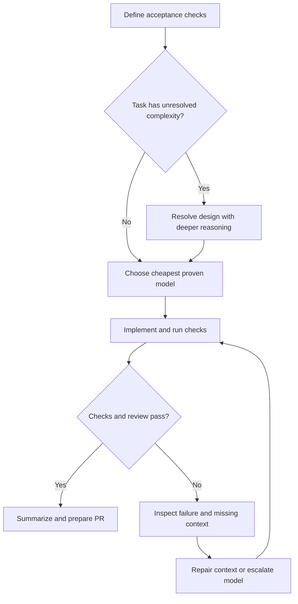
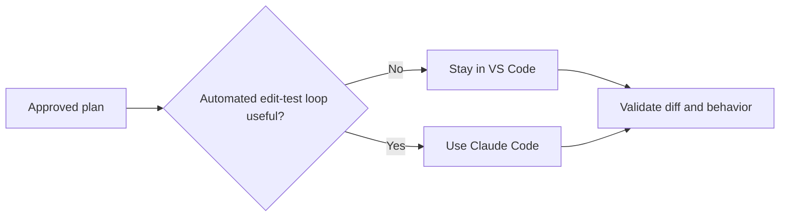

# Tokenomics & Model Routing for Coding Workflows

Use the cheapest model that reliably completes the task. Spend more when a missed dependency, security boundary, or design mistake would create expensive rework.

This guide adapts the supplied directive for a workflow centered on **VS Code (95%)**, with **Claude Code CLI (5%)** for tasks that benefit from an automated edit–test loop. These percentages describe the intended workflow, not an optimal allocation established by experiments.

## 1. Route by the work, not habit

The names below come from the supplied catalog. Treat the matrix as a **starting policy to evaluate**, not a benchmark ranking. Check exact model availability, pricing, and supported reasoning settings in your provider. The source's “GPT 6 Lune” label needs confirmation before use; GPT 5.6 Luna is used here instead.

“Low-Cost,” “Balanced,” and “High-Cost” are the directive's planning labels, not verified relative prices across providers. In particular, GPT 6 Sol should not automatically be assumed more expensive than GPT 5.6 Sol. [OpenAI pricing](https://developers.openai.com/api/docs/pricing)

| Stage | Starting model | Environment | Effort* | Planning tier | Risk when downgrading too far |
|---|---|---|---|---|---|
| 1. Intake & clarification | GPT 5.6 Sol | VS Code | Medium | Balanced | Overlooks ambiguous requirements |
| 2. Architecture & dependencies | GPT 6 Sol | VS Code | High | High-Cost | Misses callers, side effects, or contracts |
| 3. Scope freeze | GPT 5.6 Luna | VS Code | Low | Low-Cost | Marks an incomplete checklist as complete |
| 4. Targeted implementation | GPT 5.6 Sol | VS Code | Medium | Balanced | Produces plausible code that breaks integration |
| 5. Spec alignment | GPT 5.6 Sol | VS Code | Low | Balanced | Checks wording but misses behavioral gaps |
| 6. Execution flow & tests | GPT 5.6 Sol | VS Code | Medium | Balanced | Omits failure paths or weakens assertions |
| 7. Security & performance audit | GPT 6 Sol | VS Code | High | High-Cost | Misses auth, concurrency, or resource risks |
| 8. PR description & feedback | GPT 5.6 Luna | VS Code | Low | Low-Cost | Drops an important finding from the summary |

*Effort is an intent, not a portable API setting. Use Off only where supported and appropriate for straightforward formatting. Claude Sonnet 5/5.5 and Opus 4.8/5/5.5 remain candidate alternatives from the directive; this note does not establish their availability or comparative performance.*

**Downgrade when evidence supports it:** use a low-cost model for explicit checklist matching, mechanical edits, and summaries once it meets the same acceptance checks. Escalate implementation or review when complexity warrants it; high reasoning is not reserved exclusively for stages 2 and 7.

## 2. Keep useful context; drop the debate

Before switching from planning to coding, save a compact handoff: **goal, acceptance criteria, design decisions, affected files and interfaces, constraints, known risks, and test commands**. Start a fresh conversation when the history is mostly exploration; include the handoff and relevant code, not just a vague summary.

| Token driver | Practical response |
|---|---|
| Repeated full-file reads | Send the diff plus enough surrounding code and callers to understand behavior |
| Growing conversation history | Carry forward settled decisions; remove obsolete alternatives |
| Long tool logs and retry loops | Keep actionable errors; diagnose before repeating commands |
| Excessive reasoning or output | Ask for a bounded result; increase effort when failures justify it |
| Lost cache reuse | Measure cached reads and writes before resetting or rearranging context |

**Illustrative arithmetic:** resending an unchanged 20,000-token block over five requests contributes 100,000 input tokens. This is not a bill estimate: caching and provider rates affect cost. Context growth is not inherently exponential. [Prompt caching](https://developers.openai.com/api/docs/guides/prompt-caching)

Give the model symbol definitions, references, and compiler/type-checker output when needed. AST-aware tools help locate dependencies; neither a large context window nor high reasoning guarantees that the right evidence was supplied. Stop increasing effort when it adds no measurable improvement.

## 3. When Claude Code earns its place

Choose the CLI when automated navigation, coordinated edits, and test execution save enough manual work to justify extra agent turns. Start with Sonnet 5 from the proposed catalog; consider Opus 5 for unresolved design complexity, subject to availability and measured results.

There is **no defensible universal “three files” threshold**. A small change can be risky; a large rename can be mechanical. Prefer whichever environment provides the necessary tools with less handoff overhead. [Claude Code cost management](https://code.claude.com/docs/en/costs)

## 4. Make the savings empirical

Compare representative tasks using the same acceptance checks. Record model and effort, uncached/cached input, output and billed reasoning tokens where available, retries, elapsed time, review time, and defects found. Keep task complexity comparable; repeat before generalizing.

**Cost per accepted change = total model/tool spend ÷ accepted changes.** Track developer time separately, or convert it using an explicit hourly rate. A cheap first response is a poor saving if it creates repeated repairs.

Keep compilation, tests, static/security checks, and human review as the quality gates. “Zero defects” is an aspiration; no model routing policy proves it.

---

**Related:**
- [GenAI Cost Optimization](GenAI-cost-Optimization.md) — Broader practices for reducing inference and infrastructure spend.
- [AI Token Optimization Tools](ai-token-optimization-tools.md) — Tools for reducing retrieval, context, and terminal output.
- [Headroom & RTK: Real-World Feedback](Headroom-RTK-Real-World-Feedback-2026.md) — Cache and correctness risks that make end-to-end measurement necessary.
