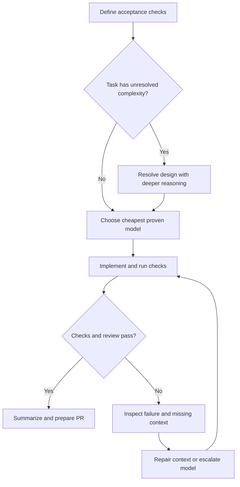
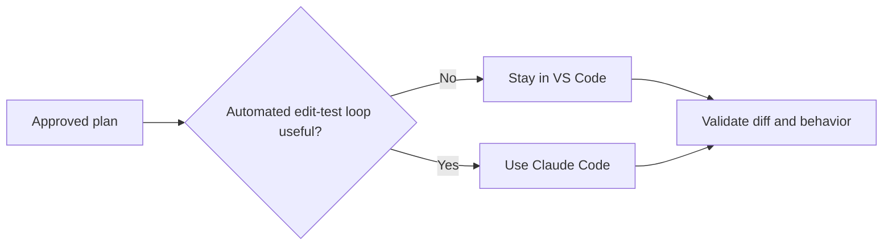

# Tokenomics & Model Routing for Coding Workflows

Use the cheapest model that reliably completes the task. Spend more when a missed dependency, security boundary, or design mistake would create expensive rework.

This guide adapts the supplied directive for a workflow centered on **VS Code (95%)**, with **Claude Code CLI (5%)** for tasks that benefit from an automated edit–test loop. These percentages describe the intended workflow, not an optimal allocation established by experiments.

**Integration scope:** the VS Code extension/provider is not specified. Routing applies generally; slash commands, thinking controls, billing-path TTLs, and session telemetry below are **Claude Code only** unless your extension documents equivalent support. Per-message effort is a Claude API feature, not a guaranteed editor control.

## 1. Route by the work, not habit

The names below come from the supplied catalog. Treat the matrix as a **starting policy to evaluate**, not a benchmark ranking. Check exact model availability, pricing, and supported reasoning settings in your provider. The source's “GPT 6 Lune” label needs confirmation before use; GPT 5.6 Luna is used here instead.

“Low-Cost,” “Balanced,” and “High-Cost” are the directive's planning labels, not verified relative prices across providers. In particular, GPT 6 Sol should not automatically be assumed more expensive than GPT 5.6 Sol. [OpenAI pricing](https://developers.openai.com/api/docs/pricing)

### 1a. GPT routing

| Stage | Starting model | Environment | Effort* | Planning tier | Risk when downgrading too far |
|---|---|---|---|---|---|
| 1. Intake & clarification | GPT 5.6 Sol | VS Code | Medium | Balanced | Overlooks ambiguous requirements |
| 2. Architecture & dependencies | GPT 5.6 Sol; GPT 6 Sol if complex | VS Code | Medium → High if needed | Balanced → High-Cost | Misses callers, side effects, or contracts |
| 3. Scope freeze | Current planning model; Luna at a boundary | VS Code | Keep current effort; Low at a boundary | Current tier / Low-Cost | Marks an incomplete checklist as complete |
| 4. Targeted implementation | GPT 5.6 Sol | VS Code | Medium | Balanced | Produces plausible code that breaks integration |
| 5. Spec alignment | GPT 5.6 Sol | VS Code | Medium | Balanced | Checks wording but misses behavioral gaps |
| 6. Execution flow & tests | GPT 5.6 Sol | VS Code | Medium | Balanced | Omits failure paths or weakens assertions |
| 7. Security & performance audit | GPT 6 Sol | VS Code | High | High-Cost | Misses auth, concurrency, or resource risks |
| 8. PR description & feedback | GPT 5.6 Luna | VS Code | Low | Low-Cost | Drops an important finding from the summary |

*Effort is an intent, not a portable API setting. Use Off only where supported and appropriate for straightforward formatting.*

### 1b. Claude routing (org-supported models only)

**Org-supported catalog:** Opus 4.8, Opus 5, Opus 5.5, Sonnet 5, and Sonnet 5.5. No smaller Claude tier is available in this workflow.

**Standard API list prices, checked October 6, 2026 ($ per million tokens):**

| Model | Input | Output | Cache read |
|---|---|---|---|
| Sonnet 5 / 5.5 | $2 | $10 | $0.20 |
| Opus 4.8 / 5 | $5 | $25 | $0.50 |
| Opus 5.5 | $4 | $20 | $0.20 |

Sonnet 5 is not cheaper per token than 5.5; Opus 5.5 is cheaper per token than 5/4.8. Task token use, quality, contracted rates, and subscription allowances still determine value. [Anthropic list pricing](https://platform.claude.com/docs/en/build-with-claude/prompt-caching#pricing)

| Stage | Starting model | Fallback / escalation | Environment | Effort* | Planning tier | Risk when downgrading too far |
|---|---|---|---|---|---|---|
| 1. Intake & clarification | Sonnet 5.5 | Opus 5.5 | VS Code | Medium | Balanced | Overlooks ambiguous requirements |
| 2. Architecture & dependencies | Sonnet 5.5 | Opus 5.5 if complex | VS Code | Medium → High if needed | Balanced → High-Cost | Misses callers, side effects, or contracts |
| 3. Scope freeze | Current planning model | Sonnet 5 if proven cheaper per task at a boundary | VS Code | Keep current effort; Low at a boundary | Current tier | Marks an incomplete checklist as complete |
| 4. Targeted implementation | Sonnet 5.5 | Opus 5.5 | VS Code | Medium | Balanced | Produces plausible code that breaks integration |
| 5. Spec alignment | Sonnet 5.5 | Opus 5.5 | VS Code | Medium | Balanced | Checks wording but misses behavioral gaps |
| 6. Execution flow & tests | Sonnet 5.5 | Opus 5.5 | VS Code | Medium | Balanced | Omits failure paths or weakens assertions |
| 7. Security & performance audit | Opus 5.5 | Opus 5/4.8 if evaluations favor them | VS Code | High | High-Cost | Misses auth, concurrency, or resource risks |
| 8. PR description & feedback | Sonnet 5.5 | Sonnet 5 if proven cheaper per task | VS Code | Low | Balanced | Drops an important finding from the summary |

*Effort is an intent, not a portable setting; map it to whatever reasoning/thinking control your VS Code integration or Claude Code exposes.*

**Stage 2 escalation triggers:** changes to public contracts; multiple callers or modules; persistence, auth, or concurrency; migrations; or unclear requirements. Any hit routes architecture review to **GPT 6 Sol or Opus 5.5 at High**. Resolve uncertainty before implementation; this is a conservative workflow rule, not a benchmark claim.

**Keep the default simple:** Sonnet 5.5 for routine work; Opus 5.5 for unresolved complexity or high-risk review. Opus 5 and 4.8 are alternatives only if evaluations show a benefit. Retain Sonnet 5 for mechanical tasks only if it achieves lower total task cost at acceptable quality; test whether thinking can be disabled in your integration rather than assuming it.

**Downgrade when evidence supports it:** reduce effort or use a cheaper proven option for mechanical work. Sonnet 5.5 and Opus 5.5 cannot disable thinking in Claude Code; `/effort` controls reasoning intensity. Escalate whenever task risk warrants it. [Claude Code thinking controls](https://code.claude.com/docs/en/costs#adjust-extended-thinking)



Claude escalation for step I, after repairing context: **Sonnet 5.5 → Opus 5.5**. Opus 5/4.8 are evaluated alternatives, not cost-saving steps.

**Review behavior, not just presence:** map each acceptance criterion to the implementation and a test or concrete execution path. Mechanical checklist checks can run at Low effort; keep semantic alignment at Medium by default. Escalate based on risk and missed findings, not simply the model that wrote the code.

**Reasoning has a cost:** OpenAI reasoning and Claude thinking tokens are billed as output tokens, including reasoning not shown in the answer. Bound the question (for example, concurrency, state changes, and API compatibility); use provider-supported budget controls where available. Low/Medium/High do not imply universal token caps or a fixed cost multiplier. [OpenAI reasoning billing](https://developers.openai.com/api/docs/guides/reasoning) · [Claude thinking billing](https://code.claude.com/docs/en/costs#adjust-extended-thinking)

**Reduce switching friction:** the eight stages are checkpoints, not eight required model or effort changes. Keep stages 4–6 on the same model and effort unless evidence warrants a change.

| Working group | Stages | Practical default |
|---|---|---|
| Discover & lock scope | 1–3 | Balanced model; escalate unresolved architecture, then save a handoff |
| Build & validate | 4–6 | Stay on GPT 5.6 Sol or Sonnet 5.5 for the edit–test–review loop |
| Audit & prepare PR | 7–8 | High effort by default for audit; summarize with the cheapest proven option |

## 2. Keep useful context; drop the debate

Before switching from planning to coding, save a compact handoff: **goal, acceptance criteria, design decisions, affected files and interfaces, constraints, known risks, and test commands**. Start fresh when obsolete exploration obscures the task, but compare the reset cost with continuing a cached session. Include the handoff and relevant code, not just a vague summary.

```markdown
## Handoff: [ticket/module]
- Objective and acceptance criteria:
- Target files and public interface changes:
- Design decisions, constraints, and non-goals:
- Edge cases and known risks:
- Test commands and current results:
```

Make non-goals concrete—for example, “no new helper framework or public API changes”—to constrain unnecessary abstractions and scope expansion.

| Token driver | Practical response |
|---|---|
| Repeated full-file reads | Send the diff plus enough surrounding code and callers to understand behavior |
| Growing conversation history | Carry forward settled decisions; remove obsolete alternatives |
| Long tool logs and retry loops | Keep actionable errors; diagnose before repeating commands |
| Excessive reasoning or output | Ask for a bounded result; increase effort when failures justify it |
| Lost cache reuse | Compare total input cost, including cache writes, before resetting or compacting |
| Large instruction files | Keep essential rules short; load detailed references on demand and enforce style with tooling |

**Illustrative arithmetic:** resending an unchanged 20,000-token block over five requests contributes 100,000 input tokens. This is not a bill estimate: caching and provider rates affect cost. Context growth is not inherently exponential. [Prompt caching](https://developers.openai.com/api/docs/guides/prompt-caching)

**Switch at useful boundaries:** prefer changing model/effort after stage 3 or before stage 7, carrying a compact handoff, relevant diff, and check results. Start fresh if that removes obsolete context, but compare reset/write costs with continuing the cached session. Within discovery, keep stage 3 at the current planning effort (normally Medium, High after escalation). Lower effort for stage 8 at a summary boundary only when worthwhile; use supported per-message effort where the integration exposes it. Escalate promptly if risk demands it, regardless of boundaries.

**Preserve reusable context:** keep instructions and tool definitions stable, followed by changing task details. Cache hits require matching eligible prefixes; resets, compaction, and model changes may lose reuse. Claude request-level thinking/effort changes invalidate cached messages; supported per-message effort changes can preserve earlier prefixes. [OpenAI caching](https://developers.openai.com/api/docs/guides/prompt-caching) · [Claude caching](https://platform.claude.com/docs/en/build-with-claude/prompt-caching)

**Watch lifetime and rates:** Claude API defaults to five minutes, refreshed on reuse and measured from request start, so response generation time counts against the lifetime. Writes cost 1.25× base input for five minutes or 2× for one hour, in place of, not on top of, the 1× base rate. Reads cost 0.1×, except Opus 5.5 at 0.05×. Claude Code uses one hour on subscriptions, five minutes by default on API/cloud or usage credits, with overrides available. Check `/usage` for the effective TTL. Batch useful work without rushing review or sending keep-alive prompts. [Cache rates](https://platform.claude.com/docs/en/build-with-claude/prompt-caching#pricing) · [Claude Code TTL](https://code.claude.com/docs/en/costs#why-usage-climbs-in-a-long-session)

Give the model symbol definitions, references, and compiler/type-checker output when needed. AST-aware tools help locate dependencies; neither a large context window nor high reasoning guarantees that the right evidence was supplied. Stop increasing effort when it adds no measurable improvement.

## 3. When Claude Code earns its place

Choose the CLI when automated navigation, coordinated edits, and test execution save enough manual work to justify extra agent turns.

| Situation | Claude Code model | Why |
|---|---|---|
| Routine edit–test loop, plan already approved | Sonnet 5.5 | Settled design; the loop does the work |
| Mechanical or repetitive changes (renames, bulk edits) | Sonnet 5.5 Low; test Sonnet 5 | Same list price; compare total task cost |
| Repeated failures or unresolved design complexity | Opus 5.5 | Escalate after context repair, not before |
| High-stakes cross-cutting change | Opus 5.5 | Cost of a missed dependency exceeds model cost |

Model choice stays subject to your org's pricing and measured results; Opus 4.8 can be added to the comparison as another Opus-tier data point; do not assume it is cheaper.

**Keep loops bounded:** if the same failure repeats twice without new evidence, pause for diagnosis before another edit. This is a practical tripwire, not a mandatory session reset. Preserve the error, inspect the cause, and repair context or seek help. For supported non-interactive runs, set a spend cap with `--max-budget-usd`; use available turn limits too.

Use targeted tests during iteration, then run the required broader checks before completion. When discovery history becomes distracting, consider `/compact` with instructions to preserve decisions, code changes, and test results; compaction can reduce cache reuse. Inspect `/usage` for token counts; v2.1.251+ shows cache warmth and TTL. Session dollars are list-price estimates unless admins configure `modelPricing`, not subscription-seat bills. Use provider billing for actual spend. [Claude Code cost management](https://code.claude.com/docs/en/costs)

There is **no defensible universal “three files” threshold**. A small change can be risky; a large rename can be mechanical. Prefer whichever environment provides the necessary tools with less handoff overhead. [Claude Code cost management](https://code.claude.com/docs/en/costs)



## 4. Make the savings empirical

Compare representative tasks using the same acceptance checks. Record model and effort, uncached/cached input, output and billed reasoning tokens where available, retries, tokens/spend attributable to fixes or reverts, elapsed time, review time, and defects found. Avoid counting reasoning tokens twice if the provider already includes them in output totals. Keep task complexity comparable; repeat before generalizing.

Run three focused Claude comparisons, holding task scope and acceptance checks constant:

| Stages | Comparison | Primary metric |
|---|---|---|
| 3, 8: checklists and summaries | Sonnet 5 with thinking off, if supported, vs Sonnet 5.5 Low | Total task cost at equal acceptance quality, including switching/cache costs |
| 7: audit | Opus 5.5 vs Opus 5/4.8 | Seeded defects caught, with false positives and task cost recorded |
| 2: architecture | Sonnet 5.5 High vs Opus 5.5 High | Required dependencies/contracts identified and design checks passed, with task cost recorded |

**Cost per accepted change = total model/tool spend ÷ accepted changes.** Track developer time separately, or convert it using an explicit hourly rate. A cheap first response is a poor saving if it creates repeated repairs.

Run compilation/type checks, linting, and relevant tests in stage 4 before stage 5 alignment review. Stage 6 assesses test adequacy, failure paths, and missing cases; stage 7 reviews security and performance risks. Keep these checks and human review as the quality gates. “Zero defects” is an aspiration; no model routing policy proves it.

---

**Related:**
- [GenAI Cost Optimization](GenAI-cost-Optimization.md) — Broader practices for reducing inference and infrastructure spend.
- [AI Token Optimization Tools](ai-token-optimization-tools.md) — Tools for reducing retrieval, context, and terminal output.
- [Headroom & RTK: Real-World Feedback](Headroom-RTK-Real-World-Feedback-2026.md) — Cache and correctness risks that make end-to-end measurement necessary.
