# Microsoft Agent Lightning: Complete Developer Guide

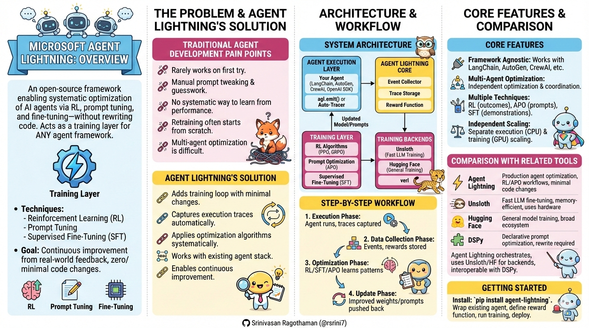

---

## Overview

Microsoft Agent Lightning is an open-source framework that enables systematic optimization of AI agents through reinforcement learning, prompt tuning, and fine-tuning—without rewriting your existing agent code. It acts as a training layer that works with any agent framework.


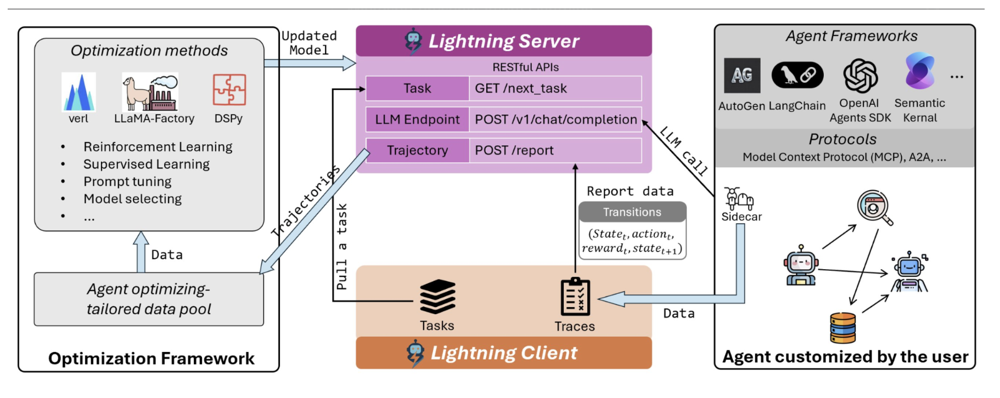

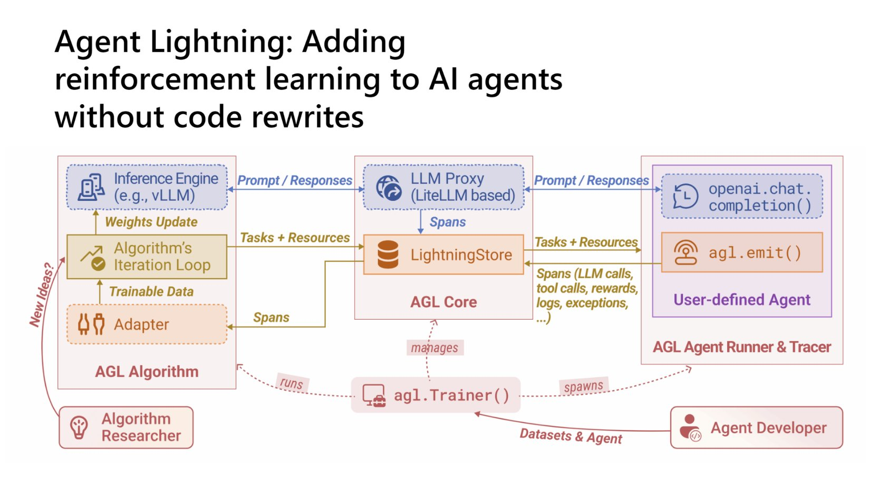

## The Problem Agent Lightning Solves

**Traditional Agent Development Pain Points:**
- Building AI agents rarely works on the first try
- Improvement requires manual prompt tweaking and guesswork
- No systematic way to learn from agent performance
- Retraining often means starting from scratch
- Multi-agent systems are hard to optimize individually

**Agent Lightning's Solution:**
- Adds a training loop with minimal code changes
- Captures execution traces automatically
- Applies RL/optimization algorithms systematically
- Works with your existing agent stack
- Enables continuous improvement from real-world feedback

## Architecture

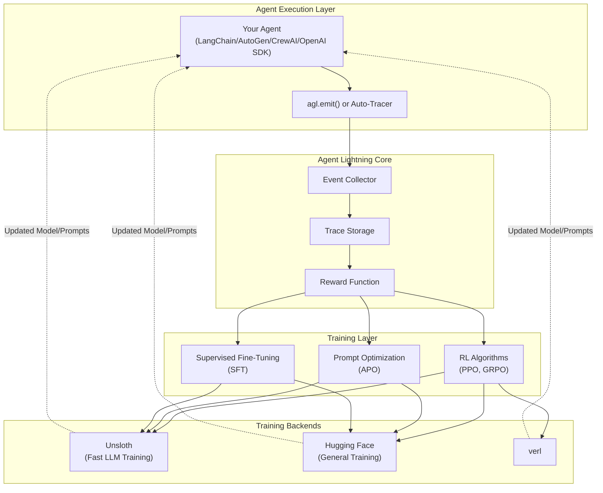

## How Agent Lightning Works

### Step-by-Step Workflow

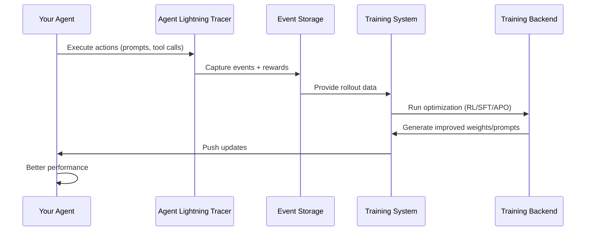

**1. Execution Phase:**
- Your agent runs normally with your chosen framework
- Add lightweight `agl.emit()` calls or enable auto-tracing
- Agent Lightning captures every prompt, tool call, and outcome

**2. Data Collection Phase:**
- All interactions stored as structured events
- Rewards assigned based on outcomes (success/failure, custom metrics)
- Traces organized for training consumption

**3. Optimization Phase:**
- Choose algorithm: RL (PPO, GRPO), Prompt Optimization (APO), or Supervised Fine-Tuning (SFT)
- System learns patterns from collected data
- Generates improved prompts or model weights

**4. Update Phase:**
- Trainer pushes optimizations back to your agent
- Agent improves without code rewrites
- Continuous learning loop established

## Core Features

### 1. Framework Agnostic

Works with **ANY** agent framework with zero or minimal code changes:

| Framework | Integration Effort | Notes |
|-----------|-------------------|-------|
| LangChain | Minimal | Wrap with tracer |
| AutoGen | Minimal | Auto-capture supported |
| CrewAI | Minimal | Direct integration |
| OpenAI Agent SDK | Minimal | Native support |
| Custom Python | Minimal | Add emit calls |
| Microsoft Agent Framework | Minimal | Built-in support |

**No rewrite required** - Agent Lightning wraps your existing workflows.

### 2. Multi-Agent Optimization

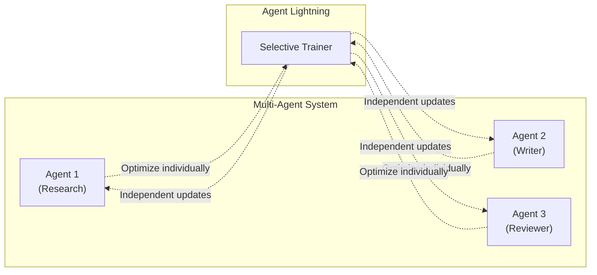

- Optimize individual agents within multi-agent systems
- Each agent learns independently
- Maintains system-wide coordination

### 3. Multiple Optimization Techniques

| Technique | Use Case | When to Use |
|-----------|----------|-------------|
| **Reinforcement Learning (RL)** | Learning from outcomes over time | Complex decision-making, multi-step tasks |
| **Automatic Prompt Optimization (APO)** | Improving prompts systematically | Quick wins, prompt-sensitive tasks |
| **Supervised Fine-Tuning (SFT)** | Learning from labeled examples | Known correct behaviors, demonstrations |
| **Reward-Based Learning** | Custom success metrics | Domain-specific goals |

### 4. Independent Scaling

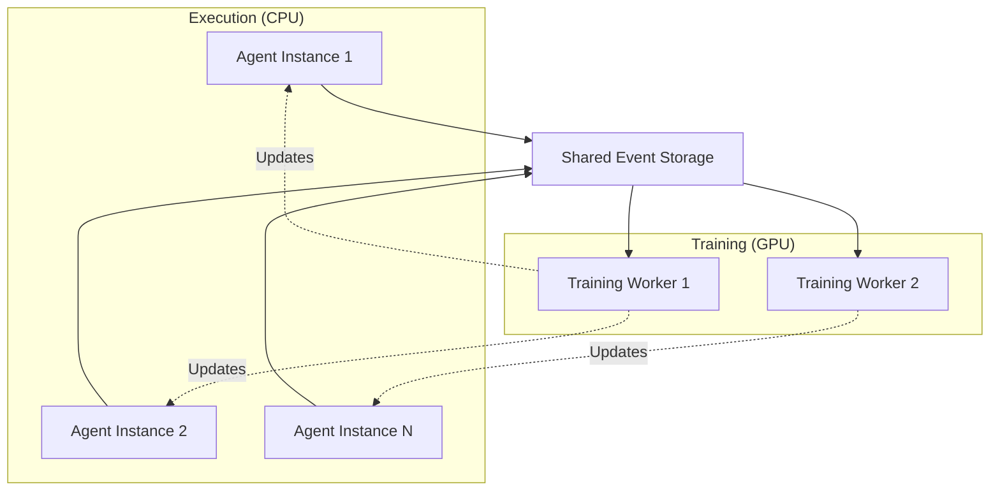

- Scale agent execution (CPU-bound) separately from training (GPU-bound)
- Cost-efficient resource allocation
- Production-ready architecture

## Comparison with Related Tools

### Agent Lightning vs Unsloth vs Hugging Face

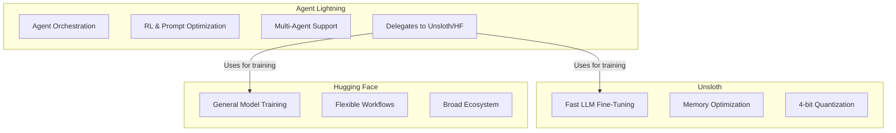

| Feature | Agent Lightning | Unsloth | Hugging Face |
|---------|----------------|---------|--------------|
| **Purpose** | Production agent training & optimization | Fast LLM fine-tuning | General model training |
| **Agent Workflow Management** | ✅ Yes | ❌ No | ❌ No |
| **RL & Prompt Optimization** | ✅ Yes | ❌ No (SFT only) | ❌ Manual setup required |
| **Memory-Efficient Training** | ✅ Via Unsloth | ✅ Yes | ❌ Standard |
| **Multi-Agent Support** | ✅ Yes | ❌ No | ❌ No |
| **Speed Optimization** | ✅ Via backends | ✅ 2-5x faster | Standard |
| **Built on HF Ecosystem** | Partially | ✅ Yes | ✅ Yes |
| **Code Changes Required** | Minimal | Moderate | Moderate |

**Key Relationships:**
- **Agent Lightning** uses **Unsloth** or **Hugging Face** as training backends
- **Unsloth** provides fast, memory-efficient fine-tuning that Agent Lightning leverages
- **Hugging Face** offers foundational training tools

**When to Use Each:**
- **Agent Lightning**: Production agent optimization with RL/APO workflows
- **Unsloth**: Standalone fast LLM fine-tuning with hardware constraints
- **Hugging Face**: Custom model training outside agent context

### Agent Lightning vs DSPy

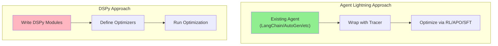

| Feature | Agent Lightning | DSPy |
|---------|----------------|------|
| **Agent Framework** | Works with ANY framework | Requires DSPy API |
| **Setup** | No agent code changes | Rewrite into DSPy modules |
| **Optimization Type** | RL, SFT, APO, reward-based | Prompt & program tuning |
| **Rollout Collection** | From any agent framework | DSPy execution only |
| **Production Focus** | ✅ Multi-agent, context, errors | Prototype & single-agent |
| **Backend Choice** | Unsloth, HuggingFace, verl | HuggingFace or OpenAI API |
| **Interoperability** | ✅ Can use DSPy as optimizer | Standalone framework |

**Important Note:** Agent Lightning and DSPy are **interoperable**. You can use DSPy as the optimization engine while Agent Lightning manages the training loop for agents built in other frameworks.

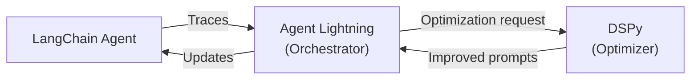

**When to Use:**
- **Agent Lightning**: Existing multi-agent systems, production workflows, any framework
- **DSPy**: New projects requiring declarative prompt optimization
- **Both Together**: Agent Lightning orchestrates, DSPy optimizes prompts

## Implementation Example

### Basic Integration

```python
import agent_lightning as agl

# 1. Initialize Agent Lightning
trainer = agl.Trainer(
    algorithm="ppo",  # or "apo", "sft"
    backend="unsloth"  # fast training
)

# 2. Wrap your existing agent (LangChain example)
from langchain import Agent

agent = Agent(...)

# Option A: Manual event emission
@agl.traced
def run_agent(query):
    result = agent.run(query)
    agl.emit("result", result)
    agl.emit("reward", calculate_reward(result))
    return result

# Option B: Auto-tracing (even simpler)
agent = agl.wrap(agent, auto_trace=True)

# 3. Define reward function
def calculate_reward(result):
    if result.success:
        return 1.0
    return -0.5

# 4. Train
trainer.train(
    agent=agent,
    num_episodes=100,
    reward_fn=calculate_reward
)

# 5. Deploy improved agent
optimized_agent = trainer.get_optimized_agent()
```

### Multi-Agent System

```python
# Optimize individual agents in a system
research_agent = agl.wrap(ResearchAgent())
writer_agent = agl.wrap(WriterAgent())
reviewer_agent = agl.wrap(ReviewerAgent())

# Train each independently
trainer.train(research_agent, reward_fn=research_reward)
trainer.train(writer_agent, reward_fn=writing_reward)
# Leave reviewer unchanged if performing well
```

## Performance Characteristics

### Training Speed Comparison

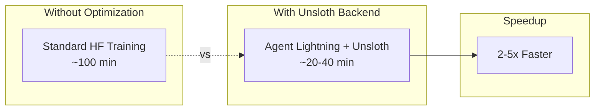

**Key Performance Benefits:**
- **2-5x faster training** when using Unsloth backend
- **Memory efficiency**: Larger models on smaller GPUs (4-bit quantization)
- **Scalability**: Independent CPU (agents) and GPU (training) scaling
- **Continuous improvement**: No downtime for retraining

### Resource Optimization

| Resource | Traditional Approach | Agent Lightning |
|----------|---------------------|-----------------|
| GPU Memory | High (full precision) | Low (4-bit quantization via Unsloth) |
| Training Time | 100+ minutes | 20-40 minutes (with Unsloth) |
| Code Changes | Major refactoring | Minimal wrapper |
| Production Deployment | Separate system | Integrated loop |

## Use Cases

### 1. Customer Support Agents
- Reward: Customer satisfaction scores
- Optimization: Improve response quality over time
- Framework: Any (LangChain, AutoGen, custom)

### 2. Code Generation Agents
- Reward: Code passes tests, follows style
- Optimization: Learn from successful patterns
- Training: SFT on good examples + RL for edge cases

### 3. Multi-Agent Research Systems
- Reward: Research quality, citation accuracy
- Optimization: Each agent (researcher, writer, fact-checker) independently
- Framework: CrewAI or custom orchestration

### 4. Tool-Using Agents
- Reward: Task completion, efficiency
- Optimization: Learn when and how to use tools
- Training: RL for decision-making patterns

## Getting Started

### Installation

```bash
pip install agent-lightning
```

### Quick Start Checklist

1. ✅ **Choose your agent framework** (LangChain, AutoGen, etc.)
2. ✅ **Build your agent** using familiar tools
3. ✅ **Add Agent Lightning wrapper** (2-3 lines of code)
4. ✅ **Define reward function** for your use case
5. ✅ **Run training** with your chosen algorithm
6. ✅ **Deploy optimized agent** back to production

### Minimal Example

```python
import agent_lightning as agl

# Your existing agent
my_agent = build_my_agent()  # Any framework

# Wrap and optimize
optimized = agl.optimize(
    agent=my_agent,
    algorithm="apo",  # Automatic Prompt Optimization
    episodes=50,
    reward_fn=lambda x: 1.0 if x.success else 0.0
)

# Use improved agent
result = optimized.run("your task")
```

## Key Advantages

### For Developers
- **No rewrite**: Works with existing code
- **Framework agnostic**: Not locked into one ecosystem
- **Systematic improvement**: No more guesswork
- **Production ready**: Built for real-world deployment

### For Architects
- **Scalable**: Independent agent/training scaling
- **Flexible**: Multiple optimization algorithms
- **Integrable**: Works with current agent infrastructure
- **Observable**: Full trace visibility

### For Organizations
- **Cost effective**: Faster training, better resource usage
- **Risk reduction**: Incremental improvements, not rebuilds
- **Continuous learning**: Agents improve from production data
- **Multi-agent support**: Optimize complex systems

## Limitations & Considerations

1. **Reward Function Design**: Requires domain expertise to define good rewards
2. **Training Data**: Needs sufficient agent executions to learn from
3. **GPU Requirements**: Training backends benefit from GPU access
4. **Algorithm Selection**: Different tasks need different optimization approaches

## Summary

**Agent Lightning is the training layer for AI agents:**

- 🔧 Works with **any agent framework** (LangChain, AutoGen, CrewAI, OpenAI SDK)
- 🚀 **Zero to minimal code changes** required
- 🎯 Supports **RL, APO, and SFT** optimization techniques
- 🔄 Enables **continuous improvement** from production feedback
- 📊 Provides **independent scaling** of execution and training
- 🤝 **Interoperable** with DSPy, Unsloth, and Hugging Face
- 💡 Turns guesswork into **systematic optimization**

**Bottom Line:**
Agent Lightning lowers the barrier to applying reinforcement learning and systematic optimization to AI agents, enabling them to learn from experience without rebuilding systems from scratch. It's "the absolute trainer to light up AI agents."

## References

- [Agent Lightning Documentation](https://microsoft.github.io/agent-lightning/)
- [Microsoft Research Project Page](https://www.microsoft.com/en-us/research/project/agent-lightning/)
- [GitHub Repository](https://github.com/microsoft/agent-lightning)
- [Unsloth Integration Guide](https://microsoft.github.io/agent-lightning/stable/how-to/unsloth-sft/)
- [Research Paper](https://huggingface.co/papers/2508.03680)
- [DSPy Optimization Documentation](https://dspy.ai/learn/optimization/optimizers/)

**Related:**
- [Autonomous-AI-Agents](../../Agents/analysis/Autonomous-AI-Agents.md) — Both center on the operational challenges of autonomous agents; this file supplies the training/reward infrastructure the analysis piece assumes agents can be improved with.
- [The-Science-of-Scaling-AI-Agent-Systems](../../../Papers/scaling/The-Science-of-Scaling-AI-Agent-Systems.md) — Empirical study showing multi-agent setups often hurt performance; Agent Lightning's per-agent trainer directly addresses which agents in a system are worth optimizing.
- [ContinualLearning](../training/ContinualLearning.md) — Both tackle knowledge retention without full retraining; Agent Lightning uses RL rollouts while Continual Learning covers the architectural memory hierarchy underneath.
- [OpenResponses-Open-Inference-Standard](OpenResponses-Open-Inference-Standard.md) — Open Responses standardizes the agentic loop that Agent Lightning then optimizes via trace collection and reward signals.
