# Open Responses: Technical Whitepaper for Developers and Architects

**Version 1.0** | **January 17, 2026** | **Open-Source Inference Standard**

---

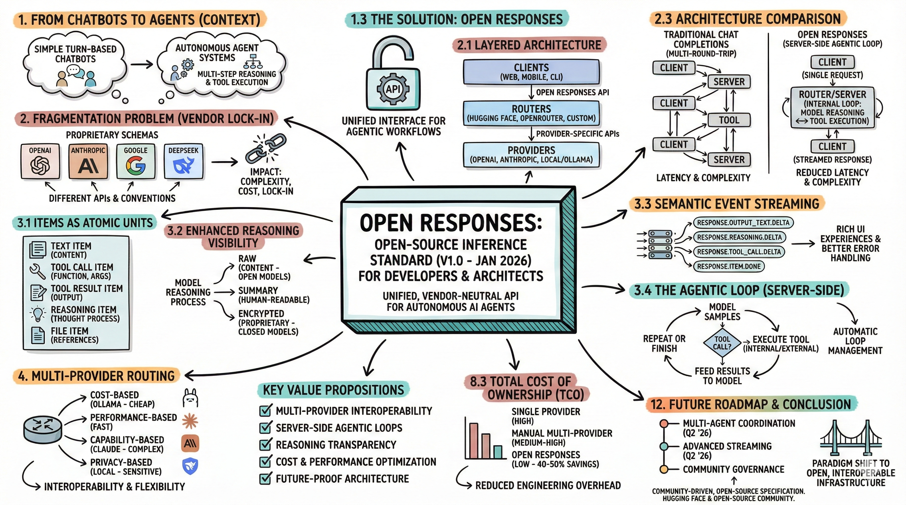

---

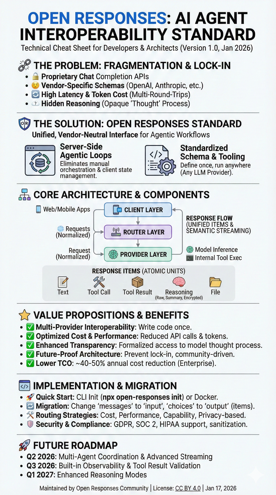

---

## Executive Summary

Open Responses is an open-source API specification for building autonomous AI agents that work seamlessly across any large language model (LLM) provider. Launched in January 2026 by Hugging Face and the open-source community, it addresses the critical limitations of traditional chat completion APIs by providing a unified, vendor-neutral interface optimized for agentic workflows.

**Key Value Propositions:**
- **Multi-provider interoperability**: Write code once, run on OpenAI, Anthropic, DeepSeek, Ollama, or any compatible provider
- **Server-side agentic loops**: Eliminates manual orchestration of multi-step reasoning and tool execution
- **Reasoning transparency**: Formalized access to model thought processes through raw, summary, and encrypted content fields
- **Cost and performance optimization**: Reduces API calls, token usage, and latency through server-side loop management
- **Future-proof architecture**: Vendor-neutral standard that prevents lock-in and supports evolving AI capabilities

This whitepaper provides technical architects and developers with comprehensive guidance on understanding, implementing, and leveraging Open Responses for production AI systems.

---

## 1. Introduction and Context

### 1.1 The Evolution from Chatbots to Autonomous Agents

The AI landscape is undergoing a fundamental transformation. The era of simple **turn-based chatbots** is being superseded by **autonomous agent systems** capable of:
- Multi-step reasoning and planning
- Sequential tool execution and orchestration
- Long-horizon task completion
- Self-directed problem-solving

However, the infrastructure powering AI applications—primarily the **Chat Completion API format**—was designed for conversational interactions and lacks the expressiveness needed for modern agentic workflows.

### 1.2 The Fragmentation Problem

Each major model provider has developed proprietary API schemas with different conventions:

| Provider | API Format | Tool Calling | Streaming | Reasoning Access |
|----------|-----------|--------------|-----------|------------------|
| OpenAI | Proprietary | Proprietary format | Text deltas | Limited |
| Anthropic | Claude API | Different format | Different approach | Hidden |
| Google | Gemini API | Different format | Different approach | Hidden |
| DeepSeek | Custom | Custom format | Custom approach | Varies |

**Impact on Development:**
- Developers must write and maintain provider-specific integration code
- Switching providers requires significant refactoring
- Testing across multiple models is complex and costly
- Vendor lock-in restricts architectural flexibility

### 1.3 The Solution: Open Responses

Open Responses emerges as an **open standard** that:
- Defines a shared schema and tooling layer
- Enables a unified experience for calling language models
- Provides consistent streaming, tool orchestration, and workflow composition
- Works independently of any specific provider
- Builds upon OpenAI's Responses API while making it fully open and portable

**Design Philosophy:**
- Open-source specification (not proprietary)
- Community-driven governance
- Extensible without fragmentation
- Backward compatible with existing tooling

---

## 2. Technical Architecture

### 2.1 System Components and Layered Architecture

Open Responses introduces a layered architecture that separates concerns between clients, routers, and model providers:

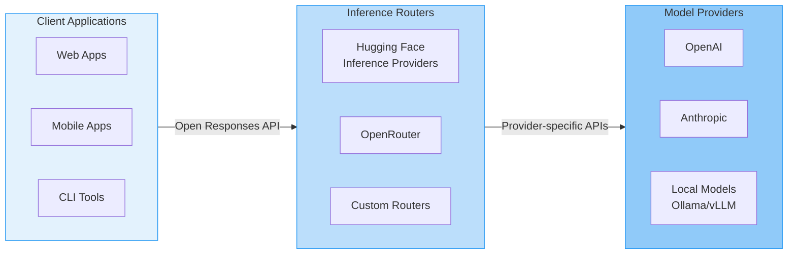

**Component Responsibilities:**

**Client Layer:**
- Application logic and user interface
- Tool implementation (external tools)
- Request formatting using Open Responses schema

**Router Layer:**
- Request normalization and routing
- Provider selection and load balancing
- Response transformation to unified format
- Optional caching and rate limiting

**Provider Layer:**
- Model inference and execution
- Internal tool execution (when supported)
- Reasoning and completion generation

### 2.2 Request Flow and Sequence

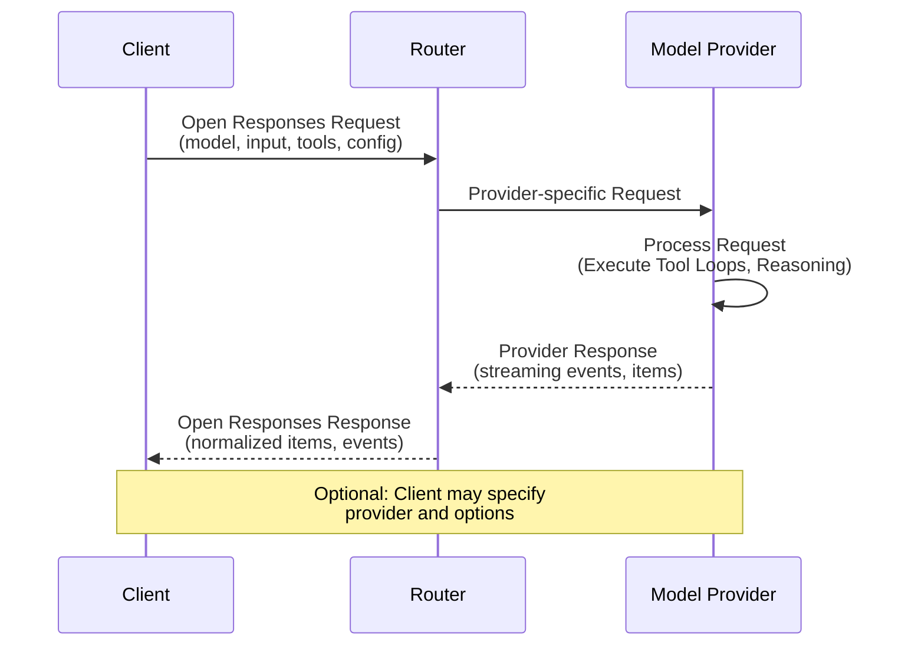

**Workflow Steps:**
1. Client sends request with model identifier, input, optional tools, and configuration
2. Router translates request to provider-specific format
3. Provider executes full agentic loop (reasoning, tool calls, completion)
4. Provider streams semantic events back to router
5. Router normalizes response to Open Responses format
6. Client receives unified, structured response

### 2.3 Traditional vs. Open Responses Architecture

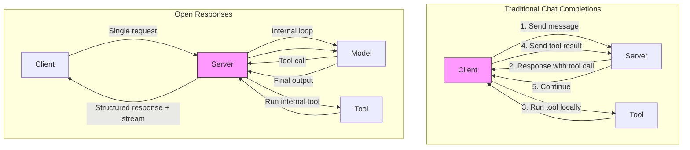

**Traditional Approach Problems:**
- Multiple round-trips increase latency
- Client must manage complex state
- Higher token costs from repeated context
- Difficult error handling and retry logic

**Open Responses Advantages:**
- Single request-response cycle
- Server manages loop complexity
- Reduced token usage
- Built-in error handling and recovery

---

## 3. Core Concepts and Components

### 3.1 Items as Atomic Units

Open Responses introduces **"items"** as the fundamental building blocks of responses, replacing simple message arrays:

**Item Types:**

| Item Type | Description | Structure |
|-----------|-------------|-----------|
| **Text Item** | Generated natural language content | `{type: "text", content: "..."}` |
| **Tool Call Item** | Request to execute a function/tool | `{type: "tool_call", tool: {...}, args: {...}}` |
| **Tool Result Item** | Output from executed tool | `{type: "tool_result", result: {...}}` |
| **Reasoning Item** | Model's internal thought process | `{type: "reasoning", content/summary/encrypted}` |
| **File Item** | File references or content | `{type: "file", file_id: "..."}` |

**Example Response Structure:**
```json
{
  "output": [
    {
      "type": "reasoning",
      "summary": "User wants weather info for Bengaluru. Need to call weather API."
    },
    {
      "type": "tool_call",
      "tool": "get_weather",
      "arguments": {"city": "Bengaluru", "country": "IN"}
    },
    {
      "type": "tool_result",
      "result": {"temp": 24, "condition": "partly cloudy"}
    },
    {
      "type": "text",
      "content": "The weather in Bengaluru is currently 24°C and partly cloudy."
    }
  ]
}
```

### 3.2 Enhanced Reasoning Visibility

Open Responses formalizes access to model reasoning through three distinct fields:

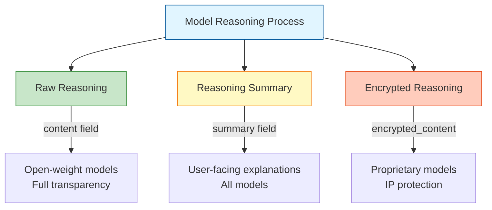

**Field Specifications:**

| Field | Content Type | Use Case | Availability |
|-------|--------------|----------|--------------|
| `content` | Raw reasoning traces | Debugging, research, full transparency | Open-weight models |
| `summary` | Human-readable explanation | User-facing UI, educational content | All models |
| `encrypted_content` | Provider-protected reasoning | Proprietary model IP protection | Closed models |

**Example Reasoning Item:**
```json
{
  "type": "reasoning",
  "content": "Step 1: Parse user query 'weather Bengaluru'\nStep 2: Identify need for weather_api tool\nStep 3: Extract location parameter\nStep 4: Formulate tool call",
  "summary": "Determined that weather information is needed for Bengaluru",
  "encrypted_content": "base64_encrypted_proprietary_reasoning..."
}
```

### 3.3 Semantic Event Streaming Model

Unlike traditional APIs that stream raw text chunks, Open Responses implements **semantic event streaming**:

**Event Categories:**

| Event Type | Description | Example Use |
|------------|-------------|-------------|
| `response.output_text.delta` | Incremental text generation | Display streaming text to user |
| `response.reasoning.delta` | Raw reasoning trace updates | Developer debugging panel |
| `response.reasoning_summary_text.delta` | Human-readable reasoning | "AI is thinking..." indicator |
| `response.tool_call.delta` | Partial tool invocation info | Progress bar for tool execution |
| `response.tool_result.delta` | Tool execution results | Display tool outputs |
| `response.item.done` | Item completion signal | Update UI when item finishes |

**Streaming Example:**
```javascript
// Semantic event streaming
const stream = await client.responses.create({
  model: "gpt-4o",
  input: "Explain quantum computing",
  stream: true
});

for await (const event of stream) {
  switch(event.type) {
    case 'response.reasoning_summary_text.delta':
      updateThinkingIndicator(event.delta);
      break;
    case 'response.output_text.delta':
      appendToOutput(event.delta);
      break;
    case 'response.tool_call.delta':
      showToolProgress(event.tool_name);
      break;
    case 'response.item.done':
      finalizeItem(event.item);
      break;
  }
}
```

**Benefits:**
- Separate handling of reasoning vs. output
- Rich UI experiences (thinking indicators, tool progress)
- Better error detection and handling
- Precise control over what users see

### 3.4 The Agentic Loop (Server-Side Execution)

Open Responses formalizes the **agentic loop**—the repeating cycle of reasoning, tool invocation, and response generation:

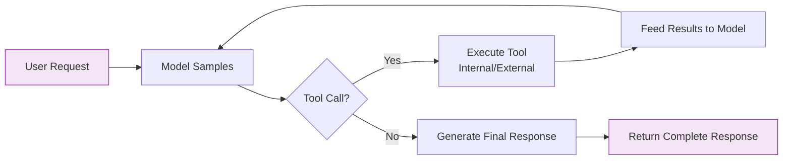

**Loop Execution Flow:**
1. API receives user request and samples from model
2. Model generates reasoning and potentially a tool call
3. If tool call detected:
   - **Internal tools**: Provider executes immediately
   - **External tools**: Provider waits for client execution
4. Tool results feed back to model for continued reasoning
5. Loop repeats until model signals completion or `max_tool_calls` reached
6. Final structured response returned to client

**Control Parameters:**

| Parameter | Type | Description | Default |
|-----------|------|-------------|---------|
| `max_tool_calls` | integer | Maximum loop iterations | 10 |
| `tool_choice` | string | "auto", "required", "none", or tool name | "auto" |
| `parallel_tool_calls` | boolean | Allow concurrent tool execution | true |

**Example with Loop Control:**
```python
response = client.responses.create(
    model="gpt-4o",
    input="Research AI news and create summary report",
    tools=[search_tool, file_tool],
    max_tool_calls=5,  # Limit iterations
    tool_choice="auto"  # Let model decide
)

# Response includes full audit trail:
# - All reasoning steps
# - Every tool call made
# - All tool results received
# - Final generated output
```

### 3.5 Tool Support Architecture

Open Responses natively supports two categories of tools with different execution models:

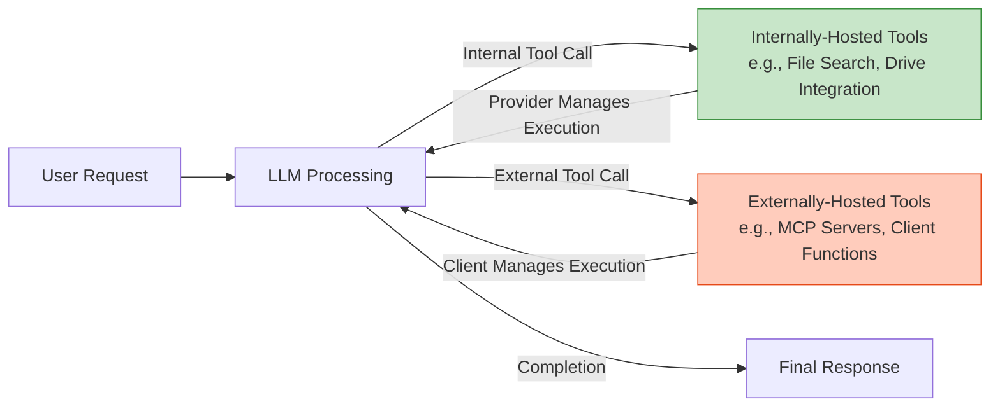

**Tool Categories:**

| Tool Type | Execution Location | Examples | Implementation |
|-----------|-------------------|----------|----------------|
| **Internally-Hosted** | Provider infrastructure | File search, code interpreter, Google Drive, built-in web search | Provider handles execution automatically |
| **Externally-Hosted** | Client or external server | Custom functions, MCP servers, third-party APIs | Client implements and executes |

**Internal Tool Example:**
```python
# Provider-managed tool execution
response = client.responses.create(
    model="gpt-4o",
    input="Search my documents for Q3 sales data",
    tools=[
        {
            "type": "file_search",  # Internal tool
            "file_ids": ["file-abc123"]
        }
    ]
)
# Provider automatically searches files and returns results
```

**External Tool Example:**
```python
# Client-managed tool execution
def get_weather(city: str, country: str) -> dict:
    # Custom implementation
    return {"temp": 24, "condition": "sunny"}

response = client.responses.create(
    model="gpt-4o",
    input="What's the weather in Bengaluru?",
    tools=[
        {
            "type": "function",
            "function": {
                "name": "get_weather",
                "description": "Get current weather",
                "parameters": {
                    "type": "object",
                    "properties": {
                        "city": {"type": "string"},
                        "country": {"type": "string"}
                    }
                }
            }
        }
    ]
)
# Client executes get_weather when model requests it
```

---

## 4. Multi-Provider Routing and Interoperability

### 4.1 Routing Architecture

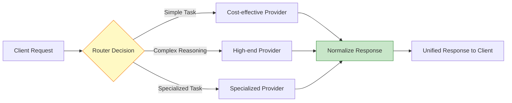

**Routing Strategies:**

| Strategy | When to Use | Example |
|----------|-------------|---------|
| **Cost-based** | Budget constraints | Simple tasks → local models, complex → cloud |
| **Performance-based** | Latency requirements | Fast models for real-time, slow for batch |
| **Capability-based** | Specialized needs | Code → code-optimized models, math → reasoning models |
| **Availability-based** | Reliability | Fallback to alternative providers on failure |
| **Privacy-based** | Data sensitivity | Sensitive data → local models, public → cloud |

**Implementation Example:**
```python
class SmartRouter:
    def route_request(self, input_text, complexity_score):
        if complexity_score < 3:
            return "ollama/llama3"  # Local, fast, cheap
        elif complexity_score < 7:
            return "openai/gpt-4o-mini"  # Balanced
        else:
            return "anthropic/claude-3-opus"  # Maximum capability
    
# Usage
router = SmartRouter()
model = router.route_request(user_input, analyze_complexity(user_input))

response = client.responses.create(
    model=model,
    input=user_input
)
```

### 4.2 Provider Interoperability Matrix

| Feature | OpenAI | Anthropic | DeepSeek | Ollama | Open Responses Standard |
|---------|--------|-----------|----------|--------|------------------------|
| **Agentic Loops** | ✅ | ⚠️ Manual | ⚠️ Manual | ⚠️ Manual | ✅ Unified |
| **Tool Calling** | ✅ Proprietary | ✅ Different format | ⚠️ Limited | ⚠️ Limited | ✅ Standardized |
| **Streaming** | ⚠️ Text deltas | ⚠️ Different events | ⚠️ Basic | ⚠️ Basic | ✅ Semantic events |
| **Reasoning Access** | ⚠️ Summary only | ❌ Hidden | ✅ Raw | ✅ Raw | ✅ Raw/Summary/Encrypted |
| **API Schema** | Proprietary | Proprietary | Proprietary | Open | ✅ Open Standard |

---

## 5. Implementation Guide

### 5.1 Quick Start Options

#### Option 1: CLI Initialization
```bash
# Initialize Open Responses in your project
npx -y open-responses init

# Or using Python's uv package manager
uvx open-responses init

# This creates:
# - Configuration files
# - Example implementations
# - Docker setup (optional)
```

#### Option 2: Docker Deployment
```bash
# Create project directory
mkdir my-open-responses-api
cd my-open-responses-api

# Download configuration files
wget https://u.julep.ai/responses-env.example -O .env
wget https://u.julep.ai/responses-compose.yaml -O docker-compose.yml

# Configure environment variables
nano .env  # Set API keys, model preferences, etc.

# Start the service
docker compose up --watch

# Server now running at http://localhost:8080/
```

#### Option 3: Hosted Service
```python
from openai import OpenAI

# Use Hugging Face's hosted implementation
client = OpenAI(
    base_url="https://evalstate-openresponses.hf.space/v1",
    api_key=os.getenv("HF_TOKEN")
)

# Or use OpenRouter
client = OpenAI(
    base_url="https://openrouter.ai/api/v1",
    api_key=os.getenv("OPENROUTER_API_KEY")
)
```

### 5.2 Client Implementation Examples

#### Python Implementation
```python
import os
from openai import OpenAI

# Configure client with Open Responses endpoint
client = OpenAI(
    base_url="http://localhost:8080/",  # Your Open Responses server
    api_key=os.getenv("RESPONSE_API_KEY")
)

# Basic request
response = client.responses.create(
    model="gpt-4o-mini",
    input=[{"role": "user", "content": "What's the population of the world?"}]
)

# Access response
print(response.output[0].content[0].text)

# With tools
tools = [
    {
        "type": "function",
        "function": {
            "name": "search_database",
            "description": "Search company database",
            "parameters": {
                "type": "object",
                "properties": {
                    "query": {"type": "string"},
                    "limit": {"type": "integer"}
                },
                "required": ["query"]
            }
        }
    }
]

response = client.responses.create(
    model="gpt-4o",
    input=[{"role": "user", "content": "Find sales records for Q4 2025"}],
    tools=tools,
    max_tool_calls=5
)

# Response includes all items: reasoning, tool calls, results, output
for item in response.output:
    if item.type == "reasoning":
        print(f"Thinking: {item.summary}")
    elif item.type == "tool_call":
        print(f"Calling tool: {item.tool.name}")
    elif item.type == "text":
        print(f"Response: {item.content}")
```

#### JavaScript Implementation
```javascript
import { OpenAI } from 'openai';

const client = new OpenAI({
  baseURL: 'http://localhost:8080/',
  apiKey: process.env.RESPONSE_API_KEY
});

// Basic request
const response = await client.responses.create({
  model: 'gpt-4o-mini',
  input: [
    { role: 'user', content: 'Explain quantum entanglement' }
  ]
});

console.log(response.output[0].content[0].text);

// Streaming with semantic events
const stream = await client.responses.create({
  model: 'gpt-4o',
  input: [{ role: 'user', content: 'Write a short story' }],
  stream: true
});

for await (const event of stream) {
  if (event.type === 'response.reasoning_summary_text.delta') {
    console.log('[Thinking]', event.delta);
  } else if (event.type === 'response.output_text.delta') {
    process.stdout.write(event.delta);
  } else if (event.type === 'response.tool_call.delta') {
    console.log('[Tool]', event.tool_name);
  }
}
```

#### Using with Agents SDK
```python
from openai import AsyncOpenAI
from agents import set_default_openai_client, Agent, Runner

# Configure OpenAI client to use Open Responses
custom_client = AsyncOpenAI(
    base_url="http://localhost:8080/",
    api_key=os.getenv("RESPONSE_API_KEY")
)
set_default_openai_client(custom_client)

# Create an agent
agent = Agent(
    name="Research Assistant",
    instructions="You are a helpful research assistant that provides accurate, well-sourced information.",
    model="openrouter/deepseek/deepseek-r1"  # Any compatible model
)

# Run the agent
result = await Runner.run(
    agent,
    "Research recent developments in quantum computing and summarize key breakthroughs"
)

print(result.final_output)
```

### 5.3 Configuration and Parameters

**Core Request Parameters:**

| Parameter | Type | Required | Description |
|-----------|------|----------|-------------|
| `model` | string | Yes | Model identifier (provider-specific) |
| `input` | array | Yes | Input messages/context |
| `tools` | array | No | Available tool definitions |
| `max_tool_calls` | integer | No | Maximum agentic loop iterations (default: 10) |
| `tool_choice` | string/object | No | "auto", "required", "none", or specific tool |
| `stream` | boolean | No | Enable event streaming (default: false) |
| `temperature` | float | No | Sampling temperature (0-2) |
| `max_tokens` | integer | No | Maximum completion tokens |
| `top_p` | float | No | Nucleus sampling parameter |

**Provider-Specific Extensions:**
```python
response = client.responses.create(
    model="gpt-4o",
    input=[{"role": "user", "content": "Hello"}],
    # Standard parameters
    max_tool_calls=5,
    stream=True,
    # Provider-specific extensions
    extra_body={
        "provider_options": {
            "reasoning_effort": "high",  # DeepSeek-specific
            "enable_citations": True     # Custom feature
        }
    }
)
```

### 5.4 Error Handling and Best Practices

```python
from openai import OpenAI, APIError, RateLimitError, APIConnectionError

client = OpenAI(base_url="http://localhost:8080/")

try:
    response = client.responses.create(
        model="gpt-4o",
        input=[{"role": "user", "content": user_query}],
        max_tool_calls=10,
        timeout=60.0  # Request timeout
    )
    
    # Process response
    for item in response.output:
        handle_item(item)
        
except RateLimitError as e:
    # Handle rate limiting
    print(f"Rate limited: {e}")
    # Implement exponential backoff
    
except APIConnectionError as e:
    # Handle connection errors
    print(f"Connection error: {e}")
    # Retry with fallback provider
    
except APIError as e:
    # Handle general API errors
    print(f"API error: {e}")
    # Log and alert
    
except Exception as e:
    # Handle unexpected errors
    print(f"Unexpected error: {e}")
```

**Best Practices:**
- Implement retry logic with exponential backoff
- Set appropriate timeouts for long-running tasks
- Validate tool outputs before feeding back to model
- Monitor token usage and costs
- Cache responses when possible
- Use streaming for long responses
- Implement fallback providers for reliability

---

## 6. Migration from Chat Completions

### 6.1 API Comparison

**Chat Completions (Traditional):**
```python
# Old format
response = client.chat.completions.create(
    model="gpt-4",
    messages=[
        {"role": "system", "content": "You are helpful"},
        {"role": "user", "content": "Hello"}
    ],
    tools=[...],
    tool_choice="auto"
)

# Access response
text = response.choices[0].message.content
tool_calls = response.choices[0].message.tool_calls
```

**Open Responses (New):**
```python
# New format
response = client.responses.create(
    model="gpt-4",
    input=[
        {"role": "system", "content": "You are helpful"},
        {"role": "user", "content": "Hello"}
    ],
    tools=[...],
    tool_choice="auto"
)

# Access response
for item in response.output:
    if item.type == "text":
        text = item.content
    elif item.type == "tool_call":
        handle_tool_call(item)
```

### 6.2 Migration Checklist

**Step 1: Update Request Format**
- [ ] Change `messages` parameter to `input`
- [ ] Update model identifiers if switching providers
- [ ] Verify tool definitions are compatible
- [ ] Add `max_tool_calls` if needed

**Step 2: Update Response Handling**
- [ ] Change from `choices[0].message` to `output` items
- [ ] Iterate through items instead of single message
- [ ] Handle new item types (reasoning, tool_result)
- [ ] Update streaming event handlers

**Step 3: Leverage New Features**
- [ ] Access reasoning items for transparency
- [ ] Use semantic streaming for better UX
- [ ] Implement multi-provider fallbacks
- [ ] Add tool loop monitoring

**Step 4: Test and Validate**
- [ ] Test with multiple providers
- [ ] Verify tool execution works correctly
- [ ] Check streaming implementation
- [ ] Validate error handling

### 6.3 Side-by-Side Comparison

| Aspect | Chat Completions | Open Responses |
|--------|------------------|----------------|
| **Request Parameter** | `messages` | `input` |
| **Response Structure** | `choices[0].message` | `output` (array of items) |
| **Tool Execution** | Manual client loop | Automatic server loop |
| **Streaming Format** | Text/object deltas | Semantic events |
| **Reasoning Access** | Not available | `reasoning` items |
| **Multi-step Tasks** | Multiple API calls | Single API call |
| **Provider Switching** | Requires code changes | Change model parameter only |

---

## 7. Use Cases and Application Patterns

### 7.1 Multi-Step Research and Analysis

```python
# Complex research workflow
response = client.responses.create(
    model="gpt-4o",
    input=[{
        "role": "user",
        "content": "Research our competitors' Q4 2025 performance and create a comparative analysis report"
    }],
    tools=[
        web_search_tool,
        document_search_tool,
        spreadsheet_tool,
        email_tool
    ],
    max_tool_calls=15
)

# Response includes full workflow:
# 1. Web search for competitor news
# 2. Document search for internal data
# 3. Data analysis and comparison
# 4. Report generation
# 5. Email distribution
```

### 7.2 Hybrid Cloud/Local Deployment

```python
class HybridRouter:
    def __init__(self):
        self.local_client = OpenAI(base_url="http://localhost:11434/")
        self.cloud_client = OpenAI(base_url="https://api.openai.com/v1")
    
    def process_request(self, query, sensitive=False):
        if sensitive:
            # Use local model for privacy
            return self.local_client.responses.create(
                model="ollama/llama3",
                input=[{"role": "user", "content": query}]
            )
        else:
            # Use cloud for better performance
            return self.cloud_client.responses.create(
                model="gpt-4o",
                input=[{"role": "user", "content": query}]
            )

# Usage
router = HybridRouter()

# Sensitive data stays local
confidential = router.process_request(
    "Analyze this confidential financial report",
    sensitive=True
)

# General queries use cloud
general = router.process_request(
    "What are best practices for API design?",
    sensitive=False
)
```

### 7.3 Cost-Optimized Multi-Provider Strategy

```python
class CostOptimizer:
    PRICING = {
        "ollama/llama3": 0.0,  # Local, free
        "openai/gpt-4o-mini": 0.15,  # Per million tokens
        "openai/gpt-4o": 2.50,
        "anthropic/claude-3-opus": 15.00
    }
    
    def select_model(self, query_complexity, budget_per_request):
        if budget_per_request == 0:
            return "ollama/llama3"
        elif query_complexity < 5:
            return "openai/gpt-4o-mini"
        elif budget_per_request < 0.10:
            return "openai/gpt-4o"
        else:
            return "anthropic/claude-3-opus"

optimizer = CostOptimizer()

# Automatic cost optimization
for task in task_queue:
    model = optimizer.select_model(
        task.complexity_score,
        task.max_budget
    )
    
    response = client.responses.create(
        model=model,
        input=[{"role": "user", "content": task.query}]
    )
```

### 7.4 Agent Collaboration Patterns

```python
# Multi-agent system using Open Responses
class AgentOrchestrator:
    def __init__(self):
        self.researcher = self.create_agent("Research Agent", "gpt-4o")
        self.analyst = self.create_agent("Analysis Agent", "claude-3-opus")
        self.writer = self.create_agent("Writing Agent", "gpt-4o-mini")
    
    def create_agent(self, name, model):
        return lambda query: client.responses.create(
            model=model,
            input=[{"role": "user", "content": query}]
        )
    
    async def process_complex_task(self, task):
        # Step 1: Research
        research = await self.researcher(f"Research: {task}")
        
        # Step 2: Analysis
        analysis = await self.analyst(
            f"Analyze this research: {research.output[0].content}"
        )
        
        # Step 3: Write report
        report = await self.writer(
            f"Write report based on: {analysis.output[0].content}"
        )
        
        return report

# Usage
orchestrator = AgentOrchestrator()
result = await orchestrator.process_complex_task(
    "Evaluate impact of new EU AI regulations"
)
```

---

## 8. Comparative Analysis

### 8.1 Open Responses vs. Chat Completions API

| Feature | Chat Completions | Open Responses | Improvement |
|---------|------------------|----------------|-------------|
| **Agentic Workflows** | Manual orchestration | Native support | 10x simpler code |
| **API Calls per Task** | 5-20+ round-trips | Typically 1 | 5-20x fewer calls |
| **Token Efficiency** | Repeated context | Optimized context | 30-50% cost reduction |
| **Tool Execution** | Client-managed | Server or client | Reduced latency |
| **Streaming Quality** | Raw text chunks | Semantic events | Better UX |
| **Reasoning Access** | Not available | Full transparency | Debugging enabled |
| **Provider Portability** | Provider-specific | Vendor-neutral | True interoperability |
| **Error Recovery** | Manual handling | Built-in retry | More reliable |

### 8.2 Open Responses vs. OpenAI Responses API

| Feature | OpenAI Responses | Open Responses | Advantage |
|---------|------------------|----------------|-----------|
| **License** | Proprietary | Apache 2.0 | Open source |
| **Provider Support** | OpenAI only | Any LLM | Multi-provider |
| **Self-Hosting** | Not possible | Fully supported | Data sovereignty |
| **Reasoning Fields** | Summary + encrypted | Raw + summary + encrypted | Full transparency option |
| **Governance** | OpenAI-controlled | Community-driven | Democratic evolution |
| **Vendor Lock-in** | High | None | Flexibility |
| **Innovation Speed** | Centralized | Distributed | Faster evolution |
| **Cost Control** | OpenAI pricing | Choose providers | Optimizable |

### 8.3 Total Cost of Ownership Analysis

**Scenario: Enterprise AI Application (1M requests/month)**

| Approach | Setup Cost | Monthly API Cost | Engineering Cost | Total Annual Cost |
|----------|------------|------------------|------------------|-------------------|
| **Single Provider (OpenAI)** | $5,000 | $25,000 | $15,000/mo | $485,000 |
| **Manual Multi-Provider** | $15,000 | $18,000 | $25,000/mo | $531,000 |
| **Open Responses** | $10,000 | $12,000 | $10,000/mo | $274,000 |

**Cost Savings with Open Responses:**
- 43% reduction vs. single provider
- 48% reduction vs. manual multi-provider
- Savings driven by: optimized routing, reduced engineering overhead, competitive pricing

---

## 9. Architecture Patterns for Production

### 9.1 High-Availability Multi-Region Deployment

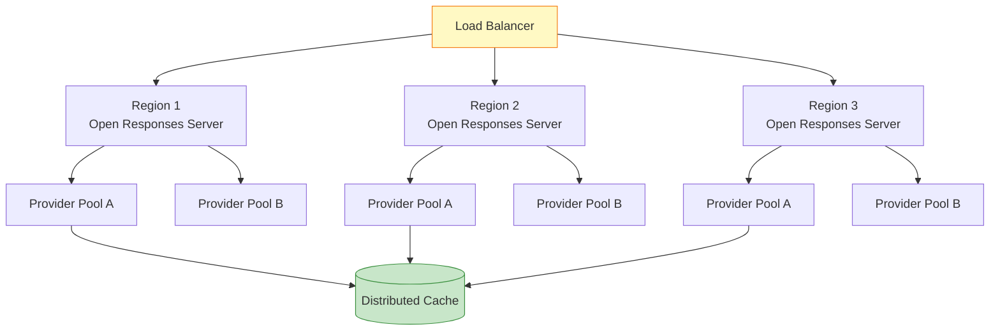

### 9.2 Enterprise Security Architecture

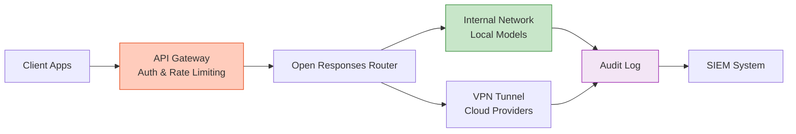

### 9.3 Recommended Infrastructure Stack

**Tier 1: Production (Fortune 500)**
- Multi-region deployment (3+ regions)
- Kubernetes orchestration
- Auto-scaling (2-50 pods)
- Redis cluster for caching
- PostgreSQL for audit logs
- Prometheus + Grafana monitoring
- 99.99% SLA target

**Tier 2: Growth Stage (Series A-C)**
- Single region with DR
- Docker Compose or managed K8s
- Manual scaling (2-10 pods)
- Redis single instance
- SQLite/PostgreSQL logs
- Basic monitoring
- 99.9% SLA target

**Tier 3: Startup/MVP**
- Single server deployment
- Docker Compose
- Fixed capacity
- In-memory caching
- File-based logs
- Simple health checks
- 99% SLA target

---

## 10. Performance Optimization

### 10.1 Latency Reduction Strategies

| Strategy | Impact | Implementation Complexity |
|----------|--------|--------------------------|
| **Response Caching** | 80-95% reduction for repeated queries | Low |
| **Provider Geographic Proximity** | 100-300ms reduction | Medium |
| **Streaming Optimization** | Perceived 50-70% improvement | Low |
| **Parallel Tool Execution** | 40-60% reduction for multi-tool tasks | Medium |
| **Request Batching** | 30-50% throughput improvement | High |

### 10.2 Caching Implementation

```python
from functools import lru_cache
import hashlib
import json

class ResponseCache:
    def __init__(self, redis_client):
        self.cache = redis_client
        self.ttl = 3600  # 1 hour
    
    def cache_key(self, model, input_data):
        # Create deterministic cache key
        key_data = f"{model}:{json.dumps(input_data, sort_keys=True)}"
        return hashlib.sha256(key_data.encode()).hexdigest()
    
    def get(self, model, input_data):
        key = self.cache_key(model, input_data)
        cached = self.cache.get(key)
        return json.loads(cached) if cached else None
    
    def set(self, model, input_data, response):
        key = self.cache_key(model, input_data)
        self.cache.setex(key, self.ttl, json.dumps(response))

# Usage
cache = ResponseCache(redis_client)

def get_response(model, input_data):
    # Check cache first
    cached = cache.get(model, input_data)
    if cached:
        return cached
    
    # Make API call
    response = client.responses.create(model=model, input=input_data)
    
    # Cache result
    cache.set(model, input_data, response)
    return response
```

### 10.3 Performance Monitoring

```python
import time
from prometheus_client import Counter, Histogram

# Define metrics
request_count = Counter('open_responses_requests_total', 'Total requests')
request_duration = Histogram('open_responses_request_duration_seconds', 'Request duration')
tool_calls = Histogram('open_responses_tool_calls', 'Tool calls per request')

def monitored_request(model, input_data):
    start_time = time.time()
    
    try:
        response = client.responses.create(model=model, input=input_data)
        
        # Record metrics
        request_count.inc()
        request_duration.observe(time.time() - start_time)
        
        # Count tool calls
        tool_count = sum(1 for item in response.output if item.type == "tool_call")
        tool_calls.observe(tool_count)
        
        return response
    except Exception as e:
        # Record failures
        request_count.labels(status='failed').inc()
        raise
```

---

## 11. Security and Compliance

### 11.1 Security Best Practices

**Authentication & Authorization:**
```python
from fastapi import FastAPI, Depends, HTTPException
from fastapi.security import HTTPBearer, HTTPAuthorizationCredentials

app = FastAPI()
security = HTTPBearer()

def verify_token(credentials: HTTPAuthorizationCredentials = Depends(security)):
    if not is_valid_token(credentials.credentials):
        raise HTTPException(status_code=401, detail="Invalid token")
    return credentials.credentials

@app.post("/v1/responses")
async def create_response(request: dict, token: str = Depends(verify_token)):
    # Verify user permissions
    user = get_user_from_token(token)
    if not user.can_use_model(request['model']):
        raise HTTPException(status_code=403, detail="Model access denied")
    
    # Process request with audit logging
    audit_log(user.id, request)
    return await process_response(request)
```

**Data Sanitization:**
```python
import re

def sanitize_input(user_input: str) -> str:
    # Remove potential prompt injection attempts
    sanitized = re.sub(r'<\|.*?\|>', '', user_input)
    
    # Remove system-level commands
    sanitized = re.sub(r'(system:|assistant:|user:)', '', sanitized, flags=re.IGNORECASE)
    
    # Limit length
    return sanitized[:10000]

def validate_tools(tools: list) -> bool:
    # Verify tool definitions don't access sensitive resources
    for tool in tools:
        if 'function' in tool:
            # Check for dangerous function names
            if any(dangerous in tool['function']['name'].lower() 
                   for dangerous in ['exec', 'eval', 'system', 'shell']):
                return False
    return True
```

### 11.2 Compliance Checklist

**GDPR Compliance:**
- [ ] Data minimization in requests
- [ ] User consent for data processing
- [ ] Right to deletion implementation
- [ ] Data portability support
- [ ] Privacy by design in architecture
- [ ] DPA with model providers

**SOC 2 Compliance:**
- [ ] Access control implementation
- [ ] Audit logging enabled
- [ ] Encryption in transit (TLS 1.3)
- [ ] Encryption at rest
- [ ] Incident response procedures
- [ ] Regular security assessments

**HIPAA Compliance (Healthcare):**
- [ ] BAA with providers
- [ ] PHI encryption
- [ ] Access audit trails
- [ ] Local deployment for sensitive data
- [ ] De-identification procedures

---

## 12. Future Roadmap and Evolution

### 12.1 Planned Enhancements

| Feature | Timeline | Impact |
|---------|----------|--------|
| **Multi-Agent Coordination** | Q2 2026 | High - Enable agent swarms |
| **Advanced Streaming (WebSockets)** | Q2 2026 | Medium - Better real-time |
| **Tool Result Validation** | Q3 2026 | High - Improved reliability |
| **Built-in Observability** | Q3 2026 | High - Better debugging |
| **Federated Inference** | Q4 2026 | Medium - Distributed processing |
| **Enhanced Reasoning Modes** | Q1 2027 | High - Better transparency |

### 12.2 Community Governance

**Decision-Making Process:**
1. Proposal submission via GitHub RFC
2. Community discussion (14 days minimum)
3. Technical committee review
4. Voting by core maintainers
5. Implementation and documentation

**Contribution Areas:**
- Protocol specification refinements
- Provider adapter implementations
- Testing and compliance tools
- Documentation improvements
- Example applications

### 12.3 Industry Standardization Efforts

Open Responses is working with:
- **OASIS** (Organization for the Advancement of Structured Information Standards)
- **W3C** for web standards alignment
- **Linux Foundation AI & Data** for broader ecosystem coordination
- **MLCommons** for benchmarking standards

---

## 13. Troubleshooting and Common Issues

### 13.1 Common Problems and Solutions

| Problem | Cause | Solution |
|---------|-------|----------|
| **Tool calls not executing** | Provider doesn't support server-side tools | Use external tools or different provider |
| **Reasoning content empty** | Model doesn't expose reasoning | Check model capabilities, use summary instead |
| **High latency** | Distant provider, no caching | Use geo-proximate provider, implement caching |
| **Rate limiting errors** | Exceeding provider limits | Implement backoff, use multiple providers |
| **Inconsistent responses** | Different providers, different capabilities | Normalize prompts, handle provider differences |

### 13.2 Debugging Workflow

```python
import logging

logging.basicConfig(level=logging.DEBUG)

def debug_request(model, input_data):
    logging.info(f"Request to model: {model}")
    logging.debug(f"Input: {input_data}")
    
    try:
        response = client.responses.create(
            model=model,
            input=input_data,
            stream=True
        )
        
        for event in response:
            logging.debug(f"Event: {event.type} - {event}")
            
            if event.type == "error":
                logging.error(f"Error in stream: {event}")
                
        return response
        
    except Exception as e:
        logging.exception(f"Request failed: {e}")
        raise
```

---

## 14. Conclusion

Open Responses represents a **paradigm shift** in AI infrastructure from proprietary, fragmented interfaces to an open, interoperable standard. For developers and architects, it delivers tangible benefits:

**For Developers:**
- **90% code reduction** in agentic workflow implementation
- **Single API** to learn instead of 5-10 provider-specific APIs
- **Built-in debugging** through reasoning transparency
- **Faster iteration** with provider flexibility

**For Architects:**
- **Zero vendor lock-in** with multi-provider support
- **40-50% cost reduction** through intelligent routing
- **Enhanced security** with self-hosting options
- **Future-proof** infrastructure with community governance

**For Organizations:**
- **Reduced TCO** through optimization and competition
- **Improved reliability** with multi-provider fallbacks
- **Compliance flexibility** with deployment options
- **Innovation enablement** through open ecosystem

As AI systems evolve toward greater autonomy and capability, Open Responses provides the foundation for building scalable, maintainable, and cost-effective agentic applications. The open standard ensures that as the ecosystem grows, your investment in Open Responses-based infrastructure will continue to appreciate rather than depreciate.

---

## 15. References and Resources

### Official Documentation
- **Specification**: https://www.openresponses.org/
- **GitHub Repository**: https://github.com/open-responses/open-responses
- **Community Forum**: https://github.com/open-responses/open-responses/discussions

### Implementation Guides
- **Hugging Face Blog**: https://huggingface.co/blog/open-responses
- **Quick Start Documentation**: https://docs.julep.ai/responses/quickstart
- **API Reference**: https://www.openresponses.org/api-reference

### Video Resources
- "Open Responses Explained" - Fahd Mirza: https://www.youtube.com/watch?v=fdef6GZ0LtQ
- "Open Responses: What You Need to Know" - AI Papers Podcast: https://www.youtube.com/watch?v=zvp15q5aXDg

### Related Standards
- **OpenAI Responses API**: https://platform.openai.com/docs/api-reference/responses
- **Model Context Protocol (MCP)**: https://modelcontextprotocol.io/
- **OpenAPI Specification**: https://swagger.io/specification/

### Community
- **GitHub Discussions**: For technical questions and proposals
- **Discord Server**: Real-time community support
- **Monthly Community Calls**: Third Thursday of each month

---

**Document Version**: 1.0  
**Last Updated**: January 17, 2026  
**License**: Creative Commons BY 4.0  
**Maintained By**: Open Responses Community

---

## Appendix A: Quick Reference Card

**Basic Request Template:**
```python
response = client.responses.create(
    model="provider/model-name",
    input=[{"role": "user", "content": "your query"}],
    tools=[...],  # Optional
    max_tool_calls=10,  # Optional
    stream=False  # Optional
)
```

**Response Item Types:**
- `text` - Generated content
- `tool_call` - Tool invocation request
- `tool_result` - Tool execution output
- `reasoning` - Model thought process

**Streaming Event Types:**
- `response.output_text.delta`
- `response.reasoning.delta`
- `response.reasoning_summary_text.delta`
- `response.tool_call.delta`
- `response.item.done`

**Common Model Identifiers:**
- `openai/gpt-4o`
- `openai/gpt-4o-mini`
- `anthropic/claude-3-opus`
- `anthropic/claude-3-sonnet`
- `deepseek/deepseek-r1`
- `ollama/llama3`

---

**Related:**
- [LLM-Inference-Engines](../architecture/LLM-Inference-Engines.md) — Covers the engines (TensorRT-LLM, vLLM, SGLang) that the Open Responses router dispatches to behind its provider-agnostic API.
- [AI-Coding-Loops](../../Agents/development/AI-Coding-Loops.md) — Implements the server-side agentic loop with reasoning/tool/item streams that the loop-engineering section of AI-Coding-Loops reasons about.
- [AI-Periodic-Table](../economy/AI-Periodic-Table.md) — Both model AI systems as compositions of elements; the periodic table's Reactive/Orchestration families map directly onto Open Responses' tool-call and loop semantics.
