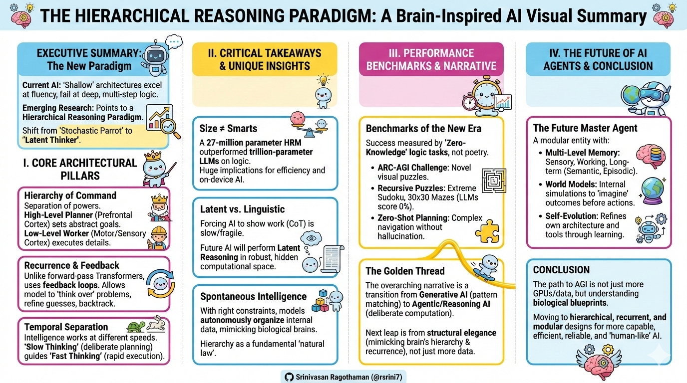
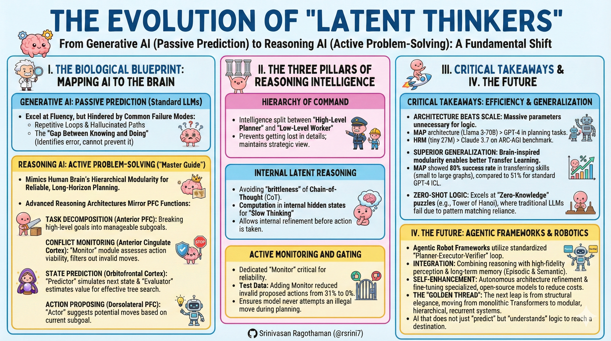

---

---

# Executive Summary: The Evolution of "Latent Thinkers"

The transition from generative AI to reasoning AI marks a fundamental shift from **"passive prediction"** to **"active problem-solving"**. While standard LLMs excel at fluency, they are hindered by **Common Failure Modes** such as repetitive loops, hallucinated paths, and a **"Gap Between Knowing and Doing"**—where a model can identify an error but cannot prevent itself from making it. The emerging "Master Guide" for next-generation AI involves mimicking the human brain’s hierarchical modularity to achieve reliable, long-horizon planning.

## I. The Biological Blueprint: Mapping AI to the Brain

The most advanced reasoning architectures now mirror specific biological functions of the **Prefrontal Cortex (PFC)**:

- **Task Decomposition (Anterior PFC):** Breaking high-level goals into manageable subgoals.
- **Conflict Monitoring (Anterior Cingulate Cortex):** A dedicated "Monitor" module that assesses the viability of actions and filters out invalid moves.
- **State Prediction (Orbitofrontal Cortex):** A "Predictor" that simulates the next state of the world and an "Evaluator" that estimates its value, enabling effective tree search.
- **Action Proposing (Dorsolateral PFC):** The "Actor" that suggests potential moves based on the current subgoal.

## II. The Three Pillars of Reasoning Intelligence

- **Hierarchy of Command:** Intelligence is split between a "High-Level Planner" and a "Low-Level Worker". This prevents the model from getting lost in nitty-gritty details and allows it to maintain a strategic view of the goal.
- **Internal Latent Reasoning:** To avoid the "brittleness" of Chain-of-Thought (CoT), models are moving toward **Latent Reasoning**, where computation happens in internal hidden states. This allows for "Slow Thinking" and internal refinement before an action is ever taken.
- **Active Monitoring and Gating:** A dedicated "Monitor" is critical for reliability. In tests, adding a Monitor module reduced invalid proposed actions from 31% to 0%, ensuring the model never attempts an illegal move during a planning task.

## III. Critical Takeaways: Efficiency and Generalization

- **Architecture Beats Scale:** Both MAP and HRM demonstrate that massive parameter counts are unnecessary for logic. A Llama 3-70B model using the MAP architecture can beat the much larger GPT-4 in planning tasks, while a tiny 27M parameter HRM can outperform Claude 3.7 on the ARC-AGI benchmark.
- **Superior Generalization:** Brain-inspired modularity allows for significantly better **Transfer Learning**. MAP showed an 80% success rate in transferring skills from small to large graphs, compared to only 51% for standard GPT-4 ICL.
- **Zero-Shot Logic:** These models excel at "Zero-Knowledge" puzzles (like the Tower of Hanoi) where traditional LLMs frequently fail due to their reliance on pattern matching rather than fundamental logic.

## IV. The Future: Agentic Frameworks and Robotics

The future of AI lies in **Agentic Robot Frameworks** that utilize a standardized **"Planner-Executor-Verifier"** loop.

- **Integration:** Future work will integrate these reasoning modules with high-fidelity perception and long-term memory (Episodic and Semantic).
- **Self-Enhancement:** Systems are being designed to autonomously refine their own architectures and fine-tune specialized, open-source models for specific sub-tasks to reduce operational costs.

The **"Golden Thread"**: The next leap in AI performance will come from structural elegance. By moving away from monolithic Transformers and toward modular, hierarchical, and recurrent systems, we are creating AI that does not just "predict" the next step, but "understands" the logic required to reach a destination.

**Related:**
- [AI-in-Next-18-Months](../economy/AI-in-Next-18-Months.md) — Covers latent-space thinking and private chains of thought as Breakthrough #3, the same paradigm shift this file's MAP/HRM examples instantiate.
- [AI-Periodic-Table](../economy/AI-Periodic-Table.md) — Lists 'Thinking models' (Th) as the emerging Models-family element; the latent-reasoning architectures here are the concrete realizations of that element.
- [The-Science-of-Scaling-AI-Agent-Systems](../../../Papers/scaling/The-Science-of-Scaling-AI-Agent-Systems.md) — Empirically grounds the 'Architecture Beats Scale' claim with 180 experiments showing modular hierarchies outperform monolithic agent scaling.
