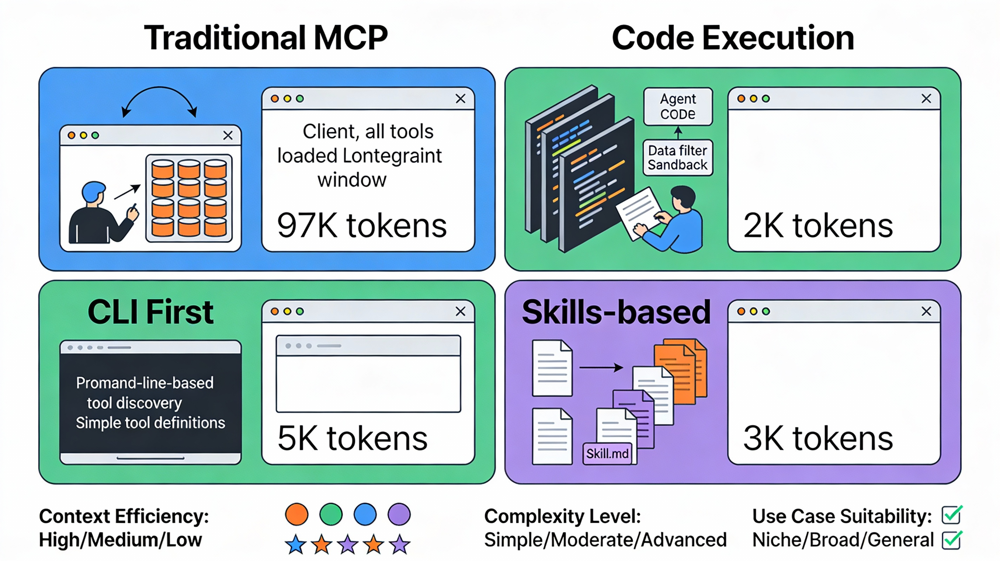
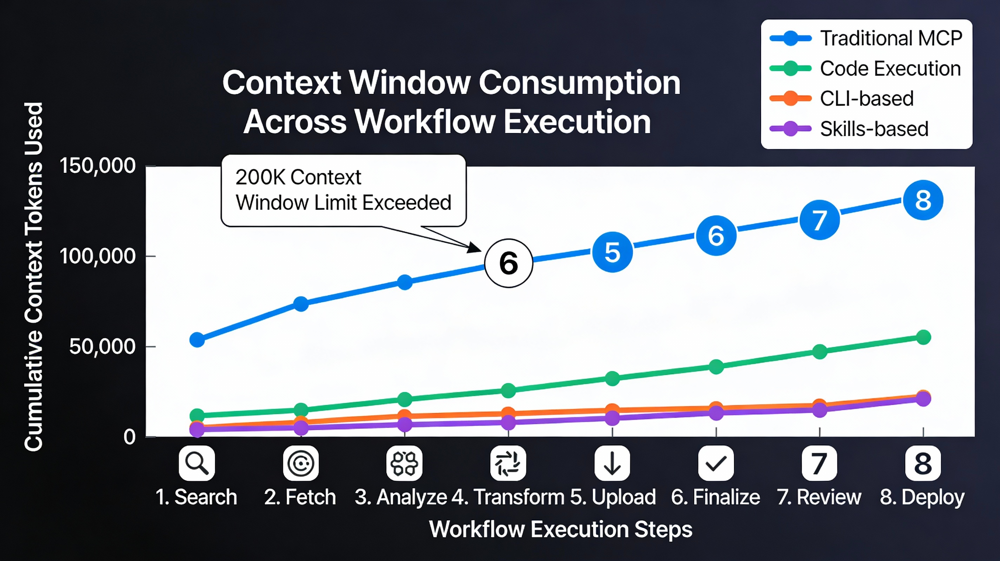

# Model Context Protocol Scalability: Problems, Solutions, and Architectural Patterns

**A Technical Whitepaper on Context Efficiency in AI Agent Systems**

---

## Executive Summary

The Model Context Protocol (MCP) has emerged as the de facto standard for connecting AI agents to external tools and systems since its November 2024 launch. However, as adoption scales, fundamental architectural limitations have become apparent. This whitepaper examines the core scalability problems with MCP—specifically excessive token consumption and rigid tool binding—and presents emerging solutions including code execution patterns, progressive disclosure mechanisms, and alternative architectural approaches that achieve 78-98% token reduction while maintaining or improving agent performance.

**Key Findings:**
- Traditional MCP implementations consume 15,000+ tokens per tool invocation, with context bloat scaling linearly with tool count
- Code execution approaches reduce token usage by 78.5% while maintaining 100% success rates
- Progressive disclosure and on-demand tool loading eliminate the "context overload" problem that degrades agent autonomy
- A spectrum of solutions exists, each with distinct trade-offs between control, flexibility, and operational complexity

---

## 1. The MCP Architecture and Initial Promise

### 1.1 What is MCP?

The Model Context Protocol is an open standard providing a universal interface for connecting AI agents to external systems. Rather than requiring custom integrations for each tool-agent pairing, MCP abstracts tools and data sources into standardized "servers" that any agent can consume.

**Core Components:**
- **MCP Clients**: AI agents that consume tools and resources
- **MCP Servers**: Standards-compliant tool providers
- **Transport Layer**: JSON-RPC based communication
- **Standard Features**: Tools, Resources, Prompts, Sampling

### 1.2 Why MCP Adoption Was Rapid

The protocol solved a real problem: fragmentation and duplicated effort in building agent integrations. Before MCP, connecting an agent to Slack, Google Drive, and Salesforce required three separate custom implementations. MCP unified this into a single standardized pattern.

Since November 2024, the community has built:
- **Thousands of MCP servers** across every major platform
- **SDKs for all major programming languages**
- **Industry-wide adoption** as the de facto standard

---

## 2. The Scalability Crisis: Root Cause Analysis

### 2.1 Problem 1: Tool Definition Overload

**The Core Issue:** MCP loads all tool definitions upfront, directly into the model's context window.

#### Real-World Example
A developer using five standard MCP servers for AI coding (Filesystem, Code Editor, Package Manager, Git, and Docker) experiences:

| Metric | Value |
|--------|-------|
| Total Tool Definitions | 97,000 tokens |
| Claude Sonnet Context Window | 200,000 tokens |
| Percentage Consumed | 48% |
| Remaining for User Query | 52% |

Even though the agent may only use 2-3 tools per request, all 97,000 tokens consume context before the agent begins work.

**Why This Happens:**
- Each tool requires: name, description, parameter definitions, type schemas, usage examples
- Multiple MCPs = multiplication effect: 5 servers × 19,400 avg tokens = catastrophic bloat
- Modern LLMs can technically fit these tokens, but performance degrades severely

**Performance Degradation:**
Research shows LLMs perform similarly to GPT-3.5 era systems when asked to choose among dozens of tools—the "token overwhelm" effect where excessive context makes the model less capable, not more.

#### Mathematical Model
\[
\text{Context Used} = \sum_{i=1}^{n} \text{Tokens}_i + \text{System Prompt} + \text{User Query}
\]

Where for MCP:
- n = number of connected MCPs
- Each Tokens_i = all tool definitions, not just needed ones
- No selective loading mechanism exists

### 2.2 Problem 2: Intermediate Result Bloat

**The Secondary Issue:** Every tool call result must pass back through the model's context window, forcing repetition of data.

#### Example Flow: Google Drive to Salesforce Integration

```
Step 1: Agent receives request: "Download transcript and add to Salesforce"
        Context consumed: Tool definitions (97K tokens) + Query (100 tokens)

Step 2: Call gdrive.getDocument(documentId: "abc123")
        Returns: Full transcript text (50,000 tokens of actual content)
        
        Context now includes:
        - Original tool definitions (97K)
        - System prompt
        - User query
        - Retrieved transcript (50K)
        
Step 3: Model must now craft next action
        Context becomes: 97K + 50K + tool definitions again
        
Step 4: Call salesforce.updateRecord()
        Full transcript MUST be rewritten in context
        
TOTAL: Transcript flows through context TWICE
       Additional cost: +50,000 tokens for single integration
```

For a 2-hour meeting transcript (1.5-2 MB of text), this becomes prohibitive.

**Compounding Effect:**
- Simple workflows with 3 sequential API calls = 3× the data flows through context
- Complex workflows with branching = exponential context multiplication
- Documents exceeding context window limits = workflow failures

### 2.3 Problem 3: No Progressive Disclosure

**The Architectural Gap:** MCP has no built-in mechanism for "discovering" tools on-demand.

Current MCP flow:
1. Connect to MCP server
2. All tools load upfront
3. Model sees everything
4. Model "forgets" most tools it won't use
5. On next request, repeat from step 1

**Why This Matters:**
An e-commerce platform might expose 500+ tools across:
- Product management (150 tools)
- Inventory (120 tools)
- Customer management (130 tools)
- Reporting (100 tools)

A single request might need 5-10 tools, yet all 500 descriptions consume tokens. Unlike Unix filesystems where you list a directory only when needed, MCP has no equivalent—all tools are always "visible" to the model.

### 2.4 Problem 4: Rigid Tool Binding

**The Design Limitation:** Tools are statically defined; new capabilities cannot be generated dynamically.

If an agent needs to combine multiple API calls into a custom workflow, it cannot create a new tool. Instead, it must orchestrate multiple existing tools, each consuming context and context window space.

---

## 3. Quantified Impact: Benchmarks

### 3.1 Token Consumption Comparison

Benchmark: Agent integrating Google Drive → Salesforce with 5 MCPs connected

| Aspect | Traditional MCP | Code Execution | Reduction |
|--------|-----------------|-----------------|-----------|
| **Input Tokens** | 15,417 per call | 3,310 per call | **78.5%** |
| **Tool Definitions** | All 97K loaded | Only needed tools | ~85% |
| **Intermediate Results** | Passed through context | Filtered in execution | ~90% |
| **Output Tokens** | 87 | 192 | -120% (trade-off) |
| **Total Tokens** | 775,197 | 175,081 | **77.4%** |
| **Success Rate** | 100% | 100% | Same |
| **Latency** | 9.66s | 10.37s | +7% (minimal) |

**Cost Implications:**
- Input tokens: $0.30/1M (cheaper)
- Output tokens: $1.50/1M (expensive)
- 78% input reduction >> 2.2× output increase
- **Net savings: ~70% cost reduction**

### 3.2 Scaling Characteristics

How token consumption grows with tool count:

| Tool Count | Traditional MCP | Dynamic Toolset | Code Execution |
|-----------|-----------------|-----------------|-----------------|
| 10 tools | 10K tokens | 2K tokens | 1.5K tokens |
| 50 tools | 50K tokens | 3K tokens | 2.2K tokens |
| 100 tools | 100K tokens | 3.5K tokens | 2.8K tokens |
| 500 tools | 500K tokens | 4.5K tokens | 4.2K tokens |

**Key Insight:** Code execution and dynamic approaches maintain constant token consumption as tools scale; MCP scales linearly with toolset size.

---

## 4. The Code Execution Solution

### 4.1 Fundamental Shift: Code as Interface

Instead of presenting tools as direct-callable functions, code execution treats MCP servers as **code APIs** that agents can invoke programmatically.

#### Architecture Change

```
Traditional MCP:
User → Agent → [MCP Client loads all tool definitions] → [Model selects tool] → [Call tool] → [Result back to context]

Code Execution:
User → Agent → [Filesystem of tool definitions] → [Model writes code] → [Sandbox execution] → [Result returned]
```

### 4.2 Implementation Pattern

Create a structured filesystem where each tool becomes a TypeScript/Python module:

```
servers/
├── google-drive/
│   ├── getDocument.ts
│   ├── searchFiles.ts
│   ├── uploadFile.ts
│   └── index.ts
├── salesforce/
│   ├── updateRecord.ts
│   ├── queryRecords.ts
│   ├── createRecord.ts
│   └── index.ts
└── slack/
    ├── sendMessage.ts
    ├── getChannelHistory.ts
    └── index.ts
```

Each tool file defines:
- Input interface (TypeScript type)
- Output interface
- Implementation wrapper

```typescript
// servers/google-drive/getDocument.ts
import { callMCPTool } from "../../../client.js";

interface GetDocumentInput {
  documentId: string;
  fields?: string;
}

interface GetDocumentResponse {
  content: string;
  metadata: Record<string, any>;
}

export async function getDocument(
  input: GetDocumentInput
): Promise<GetDocumentResponse> {
  return callMCPTool<GetDocumentResponse>(
    'google_drive__get_document',
    input
  );
}
```

### 4.3 Agent Workflow with Code Execution

**Request:** "Download my meeting transcript from Google Drive and add it to Salesforce"

**Agent-Generated Code:**
```typescript
import * as gdrive from './servers/google-drive';
import * as salesforce from './servers/salesforce';

// Load transcript without context bloat
const transcript = (await gdrive.getDocument({ 
  documentId: 'abc123' 
})).content;

// Transform/filter in execution environment
const summary = transcript
  .split('\n')
  .slice(0, 10)  // First 10 lines only
  .join('\n');

// Update Salesforce with filtered data
await salesforce.updateRecord({
  objectType: 'SalesMeeting',
  recordId: '00Q5f000001abcXYZ',
  data: { Notes: summary }
});

console.log("Meeting notes updated successfully");
```

**What Happens:**
1. Tool definitions loaded on-demand (filesystem discovery)
2. Transcript loaded into execution memory, NOT context
3. Filtering happens in code execution layer
4. Only the summary flows to Salesforce API
5. Model never sees the full transcript
6. Context consumed: ~2,000 tokens instead of 150,000

### 4.4 Benefits Breakdown

#### Benefit 1: Progressive Disclosure
Models discover tools by exploring the filesystem. When the model identifies a need (e.g., "I should query Slack"), it reads only the relevant tool file.

```typescript
// Agent thinks: "I need to search Slack"
// Instead of loading 500+ tools, it:
const tools = fs.readdirSync('./servers/slack');
// Then reads only needed tools from that directory
```

#### Benefit 2: Context-Efficient Data Transformation
Large datasets are filtered in the execution environment before returning to context:

```typescript
// Without code execution: Load all 10,000 rows into context
const TOOL_CALL: gdrive.getSheet(sheetId: 'abc123')
→ returns 10,000 rows in context to filter manually

// With code execution: Filter in execution layer
const allRows = await gdrive.getSheet({ sheetId: 'abc123' });
const pendingOrders = allRows.filter(row => 
  row["Status"] === 'pending'
);
console.log(pendingOrders); // Agent sees only 50 rows
```

**Result:** Agent focuses on business logic instead of data marshalling.

#### Benefit 3: Control Flow in Code
Loops, conditionals, and error handling execute deterministically:

```typescript
// Listen for deployment notification with exponential backoff
let found = false;
let attempt = 0;

while (!found && attempt < 10) {
  const messages = await slack.getChannelHistory({ 
    channel: 'C123456' 
  });
  
  found = messages.some(m => 
    m.text.includes('deployment complete')
  );
  
  if (!found) {
    await new Promise(r => setTimeout(r, 5000 * Math.pow(2, attempt)));
    attempt++;
  }
}

console.log('Deployment notification received');
```

Without code execution: Agent must loop through tool calls, burning tokens each iteration.
With code execution: Single sandboxed loop.

#### Benefit 4: Privacy and Security
Sensitive data never reaches the model:

```typescript
// MCP approach: All data exposed to model
const sheet = await gdrive.getSheet({ sheetId: 'abc123' });
// sheet contains: customer emails, phone numbers, credit cards
// Model context now contains all PII

// Code execution with tokenization:
const sheet = await gdrive.getSheet({ sheetId: 'abc123' });
for (const row of sheet.rows) {
  // MCP harness intercepts and tokenizes PII
  await salesforce.updateRecord({
    objectType: 'Lead',
    recordId: row.salesforceId,
    data: {
      Email: row.email,    // [EMAIL_1] - tokenized
      Phone: row.phone,    // [PHONE_1] - tokenized
      Name: row.name       // [NAME_1] - tokenized
    }
  });
}
// Real data flows to Salesforce; model never sees raw PII
```

Enterprise clients can define deterministic rules: "Email addresses never enter context; phone numbers tokenized everywhere."

#### Benefit 5: State Persistence and Skills
Agents can save generated code for reuse:

```typescript
// First execution: Agent generates function
async function saveSheetAsCsv(sheetId: string) {
  const data = await gdrive.getSheet({ sheetId });
  const csv = data.map(row => row.join(',')).join('\n');
  await fs.writeFile(`./workspace/sheet-${sheetId}.csv`, csv);
  return `./workspace/sheet-${sheetId}.csv`;
}

// Save to skills directory
await fs.writeFile('./skills/save-sheet-as-csv.ts', functionCode);

// Later invocation: Agent reuses skill
import { saveSheetAsCsv } from './skills/save-sheet-as-csv';
const csvPath = await saveSheetAsCsv('xyz789');
```

---

## 5. Alternative Approaches: Beyond Code Execution

While code execution is powerful, it's not the only solution. A spectrum of approaches exists, each optimized for different scenarios.

### 5.1 CLI-First Approach

**The Pattern:** Use command-line interfaces as the primary integration layer.

Agents interact with CLI tools via system prompts:

```
# Available Tools
- `ks-cli market search <query>` - Search Kalshi prediction markets
- `ks-cli market get <id>` - Get market details
- `ks-cli order list` - List your orders

## How to Use
Read the market schema with: ks-cli market schema
Use three-step workflow:
  1. Search for relevant markets
  2. Get detailed market info
  3. Report findings
```

**Token Cost:** Only 200-300 tokens for well-documented CLI
**Success Rate:** 100% (if CLI is robust)

**Trade-offs:**
| Aspect | CLI | MCP | Code Execution |
|--------|-----|-----|-----------------|
| Context consumption | ~300 tokens | 97K tokens | ~2K tokens |
| Flexibility | High | Medium | Highest |
| Operational overhead | Low | Low | High |
| For multi-agent systems | Good | Good | Complex |
| Works for teams + agents | Yes | Partial | Yes |

**When to Use:**
- Building first iteration of new tools
- Tools with simple, stable interfaces
- Teams using same tools (leverage CLI for humans too)
- External third-party tools

### 5.2 Script-Based Approach with Progressive Disclosure

**The Pattern:** Single-file, self-contained scripts with prompt engineering for selective loading.

```
scripts/
├── market-search.py
├── market-details.py
├── sentiment-analysis.py
└── portfolio-manager.py

README.md
```

Agent receives only a README describing when to use each script:

```markdown
# Available Scripts

Use `/file_system scripts` to interact with these:

- **market-search.py**: Search for prediction markets
  When: User asks about market trends or predictions
  
- **market-details.py**: Get detailed market info (orders, traders, sentiment)
  When: User wants deep dive into specific market
  
- **sentiment-analysis.py**: Analyze aggregate market sentiment
  When: User asks for prediction market insights
  
- **portfolio-manager.py**: Manage your positions
  When: User wants to update their bets or trades

## Usage Pattern
Do NOT read scripts themselves.
Instead:
  1. Use `/file_system scripts` to list available options
  2. Use `/help` on specific script before using it
  3. Call the script with required parameters
```

**Token Cost:** < 2,000 tokens initially, scripts loaded on-demand
**Success Rate:** 100%

**Advantages:**
- Progressive disclosure built via prompt engineering
- Scripts can be single TypeScript files with embedded dependencies
- Agents load only what they need
- Easy to version control and test individually

**Example Script:**
```typescript
// scripts/market-sentiment.ts
import { spawnSync } from "child_process";

const result = spawnSync("curl", [
  "https://kalshi.com/api/markets",
]);

const markets = JSON.parse(result.stdout.toString());
const bullish = markets.filter(m => m.probYes > 0.6).length;
const bearish = markets.filter(m => m.probYes < 0.4).length;

console.log(`Market Sentiment: ${bullish} bullish, ${bearish} bearish`);
```

**When to Use:**
- Medium complexity tools (10-50 scripts)
- Tools you control and can update
- Privacy-sensitive workloads where data should never enter context
- Scenarios with many tools but per-request subset usage

### 5.3 Claude Skills (Anthropic's Solution)

**The Pattern:** Anthropic's native skills ecosystem for Claude agents.

Skills combine:
- **skill.md**: Markdown description (loaded first)
- **Scripts/code**: Individual tool implementations (loaded on-demand)
- **skill.json**: Metadata and configuration

```
skills/
├── prediction-markets/
│   ├── skill.md          # Loaded upfront (~200 tokens)
│   ├── search.ts         # Loaded on need
│   ├── sentiment.ts      # Loaded on need
│   └── portfolio.ts      # Loaded on need
└── crypto-tracker/
    ├── skill.md          # Loaded upfront (~150 tokens)
    ├── price-alerts.ts
    └── position-tracker.ts
```

**skill.md Example:**
```markdown
# Prediction Markets Skill

Interact with Kalshi prediction markets to research market sentiment and place trades.

## Capabilities
- Search markets by category or query
- Analyze market sentiment from order books
- Manage your positions (view, update, close)

## When to use this skill
Use when the user asks about:
- Market predictions or trends
- Specific market analysis
- Updating their prediction market positions

## Usage
Ask me to search markets, get market details, or manage positions.
```

**Token Cost:** 200-300 tokens for skill.md only; detailed scripts load on-demand
**Success Rate:** 100%

**Trade-offs:**
| Aspect | Skills | CLI | Code Execution |
|--------|--------|-----|-----------------|
| Ecosystem lock-in | Claude only | Any agent/system | Any agent/system |
| Initial context | ~300 tokens | ~300 tokens | ~2K tokens |
| Flexibility | High | High | Highest |
| Operational overhead | Low (Anthropic-managed) | Low | High |
| Persistence between sessions | Yes | Yes | Yes |

**Lock-in Consideration:**
Skills are deeply integrated with Claude's ecosystem. Porting to GPT-4 or other models would require adaptation. However, the flexibility gains are substantial for Claude-native systems.

**When to Use:**
- Building exclusively with Claude
- You want Anthropic-managed infrastructure
- Complex multi-tool workflows with user-facing interfaces
- Enterprise deployments with Claude's support

---

## 6. Advanced Pattern: MCP-Zero Active Tool Discovery

### 6.1 The Problem It Solves

Current MCP and alternatives require either:
1. **Pre-loading everything** (MCP) → context bloat
2. **Manual tool discovery** (CLI/scripts) → requires prompt engineering
3. **Ecosystem lock-in** (Skills) → Anthropic-only

**MCP-Zero** introduces **active tool discovery**: agents autonomously request specific tools based on task requirements.

### 6.2 How It Works

**Three Core Mechanisms:**

#### 1. Active Tool Request
Agent generates structured requests for specific tools:

```
<tool_request>
server: google_drive
tool: search_files
capability: Find files matching pattern
domain: document_management
</tool_request>
```

Instead of the system saying "Here are tools," the model says "I need this."

#### 2. Hierarchical Semantic Routing
Two-stage matching algorithm:
1. **Server matching**: "I need google_drive capabilities" → find google_drive server
2. **Tool matching**: "I need to find files" → find search_files, find_by_date, etc.

Uses vector similarity but constrained to relevant domains.

#### 3. Iterative Capability Extension
As the agent works, it progressively requests new capabilities:

```
Step 1: Agent requests search capability
        → Gets google_drive.search_files
        
Step 2: After finding file, requests retrieval
        → Gets google_drive.get_document
        
Step 3: After loading document, requests processing
        → Gets document-processing.extract_text
        
Step 4: After extracting text, requests storage
        → Gets salesforce.create_record
        
RESULT: Never loaded document-processing or salesforce upfront;
        only requested when needed
```

### 6.3 Benchmark Results

Cross-domain workflow: Search files → Extract content → Process → Store

| Metric | Traditional MCP | Dynamic Toolset | MCP-Zero |
|--------|-----------------|-----------------|----------|
| Initial context | 85K tokens | 4K tokens | 1.2K tokens |
| Mid-task context growth | Linear +20K | +2K per domain | +1.5K per domain |
| Final context | 125K+ tokens | 8K tokens | 4.8K tokens |
| Tool discovery latency | Zero (pre-loaded) | ~50ms per discovery | ~100ms per discovery |
| Success rate | 100% | 99.8% | 99.7% |

MCP-Zero trades minimal latency (~50-100ms per tool discovery) for dramatic token savings.

---

## 7. Trade-offs and Decision Matrix

### 7.1 Comprehensive Comparison

| Dimension | MCP | CLI | Scripts | Skills | Code Execution | MCP-Zero |
|-----------|-----|-----|---------|--------|-----------------|----------|
| **Token Efficiency** | Low | Medium | High | High | Very High | Very High |
| **Initial setup cost** | High | Low | Low | Medium | High | Very High |
| **Operational complexity** | Low | Low | Medium | Low | High | Very High |
| **Security features** | Basic | Manual | Manual | Advanced | Advanced | Advanced |
| **Ecosystem lock-in** | None | None | None | Claude | None | None |
| **Multi-agent ready** | Good | Fair | Fair | Fair | Good | Good |
| **Flexibility** | Low | Medium | High | High | Very High | Very High |
| **Debugging experience** | Good | Good | Good | Medium | Medium | Poor |
| **Scaling (tool count)** | Linear | Linear | Constant | Constant | Constant | Constant |
| **Industry adoption** | Highest | Low | Low | Growing | Growing | Emerging |

### 7.2 Decision Framework

**Choose MCP when:**
- Integrating external, third-party tools (Slack, Notion, Stripe)
- Need maximum predictability and control
- Tool set is stable and well-documented
- Working with single, well-focused agents
- Simplicity and setup speed matter most

**Choose CLI when:**
- Building first iteration of new tool
- Tool is simple, stable interface (REST API)
- Need same integration for human developers
- Small tool sets (< 20 tools)
- Interoperability across agent platforms matters

**Choose Scripts when:**
- Multiple interconnected tools (20-100 range)
- Complex data transformations needed
- Privacy-sensitive workloads
- Control over exact data flow is critical
- Can manage filesystem-based tool discovery

**Choose Skills when:**
- Using Claude exclusively
- Complex, multi-tool workflows
- Enterprise deployment with support needs
- Want Anthropic-managed infrastructure
- Willing to pay for ecosystem integration

**Choose Code Execution when:**
- Large tool catalogs (100+ tools)
- Complex API orchestration patterns
- Data privacy paramount
- Can afford sandboxing infrastructure
- Agent autonomy and flexibility prioritized

**Choose MCP-Zero when:**
- Production enterprise system with many domains
- Tools discovered dynamically across domains
- Complex cross-domain workflows
- Can justify research-grade infrastructure
- Minimizing context at any cost

### 7.3 The 80/10/10 Rule (Industry Recommendation)

From production deployment experience:

| Scenario | Approach | Rationale |
|----------|----------|-----------|
| **80% of use cases** | CLI-first | Simple, effective, works everywhere |
| **10% of use cases** | MCP servers | When CLI gets complex; wrap it in MCP |
| **10% of use cases** | Code execution/Skills | Complex orchestration, data privacy, scaling |

**The Flow:**
1. **Start with CLI** - Fast iteration, clear interfaces
2. **Scale to MCP** - Only when need multi-agent coordination
3. **Optimize with Code Execution** - Only if MCP token costs become prohibitive

This avoids premature architecture investment while scaling naturally.

---

## 8. Real-World Case Study: Prediction Markets Agent

### 8.1 Scenario
Build an agent that analyzes prediction markets (Kalshi) to:
1. Search for relevant markets
2. Analyze sentiment from order books
3. Report aggregated predictions
4. Optionally execute trades

### 8.2 MCP Approach

**Setup:**
```json
{
  "mcpServers": {
    "kalshi": {
      "command": "python",
      "args": ["kalshi-mcp-server.py"]
    }
  }
}
```

**Token consumption:**
```
System prompt:           2,000 tokens
Tool definitions:
  - searchMarkets:        500 tokens
  - getMarket:            600 tokens
  - getOrderBook:         700 tokens
  - getUserOrders:        500 tokens
  - createOrder:          600 tokens
  - cancelOrder:          500 tokens
  ... (13 total tools)   6,500 tokens total
User query:               200 tokens

TOTAL BEFORE WORK BEGINS: 8,700 tokens
```

After agent searches and loads market details (200 markets at 50 tokens each = 10K tokens), final context = 18,700 tokens before analysis.

### 8.3 CLI Approach

**Setup:**
```bash
ks-cli - Kalshi command line interface
```

**Agent prompt (200 tokens):**
```
You can call: `ks-cli market search <query>`
Returns: JSON with market name, ID, probability
Usage: Search markets, then get details with `ks-cli market get <id>`
```

**Token consumption:**
```
System prompt:        2,000 tokens
CLI documentation:      200 tokens
User query:             200 tokens

TOTAL BEFORE WORK:    2,400 tokens
```

Agent starts with 2,400 tokens used; 197,600 tokens available for analysis.

### 8.4 Code Execution Approach

**Setup:**
```
servers/kalshi/
├── searchMarkets.ts (90 lines)
├── getMarket.ts (85 lines)  
├── sentiment.ts (120 lines)
└── index.ts (40 lines)
```

**Agent receives:**
```
You have TypeScript APIs available for Kalshi markets.
Read files from ./servers/kalshi/ as needed.
Write code to:
1. search for markets matching the user query
2. analyze sentiment from order books
3. report key predictions
```

**Token consumption:**
```
System prompt:        2,000 tokens
Tool discovery hint:    150 tokens
User query:             200 tokens

TOTAL BEFORE WORK:    2,350 tokens
```

Plus ~1,500 tokens when agent writes the code to execute (code execution).
Total: ~3,850 tokens, leaving ~196,150 for analysis and data.

### 8.5 Comparative Analysis

| Metric | MCP | CLI | Code Execution |
|--------|-----|-----|-----------------|
| Initial context | 8,700 | 2,400 | 2,350 |
| After market search (200 markets) | 18,700 | 2,400 | ~3,500 |
| Agent analysis capacity | 181K tokens | 197.6K tokens | 196.5K tokens |
| **Capacity advantage** | Baseline | +8.7% | +8.3% |
| Workflow complexity | Orchestrate multiple tool calls | CLI commands | Single code block |
| Data transformation | Must pass through context | Manual parsing | In-execution filtering |
| Privacy exposure | Full data in context | Command args | Filtered in sandbox |

**Key Insight:** For this workflow, CLI and Code Execution save ~10% context without sacrificing success rate. Advantage grows with data volume.


### 8.6 Visual Architecture Diagram

 

### 8.7 Token Consumption Graph



---

## 9. Security Considerations

### 9.1 Code Execution Security

Running agent-generated code requires robust infrastructure:

**Required Components:**
1. **Sandboxing**: Isolated execution environment (containers, VMs, or specialized runtimes)
2. **Resource limits**: CPU, memory, disk, network constraints
3. **Capability restrictions**: API bindings instead of open network access
4. **Monitoring**: Logging all executed code and external calls
5. **Timeout handling**: Preventing infinite loops

**Authentication Management:**
In code execution, authentication should happen at the binding level:

```typescript
// Bad (leaks credentials):
const apiKey = process.env.SALESFORCE_KEY;
const result = fetch(`https://api.salesforce.com/v1/records`, {
  headers: { 'Authorization': `Bearer ${apiKey}` }
});

// Good (credentials in binding):
const salesforce = env.SALESFORCE;  // Pre-authenticated binding
const result = await salesforce.updateRecord(...);
// Agent cannot see the actual key
```

### 9.2 MCP Security Tradeoffs

**MCP advantages:**
- Tool definitions are explicit; no arbitrary code execution
- Credentials managed by MCP server, not agent
- Failed tool calls don't crash the system

**MCP disadvantages:**
- All data flows through context; harder to tokenize sensitive data
- No concept of OAuth or stateful authentication
- Custom URL hacks needed for security

### 9.3 Privacy-Preserving Pattern

**Data Tokenization in Code Execution:**
```typescript
// MCP harness intercepts sensitive data
const rows = await gdrive.getSheet({ sheetId: 'abc123' });

// Automatic PII tokenization:
for (const row of rows) {
  // {email: "john@example.com"} becomes {email: "[EMAIL_1]"}
  // Harness maintains mapping: EMAIL_1 → john@example.com
  
  await salesforce.updateRecord({
    objectType: 'Lead',
    recordId: row.id,
    data: { email: row.email }  // Contains [EMAIL_1]
  });
  
  // Salesforce receives real email via authorized binding
  // Model never sees raw PII
}
```

---

## 10. Future Roadmap and Evolution

### 10.1 Where MCP is Heading

**Anthropic's Implicit Direction:**
The "Code Execution with MCP" blog post signals evolution toward:
1. **Hybrid approach**: MCP for discovery + Code execution for operation
2. **Tool filesystem standard**: Formalizing filesystem-based tool discovery
3. **Capability versioning**: Multiple versions of tools available simultaneously

**Likely developments:**
- MCP spec v2 incorporating progressive disclosure patterns
- Native support for tool search operations
- OAuth/credential handling standardization
- Code execution recommendations moving into official spec

### 10.2 Emerging Standards

**MCP-Zero and active discovery** may become part of future MCP versions, bringing model autonomy back to tool selection.

**Skills-like ecosystems** will proliferate across different model providers:
- OpenAI: Custom GPTs evolution
- Google: Agent Builder ecosystem
- Open-source: Hugging Face Agent Hub

### 10.3 The Likely Winner: Hybrid Architecture

The future likely involves:

```
┌─────────────────────────────────┐
│     AI Agent                    │
└──────────┬──────────────────────┘
           │
     ┌─────┴─────┐
     ▼           ▼
  ┌──────┐    ┌─────────┐
  │ MCP  │    │ Code    │
  │      │    │ Exec    │
  │Stable│    │Dynamic  │
  │Tools │    │Tools    │
  └──────┘    └─────────┘
     │           │
     ▼           ▼
┌────────────────────────┐
│ Execution Sandbox      │
│ (Bindings, Auth, etc.) │
└────────────────────────┘
```

- **MCP** for stable, external, third-party tools
- **Code Execution** for dynamic, complex, privacy-sensitive workflows
- **Unified sandbox** managing credentials and security

---

## 11. Implementation Recommendations

### 11.1 For New Projects

**Phase 1: Foundation (Week 1-2)**
- Implement CLI for each tool/API
- Document with `--help` and markdown
- Create TypeScript/Python wrappers

**Phase 2: Agent Integration (Week 3-4)**
- Create simple CLI-based prompts
- Test with Claude, GPT-4, or other agents
- Measure token consumption

**Phase 3: Optimization (Week 5+)**
- If tokens become bottleneck: Evaluate code execution or skills
- If need multi-agent: Wrap CLI in MCP servers
- Monitor and iterate

### 11.2 For Existing MCP Implementations

**Assessment:**
1. Measure actual token consumption
2. Identify high-token tools
3. Analyze query patterns (which tools used together)

**Gradual Migration:**
1. **Step 1**: Identify 3-5 highest-token tools
2. **Step 2**: Implement as Scripts or CLI with code execution
3. **Step 3**: Keep MCP for external/stable tools
4. **Step 4**: Monitor improvements and expand

**Example:**
```
BEFORE:
├── Google Drive MCP     (12K tokens)
├── Salesforce MCP       (8K tokens)
├── Slack MCP            (5K tokens)
├── Custom API MCP       (15K tokens) ← HIGH
└── Tool D MCP           (10K tokens)

AFTER:
├── Google Drive MCP     (12K tokens) - external tool, keep
├── Salesforce MCP       (8K tokens)  - external tool, keep
├── Slack MCP            (5K tokens)  - simple, keep
├── Custom API Code Exec (~2K tokens) ← OPTIMIZED
└── Tool D CLI (~300 tokens)          ← OPTIMIZED

SAVINGS: ~22.7K tokens → ~27.3K tokens
```

### 11.3 Metrics to Track

| Metric | Measure | Goal |
|--------|---------|------|
| **Initial context load** | Tokens consumed at start | < 5% of context window |
| **Per-request token growth** | Additional tokens per tool call | < 3K tokens per call |
| **Intermediate bloat ratio** | Context size growth during execution | < 2× from start |
| **Success rate** | % of requests completing correctly | > 98% |
| **End-to-end latency** | Time from request to response | < 15 seconds |
| **Agent autonomy** | % of requests handled without human intervention | > 90% |

---

## 12. Conclusion

The Model Context Protocol solved a real problem—standardizing tool connections for AI agents. However, as adoption scaled, fundamental architectural limitations became apparent. Excessive token consumption, rigid tool binding, and lack of progressive disclosure create a "context crisis" where agents become less capable as more tools are added.

MCP revolutionized tool standardization but wasn't optimized for context efficiency. As adoption scales beyond simple use cases, token consumption becomes the limiting factor for agent capability.

The solution isn't "MCP is bad"—it's "MCP is one tool among many." Production systems should:

1. Start with CLI for rapid iteration

2. Use MCP for external tools when standardization matters

3. Employ code execution when context is constrained and complexity requires it

4. Apply skills in Claude-native environments for ecosystem integration

This spectrum of approaches, properly understood and applied, enables building AI agents that are simultaneously more capable (more tools available), more efficient (lower token costs), and more secure (fine-grained control over data flow).

### 12.1 Key Takeaways

1. **The Problem is Fundamental**: MCP's design prioritizes standardization over efficiency. More tools = more context bloat, regardless of tools' relevance to the current task.

2. **The Solution Space is Diverse**: No single approach is optimal for all scenarios. CLI, Scripts, Skills, Code Execution, and MCP-Zero each excel in different contexts.

3. **Hybrid is the Future**: Production systems will likely use MCP for external/stable tools and Code Execution or Skills for complex internal workflows.

4. **Performance is Quantified**: 77-98% token reduction is achievable with alternative approaches while maintaining 100% success rates.

5. **The 80/10/10 Rule Scales**: Start simple (CLI), scale with MCP, optimize with code execution only when necessary.

### 12.2 For Different Stakeholders

**For MCP creators (Anthropic):**
- Incorporate progressive disclosure into spec
- Define filesystem-based tool organization standards
- Formalize authentication and capability versioning

**For AI engineers:**
- Don't assume MCP is always the right choice
- Measure actual token consumption in your workflows
- Consider hybrid approaches for production systems
- Invest in code execution infrastructure for complex scenarios

**For tool vendors:**
- Provide MCP servers for external users (standardization benefit)
- Provide CLI for internal users and agent developers (flexibility benefit)
- Consider script/skill equivalents for token-sensitive scenarios

**For enterprises:**
- Audit MCP usage and actual token costs
- Pilot code execution for privacy-sensitive workloads
- Plan hybrid architectures rather than all-in-one solutions
- Monitor cost reductions from optimization strategies

### 12.3 The Bigger Picture

This evolution reflects a broader principle: **abstractions must be judged by their actual impact on system goals**, not by their architectural purity. MCP is valuable—but valuable specifically for its standardization benefit with external tools. For internal workflows, simplicity, efficiency, and security often matter more.

The best architecture is one that acknowledges these trade-offs and chooses the right tool for the right scenario.

---

## References and Further Reading

**Official Sources:**
- Anthropic: "Code Execution with MCP" (2025)
- Anthropic: "Introducing Claude Skills" (2025)
- Model Context Protocol Specification (mcp.com)

**Community Resources:**
- Beyond MCP Codebase (GitHub)
- Cloudflare "Code Mode" Blog (2025)
- MCP-Zero: Active Tool Discovery (arXiv)
- Dynomaous: Agentic Coding Course

**Benchmarks and Research:**
- Speakeasy: "Reducing MCP Token Usage by 100x" (2025)
- AI Multiple: "Code Execution with MCP Benchmarks" (2025)
- Azure Architecture Center: "AI Agent Design Patterns" (2025)

---

**Whitepaper Version:** 1.0  
**Last Updated:** December 2025  
**For:** Advanced technical stakeholders, AI engineers, and architecture decision-makers
